# 图算法

## 图基础知识

**子图**: subgraph, 是一张图的一部分, 当我们需要对图中的特定节点, 特定关系, 或者特定标签或者属性进行特定分析时, 子图就有用

**路径(Path)**: 一组节点及他们的关系集合.

连通图(connected graph): 指图内任意两个节点间, 总能找到一条路径连接他们, 否则, 为非连通图(disconnected graphs)

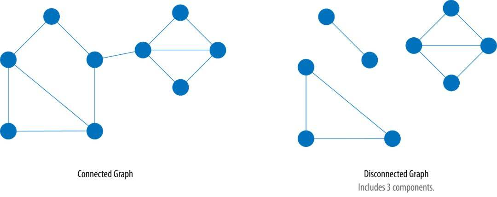

未加权图(unweighted graphs): 的节点和边上没有权重. 基本的图算法可以通过处理权重来代表关系的强度. 关于加权图的一个典型用途是路径寻找算法.

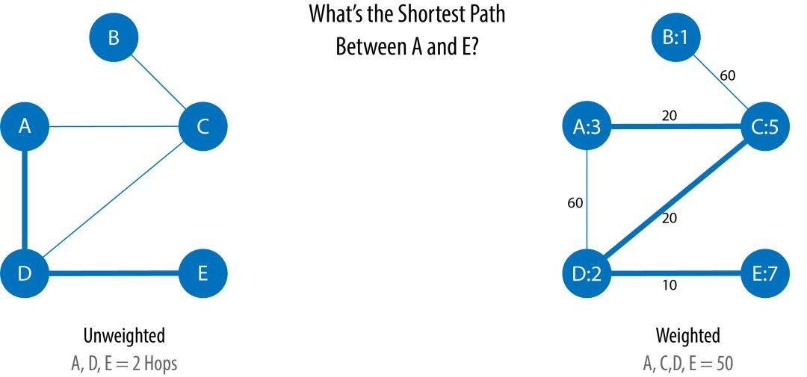

如果没有权重, 计算路径时, 实则在计算关系(relation, 也称Hop)的数量. 那么在上图左边, 我们可找到A和E之间的最短距离为2, 经过D点. 如果上图右边所示, 边被赋予了权重, 用以代表节点之间的物理距离. 那么我们可以找到 A 和 E 之间的最短距离是 50 KM，需要经过 C 和 D 两个点。而此时，在未加权图中计算的最短路径 A-D-E 距离为 70 KM，比我们找到的路径 A-C-D-E 距离远。


非循环图: 循环指一些特殊的路径, 他们的起点和终点是同一个节点. 在非循环图中, 不存在循环路径, 相反则为循环图. 如下图所示, 有向图和无向图都可能包含循环. 图中graph 1是一个典型的DAG(Directed Acyclic Graph, 有向无循环图), 并且DAG通常有叶子节点.


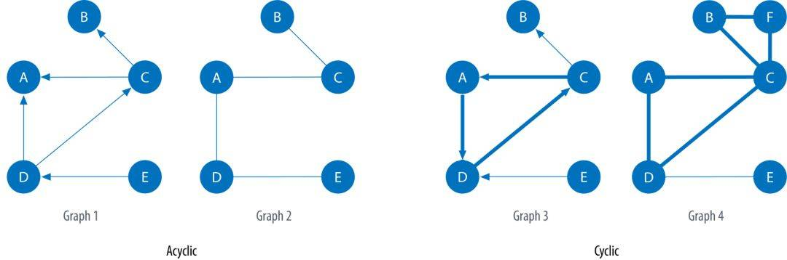

循环图在图中非常常见. 有时为了提高处理效率, 会将循环图转为非循环图(通过减除一些关系). 

## 图算法

关注的三类核心的图算法: 路径搜索(Pathfinding and search), 中心性计算(Centrality Computation)和社群发现(Community Detection)

**图搜索算法**: 探索一个图, 用于一般发现或显示搜索, 这些算法通过从图中找到很多路径, 但并不期望这些路径是计算最优的. 图搜索包括广度优先搜索和深度优先搜索, 他们是遍历图的基础.

**DFS and BFS**
广度优先搜索(Breadth First Search)和深度优先搜索(Depth First Search). BFS从选定的节点出发, 优先访问所有一度关系的节点之后再继续访问二度关系节点, 依次类推. DFS从选定的节点出发,选择任一邻居之后, 尽可能沿着边遍历下去, 直到不能前进之后在回溯.


遍历或搜索是可在执行的基本操作之一. 在广度优先搜索中(BFS), 我们从一个特定的节点开始, 在进入下一层的顶点之前探索它当前深度的所有邻居. 与树不同, 图可以包含循环(第一个和最后一个顶点是相同的路径). 因此, 我们必须跟踪访问过的顶点. 在实现BFS时, 我们使用队列数据结构.

上图表示一个示例图的BFS的动画, 注意顶点时如何被发现(黄色)和被访问(红色)

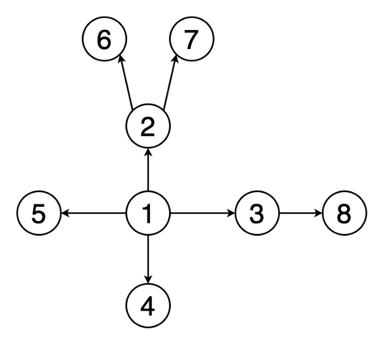

在深度优先搜索(DFS)中, 我们从一个特定的顶点开始, 在回溯(backtracking)之前沿着每个分支尽可能地搜索. 在DFS中, 我们还需要跟踪访问的顶点. 在实现DFS时, 使用堆栈数据结构来支持回溯.

**最短路径**
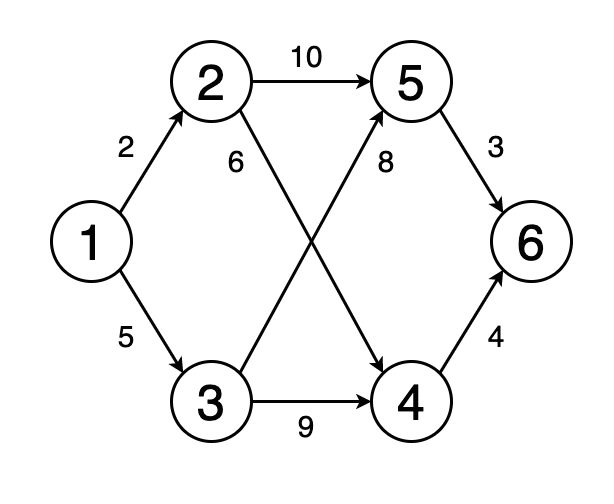

从一个顶点到另一个顶点的最短路径是图中应该移动的边的权值总和最小的路径.包括有Dijkstra的最短路径算法, bellman'算法


**最小生成树**

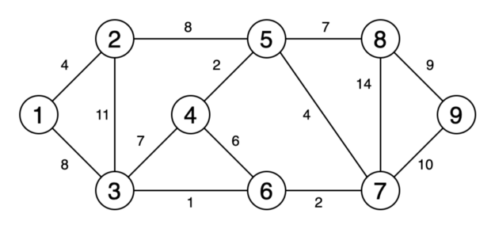


最小生成树(Minimum Spanning Tree) 算法从一个给定的节点开始, 查找其所有可到达的节点, 以及将节点与最小可能权重连接在一起, 形成一组关系. 它以最小的权重从访问过的节点遍历到下一个访问的节点, 避免循环.

最常用的最小生成树来自于Prim算法, 其余Dijkstra的最短路径类似, 所不同的是, Prim算法每次寻找最小权重访问到下一个节点, 而不是累计权重和. 并且, Prim算法允许边的权重为负数.

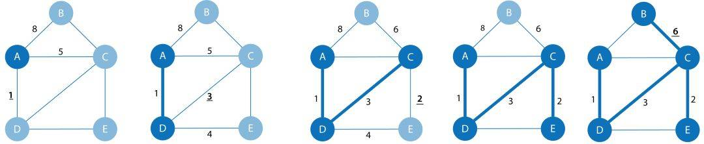

上图是最小生成树算法的步骤分解, 算法最终用最小的权重图进行了遍历, 并且遍历的过程中, 不产生环.

**拓扑排序**
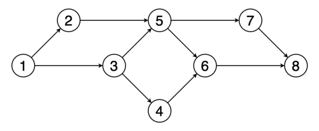

图的拓扑排序是对他的顶点进行线性排序, 因此排序中的每条有向边(u,v), 顶点u都在v之前.

图8显示了顶点(1,2,3,5,4,6,7,8)的拓扑排序示例. 可以看到顶点5应该在顶点2和3之后. 类似地, 顶点6应该在顶点4和5之后. kahn算法基于深度优先搜索的算法.

**中心性算法**
中心性算法 (centrality Algorithms) 用于识别图中特定节点的角色及其对网络的影像. 中心性算法能够帮助我们识别最终的节点, 帮组我们了解组图动态. 

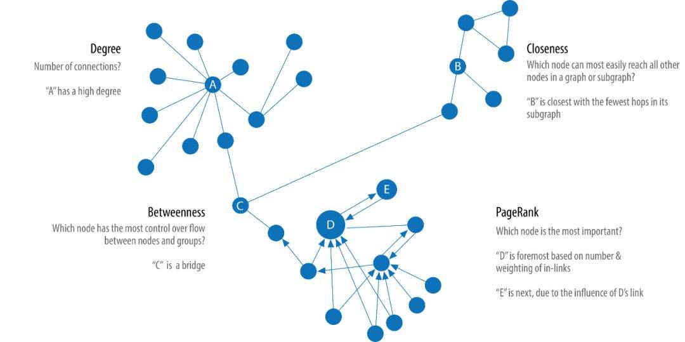

**Degree centrality**(度中心性, 以度作为标准的中心性指标). Degree统计了一个节点直接相连的边的数量, 包括出度和入度. Degree可以简单理解为一个节点的访问机会的大小. 例如, 一个社交网络中, 一个拥有多个degree的人(节点)更容易与人发生直接接触, 也更容易获得流感.

**closeness Centrality**(紧密性中心性)是一种检测能通过子图有效传播信息的节点方法. 紧密性中心性计量一个节点到所有其他节点的紧密型(距离的倒数), 一个拥有高紧密性中心性是节点到所有其他节点距离和的倒数

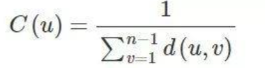

其中U是我们要计算紧密性中心性的节点, n是网络中总的节点数, d(u,v)代表节点u与节点v的最短路径距离. 

**PageRank**
在所有的中心性算法中, PageRank是最著名的一个, 它测量节点传递影像的能力. Page考虑系节点的直接影像, 也考虑“邻居”的影像. 例如, 一个节点拥有一个有影像力的“邻居”, 可能比拥有很多不太有影像力的“邻居”更有影响力. PageRank统计到节点的传入关系的数量和质量, 从而决定该节点的重要性.

# 数字图像处理中的傅里叶(DFT/FFT)

## 傅里叶级数

在数学中, 傅里叶级数(Fourier series)是把类似波的函数表示成简单正弦波的方式. 及其能将任何周期性函数或周期信号分级成一个(可能由无穷个元素组成的)简单震荡函数的集合, 即正弦函数或余弦函数(或者, 等价地使用复数), 从数学的定义来看, 是这样的:

设x(t)是一个周期信号, 其周期为T. 若x(t)在一个周期的能量是有限的, 有即
$$
\int_{-\frac{T}{2}}^{\frac{T}{2}}|x(t)|^{2} d t<\infty
$$
则，可以将 $x(\mathrm{t})$ 展开为傅立叶级数。怎么展呢? 计算如下:
$$
X(k \omega)=\frac{1}{T} \int_{-\frac{T}{2}}^{\frac{T}{2}} e^{-j k \omega t} d t
$$
公式中的k表示第k次谐波,( 对一个方波的前4次谐波合成动图, 这里的合成的概念是时域上的叠加概念):

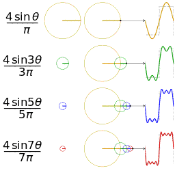


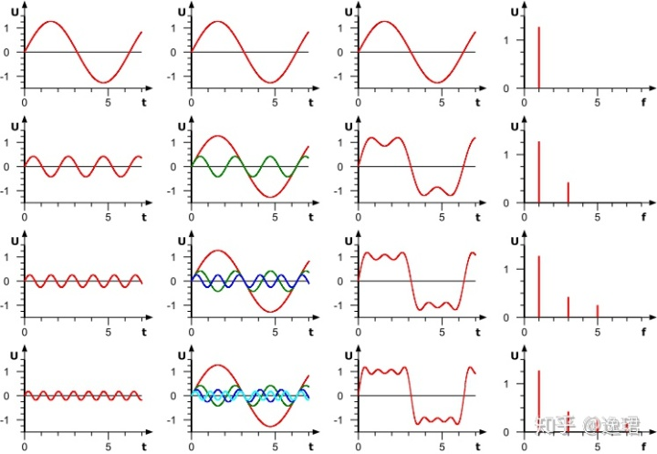

附: 

傅里叶证明: 任意周期函数都可以写成三角函数之和. 
$$
f(x)=a_{0}+\sum_{n=1}^{\infty}\left(a_{n} \cos \left(\frac{2 \pi n}{T} x\right)+b_{n} \sin \left(\frac{2 \pi n}{T} x\right)\right), a_{0} \in \mathbb{R}
$$


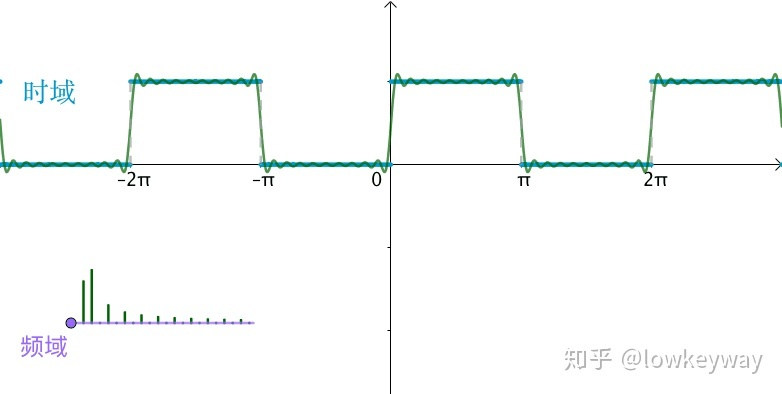

## 傅里叶变换

傅里叶变换(Fourier transform) 是一种数学变换, 它将一个函数(通常是一个时间的函数, 或一个信号)分解成它的组成频率, 例如用组成音符的音量和频率表示一个音乐和弦. 其本质是一种线性积分变换, 用于信号在时域(空域)和频域之间的变换. 其目的是把时域内的信号变换到频域中, 这样更容易处理.

对于连续时间信号x(t), 若x(t)在时间维度上可积, 即
$$
\int_{-\infty}^{\infty}|x(t)|^{2} d t<\infty
$$
那么， $x(t)$ 的傅立叶变换存在，且其计算式为:
$$
X(j \omega)=\frac{1}{T} \int_{-\infty}^{\infty} x(t) e^{-j \omega t} d t
$$
其反变换为:
$$
X(t)=\frac{1}{2 \pi} \int_{-\infty}^{\infty} X(j \omega) e^{-j \omega t} d \omega
$$
上面公式可以理解为: 在度量空间可积, 可理解成其度量空间能量有限, 也即对其自变量积分(相当于求面积)是一个确定值, 那么这样的函数或信号就可以进行傅里叶变换展开, 展开得到的$X(jw)$就变成是频域的函数, 如果对频率$w$将函数值绘制出曲线就是我们说所的频谱图, 而其反变换就比较好理解了.如果知道一个信号或者函数谱密度函数$X(jw)$就可以对应还原出其时域的函数, 也能绘制出时域的波形图.

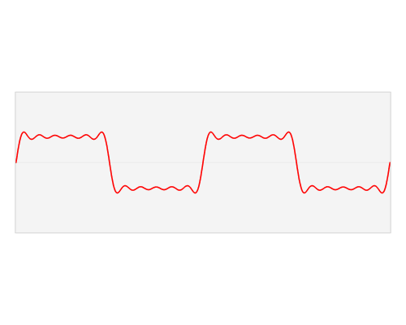


**复数域**

复数域C: $\sqrt{-1}=i$, 复数平面有

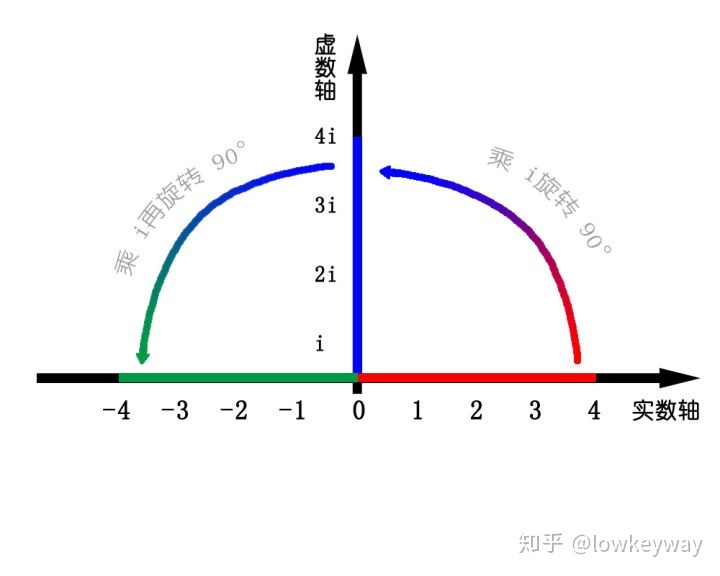

理解复数平面对实数轴的补充后, 还要了解复数的两个概念模和幅角

**欧拉公式**
$对于任意 \theta \in R, e^{i\theta}=cons \theta + isin\theta$

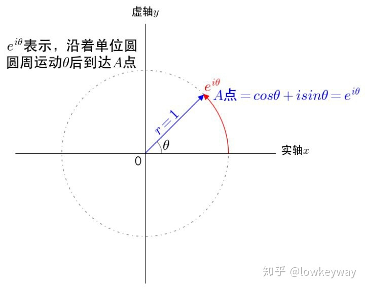

有了傅里叶级数就好办多了，这一堆的 $s i n$ 和cos函数多碍眼，我们不是有高斯公式吗? 把他们都化 到复数域上。
根据 $\left\{\begin{array}{l}e^{i \theta}=\cos \theta+i \sin \theta \\ e^{-i \theta}=\cos \theta-i \sin \theta\end{array} \Rightarrow\left\{\begin{array}{l}\cos \theta=\frac{e^{i \theta}+e^{i \theta}}{2} \\ \sin \theta=\frac{e^{i \theta}-e^{i \theta}}{2 i}\end{array}\right.\right.$, 把 $\cos \theta$ 和 $\sin \theta$ 代到傅里叶级 数中，得到:
$$
f(x)=\sum_{n=-\infty}^{\infty} c_{n} \cdot e^{i \frac{2 \pi n x}{T}} \text { 其中, } c_{n}=\frac{1}{T} \int_{x_{0}}^{x_{0}+T} f(x) \cdot e^{-i \frac{2 \pi n x}{T}} d x
$$
贴最终换算公式 (表示工程人员干万别痴迷于自己公式推导，理解至上)
$$
\left.\begin{array}{r}
c_{n}=\frac{1}{T} \int_{x_{0}}^{x_{0}+T} f(x) \cdot e^{-i \frac{2 \pi n x}{T}} d x \\
T=\infty
\end{array}\right\} \Longrightarrow F(\omega)=\frac{1}{2 \pi} \int_{-\infty}^{\infty} f(x) e^{-i \omega x} d x
$$
从此时域有了到频域的桥梁。
$$
f(x) \Leftrightarrow=>F(X)
$$
如果我们定义一个单频波, 可以用正弦的形式表示
$$
y = A sin(wx+\varphi ）)
$$
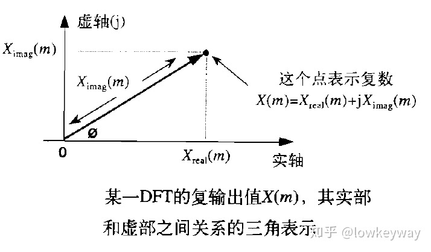

-   振幅 $(A): X_{\mathrm{mag}}(m)=|X(m)|=\sqrt{X_{\text {real }}(m)^{2}+X_{\text {inag }}(m)^{2}}$

-   相位 $(\varphi): X_{\phi}(m)=\tan ^{-1}\left(\frac{X_{\text {imag }}(m)}{X_{\text {real }}(m)}\right)$

-   频率 (角速度 $\omega): \mathrm{f}(\mathrm{m})=\frac{m f_{s}}{N}$

### 图像中的频谱

频率: 对于图像来说就是指颜色值的梯度, 即灰度级的变换速度

幅度: 可以简单的理解为频率的权, 即该频率所占的比例.

1.   对于一个正弦信号, 如果它的幅度变换很快, 我们称之为高频信号, 如果变换非常慢, 称之为低频信号. 迁移到图像中, 图像哪里的幅度变化非常大呢? 边界点或者噪声. 所以我们说边界点和噪声是图像中的高频分量(这里的高频是指变化非常快, 不是出现的次数多), 图像的主要部分集中在低频分量.
2.   由于图像变换的结果原点在边缘部分, 不容易显示, 所以将原点移动到中心部分, 那么结果便是中间的一个亮点操着周围发散开来, 越远中心位置的能量越低(越暗)
3.   傅里叶变换的结果是复数, 这也显示了傅里叶变换是一副实数图像和虚数图像叠加或者是幅度图像和相位图像叠加的结果.
4.   原图

### Numpy实现傅里叶变换

Numpy中FFT包提供了函数`np.fft.fft2()`可以对信号进行快速傅里叶变换, 其函数原型如下所示, 该输出结果是一个复数组

`fft(a, s=None, axes=(-2,-1), norm=None)`

-   a 表示输入图像, 阵列状的复杂数组
-   s 表示整数序列, 可以决定输出数组的大小. 输出可选形状(每个转换轴的长度), 其中s[0] 表示轴0, s[1]表示轴1. 对应`fit(x,n)` 函数中的n, 沿着每个轴, 如果给定的形状小于输入形状, 则将剪切输入. 如果大于则输入将用0填充. 如果为给定‘s’, 则使用沿‘axles’指定的轴的输入形状.
-   axes表示整数序列, 用于计算FFT的可选轴. 如果未给出, 则使用最后两个轴. “axes”中的重复索引表示对该轴执行多次转换, 一个元素列意味着执行一维FFT
-   norm包括None和ortho两个选项, 规范化模式. 默认值为无.

Numpy中fft模块有很多函数, 相关函数如下

```python
#计算一维傅里叶变换
numpy.fft.fft(a, n=None, axis=-1, norm=None)
#计算二维的傅里叶变换
numpy.fft.fft2(a, n=None, axis=-1, norm=None)
#计算n维的傅里叶变换
numpy.fft.fftn()
#计算n维实数的傅里叶变换
numpy.fft.rfftn()
#返回傅里叶变换的采样频率
numpy.fft.fftfreq()
#将FFT输出中的直流分量移动到频谱中央
numpy.fft.shift()
```

下面的代码是通过Numpy库实现傅里叶变换, 调用`np.fft.fft2()`快速傅里叶变换的大频率分布, 接着调用`np.fft.fftshift()`函数中心位置转移至中间, 最终通过matplotlib显示效果图.

```python
# -*- coding: utf-8 -*-
import cv2 as cv
import numpy as np
from matplotlib import pyplot as plt

#读取图像
img = cv.imread('test.png', 0)

#快速傅里叶变换算法得到频率分布
f = np.fft.fft2(img)

#默认结果中心点位置是在左上角,
#调用fftshift()函数转移到中间位置
fshift = np.fft.fftshift(f)       

#fft结果是复数, 其绝对值结果是振幅
fimg = np.log(np.abs(fshift))

#展示结果
plt.subplot(121), plt.imshow(img, 'gray'), plt.title('Original Fourier')
plt.axis('off')
plt.subplot(122), plt.imshow(fimg, 'gray'), plt.title('Fourier Fourier')
plt.axis('off')
plt.show()
```

输出结果如图15-2所示, 左边为原始图像, 右边为频率分布图, 其中越靠近中心位置频率越低, 越亮(灰度值越高)的位置代表该频率的信号振幅越大.

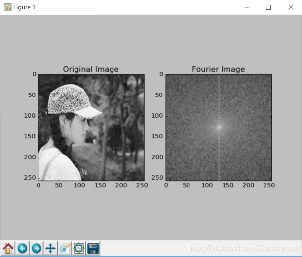

| 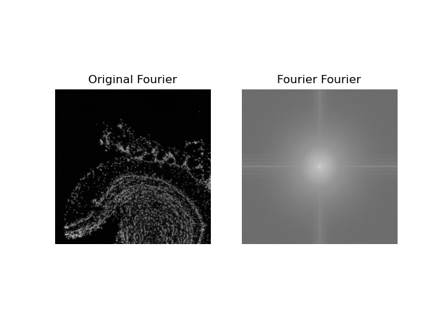 | 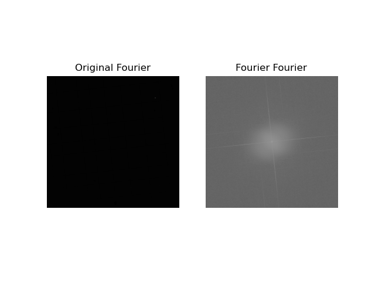 |
| ------------------------------------------------------------ | ------------------------------------------------------------ |
| 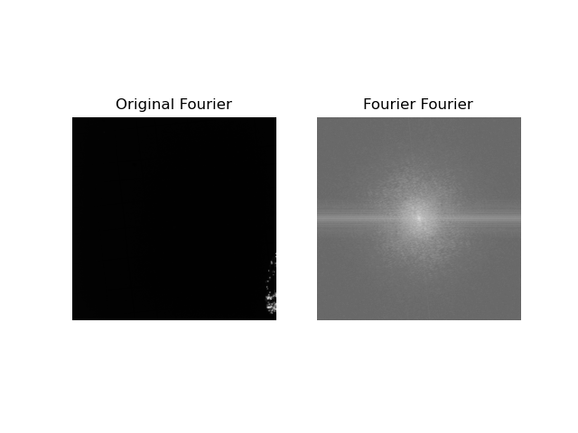 |                                                              |
|                                                              |                                                              |


### Numpy 实现傅里叶逆变换

下面介绍Numpy实现傅里叶逆变换, 它是傅里叶变换的逆操作, 将频谱图转换为原始图像过程. 这里傅里叶变换将转换为频谱图, 并对高频(边界)和低频(细节)部分进行处理, 接着需要通过傅里叶变换恢复为原始效果图. 频域上对图像的处理会反映在逆变换图像上. 

```python
#实现图像逆傅里叶变换, 返回一个复数数组
numpy.fft.ifft2(a, n=None, axis=-1, norm=None)
#fftshif()函数的逆函数, 它将频谱图像的中心低频部分移动至左上角
numpy.fft.fftshift()
#将复数转换为0~255范围
img = numpy.abs(逆傅里叶变换结果)
```

```python
# -*- coding: utf-8 -*-
import cv2 as cv
import numpy as np
from matplotlib import pyplot as plt

#读取图像
img = cv.imread('Lena.png', 0)

#傅里叶变换
f = np.fft.fft2(img)
fshift = np.fft.fftshift(f)
res = np.log(np.abs(fshift))

#傅里叶逆变换
ishift = np.fft.ifftshift(fshift)
iimg = np.fft.ifft2(ishift)
iimg = np.abs(iimg)

#展示结果
plt.subplot(131), plt.imshow(img, 'gray'), plt.title('Original Image')
plt.axis('off')
plt.subplot(132), plt.imshow(res, 'gray'), plt.title('Fourier Image')
plt.axis('off')
plt.subplot(133), plt.imshow(iimg, 'gray'), plt.title('Inverse Fourier Image')
plt.axis('off')
plt.show()
```

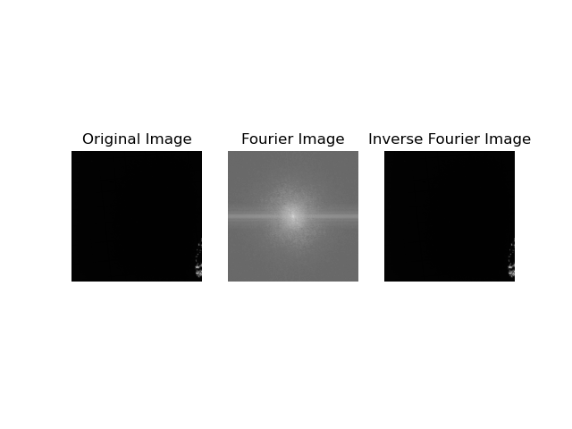

### OpenCV实现傅里叶变换

OpenCV中相应的函数时`cv2.dft`和Numpy输出结果一样, 但是是双通道, 第一个通道是结果的实数部分, 第二个通道是结果的虚数部分, 并且输入图像首先转换成np.float32格式.

`dst = cv2.dft(src, dst=None, flags=None,nonzerRows=None)`

>   src: 表示输入图像, 需要通过np.float32转换格式
>
>   dst: 表示输出图像, 包括输出大小和尺寸
>
>   flags: 表示转换标记, 其中 `DFT_INVERS`执行反向一维或二维转换, 而不是默认的正向转换. DFT_SCAL表示缩放结果, 由阵列元素的数量除以它; DFT_ROWS执行正向或反向变换输入矩阵的每个单独的行, 该标识可以同时转换多个矢量, 并可用于减少开销以执行一维或二维复数阵列的逆变换, 结果通过是相同大小的复数数组, 但如果输入数组具有共轭复数对此, 则输出维真实数组
>
>   nonzerRows: 表示当参数不为0时, 函数假定只有nonzerRows输入数组的第一行(未设置)或者只有输出数组的第一个(设置)包含非零, 因此函数可以处理其余的行更有效率, 并节省一些时间; 这种技术对计算阵列互相关或者DFT卷积非常有用.

注意, 由于输出的频谱结果是一个复数, 需要调用`cv2.magnitude()`函数将傅里叶变换的双通道结果转换未0~255的范围, 其函数原型如下:

`cv2.magnitude(x,y)`

>   x: 表示浮点型x坐标值, 即实部
>
>   y: 表示浮点型y坐标值, 即虚部, 最终输出结果为幅值, 

$$
dst(I)=\sqrt{x(I)^2+y(I)^2}
$$

```python
import numpy as np
import cv2
from matplotlib import pyplot as plt
# 读取图像
img = cv2.imread("fft.png",0)
#傅里叶变换
dft = cv2.dft(np.float32(img),flags=cv2.DFT_COMPLEX_OUTPUT)

#将频谱低频从左上角移动至中心位置
dft_shift = np.fft.fftshift(dft)

#频谱图像双通道复数转换为0-255
result = 20*np.log(cv2.magnitude(dft_shift[:,:,0],dft_shift[:,:,1]))
#显示图像
plt.subplot(121), plt.imshow(img, cmap = 'gray')
plt.title('Input Image'), plt.xticks([]), plt.yticks([])
plt.subplot(122), plt.imshow(result, cmap = 'gray')
plt.title('Magnitude Spectrum'), plt.xticks([]), plt.yticks([])
plt.show()
```

输出结果为, 左边为原始图, 右边为转换后的频谱图像, 并且保证低频位于中心位置

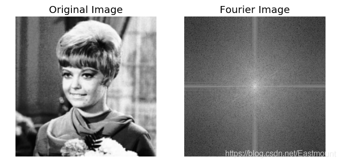

### 小结

傅里叶变换的目的并不是为了观察频率的分布, 更多情况是为了对频率进行过滤, 通过修改频率以达到图像增强, 图像去噪, 边缘检测, 特征提取, 压缩加密等目的.

## 傅里叶变换应用

### 高通滤波

傅里叶变换的目的并不是为了观察图像的频率分布, 更多情况下是为了对频率进行过滤, 通过修改频率以达到图像增强, 图像去噪, 边缘检测, 特征提取, 压缩等目的.

过滤的方法一般有三种: 低通(low-pass), 高通(high-pass), 带通(Band-pass). 所谓低通就是保留图像中的低频成分, 过滤高频成分, 可以包过滤想象成渔网, 想要低通过滤器, 就是将高频区域的信号全部拉黑, 而低频区域全部保留. 例如, 在一副大草原的图像中, 低频对应着广袤其颜色区域一致的草原, 表示图像变换缓慢的灰度分量; 高频对应着草原图像中老虎等边缘线性, 表示图像变换较快的灰度分量, 由于灰度尖锐过度造成.

高通滤波器是指通过高频的滤波器, 衰减低频而通过高频, 用于增强尖锐的细节, 但会导致图像的对比度降低. 该滤波器将检测图像的某个区域, 根据像素与周围像素的差值来提高像素的亮度.图展示了“Lena”图像对应的频谱图像, 其中区域为低频部分.

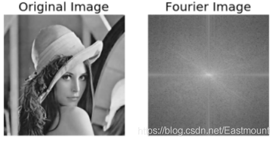

接着通过高通滤波覆盖掉中心低频部分, 将255点变为0, 同时保留高频部分, 其处理过程如下图

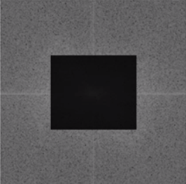

```python
rows, cols = image.shape
crow, ccol = int(row/2), int(cols/2)
fshift[crow-30:crow+30, ccol-30:ccol+30]=0
```

通过高通滤波器将提取图像的边缘轮廓, 生成如下图所示图像

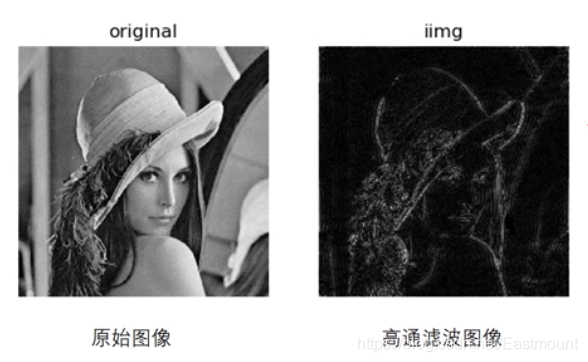

```python
import cv2
import numpy as np
import matplotlib import pyplot as plt

#读取图像
img = cv2.imread("lena.png",0)
#傅里叶变换
f = np.fft.fft2(img)
fshift = np.fft.fftshift(f)

#设置高通滤波器
rows, cols = img.shape
crow,ccol = int(rows/2), int(cols/2)
fshift[crow-30:crow+30,ccol-30:ccol+30]=0

#傅里叶逆变换
ishift = np.fft.ifftshift(fshift)
iimg = np.fft.ifft2(ishift)
iimg = np.abs(iimg)
#显示原始图像和高通滤波处理图像
plt.subplot(121), plt.imshow(img, 'gray'), plt.title('Original Image')
plt.axis('off')
plt.subplot(122), plt.imshow(iimg, 'gray'), plt.title('Result Image')
plt.axis('off')
plt.show()
```

输出结果如下图所示, 第一幅图为原始“Lena”图, 第二幅图为高通滤波器提取的边缘轮廓图像. 它通过傅里叶变换转换为频谱图像, 再将中心的低频部分设置为0, 再通过傅里叶逆变换转化为最终的输出图像. 

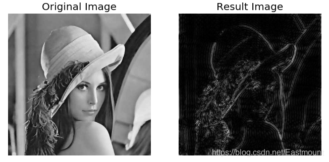

### 低通滤波

低通滤波是指通过低频的滤波器, 衰减高频而通过低频, 常用与模糊图像. 低通滤波器与高通滤波器相反, 当一个像素与周围像素的差值小于一个特定值时, 平滑该像素的亮度, 常用于去噪和模糊处理, 如PS软件中的高斯模糊, 就是常见的模糊滤波器之一, 属于削弱高频信号的低通滤波器

下图展示了“Lena”图对应的频谱图, 其中心区域为低频部分. 如果构造低通滤波器, 则将频谱图像中心低频部分保留, 其他部分替换为0, 其处理过如图所示, 最终得到的效果为模糊图像

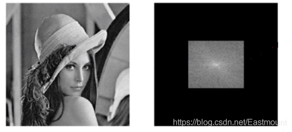

那么, 如何构造该滤波图像呢, 如下图所示, 滤波图像时通过低通滤波器和频谱图像形成. 其中低通滤波器中心区域为白色255, 其他区域为0

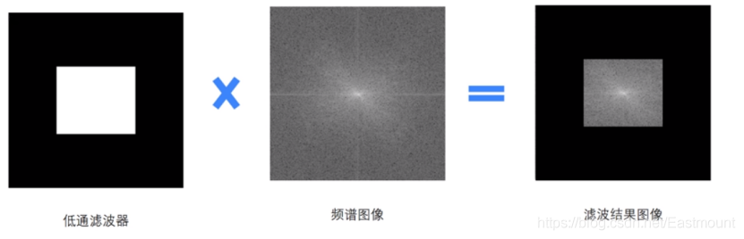

低通滤波器主要通过矩阵设置构造, 其核心代码如下:

```python
rows, cols = img.shape
crow,ccol = int(rows/2), int(cols/2)
mask = np.zeros((rows, cols, 2), np.uint8)
mask[crow-30:crow+30, ccol-30:ccol+30] = 1
```

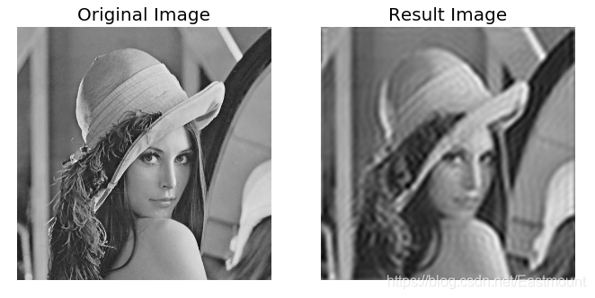

## FFT用于特征匹配+相似性度量

频谱图: 声音频率与能量的关系用频谱表示概况, 以横纵轴的波纹方式, 记录各种信号画面

### 相位相关法

图像配准的基本问题时找出图像转换方法, 用以纠正图像的变形. 正是图像变形原因和形式的不同决定了多种多样的图像配准技术.

图像配准方法主要有互相关法, 傅里叶变换法, 点映射法和弹性模型法. 其中傅里叶变换基于傅里叶变换的相位匹配是利用傅里叶变换的性质而出现的一种图像配准方法. 图像经过傅里叶变换, 由空域变换到频域变量上, 则两则数据再空域上的相关运算可以变为频谱的复数乘法运算, 同时图像再变换域中还能获得空域中难获得的特征.

重点: 平移不影响傅里叶变换的幅值(谱), 对应的幅值和原图是一样的. 旋转再傅里叶变换中是小变量. 根据傅里叶的旋转特性, 旋转一幅图, 再频域相当于对这副图的傅里叶变换左相同的旋转. 使用频域方法的好处是计算简单, 速度快. 同时傅里叶变换可以采用发方法提高执行速度. 因此, 傅里叶变换是图像配准中常用的方法之一. 下面分析当图像发生平移, 旋转和缩放时, 图像信号在频域中的表现

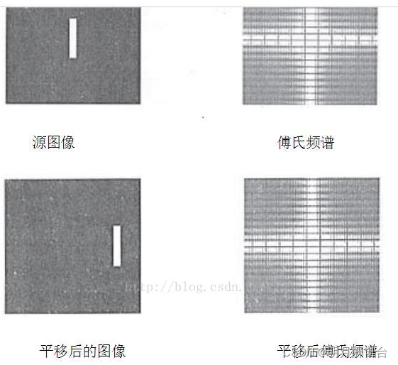

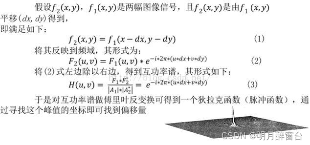

通过求取互功率谱的傅里叶反变换, 得到狄拉克函数(脉冲函数), 在寻找函数峰值点对应的坐标, 即可得到我们所要求的配准点. 实际上, 在计算中, 连续域要用离散域代替, 这使得狄拉克函数转化为离散时间单位冲击函数序列的形式. 在实际运算中, 两幅图向互功率谱相位的反变换, 总是含有一个相关峰值代表两幅图图像的配准点, 和一些非相关的峰值, 相关峰值直接反映两幅图像的一致程度. 更精确的讲, 相关峰的能量对应重叠区域所占的百分比, 非相关峰对应非重叠区域所占百分比. 由此, 可以看出, 当两幅图像重叠区域较小时, 采用而本方法就不能检测出两幅图像的平移量.

### 合理的配准情况

当图像间仅存在平移时, 正确的配准图像如图a(中心平移化), 最大峰的位置就是两图向的相对平移量, 反之, 若不纯在单纯的平移, 则会出现如b所示的情况(多脉波)

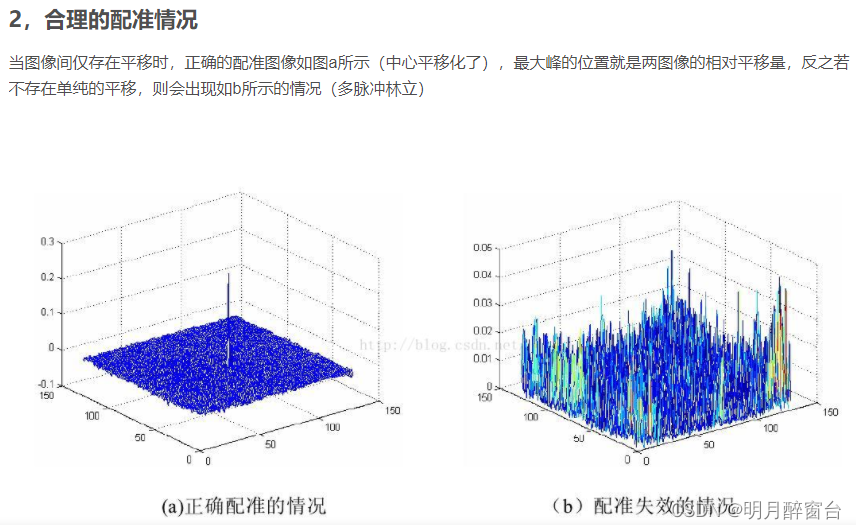

算法流程:

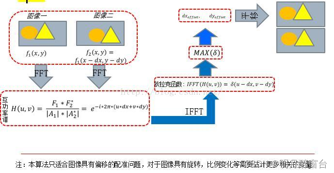

$$
H(u,v)=\frac{F_1*F_2}{|A_1|*A^*_2}=e^{-i*2\pi*(u*d_x+v*d_y)}
$$


### 配准模拟结果

**绝对理想的图像进行配准模拟**
图中整体的图像都没有因为平移而带来像素的损失, 即再往下移动越界后, 像素偏移到上面, 往右移动越界后像素偏移到左边, 所以图中模拟的图像没有任何像素损失.

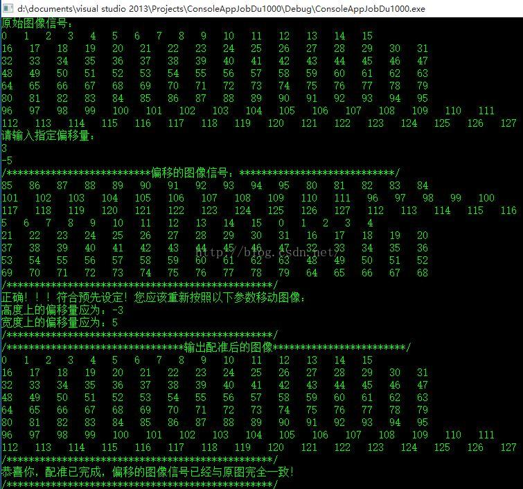

**对带有指定偏移量的图像偏移估计**
本实验图像大小600*450(其中600是宽度), 可以看见成功找到了偏移量

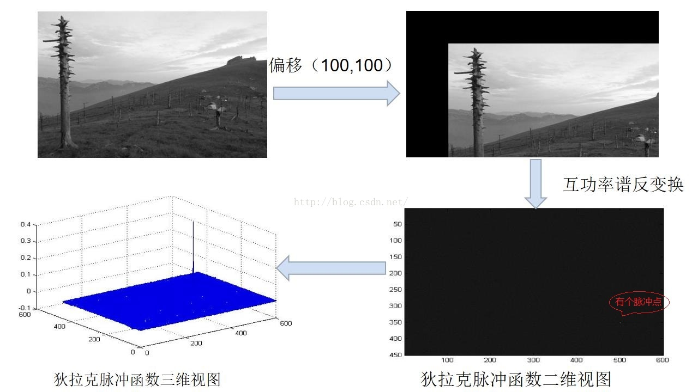

但是后来我想了想, 这个实验中的图像平移是不严谨的, 平移后图像左上方的像素变成了黑色, 不过从结果来看, 影像并不大, 接下来换了一张更严谨的偏移实验图像.

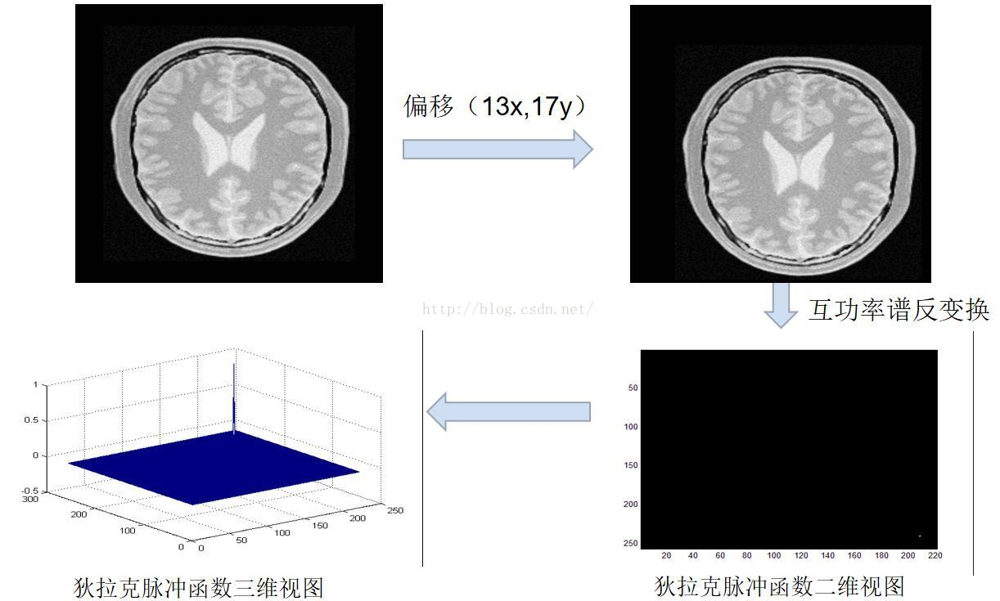


**仅考虑平移translation**
定义: 

>   $f_r$: 参考图像, reference picture;
>
>   $f_s$: 待 配准图像

假设二者存在$(x_0,y_0)$偏移, 即: $f_s(x,y)=f_r(x-x_0,y-y_0)$

等式两边进行傅里叶变换, 有: 
$$
F_s(u,v)=e^{-j2\pi(u*x_0+v*y_0)}F_r(u,v)
$$
$F_s$与$F_r$的互功率谱定义为:
$$
R=\frac{F_s(u,v)F^*_r(u,v)}{|F_s(u,v)F_r(u,v)|}=e^{-j2\pi(u*x_0+v*y_0)}
$$
对$R$进行傅里叶逆变换, 有: 
$$
F^{-1}(R)=\delta(x-x_0,y-y_0)
$$
因此, 在逆变换谱上搜索最大值点即为平移距离$(x_0,y_0)$

### code of FFT match

```python
import numpy as np
import cv2
from scipy import fftpack
from matplotlib import pyplot as plt

template = cv2.imread("template.jpg")
origin = cv2.imread("image.jpg")

template_gray = cv2.cvtColor(template,cv2.COLOR_BGR2GRAY)
origin_gray = cv2.cvtColor(origin, cv2.COLOR_BGR2GRAY)

t_height, t_width = template_gray.shape
o_height, o_width = origin_gray.shape

t_fft = fftpack.fft2(template_gray, shape=(o_height,o_width))
o_fft = fftpack.fft2(origin_gray)

c=np.fft.ifft2(np.multiply(o_fft,t_fft.conj())/np.abs(np.multiply(o_fft,t_fft.conj())))
c = c.real

result = np.where(c==np.amax(c))
#zip the 2 arrays to get the exact coordinates
max_coordinate = list(zip(result[0],result[1]))[0]
print(max_coordinate)

start_point = (max_coordinate[1], max_coordinate[0])
end_point = (max_coordinate[1]+t_height,max_coordinate[0]+t_width)

#blue color in BGR
color = (255,0,0)
thickness = 2
image = cv2.rectangle(origin,start_point,end_point,color,thickness)
cv2.imshow("fft matching",image)
cv2.waitKey(0)
cv2.dest
```

## 基于频谱和空域特征匹配的图像配准算法

### abstract

针对特征点不明显的图像配准场景, 在保证相邻两幅待配准图像重叠面积超过80%的前提下, 提出了一种基于频谱和空域特征匹配的配准算法. 该算法基于傅里叶谱图的旋转中心不变性, 将空域中两幅图像绕任意一点的旋转角转化成频域中绕频谱图中心的旋转角. 利用极坐标系和笛卡尔坐标系的变换关系, 将绕频谱图中心的旋转量化为一维方向的平移量, 使用SAD(sum of Absolute Difference)算法求取旋转角, 再使用SAD算法求取平移矩阵. 所提配准算法即适用于特征点明显的图像配准场景, 也适应于特征点不明显的图像配准场景, 且配准精度较高, 配准速度也较快.

### background

基于区域的配准算法利用图像的灰度信息建立图像的相似性, 根据相似性度量值寻找两幅图像间的配准区域, 从而建立两幅图像之间的变化关系. 在[9]中提出了基于块匹配的配准算法, 取第一幅图像处于重叠部分中的图像块作为模板, 在第2幅图像中搜索相似的对应图像块, 从而确定配准矩阵. 在[7]中提出一种基于网格匹配的配准算法, 在第2幅图像的重叠区域取一个网格, 然后将网格在第一幅图像上移动, 计算网格对应点的RGB值之差的平方和, 记录差值最小时对应的网格位置, 即为两幅图像的配准位置. 将该算法应用于有相对旋转和平移的两幅图的配准时, 每次进行网格匹配之前, 都需要先旋转一定角度和平移一定距离, 这不仅增加了时间复杂度, 还大大降低了配准速度.

针对特征点不明显的图像配准场景, 在保证两幅图像重叠面积>80%的前提下, 本文提出了一种基于频谱和空域特征匹配的图像配准算法. 基于傅里叶频谱图的旋转中心不变性, 将空域中图像绕着任意点的旋转量变成频谱图绕着中心的旋转量, 利用极坐标系和笛卡尔坐标系之间的坐标变换关系, 将两幅频谱图的旋转量转化为一维平移量, 利用SAD(sum of absolute difference) 算法求得角度量, 再使用SAD算法求取平移量, 最终得到两幅图待配准之间的变换矩阵.

### 基本原理

**图像变换**
假设空间中的点A再两幅图像$f_1(x,y)$和$f_2(x,y)$中的像素坐标分别为$(x_1,y_1)$和$(x_2,y2)$, 即有$f_2(x_2,y_2)=f_1(x_1,y_1)$. 已知$(x_1,y_1)$与$(x_2,y_2)$之间的空间坐标变换采用刚体平面变换模型, 则$(x_1,y_1)$和$(x_2,y_2)$的空间坐标变换为:
$$
\left[\begin{array}{c}
x_{2} \\
y_{2} \\
1
\end{array}\right]=\left[\begin{array}{ccc}
\cos \theta & \sin \theta & -t_{x} \\
-\sin \theta & \cos \theta & -t_{y} \\
0 & 0 & 1
\end{array}\right] \times\left[\begin{array}{c}
x_{1} \\
y_{1} \\
1
\end{array}\right],
$$
式中: $\theta$为两幅图像的旋转角, $(t_x,t_y)$为两幅图像的平移量.

**图像配准**

在实际应用中, 两幅待配准图像常常会伴随着相对的旋转, 进一步限制了基于区域的配准算法的应用, 因此基于图像特征的配准算法便成为了目前的主流算法. 针对图像特征不明显的配准场景, 基于图像特征的配准算法无法保证配准的精度. 针对图像特征不明显的配准场景, 需要利用图像内容进行配准.

本文提出的配准算法主要针对重叠区域足够大的配准场景(一般要求两幅图待配准图像的重叠区域不低于80%. 假设两幅待配准图像$f_1(x,y)$和$(f_2(x,y))$有相对旋转和平移, 根据式子有:
$$
f_2(x,y)=f_1(x \cos\theta+y \sin\theta-t_x,-x \sin\theta+y \cos\theta-t_y)
$$
再进行傅里叶变换, 得到两幅待配准图像的傅里叶频谱图表达式为:
$$
\begin{gathered}
\mathscr{F}_{2}(\xi, \eta)=\mathscr{F}_{1}(\xi \cos \theta+\eta \sin \theta,-\xi \sin \theta+ \\
\eta \cos \theta) \times \exp \left[-\mathrm{j} 2 \pi\left(\xi t_{x}+\eta t_{y}\right)\right],
\end{gathered}
$$
式中: $\mathscr{F}_{1}(\xi, \eta) 、 \mathscr{F}_{2}(\xi, \eta)$ 分别为图 像 $f_{1}(x, y)$ 、 $f_{2}(x, y)$ 的傅里叶频谱图函数; $(\xi, \eta)$ 为频谱图坐标。

根据傅**里叶频谱图的旋转中心不变性, 可以将空域中两幅图像绕任意一点的旋转量变换到频域中两幅频谱图绕频谱图中心的旋转量**. 与利用图像灰度直接进行计算的基于区域的配准算法不同, 本文算法通过对空域中的两幅待配准图像进行傅里叶变换, 将两幅灰度图像的图像变化信息转化成数值化频谱图的幅值. 频谱图像数值的大小表示不同频率的幅值, 即频谱函数的模. 用函数$M_1, M_2$分别表示$\mathscr{F}_{1}(\xi, \eta), \mathscr{F}_{2}(\xi, \eta)$的模, 则有
$$
\begin{gathered}
M_{1}(\xi, \eta)=M_{2}(\xi \cos \theta+\eta \sin \theta, \\
-\eta \sin \theta+\xi \cos \theta) 。
\end{gathered}
$$
根据直角坐标系和极坐标系的坐标变换关系, 有
$$
\left\{\begin{array}{l}
x=\rho \cos \theta^{\prime} \\
y=\rho \sin \theta^{\prime}
\end{array},\right.
$$
式子中: x 和 y为直角坐标系下频谱图的坐标值; $\rho$为极坐标系下频谱图的极径; $\theta^`$为极坐标系下频谱图的极角.

结合上面两个式子, 得到极坐标系下两幅频谱图的坐标变换关系为
$$
M_1(\rho,\theta)=M_2(\rho,\theta = \theta_0)
$$
式中: $\theta_0$为极坐标系下两幅频谱图绕中心旋转角.

可以看到, 极坐标系下两幅频谱图的模$M_1$和$M_2$只相差$\theta_0$的旋转量. 为了对$\theta_0$进行快速求取, 利用极坐标系和直角坐标系之间的转换关系, 将极坐标系下两幅频谱图绕中心逆时针方向的旋转量$\theta_0$转化为直角坐标系下两幅频谱图沿Y轴的平移量$y_0$, 直角坐标系下的频谱图如图1(c),(d)所示, 大大提高了求取旋转矩阵的运算速度.

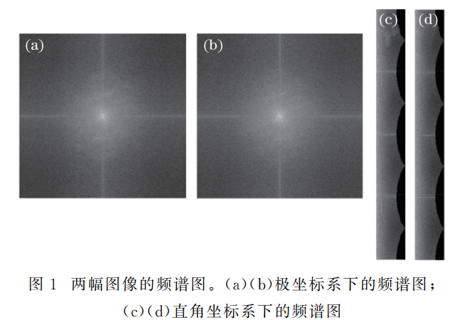

利用SAD算法对图1(c), (d)进行Y方向的查找, 求得两幅频谱图的旋转量$\theta_0$, 则空域中两幅图像$f_1(x,y)$和$f_2(x,y)$的旋转矩阵为
$$
\left[\begin{array}{ccc}
\cos \theta_0 & \sin \theta_0 & 0 \\
-\sin \theta_0 & \cos \theta_0 & 0 \\
0 & 0 & 1
\end{array}\right]
$$
通过求得的旋转矩阵对两幅待配准图像进行变换, 得到两幅只有相对平移的图像$f^`_1(x,y)$和$f^`_2(x,y)$, 对$f^`_1(x,y)$和$f^`_2(x,y)$使用SAD算法求得的平移矩阵为$[t_x,t_y,1]^T$

SAD是基于图像灰度的网格匹配算法, 其基本思想就是取图像中每个像素对应的像素值之差的平方均值, 以此来评判两个图像块的匹配度. 设函数S表示两幅图像重叠区域的灰度差均方根和, 其表达式为:
$$
S=\sum_m^M {\sum_n^N \frac{|f_1(m,n)-f_2(M-m,N-n)|^2}{m*n}}
$$
式中: (M,N)为两图像$f_1(x,y)$和$f_2(x,y)$的大小; (m,n)为重叠区域大小.

 针对两幅大小为$m*m$的两幅待配准图像, 已知图像$f^`_1(x,y)$,  只有相对的平移, 如下图所示, 传统的网格匹配算法需要将图像$f_2(x,y)$在图像$f_1(x,y)$上进行m*m次移动, 计算每次移动时重叠区域的匹配度, 匹配度最高时对应的位置即为两幅图像的配准位置.

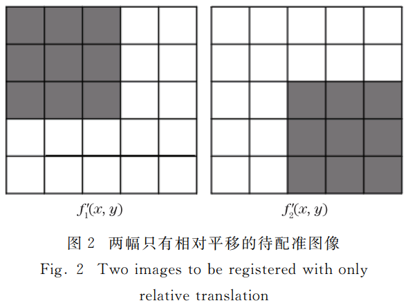

由于本文中两幅待配准图像的重叠区域超过了80%, 因此在进行网格匹配时, 可以通过建立相应的规则来避免无效的计算, 从而提高运算速度. 在保证图像重叠区域足够大的前提下, 可以将网格撇皮算法的查找起点进行更改, 如图3所示. 图3中所示的灰色区域即为被跳过的查找区域, 通过该方法, 可以大大降低网格匹配算法的计算量.

如下图所示, 可以将SAD的遍历分为独立的4各查找区间, 最佳匹配位置位于其中一个查找区间. 本文采用先粗后细的查找方法, 先对4各区间进行粗查找, 确定最佳匹配位置所在的区间, 再对对应区间进行精细查找, 获取平移矩阵, 该方法极大提高了SAD算法的运行速度.

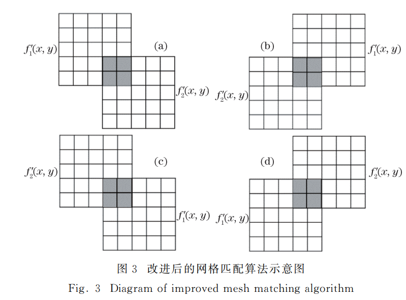


如图4所示, 对$f_1(x,y)$和$f_2(x,y)$进行SAD查找, 求得S的最小值(表示两幅图像重叠区域的相似度最高). 如图4所示, 在进行SAD查找过程中, 两幅待拼接图像中一定有一幅图像的顶点位于另一幅图像区域内, 则该点在两幅图上的坐标值之差为两幅图像的平移矩阵. 即$(t_x,t_y)=(r,c)-(1,1)$

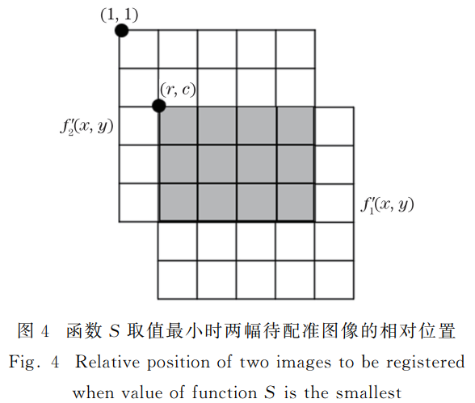

**图像连续拼接**
已知相邻两幅待配准图像之间的变换矩阵后, 对图像序列进行连续配准就可以得到全景图像. 本文以第一帧图像作为基准坐标系, 则第n帧图像变换到基准坐标系下的变换矩阵可表示为:
$$
\left[\begin{array}{c}
x_{1} \\
y_{1} \\
1
\end{array}\right]=\boldsymbol{R}_{\mathrm{T}} \times\left[\begin{array}{c}
x_{k} \\
y_{k} \\
1
\end{array}\right]=\boldsymbol{R}_{\mathrm{T} 1} \cdots \boldsymbol{R}_{\mathrm{T} k-2} \cdot \boldsymbol{R}_{\mathrm{T} k-1} \times\left[\begin{array}{c}
x_{k} \\
y_{k} \\
1
\end{array}\right]
$$
式中: $R_T$为第k帧图像变换到第一帧图像坐标系的变换矩阵, $R_{Tk-1}$为第k帧图像变换到第k-1帧图像坐标系的变换矩阵; $[x_k,y_k,1]^T$, 为第k帧图像的图像坐标系下的坐标; $[x_1,y_1,1]^T$ 为基准坐标系下的坐标.

### **结果**

如图6所示, 两幅特征点比较明显的待配准图像, 可以看到两幅图像的旋转角度较小, 且两幅图像的重叠面积超过80%

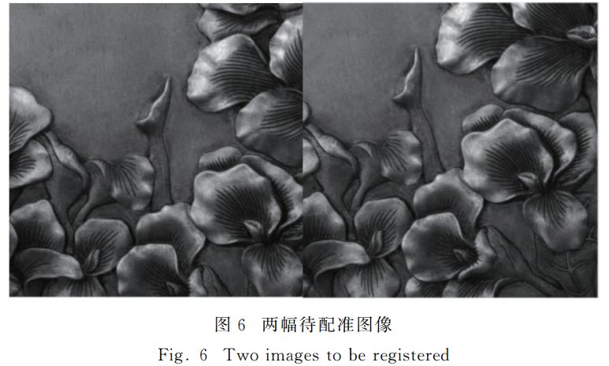

对图6中的两幅图像进行傅里叶变换, 得到两幅图像的频谱图, 如图7中(a), (b)所示. 对极坐标系下的频谱图进行坐标变换, 将频谱绕着频谱图中心逆时针方向分为3600份, 并沿着Y轴方向依次变换到直角坐标系下, 得到直角坐标系下的频谱图, 如图7(c,d)所示.

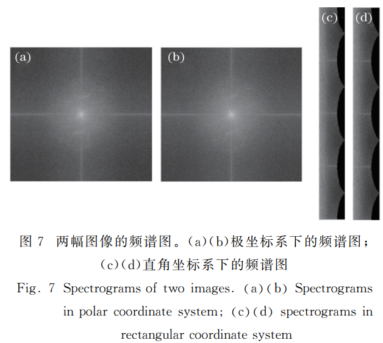


根据上述讨论可知, 只需要遍历(0,15)U(-15,0)角度的区间, 则SAD对应搜索范围为(1, 150)U(341,3600), 得到的相似度曲线如图8所示. 相似度曲线值最大的点对应的横轴的值即为角度值, 求得旋转角度为10.9.


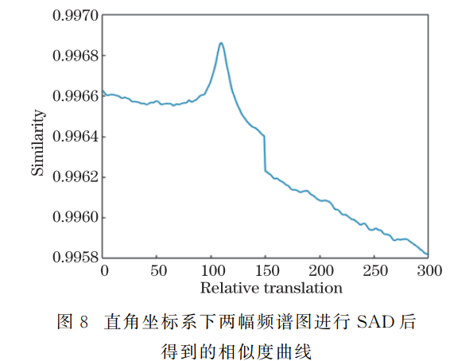

采用求得的旋转角对两幅图像进行变换, 得到只有相对平移的两幅图像, 再进行SAD查找求取频移矩阵. 如图9(a)所示, 进行SAD粗匹配得到灰度差曲线的横轴范围为[0,4096], 将该区间分为等间距的4个区间, 分别为[0,1014], [1015, 2029], [2028, 3042], [3042,4096]. 由图9(a)可知, 最佳匹配位置位于第一个区间, 即[0,1014]. 对该区间进行SAD精匹配, 得到的灰度差曲线如图9(b)所示, 灰度差均值最小的点表示当两幅图像处于该位置时, 其重叠区域的相似度最高, 求得平移矩阵为$[18,2,1]^T$

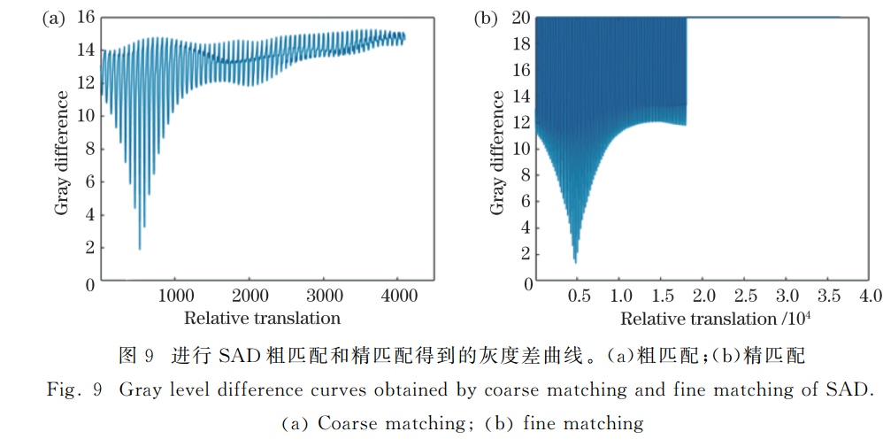

用上述求得的旋转量和平移量构造变换矩阵$R_T$, 对两幅图像进行坐标变换. 从图10(a)可以看出, 两幅图像已经实现了准确配准, 两幅图像进行坐标变换后的重叠区域的灰度差均值为7.99*10^-6, 拼接耗时为20s, 沿着本文算法所求变换矩阵的准确性.

依次求取图像序列相邻图像之间的变换矩阵, 并以第1幅图像的图像坐标系作为基准坐标系, 将剩下的k-1帧图像分别变换到基准坐标系下, 并对重叠区域进行像素均值融合, 得到的来连续拼接图像如下图所示, 可以看到图像没有拼接错位, 重叠区域的亮度变换均匀, 没有明显的拼接缝, 证明本文的配准算法求得变换矩阵的进度适用于连续拼接, 而且本文使用的图像融合方法能有效解决图像亮度不均匀的问题.

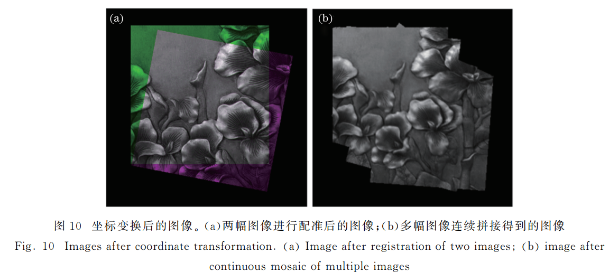

## 傅里叶图像

### 平移和旋转

图像的平移并不会影响图像的频谱, 同时, 图像的相位会随着图像的旋转而旋转

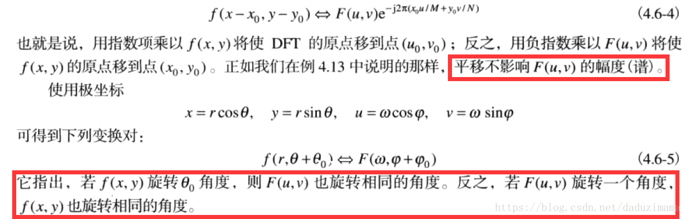

下面使用矩形的频谱图来说明图像中的矩形的平移并不会对频谱有丝毫的影响

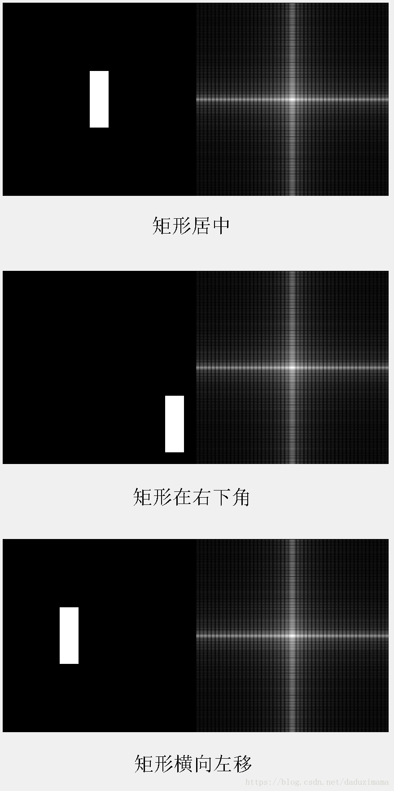

交换四个象限但图像的频谱并未改变

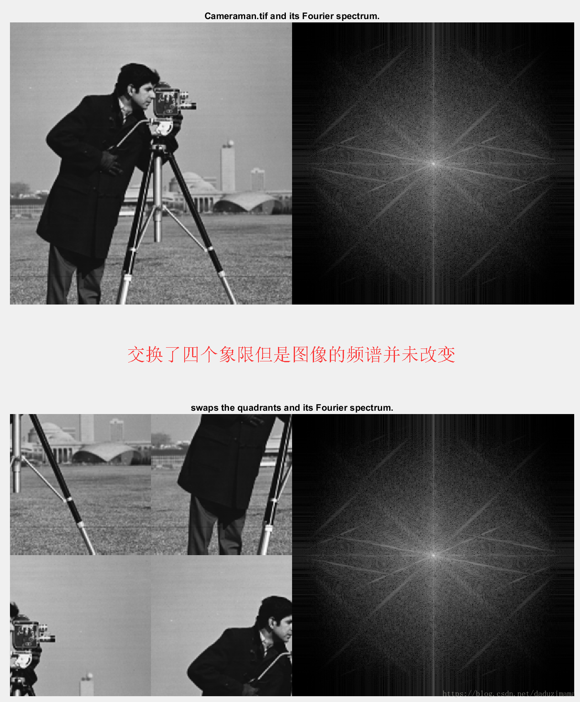

-   频谱随着矩形的旋转而旋转相同的角度

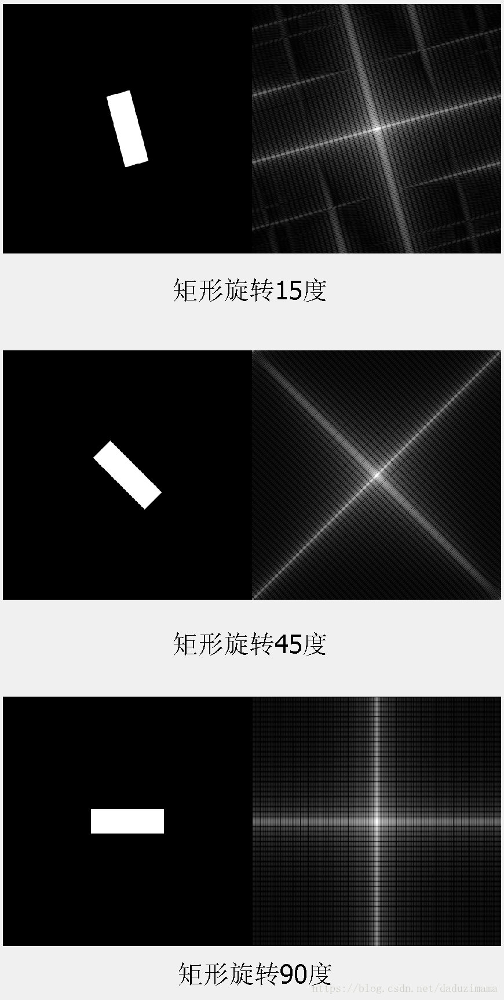

### 平移和旋转对相位的影响

先用一个简单的例子来说明图像相位的作用, 再图像的频域分析和滤波中, 相位常常被忽略, 虽然相位分量的贡献很不直观, 但是它恰恰很重要. 相位时频谱中各正弦分量关于原点的位移度量.

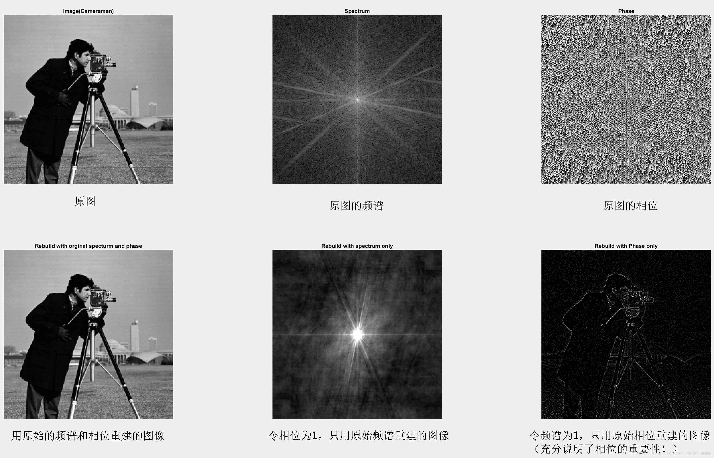

上面的小实验充分说明了, 看似无用, 且常常被忽略的相位, 再DFT的频域中起到了多么重要的作用. (注意区分实部和虚部(直角坐标系)VS频谱和相位(极坐标系))

接下来再来看看图像在空间域中的移位和旋转对相位有什么影响. 下图中, 左边一列时图像, 中间一列时频谱, 右边一列时相位图. 我必须意识到, 通过肉眼, 我们很看从相位图中得到什么有用信息.

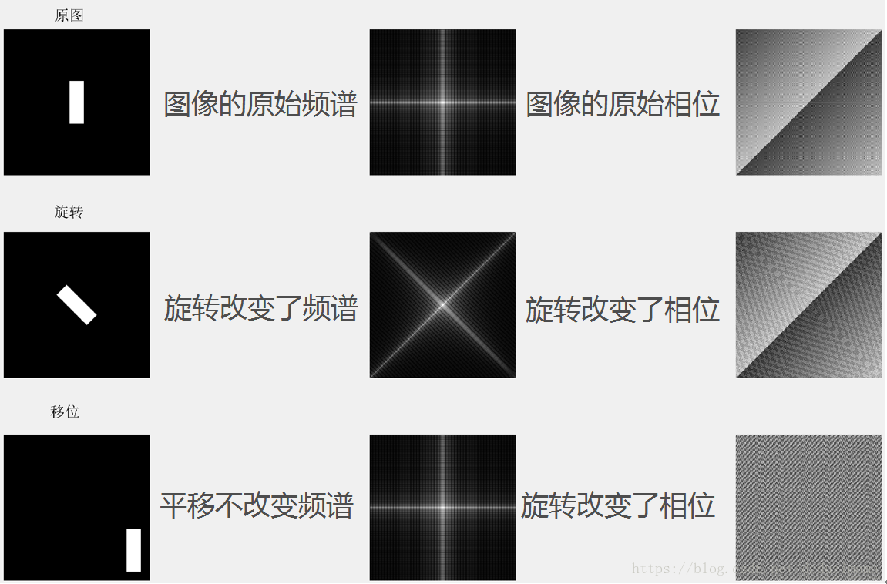

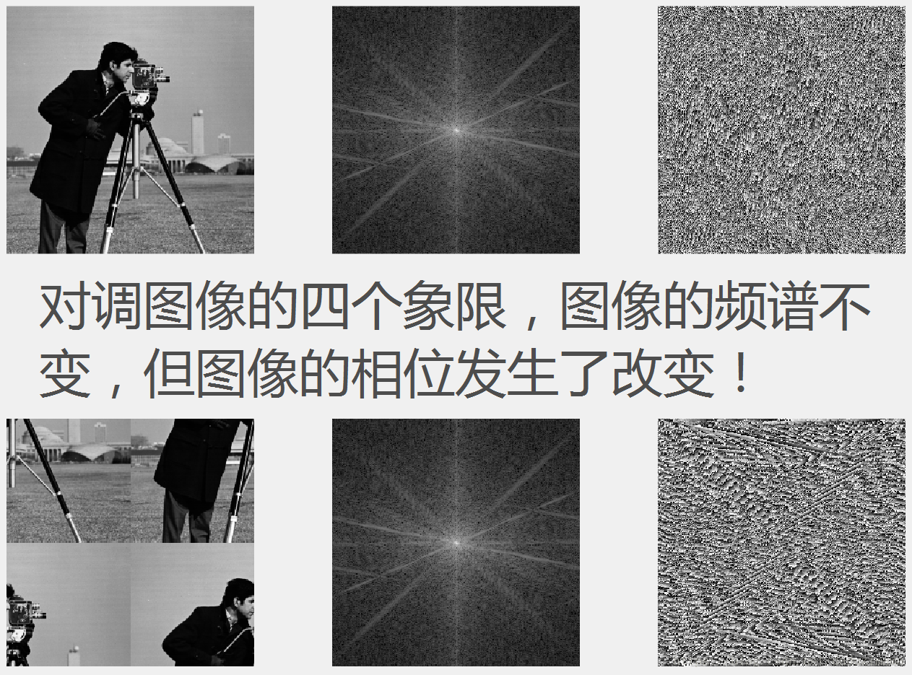

**相位谱**
通过时域到频域的变换, 我们得到了一个从侧面看的频谱, 但是这个频谱并没有包含时域中全部的信息. 因为频谱只代表每一个对应的正弦波的振幅是多少, 而没有提到相位. 基础的正弦波$A \sin(wt+\theta)$, 振幅, 频率, 相位缺一不可, 不同相位决定了波的位置, 所以对于频域分析, 仅仅有频谱图(振幅谱)是不够的, 还需要一个相位谱. 

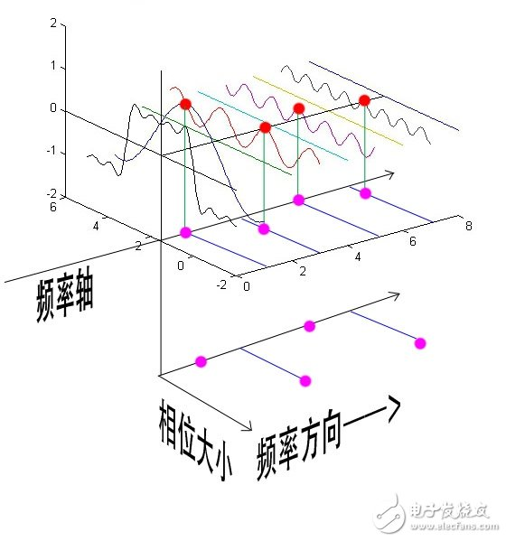

需要注意, 时间差并不是相位差, 如果将全部周期看作$2\pi$ , 则相位差则是时间差在一个周期中所占的而比例. 我们将时间/周期x2$\pi$, 就得到的相位差.

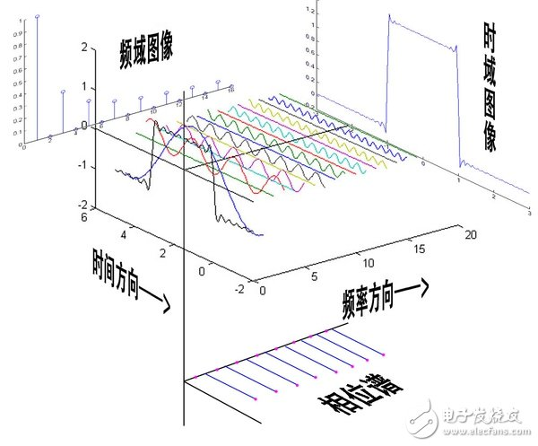

**汉明窗**

汉明窗的时域波形两端不能到零, 从频域响应来看, 刊名

### 傅里叶变换图像配准理论

**平移变化**
如果图像$f_2(x,y)$是图像$f_1(x,y)$经平移$(x_0,y_0)$后的图像, 即$f_2(x,y)=f_1(x-x_0,y-y_0)$, 则对应的傅里叶变化F1和F2的关系为:
$$
\frac{F_2(\xi,\eta)F^*_2}{|F_1(\xi, \eta)F_2^*|}=e^{j2\pi(\xi x_0+\eta y_0)}
$$
式中$F_2^*$为$F_2$的复共轭. 平移理论表明, 互能量谱的相位等于图像间的相位差. 通过对互能量谱进行反变换, 就可得到一个冲击函数$\delta (x-x_0,y-y_0)$. 此函数在偏僻位置处有明显的尖锐峰值. 其他位置的值接近于0, 所以据此就能找到两图像间的偏移量.

**没有尺度变化的旋转特性**
如果$f_2(x,y)$是$f_1(x,y)$经平移$(x_0,y_0)$, 旋转$\theta_0$得到的图像, 即
$$
f_2(x,y)=f_1(x \cos \theta_0 + y\sin \theta_0 -x_0, -x \sin \theta_0 + y\cos \theta_0-y_0)
$$
根据傅里叶的旋转和平移特性, 变换后两图像间的关系为:
$$
F_2(\xi, \eta)=e^{-j2\pi(\xi x_0+\eta_0 y_0)}F_1(\xi \cos \theta_0 + \eta \sin \theta_0, -\xi \sin \theta_0 + \eta \cos \theta_0)
$$
假定M1, M2为F1和F2的能量, 则:
$$
M_2(\xi,\eta)=M_1(\xi \cos \theta + \eta \sin \theta_0,-\xi \sin \theta_0 + \eta \cos \theta_0)
$$
由上式可以看出, F1和F2的能量是相同的, 不过其中一个是另一个旋转后的副本. 直角坐标系中的旋转对应着极坐标角度的平移, 因此, 将公式(5)进行极坐标描述
$$
M_1(\rho,\theta)=M_2(\rho, \theta-\theta_0)
$$
进而利用相位相关理论, 可得到$\theta$

**带比例放大的变换特性**
如果$f1$为$f2$分别在水平和垂直方向上进行比例缩放后的图像, 缩放因子为(a,b), 更具傅里叶尺度变换特性由:
$$
F_2(\xi, \eta)=\frac{1}{ab}F_1(\xi/a,\eta/b)
$$
通过对数轴变换, 比例变化可以转化为平移变换(忽略乘积因子1/ab)
$$
F_2(\log \xi ,\log \eta)=F_1(\log \xi - \log a, \log \eta-\log b)
$$
上式可写成
$$
F_2(x,y)=F_1(x-c,y-d)
$$
式中: $x=\log \xi, y=\log \eta, c=\log a, d=\log b$. 则平移(c, d)可通过相关技术得到, 尺度因子(a,b)由(c,d)得到:
$$
a=e^c,\\
b=e^d
$$
如果(x,y)尺度变化为(x/a, y/a), 则其极坐标可描述为:
$$
\rho_1 = (x^2+y^2)^{1/2}\\
\theta_1=\arctan (y/x)\\
\rho_2 = ((x/a)^2+(y/a)^2)^{1/2}=\rho_1/a\\
\theta_2 = \arctan((y/a)/(x/a))=\theta_1
$$
进而, 如果$f_1$为$f_2$经平移, 旋转和比例缩放后的图像, 则他们的极坐标描述的能量谱间的关系为:
$$
M_1(\rho,\theta)=M_2(\rho/a,\theta-\theta_0)\\
M_1(\log \rho,\theta)=M_2(\log \rho-\log a, \theta-\theta_0)\\
M_1(\xi, \theta)=M_2(\xi-d,\theta-\theta_0)
$$
式中, $\xi=\log \rho; d=\log a$,

利用上式和相位相关技术可得到比例因子a和旋转角$\theta$, 分别对要配准的图像进行比例变换和旋转后, 在利用相位相关技术可求出图像间的偏移量.

**总结**

由上讨论可以看出, 首先求出比例因子及旋转角, 按此值对欲配准图像变换后, 求出平移量, 再进行变换可得到配准好的图像. 具体步骤如下:

1.   原始图像进行傅里叶变换, 并求出各自的能量

2.   高通滤波.
     $$
     H(\xi, \eta)=(1.0-X(\xi,\eta))(2-X(\xi,\eta))\\
     X(\xi,\eta)=[\cos(\pi \xi) \cos (\pi \eta)], -0.5<\xi, \eta<0.5
     $$

3.   将滤波后的各图像的能量转换成对数-极坐标形式, 并求其互能量谱, 得到比例系数及旋转角.

4.   将欲配准的图像旋转, 比例放大后再与参考图像一起计算互能量谱, 从而得到平移量.

## 傅里叶-梅林变换

图像配准方法主要分三类: 一种是灰度信息方法, 另一种是基于特征的方法, 第三种是基于变换域的方法.

图像配准过程中, 常常需要处理平移, 旋转, 尺度变换, 遮挡, 形变问题. 使用傅里叶-梅林变换可以很好的应对平移, 平面内旋转, 缩放和遮挡, 是一种鲁棒性比较强的方法.

**原理**
将笛卡尔坐标系下的旋转和缩放转换为新坐标系下的平移, 通过相位相关求得平移量就得到了缩放倍率和旋转角度. 根据倍率和旋转角度做矫正, 再直接相位相关求得平移量. 于是就得到两幅图像的相位, 旋转, 缩放, 可以用于图像配准.

**步骤**

1.   产生两个等大的正方形图像块

2.   对这两个图像块分别做傅里叶变换, 对数极坐标变换(统称傅里叶梅林变换), 下图就是变换结果

     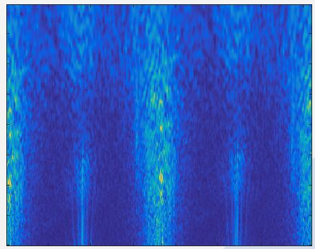

3.   在做傅里叶变换, 然后相位相关, 再逆变换就得到了响应图

4.   寻找响应图最大值位置, 然后查表得到旋转角和缩放倍率

5.   

## phaseCorrelate()

```python
Point2d cv.phaseCorrelate(src1, src2,[window])->retval, response
```

The function is used to detect translation shifts that occur between two images.

The operation takes advantage of the Fourier shift theorem for detecting the translational shift in the frequency domain. It can be used for fast image registration as well as motion estimation.

Calculates the cross-power spectrum of two supplied source arrays. The arrays are padded if needed with getOptimalDFTSize.

The function performs the following equations:

1.   First it applies a Hanning window to each image to remove possible edge effects. This window is cached until the array size changes to speed up processing time.

2.   Next it computes the forward DFTs of each source array

     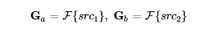

3.   It then computes the cross-power spectrum of each frequency domain array

     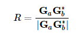

4.   Next the cross-correlation is converted back into the time domain via the inverse DFT

     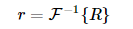

5.   Finally, it computes the peak location and computes a 5x5 weighted centroid around the peak to achieve sub-pixel accuracy.

     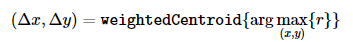

6.   If non-zero, the response parameter is computed as the sum of the elements of r within the 5x5 centroid around the peak location. It is normalized to a maximum of 1 (meaning there is a single peak) and will be smaller when there are multiple peaks.


**parameters**

>   `src`: source floating point array
>
>   `src2`: source floating point array
>
>   `window`: Floating point array with windowing coefficients to reduce edge effects
>
>   `response`: Signal power within the 5x5 centroid around the peak, between 0 and 1

**Returns**
detected phase shift (sub-pixel) between the two arrays

返回的第一个元组告诉您x和y坐标中`img`和`img2`之间的移位量例如，考虑下面的两幅图片。这个方法应该在像素值中找到矩形的位移另一个值显示了我们从相位相关过程中得到的响应值你可能认为这是衡量计算结果确定性

### 频谱泄露

是信号频谱中各谱线之间相互影响, 使测量结果偏离实际值, 同时在谱线两侧其他频率点上出现一些幅值较小的假谱. 简单来说, 造成频谱泄露的原因是与信号频率不同, 造成周期采样的信号的相位在始端和终端不连续.

由于计算机无法对无限长的信号进行FFT运算, 所以我们截取有限长序列进行分析, 但这种做法会产生频谱能量泄露. 采用窗函数来截取信号能够减少频谱能量泄露, 不同的窗口函数会对频谱泄露产生不同的抑制效果. 其中, 余弦窗具有良好的旁瓣性和简单的表达形式.

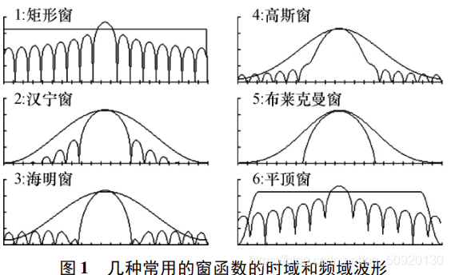

## 基于傅里叶变换的图像配准原理

基于FFT的图像配准方法主要使用的技术有两种: 相位相关和对数极坐标变换. 运行相位相关技术可以确定两幅图之间的相对平移量, 利用对数极坐标变换技术可把笛卡尔坐标系下图像之间的旋转角度和缩放尺度转化为Log-Polar坐标系下对应的平移差.

### **相关相关法**

相位相关法主要利用Fourier变换的时域平移性质(Shift Property). 假设两幅图像使用灰度函数$f_1(x,y)$和$f_2(x,y)$表示, 并且两幅图仅存在平移变换, $f_2(x,y)$是$f_1(x,y)$平移$(x_0,y_0)$的结果, 即:
$$
f_2(x,y)=f_1(x-x_0,y-y_0)
$$
用$F(u,v)$表示图像的二维Fourier变化, 对上式两边求Fourier变换, 由平移性质可得
$$
F_2(u,v)=exp(-j2\pi(ux_0+vy_0))F_1(u,v)
$$
他们之间互功率谱:
$$
CP=\frac{F_1(u,v)F^*(u,v)}{|F_1(u,v)F^*_2(u,v)|}=exp(j 2\pi(ux_0+vy_0))
$$
其中, $F^*_2(u,v)$是$F_2(u,v)$的复共轭. 由于互功率谱对应的Fourier逆变换是二维平面上的一个脉冲信号, 通过寻找峰值位置可确定图像之间的平移参数.

### 对数极坐标变换

对数极坐标变换又称为傅里叶-梅林变换, 可把图像间存在旋转和缩放转化为Log-Polar坐标系下的平移变换.

假设图像$f_2(x,y)$是图像$f_1(x,y)$旋转$\theta_0$, 缩放$s$倍, 平移$(x_0,y_0)$之后的结果, 它们之间的变换模型:
$$
f_2(x,y)=f_1(s(x\cos\theta_0+y\sin\theta_0)+x_0, s(-x \sin \theta_0 + y\cos \theta_0)+y_0)
$$
这里用$M_1$和$M_2$分别表示$f_1,f_2$在极坐标下的Fourier变换的模, 则对上式进行极坐标下的Fourier变换, 可得:
$$
M_2(r,\theta)=s^{-2}M_1(s^{-1}r,\theta-\theta_0)
$$
如果在半径方向进行对数操作, 则
$$
M_2(r,\theta)=s^{-2}M_1(d-d_0,\theta-\theta_0)
$$
其中, $d=\ln r,d_0=\ln s$

通过插值法求解对数极坐标系下的频谱幅值, 运用相位相关法和一定的数学转换关系可得到两幅图像之间的旋转角和缩放因子, 图像间旋转角度和缩放尺度的估计值$(x, \theta_0)$:
$$
s=base^k, \theta_0=m(\frac{360}{N})
$$
其中, N为Log-polar坐标系下角度方向划分总数, base为坐标转换所用的对数基地,$(k,m)$为脉冲信号的峰值位置.

### 标准差置信度选择

考虑一组数据具有近似于**正态分布**的概率分布。若其假设正确，则约**68.3%**数值分布在距离平均值有1个标准差之内的范围，约**95.4%**数值分布在距离平均值有2个标准差之内的范围，以及约**99.7%**数值分布在距离平均值有3个标准差之内的范围。称为“**68-95-99.7法则**”或“**经验法则**” [1] 。

## reference

-   https://cloud.tencent.com/developer/article/1692264
-   [FFT用于特征匹配+相似性度量](https://blog.csdn.net/yohnyang/article/details/122830309)
-   [基于频谱和空域特征匹配的图像配准算法]