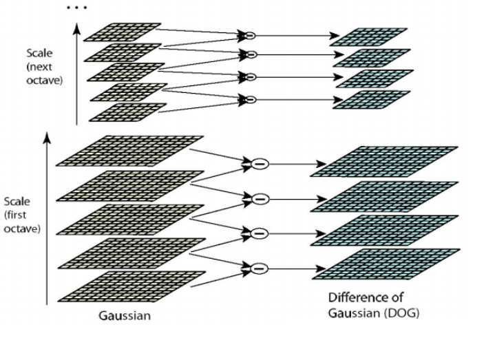

# Sift

## SIFT算法的特点

1.   具有较好的**稳定性**和**不变性**, SIFT特征是图像的局部特征, 其对选择, 尺度缩放, 亮度变换保持不变性, 对视角变化, 仿射变化, 噪声也保持一定尺度的稳定性
2.   **区分性好**, 能够在海量特征数据库中进行快速准确的区分信息进行匹配
3.   **多量性**,就算只有单个物体, 也能产生大量特征向量
4.   **高速性**, 能够快速的进行特征向量的匹配
5.   **可扩展性**, 能够与其他形式的特征向量进行联合

## SIFT算法实质

在不同空间上查找关键点, 并计算关键点的方向, 拼接基于这些匹配特征点进行计算单应性矩阵.

## SIFT算法步骤

1.   **提取关键点**: 关键点是一些十分突出的不会因光照, 尺度, 旋转等因素而消失的点, 比如角点, 边缘点, 暗区的亮点以及亮区的暗点. 此步骤是搜索所有尺度空间上的图像位置. 通过高斯微分函数来识别潜在的具有尺度和旋转不变性的关键点.
2.   **定位关键点并确定特征方向**: 在每个候选的位置上, 通过一个拟合精细的模型来确定位置和尺度. 关键点的选择依据于它们的稳定程度. 然后基于图像局部的梯度方向, 分配给每个关键点位置一个或多个方向. 所有后面的的图像数据的操作都相对于关键点的方向, 尺度和位置进行变换, 从而提供对于这些变换的不变性.
3.   **通过各关键点的特征向量**, 进行两两比较找出相互匹配的若干对特征点, 建立景物间的对应关系.

## 空间尺度

尺度空间即试图在图像领域中模拟人眼观察物体的概念与方法. SIFT算法在构建尺度空间时采取高斯核函数进行滤波, 使原始图像保持最多的细节特征, 经过高斯滤波后细节特征逐渐减少来模拟大尺度情况下的特征表示

利用高斯核函数进行滤波的主要原因有两个:

1.   高斯核函数使唯一的尺度不变函数
2.   DoG和函数可以近似为LoG函数, 这样可以使特征提取更加简单.

$$
G(r)=\frac{1}{\sqrt{2 \pi \sigma^{2}} N} e^{-\mathrm{r}^{2} /\left(2 \sigma^{2}\right)}
$$
其中， $\sigma$ 是正态分布的标准差， $\sigma$ 值越大，图像越模糊(平滑)。 $r$ 为模糊半径, 模糊半径是指模板元素到模板中心的距离。如二维模板大小 为 $m * n$, 则模板上的元素 $(x, y)$ 对应的高斯计算公式为:
$$
G(x, y)=\frac{1}{2 \pi \sigma^{2}} e^{-\frac{(x-m / 2)^{2}+(y-n / 2)^{2}}{2 \sigma^{2}}}
$$

>   二维高斯模糊效果图

## 高斯金字塔的构建

尺度空间在实现时用高斯金字塔表示, 高斯金字塔的构建分为两步

1.   对图像做高斯平滑
2.   对图像做降采样

图像的金字塔模型是指将原始图像不断降采样, 得到一系列大小不一样的图像. 为了让尺度体系其连续性, 高斯金字塔在简单降采样的基础上加上高斯滤波.

**表示**
高斯图像金字塔共有O组, S层, 则由
$$
\sigma(s)=\sigma_{0} 2^{s / s}
$$
$\sigma$: 尺度空间坐标; s: sub-level层坐标, $\sigma_0$: 初始尺度, S: 每组层数(一般为3~5层)

## DoG空间极值检测

1.   DoG函数
     $$
     \begin{aligned}
     &L(x, y, \sigma)=G(x, y, \sigma) * I(x, y) \\
     &D(x, y, \sigma)=[G(x, y, k \sigma)-G(x, y, \sigma)]^{*} I(x, y)=L(x, y, k \sigma)-L(x, y, \sigma)
     \end{aligned}
     $$

2.   DoG高斯差分金字塔

     对应DoG算子, 需构建DoG金字塔

     可以通过高斯差分图像看出图像上的像数值变换情况. (如果没有变换, 也就没有特征. 特征必须是变化尽可能多的点). DoG图像描绘的是目标的轮廓

     

2.   DoG局部极值检测

     特征点是由DoG空间的局部极值点组成. 为了寻找DoG函数的极值点, 每一个像素点要和它所有的相邻点比较, 看其是否比它的图像域核尺度的相邻点大或者小. 特征点是由DoG空间的局部极值点组成. 为了寻找DoG函数的极值点, 每一个像素点要和它所有的相邻点比较, 看其是否比它的图像域核尺度域的相邻点大或者小. 如下图, 中间的检测点和它同尺度的8个相邻点和上下相邻尺度对应的9x2点共26个点比较, 以确保在尺度空间和二维图像空间都检测到极值点.

     

3.   去除边缘效应

     在边缘梯度的方向上主曲率值比较大, 而沿着边缘方向则主曲率值较小. 候选特征点的DoG函数D(x) 的主曲率2x2 Hessian矩阵H的特征值成正比.
     $$
     H=\left[\begin{array}{ll}
     D_{x x} & D_{x y} \\
     D_{x y} & D_{y y}
     \end{array}\right]
     $$
     其中$D_{xx}, D_{xy}, D_{yy}$是候选点领域对应位置的差分求得的.

## 关键点方向匹配

通过尺度不变性求极值, 需要利用图像的局部特征为每个关键点分配一个基准方向, 使描述子对图像选择具有选择不变性. 对于在DoG金字塔中检测出的关键点, 采集其所在高斯金字塔图像$3\sigma$领域窗口内像素的梯度和方向分布特征. 梯度的模值和方向如下.
$$
\begin{aligned}
&m(x, y)=\sqrt{(L(x+1, y)-L(x-1, y))^{2}+(L(x, y+1)-L(x, y-1))^{2}} \\
&\theta(x, y)=\tan ^{-1}((L(x, y+1)-L(x, y-1)) /(L(x+1, y)-L(x-1, y)))
\end{aligned}
$$
采用梯度直方图统计, 统计一下关键点为原点, 一定区域内的图像像素点确定关键点方向. 在完成关键点的梯度计算后, 使用直方图统计领域内像素的梯度和方向. 梯度直方图将0~360度方向范围分为36个柱, 其中每柱10. 如下图所示, 直方图的峰值方向代表了关键点的主方向, 方向直方图的峰值则代表了该特征点出邻域梯度的方向, 以直方图最大值作为该关键点的主方向. 为了增强匹配的鲁棒性, 只保留峰值大于主方向80%的方向作为该关键点的辅方向.

## 关键点描述

对于每一个关键点, 都拥有位置, 尺度以及方三个信息. 每个关键点建立一个描述符, 用一组向量将这个关键点描述出来, 使其不随着各种变化而改变, 如关照, 视角变化等. 这个描述子不但包括关键点, 也包含关键点周围对其有贡献的像素点, 并且描述符应该有较高的独特性, 以便于提高关键点正确匹配的概率.

Lowe实验结果表明: 描述子采用4x4x8=128维向量表示, 综合效果最优.

## 关键点匹配

1.   分别对模板图(reference image)和实时图(观测图, observation image)建立关键点描述子集合. 目标的识别使通过两点集内关键点描述子的比对来完成. 具有128维的关键点描述子的相似性度量采用欧氏距离
2.   匹配可采取穷举法, 但所花费的时间太多. 所有一般采用kd树的数据结构来完成搜索. 搜索的内容是以目标图像的关键点为基准, 搜索与目标图像的特征点最邻近的原图像特征点和次林锦的原图像特征点.

## cellBin图像Sift特征点检测及匹配效果

**组织区域**

>   原图

>   红色点: feature points of sift, 线条: 匹配成功的点

**非组织区域**

>   原图

>   匹配的特征图

## 总结

基于sift的特征点匹配的拼接方法, 在非组织区域效果会非常差.

## Reference

[SIFT算法详解](https://blog.csdn.net/zddblog/article/details/7521424)

[SIFT算法原理](https://blog.csdn.net/qq_37374643/article/details/88606351)

