# 单应性变换

## 图像变换与平面坐标系的关系

**旋转**

将图形围绕原点(0,0)逆时针方向旋转$\theta$,解析式为
$$
x^` = x*cos \theta -y*sin \theta
$$
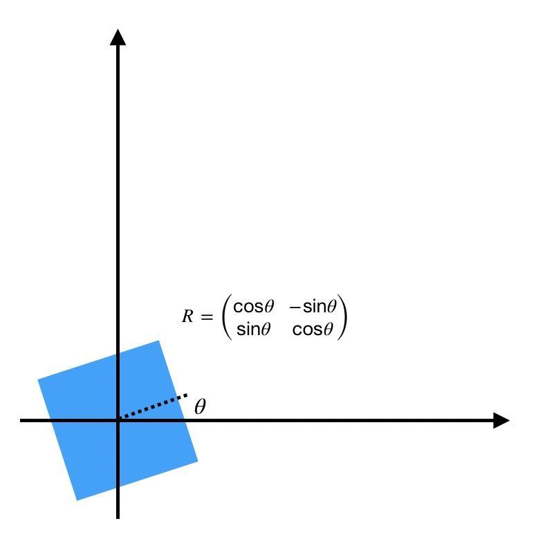

对于矩阵变换为:
$$
\left(\begin{array}{l}
x^{\prime} \\
y^{\prime}
\end{array}\right)=\left[\begin{array}{cc}
\cos \theta & -\sin \theta \\
\sin \theta & \cos \theta
\end{array}\right]\left(\begin{array}{l}
x \\
y
\end{array}\right)=R\left(\begin{array}{l}
x \\
y
\end{array}\right)
$$
- 平移:
$$
\begin{aligned}
&x^{\prime}=x+t_{x} \\
&y^{\prime}=y+t_{y}
\end{aligned}
$$
平移
$$
\left(\begin{array}{l}
x^{\prime} \\
y^{\prime}
\end{array}\right)=\left(\begin{array}{l}
x \\
y
\end{array}\right)+
\left[\begin{array}{l}
t_{x} \\
t_{y}
\end{array}\right]
$$
但是现在遇到困难了, 平移无法写成和上面旋转一样的矩阵乘法形式。所以引入齐次坐标 $(x, y) \Leftrightarrow(x, y, 1)$, 再写成矩阵形式:
$$
\left(\begin{array}{c}
x^{\prime} \\
y^{\prime} \\
1
\end{array}\right)=\left[\begin{array}{ccc}
1 & 0 & t_{x} \\
0 & 1 & t_{y} \\
0 & 0 & 1
\end{array}\right]\left(\begin{array}{l}
x \\
y \\
1
\end{array}\right)=\left[\begin{array}{cc}
I_{2 \times 2} & T_{2 \times 1} \\
0^{T} & 1
\end{array}\right]\left(\begin{array}{l}
x \\
y \\
1
\end{array}\right)
$$
其中,$I_{2*2}=\left[\begin{array}{l}
1 & 0 \\
0 & 1
\end{array}\right]$,表示单位矩阵， $T_{2*1}=\left[\begin{array}{l}
t_x \\
t_y
\end{array}\right]$, 表示平移向量

将选择和平移统一写在一个矩阵乘法公式中， 即刚体变换。
$$
\left(\begin{array}{l}
x^{\prime} \\
y^{\prime} \\
1
\end{array}\right)=\left[\begin{array}{ccc}
\cos \theta & -\sin \theta & t_{x} \\
\sin \theta & \cos \theta & t_{y} \\
0 & 0 & 1
\end{array}\right]\left(\begin{array}{l}
x \\
y \\
1
\end{array}\right)=\left[\begin{array}{cc}
R_{2 \times 2} & T_{2 \times 1} \\
0^{T} & 1
\end{array}\right]\left(\begin{array}{l}
x \\
y \\
1
\end{array}\right)
$$
旋转矩阵$R_{2*2}$是正交矩阵

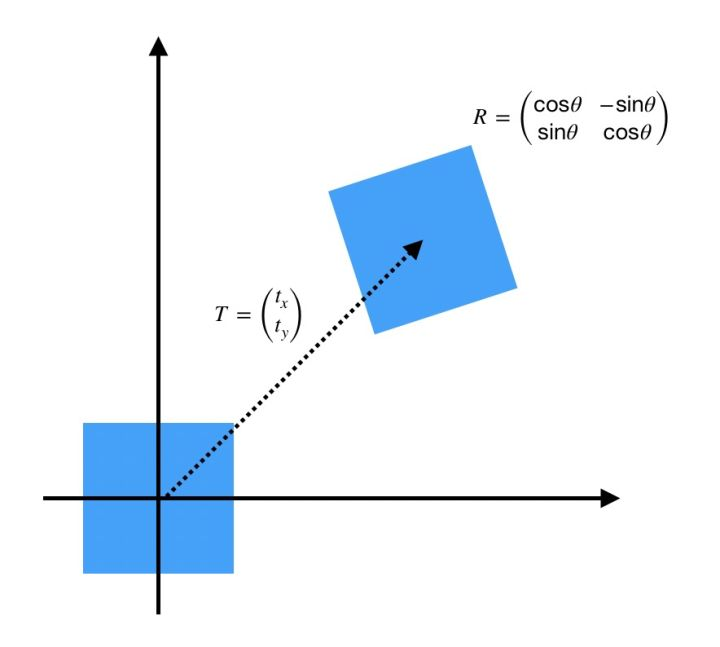

**仿射变换**
$$
\left(\begin{array}{l}
x^{\prime} \\
y^{\prime} \\
1
\end{array}\right)=\left[\begin{array}{cc}
A_{2 \times 2} & T_{2 \times 1} \\
0^{T} & 1
\end{array}\right]\left(\begin{array}{l}
x \\
y \\
1
\end{array}\right)
$$
其中 $A_{2 \times 2}=\left[\begin{array}{ll}a_{11} & a_{12} \\ a_{21} & a_{22}\end{array}\right]$ 可以是任意 $2 \times 2$ 矩阵 (与 $R$ 一定是正交矩阵不同)。

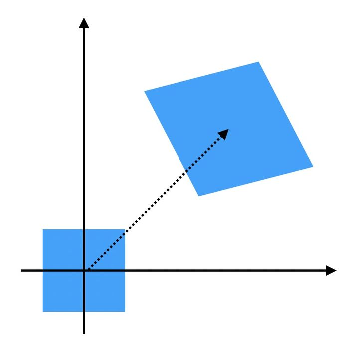

可以看到，相比刚体变换(旋转和平移)，仿射变换除了改变目标位置，还改变目标的形状，但是会保持物体的“平知性”（即图像中平行的两条线变换后依然平行）

不同A和T矩阵对应的各种基本仿射变换:

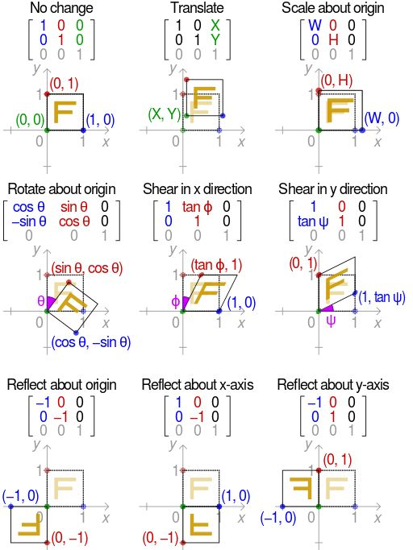

**投影变换(单应性变换)**
$$
\left(\begin{array}{l}
x^{\prime} \\
y^{\prime} \\
1
\end{array}\right)=\left[\begin{array}{cc}
A_{2 \times 2} & T_{2 \times 1} \\
0^{T} & 1
\end{array}\right]\left(\begin{array}{l}
x \\
y \\
1
\end{array}\right)
$$
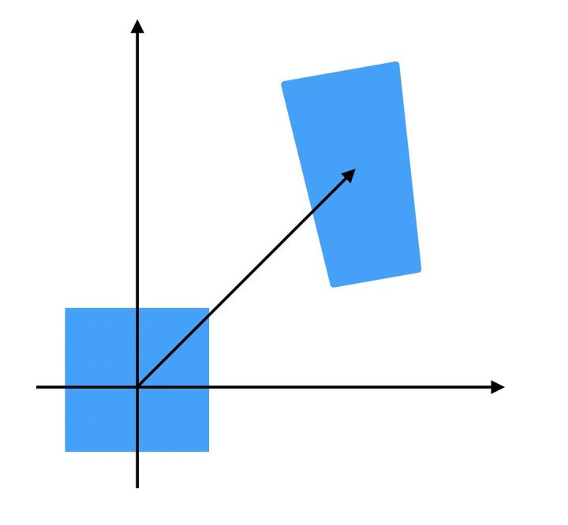

投影变换彻底改变目标的形状.

**小结**

1.   刚体变换: 平移+旋转, 只改变物体位置, 不改变物体形状
2.   仿射变换: 改变物体位置和形状, 但是保持“平直性”
3.   单应性变换: 彻底改变物体位置和形状

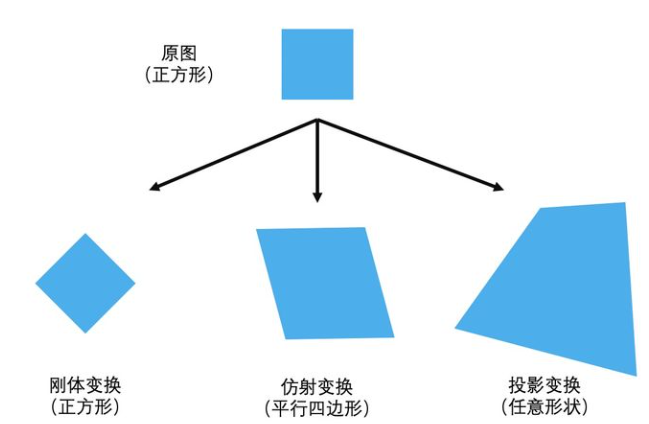

其中完成单应性变换矩阵各个参数的物理含义:
$$
H_{3 \times 3}=\left[\begin{array}{cc}
A_{2 \times 2} & T_{2 \times 1} \\
V^{T} & s
\end{array}\right]=\left[\begin{array}{ccc}
a_{11} & a_{12} & t_{x} \\
a_{21} & a_{22} & t_{y} \\
v_{1} & v_{2} & s
\end{array}\right]
$$
其中$A_{2*2}$代表仿射变换参数, $T_{2*1}$代表平移变换参数

而$V^T=[v_1, v_2]$表示一种“变换后边缘交点”关系

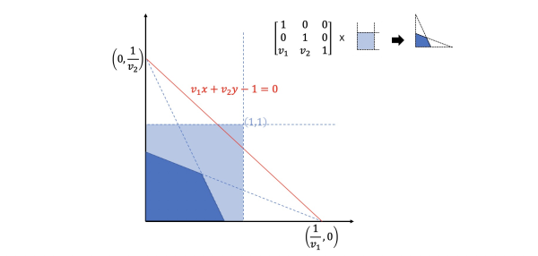

至于s则是一个与$V^T=[v_1,v_2]$相关的缩放因子.
$$
\left[\begin{array}{ccc}
1 & 0 & 0 \\
0 & 1 & 0 \\
v_{1} & v_{2} & s
\end{array}\right]\left(\begin{array}{l}
x \\
y \\
1
\end{array}\right)=\left(\begin{array}{c}
x \\
y \\
v_{1} x+v_{2} y+s
\end{array}\right) \Leftrightarrow\left(\begin{array}{c}
\frac{x}{v_{1} x+v_{2} y+s} \\
\frac{y}{v_{1} x+v_{2} y+s}
\end{array}\right)
$$

## 平面坐标系与齐次坐标系

齐次坐标系 $(x, y, w) \in \mathbb{P}^{3}$ 与常见的三维空间坐标系 $(x, y, z) \in \mathbb{R}^{3}$ 不同，只有两个自由 度:
$$
\left(\begin{array}{c}
\frac{x}{w} \\
\frac{y}{w}
\end{array}\right) \Leftrightarrow\left(\begin{array}{c}
x \\
y \\
w
\end{array}\right)
$$
而 $w$ (其中 $w>0$ ) 对应坐标 $x$ 和 $y$ 的缩放尺度。当 $w=1$ 时：
$$
\left(\begin{array}{l}
x \\
y
\end{array}\right) \Leftrightarrow\left(\begin{array}{l}
x \\
y \\
1
\end{array}\right)
$$
特别的当 $w=0$ 时，对应无穷远:
$$
\left(\begin{array}{l}
\operatorname{Inf} \\
\operatorname{Inf}
\end{array}\right) \Leftrightarrow\left(\begin{array}{l}
x \\
y \\
0
\end{array}\right)
$$

## 单应性变化

定义: 用**无镜头畸变**的相机从不同位置拍摄 **同一平面物体**的图像之间存在单应性, 可以用 **投影变换**表示.

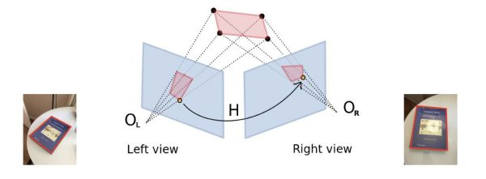
$$
\left(\begin{array}{l}
x_l \\
y_l
\end{array}\right) \Leftrightarrow H_{3*3}*\left(\begin{array}{l}
x_r \\
y_r \\
1
\end{array}\right)
$$
其中$(x_l,y_l)$是left view图片上的点, $(x_r,y_r)$是Right view图上对应的点.

**那么这个$H_{3*3}$单应性矩阵如何求解:**

从脜一般的情况分析，每一组匹配点 $\left(x_{i}, y_{i}\right) \stackrel{\text { match }}{\longrightarrow}\left(x_{i}^{\prime}, y_{i}^{\prime}\right)$ 有等式 (15) 成立:
$$
\left(\begin{array}{c}
x_{i}^{\prime} \\
y_{i}^{\prime} \\
1
\end{array}\right)=\left[\begin{array}{lll}
h_{11} & h_{12} & h_{13} \\
h_{21} & h_{22} & h_{23} \\
h_{31} & h_{32} & h_{33}
\end{array}\right]\left(\begin{array}{c}
x_{i} \\
y_{i} \\
1
\end{array}\right)=\left(\begin{array}{c}
h_{11} x_{i}+h_{12} y_{i}+h_{13} \\
h_{21} x_{i}+h_{22} y_{i}+h_{23} \\
h_{31} x_{i}+h_{32} y_{i}+h_{33}
\end{array}\right)
$$
由平面坐标与齐次坐标对应关系 $\left(\frac{x}{w}, \frac{y}{w}\right) \in \mathbb{R}^{2} \Leftrightarrow(x, y, w) \in \mathbb{P}^{3}$ ，上式可以表示为
$$
\begin{array}{r}
x_{i}^{\prime}=\frac{h_{11} x_{i}+h_{12} y_{i}+h_{13}}{h_{31} x_{i}+h_{32} y_{i}+h_{33}} \\
y_{i}^{\prime}=\frac{h_{21} x_{i}+h_{22} y_{i}+h_{23}}{h_{31} x_{i}+h_{32} y_{i}+h_{33}}
\end{array}
$$
进一步变换为:
$$
\begin{aligned}
&\left(h_{31} x_{i}+h_{32} y_{i}+h_{33}\right) \cdot x_{i}^{\prime}=h_{11} x_{i}+h_{12} y_{i}+h_{13} \\
&\left(h_{31} x_{i}+h_{32} y_{i}+h_{33}\right) \cdot y_{i}^{\prime}=h_{21} x_{i}+h_{22} y_{i}+h_{23}
\end{aligned}
$$
写成矩阵 $A X=0$ 形式:
$$
\left[\begin{array}{ccccccccc}
x_{i} & y_{i} & 1 & 0 & 0 & 0 & -x_{i}^{\prime} x_{i} & -x_{i}^{\prime} y_{i} & -x_{i}^{\prime} \\
0 & 0 & 0 & x_{i} & y_{i} & 1 & -y_{i}^{\prime} x_{i} & -y_{i}^{\prime} y_{i} & -y_{i}^{\prime}
\end{array}\right]\left[\begin{array}{l}
h_{11} \\
h_{12} \\
h_{13} \\
h_{21} \\
h_{22} \\
h_{23} \\
h_{31} \\
h_{32} \\
h_{33}
\end{array}\right]=0
$$
也就是说一组匹配点 $\left(x_{i}, y_{i}\right) \stackrel{\text { match }}{\longrightarrow}\left(x_{i}^{\prime}, y_{i}^{\prime}\right)$ 可以获得 2 组方程。

**单应性矩阵8自由度**

注意观察, 单应性矩阵H与aH其实完全一样(其中a≠0):
$$
\begin{gathered}
x_{i}^{\prime}=\frac{a h_{11} x_{i}+a h_{12} y_{i}+a h_{13}}{a h_{31} x_{i}+a h_{32} y_{i}+a h_{33}}=\frac{h_{11} x_{i}+h_{12} y_{i}+h_{13}}{h_{31} x_{i}+h_{32} y_{i}+h_{33}} \\
y_{i}^{\prime}=\frac{a h_{21} x_{i}+a h_{22} y_{i}+a h_{23}}{a h_{31} x_{i}+a h_{32} y_{i}+a h_{33}}=\frac{h_{21} x_{i}+h_{22} y_{i}+h_{23}}{h_{31} x_{i}+h_{32} y_{i}+h_{33}}
\end{gathered}
$$
即点 $\left(x_{i}, y_{i}\right)$ 无论经过 $H$ 还是 $a H$ 映射, 变化后都是 $\left(x_{i}^{\prime}, y_{i}^{\prime}\right)$ 。
如果使 $a=\frac{1}{h_{33}}$ ，那么有:
$$
H^{\prime}=a H=\left[\begin{array}{ccc}
\frac{h_{11}}{h_{33}} & \frac{h_{12}}{h_{33}} & \frac{h_{13}}{h_{33}} \\
\frac{h_{21}}{h_{33}} & \frac{h_{22}}{h_{33}} & \frac{h_{23}}{h_{33}} \\
\frac{h_{31}}{h_{33}} & \frac{h_{32}}{h_{33}} & 1
\end{array}\right]=\left[\begin{array}{ccc}
h_{11}^{\prime} & h_{12}^{\prime} & h_{13}^{\prime} \\
h_{21}^{\prime} & h_{22}^{\prime} & h_{23}^{\prime} \\
h_{31}^{\prime} & h_{32}^{\prime} & 1
\end{array}\right]
$$
所以单应性矩阵 $H$ 患然有 9 个末知数，但只有 8 个自由度。
在求 $H$ 时一般添加约束 $h_{33}=1$ (也有用 $\sqrt{h_{11}^{2}+h_{12}^{2}+\ldots+h_{33}^{2}}=1$ 约束)，所以还 有 $h_{11} \sim h_{32}$ 共8个末知数。由于一组匹配点 $\left(x_{i}, y_{i}\right) \stackrel{\text { match }}{\longrightarrow}\left(x_{i}^{\prime}, y_{i}^{\prime}\right)$ 对应2组方程，那么 只需要 $n=4$ 组不共线的匹配点即可求解 $H$ 的唯一解。

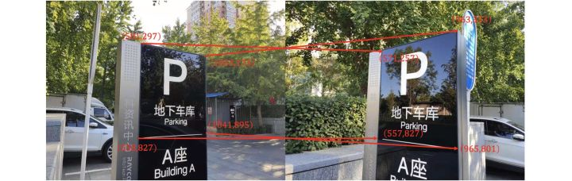

利用OpenCV提供的相关API, 进行变换

```python
import cv2
import numpy as np

im1 = cv2.imread('left.jpg')
im2 = cv2.imread('right.jpg')

src_points = np.array([[581, 297], [1053, 173], [1041, 895], [558, 827]])
dst_points = np.array([[571, 257], [963, 333], [965, 801], [557, 827]])

H, mask = cv2.findHomography(src_points, dst_points)

h, w = im2.shape[:2]
im2_warp = cv2.warpPerspective(im1,H,(w,h))
```

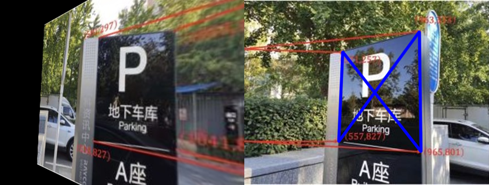


可以看到：

1.   变换后， 图一四个点与图二四个点基本对齐
2.   平面外背景物体不符合单应性原理， 偏离很大， 完全无法对齐

**传统方法估计单应性矩阵**

1.   提取每张图SIFT/SURF/FAST/ORB等特征点
2.   提取每个特征点对应的描述子
3.   通过匹配特征点描述子, 找到两张图中匹配的特征点对
4.   使用RANSAC算法剔除错误匹配
5.   求解方程组, 计算Homograph变换矩阵

```python
#coding:utf-8

# This code only tested in OpenCV 3.4.2!
import cv2 
import numpy as np

# 读取图片
im1 = cv2.imread('left.jpg')
im2 = cv2.imread('right.jpg')

# 计算SURF特征点和对应的描述子，kp存储特征点坐标，des存储对应描述子
surf = cv2.xfeatures2d.SURF_create()
kp1, des1 = surf.detectAndCompute(im1, None)
kp2, des2 = surf.detectAndCompute(im2, None)

# 匹配特征点描述子
bf = cv2.BFMatcher()
matches = bf.knnMatch(des1, des2, k=2)

# 提取匹配较好的特征点
good = []
for m,n in matches:
    if m.distance < 0.7*n.distance:
        good.append(m)

# 通过特征点坐标计算单应性矩阵H
# （findHomography中使用了RANSAC算法剔初错误匹配）
src_pts = np.float32([kp1[m.queryIdx].pt for m in good]).reshape(-1,1,2)
dst_pts = np.float32([kp2[m.trainIdx].pt for m in good]).reshape(-1,1,2)
H, mask = cv2.findHomography(src_pts, dst_pts, cv2.RANSAC, 5.0)
matchesMask = mask.ravel().tolist()

# 使用单应性矩阵计算变换结果并绘图
h, w, d = im1.shape
pts = np.float32([[0,0], [0,h-1], [w-1,h-1], [w-1,0]]).reshape(-1,1,2)
dst = cv2.perspectiveTransform(pts, H)
img2 = cv2.polylines(im2, [np.int32(dst)], True, 255, 3, cv2.LINE_AA)

draw_params = dict(matchColor = (0,255,0), # draw matches in green color
                   singlePointColor = None,
                   matchesMask = matchesMask, # draw only inliers
                   flags = 2)

im3 = cv2.drawMatches(im1, kp1, im2, kp2, good, None, **draw_params)
```

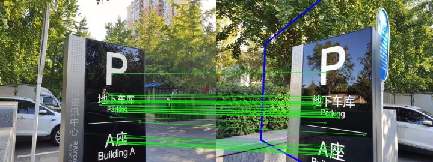

## reference

-   [单应性Homograph估计：从传统算法到深度学习](https://zhuanlan.zhihu.com/p/74597564)
