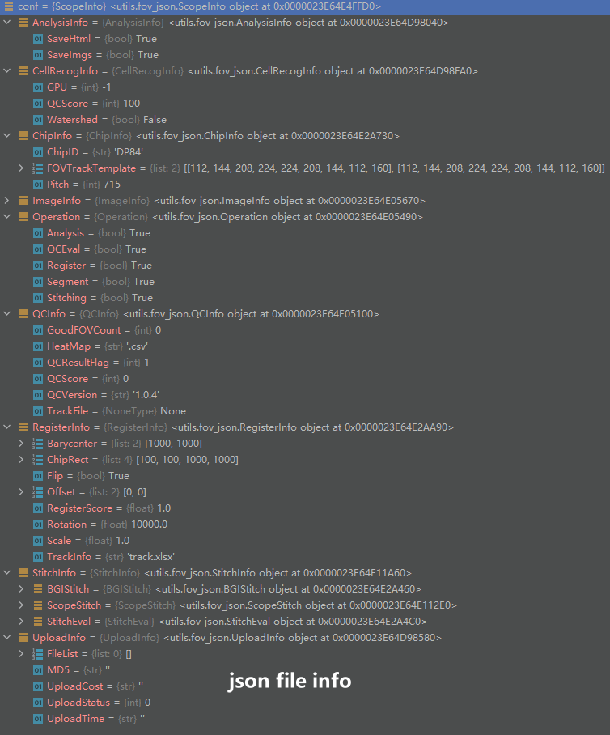

# Cellbin

背景: 时空多组学技术产品中, 影像组学作为辅助验证的手段, 为**支持超大视场和单细胞分辨率**的技术优势, 需要开发一套cell bin数据交付的图像处理解决方案, 以及支持多组学辅助验证的个性化图像处理分析.

目标: 支撑时空新产品开发(转录组V2, 时空单细胞, 蛋白组+转录组等)中的数据分析和算法开发工作, 形成三套新产品标准分析流程, 并建立系统的时空数据评估优化体系, 扩散比例, 接头含量等关键业务指标满足转产需求, 提升芯片生产成功率到达60%

| 任务     | 目标                                                         |
| -------- | ------------------------------------------------------------ |
| ImageQC  | 1. 优化ImageQC中track线检测方法, 保证白名单内数据的检出率及误检率, 提升点定位精度<br />2. 完成ImageQC中图像清晰度评估部分的部署, 并继续优化算法, 实现mAP有3个百分点以上的增长<br />3. 配合流程完成组织类型白名单制定<br />4. 配合软件开发同事, 开发多类型显微镜接入ImageQC工作<br />5. 辅组motic, 长光及大行程TDI影像图的分析及反馈<br />6. 配合联合实验室建设中一体机的评估<br />7. 增加overlap评估功能<br />8. JIRA任务完成率>95% |
| 图像拼接 | 1. 开发一款拼接精度评估工具, 并嵌入ImageQC软件中供显微镜评估使用<br />2. 开发一款手动拼接工具, 使用人次>10人<br />3. 优化拼接算法, 组织内外拼接误差均再5个像素内<br />4. 拼接完善: 拼接融合, 背景平衡, 矫正 |
| 图像配准 | 1. 开发至少三种以上配准评估指标, 并确定其中一种作为最终使用指标, 开发表达矩阵数据评估指标<br />2. 保证QC通过的, 白名单内数据自动化成功率>90%<br />3. 研发新类型数据(如HE)的配准方法<br />4. 研发不依赖于表达矩阵的配准方案--隐切机 |
| 组织分割 | 1. 白名单内数据成功率>90%<br />2. 上线手动tissueCut标注工具及SOP |
| 细胞分割 | 1. 优化自研模型, 扩充白名单, 及实现白名单内数据可供下游分析使用<br />2. RNA圈细胞V1版本落地, 实现能够基本满足FFPE样本及时空芯片单细胞的需求, 完成RNA富集评估指标, 指标合格情况下测试保证85%以上的分割合格率<br />3. 整合HE染色细胞分割算法<br />4. cellBin+bin混合模式(解决cellbin不能解决的区域)<br />5. label事件, label工具开发和label外包<br /> |
| 大流程   | 1. 全流程 (假Image QC) 时间开销保证再用户需求的三倍以上以内<br />2. 完成组织白名单指定 |
| 其他     | 1. 多组学技术开发中的影像辅助验证分析<br />2. 科研合作, 临床应用等个性化的图像分析<br />3. JIRA任务及时响应和完成率>90% |


## Stereo-resp


### ImageQC

包含流程: 

```flow
st=>start: IQA
op1=>operation: CrossPoint
op2=>operation: LineDetect
op3=>operation: TraditionalLineDetect
op4=>operation: TemplateEval

st->op1->op2->op3->op4
```

```python
# input parameter
input='D:\\kuisu\\project\\stitchImg\\data\\FP200000340BR_A1', output='./output',
conf='', 
vis='',
manufacturer='motic', 
chip_id='SS84',
restart=False, 
auto_remove=False
```

-   Pipline

    ```markdown
    # pipeline_entry()
    	1. prepare dirs, output_dir must be given
    	2. prepare input data
    		a. 预处理结果检验
    			2_stitich: fov_stitched, template.txt
    			4_register: fov_stitched_transformed.tif, im_shape.txt
                5_mask: *_mask.tif, *_tissue_cut.tif
             b. 加载origin_image, 并将图片复制到1_origin文件下
             	1. 利用ZeissReader(file_path, save_path): 读取czi文件, 并保存
             	该方法继承与FOVReader(), 其包含以下流程:
             	1). FOVReader()
             		- manufacture
             		- file_path
             		- fov_width
             		- fov_height
             		- fov_cols
             		- fov_rows
             		- fov_count
             		- bg_color
             	2). SitchInfo()
             		- global_height
             		- global_width
             		- loc
             		- overlap
             	3). fov_json.ScopeInfo()
             		- QCInfo()
             		- Operation()
             		- ImageInfo()
             		- StitchInfo()
             		- RegisterInfo()
             		- ChipInfo()
             		- CellRecogInfo()
             		- UploadInfo()
             		- AnalysisInfo()
             	2. 相关操作
             		reader = CziReader(file_path)#读取czi的文件,如下图czi图像信息所示
             		czi = CziFile(file_path)#读取czi文件信息, 如下图czi文件信息所示
             		bboxes = list(czi.get_all_mosaic_tile_bounding_boxes(S=render.current_scene_index).values())# 获取每个FOV的拼接坐标(x,y,h,w)
             		self.stitch_info.loc = np.zeros((scanRows, ScanCols,2))
             		#将图片进行保存.
             
             #3. datermine config
             	#1). 从传入参数中加载configure
             	self.conf = self.parse_config(args.conf)
             	self.conf_file = args.conf
             	#2). 从1_origin文件夹中读取json
             	_get_config(conf_json)
             	self.parse_config(conf_json)
             	conf = fov_json.ScopeInfo()
             	conf.deserialize(conf_path)
             
             #4. update json info
             	common.json_serialize(self.conf, self.conf_file)#保存到json
             	
    
    ```

    -   CZI图像信息

        

    -   CZI file信息

        

    -   FOV stitching 信息

        

        ​	注: 该czi图片有37*2张FOV, 对应74个bbox

    -   fov_json info

        

        

### Stitching

#### model

| model name      | description                                     |
| --------------- | ----------------------------------------------- |
| `fov_extractor` | 找出组织中心, 并计算出最先拼接的水平和竖直方向. |
| `fov_info`      | 获取存放在json中的信息                          |
| `fov_sift`      | 将所有的FOV利用sift进行拼接, 仅计算出偏移量     |
| `fov_stitch`    |                                                 |
|                 |                                                 |
|                 |                                                 |
|                 |                                                 |
|                 |                                                 |
|                 |                                                 |

#### **FOVExtractor**

```python
def __init__(self, info):
    self.fov_info = info
    self.center = None
    self.mean_value = np.zeros((self.fov_info.fov_rows,self.fov_info.fov_cols))
    self.mean_value = np.zeros((self.fov_info.fov_rows,self.fov_info.fov_cols))
    self.global_mean = 0
    self.template_src = None
    self.pre_stitch_col_pair = None
    self.pre_stitch_row_pair = None
```

#提取组织区域

```python
def extract_tissue(self,):
    # todo: get best hist-min-val
    for i n range(self.fov_info.fov_rows):
        for j in range(self.fov_info.fov_cols):
            mat = self.fov_info.get_image(i,j)
            if mat is not None:
                m, v = cv.meanStdDev(mat)#求图像的均值和偏差
                self.mean_value[i,j]=m[0][0]
                self.std_value[i,j]=v[0][0]
                self.global_mean += m[0][0]
            else:
                self.mean_value[i,j]=0
                self.std_value[i,j]=0
    max_v = np.max(self.mean_value)
    ind = np.where(self.mean_value==max_v)
    self.center = [int(ind[0][0]), int(ind[1][0])]#todo ?
    self.global_mean = round(self.global_mean/self.fov_info.fov_count,2)
    
                
```

**FOV_sift**

```python
def sift_keypoints_detect(image):
    #获取图像特征sift-SIFT特征点, 实例对象sift
    model = cv2.SIFT_create()
    #keypoints: 特征点向量, 向量内的每一个元素是一个keypoint对象, 包含了特征点的各种属性信息(角度, 关键点坐标等)
    #features: 表示输出的sift特征向量, 通常是128维
    keypoints, features = model.detectAndCompute(image, None)
    keypoints_image = cv2.drawKyepoints(gray_image,keypoints,None,flags=cv2.DRAW_MATCHES_FLAGS_NOT_DRAW_SINGLE_POINTS)
    
def get_feature_point_ensemble(features_right,features_left):
    #创建BFMatcher对象解决匹配问题.
    bf = cv2.BFMatcher()
    mathces = bf.knnMatch(features_right,features_left,k=2)
    #利用sorted()函数对matches对象进行升序
    matches = sorted(matches,key=lambda x:x[0].distance/x[1].distance)
    good = []
    for m, n in matches:
        #ratio的值越大, 匹配的线条越密集, 但错误匹配点也会增多
        ratio = 0.3
        if m.distance<ratio*n.distance:
            good.append(m)
    return good

def delete_wrong_coordinates(ptsL,ptsR):
    gradient_list = []
    for i in range(len(ptsL)):
        gradient_list.append(np.sqrt((ptsL[i][0][1] - ptsR[i][0][1])**2 + (ptsL[i][0][0] - ptsR[i][0][0])**2))
    delete_list = []
    for k in range(len(gradient_list)):
        temp = [1 for j in gradient_list if 1.05>(gradient_list[k]/j)>0.95]
        if len(temp)/len(ptsL)<1/3:
            delete_list.append(k)
    ptsL = np.delete(ptsL,delete_list,axis = 0)
    ptsR = np.delete(ptsR, delete_list,axis = 0)
    return (ptsL, ptsR)

def stitching(image_right,image_left):
    _, keypoints_right,features_right = sift_keypoints_detect(image_right)
    _, keypoints_left,features_left = sift_keypoints_detect(image_left)
    try:
        goodMatch = get_feature_point_ensemble(features_right,features_left)
    except:
        return None
    ptsR = np.float32([keypoints_right[m.queryIdx].pt for m in goodMatch]).reshape(-1,1,2)
    ptsL = np.float32([keypoints_left[m.trainIdx].pt for m in goodMatch]).reshape(-1,-1,2)
    
    ptsL, ptsR = delete_wrong_coordinates(ptsL, ptsR)
    x_list = []
    y_list = []
    
    ptsL_x = np.mean([ptsL[i][0][0] for i in range(len(ptsL))])
    ptsL_y = np.mean([ptsL[i][0][1] for i in range(len(ptsL))])
    
    ptsR_x = np.mean([ptsR[i][0][0] for i in range(len(ptsR))])
    ptsR_y = np.mean([ptsR[i][0][1] for i in range(len(ptsR))])
    h,w = image_left.shape[:2]
    
    if np.abs((ptsL_x-ptsR_x))>np.abs((ptsL_y-ptsR_y)):
        for i in range(len(ptsL)):
            x_list.append(round(w-ptsL[i][0][0]+ptsR[i][0][0]))
            y_list.append(ptsL[i][0][0]-ptsR[i][0][1])
    else:
        for i in range(len(ptsL)):
            x_list.append(ptsL[i][0][0]-ptsR[i][0][0])
            y_list.append(h-pts[i][0][1]+ptsR[i][0][1])
    return (round(np.mean(x_list)),round(np.mean(y_list)))

#将图像进行拼接
def caculate_overlap(info):
    image_path = info.fov_image_path
    imageList = [i for i in os.listdir(image_path) if i.split(".")[1] in ["tif","png"]]
    image_count_x = info.fov_cols
    image_count_y = info.fov_rows
    image_h = info.fov_height
    image_w =  info.fov_width
    
    horizontal_offset = np.zeros((image_count_y, image_count_x,2),dtype=int)-999
    vertical_offset = np.zeros((image_count_y,image_count_x,2),dtype=int)-999
    
    for j in range(image_count_y):
        for i in range(image_count_x):
            if info.manufacturer == "leica dm6m":
                if j%2 == 0:
                    left_index = i+j*(image_count_x)
                    right_index = i+j*(image_count_x)+1
                else:
                    left_index = image_count_x -i +j*(image_count_x)-1
                    right_index = image_count_x - i + j * (image_count_x) - 2
            else:
                left_index = i + j * (image_count_x)
                right_index = i + j * (image_count_x) + 1
            path_left = info.get_image_path(j,i)
            path_right =info.get_image_path(j,i+1)
            
            if path_left != "None" and path_right != "None":
                image_left = cv2.imread(path_left)
                image_rigth = cv2.imread(path_right)
                
                h1, w1, _ = image_left.shape
                h2, w2, _ = image_right.shape
                
                image_left = image_left[:, -int(w1/4):]
                image_right = image_right[:, :int(w2/4)]
                
                try:
                    offset = stitching(image_right,image_left)
                    overlap = info.scope_info.ImageInfo.Overlap*info.fov_width
                    if np.abs(offset[0]-overlap<50) or np.abs(offset[1])<50:
                        horizontal_offset[j,i+1,0]=-offset[0]
                        horizontal_offset[j,i+1,1]=offset[1]
                except: pass
            if j != image_count_y - 1:
                # print('V:' + imageList[i + j*(image_count_x)] + '->' + imageList[i + (j + 1) * (image_count_x)])
                
                if info.manufacturer == 'leica dm6m':
                    if j % 2 == 0:
                        left_index = i + j * (image_count_x)
                        right_index =  image_count_x - i + (j + 1)*(image_count_x) - 1
                    else:
                        left_index = image_count_x - i + j * (image_count_x) - 1
                        right_index =  i + (j + 1)*(image_count_x)
                else:
                    left_index = i + j * (image_count_x)
                    right_index =  i + (j + 1)*(image_count_x)
                    
                path_left = info.get_image_path(j, i)
                path_right = info.get_image_path(j + 1, i)
                # print('V:' + os.path.basename(path_left) + '->' + os.path.basename(path_right))
                if path_left != 'None' and path_right != 'None':
                    image_left = cv.imread(path_left)
                    image_right = cv.imread(path_right)
                    
                    h1, w1, _ = image_left.shape  
                    h2, w2, _ = image_right.shape 
                    
                    image_left = image_left[-int(h1/4):, :]
                    image_right = image_right[:int(h2/4), :]
                    
                    try:
                        offset = stitching(image_right, image_left)
                        overlap = info.scope_info.ImageInfo.Overlap * info.fov_height
                        if np.abs(offset[1] - overlap) < 50 or np.abs(offset[0]) < 50:  
                            vertical_offset[j + 1, i, 0] = offset[0]
                            vertical_offset[j + 1, i, 1] = -offset[1]
                    except: pass
    return horizontal_offset, vertical_offset
```

#### FOVInfo

加载json信息, 并读取FOV图像.


#### **fov_stitch**


```python
class FOVStitch(object):
    def __init__(self, info,conf):
        self.scope_info = info.scope_info
        self.stitch_info = info.stitch_info
        self.scope_stitch = info.scope_stitch_info
        self.fov_loc = None
        self.mosaic_shape = None
        self.blend_mode = None
        self.horizontal_offset = None
        self.vertical_offset = None
        self.fov_info = info
        self.conf = conf
        self.extractor = FOVExtractor(info)
        self.manual_stitch()
        
    def offset_to_loc(self,col):
        self.fov_loc = np.zeros((self.fov_info.fov_rows,self.fov_info.fov_cols,2),dtype=int)
        for i in range(0,self.fov_info.fov_rows):
            info = np.zeros((self.fov_info.fov_cols,2),dtype=int)
            for i in range(1, self.fov_info.fov_cols):
                info[j,:]=info[j-1,:]+self.horizontal_offset[i,j,:]+[self.fov_info.fov_width,0]
            if i == 0: delta = [0,0]
            else:
                delta = self.fov_loc[i-1,col,:]+\
            		[0,self.fov_info.fov_height]-info[col,:]+self.vertical_offset[i,col,:]
        	self.fov_loc[i,:,:] = info+delta#
    	self.fov_loc[:,:,0]-=np.min(self.fov_loc[:,:,0])
    	self.fov_loc[:,:,1]-=np.min(self.fov_loc[:,:,1])
        
	def loc_to_offset(self):
        self.horizontal_offset = np.zeros((self.fov_info.fov_rows,self.fov_info.fov_cols,2),dtype=int)
        self.vertical_offset = np.zeros((self.fov_info.fow_rows,self.fov_info.fov_cols,2),dtype=int)
        for i in range(self.fov_info.fov_cols):
            for j in range(1,self.fov_info.fov_cols):
            	x1, y1 = self.fov_loc[i,j,:]
            	x0, y0 = self.fov_loc[i,j-1,:]
            	b = [x1-(x0+self.fov_info.fov_width),y1-y0]
            	self.horizontal_offset[i,j,:]=b
        for j in range(self.fov_info.fov_cols):
            for i in range(1, self.fov_info.fov_rows):
                x1, y1 = self.fov_loc[i,j,:]
                x0,y0 = self.fov_loc[i-1,j,:]
                b = [x1-x0,y1-(y0+self.fov_info.fov_height)]
                self.vertical_offset[i,j,:]=b
    def save_mosaic(self,whole_tif=False,prefix="fov"):
        tiff_path = join(self.fov_info.output,"{}_stitched.tif".format(prefix))
        if not whole_tif:
            h,w = self.mosaic_shape
            if self.fov_info.fov_channel == 1:
                if self.fov_info.fov_deepth == 16: arr = np.zeros((h,w),dytpe=np.uint16)
            	elif self.fov_info.fov_deepth == 8: arr = np.zeros((h,w),dtype=np.uint8)
                else:print(self.fov_info.fov_deepth)
            else:
                if self.fov_info.fov_deepth == 16: arr = np.zeros((h, w, self.fov_info.fov_channel), dtype=np.uint16)
                elif self.fov_info.fov_deepth == 8: arr = np.zeros((h, w, self.fov_info.fov_channel), dtype=np.uint8)
            
            stlog.info("stitched image shape is {}, saving will take some time.".format(self.mosaic_shape))
            for i in range(self.fov_info.fov_rows):
                for j in range(self.fov_info.fov_cols):
                    x,y = self.fov_loc[i,j,:]
                    mat = self.fov_info.get_image3(i,j)
                    if mat is not None:
                        if self.fov_info.fov_channel == 1:
                            arr[y:y+self.fov_info.fov_height,x:x+self.fov_info.fov_width]=mat
                        else:
                            arr[y:y+self.fov_info.fov_height,x:x+self.fov_info.fov_width,:]=mat
            common.tiff_write(tiff_path,arr)
            
```

#### FOVTrack

通过FOV检测的point, 来推导全局的template track line


FOVTrack functation


`ft.point_spread_into_template(self.fov_loc, self.mosaic_shape)`# 通过拼接坐标, 推导全局的模板点.


选择两两拼接


选择用于匹配的template points


确定指定位置的相邻FOV


确定偏移量


**zepeng**

```bash
#data path
stitch cod path: /hwfssz1/ST_BIOINTEL/P20Z10200N0039/06.user/lizepeng1/2-code
QC_new_result path: /hwfssz1/ST_BIOINTEL/P20Z10200N0039/06.user/dengzhonghan/data/imgqc_test/2022_05_09/czi/qc_out#121G
python data: /hwfssz1/ST_BIOINTEL/P20Z10200N0039/06.user/lhl/.conda/envs/stereo/bin/python3

# result
stitch_result path: /hwfssz1/ST_BIOINTEL/P20Z10200N0039/06.user/sukui/1-data/1-shunao/stitch_out/2022_05_09
stitch_code path: /hwfssz1/ST_BIOINTEL/P20Z10200N0039/06.user/sukui/4-project/1-stich/zepeng-code

#跑stitch的命令
/hwfssz1/ST_BIOINTEL/P20Z10200N0039/06.user/lhl/.conda/envs/stereo/bin/python3 /hwfssz1/ST_BIOINTEL/P20Z10200N0039/06.user/sukui/4-project/1-stich/zepeng-code/stitch_single.py \
-i /hwfssz1/ST_BIOINTEL/P20Z10200N0039/06.user/dengzhonghan/data/imgqc_test/2022_05_09/czi/qc_out/FP200000373TR_D2 \
-c /hwfssz1/ST_BIOINTEL/P20Z10200N0039/06.user/dengzhonghan/data/imgqc_test/2022_05_09/czi/qc_out/FP200000373TR_D2/FP200000373TR_D2_20220510_065812_1.0.9.json \
-o /hwfssz1/ST_BIOINTEL/P20Z10200N0039/06.user/sukui/1-data/1-shunao/stitch_out/2022_05_09/FP200000373TR_D2

# 金标图像数据路径
##1. QC+stitch+register
/jdfssz2/ST_BIOINTEL/P20Z10200N0039/11.bak/mouse_brain_result.bak/20220506
##2. 组织分割
/hwfssz1/ST_BIOINTEL/P20Z10200N0039/09.CellBin/Mousebarin_TissuecutResult
##3. 细胞分割
/jdfssz2/ST_BIOINTEL/P20Z10200N0039/11.bak/mouse_brain_result.bak/20220506
```


## zeiss 的拼接解析

### 背景

我们都知道Zeiss软件可以通过读取显微镜的czi文件, 直接展示拼接好的大图. 但目前不确定Zeiss是如何通过显微镜拍摄的多张小图如何生成一张拼接好的大图, 所以利用Zeiss公开的读取czi文件的python源码, 解析Zeiss是如何进行图像拼接的.

Zeiss开发的CZI文件格式, 将成像数据与所有相关的元信息合并到一个紧凑的文件中, 主要包含下图信息:


project path: `.\stereo-resep\stereo-resep\image_reader\read\zeiss_reader.py`

### 读取czi文件的主函数.

```python
class ZeissReader(FOVReader):
    def __init__(self, file_path, save_path):
        super(ZeissReader, self).__init__(file_path)
        self.manufacturer = 'zeiss'
        self.have_overlap = True
        if not os.path.exists(file_path):
            glog.info(f"{file_path} does not exist")
        if os.path.isfile(file_path):
            self.file_path, self.czi_filename = os.path.split(file_path)
            reader = CziReader(file_path)
            data = reader.data
            b, c, h, w = data.shape#C,M,Y,X
            self.fov_height = h
            self.fov_width = w
            czi = CziFile(file_path)
            bboxes = list(czi.get_all_mosaic_tile_bounding_boxes(S=reader.current_scene_index).values())

            if not os.path.exists(save_path): os.makedirs(save_path)
            self.scope_info.ImageInfo.Overlap = 0.1
            test = [[it.x, it.y] for it in bboxes]
            test_ = np.array(test)
            test_[:, 0] -= np.min(test_[:, 0])
            test_[:, 1] -= np.min(test_[:, 1])
            test_to_index = [[i[0] // ((1 - self.scope_info.ImageInfo.Overlap) * self.fov_width),
                              i[1] // ((1 - self.scope_info.ImageInfo.Overlap) * self.fov_height)] for i in test_]
            self.scope_info.ImageInfo.ScanCols = int(np.max(np.array(test_to_index)[:, 0]) + 1)
            self.scope_info.ImageInfo.ScanRows = int(np.max(np.array(test_to_index)[:, 1]) + 1)
            self.stitch_info.loc = np.zeros((self.scope_info.ImageInfo.ScanRows,
                                             self.scope_info.ImageInfo.ScanCols, 2), dtype=int)#这里的2为Channel

            _, self.scope_info.StitchInfo.ScopeStitch.GlobalHeight, \
            self.scope_info.StitchInfo.ScopeStitch.GlobalWidth = reader.mosaic_data.shape
            glog.info(f"extracting imgs from czi file: {file_path}")
            for j in range(c):#小图数目FOVs
                tmp_img = np.zeros((2, h, w), dtype=np.uint16)
                for i, cn in enumerate(reader.channel_names):
                    m = data[i, j, :, :]
                    tmp_img[i, :, :] = m
                    box = test_[j]
                    col = int(test_to_index[j][0])
                    row = int(test_to_index[j][1])
                    self.stitch_info.loc[row, col] = [int(box[0]), int(box[1])]
                tifffile.imwrite(os.path.join(save_path, '{}_{}_{}_m{}.tif'.format(
                    cn, row, col, j)), tmp_img)

            glog.info(f"got {len(os.listdir(save_path))} from czi")

            self.scope_info.ImageInfo.ImagePath = file_path
            self.scope_info.ImageInfo.Manufacturer = self.manufacturer
```

### czi文件中的元信息

```python
    def _read_immediate(self) -> xr.DataArray:
        """
        Construct the in-memory xarray DataArray object for the image.

        Returns
        -------
        image: xr.DataArray
            The fully constructed and fully read into memory image as a DataArray
            object. Metadata is attached in some cases as coords, dims, and attrs.

        Raises
        ------
        exceptions.UnsupportedFileFormatError
            The file could not be read or is not supported.
        """
        with self._fs.open(self._path) as open_resource:#self._path = *.czi
            czi = CziFile(open_resource)
            dims_shape = CziReader._dims_shape_to_scene_dims_shape(
                dims_shape=czi.get_dims_shape(),
                scene_index=self.current_scene_index,
                consistent=czi.shape_is_consistent,
            )

            # Get image data
            image_data, _ = self._get_image_data(
                fs=self._fs,
                path=self._path,
                scene=self.current_scene_index,
            )

            # Get metadata
            meta = czi.meta

            # Create coordinate planes
            coords, px_sizes = self._get_coords_and_physical_px_sizes(
                xml=meta,
                scene_index=self.current_scene_index,
                dims_shape=dims_shape,
            )

            # Store pixel sizes
            self._px_sizes = px_sizes

            return xr.DataArray(
                image_data,
                dims=[d for d in self.mapped_dims],
                coords=coords,  # type: ignore
                attrs={constants.METADATA_UNPROCESSED: meta},
            )
```

### 获取每个FOV的拼接坐标

```python
#czi_reader.py-->CziReader(Reader)
#Wraps the aicspylibczi API to provide the same aicsimageio Reader API but for volumetric Zeiss CZI images.
bboxes = czi.get_all_mosaic_tile_bounding_boxes(S=self.current_scene_index)
```


显微镜的拼接坐标信息


**get coordinate of all stitch image**

```python
    def get_all_mosaic_tile_bounding_boxes(self, **kwargs):
        """
        Get one or more tiles (subblocks) bounding boxes (pyramid=0) for the specified dimensions.
        For mosaic files.

        Parameters
        ----------
        kwargs
            The keywords below allow you to specify the dimensions that you wish to match. If you
            under-specify the constraints you can easily end up with a massive image stack.
                       Z = 1   # The Z-dimension.
                       C = 2   # The C-dimension ("channel").
                       T = 3   # The T-dimension ("time").
                       R = 4   # The R-dimension ("rotation").
                       S = 5   # The S-dimension ("scene").
                       I = 6   # The I-dimension ("illumination").
                       H = 7   # The H-dimension ("phase").
                       V = 8   # The V-dimension ("view").

        Returns
        -------
        dict[tile_info, bbox]
            A dictionary with keys of type TileInfo and values of type BBox.
            For a key, ie tle, of type Tile:
                tle.dimension_coordinates = A dictionary of Dimensions for the tile
            For a value, ie bbox, of type BBox:
                bbox.x = The x coordinate of the upper left corner of the bounding box.
                bbox.y = The y coordinate of the upper left corner of the bounding box.
                bbox.w = The width of the bounding box.
                bbox.h = The height of the bounding box.

        """
        plane_constraints = self._get_coords_from_kwargs(kwargs)
        # no m_index parameter
        return self.reader.read_all_mosaic_tile_bounding_boxes(plane_constraints)
```

### **code of Zeiss stitch**

```python
@staticmethod
def _stitch_tiles(
    data: types.ArrayLike,
    data_dims: str,
    data_dims_shape: Dict[str, Tuple[int, int]],
    tile_bboxes: Dict[TileInfo, BBox],
    final_bbox: BBox,
) -> types.ArrayLike:
    # Assumptions: 1) docs for ZEISSRAW(CZI) say:
    #   Scene – for clustering items in X/Y direction (data belonging to
    #   contiguous regions of interests in a mosaic image).

    # Store the mosaic array shape
    arr_shape_list = []

    ordered_dims_present = [
        dim
        for dim in data_dims
        if dim not in [CZI_BLOCK_DIM_CHAR, DimensionNames.MosaicTile]
    ]
    for dim in ordered_dims_present:
        if dim not in REQUIRED_CHUNK_DIMS:
            arr_shape_list.append(data_dims_shape[dim][1])
        if dim is DimensionNames.SpatialY:
            arr_shape_list.append(final_bbox.h)
        if dim is DimensionNames.SpatialX:
            arr_shape_list.append(final_bbox.w)
        if dim is DimensionNames.Samples:
            arr_shape_list.append(data_dims_shape[CZI_SAMPLES_DIM_CHAR][1])

    ans = None
    if isinstance(data, da.Array):
        ans = da.zeros(
            shape=tuple(arr_shape_list),
            dtype=data.dtype,
        )
    else:
        ans = np.zeros(arr_shape_list, dtype=data.dtype)

    for (tile_info, box) in tile_bboxes.items():
        # Construct data indexes to use
        tile_dims = tile_info.dimension_coordinates
        tile_dims.pop(CZI_SCENE_DIM_CHAR, None)
        tile_dims.pop(CZI_BLOCK_DIM_CHAR, None)
        data_indexes = [
            tile_dims[t_dim]
            for t_dim in data_dims
            if t_dim not in REQUIRED_CHUNK_DIMS
        ]
        # Add Y and X
        data_indexes.append(slice(None))  # Y ":"
        data_indexes.append(slice(None))  # X ":"
        if CZI_SAMPLES_DIM_CHAR in tile_dims.keys():
            data_indexes.append(slice(None))

        # Construct data indexes for ans
        ans_indexes = []
        for dim in ordered_dims_present:
            if dim not in [
                DimensionNames.MosaicTile,
                DimensionNames.Samples,
                DimensionNames.SpatialY,
                DimensionNames.SpatialX,
            ]:
                if dim in tile_dims.keys():
                    ans_indexes.append(tile_dims[dim])

            if dim is DimensionNames.SpatialY:
                start = box.y - final_bbox.y
                ans_indexes.append(slice(start, start + box.h, 1))
            if dim is DimensionNames.SpatialX:
                start = box.x - final_bbox.x
                ans_indexes.append(slice(start, start + box.w, 1))
            if dim is DimensionNames.Samples:
                ans_indexes.append(slice(None))

        # Assign the tiles into ans
        ans[tuple(ans_indexes)] = data[tuple(data_indexes)]

    return ans
```

### czi文件读取处理总流程

1.   读入czi文件

     

2.   读取图片数据

     

     

3.   读取每个FOV的位置信息

     

4.   读取拼接图的尺寸

     

5.   Zeiss拼接结果

     

### 结论

zeiss是直接利用设定的Overlap大小来将小图拼接为大图, 存在一定的累积偏差, 

#### 测试单张芯片ID: `FP200000340BR_A1`


#### 利用210鼠脑金标数据的评估结果


在210张金标数据中, 共有210一张数据不满足拼接要求, 绝大多数芯片的最大拼接偏差在30 pixel以上, 每个芯片中, 有大于15个FOV的拼接误差大于5 pixel.

## ImgSeqStitch

### 背景

在材料研究中, 通常需要非常高分辨率观察整个显微切片的图像. 因此, 显微图像拼接是通过将多个具有重叠区域的图像组合在一起, 同时保持高分辨率来生成全局或更大图像. 然而, 由于微观结构的复杂性和多样性, 大多数传统方法无法平衡拼接策略的速度和准确性. 因此开发了一种快速的顺序显微图像拼接方法, 其采用增量搜索策略和GPU加速来保证拼接结果的准确性和速度.

### 例子

六种类型的局部和全局显微照片及其拍摄路径。红色半透明区域代表从显微镜拍摄的一张照片。红色虚线表示拍摄路径。(a) 扫描电子显微镜 (SEM) 中的铁晶体及其细节成像。(b) (a) 的成对拍摄路径与 2 个局部图像。(c) SEM 中的枝晶及其细节成像。(d) (c) 的网格拍摄路径，包含 90 张局部图像。(e) SEM 中的锆石及其细节成像。(f) 透射电子显微镜 (TEM) 中的锆石及其细节成像。(g) 黑色散射电子成像 (BSE) 中的锆石及其细节成像。(h) 阴极发光光谱 (CL) 中的锆石及其细节成像。(i) (e)(f)(g)(h)的拍摄路径，局部图像的数量取决于样本的长度。


## MLSD

**Net structure**


**Line Segment Representation**


## 图像拼接调研

reference: https://www.zhihu.com/question/34535199


一个(全局)单应性对齐+柱面或球面投影+光束平差+多频带融合为核心的老一代算法以autoStitch 为里程碑, 已经非常成熟. 而autoStitch必须满足两个假设

1.   要求图像直接的重叠的区域可以近似为一个平面, 整个图像近似一个平面效果更好.
2.   各次拍摄时相机光心近似重合(重叠区域场景中没有深度变化). 

如果不满这两个假设, 就会因为视差问题产生明显的伪影和对不齐.

从问题根源出发, 不就是一个全局单应性矩阵的对齐能力不够, 那就使用更强力的矩阵或者更多个单应性矩阵.

使用[Dual-Homography Warping(DHW)]开始,, 将场景划分为背景平面和前景平面, 用两个单应性矩阵(8参数变换矩阵, 能把正方形变成任意四边形)分别对齐背景和前景


既然两个单应性矩阵效果更好, 则可以考虑用更多的矩阵变换. [Smoothly Varying Affine]SVA, 其使用多个仿射变换(6个参数的变换矩阵, 经过仿射变换的平行线依然平行, 能把正方形变成任意平行四边形), 局部变形能力和对齐能力更强, 具有一定处理视差的能力.


图像拼接的又一里程碑为[As-Projective-As-Possible]APAP, 来自于TJ CHIN大神, 其将图像划分为密集网格, 每个网格都用一个单应性矩阵对齐, 叫做局部单应性, 并同时给出了一整套高效计算方法Moving DLT.


APAP打通了图像拼接和网格优化, 马上就有人从网格变形联想到网格优化, 用网格优化的方法来解决图像拼接问题. 14’CVPR的[Parallax-tolerant image stitching parallax-tolerant image stitching], 其借鉴经典视频去抖方法Content-preserving warps(CPW)的优化和缝合线, 其大幅度提高了大视差场景的拼接性能.


大视差场景拼接其实在Parallax-tolerant之前还有一篇Seam-Driven, 用seam-cut直到估计最佳geometric transformer


另一篇14 ‘CVPR的Shape-Preserving Half-Projective(SPHP)从形状矫正的角度出发, 借鉴图像缩放的shape-Preserving类方法, 非重叠区域逐渐过渡到全局相似变换, 并对整个图像增加相似变换约束, 矫正图像的形状, 减少投影失正真.


这两个方法的共同点就是给网格添加不同的约束项, 就能得到不同的效果.

15 CVPR的Adaptive As-Natural-As-Possible(ANNAP), 同样是形状矫正问题, 自适应确定角度, 同样用全局相似变换矫正形状.


16 ECCV的Global Similar Prior(GSP) Natural Image Stitch with the Global similarity Prior, 直线对齐约束确定全局相似矩阵的角度选择, 用APAP初始化网格, 约束项方法同时使用局部约束和全局相似约束, 多图拼接性能和观感自然度提升.


16 ECCV的Seam-guided local Alignment (SEAGULL) Image Stitching Project 在Parallax-tolerant Image Stitching算法的基础上, 改进Seam-driven, 轮廓检测和直线检测, 加入曲线和直线结构约束的结构保持绘制.


按照主流算法先来给图像拼接划分一下方向:

1.   全局对齐方法(Glopal alignment): 以一个单应性矩阵对齐图像, 以AutoStitch为代表, 适合没有视差或极小视差的场景
2.   空间变化绘制方法(Spatially-Varying warping): 目前主流, 以局部单应性或网格优化变形为主
3.   缝合线主导方法(Seam-driven): 缝合线(seam-cutting)时处理视差的另一法宝, 这类方法以缝合线为主, 不用严格对齐整个重叠区域, 而是仅对齐缝合线附件的区域, 以Parallax-toleran为代表, 这类方法可以拼接大视差场景.

### Spatially-varying warping存在问题

-   计算速度慢: 计算一个单应性矩阵VS多个局部单应性矩阵

-   更多的参数: APAP方法中至少有三个超参数需要调整(内点阈值, 高斯核参数, offset值), 而网格优化方法, 至少各约束项之间的相对权重需要调整,.

-   内点要求更高: global alignment类只需要求解一个全局单应性矩阵, 理论上有4对内点就可以解出8个模型参数, 而Spatially-varying warping方法如APAP, parallax-tolerant非常依赖特征点, 对匹配内点的数量核质量要求都很高. 图像局部的视差信息完全由匹配特征点来提供, 最理想情况是: 匹配特征内点能较密集的均匀分布在重叠区域

    

-   数量问题: 这个是关于特征点检测, 上面一列普通情况下各种特征点检测算法(Sift, Surf, ORB), 在纹理复杂区域特征点较多, 但纹理较少的平坦区域, 特征点数量就非常少, 匹配到的内点就更少了.
-   质量问题: 关于特征点匹配核滤除外点, 经典方法是FLANN匹配+Bestof2滤点+RANSAC滤点, 问题出在RANSAC, 类方法的内点阈值非常小, 可以保证内点都是正确匹配的点对, 而Spatially-varying warping类方法设置比较大的内点阈值才能保证有视差的匹配点不被过滤掉.

关于提高内点数量和质量, 有研究专门加入新类型特征, 或者提高特征点质量和数量. 下面对一些研究做介绍

在16 ECCV的两个工作中都用到了直线, 一篇用直线对齐找全局相似变换的最佳角度, 另一篇用直线 结构保持绘制. 15 ICCV的Dual-feature warping (DFW), 给出了一整套特征检测, 匹配和RANSA的方法, 作为补充结合特征一起用. 


同年15 ICIP的Line meets As-Projective-As-Possible(L-mDLT), 与上一篇类似, 扩展APAP的MovingDLT, 给出了一个特征和特征结合的APAP图像拼接框架. 但这两个15年的工作对特征线段的处理套路类似特征点, 比较直接, 而16年的两个工作将直线作为约束项, 这样复杂度要低很多.


### 基于CNN的拼接

图像拼接天然就和VR联系密切, 其深度学习的网络结构基本固定, 做图像拼接相关问题需要关注训练样本和损失函数(如匹配特征点label怎么标注, 端到端训练图像拼接的ground truth应该怎么给定), 下面介绍两篇相关文献, 评估Deep ConvNet在图像拼接相关领域的表现

1.   TLDE: A Temporally Invariant learned DEtector
2.   Learning to Assign Orientations to feature points
3.   Discriminative learning of deep convolutional feature point descriptors

其网络结构是3CNN分别进行检测, 方向, 描述. 训练样本是基于SIFT, 是sfM重建过程中所用的特征点(原文: the feature points that survive the sfM reconstruction process), SIFT的训练阶段的输入是以特征点为中心的小块. 测试阶段, 多尺度图像输入, 滑窗形式特征点检测,, 之后提取小块逐个分配方向, 计算描述子.. 


16 arXiv发表的Deep image Homography Estimation, 提出HomographyNet的用一个类VGG10层CNN直接输入图像对, 回归预测单应性矩阵的8个参数. 其关键是原图像和投影变换后图像同一点裁小一块就是两个输入, 相应投影变换就是label. 两个输入的内容几乎一样, 完全没有实际问题中的光照, 视差和噪声因素, 而且测试也是这么生成的图像对.


## ImageJ

### Image Enhance Contrast(对比度增强)

利用直方图拉伸或者直方图均衡来增强图片的对比度


只要选项Normalize, Equalize Histogram或者Normalize All n Slices(对堆栈)未选中, 该命令就不会改变像素值.

| parameters          | description                                                  |
| ------------------- | ------------------------------------------------------------ |
| Saturated pixels    | 决定图片中饱和的像素, 增大改制可以增强对比度, 该值的设定应该大于0, 以防止无关的像素对直方图拉伸造成比不要的影像 |
| Normalize           | 若勾选此项, ImageJ会重新计算图片的像素值以适应图片数据类型的最大方位, 对于浮动图像, 则换算未0~1.0之间的值.<br /> 对图片进行对比度拉伸相当于`Brightness/Contrast..[C]`窗口中的`Auto`命令, 而对于堆栈来说是不一样的, 对堆栈中的每个图片都是根据理想状态单独调节.(前提是未勾选Use Stack Histogram) |
| Equalize histogram  | 如果勾选此项, ImageJ会通过直方图均衡来增强图片(对比度).      |
| Use stack histogram | 如果勾选了此项, ImageJ会选用整个堆栈的直方图而不是具体的某一个切片的直方图. |

### 直方图均衡

直方图均衡化(Histogram Equalization)是一种增强图像对比度(Image Contrast)方法, 其主要思想是将一副图像的直方图分布变成近似均匀分布, 从而增强图像的对比度.

-   对比度增强效果

    |          |       |
    | --------------------------------------------- | -------------------------------------------- |
    |  |  |

-   直方图均衡化(HE)原理和实现

    假设有一个图像A, 其直方图分布$H_A(D)$, 利用一个单调非线性映射$f:R->R$, 将图像A变为图像B, 即对图像A中每个像素点施加$f$变换, 图像B的直方图分布为$H_B(D)$

    

    自适应直方图增强


