## 指针和引用的区别

```c++
int m;
int &n = m;
```

n是m的一个引用(reference), m是被引用物(referent).

n相当于m的别名, 对n的任何操作就是对m的操作.

所以n既不是m的拷贝, 也不是指向m的指针, 其实n就是m它自己.

引用的规则: 

- 引用被创建的同时必须被初始化(指针则可以在任何时候被初始化)
- 不能用NULL引用, 引用必须与合法的存储单元关联(指针则可以是NULL)
- 一旦引用被初始化,就不能改变引用的关系(指针则可以随时改变所指的对象)

以下示例程序中, k被初始化为i的引用, 语句`k=j`并不能将k修改为j的引用, 只是把k的值改变成为6.

```c++
int i = 5;
int j = 6;
int &k = i;
k = j; //k和i的值都变成了6
```

引用的主要功能是传递函数的参数和返回值.

C++语言中, 函数的参数和返回值的传递方式有三种: 值传递,指针传递和引用传递.

```c++
void Func1(int x)
{
    x = x+10;
}
//...
int n = 0;
Func1(n);
cout<<"n = "<<n<<endl;
```

以下是"指针传递"的示例程序

由于Func2函数体内的x是指向外部变量n的指针, 改变该指针的内容将导致n的值改变, 所以n的值成为10.

```c++
void Func2(int *x)
{
    (*x)=(*x)+10;
}
//...
int n=0;
Func2(&n);
cout <<"n = "<<n<<endl;//n=10
```

以下是"引用传递"的示例程序

由于Func3函数体内的x是外部变量n的引用, x和n是同一个东西, 改变x等于改变n, 所以n的值成为10

```c++
void Func3(int &x)
{
    x = x+10;
}
//...
int n =0;
Func3(n);
cout<<"n = "<<n<<endl;//n=10
```

对比上诉三个示例程序, 会发现"引用传递"的性质像"指针传递", 而书写方式像"值传递"

实际上"引用"可以做的任何事情, "指针"也都能做, 为什么还要"引用"这东西?

答案: 用适当的工作做恰如其分的工作. 

指针能够毫无约束地操作内存中的任何东西, 尽管指针功能强大, 但是非常危险. 如果的确只需要借用以下某个对象的"别名", 那么就用"引用", 而不要用"指针", 以免发生意外.

## Vector容器

向量(vector)是一个封装了动态大小数组的顺序容器(Sequence Container). 跟任意其它类型容器一样, 它能够存放各种类型的对象. 可简单认为其是一个存放任意类型的动态数组

- 容器特性

  顺序序列: 顺序容器中的元素按照严格的线性顺序排序. 可以通过元素在序列中的位置访问对应的元素]

  动态数组: 支持对序列中的任意元素进行快速直接访问, 甚至可以通过指针算术进行操作. 提供在序列末尾相对快速地添加和删除元素的操作.

  能够感知的内存分配: 容器使用一个内存分配器对象来动态地处理它的存储需求

- 基本函数实现

  | name                          | function                                         |
  | ----------------------------- | ------------------------------------------------ |
  | vector()                      | 创建一个空vector                                 |
  | vector(int nSize)             | 创建一个vector, 元素个数为nSize                  |
  | vector(int nSize, const t& t) | 创建一个vector, 元素个数为nSize, 且值均为t       |
  | vector(const vector&)         | 复制构造函数                                     |
  | vector(begin, end)            | 复制[begin, end]区间内另一个数组的元素到vector中 |
  |                               |                                                  |

- 增加函数

  | name                                                         | function                                                     |
  | ------------------------------------------------------------ | ------------------------------------------------------------ |
  | void push_back(const T& x)                                   | 向量尾部增加一个元素X                                        |
  | iterator insert(iterator it, const T& x)                     | 向量中迭代器指向元素前增加一个元素                           |
  | iterator insert(iterator it, int n, const T& x)              | 向量中迭代器指向元素前增加n个相同的元素X                     |
  | iterator insert(iterator it, const_iterator first, const_iterator last) | 向量中迭代器指向元素前插入另一个相同类型向量[fisrt, last]间的数据 |
  |                                                              |                                                              |

- 删除函数

  | name                                          | function                      |
  | --------------------------------------------- | ----------------------------- |
  | iterator erase(iterator it)                   | 删除向量中迭代器指向元素      |
  | iterator erase(iterator first, iterator last) | 删除向量中[first, last]中元素 |
  | void pop_back()                               | 删除向量中最后一个元素        |
  | void clear(0)                                 | 清空向量中所有元素            |
  |                                               |                               |
  |                                               |                               |

- 遍历函数

  | name                      | fucntion                                         |
  | ------------------------- | ------------------------------------------------ |
  | reference at(int pos)     | 返回pos位置元素的引用                            |
  | reference front()         | 返回首元素的引用                                 |
  | reference back()          | 返回尾元素的引用                                 |
  | reference begin()         | 返回向量头指针, 指向第一个元素                   |
  | iterator end()            | 返回向量尾指针, 指向向量最后一个元素的下一个位置 |
  | reverse_iterator rbegin() | 反向迭代器, 指向最后一个元素                     |
  | reverse_iterator rend()   | 反向迭代器, 指向最后一个元素之前的位置           |
  |                           |                                                  |

- 判断函数

  bool empty() const: 判断向量是否为空, 若为空, 则向量中无元素

- 大小函数

  | name                 | fuunction                        |
  | -------------------- | -------------------------------- |
  | int size() const     | 返回向量中元素的个数             |
  | int capacity() const | 返回当前向量所能容纳的最大元素值 |
  | int max_size() const | 返回最大可允许的vector元素数量值 |

- 基本用法

  ```c++
  #include <vector>
  using namespace std;
  ```

  如果循环体内包含有向vector对象添加元素的语句, 则不能使用++范围, for++循环

- 迭代器类型

  拥有迭代器的标注库使用iterator和const_iterator来表示迭代器的类型

  ```c++
  vector<int>::iterator it;//it 能读写vector<int>中的元素
  string::iterator it2;//it2能读写string对象中的字符串
  
  vector<int>::const_iterator it3;//it3只能读元素, 不能写元素
  string::const_iterator it4;//it4只能读写字符,不能写字符
  ```

- 定义和初始化vector对象

  ```c++
  vector<int> v1(10);		//10个元素, 都为0
  vector<int> v2{10};		//1个元素, 为10
  
  vector<int> v3(10,1);		//10个元素,都为1
  vector<int> v4{10,1};		//2个元素,为10和1
  
  vector<string> v5("hi");		//error, 不能使用字符串字面量初始化
  vector<string> v6{"hi"};		//1个元素,为"hi"
  
  vector<string> v7{10};		//有10个默认初始化元素
  vector<string> v8{10,"hi"};		//有10个值为"hi"的元素
  ```

### vector传参的三种方式

- void func1(vector vet);//传送数值->调用拷贝构造函数,形参改变不会影响实参
- void func2(vector &vet);//引用->不调用拷贝构函数,形参改变影响到实参
- void func3(vector *vet); //指针->不调用拷贝构函数,形参改变影响到实参

**实例**

```c++
void func1(vector<int> vet){
    vet.emplace_back(1);
}
void func2(vector<int> &vet){
    vet.emplace_back(2);
}

void func3(vector<int> *vet){
    vet->emplace_back(3);	//指针用->
}

int main(){
    vector<int> vet;
    func1(vet);
    cout<<vet[10]<<endl;	//报错,因为实参不会改变
    
    vector<int> vet2;
    func2(vet2);
    cout<<vet2[0]<<endl;
    
    vector<int> vet3;
    func3(&vet3); //这里取得是指针
    cout<<vet3[0]<<endl;
    rturn 0;
}
```

vector最好采用引用或者指针的传参, 因为如果数据量大的时候,拷贝会非常慢. 如果知识不想让数据被修改,可以在vector前加const.

#### 实例

- pop_back() and push_back(element)实例在容器最后移除和插入数据

  ```c++
  #include <string>
  #include <vector>
  #include <iostream>
  using namespce std;
  
  int main()
  {
      vector<int> obj;//创建一个向量存储容器int
      for (int i=0; i<10;i++)
      {
          obj.push_back(i);
          cout<<obj[i]<<",";
      }
      
      for (int i =0; i<5;i++)//去掉数组最后一个数据
      {
          obj.pop_back();
      }
      
      cout<<"\n"<<endl;
      
      for(int i=10; i<obj.size();i++)//size()容器中实际数据个数
      {
          cout<<obj[i]<<",";
      }
      
      return 0;
  }
      
  ```

- 二维数组两种定义方法

  ```c++
  #include <string>
  #include <vector>
  #include <iostream>
  #include <algorithm>
  using namespce std;
  
  int main()
  {
      int N=5,M=6;
      vector<vector<int> > obj(N);//定义二维动态数组大小5行
      for(int i =0; i<obj.size();i++)//动态二维数组为5行六列, 值全为0
      {
          obj[i].resize(M);
      }
      
      for(int i=0; i<obj.size();i++)
      {
          for(int j=0;j<obj[i].size();j++)
          {
              cout<<obj[i][j]<<" ";
          }
          cout<<"\n"
      }
      return 0;
  }
  ```

- vector查找数据并返回索引

  ```c++
  #include <iostream>
  #include <vector>
  #include <algorithm>
  #include <cmath>
  
  using namespace std;
  
  void main()
  {
  	vector<int> arr = { 3, 4, 9, 100};
  	int target = 100;
  
  	vector<int>::iterator result = find(arr.begin(), arr.end(), target); //查找target
  	int index = distance(arr.begin(), result);
  
  	cout << "target索引为:" << index << endl;
  
  	system("pause");
  }
  ```

  

## c++读写文件

- read

  ```python
  //main.pp --read csv file by c++
  #include <iostream>
  #include <fstream>
  #include <iomanip>
  #include <sstream>
  #include <string>
  
  using namespace std;
  
  int main()
  {
      ofstream outFile("Data.csv",ios::out);
      //ios::out: 如果没有文件,那么生成空文件;如果有文件,清空文件
      if (!outFile)
      {
          cout<<"打开文件失败"<<endl;
          exit(1);
          return 0;
      }
  
      //写入三行数据
      for (int i =0; i<3;i++)
      {
          outFile <<12<<",";
          outFile<<13<<",";
          outFile<<14<<",";
          outFile<<15<<",";
          outFile<<"NaN"<<endl;
      }
      outFile.close();
      cout<<"write finished; 完成"<<endl;
      return 1;
  }
  ```

  result

  ```txt
  12,13,14,15,NaN
  12,13,14,15,NaN
  12,13,14,15,NaN
  ```

  

nullptr

时nullptr_t类型的右值常量, 专用于初始化空类型指针.

## Dev C++安装使用

- [dev C++下载](https://sm.myapp.com/original/Development/Dev-Cpp_5.11_TDM-GCC_4.9.2_Setup.exe)

Dev-C++ 是一个windows环境下的一个适合初学者使用的轻量级C/C++集成开发环境(IDE),开发环境博阿凯多页面窗口, 工程编辑器及调试器, 集合了编辑器, 编译器, 连接程序和执行程序, 提供高亮语法显示.

- ## 入门C++

- 示例

```c++
#include <iostream>//加载预处理文件

int main() {//函数头文件,返回一个整数值.
	using namespace std;// 定义变量
	cout<<"hello, world";//输出信息
	cout<<endl;//开始新的行
	cout<<"this is new line";//输出
    cin.get();//让窗口打开,直到按任意键退出.
	return 0;//main()结束
}
```

- 申明创建变量

```c++
#include <iostream>//加载预处理文件

int main() {//函数头文件
	using namespace std;// 定义变量
	
	int apple;	//定义一个整型变量
	
	apple = 25;
	cout << "I have ";
	cout<< apple;// 传入变量
	cout<< "apples"<<endl;// 输出并换行
	return 0;//main()结束
}
```

在C++中, 所有变量都必须声明.

- 获取输入

```c++
#include<iostream>

int main(){
	using namespace std;
	
	int carrots;//定义变量
	
	cout<<"how many corrots do you have?"<<endl;
	cin>>carrots;// c++ input
	cout<<"Here are two more.";
	carrots=carrots+2;
	cout<<"now you have "<<carrots<<" carrots."<<endl; 
	return 0;
}
```

iostream文件将cin定义为一个表示这种流对象.输入时,cim使用`>>`运算从输入流中抽取字符.

### 函数

函数使用前,C++编译器必须知道参数的参数类型和返回值类型.

`sqrt()`函数原型:

```c++
double sqrt(double); //function prototype
```

第一个double意味着sqrt()返回一个double值, 括号中的double意味着sqrt()需要一个double参数.

- 自定义函数

```c++
//ourfunc.pp --defining your own function
#include <iostream>
void simon(int);	//function prototype for simon()->先声明函数(定义函数的输入和输出)

int main(){//main函数为程序的入口
    using namespace std;
    simon(3);	//call the simon() function
    int count;
    cin >> count;
    simon(count);	//call it again
    cout << "Done!"<<endl;
    return 0;
}
void simon(int n)	//define the simon() function
{
    using namespace std;
    cout <<"Simon says touch your toes "<<n<<" times."<<endl;
}	//void 
```

- 函数格式

```
type functionname(argumentlist){
	statements
}
```

C++不允许将函数定义嵌套在另一个函数中, 每个函数的创建都是平等的.

- 函数头

`void simon(int n)` 开头的`void`表明函数没有返回值, 因此调用`simon()`不会生成可在`main()`中将其符给变量的数字.

```c++
//convert.cpp -- converts stone to pounds
#include <iostream>
int stonetolb(int);	//function prototype
int main(){
	using namespace std;
	int stone;
	cout<<"enter the weight in stone ";
	cin>>stone;
	int pounds=stonetolb(stone);
	cout<<stone<<" stone = ";
	cout<<pounds<<" pounds."<<endl;
	return 0;
} 

int stonetolb(int sts){
    int pounds = 14*sts
	return pounds;	//将计算和返回分开
}
```

- 函数特性stonetolb()

1. 有函数头和函数体
2. 接受一个参数
3. 返回一个值
4. 需要一个原型

## 处理数据

通过`sizeof`运算符返回类型或变量的长度, 单位位字节.

`INT_MAX`位`int`的最大取值

```c++
//limits.cpp --some interger limits
#include <iostream>
#include <climits>	//use lim its.h for older systems
int main(){
	using namespace std;
	int n_int=INT_MAX;	//initialize n_int to max int value
	short n_short=SHRT_MAX;	//symbolsdefined in climits file
	long n_long=LONG_MAX;
	long long n_llong=LLONG_MAX;
	
	//sizeof operator yields size of type or of variable
	cout<<"int is "<<sizeof (int)<<" bytes."<<endl;
	cout<<"short is "<<sizeof n_short<<" bytes."<<endl;
	cout<<"long is "<<sizeof n_long<<" bytes."<<endl;
	cout<<"long long is "<<sizeof n_llong<<" bytes."<<endl;
	
	//maximum values 
	cout<<"maximum values:"<<endl;
	cout<<"int: "<<n_int<<endl;
	cout<<"short: "<<n_short<<endl;	
	cout<<"long: "<<n_long<<endl;
	cout<<"long long: "<<n_llong<<endl;
	
	cout<<"Minimum int value= "<<INT_MIN<<endl; 
	cout<<"Bits per bytes="<<CHAR_BIT<<endl;
	return 0;
} 
```

`CHAR_BIT`为字节的位数, 对于类型名(如`int`)使用`sizeof`运算符时, 应将名称放在括号中;但对于变量名(如`n_short`)使用该运算符, 括号是可选的.

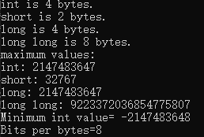

初始化将赋值与声明合在一起:

1. `int n_int=INT_MAX;`.
2. `int hamburgers={24};`
3. `int emus{7};`
4. `int rocs={};//set rocs to 0`

- 整型字面值

是显式地书写的常量.C++使用以三种不同的计数方式来书写整数. 基数为10, 基数为8, 基数为16.

- 字符

```c++
//morechar.cppp --the char type and int type contrasted
#include <iostream>
int main(){
	using namespace std;
	char ch='M';	//assign ASCII code for M to ch
	int i =ch;	//store same code in an int
	cout<<"This ASCII code for "<<ch<<" is "<<i<<endl;
	
	//using the cout.put() member function to display a char
	cout<<"Displaying char ch using cout.put(ch): ";
	cout.put(ch);
	
	//using cout.put() to display a char constant
	cout.put('!');
	
	return 0;
}
```

`cout.put()`显示一个字符.

如果将char用作数值类型, 则unsigned char和signed char之间差别很大. unsigned char类型的表示范围通常为0~255, signed char-128~127

- wcha_t

属于宽字符类型,可以表示扩展字符集, 是一种整数类型, 它有足够的空间, 可以表示系统使用的最大扩展字符集. 

可以通过加上前缀L来指示宽字符常量和宽字符串.

- const限定符

`const int months=12;	//months is symbolic constant for 12`

通用格式`const type name=value;`

- 数据类型转换

数据转化时, 值将被转换为接收变量的类型.

- 强制类型转换

通用格式

  `(typeName) value	//converts value to typeName type`

  `typeName (value)`

强制类型运算符

`static_cast<typeName> (value)	//convert value to typeName type`

```C++
int a =10;
int b=3;
double result=static_cast<double>(a)/static_cast<double>(b)
```

在本例中同样是将整型变量a转化为双精度浮点型. 

- 用法:
  - 用于类层次结构中基类和派生类之间指针或引用转换
    - 进行上行转化(把派生类的指针或引用转换成基类表示)时安全的.
    - 进行下行转换(把基类的指针或应用转化为派生类表示), 由于没有动态类型检查, 所以是不全的.
  - 由于基本类型之间的转换, 如将`int`转换成`char`.这种转换的安全要开发人员来保证
  - 把空指针转化成目标类型的空指针
  - 把任何类型的表达式转换为void类型.

- auto 声明


C++新增的一个工具, 让编译器能够根据初始值的类型推断变量的类型.

```C++
auto n =100;	//n is int
auto x	= 1.5;	//x is double
auto y = 1.3212L;	//y is long double
```

## 复合类型

### 数组

array是一种数据格式,能够存储多个同类型的值. 所有的数组都是由连续的内存位置组成.

要创建数组, 可使用声明语句. 数组声明应指出一下三点:

1. 存在在每个元素中的数组的类型
2. 数组名
3. 数组中的元素个数

`typeName arrayName[arraysize]`

- 下标

下标从0开始依次编号.

编译器不会检查使用的下标是否有效.

```C++
int cards[4] = {1,2,3,4,5}
float hotelTips={5.0,4.3}
```

另一种初始化方式(大括号进行初始化)

```
short things[]={1,2,3,54,9};
int num_elements = sizeof things / sizeof (short);
float balances[100] {};	//all elements set to 0

cout<<"things: "<<things;	//返回第一个元素所在的地址.
```

- 列表初始化禁止缩窄转换

```C++
long plifs[]={25,92,3.0};	//not allowed: 因为将浮点数转为整型时缩窄操作.
char slifs[4] {'y','i',1122011,'\0'};	//not allowed:因为1122011超出了char变量的取值范围
char tlifs[4]{'h','i',112,'\0'};	//allwed:因为虽然112是一个int值, 但它在char变量的取值范围内.
```

long用来表示一个整数, 叫做长整型.

#### 数组取地址

```c++
#include<iostream>
using namespace std;
int main(){
    int array[6] = { 1,2,3,4,5,'\0'};
    cout<<array<<endl;	//默认会输出数组array的首地址, 即第一个元素的地址.
    cout<<&array<<endl;	//&是指针标识符, 是取地址符, 这里取的也是第一个元素的地址.
    return 0;
}
```

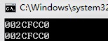

```c++
#include<iostream>
using namespace std;
int main(){
    int array[6] = { 1,2,3,4,5,'\0'};
    cout<<&array[1]<<endl;//取第2个元素的地址
    cout<<&array[0]+1<<endl;//取第0个元素的地址, 然后加int型的长度(加4字节)->第2个元素地址
    cout<<&array[0]<<endl;
    return 0;
}
```


#### 指向数组的指针

数组名是一个指向数组中第一个元素的常量指针:

```c++
double balance[50];	//balance是一个指向&balance[0]的指针, 即数组balance的第一个元素的地址
```

将p赋值为balance的第一个元素的地址

```c++
double *p;
double balance[10];
p=balance;
```

使用数组名作为常量指针是合法的, 反之亦然.  因此(balance+4)是一种访问balance[4]数组的方式. 一旦将第一个元素的地址存储在p中, 也就可以使用p, (p+1), (p+2)等访问数组元素.

```c++
#include <iostream>
using namespace std;

int main ()
{
   // 带有 5 个元素的双精度浮点型数组
   double balance[5] = {1000.0, 2.0, 3.4, 17.0, 50.0};
   double *p;

   p = balance;

   // 输出数组中每个元素的值
   cout << "使用指针的数组值 " << endl; 
   for ( int i = 0; i < 5; i++ )
   {
       cout << "*(p + " << i << ") : ";
       cout << *(p + i) << endl;
   }

   cout << "使用 balance 作为地址的数组值 " << endl;
   for ( int i = 0; i < 5; i++ )
   {
       cout << "*(balance + " << i << ") : ";
       cout << *(balance + i) << endl;
   }

   return 0;
}

```

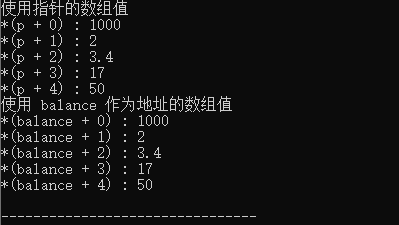

上实例中, p是一个指向double型的指针, 意味着可以存储一个double类型的变量. 一旦有了p中的地址, *p将给出存储在p中相应地址的值.

#### 从函数返回数组

C++不允许返回一个完整的数组作为函数的参数. 但可以通过指定不带索引的数组名来返回一个指向数组的指针.

若想要从函数返回一个一维数组, 就必须声明一个返回指针的函数

```c++
int * myFunction()
{
.
.
.
}
```

另外, C++不支持在函数外返回局部变量的地址, 除非定义局部变量为static变量. 所以, 想要返回一个数组指针, 这数组必须被设置为static变量

例: 生成10个随机数, 并使用数组来返回

```c++
//从函数返回数组
#include <iostream>
#include <ctime>
#include <cstdlib>
using namespace std;

int * getrandom()	//代表返回的是一个int型的指针
{
	static int r[10];//C++不支持在函数外返回局部变量的地址, 除非定义局部变量为static
	srand((unsigned)time(0));//time(0)这个内函数，则是返回了当前的时间值
	for (auto &i:r)//随机初始化r数组, 注意使用&; 遍历容器元素 
	{
		i=rand();
	}
	
	//print r数组
	cout<<"数组随机初始化为: ";
	for (auto i:r)
	{
		cout<<i<<" ";
	 } 
	cout <<endl;
	return r;//返回的是r的首地址. 
}

int main(){
	int *p;
	p=getrandom();
	//检测是否获得数组的首地址
	for (int i=0; i<10;i++)
	{
		cout << " *（p+" << i << ") " << *(p + i) << endl;
	 } 
	return 0;
} 
```

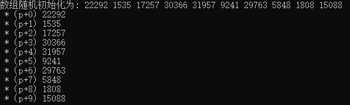

### 字符串

字符串是存储在内存的连续字节中的一系列字符

C-风格字符串具有一种特殊的性质: 以空字符(null character)结尾, 空字符被写作`\0`, 其ASCII码为0, 用来标记字符串的结尾. 

```c++
char dog[8]={'1','2','3','4','5',' ','6','7'};	//not a string!
char cat[8]={'1','2','3','4','5','6','7','\0'};	//a string!
```

常用字符串形式

```c++
char bird[5]='hello';	//the \0 is understood
char fish[]='world';	//let the compiler count
```

**字符串常量(使用"双引号")不能与字符常量(使用'单引号')互换.**

比如字符常量(如'S')是字符串编码的简写表示. `'s'`只是83的另一种写法..  而`"S"`步是字符常量, 它表示的是两个字符(字符`S`和`\0`)组成的字符串. 更深的理解:`"S"`实际上表示的是字符串所在的内存地址. 

```C++
char shirt_size = 'S';//this is fine
char shirt_size = "S";	//illegal type mismatch
```

字符串实际上是使用`null`字符终止的一维字符数组.

```c++
char greeting[]="Hello";
```

一下是c++中定义的字符串的内存表示

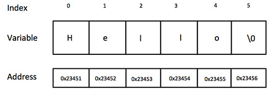

#### 在数组中使用字符串

```C++
//string.cpp ++ storing string in an array
#include <iostream>
#include <cstring> //for the strlen() function

int main(){
	using namespace std;
	const int Size = 15;
	char name1[Size];	//empty array
	char name2[Size]="C++owboy";	//initialized array
	
	cout<<"Howdy! I'm " <<name2;
	cout<<"! What's your name?\n";
	
	cin>>name1;
	
	cout<<"Well, "<<name1<<", your name has ";
	cout<<strlen(name1)<<" letters and is sotred\n";
	cout<<"in an array of "<<sizeof(name1)<<"bytes.\n";
	
	cout<<"Your initial is "<<name1[0]<<".\n";
	name2[3]='\0';	//set to null character
	cout<<"Here are the first 3 characters fo my name: ";
	cout<<name2<<endl;
	
	return 0; 
}
```

#### 利用`cin`进行字符串输入

```c++
//instr1.cpp --reading more than one string
#include <iostream>

int main(){
	using namespace std;
	const int ArSize = 20;
	char name[ArSize];
	char dessert[ArSize];
	
	cout<<"Enter your name:\n";
	cin >>name;
	cout<<"Enter your favorite dessert:\n";
	cin>>dessert;
	cout<<"I have some deliciou "<<dessert;
	cout<<" for you, "<<name<<".\n";
	
	return 0;
}
```

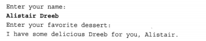

这个实例中, `cin`把Alistair 作为第一个字符串, 并将它放到`name`数组中. 这把Dreeb留在输入队列中. 当`cin`在输入队列中搜索用户喜欢的甜点时, 它发现`dreeb`, 因此`cin`读取Dreeb, 并将它放到`dessert`数组中.

#### 读取字符串输入

要将整条短语而不是一个单词作为字符串输入, 需要采用`getline()和get()`方式进行字符串读取.

`getline()`会丢弃换行符.

`get()`将换行符保留在输入序列中.(一般用两个get()来进行获取输入)

```c++
//instr.cpp		--reading more than one word with getline
#include <iostream>

#include <iostream>

int main(){
	using namespace std;
	const int ArSize = 20;
	char name[ArSize];
	char dessert[ArSize];
	
	cout<<"Enter your name:\n";
	//cin >>name;
	cin.getline(name,ArSize);	//reads through newline
	
	cout<<"Enter your favorite dessert:\n";
	//cin>>dessert;
	cin.getline(dessert,ArSize);
	
	cout<<"I have some deliciou "<<dessert;
	cout<<" for you, "<<name<<".\n";
	
	return 0;
}
```


1. 面向行的输入

`getline()`函数读取整行, 通过回车键输入的换行符来确定输入结尾.  要调用这种方法, 可使用`cin.getline()`. 该函数有两个参数.第一个参数用来存储输入行的数组的名称, 第二参数是要读取的字符数(如果这个参数为20, 则函数最多读取19哥字符,余下的空间用于存储自动在结尾处添加的空字符).  `getline()`成员函数在指定数目的字符或遇到换行符时停止读取.

```c++
cin.getline(name, 20);
```

2. get()

`get()`不会再读取并丢弃换行符, 而是将其留在输入队列中. 

```
cin.get(name, ArSize);	//read first line
cin.get();	//read newline
cin.get(dessert, ArSize);	//read second line
```

```c++
//instr.cpp		--reading more than one word with getline
#include <iostream>

#include <iostream>

int main(){
	using namespace std;
	const int ArSize = 20;
	char name[ArSize];//这是一个输入组, 若不适用cin.get()
	char dessert[ArSize];
	
	cout<<"Enter your name:\n";

	cin.get(name,ArSize).get();	//reads through newline
	
	cout<<"Enter your favorite dessert:\n";

	cin.gete(dessert,ArSize).get();
	
	cout<<"I have some deliciou "<<dessert;
	cout<<" for you, "<<name<<".\n";
	
	return 0;
}
```

综上: 首选get(). 查看下一个输入字符, 如果使换行符, 说明已读取了整行;否则, 说明该行中还有其他输入.

3. 空行或其他问题

当get()读取空行时, 读取空行后将设置失效为(faibit). 这意味着接下来的输入将被阻断, 但可以用`cin.clear();`命令回复输入.

若输入字符串比分配的空间长, 则`getline()`和`get()`将把余下的字符留在输入队列中, 而`getline()`还会设置失效位,并关闭后面的输入.

4. 混合输入字符串和数字

```c++
//following number input with line input
#include <iostream>

int main(){
	using namespace std;
	cout<<"what years was your house built?\n";
	int year;
	cin>>year;
	cout<<"what is its street address?\n";
	char address[80];
	cin.getline(address,80);
	cout<<"year built: "<<year<<endl;
	cout<<"address: "<<address<<endl;
	
	return 0;
}
```

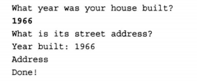

当`cin`读取年份, 将回车生成的换行符留在输入队列中. 后米面的`cin.getline()`看到换行符后, 将认为使一个空行, 并将一个空字符串赋给address数组. 

解决办法: 再读取地址之前读取并丢弃换行符.

```C++
cin >.year;
cin.get();	//or cin.get(ch);
```

C++程序尝试用指针(而不是数组)再处理字符串.

#### string

要使用`string`类, 必须再程序中包含头文件`string`

```C++
//using the C++ string class
#include<iostream>
#include<string>	//make string class available

int main(){
	using namespace std;
	char charr1[20];	//create an empty array
	char charr2[20]="jaguar";	//create an initialized array
	string str1;	//create an empty string object
	string str2="panther";	//create an initialized string
	
	cout<<"enter a kind of feline: ";
	cin>>charr1;
	cout<<"enter another kind of feline: ";
	cin>>str1;	//use cin for input
	cout<<"Here are some felines:\n";
	cout<<charr1<<" "<<charr2<<" "
		<<str1<<" "<<str2	//use cout for output
		<<endl;
	cout<<"the third letter in "<<charr2<<" is "
		<<charr2[2]<<endl;
	
	cout<<"the third leeter in "<< str2<<" is "
		<<str2[2]<<endl;	//use array notation
	
	return 0; 
}
```

`string`对象和字符数组之间的主要区别使, 可以将`string`对象声明位简单变量,而不是数组.程序能自动处理`string`的大小.

- 拼接字符串常量

C++允许拼接字符串字面值, 即将两个引号括起的字符串合并为一个.(任何两个有空白(空格,制表符, 换行符)分割的字符串常量都将自动拼接成一个.)

```C++
#include <cstring>

cout << "I'd give me my right arm to be " "a great violinist.\n";

cout << "I'd give my right arm to be a great violinist.\n";

cout<<"I'd give my right ar"
    "m to be great violinist.\n"
```

标准头文件`cstring`提供了`strlen()`来确定字符串的长度.

字符串相关操作函数

| 函数           | 作用                                                         |
| -------------- | ------------------------------------------------------------ |
| strcpy(s1,s2); | 复制字符串s2到字符串s1                                       |
| strcat(s1,s2); | 连接字符串s2到字符串s1的末尾                                 |
| strlen(s1);    | 返回字符串s1的长度                                           |
| strcmp(s1,s2); | 如果s1和s2是相同,则返回0; 若s1<s2则返回小于0;若s1>s2则返回大于0 |
| strchr(s1,ch); | 返回一个指针, 指向字符串s1中字符ch的第一次出现的位置         |
| strstr(s1,s2); | 返回一个指针, 指向字符串s1中字符串s2的第一个出现的位置.      |

- C++字符串初始化

```
char first_date[]={"Le CHapon Dodu"};
char second_date[] {"the Elegant Plate"};
string third_data ={"The bread bowl";
stirng fourth_data {"Hank's Fine Eats"};
```

- 赋值, 拼接和附加

使用`string`类时, 某些操作比使用数组时简单. 例如, 不能将一个数组赋值给另一个数组, 但可以将一个`string`对象赋给另一个`string`对象.

```c++
char charr1[20];	//create an empty array
char charr2[20]="jaguar";	//create an initialized array

string str1;	//create an empty string object
string str2="panther";	//create an initialized string

charr1=charr2;	//INVALID, no array assignment
str1=str2;	//VALID, object assignment ok
```

使用运算符`+`可将两个`stirng`对象合并起来, 还可以使用运算符`+=`将字符串附加到`string`对象的末尾.

```c++
string str3;
str3=str1+str2;	//assign str3 the joined strings
str1 +=str2; //add str2 to the end of str1
```

- string类的其他操作

使用函数`strcpy()`将字符串复制到**字符数组**中, 使用函数`strcat()`将字符串附加到字符数组末尾:

```c++
strcpy(charr1,charr2);	//copy charr2 to charr1
strcat(charr1, charr2);	//append contents of charr2 to char1
```

`string`和字符数组的区别

```c++
str3=str1+str2;
```

使用c-风格字符串时, 需要使用的函数如下:

```c++
strcpy(charr3,charr1);
strcat(charr3,charr2);
```

另外, 使用字符数组时,总是存在目标数组过小, 无法存储指定信息的危险.

```c++
char site[10]="house";
strcat(site, " of pancakes");	//memory problem
```

函数`strcat()`试图将全部12个字符复制到数组`site`中, 这将覆盖相邻的内存. 这可能导致程序终止, 或者程序继续运行, 但数据被损坏.

`string`类具有自动调整大小功能, 从而能够避免这种问题发生.

- string类I/O:

函数`strlen()`从数组的第一个元素开始计算字节数, 直到遇到空字符.

1. 将一行输入读取到数组中的代码

```c++
cin.getline(charr,20);
```

2. 将一行输入读取到string对象中的代码

```c++
getline(cin,str);
```

这里没有使用句点表示法, 这表明这个**getline()**步是类方法. 它将` cin`作为参数, 指出到哪里去查找输入. 也没有指出字符串长度的参数, 因为`string`对象将根据字符串的长度自动调整自己的大小.

- 其他形式的字符串字面值

C++11新增的另一种类型时原始(raw)字符串

原识字符串将"(和)"用作定界符, 并使用前缀R来表示原识字符串

```c++
cout<<R"(Jim "King" Tutt uses "\n" instead of endl.)"<<'\n';
```

如果要在原识字符串中包含`)"`, 此时使用`R"+*(`标识原识字符串的开头, 同时必须使用`)+*`标识原始字符串的结尾

```c++
cout<<R"+*("(who wouldn't?)", she whispered.)+*"<<endl;
```

### 结构简介

结构是一种比数组更灵活的数据格式, 其可以存储多种类型的数据.结构也是C++OOP堡垒(类)的基石.

结构是用户定义的类型, 而结构声明定义了这种类型的数据属性.

实例: 假设Bloataire公司要创建一种类型来描述其生成充气产品的成员. 这种类型应存储产品名称, 容量和售价.

```c++
struct inflatable	//structure declaraion
{
    char name[20];
    float volume;
    double price;
}

inflatable hat;	//hat is a structure variable of type inflatable
```

在C++中允许声明结构变量时省略关键字struct:

```c++
struct inflatable goose;	//keyword struct required in c
inflatable vincent;	//keyword struct not required in c++
```

由于`hat`的类型为inflatable`, 因此可以使用成员运算符`(.)`来访问各个成员(`hat.volume`)

```c++
//a simple structure
#include <iostream>

struct inflatable	//structure declaration
{
	char name[20];
	float volume;
	double price;
};

int main(){
	using namespace std;
	inflatable guest =
	{
		"Glorious Gloria",	//name value
		1.88,	//voluem
		29.99	//price
	};	//guest is a structure variable of type inflatable
	
	//it's initialized to the indicated values
	inflatable pal=
	{
		"Audacious arthur",
		3.12,
		32.99
	};	//pal is a second variable of type inflatable
	
	//note: some implementation require using
	//static inflatable gues
	
	cout<<"expand your guest list with "<<guest.name;
	cout<<" and "<<pal.name<<"!\n";
	
	cout<<"You can have both for $";
	cout<<guest.price+pal.price<<"!\n";
	return 0;
}
```

- C++结构初始化

与数组一样, c++11也支持将列表初始化用于结构, 且等号(=)是可选的:

```c++
inflatable duck {"Daphne",0.12,9.98};	//can omit the = in c++11
```

若大括号内未包含任何东西, 各个成员都将被设置位0.

- 将string类作为成员

```c++
#include <sting>
struct inflatable	//structure definition
{
    std:string name;
    float volume;
    double price;
}
```

一定要让结构定义能够访问名称空间std

- 其他结构属性

成员赋值

```c++
//assigniing structures
#include <iostream>
struct inflatable
{
	char name[20];
	float volume;
	double price;
};

int main(){
	using namespace std;
	inflatable bouquet{"sunflowers",0.2,12.49};
	inflatable choice;
	
	cout <<"bouquet: "<< bouquet.name<<" for $";
	cout <<bouquet.price<<endl;
	
	choice = bouquet;	//assign one structure to another
	cout<<"choice: "<<choice.name<<" for $";
	cout<<choice.price<<endl;
	return 0;	
}
```

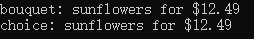

成员赋值是有效的,因为choice结构的成员值与bouquet结构中存储的值相同. 可以同时完成定义结构和创建结构变量的工作.

```c++
struct perks{
    int key_number;
    char car[12];
}mr_smith, ms_jones;	//two perks variables
```

- 结构数组

inflatable 结构包含一个数组. 如创建一个包含100个inflatable结构的数组

```c++
inflatable gifts[100];	//array of 100 inflatable structures

cin>>gifts[0].volume;	//use volume member of first struct
cout<< gifts[99].price<<endl;	//display price member of last struct
```

`gifts`本身是一个数组, 而不是结构, 因此向`gifts.price`这样的表述是无效的.

要初始化结构数组, 可以结合初始化数组的规则和初始化结构的规则.

```
inflatable guests[2]=	//initializing an array of structs
{
	{"Bambi",0.5,21.99},	//first sturcture in array
	{"Godzi",2000,565.99}	//next structure in array
};
```

- 结构中的位字段

C++允许指定占用特定位数的结构成员.

字段的类型应为整型或枚举, 接下来是冒号, 冒号后面是一个数字,它指定了使用的位数

```C++
struct torgle_register
{
    unsigned int SN:4;	//4 bits for SN value
    unsigned in:4;	//4 bits unused
    bool goodIn: 1;	//valid input (1 bit)
    bool googTorgle:1;	//successful torgling
}
```

- 共用体

共用体(union) 是一种数据格式, 它能够存储不同的数据类型, 但只能同时存储其中的一种类型.即结构可以同时存储int, long和double, 共用体职能存储int, long 或double>

```c++
union one4all
{
    int int_val;
    long long_val;
    double double_val;
};

one4all pail;
pail.int_val=15;	//store an int
cout <<pail.int_val;
pail.double_val=1.38;	//store a double, int value is lost
cout<<pail.double_val;
   
```

成员名称标识了变量的容量, 由于公用体每次只能存储一个值, 因此他必须有足够的空间来存储最大的成员.

```c++
struct widget
{
    char brand[20];
    int type;
    union id	//format depends on widget type
    {
        long id_num;	//type 1 widgets
        char id_char[20];	//other widgets
    } id_val;
};
...
widget prize;
...
if (prize.type==1)	//if-else statement 
    cin>>prize.id_val.id_num;	//use member name to indicate mode
else
    cin>>prize.id_val.id_char;
```

匿名共用体(anonymouse nuion)没有名称, 其成员将成为位于相同地址的变量.

```C++
struct widget
{
	char brand[20];
    int type;
    union 	//anonymous union
    {
        long id_num;	//type 1 widgets
        char id_char[20];	//other widgets
    };
};
...
widget prize;
...
if (prize.type==1)
    cin>>prize.id_num;
else
    cin>>prize.id_char;
```

由于共用体是匿名, 因此`id_num` 和`id_char`被视为prize的两个成员, 他们的地址相同, 所以不需要中间标识符id_val.

### 枚举

c++的enum工具提供了另一种创建符号常量的方式, 这种方式可以代替`const`

```c++
enum spectrum {red,orange,yellow,green, blue,violet,indigo,ultraviolet};
```

将red, orange,yellow等作为符号常量, 它们对应的整数值1~7. 这些常量叫做枚举量(enumerator)

在不进行强制类型转换的情况下, 只能将定义枚举时使用的**枚举量**赋给这种枚举的变量

```c++
band=blue;	//valid, blue is an enumerator
band=2000;	//invalid, 2000 not an enumerator
```

spectrum 变量受到限制, 只有8个可能的值. 

```c++
int color = blue;	//valid, spectrum type promoted to int
band = 3;	//invalid, int not converted to spectrum
color = 3+red;	//valid, red converted to int
```

- 设置枚举量的值

```c++
enum bits{one=1, two=2, four=4, eight=8};
```

指定的值必须时整数. 也可以显示地定义其中一些枚举量的值

```c++
enum bigstep{first, second=100, third}
```

这里, first默认为0, 后面没有被初始化的枚举量的值比其前面的枚举量大1.因此,third的值为101

可以创建多个值相同的枚举量:

```c++
enum {zero, null=0, one, numero_uno=1}
```

这里,zero和null都为0, one和umero_uno都为1

- 枚举的取值范围

C++通过强制类型转换, 增加了可赋给枚举变量的合法值. 每个枚举都有取值范围(range), 通过强制类型转换, 可以将取值范围中的任何整数值赋给枚举变量.

```c++
enum bits{one=1, two=2, four=4, eight=8};
bits myflag;

myflag = bits(6);	//valid, because 6 is in bit range(0~8)
```

### 指针和自由存储空间

计算机程序在存储数据时必须跟踪的3种基本属性

1. 信息存储在何处
2. 存储的值为多少
3. 存储的信息是什么类型

定义一个简单的变量, 声明语句指出了值的类型和符号名, 还让程序为值分配内存,并在内部跟踪该内存单元.

指针是一个变量, 其存储的值的地址, 而不是值本身.对与常规变量的地址, 对变量应用**地址运算符(&)**, 就可以获得它位置; 

```c++
//using the & operator to find adresses
#include <iostream>

int main(){
	using namespace std;
	int donuts =6;
	double cups=4.5;
	
	cout<<"donuts value = "<<donuts;
	cout<<" and donuts address = "<< &donuts <<endl;//获取变量的地址
	//note: you may need to use unsigned (&donuts) and unsigned (&cups)
	
	cout<<"cups value = "<<cups;
	cout<<" and cups address = "<<&cups<<endl;
	
	return 0;
	
} 
```

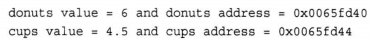

donuts的存储位置比cups要低. 两个地址的差为4. 因为donuts的类型为int, 而这种类型使用4个字节.

面向对象编程(OOP) 强调的是在运行阶段(而不是编译阶段)进行决策. 运行阶段指的是程序正在运行时. 编译阶段指的是编译器将程序组合起来. 运行阶段决策提供了灵活性, 可以根据当时的情况进行调整.

C++使用关键字`new`请求正确数量的内存以及使用指针来跟踪新分配的内存的位置.

但存储数据的新策略刚好相反, 将地址视为指定的量, 而将值视为派生量. 一种特殊类型的变量--指针用于存储值的地址. 因此, 指针名表示的是地址. *运算符被称为间接值(indirect value), 将其应用于指针, 可以得到该地址存储的值.

例如: **假设manly是一个指针, 则manly表示的是一个地址, 而*manly表示存储在该地址处的值.**

**非常重要的实例**

```c++
//our first pointer variable
#include <iostream>

int main(){
	using namespace std;
	int updates=6;	//declare a variable
	int * p_updates;	//declare pointer to an int
	p_updates = &updates;	//assign address of int to pointer
	
	//express value two ways
	cout<<"Values: updates = "<<updates;
	cout<<", *p_updates = "<<*p_updates<<endl;
	
	//express address two ways
	cout<<"Addresses: &updates = "<<&updates;
	cout<<", p_updates = "<<p_updates<<endl;
	
	//use pointer to change value
	*p_updates = *p_updates+1;
	cout<<"Now updates = "<<updates<<endl;
	
	return 0;
}
```

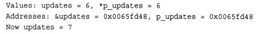

`int`变量`update`和指针变量`p_updates`只不过是同一枚硬币的两面. 变量`updates`表示值, 并使用`&`运算符来获得地址; 而变量`p_updates`表示地址, 并使用`*`运算符来获得值.

- 声明和初始化指针.

计算机需要跟踪指针指向的值的类型. 不同的类型所使用的字节数不同,他们存储值时, 使用的内部格式也不同. 因此, **指针声明必须指定指针指向的数据的类型.**

```c++
int * p_updates;
```

表明, * p_updates的类型为int. 由于*运算符被用于指针, 因此p_updates变量本身必须是指针.

```c++
int* p1, p2;
```

声明创建一个指针`p1`和一个int变量`p2`. 因为每个指针变量名, 都需要使用一个`*`. (`int*`是一种复合类型, 是指向`int`的指针.)

我们也可以在声明语句中初始化指针. 这种情况下, 被初始化的是指针, 而不是它的值. 也就是说, 下面的语句将`pt`(而不是`*pt`)的值设置为`&higgens`:(pt声明为指针).

```c++
int higgens = 5;
int * pt = &higgens;
```

```C++
// initialize a pointer
#include <iostream>

int main(){
	using namespace std;
	int higgens = 5;
	int * pt=&higgens;
	
	cout<<"Value of higgens = "<<higgens
		<<"; Address of higgens = "<<&higgens <<endl;
		
	cout<<"Value of *pt = "<<*pt
		<<"; Value of pt = "<<pt<<endl;
	
	return 0; 
} 
```

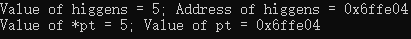

- 指针的危险

C++中创建指针时, 计算机将分配用来存储地址的内存, 但不会分配用来存储指针所指向的数据的内存.

```c++
long * fellow;	//create a pointer-to-long
*fellow = 223323;	//place a value in never-never land
```

上例`fllow`是一个指针, 但没有将地址赋给`fellow`. 由于`fellow`没有被初始化地址, 他可能是任何值, 不管值是什么, 程序都将它解释为存储223323的地址. 

注意: 一定要在对指针应用解除引用运算符(*)之前, 将指针初始化为一个确定的, 适当的地址. 

- 指针和数字

指针不是整型, 虽然计算机通常把地址当作整数来处理. 要将数字值作为地址来使用, 应通过强制类型转换将数字转换为适当的地址类型:

```
int * pt;
pt = (int *) 0XB8000000
```

- 使用new来分配内存

指针真正的用武之地在于, 在运行阶段分配未命名的内存以存储值. 

只需要告诉new, 需要为那种数据类型分配地址, new将找到一**个长度正确的内存块**, 并返回该内存的地址.

```c++
int * pn = new int;
```

`new int`告诉程序, 需要适合存储`int`的内存, `new`运算符根据类型来确定需要多少字节的内存, 然后, 找到这样的内存, 并返回其地址.

这里`pn`指向一个数据对象, 这里的`对象`比`变量`更通用, 它指的是为数据项分配的内存块. 

为一个数据对象(可以是结构, 也可以是基本类型)获得并指定分配内存的通用格式如下:

`typeName * pointer_name=new typeName;`

需要在两个地方指定数据类型: 用来指定需要什么样的内存和用来声明合适的指针.

```c++
//using the new operator
#include <iostream>

int main(){
	using namespace std;
	int nights = 1001;
	int * pt=new int;	//allocate space for an int
	*pt = 1001;		//store a value there
	
	cout <<"nights value = ";
	cout <<nights<<": location "<<&nights<<endl;
	cout<<"int value = "<<*pt<<": location "<<pt<<endl;//*pt代表指针所表示的值
	double * pd = new double; 	//allocate space fo a double
	*pd = 1000001.0; 	//store a double there
	
	cout <<"double";
	cout <<" value="<<*pd<<": location "<<pd<<endl;
	cout<<"loacation of pointer pd: "<<&pd<<endl;
	
	cout<<"size of pt = "<<sizeof(pt);
	cout<<":size of *pt="<<sizeof(*pt)<<endl;
	
	cout<<"size of pd = "<<sizeof pd;
	cout<<":size of *pd = "<<sizeof(*pd)<<endl;
	
	return 0;
}
```


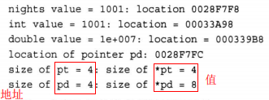

该程序指出了必须声明指针所指向的类型. 地址本身只指出了对象存储地址的开始, 而没有指出其类型(使用的字节数). 从这两个值的地址可以知道, 他们都只是数字, 并没有提供类型或长度信息.

对于指针, 需要指出的另一点是,` new`分配的内存块通常与常规变量声明分配的内存块不同.变量nights和pd的值都存在被称为栈(stack)的内存区域中, 而new从被称为堆(heap)或自由存储区域(free store)的内存区域分配内存.

- 使用delete释放内存

delete运算符, 它使得在使用完内存后, 能够将其归还给内存池. 

```c++
int * ps = new int; 	//allocate memory with new
...
delete ps; 	//free memory with delete when done
```

这将释放ps指向的内存, 但不会删除指针ps本身. 例如, 可以将ps重新指向另一个新分配的内存块. 一定要配对地使用`new`和`delete`; 否则将发生内存泄漏(memory leak), 也就是说, 被分配的内存再也无法使用. 如果内存泄漏严重, 则程序将由于不断寻找更多内存而终止.

- 使用new来创建动态数组

如果通过声明来创建数组, 则程序被编译时将为它分配内存空间. 不管程序最终是否使用数组,数组都在那里, 它占用了内存.在编译时给数组分配内存被称为静态联编(static binding), 意味着数组是在编译时加入到程序中. 但使用new时, 如果在运行阶段需要数组, 则创建它, 还可以在程序运行时选择数组的长度, 这种数组叫做动态数组(dynamic array)

1. 使用new创建动态数组

   只要将数组的原始类型和元素数目告诉new

   ```c++
   int * psome = new int [10];	//get a block of 10 array
   ```

   new 运算符返回第一个元素的地址. 这个例子中, 该地址被赋给指针psome

   当程序使用完new分配的内存块时,应使用delete释放他们. 然而, 对于使用new创建的数组, 应使用另一种格式的delete来释放

   ```c++
   delete [] posome;	//free a dynamic array
   ```

   方括号告诉程序, 应释放整个数组, 而不仅仅是指针指向的元素.

   使用new和delete时, 应遵守以下规则

   >不要使用delete来释放不是new分配的内存
   >
   >不要使用delete释放同一个内存块2次
   >
   >如果使用new [], 为数组分配内存, 则应使用delete [] 来释放
   >
   >如果使用new [] 为一个实体分配内存, 则应使用delete(没有方括号)来释放
   >
   >对空指针使用delete是安全的.

   为数组分配内存的通用格式:

   `type_name * pointer_name = new type_name [num_elements];`

   使用new运算符可以确保内存块足以存储`num_elements`个类型为`type_name`的元素, 而`pinter_name`将指向第1个元素.

2. 使用动态数组

   ```c++
   int　* psome = new int [10];	//get a block of 10 ints
   ```

   **只要把指针当作数组名使用, 就可以访问指针中的任意元素**. 如对于第一个元素, 可以使用psome[0], 而不是*psome; 对于第二个元素,可以使用psome[1]
   
   ```c++
   //using the new operator for arrays
   #include <iostream>
   
   int main(){
   	using namespace std;
   	double * p3 = new double [3];	//space for 3 doubles
   	p3[0]=0.2;
   	p3[1]=0.5;
   	p3[2]=0.8;
   	cout<<"p3[1] is "<<p3[1]<<".\n";
   	p3=p3+1;	//increment the pointer
   	cout << "Now p3[0] is "<<p3[0]<<" and ";
   	cout << "p3[1] is "<<p3[1]<<".\n";
   	p3=p3-1;	//point back to beginning
   	delete [] p3;	//free the memory
   	return 0; 
   }
   ```
   
   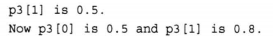

指针与数组名之间的根本差别

```c++
p3=p3+1;	//okay for pointers, wrong for array names
```

区别2: 数组是固定大小的, 数组一经定义, 那么数组名就是一个指向数组首元素类型的常量指针. 也就是说数组名是不允许更改的, 而指针可以更改.

数组名是常量指针, 指针是变量指针.

### 指针,数组和指针算术

指针和数组基本等价的原因在于指针算术和C++内部处理数组的方式.

在多数情况下, C++将数组名解释为数组第一个元素的地址.

`wages = &wages[0]=address of first  element of array`

指针变量加1后, 其增加的值等于指向的类型占用的字节数.

对于数组表达式stacks[1]. C++编译器将该表达式看作是*(stacks+1), 意味着先计算数组第2个元素的地址, 然后找到存储在那里的值. 最后的结果便是stacks[1](运算符优先级要求使用括号, 如果不适用括号, 将给\*stcks加1, 而不是给stacks加1.

通常, 使用数组表示法时, C++都执行下面的转换

```c++
arrayname[i] becomes *(arrayname+i)
```

如果使用的是指针, 而不是数组名, 则C++也将执行同样的转换

```c++
pointername[i] = becomes *(pointername + i)
```

在多数情况下, 可以相同的方式使用指针名和数组名. 对于他们, 可以使用数组方括号表示, 也可使用解除引用运算符(*). 在多数表达式中, 他们都表示地址, 区别之一是, 可以修改指针的值, 而数组名是常量.

- 给指针赋值

  ```c++
  double * pn;	//pn can point to double value
  double * pa;	//so can pa
  char * pc;	//pc can point to a char value
  double bubble = 3.2;
  pn = & bubble;	//assign address of bubble to pn
  pc = new char;	//assign address of newly allocated char memory to pc
  pa = new double[30];	//assign address of last element of array of 30 double to pa
  ```

  

- 对指针解除引用

  对指针解除应用意味着获得指针的值. 对指针引用或间接运算符(*)来解除引用. 上述实例中, pn是指向bubble的指针, 则\*pn是指向的值.

  另一种解除应用的方法是使用数组表示法, 例如, pn[0] 与*pn是一样的. 决不要对未被初始化为适当地址的指针解除应用.

- 数组的动态联编和静态联编

  使用数组声明来创建数组时, 将采用静态联编, 即数组的长度在编译时设置:

  ```c++
  int tacos[10];	//static binding, size fixed at compile time
  ```

  使用new[] 运算符创建数组时, 将采用动态联编(动态数组), 即将在运行时为数组分配空间, 其长度也将在运行时设置. 使用完这种数组后, 应使用delete[]释放其占用的内存.

  ```c++
  int size;
  cin >> size;
  int *pz = new int [size];	//dynamic binding, size set at run time
  ...;
  delete [] pz;	//free memory when finished
  ```

- 指针的字符串

  数组和指针的特殊关系可以扩展到C-风格字符串.

  ```c++
  char flower[10]="rose";
  cout << flower << "s are read\n";
  ```

  数组名是第一个元素的地址, 因此cout 语句中的flower是包含字符 r 的char元素的地址. cout 对象认为 char 的地址是字符串的地址, 因此它打印该地址处的字符, 然后继续打印后面的字符, 直到遇到空字符 (\0) 为止. 总之, 如果给 cout 提供一个字符的地址, 则它将从该字符开始打印, 直到遇到空字符为止.

  一般来说, 如果给cout提供一个指针, 它将打印地址. 如果指针的类型为char* , 则cout 将显示指向的字符串. 如果要显示的是字符串的地址, 则必须将这种指针强制转化为另一种指针类型, 如 (int *) pointname; 因此, ps显示字符串"fox", 而(int *) ps显示该字符串的地址.

#### 数组的地址

数组名被解释为其第一个元素的地址, 而对数组名应用地址运算时, 得到的是整个数组的地址:

```c++
short tell[10];	//tell an array of bytes
cout << tell <<endl;	//displays &tell[0]
cout << &tell <<endl;	//displays address of whole array
```

从数字上说, 这两个地址相同; 但从概念上说, &tell[0] (即tell) 是一个2字节内存块的地址, 而 &tell 是一个20字节内存块的地址. 因此, 表达式 tell+1 将地址值加2, 而表达式 &tell+1 将地址加20.  换句话说, tell是一个short 指针 (* short), 而&tell 是一个这样的指针, 即包含20个元素的short 数组 (short(*)[20]).

```c++
//数组指针初始化
short (*pas)[20] = &tell;	//pas points to array of 20 shorts
```

#### 指针数组

(指针的数组, 首先这个变量是一个数组, 其次, "指针"修饰这个数组, 意思是这个数组的所有的原始都是指针类型, 在32位系统中,指针占4个字节)

> `int * p[10];` *p未括起来,说明[]的优先级高, p先和[]结合成数组, 在被前面的\* 定义为一个指针类型的数组

```c++
int * p[10]={1};	//这样为其初始化会报错, 因为数组里面的元素全是指针类型, 不用用整型为其初始化赋值.
int * p[10]={NULL};	//这样不会报错
```

 不能为其随便赋值, 因为指不定哪个指针指向哪, 不能够随便往指针原来的内存块里写东西.

```c++
int * p[10]={NULL};
*p[10]=1;//报错
```

#### 数组指针

就是数组的一个指针, 先定义数组, 再让一个指针指向它. 意思是: 这个指针存放着一个数组的首地址.

> `int (*p)[n];` n是一行里有几个元素, 也就是列数. ()优先级更高, 说明p首先是一个指针, 指向一个整型的一维数组, 这个一维数组的长度是n, 也可以说是p的步长. 也就是说执行p+1时, p要跨过n行的长度.

```c++
//如要将二维数组赋给一指针
int a[3][4] = { {1,2,3,4},{5,6,7,8},{9,10,11,12} };
int (*p)[4]; //该语句是定义一个数组指针
 p=a;//将该二维数组的首地址赋给p，也就是a[0]或&a[0][0].
 p++;//该语句执行过后，也就是p=p+1;p跨过行a[0][]指向了行a[1][]
```


整数变量加1后, 其值将增加1; 但将指针变量加1后, 增加的量等于它指向的类型的字节数., 将指向double的指针加1后, 如果系统对double使用8个字节存储, 则数值将增加8;

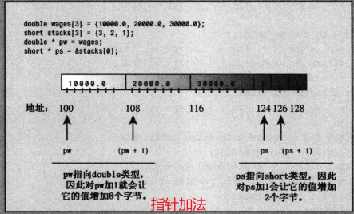

c++编译器将表达式看作*(stacks+1), 这意味着先计算数组第2个元素的地址, 然后再找到存储再那里的值. 

`arrayname[i] becomes *(arrayname + i)`

对数组应用`sizeof`运算符得到的是数组的长度, 而对指针应用`sizeof`得到的是指针的长度, 即使指针指向的是一个数组.

- 指针和字符串

  cout提供一个字符的地址,则它将从该字符开始打印,直到遇到空字符为止.

  再cout和多数C++表达式中, char数组名, char指针以及用引号括起的字符串常量都被解释为字符串第一个字符的地址.

```c++
//using pointers to strings
#include <iostream>
#include <cstring>	//declare strlen(), strcpy()

int main(){
	using namespace std;
	char animal[20]="bear";	//animal holds bear
	const char * bird = "wren";	//bird holds address of string
	char * ps;	//uninitialized
	
	cout <<animal<< " and ";	//display bear
	cout <<bird <<"\n";	//display wren
	
	//cout <<ps<<endl;	//	may display garbage, may cause a crash
	
	cout<<"enter a kind of animal: ";
	cin >>animal;	//ok if input <20 chars
	//cin >> ps; Too horrible a blunder to try;
	
	ps = animal;	//set ps to point to string
	cout<<ps<<"!\n";	//ok, same as using animal
	cout<<"Before using strcpy(): \n";
	cout <<animal<<" at "<<(int *) animal<<endl;
	cout<<ps<<" at "<<(int *)ps <<endl;
	
	ps = new char[strlen(animal)+1];	//get new storage
	strcpy(ps, animal);	//copy string to new storage
	cout<<"After using strcpy(): \n";
	cout<<animal<<" at "<<(int*)animal <<endl;
	cout<<ps<<" at "<<(int *) ps<<endl;
	
	delete [] ps;
	return 0;
} 
```

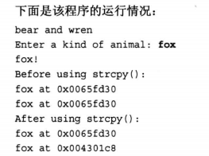

```c++
const char * bird = "wren"; //bird holds address of string-->bird="wren"
```

`"wren"`实际表示的是字符串的地址, 因此这条语句将`"wren"`的地址赋给bird指针.(一般, 编译器在内存留出一些空间, 以存储程序源代码中所有用引号括起来的字符串, 并将每个被存储的字符与其地址关联起来). 这意味着可以像使用字符串"wren"那样使用指针bird.

```c++
ps=animal;	//set ps to point to string
...
cout<<animal<<" at "<< (int *) animal<<endl;
cout<<ps<<" at "<<(int *) ps<<endl;
```

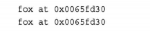

如果给cout提供一个指针, 它将打印地址. 但如果指针的类型为char *, 则cout将显示指向的字符串. 如果要显示的是字符串的地址, 则必须将这种指针强制转为另一种指针类型, 如`int *`. 因此, ps显示为字符串'fox', 而`(int *) ps`显示为该字符串的地址.

另外, 将`animal`赋给`ps`并不会复制字符串, 而只是复制地址.这样, 这两个指针将指向相同的内存单元和字符串.

- 获得字符串的副本(能够根据字符串的长度来指定所需的空间)

  ```c++
  ps = new char[strlen(animal)+1];	//get new storage
  ```

  字符串'fox'不能填满整个animal数组, 因此这样做浪费了空间. 上述代码使用strlen()来确定字符串的长度.

- 将animal数组中的字符复制到新分配的空间中

  ```c++
  strcpy(ps, animal);	//copy string to new storage
  ```

  `strcpy()`函数接受2个参数. 第一个是目标地址,第二个是要复制的字符串的地址.

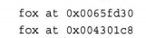

- 使用new创建动态结构

  运行创建数组优于在编译时创建数组, 对于结构也是如此. 需要在程序运行时为结构分配所需的空间, 这也可使用`new`运算符来完成.

  将new用于结构2步组成: 创建结构+访问其成员. 要创建结构, 需要同时使用结构类型和new.

  ```c++
  inflatable * ps = new inflatable;	//创建一个未命名的inflatable类型, 并将其地址赋给指针.
  ```

  这将把足以存储inflatable结构的一块可用内存的地址赋给ps.

  **创建的动态结构, 不能将成员运算符句点用于结构名, 因为这种结构没有名称, 只是知道它的地址. 因此, 引入箭头成员运算符`(->)`.** 

  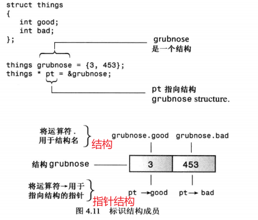

  另一种范文结构成员的方法是, 如果ps是指向结构的指针, 则*ps就是被指向的值, 因此(\*ps).price是该结构的price成员.

  实例: 两种访问结构成员的指针表示法

   ```c++
   //using new with a structure
   #include <iostream>
   
   struct inflatable	//structure definition
   {
   	char name[20];
   	float volume;
   	double price;
   } ;
   
   int main(){
   	using namespace std;
   	inflatable *ps=new inflatable;	//allot memory for structure
   	cout <<"enter name of inflatable item: ";
   	cin.get(ps->name,20);	//method 1 for member access
   	cout <<"enter volume in cubic feet: ";
   	cin>>(*ps).volume;	//method 2 for member access
   	cout<<"enter price: $";
   	cin>>ps->price;
   	cout<<"Name: "<<(*ps).name<<endl;	//method 2
   	cout <<"Volume: "<<ps->volume<<" cubic feed \n";	//method 1
   	cout <<"Price: $"<<ps->price<<endl;	//method 1
   	delete ps;
   	return 0;
   }
   ```

  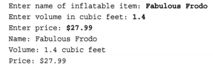

  - 使用new和delete的实例

    new根据需要的指针数量来分配空间, 根据每个字符串的需要分配相应数量的内存.

    ```c++
    //using the delete operator
    #include <iostream>
    #include <cstring>
    
    using namespace std;
    char * getname(void);	//function prototype
    int main(){
    	char * name;	//create pointer but no storage
    	
    	name = getname();	//assign address of string to name
    	cout<<name<<" at "<<(int *) name<<"\n";
    	delete [] name;	//memory freed
    	
    	name = getname();	//reuse freed memory
    	cout<<name<<" at "<<(int *) name<<"\n";
    	delete [] name;	//memory freed again
    	return 0;
    }
    
    char * getname()	//return pointer to new string
    {
    	char temp[80];	//tenporary storage
    	cout<<"Enter last name: ";
    	cin>>temp;
    	char * pn=new char[strlen(temp)+1]; //数组字符串
    	strcpy(pn,temp);	//copy string into smaller space
    	
    	return pn;	//temp lost when function ends
    }
    ```

    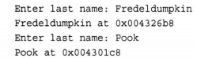

    程序说明:

    函数getname(), 通过`strlen(temp)+1`个字符来存储字符串, 因此将这个值提供给new. 获得空间后, `getname()`使用标准库函数`strcpy()`将temp中的字符串复制到新的内存块中, 该函数并不检查内存块是否能够容纳字符串, 但`getname()` 通过new请求合适的字节数来完成了这样的工作, 最后, 函数返回`pn`, 这是字符串副本的地址.

- 自动存储, 静态存储和动态存储

  - 自动存储

    在函数内部定义的常规变量使用自动存储空间, 在所属的函数被调用是自动参数, 在该函数结束时消亡.例如上个实例中, temp数组仅当getname()函数活动时存在. 当程序控制权回到mian()时, temp使用的内存将自动被释放. 

  - 静态存储

    静态存储是整个程序执行期间都存在的存储方式. 1:在函数外面定义它. 2: 在声明变量时是使用关键字`static`.

  - 动态存储

    `new`和`delete`运算符提供了一种比自动变量和静态变量更灵活的方法. 他们管理了一个内存池, 这在c++中被称为自由存储空间(free store)或堆(heap). 该内存池同用于静态变量和自动变量的内存时分开的.new和delete让你能够在一个函数中分配内存, **而在另一个函数中释放它, 因此, 数据的周期不完全受程序或函数的生存时间控制.** 

    在栈中, 自动添加和删除机制使得占用的内存总是连续的, 但new和delete的相互影响可能导致占用的自由存储区不连续.

  - 栈, 堆和内存泄漏

    如果使用`new`运算符在自由存储空间(或堆)上创建变量后, 没有调用delete的后果.
  
    则即使包含指针的内存由于作用域规则和对象生命周期的原因而被释放, 在自由存储空间上动态分配的变量或结构也将继续存在. 实际上, 将会无法访问自由存储空间中的结构, 因为指向这些内存的指针无效. 这将导致内存泄漏. 被泄漏的内存将在程序的整个生命周期内都不可使用. 这些内存被分配出去, 但无法收回.

### 类型组合

通过各种方式组合数组, 结构和指针.

- 结构组合

  ```c++
  struct antarctical_years_en
  {
      int year;	//some really interesting data, etc.
  };
  ```

  可以创建这种类型的变量

  ```c++
  antarctical_years_end s01, s02, s03;	//s01, s02,s03 are structures
  ```

  然后使用成员运损算符访问其成员

  ```c++
  s01.year=1998
  ```

  可创建指向这种结构的指针:

  ```c++
  antarctical_years_end * pa = &s02;
  ```

  将该指针设置为有效地址后, 就可以使用间接成员运算符来访问成员

  ```c++
  pa->year =1999;
  ```

  可创建结构数组:

  ```c++
  antarctica_years_end trio[3];	//array of 3 structures
  ```

  然后, 可以使用成员运算符访问元素的成员

  ```c++
  trio[0].year=2003;	//same as trio[0] is a structure
  ```

  其中`trio`是一个数组, `trio[0]`是一个结构, 而`trio[0].year`是该结构的一个成员.由于数组名是一个指针, 因此可以使用简介成员运算符:

  ```c++
  (trio+1)->year =2004; 	//same as trio[1].year =2004
  ```

  可创建指针数组:

  ```c++
  const antarctica_years_end * arp[3]={&s01,&s02,&s03};
  ```

  因为`arp`是一个指针数组, `arp[1]`就是一个指针, 可将间接成员运算符应用于它, 以访问成员:

  ```c++
  std::cout<<arp[1]->year<<std::endl;
  ```

  可创建指向上述数组的指针

  ```c++\
  const antarctica_years_end ** ppa =arp;
  ```

  其中arp是一个数组的名称, 因此它是第一个元素的地址. 但其第一个元素为指针, 因此`ppa`是一个指针, 指向一个指向`const antarctica_years_end`的指针.

  `auto`能够正确推断出变量的类型

  ```c++
  auto ppb=arp;	//c++ automatic type deduction
  ```

  由于ppa是一个指向结构指针的指针, 因此`*ppa`是一个结构指针, 可将间接成员运算符

  ```c++
  std::cout<<(*ppa)->year<<std::endl;
  std::cout<<(*(ppa+1))->year<<std::endl;
  ```

  ```c++
  //some type combinations
  #include <iostream>
  
  struct antarctica_years_end
  {
  	int year;
  } ;
  
  int main(){
  	antarctica_years_end s01,s02,s03;
  	
  	s01.year=1998;
  	antarctica_years_end * pa = &s02;
  	pa->year=1999;
  	
  	antarctica_years_end trio[3];	//array of structures
  	trio[0].year =2003;
  	std::cout<<trio->year<<std::endl;
  	
  	const antarctica_years_end *arp[3]={&s01,&s02,&s03};
  	std::cout<<arp[1]->year<<std::endl;
  	
  	const antarctica_years_end ** ppa = arp;
  	auto ppb=arp;	//c++ automatic type deduction
  	
  	std::cout<<(*ppa)->year <<std::endl;
  	std::cout<<(*(ppa+1))->year<<std::endl;
  	
  	return 0; 
  }
  ```

  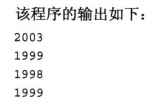
  
  
  
  
  
#### 数组的替代品

  模板类vector和array是数组的替代品.

- 模板类vector

  模板类vector类似于string 类, 也是一种动态数组. 可以在运行阶段设置vector对象的长度, 可在末尾附加新数据, 也可在中间插入新数据. 

  首先, 使用vector对象, 必须包含头文件vector. 其次, vector包含在名称空间std中, 因此, 需要使用using声明或std::vector. 第三, 模板使用不同的语法来指出它存储的数据类型. 第四, vector类使用不同的语法来指定元素数.

  ```c++
  #include <vector>
  ...;
  using namespace std;
  vector <int> vi;	//create a zero-size array of int
  int n;
  cin >> n;
  vector<double> vd(n);	//create an array of n double
  ```

  一般而言, 下面的声明创建一个名为vt的vector对象, 它可存储n_elem个类型为typeName的元素:

  ```c++
  vector<typeName> vt(n_elem);
  ```

- 模板类array(C++)

  vector 类功能比数组强大, 但付出的代价是效率稍低. 

  C++11 新增了模板类array, 它位于名称空间std中. 与数组一样, array对象的长度也是固定的, 也是用栈(静态内存分配), 而不是自由存储区, 因此其效率与数组相同. 创建array对象, 需包含头文件array. 

  ```c++
  #include <array>
  ...;
  using namespace std;
  array<int, 5> ai;	//create array object of 5 ints
  array<double, 4> ad = {1.2,2.1, 3.43, 4.3};
  ```

- 数组中at的使用

  ```c++
  double a1[4]{1.2,2.1, 3.43, 4.3};
  a1[-2]=20.2;	//在a1[3]处存储
  *(a1-2) = 20.2;	//找打a1指向的地方,向前移两个double元素, 并将20.2存储到目的地.
  ```

  c++不会检查这种超界错误. 可以选择使用成员函数at(). 就像使用cin对像的成员函数getline()一样, 也可以使用vector和array对象的成员函数at():

  ```c++
  a1.at(1) = 2.3;	//assing 2.3 to a1[1]
  ```

  中括号表示法和成员函数at()的差别在于, 使用at()时, 将在运行期间捕获非法索引, 而程序默认将终端.


## 循环和关系表达式

### for循环

```c++
//introducting the for loop
#include <iostream>

int main(){
	using namespace std;
	int i;	//create a counter
	//initialize; test; update
	for (i=1;i<5;i=i+by)	//by:步长
		cout<<"C++ konws loops.\n";
	cout<<"C++ knows when to stop.\n";
	
	return 0;
}
```

#### for循环的组成

> 1. 设置初值
> 2. 执行测试, 看看循环是否继续进行
> 3. 执行循环操作
> 4. 更新用于测试的值

```
for (initialization; test-expression; update-expression)
{
	body;
}
```

for 循环时入口条件(entry-condition)循环, 意味着在每轮循环之前, 都将计算测试表达式的值, 当测试表达式为false时, 将不会执行循环体.

update-expression(更新表达式)在每轮循环结束时执行, 此时循环体已经执行完成.

cout在现实bool值之前, 通常将其转为int, 但`cout.setf(ios::boolapha)`函数调用设置了一个标记, 该标记命令cout显示ture和false.

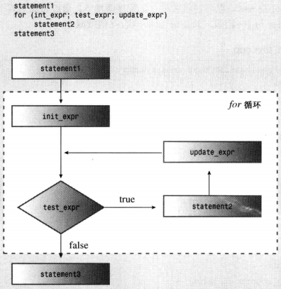


- 修改规则

  `for (int i=0; i<5; i++)`

  允许for循环的初始部分中申明变量. 

- ++,--

  ```c++
  int x=5;
  int y=++x;	//change x, then assign to y;-->y is 6, x is 6
  
  int z=5;
  int y=z++;	//assign to y, then change z;-->y is 5, z is 6
  ```

如果在一个语句块中声明一个变量, 而外部语句块中也有一个这种名称的变量的情况

在声明为位置到内部语句块结束的范围内, 旧新变量将隐藏旧变量, 然后旧变量再次可见

```c++
//forloop2
#include <iostream>

int main(){
	using namespace std;
	int x=20;
	{
		int y=100;
		cout<<x<<endl;
		cout<<y<<endl;
	}
	cout <<x<<endl;	//ok
	//cout<<y<<endl;	//invalid, won't compile
	
	return 0;
}
```

- 递增/递减运算符和指针

  前缀递增/递减和解除引用运算符的优先级相同, 以从右到左的方式进行结合. 后缀递增和后缀递减的优先级相同, 但比前缀运算符的优先级高, 这两个运算符从左到右的方式进行结合. 

  前缀运算符的从右到左结合规则意味着`*++pt`: 先将++应用与pt, 然后将*应用于被递增后的pt.
  
  ```c++
  double x = *++pt;	//increment pointer, take the value; i.e. arr[2]
  ```

  ++*pt 意味着先取得pt指向的值, 然后将这个值加1
  
  ```c++
  ++*pt; //increment the pointed to value; i.e. change 23.4 to 24.4
  ```
  
  上述这种情况, pt仍然指向arr[2]
  
  ```c++
  x = *pt++;	//dereference original location, then increment pointer
  ```
  
  因为**后缀运算符++的优先级更高**, 意味着将运算符用于pt, 而不是\*pt, 因此对指针递增. 然后运算符意味着对原来的地址(&arr[2])而不是递增后的新地址解除应用. 因此\*pt++的值为arr[2], 即25.4
  
- 逗号运算符

  在for循环控制部分,同时更新两个变量

  ```c++
  ++j, --i	//two expressions count as one for syntax purposes
  ```

  声明中的逗号将变量列表中相邻的名称分开

  ```c++
  int i,j;	//comma is a separator here, not an operator
  ```

  ```c++
  //reversing an array
  #include <iostream>
  #include <string>
  
  int main(){
  	using namespace std;
  	cout<<"Enter a word: ";
  	string word;
  	cin>>word;
  	
  	//physically modify string object
  	char temp;
  	int i,j;
  	
  	for (j=0,i=word.size()-1;j<i;--i,++j)
  	{
  		temp=word[i];
  		word[i]=word[j];
  		word[j]=temp;
  	}	//end block
  	
  	cout<<word<<"\n Done \n";
  	return 0;
  } 
  ```

  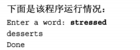


```c++
//遍历数组元
#include <iostream>
#include <vector>

using namespace std;
//将 counts 容器中的每一个元素从前往后枚举出来，并用 count 来表示
int main(){
	int a[]={1,2,3,5,2,0};
	vector<int>counts(a,a+6);
	for (auto count:counts)
		cout<<count<<" ";
	cout<<endl;
	return 0;
} 
```

## While循环

while 循环时没有初始化和更新部分的for循环, 它只有测试条件和循环条件.

```c++
while (test-condition)
{
    body;
}
```

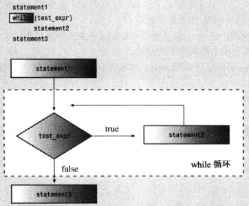

- 等待一段时间: 编写延时循环

  ```c++
  //using clock() in a time-delay loop
  #include <iostream>
  #include <ctime>	//describes clock() function, clock_t type
  
  int main(){
  	using namespace std;
  	cout <<"Enter the delay time, in secodes: ";
  	float secs;
  	cin >> secs;
  	clock_t delay = secs*CLOCKS_PER_SEC;	//convert to clock ticks
  	cout << "starting \a\n";
  	clock_t start = clock();
  	while (clock()-start<delay)	//wait until time elapses
  		;	//wait until time elapses
  	cout<<"done \a\n";
  	return 0;
  } 
  ```

### 类型别名

C++为类型建立别名的方式有两种. 

一种是使用预处理器:

```c++
#define BYTE char	//preprocessor replaces BYTE with char
```

这样, 预处理器将再编译程序时用char替换所有的BYTE, 从而使BYTE称为char的别名.

第二种方法使使用C++的关键字typedef来创建别名. 列入, 要将byte作为char的别名, 

```c++
typedef typeName aliasName;
```

### do while 循环

do while使出口条件(exit condition)循环. 这种循环将首先执行循环体, 然后再判定测试表达式, 决定是否应继续执行循环. 如果条件为false, 则循环终止: 否则, 进入新一轮的执行和测试. 这样的循环通常至少执行一次, 因为其程序流必须经过循环体后才能达测试条件

```c++
do 
    body
while (test-expression);
```

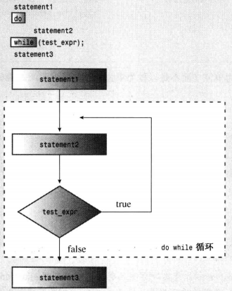

实例

```c++
//exit-condition loop
#include <iostream>

int main(){
	using namespace std;
	int n;
	
	cout << "enter numbers in the range 1-10 to find";
	cout << "my favorite number\n";
	do
	{
		cin >>n;	//execute body
	}while (n !=7);	//then test
		cout << "yes, 7 is my favorite.\n";
	return 0;
}
```

### 基于范围的for循环

对数组(或容器类)的每个元素执行相同的操作.

```c++
double prices[5] = {4.99, 10.99, 6.87, 7.99, 8.49};
for (double x :prices)
	cout <<x << std::endl;
```

其中, x最初表示数组prices的第一个元素. 显示第一个元素后, 不断执行循环, 而x依次表示数组的其他元素. 因此, 上述代码显示全部5个元素.

要修改数组的元素, 需要使用不同的循环变量语法:

```c++
for (double &x: prices)
    x = x*0.8;	//20% off sale
```

符号&表明x是一个引用变量. 

### 循环和文本输入

逐字符地读取来自文件或键盘的文本.

```c++
//reading chars with a while loop
#include <iostream>

int main(){
	using namespace std;
	char ch;
	int count = 0;	//use basic input
	cout << "Enter characters; enter to quit:\n";
	cin >> ch;	//get a character
	while (ch != '#')
	{
		cout<<ch;	//echo the character
		++count;	//cout the character
		cin>>ch;	//get the next character
	}
	cout << endl <<count<<" character read\n";
	return 0;
}
```

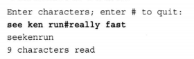

- 文件尾条件

  如果输入来自于文件, 则可以使用一种功能更强大的技术--检测文件尾(EOF).

### 嵌套循环和二维数组

假设要存储5个城市在4年间的最高温度.

```c++
int maxtemps[4][5]
```

该声明意味着maxtemps是一个包含4个元素的数组, 其中每个元素都是一个有5个整数组成的数组.

```c++
for (int row=0; row<4; row++)
{
	for (int col=0; col<5; ++col)
	{
		cout<<maxtemps[row][col]<<"\t"
	}
}
```

#### 初始化二维数组

初始化由一系列逗号分隔的一维数组初始化(用花括号括起来)组成:

```c++
int maxtemps[4][5] = 	//2D array
{
    {1,2,3,4,5},	//values for maxtemps[0]
    {1,2,3,4,5},
    {1,2,3,4,5},
    {1,2,3,4,5},
}
```

### 总结

许多程序都逐字地读取文本输入或文本文件, 如果ch是一个char变量, 则下面的语句将输入中的下一个字符读入到ch中:

`cin>ch;`

然而, 它将忽略空格, 换行和制表符. 

下面的成员函数调用读取输入中的下一个字符, 并将其存储到ch中:

`cin.get(ch);`

成员函数调用`cin.get()`返回下一个输入字符(包括空格, 换行符, 制表符):

`ch=cin.get();`

`cin.get(char)`成员函数调用通过返回转换为false的bool值来指出已达到EOF. 而`cin.get()`成员函数调用则通过返回EOF值来指出已达到EOF, EOF是在文件iostream中定义的.

# 分支语句和逻辑运算符

- if语句

```c++
if (test-condition)
    statement
```

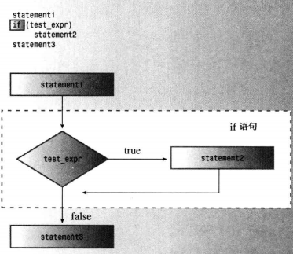

- if else 语句

  ```c++
  if (test-condition)
      statement1
  else
      statement2
  ```

- if else if else结构(修订后)

  ```c++
  if (ch == 'A')
      a_grade++;	//alternative #1
  else if (ch=='B')
      b_grade++;	//alternative #2
  else
      soso++;	//alternative #3
  ```

- 逻辑运算符

  | 运算符 | 表示方式 |
  | ------ | -------- |
  | &&     | and      |
  | \|\|   | or       |
  | !      | not      |

- 判断字符类型(cctype)

  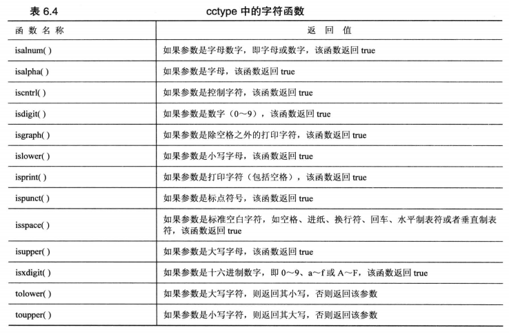

- ?:运算符

  C++有一个常用来代替if else语句的运算符, 这个运算符被称为条件运算符`?:`, 它是C++中唯一一个需要3个操作数的运算符

  ```c++
  expression1 ?expression2: expression3
  ```

  如果expression1为true, 则整个条件表达式的值为expression2的值; 否则, 整个表达式的值为expression3的值. 

  ```c++
  5>3 ? 10: 12;	//5>3 is true, so expression value is 10
  3 == 9? 25: 18;	//3==9 is false, so expression value is 18;
  ```


## switch语句

```c++
switch (integer-expression)
{
    case label1 : statement(s);
    case label2: statement(s);
        ...
            default: statement(x);
}
```

integer-expression必须是一个结果为整数值的表达式. 另外, 每个标签都必须整数常量表达式.

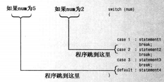

程序需要break语句来确保只执行switch语句中的特定部分. c


## 函数

> 函数基本要素
>
> 1. 函数定义
> 2. 函数原型
> 3. 调用函数

```c++
//defining, prototyping and calling a function
#include <iostream>
void simple();	//function prototype

int main(){
	using namespace std;
	cout<<"main() will call the simple() function: \n";
	
	simple();	//function call
	cout<<"main() is finished with simple() function.\n";
	
	return 0;
}

//function definition
void simple()
{
	using namespace std;
	cout<<"I'm but a simple function.\n";
 } 
```

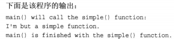

- 为什么需要原型

  ```c++
  //using prototypes and function calls
  #include <iostream>
  void cheers(int);	//prototype: no return value
  double cube(double x);	//prototype: returns a double; input x
  
  int main(){
  	using namespace std;
  	cheers(5);	//funcation call
  	cout<<"Give me a number: ";
  	double side;
  	cin>>side;
  	double volume=cube(side);	//function all
  	
  	cout <<"A "<<side<<"-foot cube has a volume of ";
  	cout <<volume<<" cubic feed.\n";
  	cheers(cube(2));	//prototype protection at work
  	return 0;
  }
  
  void cheers(int n)
  {
  	using namespace std;
  	for (int i=0;i<n;i++)
  		cout<<"Cheers!";
  	cout<<endl;
  }
  
  double cube(double x)
  {
  	return x*x*x;
  }
  ```

  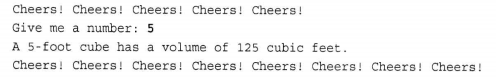

  原型描述了函数到编译器的接口, 也就是说, 它将函数返回值的类型以及参数的类型和数量告诉编译器.

  ```c++
  double volume = cube(side)
  ```

  首先, 原型告诉编译器, cube()有一个double参数. 如果程序没有提供这样的参数, 原型将让编译器能够捕获这种错误.其次, cube()函数完成l计算后, 将把返回值放置到指定的位置. 然后调用函数(main())将从这个位置取得返回值.

- 原型的语法

  函数原型是一条语句, 因此必须以分号结束. 

- 原型功能

  > 1. 编译器正确处理函数返回值
  > 2. 编译器检查使用的参数数目是否正确
  > 3. 编译器检查使用的参数类型是否正确. 如果不正确, 则转换为正确的类型(如果可能的话)

### 函数和数组

将形参声明为数组名

```c++
int sum_arr(int arr[],int n)	//arr=array name, n=size
```

动态数组同数组名和指针一样, 可以用方括号数组表示法来访问数组元素. 

```c++
arr[i]==*(arr+i)	//values in two notations
&arr[i]==arr+i	//address in two notation
```

```c++
//function with an array argument
#include <iostream>

const int ArSize=8;
int sum_arr(int arr[], int n);	//prototype
int main()
{
	using namespace std;
	int cookies[ArSize]={1,2,4,8,16,32,64,128};
	//some systems require preceding int with static to
	//enable array initialization
	
	int sum = sum_arr(cookies, ArSize);
	cout<<"Total cookies eaten: "<<sum<<"\n";
	return 0; 
}

//return the sum of an integer array
int sum_arr(int arr[], int n)
{
	int total=0;
	for (int i=0;i<n;i++)
		total=total+arr[i];
		
	return total;
}
```

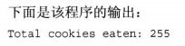

函数调用`sum_arr(coolies, ArSize)`将cookies数组第一个元素的地址和数组中的元素数目转递给`sum_arr()`. `sum_arr()`将cookies的地址赋给指针变量arr, 及那个ArSize赋给int变量n.

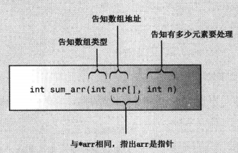


- 填充数组

  ```c++
  int fill_array(double ar[], int limit)
  {
      using namespace std;
      double temp;
      for (i=0;i<limit;i++)
      {
          cout<<"Enter value #"<<(i+1)<<" : ";
          cin>>temp;
          if (!cin)	//bad input
          {
              cin.clear();
              while (cin.get() !='\n')
                  continue;
              cout <<"Bad input, input process terminated.\n";
              break;
          }
          else if (temp<0)	//signal to terminate
              break;
          ar[i]=temp;
      }
      return i;
  }
  ```

  代码中包含了对用户的提示, 如果用户输入的是非负值, 则这个值将被赋给数组, 否则循环结束. 如果用户输入的都是有效值, 则循环将再读取最大数目的值后结束.

  实例

  ```c++
  //array functions and const
  #include <iostream>
  
  const int Max=5;
  
  //function prototype
  int fill_array(double ar[], int limit);
  void show_array(const double ar[],int n);	//dont change data
  void revalue(double r, double ar[],int n);
  
  int main(){
  	using namespace std;
  	double properties[Max];
  	
  	int size = fill_array(properties, Max);
  	show_array(properties,size);
  	
  	if (size>0)
  	{
  		cout<<"Enter revaluation factor: ";
  		double factor;
  		while (!(cin>>factor))	//bad input
  		{
  			cin.clear();
  			while (cin.get() !='\n')
  				continue;
  			cout<<"Bad input; Please enter a number: ";
  		}
  		
  		revalue(factor, properties,size);
  		show_array(properties,size); 
  	}
  	
  	cout<<"Done.\n";
  	cin.get();
  	cin.get();
  	return 0;
  }
  
  int fill_array(double ar[], int limit)
  {
  	using namespace std;
  	double temp;
  	int i;
  	for (i=0;i<limit;i++)
  	{
  		cout<<"Enter value #"<<(i+1)<<": ";
  		cin>>temp;
  		if (!cin)	//bad input
  		{
  			cin.clear();
  			while (cin.get()!='\n')
  				continue;
  			cout<<"Bad input; input process terminate.\n";
  			break;
  		 } 
  		 else if (temp<0)	//signal to terminate
  		 	break;
  		ar[i]=temp;
  	}
  	return i;
  }
  
  //the following function can use, but not alter,
  //the array whose address is ar
  void show_array(const double ar[], int n)
  {
  	using namespace std;
  	for (int i=0; i<n;i++)
  	{
  		cout<<"Property #"<<(i+1)<<": $";
  		cout<<ar[i]<<endl;
  	}
  }
  
  //multiplies each element of ar[ by r
  void revalue(double r, double ar[], int n)
  {
  	for (int i=0;i<n;i++)
  		ar[i]*=r;
  }
  ```

  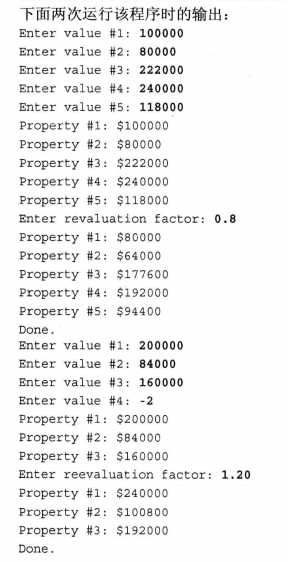

## C++ 其他知识点

### QT pri文件作用

类似于C++中的头文件, 可以把`*.pro`文件内的一部分内容单独放到`*.pri`文件内, 然后包含进来

例子: 将源文件的设置独立出来, 放到propriprfprl.pri文件内

```c++
SOURCES+=main.cpp/
    widget.cpp
HEADERS+=widget.h
FORMS +=widget.ui
```

这时, 可以将propriprfprl.pro文件简化为

```c++
TEMPLATE=app
CONFIG+=QT
QT+=core gui

TARGET = propriprfprl //?
include(propriprfprl.pri)
```

###### 
