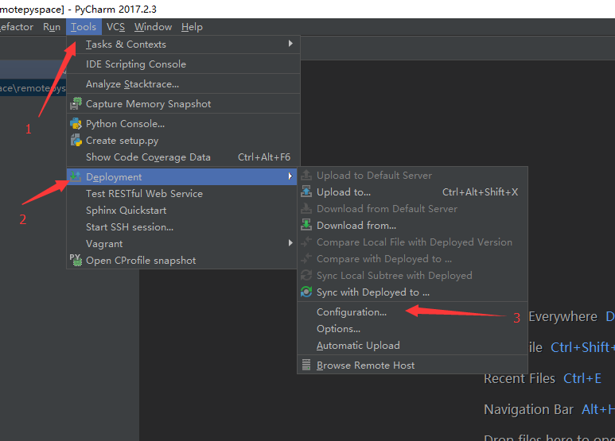
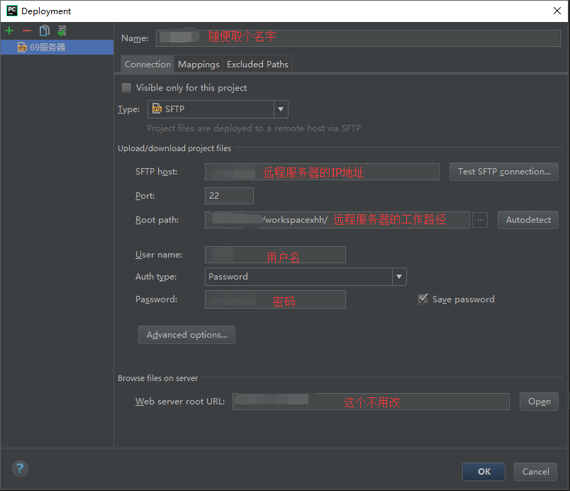
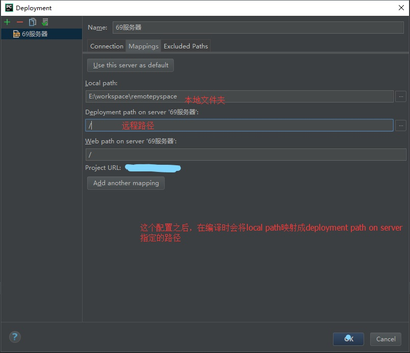
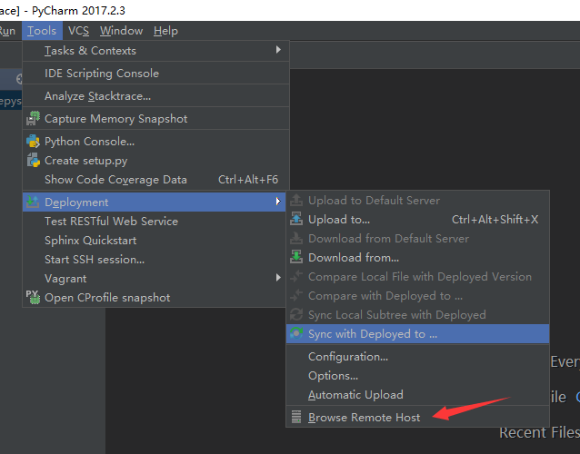
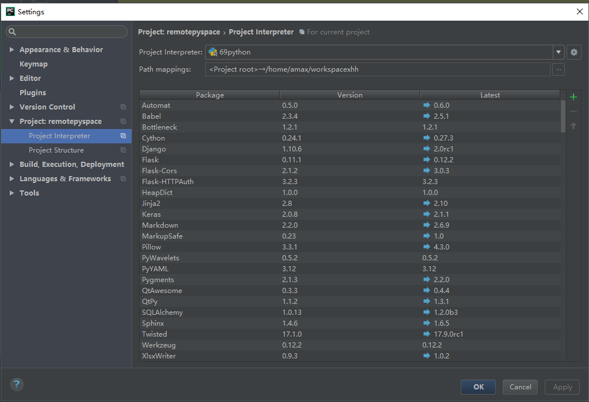
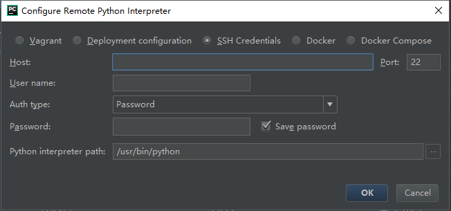
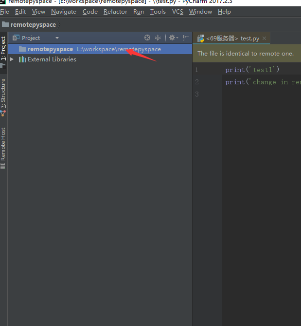
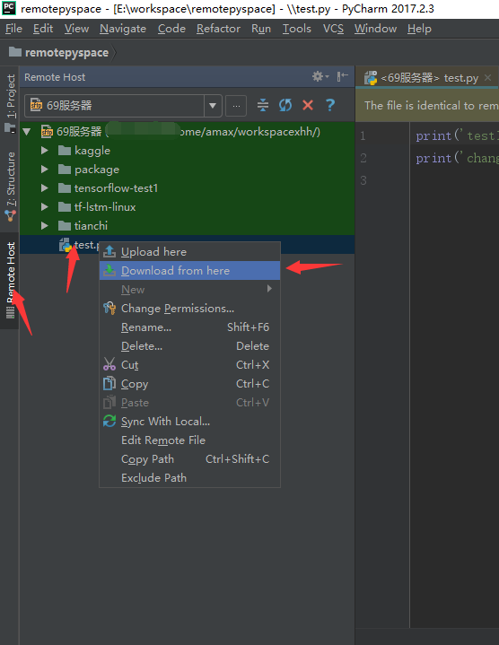
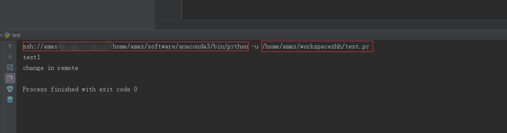

# 远程开发

## Python

### [Conda 环境迁移](https://www.anaconda.com/blog/moving-conda-environments)

**Clone**
在本地, conda可以方便地创建环境的快照或者备份

```bash
conda create --name snapshot --clone myenv
```

**Spec List**
如果需要在具有相同操作系统的计算机之间复制环境, 则可以生成`spec list`

```bash
conda list --explicit > spec-list.txt
```

重现环境

```bash
conda create --name python-course --file spec-list.txt
```

**Environment.yml**
也可使用`-export`选项生成一个`environment.yml`文件, 以在不同平台和操作系统之间复现项目环境. `spec list`文件和`environment`文件之间的区别在于`environment.yml`文件针对不同特定操作系统, 并且使用YAML格式, `environment.yml`仅列出包名称, 由conda基于软件包的名称构建环境. 另一个区别是`-export`还包括使用pip安装的软件包, 而`spec list`则没有

导出`environment.yml`文件:

```bash
conda env export > environment.yml --name base
```

注意: 如果当前路径已经有了environment.yml, conda会重写这个文件

重现环境:

```bash
conda env create -f environment.yml
```

**conda Pack**
`conda-pack`是一个命令行工具, 用于打包conda环境, 其中包括该环境中安装软件包的所有二进制文件. 当在没有问网络的系统中重现环境时, 此功能有用. 注意, conda-pack指定平台和操作系统, 目标计算机必须具有源计算机相同的平台和操作系统.

要安装`conda-pack`, 需确保位于root或base环境中, 以便`conda-pack`可在子环境中使用.

```bash
conda install -c conda-forge conda-pack
```

打包环境

```bash
# pack environment my_env into my_env.tar.gz
conda pack -n my_env

# pack environment my_env into out_name.tar.gz
conda pack -n my_env -o out_name.tar.gz

#pack environment located at an explicit path into my_env.tar.gz
conda pack -p /explicit/path/to/my_env
```

重现环境

```bash
# Unpack environment into directory 'my_env'
mkdir -p my_env
tar -xzf my_env.tar.gz -C my_env

#Use python without activating or fixing the perfixes. Most python libraries will work fine, but things that require prefix cleanups will fail
./my_env/bin/python
#activate the environment. This adds My_env/bin to your path source my_env/bin/activate
source my_env/bin/activate

#Run python from in the environment
$python
```


## Linux

## SSH

## Pycharm

### [远程开发配置流程](https://www.cnblogs.com/sddai/p/9648211.html)

**远程服务器**

操作系统: ubuntu 14.04

环境: 配置了ssh, 可使用ssh进行远程登录

远程部署仅仅只是同步和拷贝文件, 而正真支持远程调试的则是远程解释器.

1.   拷贝本地pycharm安装目录下的helpers目录中的所有文件.
2.   上传到远程服务器的登录用户home目录下. 如: 使用的是root用户, 则拷贝`/root/.pycharm_helpers`目录下
3.   在pycharm中选择`File->Setting->Project:xxx->Project Interpreter->Add Remote`

**配置Deployment**
`Tools->Deployment->Configuration`


然后可以看到如下配置页面, 具体配置如下



然后再Deployment的Mapping选项卡:



这样, Deployment的配置就完成了, 这个配置完成了之后, 其实相当于配置了FTP工具可以连接到服务器, 从而可以查看和修改服务器上的文件. 可以通过`Tools->Deplotment->Browse Remote Host`来打开相应的RemoteHost面板.



**配置远程Python解释器**
`File->Setting->Project:xx->Project Interpreter`



点击Interpreter配置页面的小齿轮按钮, 然后再选择`add Remote`, 然后弹出窗口并配置相应的信息



经过以上步骤, 远程解释器就配置好了, 这是可以直接点击小三角按钮, 调用远程服务器上的python解释器来运行代码. 

**使用流程**
在介绍Deployment配置的时候, 讲到Mapping选项卡的配置, 这个配置将本地的一个路径映射成了一个服务器上的路径, 因此, 在这个文件夹下的文件和服务器上的文件是同步的, 当然, 需要在本地修改的时候upload到服务器或设置自动upload.

| local path               | Deployment path on server |
| ------------------------ | ------------------------- |
| E:\workspace\remotespace | xxxx/workspacexhh         |

首先, 我们在pycharm中通过`File->open`来打开一个新项目, 项目路径就选择上面的local path路径. 在Project窗口中就可以看到打开了这个项目, 当前这个项目还是空的, 里面什么都没有



然后, 我们打开RemoteHost窗口, 在test.py文件上右键, 再选择Download from here, 文件就会下载到本地了. 返回Project小窗口, 就可以看到test.py. 其他文件类似, 如果由父目录, 他会将父目录一起下载下来, 所以文件和路径都会和服务器保持一致.



此时, 点击绿色小三角运行代码, 可以看到相应输出, 但是看控制台的输出, 可以发现, python解释器不是在本地, 而跑的文件也不是本地.



上面就是整个从服务器下载文件到本地, 在本地修改文件, 将文件上传到服务器, 然后直接在本地运行的整个过程.在这个过充中, 也可以发现, 经过这样的配置, 我们代码现有三个版本. 一个是本地代码, 一个是服务器上的代码, 还有一个是remoteHost面板中的代码(这个地方的代码如果直接编辑了, 其实也是可以提交到服务器)

## Reference