# pycharm自动生成头文件注释设置

## 模板设置

### 操作步骤

打开pycharm-->File-->Setting

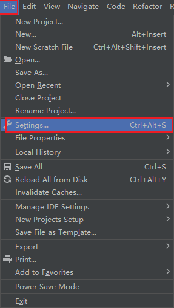

点击Editor-->File and Code Templates --> Python Script

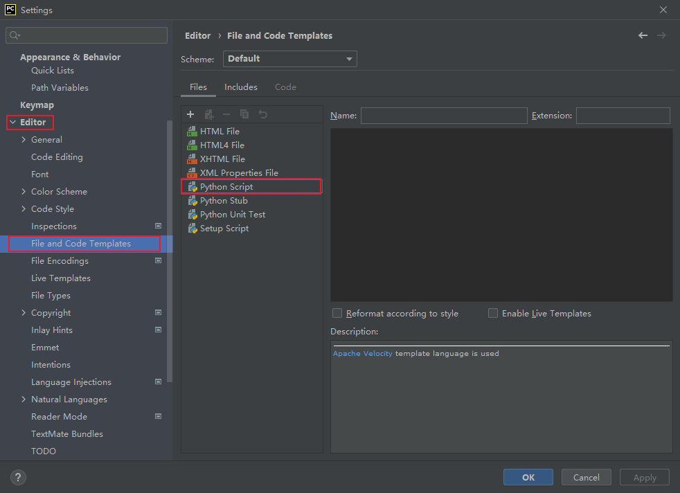

模板如下

```python
#!/usr/bin/env python
# -*- coding: UTF-8 -*-
'''
@Project ：${PROJECT_NAME} 
@File    ：${NAME}.py
@Author  ：kuisu
@Email     ：kuisu_dgut@163.com
@Date    ：${DATE} ${TIME} 
'''
```

## 参考变量

预定义的变量格式为`${variable_name}`

| 格式              | 作用效果                 |
| ----------------- | ------------------------ |
| ${PROJECT\_NAME}$ | 项目名                   |
| ${PRODUCT\_NAME}$​ | 集成开发环境             |
| ${NAME}$          | 文件名                   |
| ${USER}$          | 用户名(登录电脑的用户名) |
| ${DATE}$          | 当前系统的年月日         |

## 参考

- [pycharm自动生成头文件](https://blog.csdn.net/qq_45069279/article/details/107795634)

# Git 配置

## 安装Git

- 下载[git](https://git-scm.com/download/win)
- 安装

git内置了10中编辑器`Atom,Notepad, Notepad++,Sublime,Text, Visual Studio Code, Vim`

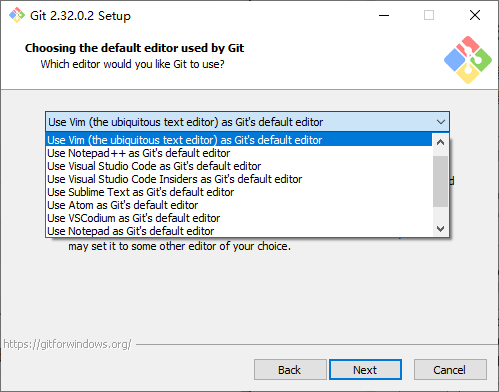

始菜单找到`git-->Git Bash`

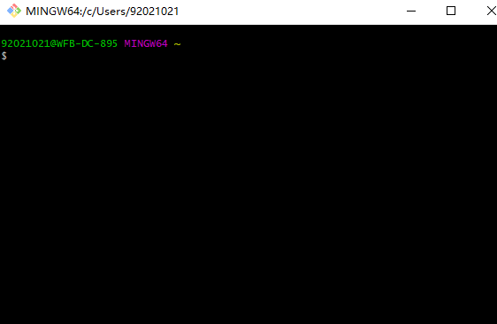

- 详细解释参考[Git详细安装教程](https://blog.csdn.net/mukes/article/details/115693833)

## git配置

```git
git config --global user.name "kuisu"
git config --global user.email "kuisu_dgut@163.com"
git config --list#查看配置
```

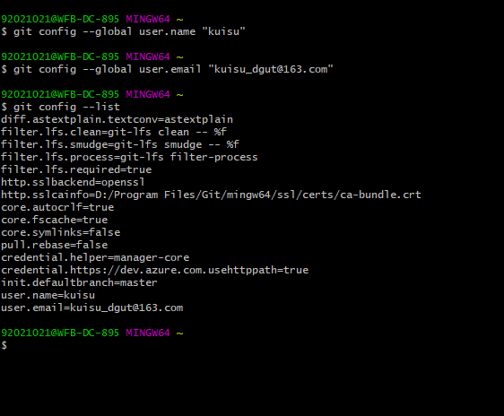

## 创建版本库

你可以简单理解成一个目录，这个目录里面的所有文件都可以被Git管理起来，每个文件的修改、删除，Git都能跟踪，以便任何时刻都可以追踪历史，或者在将来某个时刻可以“还原”。

- 初始化仓库

```git
$ mkdir newgit
$ cd newgit
$ pwd
$ git init#将此目录变成git可管理的仓库
```

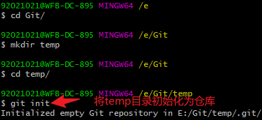

- 将文件提交到仓库

编辑一个`reademe.txt`文件,并提交到仓库

```git
$ git config --global core.autocrlf false
```

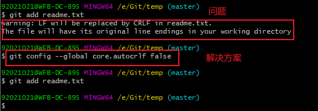

```git
$ git add readme.txt
$ git commit -m "write a readme file"#提交注释
```

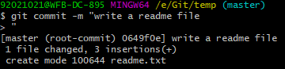

# pycharm中使用Git/GitHub

- `file-->settings-->Version Control-->Git-->git.exe path-->test`
- 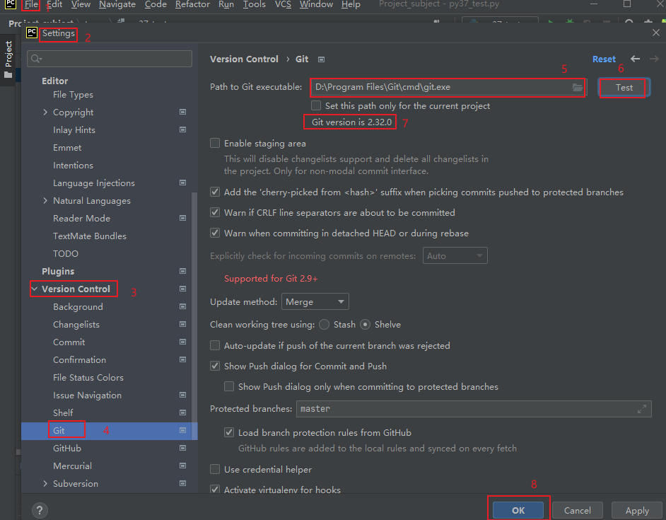

## pycharm中的GitHub

- `file-->settings-->Version Control-->GihHub-->Log in via GitHub`


### 建立远程仓库并提交代码

- `VCS--import into Version Control-->Share Project on GitHub`

  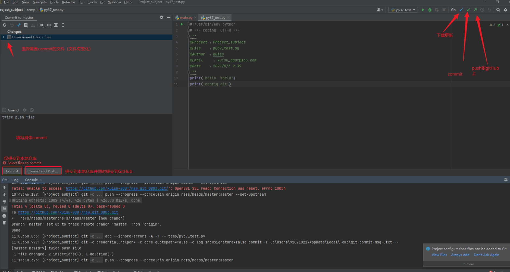

问题:`OpenSSL SSL_read: Connection was reset, errno 10054`

```git
$ git config --global http.sslVerify "false"
```

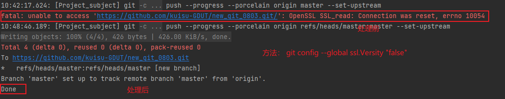

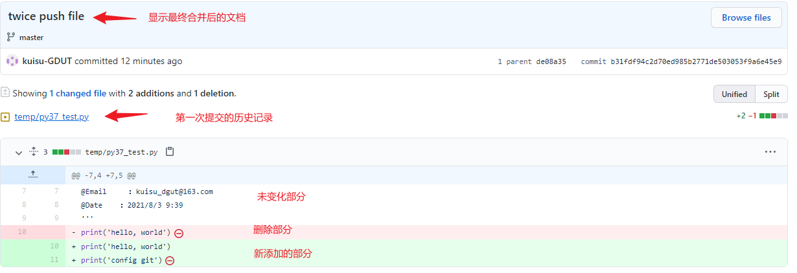

# 解决github无法访问

问题: GitHub服务器在国外,加载熟读非常慢.

原理: 绕过DNS解析,直接使用本地的DNS记录进行直接跳转

## DNS查询

在浏览器中查询[DNS](http://tool.chinaz.com/dns?type=1&host=github.com&ip=)

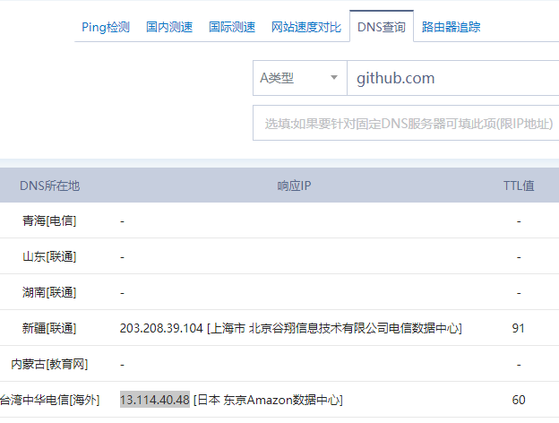

## 修改HOST

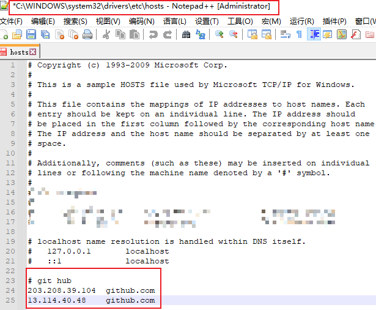

## 刷新DNS缓存

```cmd
ipconfig /flushdns# 刷新
ipconfig /displaydns# 查看
```

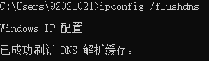