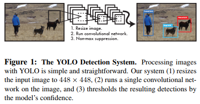
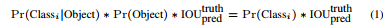
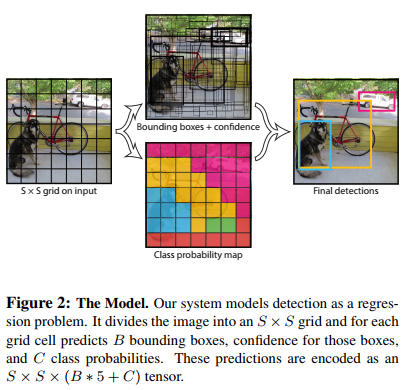
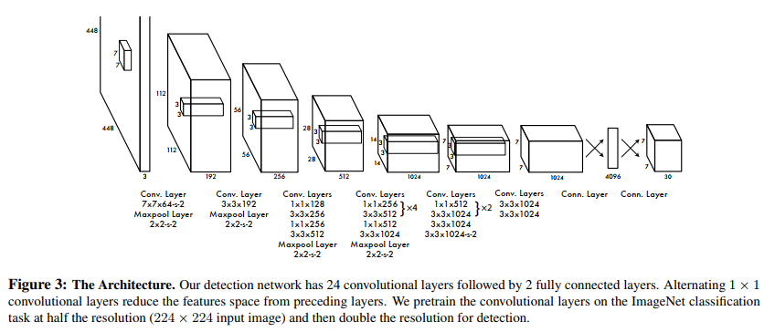
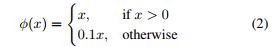
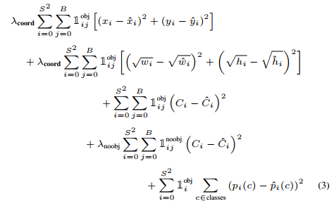

# You Only Look Once: Unifed, Real-Time Object Detection

## Abstract
We present YOLO, a new approach to object detection. Prior work on object detection repurposes classifiers to perform detection. Instead, we frame object detection as a regression problem to spatially separated bounding boxes and associated class probabilities. A single neural network predicts bounding boxes and class probabilities directly from full images in one evaluation. Since the whole detection pipeline is a single network, it can be optimized end-to-end directly on detection performance 

我们提出了 YOLO，一种新的物体检测方法。 先前关于目标检测的工作重新利用分类器来执行检测。 相反，我们将目标检测框架转化为位置边界框和相关类概率的回归问题。 单个神经网络在一次评估中直接从完整图像中预测边界框和类别概率。 由于整个检测管道是一个单一的网络，因此可以直接在检测性能上进行端到端的优化

Our unified architecture is extremely fast. Our base YOLO model processes images in real-time at 45 frames per second. A smaller version of the network, Fast YOLO, processes an astounding 155 frames per second while still achieving double the mAP of other real-time detectors. Compared to state-of-the-art detection systems, YOLO makes more localization errors but is less likely to predict false positives on background. Finally, YOLO learns very general representations of objects. It outperforms other detection methods, including DPM and R-CNN, when generalizing from natural images to other domains like artwork

我们的统一架构非常快。 我们的基础 YOLO 模型以每秒 45 帧的速度实时处理图像。 较小版本的网络 Fast YOLO 每秒处理速读达到惊人的 155 帧，同时仍实现其他实时检测器的两倍 mAP。 与最先进的检测系统相比，YOLO 会产生更多的定位错误，但不太可能在背景上预测误报。 最后，YOLO 学习非常通用的目标检测方法。 当从自然图像泛化到艺术品等其他领域时，它的性能优于其他检测方法，包括 DPM 和 R-CNN

## 1. Introduction
Humans glance at an image and instantly know what objects are in the image, where they are, and how they interact. The human visual system is fast and accurate, allowing us to perform complex tasks like driving with little conscious thought. Fast, accurate algorithms for object detection would allow computers to drive cars without specialized sensors, enable assistive devices to convey real-time scene information to human users, and unlock the potential for general purpose, responsive robotic systems 

人类瞥一眼图像并立即知道图像中有什么对象，它们在哪里，以及它们如何交互。 人类视觉系统既快速又准确，使我们能够在很少有意识的情况下执行复杂的任务，例如驾驶。 快速、准确的物体检测算法将允许计算机在没有专门传感器的情况下驾驶汽车，使辅助设备能够向人类用户传达实时场景信息，并释放通用响应机器人系统的潜力

Current detection systems repurpose classifiers to perform detection.  To detect an object, these systems take a classifier for that object and evaluate it at various locations and scales in a test image. Systems like deformable parts models (DPM) use a sliding window approach where the classifier is run at evenly spaced locations over the entire image [10]. 

当前的检测系统重新利用分类器来执行检测。 为了检测一个对象，这些系统为该对象使用一个分类器，并在测试图像的不同位置和尺度上对其进行评估。 可变形部件模型 (DPM) 等系统使用滑动窗口方法，其中分类器在整个图像上的均匀间隔位置运行 [10]。

More recent approaches like R-CNN use region proposal methods to first generate potential bounding boxes in an image and then run a classifier on these proposed boxes. After classification, post-processing is used to refine the bounding boxes, eliminate duplicate detections, and rescore the boxes based on other objects in the scene [13]. These complex pipelines are slow and hard to optimize because each individual component must be trained separately 

最近的方法如 R-CNN 使用区域提议方法首先在图像中生成潜在的边界框，然后在这些提议的框上运行分类器。 分类后，后处理用于细化边界框，消除重复检测，并根据场景中的其他对象对潜在框重新进行评分 [13]。 这些复杂的pipeline处理导致速度缓慢且难以优化，因为必须单独训练每个单独的组件

We reframe object detection as a single regression problem,  straight from image pixels to bounding box coordinates and  class probabilities. Using our system, you only look once (YOLO) at an image to predict what objects are present and where they are. 

我们将目标检测重新定义为一个单一的回归问题，直接从图像像素到边界框坐标和类别概率。 使用我们的系统，您只需看图像一次 (YOLO) 即可预测存在哪些对象以及它们在哪里。

YOLO is refreshingly simple: see Figure 1. A single convolutional network simultaneously predicts multiple bounding boxes and class probabilities for those boxes. YOLO trains on full images and directly optimizes detection performance. This unified model has several benefits over traditional methods of object detection. 

YOLO 非常简单：参见图 1。单个卷积网络同时预测多个边界框和这些框的类别概率。 YOLO 在完整图像上训练并直接优化检测性能。 与传统的对象检测方法相比，这种统一模型有几个优点。

First, YOLO is extremely fast. Since we frame detection as a regression problem we don’t need a complex pipeline. We simply run our neural network on a new image at test time to predict detections. Our base network runs at 45 frames per second with no batch processing on a Titan X GPU and a fast version runs at more than 150 fps. This means we can process streaming video in real-time with less than 25 milliseconds of latency. Furthermore, YOLO achieves more than twice the mean average precision of other real-time systems. For a demo of our system running in real-time on a webcam please see our project webpage: http://pjreddie.com/yolo/. 

首先，YOLO 非常快。 由于我们将检测视为回归问题，因此我们不需要复杂的pipline。 我们只是在测试时在新图像上运行我们的神经网络来预测检测。 我们的基础网络以每秒 45 帧的速度运行，在 Titan X GPU 上没有批处理，快速版本的运行速度超过 150 fps。 这意味着我们可以以不到 25 毫秒的延迟实时处理流视频。 此外，YOLO 的平均精度是其他实时系统平均精度的两倍以上。 有关我们系统在网络摄像头上实时运行的演示，请参阅我们的项目网页：http://pjreddie.com/yolo/。

Second, YOLO reasons globally about the image when making predictions. Unlike sliding window and region proposal-based techniques, YOLO sees the entire image during training and test time so it implicitly encodes contextual information about classes as well as their appearance. Fast R-CNN, a top detection method [14], mistakes background patches in an image for objects because it can’t see the larger context. YOLO makes less than half the number of background errors compared to Fast R-CNN. 

其次，YOLO 在进行预测时会对图像进行全局推理。 与基于滑动窗口和区域提议的技术不同，YOLO 在训练和测试期间看到整个图像，因此它隐式编码了关于类及其外观的上下文信息。 Fast R-CNN 是一种顶级检测方法 [14]，由于无法看到更大的上下文，因此会将图像中的背景块误认为是对象。 与 Fast R-CNN 相比，YOLO 的背景错误数量不到一半。

Third, YOLO learns generalizable representations of objects. When trained on natural images and tested on artwork, YOLO outperforms top detection methods like DPM and R-CNN by a wide margin. Since YOLO is highly generalizable it is less likely to break down when applied to new domains or unexpected inputs 

第三，YOLO 学习对象的可泛化表示。 在对自然图像进行训练并在艺术品上进行测试时，YOLO 的性能大大优于 DPM 和 R-CNN 等顶级检测方法。 由于 YOLO 具有高度的泛化性，因此在应用于新领域或意外输入时不太可能崩溃

YOLO still lags behind state-of-the-art detection systems in accuracy. While it can quickly identify objects in images it struggles to precisely localize some objects, especially small ones. We examine these tradeoffs further in our experiments. 

YOLO 在准确性方面仍然落后于最先进的检测系统。 虽然它可以快速识别图像中的物体，但它很难精确定位一些物体，尤其是小物体。 我们在实验中进一步研究了这些权衡。

All of our training and testing code is open source. A variety of pretrained models are also available to download.

我们所有的训练和测试代码都是开源的。 还可以下载各种预训练模型。

## 2. Unified Detection

We unify the separate components of object detection into a single neural network. Our network uses features from the entire image to predict each bounding box. It also predicts all bounding boxes across all classes for an image simultaneously. This means our network reasons globally about the full image and all the objects in the image. The YOLO design enables end-to-end training and realtime speeds while maintaining high average precision. 

我们将对象检测的独立组件统一到一个单一的神经网络中。 我们的网络使用来自整个图像的特征来预测每个边界框。 它还同时预测图像的所有类别的所有边界框。 这意味着我们的网络对完整图像和图像中的所有对象进行全局推理。 YOLO 设计支持端到端训练和实时速度，同时保持高平均精度。

Our system divides the input image into an S × S grid. If the center of an object falls into a grid cell, that grid cell is responsible for detecting that object 

我们的系统将输入图像划分为 S × S 网格。 如果对象的中心落入网格单元中，则该网格单元负责检测该对象

Each grid cell predicts B bounding boxes and confidence scores for those boxes. These confidence scores reflect how confident the model is that the box contains an object and also how accurate it thinks the box is that it predicts. Formally we define confidence as Pr(Object) ∗ IOUtruth pred. If no object exists in that cell, the confidence scores should be zero. Otherwise we want the confidence score to equal the intersection over union (IOU) between the predicted box and the ground truth. 

每个网格单元预测 B 个边界框和这些框的置信度分数。 这些置信度分数反映了模型对框包含对象的置信度，以及它认为框预测的准确度。 正式地，我们将置信度定义为 Pr(Object) ∗ IOU_truth^pred。 如果该单元格中不存在对象，则置信度分数应为零。 否则，我们希望置信度得分等于预测框和地面实况之间的交集（IOU）。

Each bounding box consists of 5 predictions: x, y, w, h, and confidence. The (x; y) coordinates represent the center of the box relative to the bounds of the grid cell. The width and height are predicted relative to the whole image. Finally the confidence prediction represents the IOU between the predicted box and any ground truth box 

每个边界框由 5 个预测组成：x、y、w、h 和置信度。 (x; y) 坐标表示相对于网格单元边界的框中心。 宽度和高度是相对于整个图像预测的。 最后，置信度预测表示预测框和任何地面实况框之间的 IOU

Each grid cell also predicts C conditional class probabilities, Pr(ClassijObject). These probabilities are conditioned on the grid cell containing an object. We only predict one set of class probabilities per grid cell, regardless of the number of boxes B.

每个网格单元还预测 C 个条件类概率，Pr(ClassijObject)。 这些概率以包含对象的网格单元为条件。 我们只预测每个网格单元的一组类概率，而不管框 B 的数量。

At test time we multiply the conditional class probabilities and the individual box confidence predictions, which gives us class-specific confidence scores for each box. These scores encode both the probability of that class appearing in the box and how well the predicted box fits the object. 

在测试时，我们将条件类概率和单个框置信度预测相乘，这为我们提供了每个框特定于类的置信度分数。 这些分数编码了该类出现在框中的概率以及预测的框与对象的匹配程度。

For evaluating YOLO on PASCAL VOC, we use S = 7, B = 2. PASCAL VOC has 20 labelled classes so C = 20. Our final prediction is a 7 × 7 × 30 tensor. 

## 2.1 Network Design

We implement this model as a convolutional neural network and evaluate it on the PASCAL VOC detection dataset [9]. The initial convolutional layers of the network extract features from the image while the fully connected layers predict the output probabilities and coordinates. 

我们将此模型实现为卷积神经网络，并在 PASCAL VOC 检测数据集 [9] 上对其进行评估。 网络的初始卷积层从图像中提取特征，而全连接层预测输出概率和坐标。

Our network architecture is inspired by the GoogLeNet model for image classification [34]. Our network has 24 convolutional layers followed by 2 fully connected layers. Instead of the inception modules used by GoogLeNet, we simply use 1 × 1 reduction layers followed by 3 × 3 convolutional layers, similar to Lin et al [22]. The full network is shown in Figure 3. 

我们的网络架构受到用于图像分类的 GoogLeNet 模型的启发 [34]。 我们的网络有 24 个卷积层，后跟 2 个全连接层。 我们不使用 GoogLeNet 使用的初始模块，而是简单地使用 1 × 1 缩减层和 3 × 3 卷积层，类似于 Lin 等人 [22]。 完整的网络如图 3 所示。

We also train a fast version of YOLO designed to push the boundaries of fast object detection. Fast YOLO uses a neural network with fewer convolutional layers (9 instead of 24) and fewer filters in those layers. Other than the size of the network, all training and testing parameters are the same between YOLO and Fast YOLO. 

我们还训练了一个快速版本的 YOLO，旨在突破快速目标检测的界限。 Fast YOLO 使用具有较少卷积层（9 个而不是 24 个）和这些层中的过滤器较少的神经网络。 除了网络的大小之外，YOLO 和 Fast YOLO 的所有训练和测试参数都是相同的。

The final output of our network is the 7 × 7 × 30 tensor of predictions.

我们网络的最终输出是 7 × 7 × 30 的预测张量。

## 2.2 Training

We pretrain our convolutional layers on the ImageNet 1000-class competition dataset [30]. For pretraining we use the first 20 convolutional layers from Figure 3 followed by a average-pooling layer and a fully connected layer. We train this network for approximately a week and achieve a single crop top-5 accuracy of 88% on the ImageNet 2012 validation set, comparable to the GoogLeNet models in Caffe’s Model Zoo [24]. We use the Darknet framework for all training and inference [26]. 

我们在 ImageNet 1000 级竞赛数据集 [30] 上预训练我们的卷积层。 对于预训练，我们使用图 3 中的前 20 个卷积层，然后是平均池化层和全连接层。 我们对该网络进行了大约一周的训练，并在 ImageNet 2012 验证集上实现了 88%的top-5 准确率，与 Caffe 的 Model Zoo [24] 中的 GoogLeNet 模型相当。 我们使用Darknet框架进行所有训练和推理 [26]。

We then convert the model to perform detection. Ren et al. show that adding both convolutional and connected layers to pretrained networks can improve performance [29]. Following their example, we add four convolutional layers and two fully connected layers with randomly initialized weights. Detection often requires fine-grained visual information so we increase the input resolution of the network from 224 × 224 to 448 × 448. 

然后我们转换模型以执行检测。 Ren等人。 表明将卷积层和连接层添加到预训练网络可以提高性能 [29]。 按照他们的例子，我们添加了四个卷积层和两个具有随机初始化权重的全连接层。 检测通常需要细粒度的视觉信息，因此我们将网络的输入分辨率从 224 × 224 增加到 448 × 448。

Our final layer predicts both class probabilities and bounding box coordinates. We normalize the bounding box width and height by the image width and height so that they fall between 0 and 1. We parametrize the bounding box x and y coordinates to be offsets of a particular grid cell location so they are also bounded between 0 and 1. 

我们的最后一层预测类别概率和边界框坐标。 我们通过图像的宽度和高度对边界框的宽度和高度进行归一化，使它们落在 0 和 1 之间。我们将边界框的 x 和 y 坐标参数化为特定网格单元位置的偏移量，因此它们也被限制在 0 和 1 之间 .

We use a linear activation function for the final layer and all other layers use the following leaky rectified linear activation

我们对最后一层使用线性激活函数，所有其他层使用以leanky rectified linear激活

We optimize for sum-squared error in the output of our model. We use sum-squared error because it is easy to optimize, however it does not perfectly align with our goal of maximizing average precision. It weights localization error equally with classification error which may not be ideal. Also, in every image many grid cells do not contain any object. This pushes the “confidence” scores of those cells towards zero, often overpowering the gradient from cells that do contain objects. This can lead to model instability, causing training to diverge early on. 

我们针对模型输出中的平方和误差进行了优化。 我们使用平方和误差是因为它很容易优化，但是它并不完全符合我们最大化平均精度的目标。 它将定位误差与可能不理想的分类误差同等加权。 此外，在每个图像中，许多网格单元不包含任何对象。 这会将这些单元格的“置信度”分数推向零，通常会overpoweing 包含对象的单元格的梯度。 这可能会导致模型不稳定，从而导致训练早期出现分歧。

To remedy this, we increase the loss from bounding box coordinate predictions and decrease the loss from confidence predictions for boxes that don’t contain objects. We use two parameters, λcoord and λnoobj to accomplish this. We set λcoord = 5 and λnoobj = 0.5.  

为了解决这个问题，我们增加了边界框坐标预测的损失，并减少了不包含对象的框的置信度预测的损失。 我们使用两个参数 λcoord 和 λnoobj 来实现这一点。 我们设置 λcoord = 5 和 λnoobj = 0.5。

Sum-squared error also equally weights errors in large boxes and small boxes. Our error metric should reflect that small deviations in large boxes matter less than in small boxes. To partially address this we predict the square root of the bounding box width and height instead of the width and height directly. 

Sum-squared error 也同样加权大框和小框的错误。 但我们的误差度量却反映出大盒子中的小偏差比小盒子中的小。 为了部分解决这个问题，我们预测边界框宽度和高度的平方根，而不是直接预测宽度和高度。

YOLO predicts multiple bounding boxes per grid cell. At training time we only want one bounding box predictor to be responsible for each object. We assign one predictor to be “responsible” for predicting an object based on which prediction has the highest current IOU with the ground truth. This leads to specialization between the bounding box predictors. Each predictor gets better at predicting certain sizes, aspect ratios, or classes of object, improving overall recall. 

YOLO 预测每个网格单元有多个边界框。 在训练时，我们只希望一个边界框预测器负责每个对象。 我们分配一个预测器来“负责”预测一个对象，根据哪个预测具有最高的当前 IOU 和ground truth。 这导致边界框预测器之间的specialization。 每个预测器在预测特定大小、纵横比或对象类别方面会变得更好，从而提高整体召回率。

During training we optimize the following, multi-part loss function where 1obj i denotes if object appears in cell i and 1obj ij denotes that the jth bounding box predictor in cell i is “responsible” for that prediction. 

在训练期间，我们优化了以下多部分损失函数，其中 1obj i 表示对象是否出现在单元格 i 中，1obj ij 表示单元格 i 中的第 j 个边界框预测器“负责”该预测。

Note that the loss function only penalizes classification error if an object is present in that grid cell (hence the conditional class probability discussed earlier). It also only penalizes bounding box coordinate error if that predictor is “responsible” for the ground truth box (i.e. has the highest IOU of any predictor in that grid cell). 

请注意，如果该网格单元中存在对象（因此是前面讨论的条件类概率），损失函数只会惩罚分类误差。 如果该预测器对ground truth框“负责”（即具有该网格单元中任何预测器的最高 IOU），它也只会惩罚边界框坐标误差。