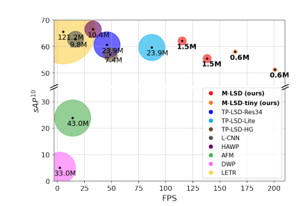
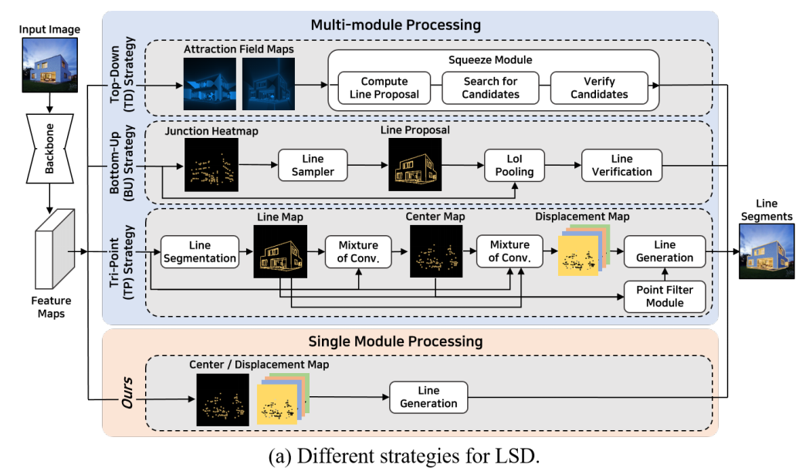
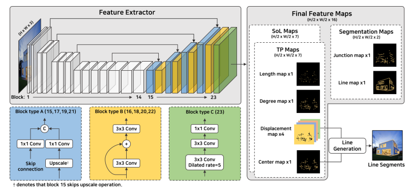
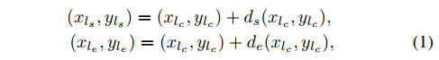
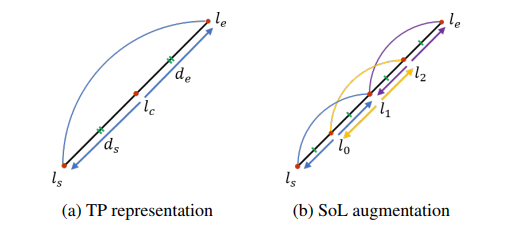
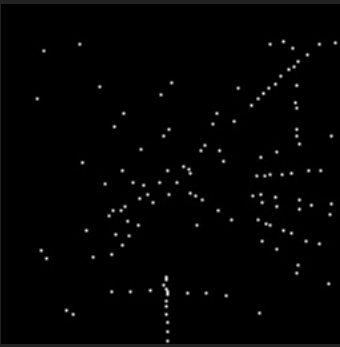
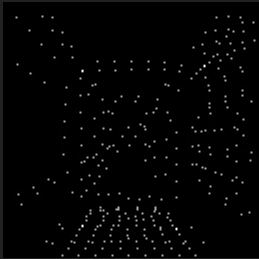
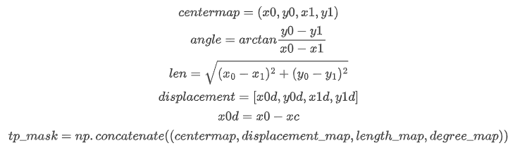

# Towards Light-weight and Real-time Line Segment Detection

## Abstract

Previous deep learning-based line segment detection (LSD) suffers from the immense model size and high computational cost for line prediction. This constrains them from real-time inference on computationally restricted environments. In this paper, we propose a real-time and light-weight segment detector for resource-constrained environments named Mobile LSD (M-LSD). We design an extremely efficient LSD architecture by minimizing the backbone network and removing the typical multi-module process for line prediction found in previous methods. To maintain competitive performance with a light-weight network, we present novel training schemes: Segments of Line segment (SoL) augmentation, matching and geometric loss. SoL augmentation splits a line segment into multiple subparts, which are used to provide auxiliary line data during the training process. Moreover, the matching and geometric loss allow a model to capture additional geometric cues. Compared with TP-LSD-Lite, previously the best real-time LSD method, our model (M-LSD-tiny) achieves competitive performance with 2.5% of model size and an increase of 130% in inference speed on GPU. Furthermore, our model runs at 56.FPS and 48.6 FPS on the latest Android and IPhone mobile device, respectively. To the best of our knowledge, this is the first real-time deep LSD available on mobile devices. 



>   Fig 1. Comparison of M-LSD and existing LSD methods on wireframe dataset. Inference speed (FPS) is computed on Tesla V100 GPU. Size and value of circles indicate the number of model parameters (Millions). M-LSD achieves competitive performance with the lightest model size and the fastest inference speed. 

## Introduction

Line segments and junctions are crucial visual features in low-level vision, which provide fundamental information to the higher level vision tasks, such as pose estimation, structure from motion, 3D reconstruction, image matching, wireframe to image translation and image rectification. Moreover, the growing demand for performing such vision tasks on resource constraint platforms, like mobile or embedded devices, has made real-time line segment detection (LSD) an essential but challenging task. The difficulty arises from the limited computational power and model size when finding the best accuracy and resource-efficiency trade-offs to achieve real-time inference.

With the advent of deep neural networks, deep learning based LSD architectures have adopted models to learn various geometric cues of line segments and have proved to show improvements in performance. As described in Fig 2, we have summarized multiple strategies that use deep learning models for LSD. The top-down strategy first detects regions of line segment with attraction field maps and then squeezes these regions into line segments to make predictions. In contrast, the bottom-up strategy first detects junctions, then arranges them into line segments, and lastly verifies the line segments by using an extra classifier or a merging algorithm. Recently, proposes Tri-Points (TP) representation for a simpler process of line prediction without the time-consuming steps of line proposal and verification.



Although previous efforts of using deep networks have made remarkable achievements, real-time inference for LSD on resource-constraint platforms still remains limited. There have been attempts to present real-time LSD, but they still depend on server-class GPUs. This is mainly because the models that are used exploit heavy backbone networks, such as dilated ResNet50-based FPN, stacked hourglass network and atrous residual U-Net , which require large memory and high computational power. In addition, as shown in Fig 2, the line prediction process consists of multiple modules, which include line proposal, line verificatioin networks and mixture of convolution module. As the size of the model and the number of modules for line prediction increase, the overall inference speed of LSD can becaome slower, as shown in Fig 2b, while demanding higher computation. Thus, increase in computational cost make it difficult to deploy LSD on resource-constraint platforms.

In this paper, we propose a real-time and light-weight LSD for resource-constrained environment, named Mobile LSD (M-LSD). For the network, we design a significantly efficient architecture with a single module to predict line segments. By minimizing the network size and removing the multi-module process from previous methods, M-LSD is extremely light and fast. To maintain competitive performance even with a light-weight network, we present novel training schemes: SoL augmentation, matching and geometric loss. SoL augmentation divides a line segment into subparts, which are further used to provide augmented line data during the training phase. Matching and geometric loss train a model with additional geometric information, including relation between line segments, junction and line segmentation, length and degree regressioin. As a result, our model is able to capture extra geometric information during training to make more accurate line prediction.  Moreover, the proposed training schemes can be used with existing methods to further improve performance in a plug-and-play manner.

As shown in Figure 1, our methods achieve competitive performance and faster inference speed with a much smaller model size. M-LSD outperforms previously the real-time method, TP-LSD-Lite, with only 6.3% of the model size but gaining an increase of 32.5% in inference speed. Moreover, M-LSD-tiny runs in real-time at 56.8 FPS. To the best of our knowledge, this is the first real-time LSD method available on mobile devices.



>   The overall architecture of M-LSD. In the feature extractor, block 1~14 are parts of MobileNetV2, and block 15 ~ 23 are designed as a top-down architecture. The predicted line segments are generated with center and displacement maps.

## M-LSD for Line Segment Detection

In this section, we present the details of M-LSD. Our design mainly focuses on efficiency while retaining competitive performance. Firstly, we exploit a light-weight backbone and reduce the modules involved in processing line predictions for better efficiency. Next, we apply additional training schemes, including SoL augmentation, matching and geometric loss, to capture extra geometric cues. As a result, M-LSD is able to balance the trade-off between accuracy and efficiency to be well suited for mobile devices.

### Network Architecture

We design light (M-LSD) and Lighter (M-LSD-tiny) models as popular encoder-decoder architectures. In efforts to build a light-weights LSD model, our encoder networks are based on MobileNetV2 which is well-known to run in real-time on mobile environment. The encoder network uses parts of MobileNetV2 to make it even lighter. As illustrated in Figure 3, the encoder of M-LSD includes an input to 96-channel of bottleneck blocks. The number of parameters in the encoder network is 0.56 M (16.5% of mobileNetV2), while the total parameters of MobileNetV2 are 3.4M. For M-LSD-tiny, a slightly smaller yet faster model, the encoder network also uses parts of MobileNetV2, in-cluding an input to 64-channel of bottleneck blocks which results in a number of 0.25 M (7.4% of MobileNetV2). The decoder network is designed using combination of block types A, B, C. The expansive path consists of concatenation of feature maps from the skip connection and upscale from block type A, followed by two 3x3 convolutions with a residual connection in-between from block type B. Similarly, block type C performs two 3x3 convolutions, the first being a dilated convolution, followed by a 1x1 convolution. Please refer to the supplementary material of further details on the network architectures.

As shown in Fig 2b, we observe that one of the most critical bottlenecks in inference speed has been the prediction process, which contains multi-module processing from previous methodsd. In this paper, we argue that the complicated multi-module can be disregarded. As illustrated in Fig 3, we generate line segments directly from the final feature maps in a single module process. In the final feature maps, each map channel serves its own purpose: 1) TP maps have seven feature maps, including one length map, one degree map, one center map, and four displacement maps. 2) SoL maps have seven feature maps with the same configuration as TP maps. 3) Segmentation maps have two feature maps, including junction and line maps.

### Line Segment Representation

Line segment representation determines how line segment predictions are generated and ultimately affects the ficiency of LSD. Hence, we employ he TP representation which has been introduced to have a simple line generation process and shown to perform realtime LSD using GPUs. TP representation uses three key points to depict a line segment: start, center, and end points. As illustrated in Fig 4a, the start $l_s$ and end $l_e$ points are represented by using two displacement vectors $(d_s,d_e)$ with respect to the center $l_c$ point. The line generation process, which is to convert center point and displacement vectors to a vectorized line segment, is performed as: 



where $(x_a, y_a)$ denotes coordinates of an arbitrary $a$ point. $d_s (x_{lc}, y_{lc})$ and $d_e(x_{lc},y_{lc})$ indicate 2D displacements from the center point $l_c$ to the corresponding start $l_s$ and end $l_e$ points. The center point and displacement vectors are trained with one center map and four displacement maps (one for each x and y value of the displacement vectors $d_s$  and $d_e$). In the line generation process, we extract the exact center point position by applying non-maximum supression on the center map. Next, we generate line segments with the extracted center points and the corresponding displacement vectors using a simple arithmetic operation as expressed in Equation 1; thus, making inference efficient and fast.




>   Figure 4: Tri-Points (TP) representation and Segments of Line segment (SoL) augmentation. $l_s, l_c, l_e$ denote start, center, and end points, respectively. $d_s, d_e$ are displacement vectors to start and end points. $l_0$~$l_2$ indicates internally dividing pint of the line segments $l_sl_e$.

### Matching Loss

we use the weighted inary cross-entropy loss and smooth L1 loss as center loss $L_{center}$ and displacement loss $L_{disp}$, which are for training the center and displacement map, respectively. The line segments under the TP representation are decoupled into center points and displacement vectors, which are optimized separately. However, the coupled information of the line segment is under-utilized in the objective functions.

To resolve this problem, we present a matching loss, which leverages the coupled information w.r.t the ground truth. As illustrated in Figure 5a, matching loss considers relation between line segments by guiding the generated line segments to be similar to the matched GT. We first take the endpoints of each prediction , which can be calculated via the line generation process, and measure the Euclidean distance $d(.)$ to the endpoints of the GT. Next, these distances are used to match predicted line segments $\hat{l}$ with GT line segments $l$ that are under a threshold $\gamma$:
$$
d\left(l_{s}, \hat{l}_{s}\right)<\gamma \text { and } d\left(l_{e}, \hat{l}_{e}\right)<\gamma,
$$
where $l_{s}$ and $l_{e}$ are the start and end points of the line $l$, and $\gamma$ is set to 5 pixels. Then, we obtain a set $\mathbb{M}$ of matched line segments $(l, \hat{l})$ that satisfies this condition. Finally, the L1 loss is used for the matching loss, which aims to minimize the geometric distance of the matched line segments w.r.t the start, end, and center points as follows:
$$
\begin{aligned}
\mathcal{L}_{\text {match }}=& \frac{1}{|\mathbb{M}|} \sum_{(l, \hat{)}) \in \mathbb{M}}\left\|l_{s}-\hat{l}_{s}\right\|_{1}+\left\|l_{e}-\hat{l}_{e}\right\|_{1} \\
&+\left\|\tilde{C}(\hat{l})-\left(l_{s}+l_{e}\right) / 2\right\|_{1}
\end{aligned}
$$
where $\tilde{C}(\hat{l})$ is the center point of line $\hat{l}$ from the center map. The total loss function for the TP map can be formulated as $\mathcal{L}_{T P}=\mathcal{L}_{\text {center }}+\mathcal{L}_{\text {disp }}+\mathcal{L}_{\text {match }} .$
$$
centermap = (x0,y0,x1,y1)\\
angle = arctan\frac{y0-y1}{x0-x1}\\
len = \sqrt{(x_0-x_1)^2+(y_0-y_1)^2}\\
displacement = [x0d,y0d,x1d,y1d]\\
x0d=x0-xc\\
tp\_mask = np.concatenate((centermap,displacement\_map,length\_map,degree\_map))
$$


### SoL Augmentation

We propose Segments of Line segment (SoL) augmentation that increases the number of line segments with wider varieties of length for training. Learning line segments with center points and displacement vectors can be insufficient in certain circumstances where a line segment may be too long to manage within the receptive field size or the center points of two distinct line segments may be too close to each other. To address these issues and provide auxiliary information to the TP representation, SoL explicity spits line segments into multiple subparts with overlapping portions of each other. An overlap between each split is enforced to preserve connectivity among the subparts.

As described in Figure 4b, we compute k internally disviding points $(l_0,l_1,...,l_k)$ and separate the line segment $\overline{l_sl_e}$ into k subparts 

$\left(\overline{l_{s} l_{1}}, \overline{l_{0} l_{2}}, \cdots, \overline{l_{k-1} l_{e}}\right)$ . Expressed in TP representation, each subpart is trained as if it is a typical line segment. The number of internally dividing points k is determined by the length of the line segment as $k=[r(l)/(u/2)]-1$, where $r(l)$ denotes the length of line segment $l$, and $u$ is the base length of subparts. Note that when $k<1$, we do not split the line segment. The resulting length of each subpart can be similar to $u$ with small margins of error due to the rounding function $[.]$, and we empirically set $u=inputSize*0.125$. The loss function of $L_{SoL}$ follows the same configuration as $L_{TP}$, while each subpart is treated as an individual line segment. Note that the line generation process is only done in TP maps, not in SoL maps. 

### Learning with Geometric Information

To boost the quality of predictions, we incorporate various geometric information about line segments which helps the overall learning process. In this section, we present learning LSD with junction and line segmentation and line segmentation, and length and degree regression for geometric formation.


**Junction and Line segmention**

Center point and displacement vectors are highly related to pixel-wise junctions and line segments in the segmentation maps of Fig 3. For example, end points, derived from the center point and displacement vectors, should be the junction points. Also, center points must be localized on the pixel-wise line segment. Thus, learning the segmentation maps of junctions and line segments works as spatial attention cue for LSD. As illustrated in Fig 3, M-LSD contains segmentation maps, including a junction GT map by scaling with Gaussian kernel as the center map, while using a binary map for line GT map. The total segmentation loss is defined as $L_{seg}=L_{junc}+L_{line}$, where we use WBCE loss for both $L_{junc}$ and ${L_{line}}$.

**Length and Degree Regression**
As displacement vectors can be derived from the length and degree of line segments, they can be additional geometric cues to support the displacement maps. We compute the length and degree from the ground truth and mark the values on the center of line segments in each GT map. Next, these values are extrapolated to a 3x3 window so that all neighboring pixels of a given pixel contain the same value. As shown in Figure 3, we maintain predicted length and degree maps for both TP and SoL maps, where TP uses the original line segment and SoL uses augmented subparts. As the ranges of length and degree are wide, we divide each length by the diagonal length of the input image for normalization. For degree, we divide each degree by $2\pi$ and add 0.5. The total regressioin loss can be formulated as $L_{reg}=L_{length}+L_{degree}$, where we use smooth L1 loss for both $L_{length}$ and $L_degree$


### Final loss Functions

The geometric loss function is defined as the sum of segmentation and regression loss:
$$
L_{Geo}=L_{seg}+L_{reg}
$$
The loss function for SoL maps $L_{SoL}$ follows that the same formulation as $L_{TP}$ but with SoL augmented GT. Finally, we obtain the final loss function to train M-LSD as follows:
$$
L_{total}=L_{TP}+L_{SoL}+L_{Geo}
$$

## Code

displacement map


center map


reverse line


线条可视化

| lines                                                        | SOL lines                                                    |
| ------------------------------------------------------------ | ------------------------------------------------------------ |
|  |  |
|  |  |
|                                                              |                                                              |

### Model

-   获取中间层

    ```python
    def _forward_impl(self,x):
        self.fpn_selected = [1,3,6,10,13]
        fnp_features = []
        for i, f in enumerate(self.features):
            if i >self.fpn_selected[-1]:
                break
            x = f(x)
            if i in self.fpn_selected:
                fpn_features.append(x)
        
        c1, c2, c3, c4, c5 = fpn_features
        return c1, c2, c3, c4, c5
    def forward(self,x):
    	return self._forward_impl(x)
    ```

-   上采样

    ```python
    class BlockTypeA(nn.Module):
        def __init__(self,in_c1, in_c3, out_c1, out_c2, upscale=True):
            super(BlockTypeA, self).__init__()
            self.conv1 = nn.Sequential(
            	nn.Conv2d(in_c2,out_c2,kernel_size=1),
                nn.BatchNorm2d(out_c2),
                nn.ReLU(inplace=True)#inplace: 是否进行原地操作
            )
            self.conv2 = nn.Sequential(
            	nn.Conv2d(in_c1, out_c1,kernel_size=1),
                nn.BatchNorm2d(out_c1),
                nn.ReLU(inplace=True)
            )
            self.upscale = upscale
            
        def forward(self,a,b):
            b = self.conv1(b)
            a = self.conv2(a)
            if self.upscale:
                b = F.interpolate(b, scale_factor=2.0, mode="bilinear", align_corners=True)
            return torch.cat((a,b),dim=1)
    
    class BlockType(nn.Module):
        def __init__(self, in_c, out_c):
            super(BlockTypeB, self).__init__()
            self.conv1 = nn.Sequential(
            	nn.Conv2d(in_c, in_c, kernel_size, padding=1),
                nn.BatchNorm2d(in_c),
                nn.ReLU()
            )
            sefl.conv2 = nn.Sequential(
            	nn.Conv2d(in_c, out_c,kernel_size=3, padding=1),
                nn.BatchNorm2d(out_c),
                nn.ReLU()
            )
            
        def forward(self,x):
            x = self.conv1(x)+x
            x = self.conv2(x)
            return x
    ```

-   Simple_MLSD_Learner()

    ```python
    class Simple_MLSD_Learner():
        def __init__(self,
                    cfg,
                    model: torch.nn.Module,
                    optimizer: Optimizer,
                    scheduler,
                    logger: TxtLogger,
                    save_dir: str,
                    log_steps: 100,
                    device_ids=[0,1],
                    gradient_accum_steps=1,
                    max_grad_norm=100,0,
                    batch_to_model_inputs_fn=None,
                    early_stop_n=4):
            self.cfg = cfg
            self.model  = model
            self.optimizer = optimizer
            self.scheduler = scheduler
            self.save_dir = save_dir
            self.log_steps = log_steps
            self.logger = logger
            self.device_ids = device_ids
            self.gradient_accum_steps = gradient_accum_steps
            self.max_grad_norm = max_grad_norm
            self.batch_to_model_inputs_fn  = batch_to_model_inputs_fn
            self.early_stop_n = early_stop_n
            self.global_step = 0
    
            self.input_size = self.cfg.datasets.input_size
            self.loss_fn = LineSegmentLoss(cfg)
            self.epo = 0
            
        def step(self, step_n, batch_data:dict):
            device = torch.device("cuda:0" if torch.cuda.is_available(0 else "cpu"))
            imgs = batch_data['xs'].to(device)
            label = batch_data['ys'].to(device)
            outputs = self.model(imgs)
            loss_dict = self.loss_fn(outputs, label,
                                    ...)
            loss = loss_dict['loss']
            if self.gradient_accum_steps > 1:
                loss = loss/self.gradient_accum_steps
            loss.backward()
            
            torch.nn.utils.clip_grad_norm_(self.model.parameters(), self.max_grad_norm)
            if (step_n+1)%self.gradient_accum_steps == 0:
                self.optimizer.step()
                self.scheduler.step()
                self.model.zero_grad()
                self.global_step += 1
            return loss, loss_dict
        
        def val(self, model, val_dataloader:DataLoader):
            thresh = self.cfg.decode.score_thresh
            topk = self.cfg.decode.topk
            min_len = self.cfg.decode.len_thresh
            
            device = torch.device("cuda:0" if torch.cuda.is-available() else "cpu")
            
            model = model.eval()
            sam_thresh = 10
            data_iter = tqdm.tqdm(val_dataloader)
            
            tp_list, fp_list, scores_list = [], [],[]
            n_gt = 0
            
            for batch_data in data_iter:
                imgs = batch_data["xs"].to(device)
                label= batch_data['ys'].to(device)
                batch_outputs = model(imgs)
                
                label = label[:,7:,:,:]
                batch_outputs = batch_outputs[:,7:,:,:]
                
        def train(self,
                 train_dataloader:DataLoader,
                 val_dataloader; DataLoader,
                 epoches=100):
            best_score = 0
            early_n = 0
            for self.epo in range(epoches):
                step_n = 0
                train_avg_loss = AverageMeter()
                
                data_iter = tqdm.tqdm(train_dataloader)
                for batch in data_iter:
                    self.model.train()
                    train_loss, loss_dict = self.step(step_n,batch)
                    train_avg_loss.update(train_loss.item(),1)
                    
                    if step_n%self.log_steps == 0:
                        print(result)
                    data_iter.set_description(status)
                    step_n += 1
                
    ```

    

### data

```python
json_content={
    "version": "4.5.6",
    "flags": {},
    "shape": [],
    "imagePath": fn,
    "imagePath": fn,
    "imageData":  None,
    "imageHeight": h,
    "imageWidth": w,
}
```

**SoL实现**

```python
def get_ext_lines(norm_lines, h=256, w=256, min_len=0.125):
    """
    扩展线的数目，SoL, 利用y=kx+b来获得多个线段,且保证每相邻线段间存在交集。
    """
    mu_half = min_len / 2
    ext_lines = []
    for line in norm_lines:
        x0, y0, x1, y1 = line
        line_len = np.sqrt((x0 - x1) ** 2 + (y0 - y1) ** 2)
        nn = int(line_len / mu_half) - 1
        # print("nn: ", nn)
        if nn <= 1:
            ext_lines.append(line)
        else:
            ## y = k * x + b
            if abs(x0 - x1) > abs(y0 - y1):
                ## y = k* x + b
                k = (y1 - y0) / (x1 - x0)
                b = y1 - k * x1
                step = (x1 - x0) / (nn + 1)
                len_step = 2 * step  # (x1 - x0) / (nn - 1)
                for ix in range(nn):
                    ix0 = x0 + ix * step
                    # ix1 = x0 + (ix + 1) * step
                    ix1 = ix0 + len_step
                    iy0 = k * ix0 + b
                    iy1 = k * ix1 + b
                    ext_lines.append([ix0, iy0, ix1, iy1])

            else:
                ## x = k* y + b
                k = (x1 - x0) / (y1 - y0)
                b = x1 - k * y1
                step = (y1 - y0) / (nn + 1)
                len_step = 2 * step  # (y1 - y0) / (nn - 1)
                for iy in range(nn):
                    iy0 = y0 + iy * step
                    # iy1 = y0 + (iy + 1) * step
                    iy1 = iy0 + len_step
                    ix0 = k * iy0 + b
                    ix1 = k * iy1 + b
                    ext_lines.append([ix0, iy0, ix1, iy1])
    # print("ext_lines: ", len(ext_lines))
    return ext_lines
```

**将线段转为8维的mask**

```python
def gen_TP_mask2(norm_lines,  h = 256, w = 256, with_ext=False):
    """
    将线段转为7维的mask
    1 cengter + 4  dis + 1 length + 1 degree_map
    return [7, h, w]
    """

    h, w, _ = img.shape

    len_divide_v = np.sqrt(h**2 + w**2)#对角线的长
    radius = 1

    centermap = np.zeros((1, h, w), dtype=np.uint8)
    #displacement_map = -np.ones((4, h, w), dtype=np.float32) * 1000.0

    displacement_map = np.zeros((4, h, w), dtype=np.float32)
    length_map = np.zeros((1, h, w), dtype=np.float32)
    degree_map = np.zeros((1, h, w), dtype=np.float32)

    for l in norm_lines:
        x0 = int(round(l[0] * w))
        y0 = int(round(l[1] * h))
        x1 = int(round(l[2] * w))
        y1 = int(round(l[3] * h))

        xc = round(w * (l[0] + l[2]) / 2)
        yc = round(h * (l[1] + l[3]) / 2)

        xc = int(np.clip(xc, 0, w - 1))
        yc = int(np.clip(yc, 0, h - 1))

        centermap[0, yc, xc] = 255

        line_len, ang = line_len_and_angle(x0, y0, x1, y1)
        line_len /= len_divide_v
        length_map[0, yc, xc] = line_len
        degree_map[0, yc, xc] = ang

        x0d = x0 - xc
        y0d = y0 - yc
        x1d = x1 - xc
        y1d = y1 - yc

        #print('x0d: ', x0d)

        displacement_map[0, yc, xc] = x0d  # / 2
        displacement_map[1, yc, xc] = y0d  # / 2
        displacement_map[2, yc, xc] = x1d  # / 2
        displacement_map[3, yc, xc] = y1d  # / 2

        ## walk around line
        #ptss = work_around_line(x0, y0, x1, y1, n=5, r=0.0, thickness=3)

        # extrapolated to a 3×3 window
        ptss = near_area_n(xc, yc, n=3)
        for p in ptss:
            xc = round(p[0])
            yc = round(p[1])
            xc = int(np.clip(xc, 0, w - 1))
            yc = int(np.clip(yc, 0, h - 1))
            # x0d = x0 - xc
            # y0d = y0 - yc
            # x1d = x1 - xc
            # y1d = y1 - yc
            displacement_map[0, yc, xc] = x0d# / 2
            displacement_map[1, yc, xc] = y0d# / 2
            displacement_map[2, yc, xc] = x1d# / 2
            displacement_map[3, yc, xc] = y1d# / 2
			
            #3x3 window具有相同的角度和线段长度
            length_map[0, yc, xc] = line_len
            degree_map[0, yc, xc] = ang

        xc = round(w * (l[0] + l[2]) / 2)
        yc = round(h * (l[1] + l[3]) / 2)

        xc = int(np.clip(xc, 0, w - 1))
        yc = int(np.clip(yc, 0, h - 1))

        centermap[0, yc, xc] = 255

        line_len, ang = line_len_and_angle(x0, y0, x1, y1)
        line_len /= len_divide_v
        length_map[0, yc, xc] = line_len
        degree_map[0, yc, xc] = ang

        x0d = x0 - xc
        y0d = y0 - yc
        x1d = x1 - xc
        y1d = y1 - yc

        displacement_map[0, yc, xc] = x0d  # / 2
        displacement_map[1, yc, xc] = y0d  # / 2
        displacement_map[2, yc, xc] = x1d  # / 2
        displacement_map[3, yc, xc] = y1d  # / 2

    centermap[0, :, :] = cv2.GaussianBlur(centermap[0, :, :], (3,3), 0.0)
    centermap = np.array(centermap, dtype=np.float32) / 255.0
    b = centermap.max() - centermap.min()
    if b !=0:
        centermap = ( centermap - centermap.min() ) / b

    tp_mask = np.concatenate((centermap, displacement_map, length_map, degree_map), axis=0)
    return tp_mask
```



根据normal lines，生成线mask和junction mask

```python
def gen_junction_and_line_mask(norm_lines, h = 256, w = 256):
    """
    根据norm lines生产对应的线mask和junction mask
    """
    junction_map = np.zeros((h, w, 1), dtype=np.float32)
    line_map = np.zeros((h, w, 1), dtype=np.float32)

    radius = 1
    for l in norm_lines:
        x0 = int(round(l[0] * w))
        y0 = int(round(l[1] * h))
        x1 = int(round(l[2] * w))
        y1 = int(round(l[3] * h))
        cv2.line(line_map, (x0, y0), (x1, y1), (255, 255, 255), radius)
        #cv2.circle(junction_map, (x0, y0), radius, (255, 255, 255), radius)
        #cv2.circle(junction_map, (x1, y1), radius, (255, 255, 255), radius)
        
        ptss = near_area_n(x0, y0, n=3)
        ptss.extend( near_area_n(x1, y1, n=3) )
        for p in ptss:
            xc = round(p[0])
            yc = round(p[1])
            xc = int(np.clip(xc, 0, w - 1))
            yc = int(np.clip(yc, 0, h - 1))
            junction_map[yc, xc, 0] = 255

    junction_map[:, :, 0] = cv2.GaussianBlur(junction_map[:, :, 0], (3,3), 0.0)
    junction_map = np.array(junction_map, dtype=np.float32) / 255.0
    b = junction_map.max() - junction_map.min()
    if b !=0:
        junction_map = ( junction_map - junction_map.min() ) / b
    # line map use binary one
    line_map = np.array(line_map, dtype=np.float32) / 255.0
#     line_map[:, :, 0] = cv2.GaussianBlur(line_map[:, :, 0], (3, 3), 0.0)
#     line_map = np.array(line_map, dtype=np.float32) / 255.0
#     b = line_map.max() - line_map.min()
#     if b !=0:
#         line_map = ( line_map - line_map.min() ) / b

    return junction_map, line_map
```

-   TP_map_to_line_numpy

    线段中心的的NMS

    ```python
    def _nms(heat, kernel=3):
        is_np = isinstance(heat, np.ndarry)
        if is_np:
            heat = torch.from_numpy(heat).unsqueeze(0)
            pad = (kernel-1)//2
            hmax = nn.function.max_pool2d(
                heat, (kernel, kernel),stride=1,padding=pad
            )
            keep = (hmax==heat).float()
            heat = heat*keep
        if is_np:
            heat = heat.cpu().numpy()[0]
            return heat
    def TP_map_to_line_numpy(centermap, dis_map, thresh=0.2, inputW=512, inputH=512):
        """
        centermap: (1,h,w)
        dis_map: (4,h,2)
        """
        _, h, w = centermap.shape
        h_ratio, w_ratio = [h/inputH, w/inputW]
        
        center_nms = _nms(centermap, kernel=3)[0]
        center_pos = np.where(center_nms > thresh)
        center_pos = np.array([center_pos[1],center_pos[0]])
        dis_list = dis_map[:,center_pos[1],center_pos[0]]
        dis_list = dis_list.transpose(1,0)
        center_pos = center_pos.transpose(1,0)
        
        scale = np.array([w_ratio, h_ratio])
        start_point = center_pos + dis_list[:, 0:2]*scale*2
        end_point = center_pos + dis_list[:,2:4]*scale*2
        
        line = np.stack([start_point, end_point],axis=1)
        return 2*line.reshape((-1,4))
    ```

    

**Train**

```python
learner =  Simple_MLSD_Learner(
        cfg,# 配置文件
        model = model,
        optimizer = optimizer,
        scheduler = lr_scheduler,
        logger = logger,
        save_dir = cfg.train.save_dir,
        log_steps = cfg.train.log_steps,
        device_ids = cfg.train.device_ids,
        gradient_accum_steps = 1,
        max_grad_norm = 1000.0,
        batch_to_model_inputs_fn = None,
        early_stop_n= cfg.train.early_stop_n)
```

train

```python
def step(self,step_n,  batch_data : dict):
    imgs  = batch_data["xs"].cuda()
    label = batch_data["ys"].cuda()
    outputs = self.model(imgs)
    loss_dict = self.loss_fn(outputs, label,
                               batch_data["gt_lines_tensor_512_list"],
                               batch_data["sol_lines_512_all_tensor_list"])
    loss = loss_dict['loss']
    if self.gradient_accum_steps > 1:
        loss = loss / self.gradient_accum_steps
        
    #with amp.scale_loss(loss, self.optimizer) as scaled_loss:
    #    scaled_loss.backward()
    loss.backward()
    
    torch.nn.utils.clip_grad_norm_(self.model.parameters(), self.max_grad_norm)
    if (step_n + 1) % self.gradient_accum_steps == 0:
        self.optimizer.step()
        self.scheduler.step()  # Update learning rate schedule
        self.model.zero_grad()
        self.global_step += 1
    return loss, loss_dict
```

**loss**

-   tp mask loss

    ```python
    def tp_mask_loss(self, out, gt, gt_lines_tensor_512_list):
        out_center = out[:, 7, :, :]
        gt_center = gt[:, 7, :, :]
    
        if self.with_focal_loss:
            center_loss = focal_neg_loss_with_logits(out_center, gt_center)
            #center_loss += weighted_bce_with_logits(out_center, gt_center, 1.0, 10.0)
        else:
            center_loss = weighted_bce_with_logits(out_center, gt_center, 1.0, 30.0)
    
        out_displacement = out[:, 8:12, :, :]
        gt_displacement = gt[:, 8:12, :, :]
        displacement_loss = displacement_loss_func(out_displacement, gt_displacement, gt_center)
    
        len_loss, angle_loss = len_and_angle_loss_func(
            pred_len=out[:, 12, :, :],
            pred_angle=out[:, 13, :, :],
            gt_len=gt[:, 12, :, :],
            gt_angle=gt[:, 13, :, :]
        )
        match_loss, match_ratio = 0, 0
        if self.with_match_loss:
            match_loss, match_ratio = self.matching_loss_func(out[:, 7:12],
                                                              gt_lines_tensor_512_list)
    
        return {
            'tp_center_loss': center_loss,
            'tp_displacement_loss': displacement_loss,
            'tp_len_loss': len_loss,
            'tp_angle_loss': angle_loss,
            'tp_match_loss': match_loss,
            'tp_match_ratio': match_ratio  #not included in loss, only for log
        }
    ```

-   decode line TP

    ```python
    def deccode_lines_TP(tpMap, score_thresh=0.1, len_thresh=2, topk_n=1000, ksize=3):
        '''
        tpMap:
            center: tpMap[1, 0, :, :]
            displacement: tpMap[1, 1:5, :, :]
        '''
        b, c, h, w = tpMap.shape
        assert b == 1, 'only support bsize==1'
        displacement = tpMap[:, 1:5, :, :]
        center = tpMap[:, 0, :, :]
        heat = torch.sigmoid(center)
        hmax = F.max_pool2d(heat, (ksize, ksize), stride=1, padding=(ksize - 1) // 2)
        keep = (hmax == heat).float()
        heat = heat * keep
        heat = heat.reshape(-1, )
    
        scores, indices = torch.topk(heat, topk_n, dim=-1, largest=True)
        valid_inx = torch.where(scores > score_thresh)
        scores = scores[valid_inx]
        indices = indices[valid_inx]
    
        yy = torch.floor_divide(indices, w).unsqueeze(-1)#取余数
        xx = torch.fmod(indices, w).unsqueeze(-1)#取模
        center_ptss = torch.cat((xx, yy), dim=-1)
    
        start_point = center_ptss + displacement[0, :2, yy, xx].reshape(2, -1).permute(1, 0)
        end_point = center_ptss + displacement[0, 2:, yy, xx].reshape(2, -1).permute(1, 0)
    
        lines = torch.cat((start_point, end_point), dim=-1)
    
        lines_swap = torch.cat((end_point, start_point), dim=-1)
    
        all_lens = (end_point - start_point) ** 2
        all_lens = all_lens.sum(dim=-1)
        all_lens = torch.sqrt(all_lens)
        valid_inx = torch.where(all_lens > len_thresh)#过滤非常短的直线
    
        center_ptss = center_ptss[valid_inx]
        lines = lines[valid_inx]
        lines_swap = lines_swap[valid_inx]
        scores = scores[valid_inx]
    
        return center_ptss, lines, lines_swap, scores
    ```

### 求线段的交点

**克拉玛定理**基于线性方程组的解空间理论，线性方程组有唯一解当且仅当有效方程数等于未知数的个数。这时，可以运用各种方法具体求出唯一存在的解。[克莱姆法则](https://zh.wikipedia.org/wiki/克萊姆法則)是一种求解**线性方程组**的方法，大多数[线性代数](https://zh.wikipedia.org/wiki/线性代数)教材都会提到。例如对于如下的线性方程组：
$$
\left\{\begin{array}{l}
a_{1} x+b_{1} y=c_{1} \\
a_{2} x+b_{2} y=c_{2}
\end{array}\right.
$$
运用克莱姆法则，这个方程组的解可以如下:
$$
x=\frac{D_{x}}{D}, \quad y=\frac{D_{y}}{D}
$$
其中， $D_{x}, D_{y}, D$ 分别是如下三个行列式:
$$
D=\left|\begin{array}{ll}
a_{1} & b_{1} \\
a_{2} & b_{2}
\end{array}\right|, D_{x}=\left|\begin{array}{ll}
c_{1} & b_{1} \\
c_{2} & b_{2}
\end{array}\right|, D_{y}=\left|\begin{array}{ll}
a_{1} & c_{1} \\
a_{2} & c_{2}
\end{array}\right|
$$
对于更一般的情况:
$$
\mathbf{A x}=\mathbf{b}
$$
解可以由同样的公式给出:
$$
\left\{\begin{array}{l}
x_1=\frac{D_{x_1}}{D}\\
x_2=\frac{D_{x_2}}{D}\\
...\\
x_n=\frac{D_{x_n}}{D}
\end{array}\right.
$$


其中的
$$
\begin{aligned}
&D=\operatorname{det}(\mathbf{A}) \\
&\forall 1 \leqslant i \leqslant n, D_{i}=\operatorname{det}\left(\mathbf{A}_{\mathbf{i}}\right)
\end{aligned}
$$
$\mathbf{A}_{\mathbf{i}}$ 是将矩阵 $\mathbf{A}$ 的第洹列换成向量 $\mathbf{b}$ 之后得到的矩阵。
可以看出，这些表达式只有在 $D=\operatorname{det}(\mathbf{A})$ 存在并且不等于 0 的时候才是有意义的，这点只有在有效方程数等于末知数的个数的时候才能得到保证。