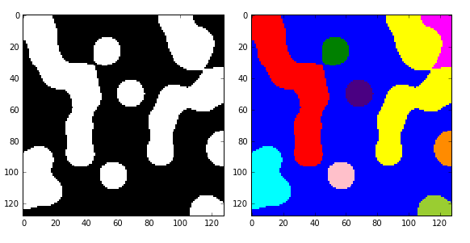

# Python学习记录

## H5py

**简介**
使用h5py库读写超过内存的大数据. 读写超过内存的大数据时, 有别于简单数据的读写操作, 受限于内存大小, 通常需要指定位置, 指定区域读写操作. h5py库刚好可以实现这一功能.

h5py的优势: 速度快, 压缩效率高. h5py文件是存放两类对象的容器, 数据集(dataset) 和组 (group), dataset类似数组类的数据集合, 和numpy的数据差不多. group是像文件夹一样的容器, 它好比python中的字典, 有建(key)和值(value). group中可以存放dataset或其他的group. “键”就是组成员的名称, “值”就是组成员对象本身.

读取h5py文件:

```python
import h5py
f = h5py.File("mytestfile.hdf5", 'r')
```

这个File对象是你的起点, 那么这个文件中存储了什么?记住, h5py.File就像一个Python字典, 因此我们可以查看这些键值.

```python
list(f.keys())
['mydataset']
```

根据我们的观察, 这个文件中有一个dataset, 即mydataset. 让我们将这个dataset作为Dataset对象来检验

```python
dset=f['mydataset']
```

我们得到这个对象不是一个数组, 而是一个HDF5 dataset. 就像Numpy中的数据, datasets有形状(shape)和数据类型(data type)

```python
dset.shape
(100,)
dset.dtype
dtype("int32")
```

同时它们支持数组风格的切片操作

```python
dset[...]=np.arange(100)
dset[0]#0
dset[10]#10
dset[0:100:10]#array([ 0, 10, 20, 30, 40, 50, 60, 70, 80, 90])
```

**附录: 创建一个文件**
`mytestdata.hdf5`是如何创建的. 当FIle对象初始化后, 我们通过将模式(mode)设置为w来创建一个文件. 其他模式(mode)为a(用于读, 写, 新建)和r+(用于读, 写)

File对象有几个看上去挺有趣的方法. 其一为`create_dataset`, 就是通过给定形状和数据类型来创建一个dataset.

```python
>>> dset = f.create_dataset("mydataset", (100,), dtype='i')
```

File对象是上下文管理器, 因此, 下面的代码也可运行

```python
>>> import h5py
>>> import numpy as np
>>> with h5py.File("mytestfile.hdf5", "w") as f:
>>>     dset = f.create_dataset("mydataset", (100,), dtype='i')
```

**Groups和分层结构**
`HDF`是Hierarchical Data Format的缩写. 每个HDF5文件中的对象都有一个名字(name), 它们以类似POSIX风格的分层结构存放, 用`/`分隔符分隔

```python
>>> dset.name
u'/mydataset'
```

在这个系统中“文件夹”(folders)被命名为groups. 我们创建的File对象本身也是一个group, 在这种情形下是跟group (root group), 名字为/:

```python
>>> f.name
u'/'
```

创建一个子group(subgroup)可以通过一个巧妙的命令create_group来完成. 但是, 我们首先需要以读/写模式来打开文件

```python
>>> f = h5py.File('mydataset.hdf5', 'r+')
>>> grp = f.create_group("subgroup")
```

所有group对象, 如同FIle对象一样, 也有create_*方法

```python
>>>dset2 = grp.create_dataset("another_dataset",(50,),dtype="f")
>>>dset2.name
u'/subgroup/another_dataset'
```

注: 不需要创建所有的中间groups. 指定一个完整的路径同样可行

```python
dset3 = f.create_dataset("subgroup2/dataset_three",(10,),dtype="i")
dset3.name
#u'/subgroup2/dataset_three'
```

groups支持大部分的Python字典风格的接口. 可以使用条目获取(item-retrieval)的语法来获取这个文件中的对象

```python
>>>dataset_three = f["subgroup2/dataset_three"]
```

迭代一个group, 就会产生它的成员的名字:

```python
>>> for name in f:
...     print name
mydataset
subgroup
subgroup2
```

它也有`keys(), values(), items(), iter()`的方法, 以及`get()`方法

因为迭代一个group只会产生它的直属成员, 所以想要迭代一个完整的文件, 可以使用group的方法`visit(), visititems()`, 它们通过一个调用(callable)来实现.

```python
>>> def printname(name):
...     print name
>>> f.visit(printname)
mydataset
subgroup
subgroup/another_dataset
subgroup2
subgroup2/dataset_three
```

**属性**
HDF5的最好特征之一就是可以在描述的数据后存储元数据(metadata). 所有的groups和datasets都支持几个数据位的附属命名, 称为属性.

属性可以通过`attrs`这个代理对象来获取, 这会再一次执行字典接口.

```python
>>> dset.attrs['temperature'] = 99.5
>>> dset.attrs['temperature']
99.5
>>> 'temperature' in dset.attrs
True
```


## Pyvips

pyvips库并不是直接处理图片, 而是创建图片处理的管道(pipelines). 当管道建立后, 一次性的执行整个管道, 一次性将图片从源图像并行的流传到目的.

特点:

-   pyvips是并行的, 所以速度很快
-   pyvips并不是在内存中保存整个图像, 所以占用内存很小.
-   加载非常大的tiff图像, 缩放10%, 锐化, 保存, pyvips一般很快(3x), 内存占用少5x

**示例**
如, 记载JPG图像, green通道的每个像素值翻倍, 重新将图像保存

```python
import pyvips

image = pyvips.Image.new_from_file("test.jpg",access="sequential")
image *= [1,2,1]
mask = pyvips.Image.new_from_array([[-1,-1,-1],
                                   [-1,16,-1],
                                   [-1,-1,-1]
                                   ],scale=8)
image = image.conv(mask,precision="integer")
image.write_to_file("test_new.jpg")
```

`Image.new_from_file()` can load any image fil supported by libvips.


**pil-numpy-pyvips**

```python
import pyvips
from PIL import Image
import numpy as np

if len(sys.argv)!=3:
    print("usage: {0} input-filename output-filename".format(sys.argv[0]))
    sys.exit(-1)
    
#map vips formats to dtypes
format_to_dtype = {
    "uchar": np.uint8,
    "char": np.int8,
    "ushort": np.uint16,
    "short":np.int16,
    "uint": np.uint32,
    "int": np.int32,
    "float": np.float32,
    "double": np.float64,
    "complex": np.complex64,
    "dpcomplex": np.complex128,
}

#map np dtype to vips
dtype_to_format = {
    'uint8': 'uchar',
    'int8': 'char',
    'uint16': 'ushort',
    'int16': 'short',
    'uint32': 'uint',
    'int32': 'int',
    'float32': 'float',
    'float64': 'double',
    'complex64': 'complex',
    'complex128': 'dpcomplex',
}

# numpy array to vips image
def numpy2vips(a):
    height, width, bands = a.shape
    linear = a.reshape(width*height*bands)
    vi = pyvips.Image.new_from_memory(linear.data,width,height,bands,dtype_to_format[str(a.dtype)])
    return vi

# vips image to numpy as array
def vips2numpy(vi):
    return np.ndarray(buffer=vi.write_to_memory(),
                     dtype=format_to_dtype[vi.format],
                     shape=[vi.height,vi.width,vi.bands])
    
# load with PIL
start_pillow = time.time()
pillow_img = np.asarray(Image.open(sys.argv[1]))
print("Pillow Time: ", time.time()-start_pillow)
print("pil shape", pillow_img.shape)

#load with vips to a memeory array
start_vips = time.time()
img = pyvips.Image.new_from_file(sys.argv[1])
np_3d = vips2numpy(img)

print('Vips Time:', time.time() - start_vips)
print('vips shape', np_3d.shape)

# make a vips image from the numpy array
vi = numpy2vips(pillow_img)

#verify we have the same result
print('Average pil/vips difference:', (vi - img).avg())

# add write back to disc for checking
vi.write_to_file(sys.argv[2])
```


**orientation**

```python
import sys
import pyvips

a = pyvips.Image.new_from_file(sys.argv[1])

try:
    orientation = a.get("exif-ifd0-Orientation")
    a.set("orientation", int(orientation.split()[0]))
except Exception:
    a.set("orientation", 0)
    
a.write_to_file(sys.argv[2])
```


## [Memory Profiler](https://github.com/pythonprofilers/memory_profiler)

This package is no longer actively maintained.

**install**

```bash
pip install -U memory_profiler
```

Use `mprof` to generate a full memory usage report of your executable and to plot it.

```bash
mprof rum executable
mprof plot
```

**Line by line memory usage**
The line-by-line memory usage mode is much in the same way o fthe line_profiler: first decorate the function you would like to profile with `@profile` and then run the script with a special script.

```python
@profile
def my_func():
    a = [1]*(10**6)
    b = [2]*(2*10**7)
    del b
    return a

if __name__=="__main__":
    my_func()
```

```sh
python -m memory_profiler example.py
```

Output will follow:

```
Line #    Mem usage    Increment  Occurrences   Line Contents
============================================================
     3   38.816 MiB   38.816 MiB           1   @profile
     4                                         def my_func():
     5   46.492 MiB    7.676 MiB           1       a = [1] * (10 ** 6)
     6  199.117 MiB  152.625 MiB           1       b = [2] * (2 * 10 ** 7)
     7   46.629 MiB -152.488 MiB           1       del b
     8   46.629 MiB    0.000 MiB           1       return a
```

The first colum represents the line number of the code that has been profiled, the second column (Mem usage) the memory usage of th python interpreter after that line has been executed. The third colum (increment) represents the difference in memory of the current line with respect ot the last one. The last column (Line contents) prints the code that has been profiled.

**Decorator**
A function decorator is also available. Use as follows:

```python
from memory_profiler import profile

@profile
def my_func():
    a = [1]*(10**6)
    b = [2]*(2*10**7)
    del b
    return a

if __name__=="__main__":
    my_func()    
```

If a python script with decorator `@profile` is called using `-m memory_profiler` in the command line, the `precision` parameter is ignored.

**Time-based memory usage**

Sometimes it is useful to have full memory usage reports as a function of time (not line-by-line) of external process (be it Python scripts or not). In this case the executable `mprof` might be useful.

```bash
mprof run <executable>
mprof plot
```

The first line run the executable and record memory usage along time, in a file written in the current directory. Once it’s done, a graph plot can be obtained using the second lien. The recorded file contains a timestamps, that allows for several profiles to be kept at the same time.

In the case of a Python srcipt, using the previous command does not give you any information on which function is executed at a given time. Depending on the case, it can be difficult to identify the part of the code that is causing the hightest memory usage.

```bash
mprof run --python python <script>
```


## Numpy

### histogram

`np.histogram()`是一个生成直方图的函数

`histogram(a,bins=10,range=None,weights=None,density=False)`

>   `a`: 待统计数据的数组
>
>   `bins`: 指定统计的区间个数
>
>   `range`: 是一个长度为2的元组, 表示统计范围的最小值和最大值, 默认None, 表示范围由数据的范围决定
>
>   `weights`: 为数组的每个元素指定的权值, `histogram()`会对区间中数组所对应的权值进行求和.
>
>   `density`: 为True时, 返回每个区间的概率密度; 为False, 返回每个区间中元素的个数.

```python
a = np.random.rand(100)
hist,bins = np.histogram(a,bins=5,range=(0,1))
print(hist)
print(bins)
```

```python
[19 30 15 16 20]
[ 0.   0.2  0.4  0.6  0.8  1. ]
```


## 将Unicode文本标准化

如下例子所示:

```bash
>>> s1 = 'Spicy Jalape\u00f1o'
>>> s2 = 'Spicy Jalapen\u0303o'
>>> s1
'Spicy Jalapeño'
>>> s2
'Spicy Jalapeño'
>>> s1 == s2
False
>>> len(s1)
14
>>> len(s2)
15
>>>
```

这里的文本”Spicy Jalapeño”使用了两种形式来表示。 第一种使用整体字符”ñ”(U+00F1)，第二种使用拉丁字母”n”后面跟一个”~”的组合字符(U+0303)。

在需要比较字符串的程序中使用字符的多种表示会产生问题. 为修正该问题, 可使用unicodedata模块将文本将那些标准化

```python
>>> import unicodedata
>>> t1 = unicodedata.normalize('NFC', s1)
>>> t2 = unicodedata.normalize('NFC', s2)
>>> t1 == t2
True
>>> print(ascii(t1))
'Spicy Jalape\xf1o'
>>> t3 = unicodedata.normalize('NFD', s1)
>>> t4 = unicodedata.normalize('NFD', s2)
>>> t3 == t4
True
>>> print(ascii(t3))
'Spicy Jalapen\u0303o'
>>>
```

`normalize()`第一个参数指定字符串标准化的方式. NFC表示字符应该是整体组成(比如可能的化就使用单一编码), 而NFD表示字符应该分解为多个组合表示.

在清理和过滤文本的时候字符的标准化也是很重要的. 比如, 清除掉一些文本上面的变音符.

```python
t1 = unicodedata.normalize("NFD",s1)
"".join(c for c in t1 if not unicodedata.combining(c))
```

`combining()`函数可以测试一个字符是否为和音字符, 在这个模块中还有其他函数用于查找字符类别, 测试是否为数字字符等.

## imdecode

`cv2.imdecode()`: 函数从指定的内存缓存中读取数据, 并把数据转换(解码)成图像格式, 主要用于从网络传输数据中恢复出图像

`cv2.imencode()`: 函数是将图片格式转换(编码)成流数据, 赋值到内存缓存中, 主要用于图像数据格式的压缩, 方便网络传输.


## AICSImageIO

Image Reading, metadata Conversion, and image Writing for Microscopy Image in Pure Python

**Feature**

-   supports reading metadata and imaging data for:
    -   `OME-TIFF`
    -   `TIFF`
    -   `ND2`
    -   `DV`
    -   `CZI`
    -   `LIF`
    -   `PNG, GIF`

**Quickstart**

```python
from aicsimageio import AICSImage

# Get an AICSImage object
img = AICSImage("my_file.tiff")  # selects the first scene found
img.data  # returns 5D TCZYX numpy array
img.xarray_data  # returns 5D TCZYX xarray data array backed by numpy
img.dims  # returns a Dimensions object
img.dims.order  # returns string "TCZYX"
img.dims.X  # returns size of X dimension
img.shape  # returns tuple of dimension sizes in TCZYX order
img.get_image_data("CZYX", T=0)  # returns 4D CZYX numpy array

# Get the id of the current operating scene
img.current_scene

# Get a list valid scene ids
img.scenes

# Change scene using name
img.set_scene("Image:1")
# Or by scene index
img.set_scene(1)
```

##  yacs

A simple experiment configuration system for research

yacs 是作为轻量级库创建的, 用于定义和管理系统配置. 

```python
from yacs.config import CfgNode as CN

_C = CN()
_C.SYSTEM = CN()
#Number of GPUs to use in the experimet
_C.SYSTEM.NUM_GPUS =8
#....

def get_cfg_defaults():
    """get a yacs CfgNode object with default values for my_project"""
    return _C.clo
```


## np.multiply()

由于multiply是ufunc函数, 会对这两个数组的对应元素进行计算, 因此, 他要求这两个数组有相同的大小(shape相同)

1.   相同的话, 则是计算点乘
2.   shape不同, 则会将小规格的矩阵延展成与另一矩阵一样大小, 再求两者内积

## CV2

### 图像增强

#### equalizeHist()

`cv2.equalizeHist(image)`: 表示进行直方图均衡化

```python
import cv2
import numpy as np
import matplotlib.pyplot as plt
#1. 读入图片
image = cv2.imread('img.jpg',0)
#2. 使用cv2.equalizeHist实现像素点的均衡化
ret = cv2.equalizeHist(img)
#3. 使用plt.hist绘制直方图
plt.subplot(121)
plt.hist(image.ravel())
plt.subplot(122)
plt.hist(ret.ravel(),256)
plt.show()
#使用cv2.imshow()绘制均衡化的图像
cv2.imshow('ret',np.hstack((img,ret)))
cv2.waitKey(0)
```


这种全局的均衡化也会存在一些问题, 由于整体亮度提升, 也会使得局部图像的细节变得模糊, 因为我们需要进行分块的局部均衡操作

#### createCLAHA(clipLimit,titleGridSize)

用于生成自适应均衡化图像

>   `clipLimit`: 颜色对比度的阈值; 此值与对比度受限相对应, 对比度限制这个参数时用每块的直方图的每个bins的数和整图的平均灰度分布数的比值来限制. 裁剪则是将每块图像中超过ClipLimit的bins多出的灰度像素去除超出部分, 然后将所有bins超出的像素累加后平均分配到所有bins. 
>
>   `titleGridSize`: 进行像素均衡化的网格大小, 即在多少网格下进行直方图的均衡化操作

```python
# 使用自适应直方图均衡化
# 第一步：实例化自适应直方图均衡化函数
clahe = cv2.createCLAHE(clipLimit=2.0,
                        tileGridSize=(8, 8))

# 第二步：进行自适应直方图均衡化
clahe = clahe.apply(img)

# 第三步：进行图像的展示
cv2.imshow('imgs', np.hstack((img, ret, clahe)))
cv2.waitKey(0) 
cv2.destroyAllWindows()
```

#### 自适应直方图增强

Contrast Limited Adaptive Histogram Equalizationi(CLAHE)是一种非常经典的直方图均衡算法.

CLAHE算法的主要作用在于增强图像的对比度同时能够抑制噪声, 典型的效果如下图所示.


**直方图**

在分析图像数据的统计特性时, 有时可以抛弃图像的色度分量, 只考察图像的亮度分量, 此时可以引入图像的亮度直方图(Luminance Histogram), 若8位精度图像为例, 直方图的X轴为0~255, 共255个桶, y轴表示每个桶由多少个像素. 所以有桶中盛纳的像素加到一起等于图像的总像素.

在分析画面的亮暗特征, 人们经常把亮度区间定性地划分成暗调, 阴调, 中调, 亮调, 高光等. 各区域的边界则可以根据应用特点灵活掌握.

’

当需要分析图像的颜色特性, 可以引入通道直方图(Channel Histogram), 分别对R/G/B三个颜色通道进行直方图统计


**对比度Contrast**

图像对比度指的是一副图像中最亮的白和最暗的黑之间灰度反差的大小. 差异越大, 代表对比越大. 一种常用的定量度量方法是Michelson对比度
$$
C_M=\frac{I_{max}-I_{min}}{I_{max}+I_{min}}
$$
当一副图像最白和最黑像素灰度都是128时, 图像对比度最低, C=0

当一副图像最白像素灰度=255, 最黑像素灰度=0时, 图像对比度最高, C=1.0

当一幅图像最白和最黑像素灰度都在128附近浮动时, 图像的直方图集中在中间的介个桶, 图像看起来灰蒙蒙, 相反, 若图像中黑白像素的跨度较大, 则图像富有通透感.

**对比度拉伸(Contrast streatching**

明确图像不通透的原因, 可通过数学方法将一个低对比度图像处理更通透些. 一类简单的方法为对比度拉伸(Contrast stretching)


**对比度拉伸的局限**

对比度拉伸适合处理低动态(LDR)图像, 这类图像的特点时对比度低, 直方图的跨度较小, 存在向两极拉伸的空间. 对于高动态(HDR)图像, 直方图跨度已经很大, 对比度拉伸没有操作的空间.如下图所示


**直方图均衡化Histogram Equalization**

直方图均衡化被认为是提升图像对比度最为有效的方法, 其进本思想是用数学方法重写调整像素的亮度分布, 使调整后的直方图具有最大的动态范围, 每个桶(bin/buket)盛纳的像素数量几乎相等.

数学语言描述: 假设均衡前直方图的像素密度为p(x), 每个桶的宽度为dx, 则每个桶的像素数量为p(x)d(x). 假设均很后像素密度函数为p(y), 且p(y)为常数.

直方图均衡的方法是$d_y=p(x)dx$, 是将源直方图dx宽度所盛纳的p(x)dx个像素映射到目标直方图的dy宽度中, 映射前后像素数量不变, 密度发生变化.


**直方图均衡的局限**

朴素的直方图均衡算法对整幅图像的像素使用相同的变换, 当图像像素值分布比较不均衡时, 效果较好. 但图像中出现明显的暗区或亮区, 则这些处理区域效果会不太理想.

直方图均衡算法一种常见问题会放大暗区的噪声. 如果一个区域的像素分布大体是均匀的但是带有一些噪声, 则HE变化函数会把一个很窄的x值分布映射到整个y值空间, 这就是HE会放大噪声的原因.

**自适应直方图均衡(Adaptive Histogram Equalization)**

参考人类视觉的局部性原理, 提出自适应直方图均很算法, 基本思想是将图像分成若干区域(tile), 如8*8=64个tile, 直方图均衡的基本单位不再是整个图像, 而是对每个小区域直方图均衡. AHW更适合用来改善图像局部对比度, 以及增强图像边缘信息, 但是并没有解决直方图均很会放大图像噪声的问题.

**Contrast Limted HE**

CLHE是加入对比度限制, 其原理为设置直方图的阈值, 将超过该阈值的分布“均匀”分散至概率密度分布上, 由此来限制转换函数(累积直方图)的增幅, 这样直方图就不会出现概率密度函数过大的区域,, 从而避免了某些集中区域被拉得过于系数.


## cv2.SIFT()

```python
import cv2
sift = cv2.SIFT_create()
kps, des = sift.detectAndCompute(img, None)
```

-   参数

    `nfeatures`: 特征点数目(算法对检测出的特征点排名)

    `nOctaveLayers`: 金字塔中每组的层数

    `contrastThreshold`: 过滤掉较差的特征点的对阈值. (constrastThreshold越大, 返回的特征点越少)

    `edgeThreshold`: 过滤掉边缘效应. (edgeThreshold越大, 特征点越多)

    `sigma`: 金字塔第0层图像高斯滤波系数.

根据SIFT的四个参数的作用范围, 本文先讲述一下5个部分: 高斯金字塔, 高斯模糊, 高斯差分金字塔(DOG算子), 空间极值点检测, 消除极值点的边缘响应.

## cv2.BFMatcher()

Brute-Force匹配非常简单, 首先在第一幅图像中选取一个关键点, 然后依次与第二幅图像的每个关键点进行(描述)距离测试, 最后返回距离最近的关键点.

对于BF匹配器, 首先我们必须使用cv2.BFMatcher():

1.   `normType`: 它指定使用的距离测量, 默认情况下是`cv2.NORMAL_L2`, 其适用于SIFT, SURF等. 对于基于二进制字符串的描述符, 如ORB, BRIEF, BRISK等, 应使用`cv2.NORM_HAMMING`, 使用汉明距离作为度量, 如果ORB使用WTA_K==3 or 4, 则应使用`cv2.NORM_HAMMING2`

2.   `cossCheck`: 默认值为False. 如果设置为True, 匹配条件就更加严格, 只有到A中的第i个特征点与B中的第j个特征点距离最近, 并且B中的第j个特征点到A中的第i个特征点也最近时才会赴安徽最佳匹配. 

两个重要的方法是`BFMatcher.match(), BFMatcher.knnMatch()`, 第一个返回最佳匹配, 第二种方法返回k个最佳匹配, 其中k由用户指定.

使用

## cv2.getStrcuturingElement

形态学处理, 如腐蚀, 膨胀, 开运算, 闭运算.

形态学操作时根据图像形状进行的简单操作, 一般情况下对二值图进行操作.

`cv2.getStructuringElement(cv2.MORPH_CROSS,(5,5))`

得到5x5的十字形结构


```python
>>> import cv2
>>> element = cv2.getStructuringElement(cv2.MORPH_CROSS,(5,5))
>>> element
array([[0, 0, 1, 0, 0],
       [0, 0, 1, 0, 0],
       [1, 1, 1, 1, 1],
       [0, 0, 1, 0, 0],
       [0, 0, 1, 0, 0]], dtype=uint8)
```

下面展示的是十字型的结构

```python
>>> cv2.getStructuringElement(cv2.MORPH_RECT,(5,5))
array([[1, 1, 1, 1, 1],
       [1, 1, 1, 1, 1],
       [1, 1, 1, 1, 1],
       [1, 1, 1, 1, 1],
       [1, 1, 1, 1, 1]], dtype=uint8)
```

如何理解 结构化元素 或者 核 在形态学处理时的作用, 其原理是怎样?

1.   首先明确, 能够做形态学操作的图像必须是二值化的
2.   定义一个核, 这个核就成为结构化元素; 它的定义也只有0, 1.
3.   让这个核从图像的左上角开始滑动, 滑完整个图片.

计算过程如下:

1.   如果与核对应的原图像的所有像素值都是1, 那么中心元素就保持原来的像素值, 否则就变为0(异或运算)

## cv2.floodFill

通过边缘检测得到的物体边沿结果, 而我们的目标是将图片中类似椭圆区域分割出来. 这里可以使用漫水法填充, 函数`cv2.floodFill()`

| 原图                                         | 结果                                               |
| -------------------------------------------- | -------------------------------------------------- |
|  |  |

## cv2.bitwise_not()

`cv2.bitwise_not(src,dst=None,mask=None)`

bitwise_not的作用是取反操作

```python
import cv2
import numpy as np
 
img = cv2.imread("pic.jpg")
image = cv2.bitwise_not(src=img)
cv2.imshow("mask", image)
cv2.waitKey()
cv2.destroyAllWindows()
```


## cv2.copyMakeBorder()

如果想给图片设置边界框, 就像一个相框一样的东西. 可使用`cv2.copyMakeBorder()`函数.

`cv2.copyMake(src, top,bottom,left,right,borderType,value)` 

填充（扩边）图像，在卷积运算或0填充时被用到

-   src:源图像。
-   top:顶部方向上的像素数的边框宽度。
-   bottom:底部方向上的像素数的边框宽度。
-   left:左侧像素的边界宽度。
-   right:沿正确方向的像素数的边框宽度。
-   borderType:边界类型。
-   value:一个可选参数。

## albumentations

Python的图像处理库, 可用于深度学习中网络训练时的图片数据增强

Albumentations图像数据增强特点:

-   基于高度优化的OpenCV库实现图像快速数据增强
-   针对不同图像任务, 如分割, 检测等.


## pyhon 高级形态学处理

**凸包**
凸包是指一个凸多边形, 这个凸多边形将图片中所有的白色像素都包含在内.

`skimage.morphology.conex_hull_image(img)`

输入为二值图像, 输出一个逻辑二值图. 在凸包内的点为True, 否则为False.

```python
import matplotlib.pyplot as plt
from skimage import data,color,morphology

#生成二值测试图像
img=color.rgb2gray(data.horse())
img=(img<0.5)*1

chull = morphology.convex_hull_image(img)

#绘制轮廓
fig, axes = plt.subplots(1,2,figsize=(8,8))
ax0, ax1= axes.ravel()
ax0.imshow(img,plt.cm.gray)
ax0.set_title('original image')

ax1.imshow(chull,plt.cm.gray)
ax1.set_title('convex_hull image')
```


`convex_hull_image()`是将图片中的所有目标看作一个整体, 因此计算出来只有一个最小凸多边形. 如果图中有多个目标物体, 每一个物体需要计算一个最小凸多边形, 则需要使用`convex_hull_object()`: `skimage.morphology.convex_hull_object(image,neighbors=8)` ; 输入参数image是一个二值图像, neighbors表示采用4连通还是8连通.

```python
import matplotlib.pyplot as plt
from skimage import data,color,morphology,feature

#生成二值测试图像
img=color.rgb2gray(data.coins())
#检测canny边缘,得到二值图片
edgs=feature.canny(img, sigma=3, low_threshold=10, high_threshold=50) 

chull = morphology.convex_hull_object(edgs)

#绘制轮廓
fig, axes = plt.subplots(1,2,figsize=(8,8))
ax0, ax1= axes.ravel()
ax0.imshow(edgs,plt.cm.gray)
ax0.set_title('many objects')
ax1.imshow(chull,plt.cm.gray)
ax1.set_title('convex_hull image')
plt.show()
```


2.   连通区域标记

在二值图像中, 如果两个像素点相邻且值相同(同为0或同为1), 那么就认为这两个像素点在一个相互连通的区域内. 而同一个连通区域的所有像素点, 都用同一个像素值来进行标记, 这个过程就叫连通区域标记.下图分别表示4连通和8连通


`skimage.measure.label(image,connectivity=None)`

参数中的image表示需要处理的二值图像, connectivity表示连接的模式. 输出一个标记数组(labels), 从0开始

```python
import numpy as np
import scipy.ndimage as ndi
from skimage import measure,color
import matplotlib.pyplot as plt

#编写一个函数来生成原始二值图像
def microstructure(l=256):
    n = 5
    x, y = np.ogrid[0:l, 0:l]  #生成网络
    mask = np.zeros((l, l))
    generator = np.random.RandomState(1)  #随机数种子
    points = l * generator.rand(2, n**2)
    mask[(points[0]).astype(np.int), (points[1]).astype(np.int)] = 1
    mask = ndi.gaussian_filter(mask, sigma=l/(4.*n)) #高斯滤波
    return mask > mask.mean()

data = microstructure(l=128)*1 #生成测试图片

labels=measure.label(data,connectivity=2)  #8连通区域标记
dst=color.label2rgb(labels)  #根据不同的标记显示不同的颜色
print('regions number:',labels.max()+1)  #显示连通区域块数(从0开始标记)

fig, (ax1, ax2) = plt.subplots(1, 2, figsize=(8, 4))
ax1.imshow(data, plt.cm.gray, interpolation='nearest')
ax1.axis('off')
ax2.imshow(dst,interpolation='nearest')
ax2.axis('off')

fig.tight_layout()
plt.show()
```

在代码中, 有些地方乘以1, 则可将bool数组快速地转换为int数组

结果如图: 有10个连通区域, 标记为0-9



如果想分别对每一个连通区域进行操作, 比如计算面积,, 外接矩形, 凸包面积, 则需调用measure子模块的`regionprops(label_image)`

返回所有连通区块的属性列表, 常用的属性列表如下:

| 属性名称            | 类型    | 描述                                             |
| ------------------- | ------- | ------------------------------------------------ |
| area                | int     | 区域内像素点总数                                 |
| bbox                | tuple   | `边界外接框(min_row, min_col, max_row, max_col)` |
| centroid            | array   | 质心坐标                                         |
| convex_area         | int     | 凸包内像素点总数                                 |
| convex_image        | ndarray | 和边界外接框同大小的凸包                         |
| coords              | ndarray | 区域内像素点坐标                                 |
| Eccentricity        | float   | 离心率                                           |
| equivalent_diameter | float   | 和区域面积相同的圆的直径                         |
| euler_number        | int     | 区域欧拉数                                       |
| extent              | float   | 区域面积和边界外接框面积的比率                   |
| filled_area         | int     | 区域和外接框之间填充的像素点总数                 |
| perimeter           | float   | 区域周长                                         |
| label               | int     | 区域标记                                         |

## pycocotools安装失败


**解决方案**
到visual studio官网下载visual studio installer


打开后, 如果没有visual studio就可以看到workloads


在workloads勾选在c++生成工具


最后点击“安装”等待完成

安装完成后需要重新启动

最后再执行下载命令就可以安装成功了

`pip install pycocotools -i https://pypi.tuna.tsinghua.edu.cn/simple`

## OpenCV 特征提取之BFMatcher匹配

Brute Force匹配是opencv二维特征点匹配常见的方法。

**原理**

-   从两幅图片分别提取出来N，M个特征向量
-   然后对N和M的特征向量进行匹配，找到最佳匹配
-   然后再画出匹配的特征向量

**match返回值解释**

```python
bf = cv.BFMatcher_create()
matches = bf.match(des1, des2)
for matche in matches:
    print(matche)

#output
<DMatch 0x7fcf509b90b0>
<DMatch 0x7fcf509b90d0>
<DMatch 0x7fcf509b90f0>
<DMatch 0x7fcf509b9110>
```

这个DMatch包含三个非常重要的数据，分别是queryidx，trainidx，distance。

1.   queryidx: 测试图像的特征点描述符的下标（第几个特征点描述符），同时也是描述对应特征点的下标
2.   trainidx：训练样本图像的特征点描述符下标，同时也是描述符对应特征点的下标
3.   distance：代表着最佳匹配特征点描述符的欧式距离，竖直越小，也就说明两个特征点越相近。

## glog

python日志记录库--glog, 其对logging日志模块进行封装.

**简介**

-   glog所记录的日志总是记录到标准的stderr中,即控制台终端
-   每一行日志总会添加一个谷歌风格的前缀

​	***\*E0924 22:19:15.123456 19552 filename.py:87]\**** some message


## The function is not implemented. Rebuild the library with Windows, GTK+ 2.x or Cocoa support

实际情况是Pycharm的库里最新的[OpenCV](https://so.csdn.net/so/search?q=OpenCV&spm=1001.2101.3001.7020)版本是3.4.2，在cv2.imshow和cv2.waitkey指令都会出现上述错误。

**解决方法**

安装opencv-contrib-python包

```python
pip install opencv-contrib-python
```


## setattr()

setattr()函数对应`getattr()`, 用于设置属性值, 该属性不一定是存在的.

## np.bincount()

`numpy.bincount(x,/,weights=None,minlength=0)`

Count number of occurrences of each value in array of non-negative ints.

The number of bins (of size 1) is one larger than the largest value in x. if minlength is specified, there will be at least this number of bins in the output array (though it will be loger if necessary, depending on the contents of x). Each bin gives the number of occurences of its index value in x. If weights is specified the input array is weighted by it, i.e if a value `n` is found at position$ i, out[n]+=weights[i]$ inseated of $out[n]+=1$​

**`Parameters`**:

- ` x`, array_like, 1 dimension, nonnegative ints input array.

- `weights`: array_like, optional: weights, array of the same shape x.
- `minlength,int, optional`: A minimum number of bins for the output array.

**`Returns`**

- `out; ndarray of ints`: The result of binning the input array. The length of out is equal to `np.amax(x)+1`

## subprocess

`subprocess`模块运行我们启动一个新进程, 并连接到它们的输入/输出管道,从而获取返回值

### 使用subprocess模块

`subprocess`模块首先推荐使用的是它的run方法

```python
subprocess.run(args, *, stdin=None, input=None, stdou=None, stderr=None, capture_output=False, shell=False, cwd=None, timeout=None, check=False,encoding=None,errors=None, text=None, env=Nonve, universal_newlines=None)
```

- `args`: 要执行的命令. 必须是字符串, 字符串参数列表
- `stdin,stdout, stderr`: 子进程的标注输入,输出和错误

```python
subprocess.run(["ls","-l","/dev/null"])
```

### check_output

可执行一条shell命令, 并返回命令的输出内容

```python
output = subprocess.check_output(["python3","xy.py"],shell=False)
```

该函数两个参数, 第一个表示命令内容, 因为中间有空格,所以勇中括号这种形式, 同时指定`shell=False`, 表示命令分开写了. 而该命令执行后的输出内容会返回给output.

要对输出使用`string`的操作, 需要先通过解码将其转化成`string`

```python
output = subprocess.check_output(["python3", "xx.py"], shell = False)
out = output.decode()#j
if (out.find("yes") >= 0): print("yes")
else: print("no")
```


## socket

```python
import socket
socket.create_connection("1.1.1.1",53)#表示ip地址与端口号
```

该函数为连接到一个TCP服务, 该服务正在侦听Internet address. 然后返回一个套接字对象

## Path

`Path.resolve()`方法会把一个路径和路径片段的序列解析为绝对路径.

```python
path = Path(__file__)
path.suffix #文件后缀
path.stem #文件名不带后缀
path.name #带后缀的完整文件名
path.parent #路径的上级目录
```


## yaml

YAML语法可以简单表达清单, 散列表, 标量等数据形态. 它使用空白符号缩进和大量依赖外观的特征, 特别适合勇YAML的配置文件后缀`.yml`

**基本语法**

- 大小写敏感
- 使用缩进表示层级关系
- 缩进不允许使用tab, 只允许空格
- 缩进的空格数不重要, 只要相同层级的元素左对齐即可.
- #表示注释

**数据类型**

- 对象: 键值对的集合, 又称为映射
- 数值: 一组按次序排列的值, 又称为序列, 列表

**YAML对象**

对象键值对使用冒号结构表示`key:value`, 冒号后要加一个空格

可以使用缩进表示层级关系

```yaml
key: 
	child-key: value
	child-key2: value2
```

**YAML数组**

以`-`开头的行表示构成一个数组

```yaml
- A
- B
- C
# YAML支持多维数组,可以使用行内表示
- 
 - A
 - B
 - C
```

**复合结构**

数组和对象可以构成复合结构

```yaml
languages:
	- Ruby
	- Perl
	- Python
websites:
	- YAML: yaml.org
	- Ruby: ruby-lang.org
```

**例子**

```yaml
boolean: 
    - TRUE  #true,True都可以
    - FALSE  #false，False都可以
float:
    - 3.14
    - 6.8523015e+5  #可以使用科学计数法
int:
    - 123
    - 0b1010_0111_0100_1010_1110    #二进制表示
null:
    nodeName: 'node'
    parent: ~  #使用~表示null
string:
    - 哈哈
    - 'Hello world'  #可以使用双引号或者单引号包裹特殊字符
    - newline
      newline2    #字符串可以拆成多行，每一行会被转化成一个空格
date:
    - 2018-02-17    #日期必须使用ISO 8601格式，即yyyy-MM-dd
datetime: 
    -  2018-02-17T15:02:31+08:00    #时间使用ISO 8601格式，时间和日期之间使用T连接，最后使用+代表时区
```


## Pool

python中, `multiprocessing`库中的`Pool`类代表进程池, 其对象有`imap()`和`imap_unordered()`方法

两者都用于对大量数据遍历多进程计算, 返回一个迭代器`multiprocessing.pool.IMapIterator`

`imap`返回结果顺序和输入相同, `imap_unordered`则为不保证顺序

1. `iter=pool.imap(fn,data)`: 一旦生成, 无论是不是用iter, 多进程计算都会开始. 计算结果会缓存在内存中, 所以要注意内存用尽的问题.
2. `Pool`使用完毕后必须关闭, 否则进程不会退出

```python
with Pool() as pool:
    iter = pool.imap(func, iter)
    for ret in iter:
        # do something
```


## shutil

它是作为os模块的补充, 提供了复制, 移动, 删除, 压缩, 解压等操作. `shutil`模块对压缩包的处理是调用`ZipFile, TarFile`


## hashlib

hash是一种算法, 该算法接受传入的内容, 经过运算得到一串hash值

其有三个特点

1. 只要传入的内容一样, 得到的hash值必然一样
2. 不能由hash值反解成内容
3. 只要使用hash算法不变,无论校验内容有多大, 得到的hash值长度是固定的

## pkg_resoureces

该函数返回对应包所需的所有依赖, 当未安装该模块, 或者该模块要求的版本不对时, 则会报错.

`pkg_resources.parse_requirements(file)`

该函数可以解析file中的每一条要求, 每一行转换为pkg_resources. 

通常的处理形式为调用每一行对应的name和specifier属性. 前者代表需要包的名称, 后者代表版本.

```python
from pathlib import Path
import pkg_resources #此为管理安装包信息相关模块

file='/userhome/yolov5-t/requirements.txt'

for x in pkg_resources.parse_requirements(Path(file).open()):
    print(x.name)
    print(x.specifier)

```


## 图片元信息Exif

Exif 是一种图像文件格式, 实际上Exif格式就是在JPEG格式头部插入了数码照片的信息, 包括拍摄时的光圈, 快门, 白平衡, ISO, 焦距, 日期时间等各种和拍摄条件以及相机品牌, 信号, 色彩编码, 拍摄时录制的声音以及GPS全球定位系统数据, 缩略图等. 

- 基本信息

  | 名称           | name                    | 类型         | 支持类型                                                     |
  | -------------- | ----------------------- | ------------ | ------------------------------------------------------------ |
  | 可执行交换文件 | Exchangeable Image File | 图像文件格式 | JJPG, TIFF, PNG, JP2, PGF, MIFF, HDP, PSP和XCF图像, 以及许多基于TIFF的RAW图像 |

- 常见标签

  所有JPEG文件以字符串"0xFFD8"开头, 并以字符串"0xFFD9"结束, 文件头中有一系列"0xFF??"格式的字符串, 称为"JPEG标识"或"JPEG段", 用来标记JPEG文件信息段. "0xFFD8"表示图像信息开始, "0xFFD9"表示图像信息结束, 这个两个表示后面没有信息, 而且其他标识紧跟一些信息字符.

## No module named 'pip'

可以首先执行` python -m ensurepip`然后执行 `python -m pip install --upgrade pip`  即可更新完毕

## ABC

abc.abstractmethod

有时，我们抽象出一个[基类](https://www.zhihu.com/search?q=基类&search_source=Entity&hybrid_search_source=Entity&hybrid_search_extra={"sourceType"%3A"article"%2C"sourceId"%3A72827378})，知道要有哪些方法，但只是抽象方法，并不实现功能，只能继承，而不能被实例化，但[子类](https://www.zhihu.com/search?q=子类&search_source=Entity&hybrid_search_source=Entity&hybrid_search_extra={"sourceType"%3A"article"%2C"sourceId"%3A72827378})必须要实现该方法，这就需要用到[抽象基类](https://www.zhihu.com/search?q=抽象基类&search_source=Entity&hybrid_search_source=Entity&hybrid_search_extra={"sourceType"%3A"article"%2C"sourceId"%3A72827378})，在很多时候用到的很多

```python
import abc
class Foo(abc.ABC):
    @abc.abstractmethod
    def fun(self):
        pass
a = Foo()
# 实例化报错
# TypeError: Can't instantiate abstract class Foo with abstract methods fun
下面子类继承该方法
class Sub_foo(Foo):
    def f(self):
        print('This is sub foo!')
c = Sub_foo()
# 子类并没有实现fun 方法，实例化子类sub_foo同样报错
# TypeError: Can't instantiate abstract class Sub_foo with abstract methods fun
我们在子类实现fun方法：
class Sub_foo(Foo):
    def fun(self):
        print("From sub_foo")
    def f(self):
        print('This is sub foo!')
c = Sub_foo()
c.fun()
c.f()
输出：
From sub_foo
This is sub foo!
```

但是注意，如果这时你实例化Foo,仍然是报错的，因为抽象基类只能继承而不能实例化，子类要实例化,必须先实现该方法。


## shutil模块

其作为os模块的补充, 提供了复制, 移动, 删除, 压缩, 解压等操作.


- 复制文件

> 函数: shutil.copy(src, dst)
>
> 参数: src表源文件, dst表目标文件夹
>
> 注意: 当移动到一个不存在的"目标文件夹", 系统会将这个不存在的"目标文件夹"识别为新的文件夹, 而不会报错.

```python
# 1.将a表的“data.txt”移动到b表
src = r"C:\Users\Desktop\publish\os模块\test_shutil_a\data.txt"
dst = r"C:\Users\Desktop\publish\os模块\test_shutil_b"

shutil.copy(src,dst)
------------------------------------------------------------
# 2.将a表的“data.txt”移动到b表，并重新命名为“new_data.txt”
src = r"C:\Users\Desktop\publish\os模块\test_shutil_a\data.txt"
dst = r"C:\Users\Desktop\publish\os模块\test_shutil_b\new_data.txt"

shutil.copy(src,dst)
------------------------------------------------------------
# 3.将a表的“data.txt”移动到“不存在”的文件夹
src = r"C:\Users\Desktop\publish\os模块\test_shutil_a\data.txt"
dst = r"C:\Users\Desktop\publish\os模块\test_shutil_c"

shutil.copy(src,dst)
"""
注意：对于情况3，系统会默认将“test_shutil_c”识别为文件名，而不是按照我们认为的，移动到一个新的不存在的文件夹。
"""
```


## python-获取当前工作路径

- sys.argv[0]

  ```python
  import sys
  print(sys.argv[0])#获得的是当前执行脚本的位置, 若在命令行执行该命令,则为空
  ```

  运行结果(在python脚本中执行的结果)

  ```python
  F:/SEG/myResearch/myProject_2/test.py
  ```

- os模块

  ```python
  import os
  print(os.getcwd())#获得当前工作目录
  print(os.path.abspath("."))#获得当前工作目录
  print(os.path.abspath(".."))#获得当前工作目录的父目录
  print(os.path.abspath(os.curdir))#获得当前工作目录的绝对路径
  ```

  注: argv[0]只是得到当前脚本的绝对位置, 而os模块中的几种获得路径的方法,得到的是当前的工作目录.

- os.walk()

  1. 输出在遍历的文件夹`当前目录`
  2. 输出在遍历的文件夹当前目录下的`所有文件夹名称`
  3. 输出在遍历的文件夹当前目录下的`所有非文件夹的名称`

  ```python
  import os
  def file_name(file_path):
      for root,dirs,files is os.walk(file_path):
          print(root,dirs,files)
  ```

  

## matplotlib

### 散点图, 用文字标注每个点

```python
x = [2,4,6,7,8,5,4,3]
y = [3,6,5,8,4,3,2,4]
txt = ['我','今','晚','上','吃','了','个','鲸']

import matplotlib.pyplot as plt
plt.rcParams['font.sans-serif']=['SimHei'] #用来正常显示中文标签
plt.scatter(x, y)
for i in range(len(x)):
    plt.annotate(txt[i], xy = (x[i], y[i]), xytext = (x[i]+0.1, y[i]+0.1)) # 这里xy是需要标记的坐标，xytext是对应的标签坐标
plt.show()

```


### plt.text()函数解析

```python
plt.text(x,
	y,
	string,
	fontsize=15,
	verticalalignment="top",
	horizontalalignment="right"
)
```

- 示例

```python
import matplotlib.pyplot as plt
import numpy as np


x = np.arange(0, 10, 1)
y = x ** 2
_, ax = plt.subplots(figsize=(9, 5))
plt.rcParams['font.sans-serif'] = ['Arial Unicode MS']
plt.plot(x, y)
plt.text(1, 1, s="文本在这里")
plt.show()
```


- plt清除

  ```python
  plt.clf()#清除当前figure的所有axes, 但是不关闭window, 所以能继续服用其他的plot.
  plt.cla()#清除axes, 即当前figure中的活动的axes, 但其他axes保持不变
  plt.close()#关闭窗口
  ```

  

## Register

扩展字典功能, 并提供函数注册功能

```python
def _register_generic(module_dict, module_name, module):
    assert module_name not in module_dict
    module_dict[module_name]=module

def Registry(dict):
    """
    a helper class for managing registering modules, it extends a dictionary and provides a register function.
    Eg. creating a registry:
    	some_registry = Registry("default": default_module)
   	
   	There're two ways of registering new modules:
   	1): normal way is jsut calling register function:
   		def foo():
   			...
   		some_registry.register("foo_module",foo)
   	2): used as decorator when declaring the module:
   		@some_registry: register("foo_module")
   		@some_registry.register("foo_model_nickname")
   		def foo():
   			...
   	Acess of module is just like using a dictionary, eg:
   		f = some_registry['foo_modeul']
    """
    def __init__(self,*args, **kwargs):
        super(Registry, self).__init__(*args, **kwargs)
    
    def register(self,module_name,module=None):
        #used as function call
        if module is not None:
            _register_generic(self,module_name,fn)
            return fn
        
        #used as decorator
        def register_fn(fn):
            _register_generic(self, module_name,fn)
            return fn
        
        retu
```


## logging

日志对象, 用`logging.getLogger(name)`方法进行初始化, name可以不填. 

```python
import logging
import sys

l_g = logging.getLogger(__name__)
l_g.setLevel(logging.ERROR)#日志等级为ERROR

s_h = logging.StreamHandler(sys.stderr)
l_
```


## opencv

### addWeighted()

将两张相同大小, 相同类型的图片 (叠加) 线性融合的函数

| 参数  | 描述                                                         |
| ----- | ------------------------------------------------------------ |
| src1  | 需要加权的第一个数组, 常为Mat                                |
| alpha | 第一个数组的权重                                             |
| src2  | 第二个数组, 需要和第一个数组拥有相同的尺寸和通道数           |
| beta  | 第二个数组的权重, 值为1-alpha                                |
| gamma | 一个加到权重总和上的标量值, 可以理解为加权和后的图像的偏移量 |


## os.environ

在`python`种通过`os.environ`可以获取有关系统的各种信息

`os.environ`是一个字典, 是环境变量的字典. `HOME`是这个字典里的一个键, 如果有这个键, 返回对应的值, 如果没有, 则返回none

```pyhthon
import os
os.environ.keys()
```


### 常见字段

```cmd
os.environ["HOMEPATH"]:当前用户主目录
os.environ['TEMP']:临时目录路径
os.environ['PATHEXT']:可执行文件
os.environ['SYSTEMROOT']:系统主目录
```

### 用法总结

```cmd
#1. 设置系统环境变量
os.environ['环境变量名称']='环境变量值'#其中key和value均为string类型
#2. 获取环变量
os.environ['环境变量名']
os.environ.get("环境变量名",'默认值')#环境变量不存在, z
```


## yacs

用以一个系统构建的config文件

```python
pip install yacs
from yacs.config import CfgNode as CN
```

### 语法

需创建`CN()`这个作为容器来装载我们的参数, 这个容器可以嵌套

```python
_C= CN()
_C.name = 'test'
_C.model = CN()#嵌套使用
_C.model.backbone = 'resnet'
_C.model.depth = 18
print(_C)
#_-------------------
name: test
	model:
        backbone: resnet
        depth: 18
```

- merge_from_file()

  对于不同的实验, 有不同的超参设置, 所以可以使用yaml文件管理不同的configs, 然后用`merge_from_file()`这个方法, 这个会比较每个experiments特有的config和默认参数的区别, 会将默认参数与特定参数不同的部分, 用特定参数覆盖.

  ```python
  _C.merge_from_file("./test_config.yaml")
  ```

  在需要merge的yaml文件中, 不能有default参数中不存在的参数, 不然会报错, 但可以笔default中设定的参数少

- merge_from_list()

  可用`list`来传递参数

  ```python
  opts = ['name','test_name','model.backbone','vgg']
  _C.merge_from_list(opts)
  ```

- freeze()

  freeze the configs, and you can not change the value after this operation

  ```python
  #freeze the config
  _C.freeze()
  #try to change the name's value, raise an error
  _C.name = 'test2'#error
  ```

  

## PIL

### Image

`np.unique(a)`

RGB和png保存格式不同, 一定要注意

- PIL.Image.Image具有convert属性, 可以将图像转为其他图像格式.

## 装饰器

### 闭包

了解装饰器, 需先了解闭包, 它是表示在函数中再嵌套一个函数, 并且会引用外部函数的变量.即外部的返回值是内部函数

```python
def outer(x):
    def inner(y):
        return x+y
    return inner
print(outer(6)(5))
#-----------
11
```

如代码所示, 在outer函数内, 又定义了一个inner()函数, 并且inner函数又引用了外部函数outer的变量x, 这就是一个闭包. 

在输出时, outer(6)(5), 第一个括号传进去的值返回inner(), 其实就是返回6+y, 所以再传第二个参数进去, 就可以得到返回值6+5.

### 装饰器

其实装饰器就是一个闭包, 装饰器是闭包的一种应用. python装饰器就是用于拓展原来函数功能的一种函数, 这个函数的特殊之处在于它的返回值也是一个函数, 使用python装饰器的好处就是不用更改原函数的代码前提下给函数增加新的功能. 使用时, 只需要在需要的函数前加上@demo即可.

```python
def debug(func):
    def wrapper():
        print("[DEBUG]: enter {}()".format(func.__name__))
        return func()
    return wrapper

@debug
def hello():
    print("hello")
hello()
```

### 类装饰器

实质使用了类方法中的call魔法方法来实现类的直接调用

```python
class logging(object):
    def __init__(self, func):
        self.func = func
    
    def __call__(self, *args, **kwargs):
        print("[DEBUG]: enter {}()".format(self.func.__name__))
        return self.func(*args, **kwargs)

@logging
def hello(a,b,c):
    print(a,b,c)
hello("hello","good","morning")
#----------------
[DEBUG]: enter hello()
hello good morning
```


## Logger

### sys.stdout

解决:　用python生成日志时，发现无论怎么flush(), 文件内容总是不能实现写入, 导致程序以外终端时一无所获.

- 原理

  open函数的buffering函数可以实现无缓冲写入

  ```python
  open(file, 'w', buffering=a)
  全缓冲: a时正整数, 当缓冲区文件大小达到a时, 写入磁盘
  行缓冲: buffering=1, 缓冲区碰到\n 换行符的时候写入磁盘
  无缓冲: buffering=0, 写多少, 存多少.
  ```

  ```python
  class Logger(object):
      def __init__(self, log_path="default.log"):
          import sys
          self.terminal = sys.stdout
          #buffering=64: 等到64个字母的时候写入文件.
          self.log = open(log_path, "w", buffering=1, encoding="utf-8")
  
      def write(self, message):
          # message = ",".join([str(it) for it in message])
          self.terminal.write(str(message) + "\n")
          self.log.write(str(message) + "\n")
  
      def flush(self):
          self.terminal.flush()
          self.log.flush()
  
      def close(self):
          self.log.close()
  ```

### 模块

| 函数名                 | 作用                                               |
| ---------------------- | -------------------------------------------------- |
| `getLogger(name=None)` | 获取对应名称的Logger, 如果不指定名称会返回根Logger |
| `debug/info等函数`     | 在根Logger上打印对应级别的日志信息                 |
| `disable(lvl)`         | 禁用某级别的日志打印                               |
| `basicConfig()`        | 可以快速设置日志的级别, 格式, Handler, Formatter等 |

### Handler

日志对象用于输出日志, 而Handler对象用于指定日志向哪里输出(文件, 终端等)

- `StreamHandler`: 用于向标准输入输出流等输出日志
- `FileHandler`: 用于向文件输出日志
- `NullHandler`: 什么也不输出
- `RotatingFileHandler`: 向文件输出日志, 如果文件到达指定大小, 创建新文件并继续输出日志

### 实例

```python
import logging

# 创建Logger
logger = logging.getLogger()
logger.setLevel(logging.DEBUG)

# 创建Handler

# 终端Handler
consoleHandler = logging.StreamHandler()
consoleHandler.setLevel(logging.DEBUG)

# 文件Handler
fileHandler = logging.FileHandler('log.log', mode='w', encoding='UTF-8')
fileHandler.setLevel(logging.NOTSET)

# Formatter
formatter = logging.Formatter('%(asctime)s - %(name)s - %(levelname)s - %(message)s')
consoleHandler.setFormatter(formatter)
fileHandler.setFormatter(formatter)

# 添加到Logger中
logger.addHandler(consoleHandler)
logger.addHandler(fileHandler)

# 打印日志
logger.debug('debug 信息')
logger.info('info 信息')
logger.warning('warn 信息')
logger.error('error 信息')
logger.critical('critical 信息')
logger.debug('%s 是自定义信息' % '这些东西')

```

运行结果

```python
2017-04-04 21:45:16,742 - root - DEBUG - debug 信息
2017-04-04 21:45:16,742 - root - INFO - info 信息
2017-04-04 21:45:16,742 - root - WARNING - warn 信息
2017-04-04 21:45:16,742 - root - ERROR - error 信息
2017-04-04 21:45:16,742 - root - CRITICAL - critical 信息
2017-04-04 21:45:16,742 - root - DEBUG - 这些东西 是自定义信息
```


## 魔法方法

`__str__`

- python中如果方法名时`__xxx__()`的, 那么就有特殊的功能, 因此较`魔法`方法
- 当使用`print`输出对象的时候,只要自己定义了`__str__(self)`方法, 那么就会从这个方法中return数据
- `__str__`方法需要返回一个字符串, 当做这个对象的描写

### 分类

| 魔法方法                        | 含意                                                         |
| ------------------------------- | ------------------------------------------------------------ |
| `__new__(cls,[,...])`           | 1. `__new__`是在一个对象实例化的时候所调用的第一个方法<br />2. 它的第一个参数这个类,其他的参数是用来直接传递给`__init__`方法<br />3. `__new__`决定是否要使用该`__init__`方法, 因为`__new__`可以调用其他类的构造方法或者直接放回别的实例对象来作为本类的实例. 如果`__new__`没有返回实例对象,则`__init__`不会被调用<br />4.`__new__`主要用于继承一个不可变的类型, 比如一个tuple或者string |
| `__init__()`                    | 构造器, 当一个实例被创建时, 调用的初始化方法                 |
| `__del__(self)`                 | 析构器, 当一个实例被销毁的时候调用的方法                     |
| `__call__(self)`                | 运行一个类的实例像函数一样被调用:`x(a,b)`调用`x.__call__(a,b)` |
| `__len__(self)`                 | 定义当被`len()`调用时的行为                                  |
| `__format__(self, format_spec)` | 当被`format()`调用时的行为                                   |

### 方法实例

如果在需要返回对象的魔法方法里面不知道如何返回, 可以调用`super`函数来执行父类的相同方法, 注意: 魔法方法必须要使用return进行返回

- `__repr__(self)`: 直接执行对象时, 执行的方法

  ```python
  class A():
      def __repr__(self):
          return("__repr__")
  a = ()
  a
  ```

- `__getattr__(self,name)`: 或一个存在的属性时执行的方法

- `__setattr__(self,name, value)`: 设置一个属性时执行的方法

- `__delattr__(self,name)`: 删除一个属性时执行的方法

- `__getattribute__(self, name)`:当该类的属性被访问时执行的方法


## format()

- 实例1

  ```python
  fmt = "{median:.4f} ({global_avg:.4f})".format( median=self.median,
                                                  avg=self.avg,
                                                  global_avg=self.global_avg,
                                                  max=self.max,
                                                  value=self.value)
  ```

  

## collections.defaultdict()

python中,通过Key访问字典, 当key不存在时, 会应发"keyError"异常, 为了避免这种情况的发生, 可以使用collections类中的`defaultdict()`方法为字典提供默认值.

defaultdict的作用是在于, 当字典里的key不存在,但被查找时, 返回的不是keyErro,而是一个默认值.

```python
dict = defaultdict(factory_function)
```

这个factory_function可以是list, set, str等, 当key不存在时, 返回的是工厂函数的默认值.

```python
from collections import defaultdict

dict1 = defaultdict(int)
dict2 = defaultdict(set)
dict3 = defaultdict(str)
dict4 = defaultdict(list)
dict1[2] ='two'

print(dict1[1])
print(dict2[1])
print(dict3[1])
print(dict4[1])
#-----------result--------------
0
set()

[]

```


## lxml.etree

- labelImg的VOC格式


若操作一个xml,首先要能读能写, 能将字符串或流读进来解析成ElementTree, 又能将ElementTree转为字符串或流.

- etree.fromstring(string)

  将string解析为Element或ElementTree

- etree.parse(file)

  将文件或file_like 对象解析为ElementTree, 因为`parse()`一般解析整篇文档, 字符串解析一般只解析片段. 其中file还可以是HTTP/ FT URL.

- etree.tostring(elt)

  将一个ElementTree转为string. 

增删改查

- 增: `append(), insert()`
- 删: `clear() remove()`
- 查: `find*() iter*() xpath()`
- 改: `set以及属性.tag, .attrib, .text, .tail`

Element属性介绍

- .tag: 元素名称

- .aatrib: 一个包含元素属性的字典, key是属性名, value是对应的值

- .text

  Element 的文本均为直接子文本, 不包含元素中的文本, 其中有包含.text, .tai. 

- .tail: 为Element的关闭标签之后的文本.

## visdom

visdom可视化, 用于创建, 组织和共享实时丰富数据的可视化. 支持torch和numpy

```python
安装： pip install visdom
启动：python -m visdom.server
访问: http://localhost:8097
```

- 命令行选项

  `port`: 运行服务器的端口

  `-env_path`: 重新加载序列化绘画的路径

  `-logging_level`: 记录级别.

- 简单示例

  ```python
  import visdom
  import numpy as np
  vis = visdom.Visdom()
  vis.text("hello, visdom")
  vis.image(np.ones((3,10,10)))
  ```

- API

  `visdom`提供了一下基本的可视化功能:

  1. `vis.image`: 图片
  2. `vis.images`: 图像列表
  3. `vis.text`: 任意的HTML
  4. `vis.video`: 视频
  5. `vis.svg`: SVG对象
  6. `vis.save`: 序列化状态服务器端
  7. `vis.close`: 通过ID关闭一个窗口
  8. `vis.win_exists`: 通过id检查一个窗口是否存在
  9. `vis.check_connection`: 检查服务器是否连接

- 绘制

  封装几种常见的绘图类型

  1. `vis.scatter`: 2D和3D散点图
  2. `vis.line`: 线图
  3. `vis.histogram`: 直方图

- 显示图像

  ```python
  #单张
  viz.image(
      np.random.rand(3, 512, 256),
      opts=dict(title='Random!', caption='How random.'),
  )
  #多张
  viz.images(
      np.random.randn(20, 3, 64, 64),
      opts=dict(title='Random images', caption='How random.')
  )
  ```

- 细节

  1. vis.image

     绘制一个img, 它将包含图像的`C,H,W`张量作为输入img

     以下opts是支持:

     - `opts.jpgquality`: JPG质量(number 0-100)
     - `opts.caption`: 图像的标题

  2. vis.images

     绘制一个列表images, 需要输入一个`B,C,H,W`或`list of images`全部相同的大小.

     以下参数opts

     - `nrow`: 连续图像的数量
     - `padding`: 在图像周围填充

## 自动生成环境配置文件

### 为什么使用requirements.txt文件

目的: 任何应用程序通常需要设置所需并依赖一组类库来满足工作需求.

requirements.txt文件格式:

```python
requests==1.2.0
Flask==0.10.1
```

按照requirements.txt的依赖

```cmd
pip install -r requirements.txt
```

### 生成方法

- 整个环境下的安装包都保存到requirements.txt中

  ```
  pip freeze > requirements.txt
  ```

  作用范围: pip的freeze命令保存了当前python环境下所有类库包, 包括那些在当前项目中没使用的库

- 只生成单个项目中使用到的安装包

  ```cmd
  pip install pipreqs
  pipreqs .
  ```

  作用范围: 当前项目使用的类库导出生成为requirements.txt

  使用方法: pipreqs加上当前路径即可. 在导出当前项目使用的类库时, 先定位到项目根目录, 然后调用`pipreqs ./ --encoding=utf-8`

- 参考

  [python项目生成requirements.txt](https://www.jianshu.com/p/acb3205aea54)

## 从父目录其他文件夹中导入模块

### 遇到问题


- 目录结构

  

  如果要像一个文件夹下的文件作为模块被应用的话, `__init__.py`文件时必须的. 有了这个文件, 导入时系统就会认为这个文件夹下的脚本文件都是可以被引用的模块, 而不是普通文件.

  现在在`p2.py`中, 想要导入 import `test1` 目录下的`p2.py`中的一个hello() 方法, 也就是导入父目录的其他文件夹下的模块

  ```python
  from test1.p1 import *
  hello()
  -------------------------------------------------------------------------------
  Traceback (most recent call last):
    File "/home/zhuangb/桌面/pp/test2/p2.py", line 14, in <module>
      from test1.p1 import *
  ModuleNotFoundError: No module named 'test1'
  ```

### 解决方案

分析在运行的时候, 当前的工作路径是什么. 根据工作路径, 向`sys.path`添加相应的路径, 让系统在这个路径中取寻找需要的包. 在这个情况下, 我的当前工作路径是`/home/ks/test1`. 所以需要将`/home/ks`添加到sys.path中, 也就是只要我添加一个`'.'`, 表示添加当前工作路径至`sys.path`中, 就可以了.

```python
import os
import sys
# 添加当前工作路径/home/ks（test1就在这个路径下）至sys.path中
# 系统就可以找到/home/k/test1/p1.py
# 实测，以下三种方案都可以
sys.path.append(os.getcwd())
# 或者
# sys.path.append(".")
# 或者
# sys.path.append(os.path.realpath("."))
print(sys.path)
from test1.p1 import *
# p1.py中的hello()方法
hello()
--------------------------------------------------------
['/home/ks/test2', 
'/usr/local/lib/python3.6/dist-packages', 
'/usr/lib/python3/dist-packages', 
'/home/ks']
hello world.

```

## np.pad()

- 语法结构

  ```python
  np.pad(array, pad_width,mode,**kwargs)
  #返回值: 数值
  ```

- 参数解释

  | name      | descript                                                     |
  | --------- | ------------------------------------------------------------ |
  | array     | 需要填充的数组                                               |
  | pad_width | 表示每个轴 (axis)边缘需要填充的数值数目                      |
  | mode      | 填充方式(取值: str字符串或用户提供的函数), 总共有11种填充模式 |
  |           |                                                              |

- 填充方式

  | mode        | description                                                  |
  | ----------- | ------------------------------------------------------------ |
  | constant    | 表示连续填充相同的值, 每个轴可以分别指定填充值, constant_values=(x,y) |
  | edge        | 表示用边缘值填充                                             |
  | linear_ramp | 表示用边缘递减的方式填充                                     |
  | maximum     | 表示最大值填充                                               |
  | mean        | 表示均值填充                                                 |
  | median      | 表示中位数填充                                               |
  | minimum     | 表示最小值填充                                               |
  | reflect     | 表示对称填充                                                 |
  | symmetric   | 对称填充                                                     |
  | wrap        | 表示用原数组后面的值填充前面, 前面的值填充后面               |

- 卷积网络中, 通常采用constant方式填充

  ```python
  import numpy as np
  A = np.arange(95,99).reshape(2,2)#原始输入数组
  #----------------------------------#
  array([[95, 96],
         [97, 98]])
  #----------------------------------#
  #在数组A的边缘填充constant_values指定的数组
  #(3,2)表示在A的第[0]轴填充(二维数组中,0轴表示行), 即在0轴前面填充3个宽度的0,比如数组A中的95,96两个元素前面各填充3个0;在后面填充2个0, 
  #(2,3)表示在A的第[1]轴填充(二维数组中,1轴表示列),即在1轴前面填充2个宽度的0,后面填充3个宽度的0
  np.pad(A,((3,2),(2,3)),"constant",constant_values=(0,0))#constant_values表示填充值,且(before,after)的填充值等于(0,0)
  ```

  ```python
  array([[ 0,  0,  0,  0,  0,  0,  0],
         [ 0,  0,  0,  0,  0,  0,  0],
         [ 0,  0,  0,  0,  0,  0,  0],
         [ 0,  0, 95, 96,  0,  0,  0],
         [ 0,  0, 97, 98,  0,  0,  0],
         [ 0,  0,  0,  0,  0,  0,  0],
         [ 0,  0,  0,  0,  0,  0,  0]])
  
  ```

  

## np.clip

限制一个array的上下界

```python
a = np.array(10)
np.clip(a, m)
```

## np.ogrid

ogrid函数作为产生numpy数组与numpy的arange函数功能有类似, 不同的是

1. arange函数产生的是一维数组, 而ogrid产生的是二维数组
2. arange函数参数的是一个数组, 而ogrid函数参数的是2个数组
3. ogrid产生的数组, 第一个是以纵向生成的, 即数组第二维的大小始终未1. 第二个数组以横向产生, 即数组第一维的大小始终为1.

```python
>>> np.mgrid[1:20:5,0:8:1]
array([[[ 1,  1,  1,  1,  1,  1,  1,  1],
        [ 6,  6,  6,  6,  6,  6,  6,  6],
        [11, 11, 11, 11, 11, 11, 11, 11],
        [16, 16, 16, 16, 16, 16, 16, 16]],

       [[ 0,  1,  2,  3,  4,  5,  6,  7],
        [ 0,  1,  2,  3,  4,  5,  6,  7],
        [ 0,  1,  2,  3,  4,  5,  6,  7],
        [ 0,  1,  2,  3,  4,  5,  6,  7]]])
  
>>> np.ogrid[1:20:5,0:8:1]
[array([[ 1],
       [ 6],
       [11],
       [16]]), array([[0, 1, 2, 3, 4, 5, 6, 7]])]

```

orgrid与mgrid方法相似, 都是返回多维`meshgrid`, 区别是前者返回开放式, 后者返回密集式数组, 数组中元素依据np.arrange()方法来生成.

## bisect

bisect模块用于维护有序列表, 实现了一个算法用于插入元素到有序列表. 其采用二分法来排序插入

- 方法

  ```python
  >>> import bisect
  >>> dir(bisect)
  ['bisect', 'bisect_left', 'bisect_right', 
  'insort', 'insort_left', 'insort_right']
  # 注，一些双下划线开头的方法没列出来
  ```

  `bisect` 返回要插入元素再列表中的下标, 假定列表是有序的

  `bisect_left`: 与`bisect`类似,只不过其默认将元素插到左边, 所以返回的是插入到坐标的下标.

  `insort`: 会再列表中插入元素到正确位置, 假定列表有序. 

  

## super().\_\_init\_\_()

简单说, super().\_\_init\_\_(), 就是继承父类的init方法, 同样可以使用super()去继承其他的方法.


| 子类名称    | 继承内容                                                     |
| ----------- | ------------------------------------------------------------ |
| Pule        | 继承所有                                                     |
| Puple_init  | 继承, 但是覆盖init方法                                       |
| Puple_Super | 继承, 但覆盖了init方法, 并在init里面添加了super().\_\_init\_\_() |


## Typing

`typing`是`python3.5`中开始新增的专用于类型注解(type hints) 的模块, 为`python`程序提供静态类型检查, 如下面的`greeting`函数规定了参数`name`的类型是`str`, 返回类型也是`str`

```python
def greeting(name:str)->str:
    return 'hello'+name
```

### Type aliases

可以通过类型赋予别名, 简化类型注释, 如下例中`vector`和`List[float]`是等价的

```python
from typing import List
Vector = List[float]
def scale(scalar:float, vector:Vector)->Vector:
    return [scalar*num for num in vector]
```

### Callable

回调函数可以使用类似`Callable[[Arg1Type, Arg2Type],ReturnType]`的类型注释, 这个比较简单实例, 如果指定回调函数的返回值类型, 则可以使用`Callable[...,ReturnType]`的形式

```python
from typing import Callable

def async_query(on_success: Callable[[int], None],
                on_error: Callable[[int, Exception], None]) -> None:
    pass
```


- Optional

  option[X]与`Union[X, None]`, 即它默认允许None类型

- Union

  即并集, 所以`Union[X,Y]`意思要么是X类型, 要么是Y类型.

- Sequence

  即序列, 需要注意的是, `List`一般用来标注返回值; `Sequence, Iterable`用来标注参数类型

## os()

`os.chdir(path)`: 用于改变当前工作目录到指定路径

### 判断文件是否存在

```python
import os
import codecs
 
# 判断文件夹是否存在，不存在则创建
dirs1 = 'D:\\history' 
if not os.path.exists(dirs1):
    os.makedirs(dirs1)
 
# 判断文件是否存在，不存在则创建
file1 = 'D:\\conf.ini'
if not os.path.exists(file1):
    # w是覆盖，a是追加，a+,w+是如不存在就创建
    with codecs.open(file1,'a+',encoding='utf-8') as f:
        f.write("")    
 
    '''
    这里多说一句
    使用codecs的with open的好处是，平常的open需要打开之后需要close
    因为open之后是放在内存里写的，关闭之后数据才会写到硬盘里，否则会造成部分数据丢失
    而with则不需要
    '''
```


## random()

- random.random()

  用于生成一个0到1的随机符点数: 0 <= n < 1.0

- random.uniform()

  random.uniform的函数原型为：random.uniform(a, b)，用于生成一个指定范围内的随机浮点数，两个参数其中一个是上限，一个是下限。如果a > b，则生成的随机数n: b <= n <= a。如果 a <b， 则 a <= n <= b。

- random.randint()

  random.randint()的函数原型为：random.randint(a, b)，用于生成一个指定范围内的整数。其中参数a是下限，参数b是上限，生成的随机数n: a <= n <= b

- random.randrange()

  random.randrange的函数原型为：random.randrange([start], stop[, step])，从指定范围内，按指定基数递增的集合中 获取一个随机数。如：random.randrange(10, 100, 2)，结果相当于从[10, 12, 14, 16, ... 96, 98]序列中获取一个随机数。random.randrange(10, 100, 2)在结果上与 random.choice(range(10, 100, 2) 等效。

  ```python
  import random
  print (random.randrange(10, 18, 2))
  ####结果
  14
  ```

- random.choice()

  random.choice从序列中获取一个随机元素。其函数原型为：random.choice(sequence)。参数sequence表示一个有序类型。这里要说明 一下：sequence在python不是一种特定的类型，而是泛指一系列的类型。list, tuple, 字符串都属于sequence。有关sequence可以查看python手册数据模型这一章

  ```python
  import random
  print (random.choice("Pythontab.com"))
  print (random.choice(["python", "tab", "com"]))
  print (random.choice(("python", "tab", "com")))
  #----------结果-----------------
  t
  python
  tab
  ```

- random.shuffle()

  random.shuffle的函数原型为：random.shuffle(x[, random])，用于将一个列表中的元素打乱。如:

  ```python
  import random
  list = [1, 2, 3, 4, 5, 6, 7, 8, 9, 10]
  random.shuffle(list)
  print (list)
  #-------------result
  [4, 1, 9, 3, 2, 7, 10, 6, 8, 5]
  ```

  

## 字典update()方法

使用来自other的键/值对更新字典, 覆盖原有的键. 返回None. update()接受另一个字典对象, 或者一个包含键值对的可迭代对象.

```python
Python 3.7.4 (tags/v3.7.4:e09359112e, Jul  8 2019, 20:34:20) [MSC v.1916 64 bit (AMD64)] on win32
Type "help", "copyright", "credits" or "license()" for more information.
>>> d1 = {"浙江":"杭州","江苏":"nanjing"}
>>> d1
{'浙江': '杭州', '江苏': 'nanjing'}
>>> d1.update(江苏="南京")
>>> d1
{'浙江': '杭州', '江苏': '南京'}
>>> d2 = {"山东":"济南","河北":"石家庄"}
>>> d1
{'浙江': '杭州', '江苏': '南京'}
>>> d1.update(d2)
>>> d1
{'浙江': '杭州', '江苏': '南京', '山东': '济南', '河北': '石家庄'}
>>> d3 = {"浙江":"杭州市*****"}
>>> d1
{'浙江': '杭州', '江苏': '南京', '山东': '济南', '河北': '石家庄'}
>>> d1.update(d3)
>>> d1
{'浙江': '杭州市*****', '江苏': '南京', '山东': '济南', '河北': '石家庄'}
```

总结: d1.update(d2)的作用是, 将字典d2的内容合并到d1中, 其中d2中的键值对再d1中没有, 则会增加到d1中去, 如果两者都有的键值对, 会更新为d2的键值对.

## ResNet

```python
conv1.0.weight ; torch.Size([64, 3, 7, 7])#conv2d层, bias没有
conv1.1.weight ; torch.Size([64])#BN层的weight
conv1.1.bias ; torch.Size([64])#BN层的bias
```


## collections.OrderedDict()

> python3.6之后, 所有的普通dict()字典都变为有序了, 不在需要OrderdDict()这个类.

python 字典,每次print时, 打印出来的顺序都不一样, 所以认为python中的字典时无序的, 其实它是按照hash来存储的, 但是python中有个模块`collections`, 里面自带了一个子类orderedDict, 按照有序插入顺序的有序字典. 除此之外, 还可以根据key, val进行排序

- 初始化

  ```python
  import collections
  d = collections.OrderedDict()
  d["name"] = "muya"
  d["age"] = 25
  d["money"] = "qiongB"
   
  for key, value in d.items():
      print(key, value)
   
  # 输出：
  # name muya
  # age 25
  # money qiongB
  ```

  

## namedtuple

因为元组的局限:不能为元组内部的数据进行命名, 所以往往不知道一个元组索要表达的意义. 而`collections.namedtuple`这个工厂函数, 使用来构造一个带字段名的元组

```python
collections.namedtuple(typename, field_names,verbose=False,rename=Fasle)
```

返回一个具名元组子类typename

- typename: 元组名称
- field_names: 元组中元素的名称
- rename: 如果元素名称中含有python的关键字, 则必须设置为True
- verbose: 默认就好

## Python模块\__all__变量

python提供\__all__变量, 该变量的值是一个列表, 存储的是当前模块中的一些成员(变量, 函数, 或者类)的名称. 通过在模块文件中设置\_\_all\_\_变量, 当前文件以`from 模块名 import *`的形式导入模块时, 该文件中只能使用\_\_all\_\_列表中指定的成员.

## random

- sample()

  多用于截取列表的指定长度的随机数, 但不会改变列表本身的排序

  ```python
  list = [0,1,2,3,4]
  rs = random.sample(list, 2)
  print(rs)
  print(list)
  #----------result--------
  [2,4]
  ```

  

## PyInstaller

- [安装](https://pyinstaller.readthedocs.io/en/stable/usage.html#running-pyinstaller-from-python-code)

  ```python
  pip install pyinstaller
  ```

- 可选参数

  | 参数 | 格式举例                                            | 说明                                                         |
  | ---- | --------------------------------------------------- | ------------------------------------------------------------ |
  | `-F` | pyinstaller -F demo.py                              | 只在dist中生产一个demo.exe文件                               |
  | -D   | pyinstaller -D demo.py                              | 默认选项, 除demo.exe外, 还会再dist中生成很多依赖文件,推荐使用 |
  | -c   |                                                     | 默认选项, 只对windows有效, 使用控制台                        |
  | -w   |                                                     | 只对windows有效, 不适用控制台                                |
  | -p   | pyinstaller -p E:\python\lib\site-packages  demo.py | 设置导入路径                                                 |
  | -i   | pyinstaller -i D:\file.icon demo.py                 | 将file.icon设置为exe文件的图标.                              |

- Pyinstaller 高阶功能

  首先了解spec文件, 他告诉pyinstaller如何打包配置文件, 可以通过`pyi-makespec demo.py`来生成demo.spc文件

  ```python
  # -*- mode: python -*-
  
  block_cipher = None
  
  resources = (("inspurer.db", "."), ("dlib_face_recognition_resnet_model_v1.dat", "."),
   ("shape_predictor_68_face_landmarks.dat", "."), ("close_logcat.png", ".")
   , ("open_logcat.png", "."), ("finish_register.png", "."), ("new_register.png", ".")
   , ("start_punchcard.png", "."), ("end_puncard.png", "."), ("index.png", "."))
  
  a = Analysis(['workAttendanceSystem.py'],
               pathex=['C:\\Users\\lenovo\\Desktop\\test\\python'],
               binaries=[],
               datas=resources,
               hiddenimports=[],
               hookspath=[],
               runtime_hooks=[],
               excludes=[],
               win_no_prefer_redirects=False,
               win_private_assemblies=False,
               cipher=block_cipher,
               noarchive=False)
  pyz = PYZ(a.pure, a.zipped_data,
               cipher=block_cipher)
  exe = EXE(pyz,
            a.scripts,
            [],
            exclude_binaries=True,
            name='workAttendanceSystem',
            debug=False,
            bootloader_ignore_signals=False,
            strip=False,
            upx=True,
            console=True )
  coll = COLLECT(exe,
                 a.binaries,
                 a.zipfiles,
                 a.datas,
                 strip=False,
                 upx=True,
                 name='workAttendanceSystem')
  ```

  > 除了resources配置是我添加修改之外，其余全是自动生成，这个配置是用来添加资源文件的。
  > pathex是工程的根目录。

  生成并配置好spec文件后， 可以通过`pyinstaller demo.spec`来执行打包任务

## @classmethod

类方法也算是一种使用的技巧, 简单描述为:"类方法让类模板具有记忆力"

在普通情况下, 不使用类方法对类进行实例化, 类本身是不具有记忆性的. 只是当一个静态模板被套用多次而已. 如果我们想让类在每一次实例化之后, 都能记载一些记忆, 则需要使用类方法.

```python
class Man:
    id = 0 # 类变量
    def __init__(self, name):
        self.name = name
        self.id = self.id_number()
 
    @classmethod
    def id_number(cls):
        cls.id += 1
        return cls.id
 
a = Man('A')
print(a.id)
b = Man('B')
print(b.id)
```

上面输出为

```python
1
2
```

对Man这个类进行实例化2次, 每次实例的id都不一样. 这就依靠类方法来实现. 

首先, 用@classmethod描述类方法, 然后用"cls"代表本类. 类方法对属性进行的处理是由记忆性的.

需要注意的是, 类方法处理的变量一定要是类变量. 因为在类方法里, 用不了self来寻址实例变量, 所以需要把类变量放到最前面描述. 如上面的`id=0`所示, 类变量是可以被self访问的, 所以, 在类变量定义好后, 不需要再`__init__`函数里对类变量再一次描述. 所以, 上面代码里`self.id`不一定需要.

## self.\_\_dict\_\_.update()

- 使用前1

  

- 使用前2

  

- 使用后

  

