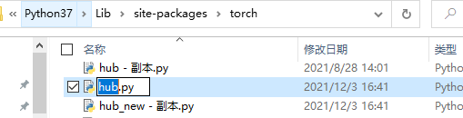
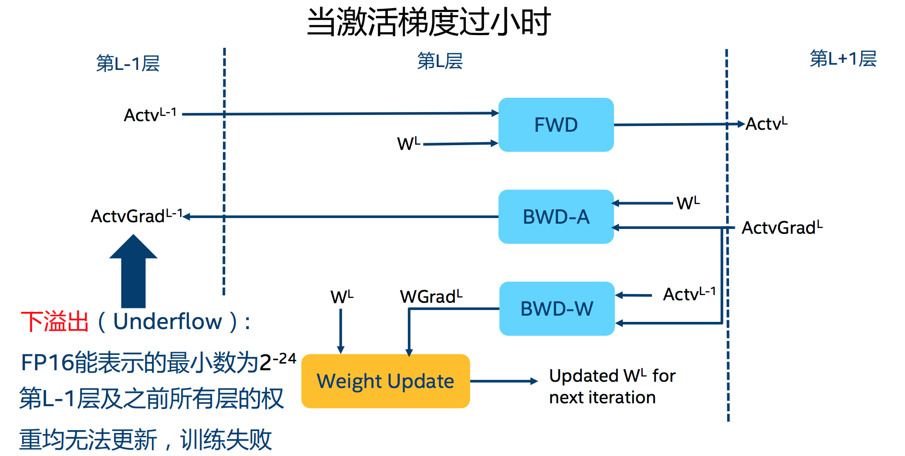
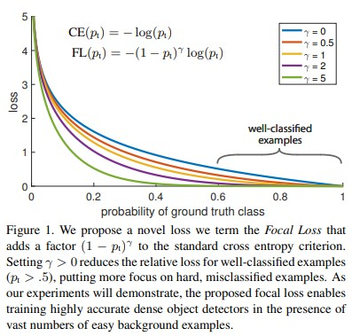

# torch

## torchtext

### transformer

```python
torch.nn.Transformer(d_model=512,nhead=8,num_encoder_layers=6,num_decoder_layers=6, dim_feedforward=2048, dropout=0.1,activation="relu",custom_encoder=None,custom_decoder=None)
```

> `d_model`: 编码器/解码器输入大小
>
> `nhead`: 多头注意力模型的头数
>
> `num_encoder_layers`: 编码器中子编码器层的数量
>
> `num_decoder_layers`: 解码器中子解码器层的数量(默认为6)
>
> `dim_feedforward`: 前馈网络模型中的中间层的维度

```python
transformer_model = nn.Transformer(nhead=16,num_encoder_layers=12)
src = torch.rand((10,32,512))
tgt = torch.rand((20,32,512))
out = transformer_model(src,tgt)
```

- forward

    ```python
    forward(src,tgt,src_mask=None,tgt_mask=None,memory_mask=None,src_key_padding_mask=None,tgt_key_padding_mask=None)
    ```

    > `src`: the sequence to the encoder
    >
    > `tgt`: the sequence to the decoder
    >
    > 

### torch.nn.EmbeddingBag

>   `CLASS torch.nn.EmbeddingBag(num_embeddings, embedding_dim, max_norm=None, norm_type=2.0, scale_grad_by_freq = False,mode="mean", sparse=False,_weight=None,include_last_offset=False, padding_idx=None,device=None,dtype=None)`

Computes sums or means of ‘bag’ of embeddings, without instantiating the intermediate embeddings.

For bags of constant length, no `per_sample_weights`, no indices equal to `padding_idx`, and with 2D inputs, this class 

example

```python
# an embeddingBag module containing 10 tensors of size 3
embedding_sum = nn.EmbeddingBag(10, 3, mode="sum")
# a batch of 2 samples of 4 indices each
input = torch.tensor([1,2,4,5,4,3,2,9],dtype=torch.long)
#in our case, 0 and 4 means the first bag: input[0:4] and the second bag: input[4:]
offsets = torch.tensor([0,4],dtype=torch.long)
embedding_sum(input,offsets)
#tensor([[-0.8861, -5.4350, -0.0523],
#        [ 1.1306, -2.5798, -1.0044]])
```


### torchtext.data.utils.get_tokenizer

Generate tokenizer function for a string sentence

>   `tokenizer`: the name of tokenizer function. If None, it returns split() function, which splits the string sentence by space. If `basic_english`, it `return_basic_english_normalize()` function, which normalize the string first and split by space. If a callable function, it will return the function.  if a  tokenizer library (e.g. spacy, moses, toktok, revtok, subword), it return the corresponding library
>
>   `language`: Default en

example

```python
import torchtext
from torchtext.data import get_tokenizer
tokenizer = get_tokenizer("basic_english")
tokens = tokenizer("you can now install TorchText using pip!")
print(tokens)
#['you', 'can', 'now', 'install', 'torchtext', 'using', 'pip', '!']
```


## nn.Embedding

```python
torch.nn.Embedding(num_embeddings, embedding_dim, padding_idx=None,
                  max_norm=None, norm_type=2.0, scale_grad_by_freq=False,
                  sparse=False, _weight=None)
```

>   -   `num_embeddings: ` 词典的大小尺寸, 如共出现5000个词, 则输入为5000
>   -   `embedding_dim:` 嵌入向量的维度, 即用多少维来表示一个符号
>   -   `padding_idx: `填充id, 比如输入长度为100, 但是每次的句子长度并不一样, 后面就需要用同一的数字填充, 而这里就是指定这个数字, 这样, 网络在遇到填充id时, 就不会计算与其他符号的相关性.

其为一个简单的存储固定大小的词典的嵌入向量的查找表, 即给一个编号, 嵌入层就能返回一个该编号对应的嵌入向量, 嵌入向量反映了各个编号代表的符号之间的语义关系.

## torch.chunk()

`torch.chunk(input,chunks,dim=0)`函数会将输入张量(input)沿着指定维度(dim)均匀的分割成特定数量的张量块(chunks),并返回元素为张量块的元组. `torch.chunk`函数有三个参数:

## SyncBatchNorm

> `nn.SyncBatchNorm(num_features, eps=12-05,moment=0.1,mapping=True, track_running_state=True, process_group=None)`

BN操作是对N维输入应用批量归一化
$$
y=\frac{x-E[x]}{\sqrt{Var[x]+\epsilon}}*\gamma+\beta
$$
同样默认情况下, 在训练过程中, 该层会继续对其计算的均值和方差进行估算, 然后将其用于评估期间的标准化. 运行估算值保持默认moment为0.1.

如果`track_running_stats`将设置False, 则此层将不保持运行估计, 而是在评估期间也使用批处理统计信息.

因为批处理规范化是在C维上完成, 计算( N, +)切片的统计信息, 所以通常将次术语称为"体积批处理规范化"

当前, `SyncBatchNorm`仅支持每个进程具有单个GPU的`DistributedDataParallel`. 使用DDP包装网络之前, 使用`torch.nn.SyncBatchNorm.convert_sync_batchnorm()`将BatchNorm层转换为SyncBatchNorm.

## Inplace操作

本质上讲, inplace操作是指将新值赋值到原变量地址上的操作, 目的是节约内存空间. 

在pytorch中, 任何有一个`_`后缀改变张量的操作是inplace操作. 例如`x.squeeze_()`操作将改变x.

## distributed()

**background**

pytorch多卡训练中, 通常由两种方式, 一种是单机多卡模式(存在一个节点, 通过`torch.nn.DataParallel(model)`实现), 一种是多机多卡模式(存在一个节点或者多个节点, 通过`torch.nn.parallel.DistributedDataParalled(model)`, 在单机多卡环境下使用第二种分布式训练模式具有更快的速度. 

pytorch在分布式训练过程中, 对数据的读取采用主进程预读取并缓存, 然后其它进程从缓存中读取,不同进程之间的数据同步具体通过`torch.distributed.barrier()`实现.

**`torch.distributed.barrier()`**

```python
def create_dataloader():
    #使用上下文管理器中实现的barrier函数确保分布式中的主进程首先处理数据, 然后其它进程直接从缓存中读取
    with torch_distributed_zero_first(rank):
        dataset = LoadImagesAndLabels()
from contextlib import contextmanager
# 定义的用于同步不同进程读取数据的上下文管理器
@contextmanager
def torch_distributed_zero_first(local_rank:int):
    #Decorator to make all processes in distributed training wait for each local_master to do something.
    if local_rank not in [-1,0]:
        torch.distributed.barrier()
    yield
    if local_rank == 0:
        torch.distributed.barrier()
```

**1. 进程号rank理解**

在多进程上下文中,我们通常假定`rank 0`是第一个进程或者主进程, 其它进程分别具有0, 1, 2不同rank号, 这样总共具有4个进程.

**2. 单一进程数据处理**

通常有一些操作没有必要以并行的方式进行处理的, 如果数据读取与处理操作, 只需要一个进程进行处理并缓存, 然后与其它进程共享缓存处理数据, 但是由于不同进行同步执行, 单一进程处理数据必然会导致进程之间出现不同步的现象, 为此, torch中采用barrier()函数对其它非主进程进行阻塞, 来达到同步的目的.

**3. barrier()具体原理**

在上面的代码示例中, 如果执行`create_dataloader()`函数的进程不是主进程, 即rank不等于0或者-1, 上下文管理器会执行相应的`troch.distributed.barrier()`, 设置一个阻塞, 让此进程处于等待状态, 等待所有进程到达栅栏处(包括主进程数据处理完毕); 如果执行`create_dataloader()`函数的进程是主进程, 其会直接去读取数据并处理, 然后处理结束后就接着遇到`torch.distributed.barrier()`, 此时, 所有进程都到达栅栏处, 这样所有进程就达到了同步, 并同时得到释放.


## Pytorch模型加速和减少显存

PyTorch框架提供一个好用的trick: **开启半精度** 可直接加速运行速度, 减少GPU, 并且只有不明显的accuracy损失.

```python
model.half()#这一步要放在模型载入GPU之前, 即放到model.cuda(0之前
```

- 这一步要放在模型载入GPU之前, 即放到`model.cuda()`之前.

- 模型改为半精度以后, 输入也要改称半精度

  ```python
  img = torch.from_numpy(image).float()
  img = img.cuda()
  img = img.half()
  ```

## optimizer基本用法

**`optimizer.zero_grad()`**

清空所管理的网络参数的梯度

```python
class Optimizer(object):
    def zero_grad(self):
        r"""Clears the gradients of all optimized :class:`torch.Tensor` s."""
        for group in self.param_groups: # 对于self.param_groups的list中字典key='params'对应的value
            for p in group['params']:
                if p.grad is not None:
                    p.grad.detach_()  # 脱离原来的计算图，被计算机捕捉到
                    p.grad.zero_()

```

**`optimizer.step()`**

执行一步更新, 根据对应的梯度下降策略

**`optimizer.add_param_group()`**

添加参数组, **经常用于finetune, 如设置两部分参数**, e.g. 网络分为: 特征提取层+全连接分类层, 设置两组优化参数.

```python
class Optimizer(object):
    def add_param_group(self, param_group):
        """
        Arguments:
            param_group (dict): Specifies what Tensors should be optimized along with group
            specific optimization options.
        """
        params = param_group['params']
        param_set = set()
        for group in self.param_groups:
            param_set.update(set(group['params']))
        self.param_groups.append(param_group)
```

同一个优化器,添加新的优化参数

```python
weight = torch.randn((2, 2), requires_grad=True)

optimizer = optim.SGD([weight], lr=0.1)
print('添加之后未添加之前:{}'.format(optimizer.param_groups))

'''
添加之后未添加之前:[{'params': [tensor([[ 0.4523,  0.2895],
        [-0.4283,  1.0688]], requires_grad=True)], 'lr': 0.1, 'momentum': 0, 'dampening': 0, 'weight_decay': 0, 'nesterov': False}]
'''
```

添加之后

```python
w2 = torch.randn((3, 3), requires_grad=True)

optimizer.add_param_group({"params": w2, 'lr': 0.0001})

print("添加之后{}".format(optimizer.param_groups))

'''
添加之后[{'params': [tensor([[ 0.4523,  0.2895],
        [-0.4283,  1.0688]], requires_grad=True)], 'lr': 0.1, 'momentum': 0, 'dampening': 0, 'weight_decay': 0, 'nesterov': False}, {'params': [tensor([[-1.0346,  1.2396, -1.4738],
        [ 0.8029, -1.1723,  0.0783],
        [ 0.7809,  0.4156,  0.3127]], requires_grad=True)], 'lr': 0.0001, 'momentum': 0, 'dampening': 0, 'weight_decay': 0, 'nesterov': False}]
'''
```

可以看到添加之后, `optimizer.param_groups` list中含有两个字典, 一个字典是之前的参数, 另一个字典是新添加的一系列优化器参数

**`optimizer.state_dict()`**

获取当前优化器的一系列信息参数.由代码可知, 返回的是字典, 两个key: `state, param_groups`

```python
class Optimizer(object):
    def state_dict(self):
        ...
        ...
        return {
            'state': packed_state,
            'param_groups': param_groups,
        }
```

`self.state`: 参数缓存, 如动量缓存, 当网络没有经过`optimizer.step()`, 即没有根据`loss.backward()`得到的梯度去更新网络参数时, `state`为空

```python
print(optimizer.state_dict())
'''
{'state': {}, 'param_groups': [{'lr': 0.1, 'momentum': 0, 'dampening': 0, 'weight_decay': 0, 'nesterov': False, 'params': [140306069859856]}]}
'''
```

当更新之后, `state`将保存`params`中value的地址以及`{momentun_buffer:tensor()}`动量缓存, 用于后续断点恢复

**`optimizer.load_state_dict()`**

加载保存的状态信息字典

```python
'''保存优化器状态信息'''
torch.save(optimizer.state_dict(), os.path.join(address, "name.pkl"))

'''加载优化器状态信息'''
state_dict = torch.load(os.path.join(address, "name.pkl"))

optimizer.load_state_dict(state_dict)
```

### 学习率

$$
w_{i+1}=w_i- lr*grad(w_i)
$$

学习率可以看作是对梯度的缩小因子, 用来控制梯度更新的步伐.

### 动量Momentum

**指数加权平均**

结合当前梯度与上一时刻的更新信息, 来更新当前梯度信息. Momentum梯度下降法科追溯到指数加权平均:
$$
V_{t}=\beta \cdot V_{t-1}+(1-\beta) \cdot \theta_{t}=\sum_{i=0}^{t}\left((1-\beta) \cdot \beta^{i} \cdot \theta_{t-i}\right)
$$
其中 $\theta_{t}$ 为当前时刻的参数，因为 $\beta<1 ，$​ 从上述公式可知，距离当前时刻越远的时刻参数，权重越 小，对时刻影响越小。
**(2) Pytroch中的动量计算**
$$
\begin{gathered}
\left\{\begin{array}{c}
V_{i}=m \cdot V_{i-1}+\operatorname{grad}\left(w_{i}\right) \\
w_{i+1}=w_{i}-l r \cdot V_{i}
\end{array}\right. \\
\Longrightarrow V_{i}=\sum_{j=0}^{i}\left(m^{j} \cdot \operatorname{grad}\left(w_{i-j}\right)\right)
\end{gathered}
$$

## troch.hub

解决`RuntimeError: Only one file(not dir) is allowed in the zipfile`问题

替换hub文件, 因旧的hub文件中没有兼容之后的zip文件解码



## F.affine_grid and F.grid_sample

再pytorch框架中, `F.affine_grid` 与`F.grid_sample`联合使用来对图像进行变形

`F.affine_grid`根据形变参数产生`sampling grid`, `F.grid_sample`根据产生的`sampling grid`对图像进行变形.

需要注意, pytorch中的`F.grid_sample`是反向采样.

```python
from torch.nn import functional as F
theta = torch.tensor([
    [1.0,-0.2],
    [0,1,-0.4]
],dtype=torch.float)
grid = F.affine_grid(theta.unsqueeze(0),img_torch.unsqueeze(0).size())
output = F.grid_sample(img_torch.unsqueeze(0),grid)
new_img_torch = output[0]
```

`F.affine_grid`根据输入的变换矩阵theta和尺寸利用后向变换求出目标图像每个像素在原图图像的位置.

- `F.affine_grid(theta,size)`
  - `theta`: 是一个`[N,2,3]`的tensor, N为batchsize大小, 2行3列共六个参数, 为affine的变换矩阵. 第一行为x坐标, 即横坐标的变换参数, 前两个为权重, 最后一个为偏移, 值得注意的是偏移值是一个相对于图像宽归一化的参数a,c,e(并非像素值). 第二行表示y坐标的变换参数(b,d,f)
  - `size`: 是一个tuple, 为(N,C,H,W)
  - `output`为`[N,h,w,2]`的tensor, 表示在原图中的对应位置

`F.grid_sample()`为重采样函数, 根据输入的原图和位置对应关系矩形(F.affine_grid的输出)对原图像素进行重采样, 构成变换后的图像. 由于重采样过程中, 在原图中的位置会出现小数, 因此需要对原图进行插值, 插值方式为可选参数, 默认为双线性插值.

示例2

将图像顺时针旋转45杜, 注意pytorch使用的为后向变换

即将原图到目标图需要顺时针旋转45°,那么目标图到原图为逆时针旋转45°.

```python
import torch
import cv2
import torch.nn.functional as F
import matplotlib.pyplot as plt
 
 
theta = torch.Tensor([[0.707,0.707,0],[-0.707,0.707,0]]).unsqueeze(dim=0)
img = cv2.imread('achor.png',cv2.IMREAD_GRAYSCALE)
plt.subplot(2,1,1)
plt.imshow(img,cmap='gray')
plt.axis('off')
img = torch.Tensor(img).unsqueeze(0).unsqueeze(0)
grid =  F.affine_grid(theta,size=img.shape)
output = F.grid_sample(img,grid)[0].numpy().transpose(1,2,0).squeeze()
plt.subplot(2,1,2)
plt.imshow(output,cmap='gray')
plt.axis('off')
plt.show()
```

结果如下, (pytorch中已图像中心点为原点,与一般的左上角为原点不太一样)


## nn.Module.apply(fn)

Applies `fn` recursively to every submodule (as returned by `.children()` as well as self. Typical use includes initializing the parameters of a model

**fn(Module-None)**: function to be applied to each submodule

## ConvTranspose2d()

`ConvTranspose2d(in_channels,out_channels,kernel_size,stride,padding,output_padding,groups, bias, dilation)`

- **padding**: 可选, 零填充将添加到输出中每个维度的两侧.
- **output_padding**: 可选, 在输出形状的每个尺寸的一侧添加的附加大小.

## TensorRT

NVIDIA TensorRT是一个C++库, 有助于在NVIDIA GPU上进行高性能推理. 它旨在与通常用于训练的深度学习框架结合使用. TensorRT专注于在GPU上快速高效地运行已经训练好的网络, 以生产结果; 也称为推理.

## cuda

### amp()

pytorch已经集成了amp

- 混合精度训练机制

1. 用户不需手动对模型参数dtype进行转换, amp会自动为算子选择合适的数值精度
2. 反向传播时, FP16的梯度数值溢出的问题, amp提供了梯度scaling操作, 且在优化参数前, 会自动对梯度unscaling, 所以, 对用于模型优化的参数不会有任何影响, 以上两点, 分别是通过使用`amp.autocast, amp.GradScaler`来实现
3. 

`torch.cuda.amp`提供了可以使用混合精度的方法,以加速训练, 在网络中, 有一些操作, 列如`linear layer` 和 `convolution`,在float16时会更加快速训练. 而另外一些操作, 如`reduction`, 会需要float32的动态范围, 混合精度就是在尽可能地将每一种操作匹配到最合适的精度

- 使用方法

```python
import torch.cuda.amp.autocast as autocast
import torch.cuda.amp.GradScaler as GradScaler
```

- Typical Mixed Precision Training

```python
#create model and optimizer in default precision
#amp依赖Tensor Core架构, 所以model参数必须是cuda tensor类型
model = Net().cuda()
optimizer = optim.SGD(model.patameters(),...)

#GradScaler对像用来自动做梯度缩放
scaler = GradScaler()

for epoch in epochs:
    for input, target in data:
        optimizer.zero_grad()
        #在autocast enable区域运行forward
        with autocast():
            #model做一个FP16的副本, forward
            output = model(input)
            loss = loss_fn(output,target)
        #用scaler, scale loss(FP16), backward得到scaled的梯度(FP16)
        scaler.scale(loss).backward()
        #scaler更新参数, 会自动unscale梯度, 如果有有nan或者inf, 自动跳过
        scaler.step(optimizer)
        #scaler factor更新
        scaler.update()
```

- scaler

  scaler的大小在每次迭代中动态估计, 为了尽可能减少梯度underflow, scaler应该更大; 但太大, 半精度浮点型又容易overflow(变成inf). 所以, 动态估计原理就是在不出现underflow和overflow的情况下, 尽可能的增大scaler值. 在每次`scaler.step(optimier)`中, 都会检查是否又`inf或NaN`的梯度出现

  1. 如果出现`inf, NaN`, `scaler.step(optimizer)`会忽略此次权重更新`optimizer.step()`, 并将scaler的大小缩小(乘上backoff_factor)
  2. 如果没有出现`inf, NaN`, 那么权重正常更新, 并且当连续多次(growth_interval)指定没出现`inf, NaN`, 则`scaler.update()`会将`scaler`的大小增加(乘上`growth_factor`

- autocast类

  `atuocast(enable=True)` 可以作为上下文管理器和装饰器来使用, 给算子自动安排按照FP16或者FP32的数值精度来操作.

- autocast算子

  Pytorch中, 只有CUDA算子有资格被autocast, 而且只有"out-of-place"才可以被autocast, 例如: `a.addmm(b,c)`是可以被autocast, 但是`a.addmm_(b,c)`和`a.addmm(b,c,out=d)`不可以autocast. amp autocast成FP16的算子有:

  

  autocast成FP32算子

  

  剩余没有列出的算子, 像`dot, add, cat,...`都是按数据中较大的数值精度进行操作, 即有FP32参数计算, 就按照FP32, 全是FP16参与计算, 就是FP16

- MisMatch error

  作为上下文管理器使用时, 混合精度计算enable区域得到的FP16数值精度的变量在enable区域外需要显示的转成FP32

  ```python
  #creates some tensors in default dtype (here assumed to be float32)
  a_float32 = torch.rand((8, 8), device="cuda")
  b_float32 = torch.rand((8, 8), device="cuda")
  c_float32 = torch.rand((8, 8), device="cuda")
  d_float32 = torch.rand((8, 8), device="cuda")
  with autocast():
      #torch.mm is on autocast's list of ops that should run in float16
      e_float16 = torch.mm(a_float32, b_float32)
      #Also handles mixed input types
      f_float16 = torch.mm(d_float32, e_float16)
  #after exiting autocast, f_float16.float() to use with d_float32
  g_float32 = torch.mm(d_float32, f_float16.float())
  ```

### automatic mixed percision examples

Ordinarily, "automatic mixed precision training" means training with `torch.cuda.amp.autocast` and `torch.cuda.amp.GradScaler` together.

Instances of  `torch.cuda.amp.autocast` enable autocasting for chosen regions. Autocasting automatically chooses the precision for GPU operations to imporove performance while maintaining accuracy.

Instance of `torch.cuda.amp.GradScaler` help perform the steps of gradient scaling conveniently. Gradient scaling improves convergence for networks with `float16` gradients by minimizing gradient underflow.

#### Typical Mixed Precision Training

```python
#create model and optimizer in default precision
model = Net().cuda()
optimizer = optim.SGD(model.parameters(),...)

#Creates a GradScaler once at the begining of training
scaler = GradScaler()
for epoch in epochs:
    for input,target in data:
        optimizer.zero_grad()
        #Runs the forward pass with autocasting
        with autocast():
            output = model(input)
            loss = loss_fn(output,target)
        #scales loss. Calls backward() on scaled loss to create scaled gradients
        #Backward passes under autocast are not recommeded
        #Backward ops run in the same dtype autocast chose for correnponding forward ops
        scalser.scale(loss).backward()
        #scaler.step() first unscales the gradients of the optimizer's assigned params.
        #if these gradients do not contain infs or NaNs, optimizer.step() is then called, otherwise, optimizer.step() is skipped
        scaler.step(optimizer)
        
        #Updates the scale for next iteration
        scaler.update()
```

#### Working with Unscaled Gradients

All gradients produced by `scaler.scale(loss).backward()` are scaled. if you wish to modify or inspect the parameters' `grad` attributes between `backward()` and `scaler.step(optimizer)`, you should unscale them first. For example, gradient clipping manipulates a set of gradients such that their global norm (see `torch.nn.utils.clip_grad_norm_()`) or maximum magnitude (see `torch.nn.utils.clip_grad_value_()`) is <- some user-imposed threshold. if you attempted to clip without unscaling, the gradients' norm/maximum magnitude would also be scaled, so your requested threshold (which was meant to be the threshold for unscaled gradients) would be invalid

`scaler.unscale_(optimizer)` unscales gradients held by `optimizer` assigned parameters. if your model or models contain other parameters that were assigned to another optimizer (say `optimizer2`), you may call `scaler.unscale_(optimier2)` separately ot unscale those parameters' gradients as well.

#### Gradient clipping

Calling `scaler.unscale_(optimizer)` befor clipping enables you to clip unscaled gradients as usual:

```python
scaler GradScaler()
for epoch in epochs:
    for input, target in data:
        optimizer.zero_grad()
        with autocast():
            output = model(input)
            loss = loss_fn(output,target)
        scaler.scale(loss).backward()
        
        #unscales the gradient of optimizer's assigned in-place
        scaler.unscale_(optimizer)
        
        #Since the gradients of optimizer's assigned params are unscaled, clip as usual:
        torch.nn.utils.clip_grad_norm_(model.parameters(), max_norm)
        #optimizer's gradients are alredy unscaled, so scaler.step does not unscale them,although it still skips optimizer.step() if the gradients contain infs or NaNs
        scaler.step(optimizer)
        
        #update the scale for next iteration
        scaler.update()
```

#### Gradient accumulation

Gradient accumulation adds gradients over an effective batch of size `batch_per_iter*iters_to_accumulate(* num_procs if distributed)`, The scale should be calibrated for the effective batch, which means inf/NaN checking, step skipping if inf/NaN grads are found, and scale updates should occur at effective-batch granularity. Also, grads should remain scaled, and the scale factor should remain constant, while grads for a given effective batch are accumulated.  If grads are unscaled (or the scale facor changes) before accumulation is complete, the next backward pass will add scaled grads to unscaled grads (or grads scaled by a different factor) after which it's impossible to recover the accumulated unscaled grads `step` must apply.

```python
scaler = GradScaler()
for epoch i epochs:
    for i, (input, target) in enumerate(data):
        with autocast():
            output = model(input)
            loss = loss_fn(output,target)
            loss = loss/iters_to_accumulate
        #accumulates scaled gradients
        scaler.scale(loss).backward()
        
        if (i+1)%iters_to_accumulate==0:
            #may unscale_ here if desired(e.g., to allow clipping unscaled gradients)
            scaler.step(optimizer)
            scaler.update()
            optimizer.zero_grad()
```

### 为什么使用amp

AMP其实就是Float32于Float16的混合,其具备以下优势:

1. 减少显存占用
2. 加快训练和推断的计算,能带来多一倍速的体验
3. 张量核心的普及(NVIDIA Tensor Core), 低精度计算式未来深度学习的一个重要趋势

缺陷

1. 溢出错误: 在计算过程中容易出现上溢出和下溢出, 溢出之后就会出现"NaN"的问题. 在深度学习中, 由于激活函数的梯度往往要比权重梯度下, 更易出现下溢出的情况.



2. 舍入误差: 当梯度过下时, 该次梯度更新可能会失败

   

### 注意事项

在使用AMP时,由于报错信息并不明显, 给调试带来了一定的难度. 

1. 判断GPU是否支持FP16, 支持Tensor core的GPU有(2080Ti, Tian, Tesla), 不支持的(Pascal系列)

   1080Ti与2080Ti对比

   | 1080Ti                    | 2080Ti                    |
   | ------------------------- | ------------------------- |
   | 半精度浮点数: 0.17TFLOPS  | 半精度浮点数: 20.14TFLOPS |
   | 单精度浮点数: 11.34TFLOPS | 单精度浮点数: 10.07TFLOPS |
   | 双精度浮点数: 0.33TFLOPS  | 双精度浮点数: 0.31TFLOPS  |

2. 常数范围: 为保证计算不溢出,首先保证人工设定的常数不溢出, 如epsilon.

3. Dimension最好时8的倍数: 维度是8的倍数,性能最好

4. 涉及sum的操作要小心, 容易溢出, softmax操作, 建议用官方API, 并定义成layer写在模型初始化里

5. 模型书写要规范: 自定义的Layer写在模型初始化里, graph计算写在forward里

6. 一些不常用的函数, 使用前要注册: `amp.register_float_function(torch, 'sigmoid')`

7. 某些函数不支持FP16, 建议不要用

8. 需要操作梯度的模块必须在optimizer的step里, 不然AMP不能判断grad是否为NaN

## tensor.new_empty((2,3))

`Tensor.new_empty(size,dtype=None, device=None, requires_grad=False)->Tensor`

Return a Tensor of size filled with uninitialized. By default, the retruned Tensor has the same `torch.dtype` and `torch.device` as this tensor

```python
tensor = torch.ones(())
tensor.new_empty((2, 3))
#-------------------------
tensor([[ 5.8182e-18,  4.5765e-41, -1.0545e+30],
        [ 3.0949e-41,  4.4842e-44,  0.0000e+00]])
```


## expand()

将单个维度扩大成更大维度, 返回一个新的tensor.

- 实例

  ```python
  x = torch.Tensor([[1],[2],[3]])
  
  y = x.expand(3,4)
  ```

  

  note: 使用expand()函数的时候, x自身不会发生改变, 因此需要将结果重新赋值.

## argmax()

`torch.argmax(input,dim=None,keepdim=False)`

- 返回指定维度最大的序号
- dim: the demention to reduce, 就是把dim这个维度, 变成维度的最大值的idx

## coco

API接口

- `COCO`: 用于加载COCO标注2文件并准备所需的数据结构
- `decodeMask`: Decode binary mask M encoded via run-length encoding
- `encodeMask`: Encode binary mask M using run-length encoding
- `getAnnIds`: 获取满足条件的类别的ids
- `getCatIds`: 获取满足条件的类别的ids
- `getImagIds`: 获取满足条件的图像的ids
- `loadAnns`: 加载指定ids对应的标注信息
- `loadCats`: 加载指定ids对应的图片
- `annToMask`: 将segmentation标注信息转换为二值mask
- `showAnns`: 显示指定ids的标注信息到对应的图片上

COCO类的构造函数负责加载json文件, 并将其中的标注信息建立关联关系

- imgToAnns: 将图片id和标注信息关联
- catToImgs: 将类别id和图片id关联

## kaiming

### Xavier

- 基本思想: 通过网络层时, 输出和输出的方差相同, 包括前向传播和反向传播.

  为什么需要Xavier初始化: 

  

  1. 如果初始化很小, 那么随着层数的传递, 方差回趋于0, 此时输入值也变得越来越小, 在sigmoid上就是在0附近, 接近于线性, 失去了非线性
  2. 如果初始值很大, 俺么随着层数的传递, 方差回迅速增加, 此时输入值变得很大, 而sigmoid输入值倒数趋近于0, 那么反向传播时会遇到梯度消失的问题.

  所以论文提出, 在每一层网络保证输入和输出的方差相同.

  `torch.nn.init.xavier_uniform_(tensor,gain=1)`均匀分布~$U(-a,a)$​​​​

  其中, a的计算公式
  $$
  a = gain×\sqrt{\frac{6}{fan_{in}+fan_{out}}}
  $$
  `torch.nn.init.xavier_normal_(tensor,gain=1)`,正态分布~N(0,std)

  其中, std的计算公式:
  $$
  std = gain×\sqrt{\frac{2}{fan_{in}+fan_{out}}}
  $$

### kaimin

Xavier在tanh中表现很好, 但在Relu激活函数中表现查, 该方法基于He initialization, 其思想时:

*在ReLU网络中, 假定每一层有一半的神经元被激活, 另一半为0, 所以, 要保持方差不变, 只需要在Xavier的基础上再除以2. 也就是再方差推倒过程中, 式子侧除以2*

`torch.nn.init.kaiming_uniform_(tensor, a=0, mode='fan_in', nonlinearity='leak_relu')`, 均匀分布~$U(-boudn, bound)$

其中bound的计算公式:
$$
bound = \sqrt{\frac{6}{(1+a^2)×fan_{in}}}
$$
`torch.nn.init.kaiming_normal_(tensor,a=0,mode='fan_in', nonlinearity='leaky_relu')`,正态分布~$N(0,std)$

其中, std的计算公式
$$
std = \sqrt{\frac{}2{(1+a^2)×fan_{in}}}
$$
其中, 两函数的参数

- `a`: 该层后面一层的激活函数中负数的斜率(默认为ReLU, 此时a=0)
- `mode`: 'fan_in'(default) 或者'fan_out', 使用fan_in保存weights的方差再前向传播中不变, 使用fan_out保持weights的方差再反向传播中不变

## opt

### SGD+Momentum

在SGD基础上, 引入一阶动量, 增加惯性. SGD的缺点是参数更新方向只依赖于当前batch计算出的梯度, 因此不稳定. 为抑制SGD震荡, 可在梯度下降过程中加入惯性, t时刻的下降方向, 不仅由当前点的梯度方向决定, 还有此前累计的梯度来决定. 若当前的梯度方向于累计的历史方向一致, 则当前的梯度会被加强.


- 一阶动量, 是指到此刻为止的梯度的指数加权平均
  $$
  m_t = \beta m_{t-1} + (1-\beta)*g_t
  $$
  $\beta$​的经验值一般为:0.9, 下降方向主要是此前累积的下降方向, 并略微偏向当前时刻的下降方向

- momentum和当前梯度更新位置
  $$
  下一个位置=当前位置-lr*到此刻为止所累积的梯度
  $$

  $$
  此刻所累积的梯度=动量因子*此前累积的梯度+(1-动量因子)*此刻的梯度
  $$

  

## torch.data

### DataLoader

- pin_memory

  锁页内存, 创建DataLoader时, 设置pin_memory = True, 则意味着生成的Tensor数据最开始是属于内存中的锁页内存, 这样内存的Tensor转义到GPU的显存会快一些.

  主机中的内存, 有两种存在方式, 一是锁页, 二是不锁页, 锁页内存存放的内容在任何情况下都不会与主机的虚拟内存进行交换(注:  虚拟内存就是硬盘), 而不锁页内存在主机内存不足时, 数据会存放在虚拟内存中.

### torch.utils.data

- Dataset: 一个抽象类, 所有其他类的数据集都应是它的子类. 而其子类必须重载两个重要的函数
- TensorDataset: 封装成tensor的数据集, 每一个样本都通过索引张量来获得
- ConcatDataset: 连接不同书记以构成更大的新数据集
- Subset(dataset, indices): 获取指定一个索引序列对应的子数据集
- DataLoader(dataset): 数据加载器, 组合一个数据集和采样器, 并提供数据的迭代器
- random_split(dataset, lengths): 按照给定的长度数据集划分成没有重叠的新数据集组合
- Sampler(data_source): 所有采样器的基类. 每个采样器都需要提供iter方法以方便迭代器进行索引和 一个len方法 以方便返回迭代器的长度.
- SequentialSampler(data_source): 顺序采样样本, 始终按照同一个顺序
- RandomSampler(data_source): 无放回的随机采样样本元素
- 

## torch.jit

### annotate(the_type, the_value)

该函数是一个传递函数, 返回值为the_value, 用于提示TorchScript编译器the_value的类型. 当该函数运行在TorchScript以外时, 为空操作.

尽管TorchScript可以推断出大多数python表达式的类型, 但还是有一些类型的推断时错误的. 例如: `[], {}`这类空容器, TorchScript认为这是一种张量的容器, 比如`Optional[T]`这样的`Optional`类型, 但当给`T`实际分类一种类型的时候, TorchScript会认为`T`的类型为type, 而不是Optional

注意: `annotate()`在`torch.nn.Module`子类的`__init__`方法中是无效的, 因为`torch.nn.Module`在eager模式下才会被执行.

```python
import torch
from typing import Dict

@torch.jit.script
def fn():
    #tell torchscript that this empty dictionary is a (str->int) dictionary
    #instead of default dictionary type of (str->tensor)
    d = torch.jit.annotate(Dict[str, int],{})
    
    #without `torch.jit.annotate` above, following statement would fial
    #because of type mismatch
    d['name']=20
```

Parameters:

- the_type: 传递给torchscript编译器的python类型, 作为the_value的类型提示
- the_value: 要提示类型的值或表达式.
- Returns: the value将作为返回值.

## tensorboard

```python
from torch.utils.tensorboard import SummaryWriter

writer = SummaryWriter('runs/fashion_mnist_experiment_1')
#writing to tensorboard
# get some random training images
dataiter = iter(trainloader)
images, labels = dataiter.next()

# create grid of images
img_grid = torchvision.utils.make_grid(images)

# show images
matplotlib_imshow(img_grid, one_channel=True)

# write to tensorboard
writer.add_image('four_fashion_mnist_images', img_grid)

#write model
writer.add_graph(net, images)
writer.close()

#write scale
writer.add_scalar('training loss',
                            running_loss / 1000,
                            epoch * len(trainloader) + i)

#write figure
writer.add_figure('predictions vs. actuals',
                            plot_classes_preds(net, inputs, labels),
                            global_step=epoch * len(trainloader) + i)
```

- 相关工具函数

```python
#可视化预测结果
def images_to_probs(net, images):
    output = net(images)
    # convert output probabilities to predicted class
    _, preds_tensor = torch.max(output, 1)
    preds = np.squeeze(preds_tensor.numpy())
    return preds, [F.softmax(el, dim=0)[i].item() for i, el in zip(preds, output)]

def plot_classes_preds(net, images, labels):
    preds, probs = images_to_probs(net, images)
    # plot the images in the batch, along with predicted and true labels
    fig = plt.figure(figsize=(12, 48))
    for idx in np.arange(4):
        ax = fig.add_subplot(1, 4, idx+1, xticks=[], yticks=[])
        matplotlib_imshow(images[idx], one_channel=True)
        ax.set_title("{0}, {1:.1f}%\n(label: {2})".format(
            classes[preds[idx]],
            probs[idx] * 100.0,
            classes[labels[idx]]),
                    color=("green" if preds[idx]==labels[idx].item() else "red"))
    return fig
```


## model.eval()

### 问题描述

torch.onnx.export()导出的onnx模型后, 利用onnxruntime加载onnx模型后, 其输出结果与原始.pth模型的输出结果之间存在很大差距; 通过拆分网络结构, 定位到nn.BatchNorm2d()层导致;

### BN和Dropout

- BN

  其作用对网络中间的每层进行归一化处理, 并且使用变化重构(BN transform)保证每层提取的特征分布不会被破坏. 训练时针对每个mini-batch, 但是测试时针对单张图片, 即不存在batch的概念. 由于网络训练完成后参数是固定的, 每个batch的均值和方差是不变的, 因此直接结算所有batch的均值和方差. 所以BN的训练和测试时的操作不同.

- DropOut

  其作用克服Overfitting, 在每个训练批次中, 通过忽略一半的特征检测器, 可以明显的减少过拟合线性

- model.train()

  启用BN和Dropout

- model.eval()

  不启用BN和Dropout, 保证BN和dropout不发生变化, pytorch会自动把BN和Dropout固定住, 不会取平均值, 而是用训练好的值, 不然的话, 一旦test的batch_size过小, 很容易就会BN层影响结果.

### 解决方案

利用原始.pth模型进行推理前, 一定要先进行model.eval()操作.

## GIoU


## torch.nn模块

### Focal Loss

类别样本数量不均衡, 通常回影响分类算法效果. Focal loss专门为一阶段算法设计, 将易区分负例的loss权重降低, 使得网络不会被大量的负例带偏.



$p_t$​反映了与ground truth 即类别y的接近程度, $p_t$​越大说明越接近类别y, 即分类越准确. 

$\gamma>0$​​为可调节因子

即相比交叉熵损失, focal loss对于分类不准确的样本, 损失没有改变, 对于分类准确的样本, 损失会变小. 整体而言, 相当于增加了分类不准确样本再损失函数中的权重.

$p_t$也反应了分类的难易程度, 其越大, 说明分类的置信度越高, 代表样本越易分.

```python
class FocalLoss(nn.Module):
    # Wraps focal loss around existing loss_fcn(), i.e. criteria = FocalLoss(nn.BCEWithLogitsLoss(), gamma=1.5)
    def __init__(self, loss_fcn, gamma=1.5, alpha=0.25):
        super(FocalLoss, self).__init__()
        self.loss_fcn = loss_fcn  # must be nn.BCEWithLogitsLoss()
        self.gamma = gamma
        self.alpha = alpha
        self.reduction = loss_fcn.reduction
        self.loss_fcn.reduction = 'none'  # required to apply FL to each element

    def forward(self, pred, true):
        loss = self.loss_fcn(pred, true)
        # p_t = torch.exp(-loss)
        # loss *= self.alpha * (1.000001 - p_t) ** self.gamma  # non-zero power for gradient stability

        # TF implementation https://github.com/tensorflow/addons/blob/v0.7.1/tensorflow_addons/losses/focal_loss.py
        pred_prob = torch.sigmoid(pred)  # prob from logits
        p_t = true * pred_prob + (1 - true) * (1 - pred_prob)
        alpha_factor = true * self.alpha + (1 - true) * (1 - self.alpha)
        modulating_factor = (1.0 - p_t) ** self.gamma
        loss *= alpha_factor * modulating_factor

        if self.reduction == 'mean':
            return loss.mean()
        elif self.reduction == 'sum':
            return loss.sum()
        else:  # 'none'
            return loss
```


### BCEWithLogitsLoss() from pytorch

> CLASS torch.nn.BCEWithLogitsLoss(weight=None, size_average=None, reduce=None, reduction='mean', pos_weight=None)

This loss combines a Sigmoid layer and the BCELoss in one single class. This version is more numerically stable than using a plain Sigmoid followed by a BCELoss as, by combining the operations into one layer, we take advantage of the **log-sum-exp** trick for numerical stability.

The unreduced (i.e. with `reduction` set to `none`) loss can be described as:
$$
l(x,y)=L=\{l_1,...,l_n\}^T\\
l_n=-w_n[y_n*log\sigma(x_n)+(1-y_n)*log(1-\sigma(x_n))]
$$
where **N** is the batch size. if `reduction` is not `none` (default `mean`), then 
$$
l(x,y)=\left\{  
             \begin{array} 
             mean(L), if reduction='mean' \\  
             sum(L), if reduction='sum'\\    
             \end{array}  
\right.  
$$
This is used for measuring the error of a reconstruction in for example an auto-encoder. Note that the targets `t[i]` should be numbers between 0 and 1.

It's possible to trade of recall and precision by adding weights to positive examples. In the case of multi-label classification the loss can be described as:
$$
l(x,y)=L=\{l_1,...,l_n\}^T\\
l_{n,c}=-w_{n,c}[p_cy_{n,c}*log\sigma(x_{n,c})+(1-y_{n,c})*log(1-\sigma(x_{n,c}))]
$$
where `c` is the class number ($c>1$ for multi-label binary classification, $c=1$ for single-label binary classificatioin), `n` is the number of the sample in the batch and $p_c$ is the weight of the positive answer for the class $c$​.

$p_c>1$ increases the recall, $p_c<1$​ increases the precision.

For example, if a dataset contains 100 positive and 300 negative examples of a single class, then `pos_weight` for the class should be equal to $\frac{300}{100}=3$. The loss would act as if the dataset contains $3*100=300$ positive examples.

examples:

```python
target = torch.ones([10, 64], dtype=torch.float32)  # 64 classes, batch size = 10
output = torch.full([10, 64], 1.5)  # A prediction (logit)
pos_weight = torch.ones([64])  # All weights are equal to 1
criterion = torch.nn.BCEWithLogitsLoss(pos_weight=pos_weight)
criterion(output, target)  # -log(sigmoid(1.5))
```

> Parameters

- **weight**(Tensor, optional): a manual rescaling weight given to the loss of each batch element. if given, has to be a Tensor of size `nbatch`
- **size_average**(bool, optional): Deprecated (see `reduction`)
- **reduce**(bool, optional): Deprecated (see recution)
- **reduction**(string, optional): Specifies the reduction to apply to the output: `'none' | 'mean' | 'sum'.` `'none'`: no reduction will be applied, `'mean'`: the sum of the output will be divided by the number of elements in the output, `'sum'`: the output will be summed. 
- **pos_weight**(Tensor, optional): a weight of positive examples. Must be a vector with length equal to the number of classes.

### BCEWithLogitsLoss()

本质上和`nn.BCELoss()`没有区别, 只是在BCELoss上加个logits函数(也就是sigmoid函数)

```python
import torch
import torch.nn as nn

label = torch.Tensor([1, 1, 0])
pred = torch.Tensor([3, 2, 1])
pred_sig = torch.sigmoid(pred)
loss = nn.BCELoss()
print(loss(pred_sig, label))

loss = nn.BCEWithLogitsLoss()
print(loss(pred, label))

loss = nn.BCEWithLogitsLoss()
print(loss(pred_sig, label))

```

```python
tensor(0.4963)
tensor(0.4963)
tensor(0.5990)
```


$$
S(x)=\frac{1}{1+e^{-x}}
$$


### interpolate

```python
torch.nn.functional.interpolate(input, size=None, scale_factor=None,mode='nearest',align_corners=None)
```

| name                                                         | descripe                                                     |
| ------------------------------------------------------------ | ------------------------------------------------------------ |
| input(Tensor)                                                | 输入张量                                                     |
| size (int or Tuple[int] or Tuple[int,int] or Tuple[int,int,int]) | 输出大小                                                     |
| scale_factor(float or Tuple[float])                          | 指定输出未输入的多少倍数. 如果输入未tuple, 其也要指定未tuple类型 |
| mode (str)                                                   | 可使用的上采样算法, 有'nearest', 'linear','bilinear','bicubic','trilinear', 'area' |
| align_corners (bool, optional)                               | 几何上, 我们认为输入和输出的像素时正方形, 而不是点. 如果设置为True, 则输入和输出张量由其角像素的中心点对齐, 从而保留角像素处的值. 如果设置为False, 则输入和输出张量由它们的角像素的角点对齐, 插值使用边界外值的边值填充. 当scale_factor保持不变时, 使该操作独立于输入大小. 仅当使用的算法为'linear','bilinear','trilinear'时可以使用. 默认设置为Fasle |

> 注: 使用mode='bicubic'时, 可能会导致overshoot问题, 即它可以为图像生成负值或大于255的值. 如果需要显示图像时, 可以显示地调用result.clamp(min=0,max=255)

实例

```python
import torch
from torch import nn
import torch.nn.functional as F
input = torch.arange(1,5,dtype=torch.float32).view(1,1,2,2)
```

```python
tensor([[[[1., 2.],
          [3., 4.]]]])
```

- 邻近值插值

```python
x = F.interpolate(input,scale_factor=2,mode='nearest')
```

```python
tensor([[[[1., 1., 2., 2.],
          [1., 1., 2., 2.],
          [3., 3., 4., 4.],
          [3., 3., 4., 4.]]]])
```

- 双线性插值

```python
x = F.interpolate(input, scale_factor=2, mode='bilinear', align_corners=True)
```

```python
tensor([[[[1.0000, 1.3333, 1.6667, 2.0000],
          [1.6667, 2.0000, 2.3333, 2.6667],
          [2.3333, 2.6667, 3.0000, 3.3333],
          [3.0000, 3.3333, 3.6667, 4.0000]]]])
```


### utils.\_ntuple

```python
def _ntuple(n):
    def parse(x):
        if isintance(x, container_abcs.Iterable):
            return x
        return tuple(repeat(x,n))
    return parse
_single = _ntuple(1)
```

这是pytorch源码, 用于生成迭代器. `_single`本身是一个函数, 在调用的时候会将输入的int或者迭代器重复1次.

### nn.CrossEntropyLoss()

这个损失函数用于多分类问题, `nn.CrossEntropyLoss()`是 `nn.logSoftmax()`和`nn.NLLoss()`的整合, 可以直接使用来替换网络中的这两个操作.


该损失与`nn.LogSoftmax+nn.NLLoss` 是一样的结果. 


其中y是label, x是predicate的结果, 所以其实交叉熵损失就是负的target对应位置的输出结果x, 再取log. 这个过程刚好是LogSoftmax(), 再NLLoss()

### nn.softmax

$$
Softmax(x_i)=\frac{exp(x_i)}{\sum_j exp(x_j)}
$$

### nn.LogSoftmax()

$$
Softmax(x_i)=log(\frac{exp(x_i)}{\sum_j exp(x_j)})
$$

### nn.NLLoss()

负对数似然损失


```python
import torch
import torch.nn
 
a = torch.Tensor([[1,2,3]])
nll = nn.NLLLoss()
target1 = torch.Tensor([0]).long()
target2 = torch.Tensor([1]).long()
target3 = torch.Tensor([2]).long()
 
#测试
n1 = nll(a,target1)
#输出：tensor(-1.)
n2 = nll(a,target2)
#输出：tensor(-2.)
n3 = nll(a,target3)
#输出：tensor(-3.)
```

nn.NLLoss做的事情是取出a中对应target位置的值, 并取符号. 比如targe1 = 0, 就去a中index=0的位置的值再取负号为-1.

### pytorch nn.AdaptiveAvgPool2d

只需要给定输出特征图的大小就好, 其中通道数前后不发生变化.


实例

```python
self.avgpool = nn.AdaptiveAvgPool2d(1)
#torch.Size([2, 32, 16, 16])----->torch.Size([2, 32, 1, 1])
```

### nn.DataParallel()

有多张GPU服务器, 且迭代次数或者epoch足够大的时候, 通常使用nn.DataParallel函数来用多个GPU加速训练.

```python
device_ids=[0,1]
net=torch.nn.DataParallel(net, device_ids=device_ids)
```

通过watch -n 1 nvidia-smi查看GPU使用情况

- 参数

  ```python
  class torch.nn.DataParallel(module,device_ids=None, output_device=None,dim=0)
  ```

  `module`: 定义的模型

  `device_ids`: 训练用的device

  `output_device`: 输出结果的device, 默认再device_ids[0]

  在进行DataParallel的时候, 只有input数据是并行的, 但是output loss却不是, 每次都会再第一块GPU相加计算, 这就造成第一块GPU的负载远大于剩余其他的显卡

- 原理

  输入数据被划分成多个子部分(简称副本)送到不同的device中进行计算, 将模型module在每个device上进行复制一份, 这样每个device上的模型只需要处理每个副本即可, 当然要保证batch size大于gpu个数.

  然后反向传播过程中, 每个副本的梯度被累加到原始模块中.

  总结: DataParallel会自动帮我们将数据切分load到相应GPU, 将模型复制到相应GPU, 进行正向传播, 计算梯度, 并汇总.

- 优化器使用

  再训练过程中, 优化器同样可以使用

  ```python
  optimizer=torch.optim.SGD(net.parameters(),lr=lr)
  optimizer=nn.DataParallel(optimizer, device_ids=device_ids)
  ```

  那么使用`nn.DataParallel` 后, 事实上DataParallel也是pytorch的nn.Module, 那么你的模型和优化器都需要使用.module来得到实际的模型和优化器.

  ```python
  #保存模型
  torch.save(net.module.state_dict(),path)
  #加载模型
  net=nn.DataParallel(Resnet18())
  net.load_state_dict(torch.load(path))
  net=net.module
  #优化器使用
  optimizer.module.step()
  ```

### nn.Sequential

一个有序的容器, 神经网络模块将按照在传入构造器的顺序依次添加到计算图中执行, 同时以神经网络模块为元素的有序字典也可以传入参数.

- 使用 `orderdict` 搭建的模型的每个模块都有我们自定义的名字；
- 而前者默认使用从零开始的数字序列作为每个模块的名字；

#### 定义

```python
class Sequential(Module): # 继承Module
    def __init__(self, *args):  # 重写了构造函数
    def _get_item_by_idx(self, iterator, idx):
    def __getitem__(self, idx):
    def __setitem__(self, idx, module):
    def __delitem__(self, idx):
    def __len__(self):
    def __dir__(self):
    def forward(self, input):  # 重写关键方法forward
```

再所谓container.py里还有其他容器

```python
class Container(Module):
class Sequential(Module)：
class ModuleList(Module)：
class ModuleDict(Module):
class ParameterList(Module):
class ParameterDict(Module):
```

#### Sequential类不同的实现

- 简单的序贯模型

  ```python
  import torch.nn as nn
  model = nn.Sequential(
  	nn.Conv2d(1,20,5),
      nn.ReLU(),
      nn.Conv2d(20,64,5),
      nn.ReLU()
  )
  print(model)
  print(model[2]) # 通过索引获取第几个层
  '''运行结果为：
  Sequential(
    (0): Conv2d(1, 20, kernel_size=(5, 5), stride=(1, 1))
    (1): ReLU()
    (2): Conv2d(20, 64, kernel_size=(5, 5), stride=(1, 1))
    (3): ReLU()
    )
  Conv2d(20, 64, kernel_size=(5, 5), stride=(1, 1))
  '''
  ```

  注意: 这样做有一个问题, 每一层是没有名称, 默认的是0, 1, 2, 3 来命名.

- 给每一个层添加名称

  ```python
  import torch.nn as nn
  from collections import OrderedDict
  model = nn.Sequential(OrderedDict([
      ("conv1",nn.Conv2d(1,20,5)),
      ('relu1', nn.ReLU()),
      ('conv2', nn.Conv2d(20,64,5)),
      ('relu2', nn.ReLU())
  ]))
  
  print(model)
  print(model[2]) # 通过索引获取第几个层
  '''运行结果为：
  Sequential(
    (conv1): Conv2d(1, 20, kernel_size=(5, 5), stride=(1, 1))
    (relu1): ReLU()
    (conv2): Conv2d(20, 64, kernel_size=(5, 5), stride=(1, 1))
    (relu2): ReLU()
    )
  Conv2d(20, 64, kernel_size=(5, 5), stride=(1, 1))
  '''
  ```

  注意: 从上面结果看出, 这时候每一层都有了自己的名称, 但是此时需要注意, 并不能通过名称直接获取层, 依然只能通过索引idex获取

- Sequential实现

  ```python
  import torch.nn as nn
  model = nn.Sequential()
  model.add_module("conv1",nn.Conv2d(1,20,5))
  model.add_module('relu1', nn.ReLU())
  model.add_module('conv2', nn.Conv2d(20,64,5))
  model.add_module('relu2', nn.ReLU())
   
  print(model)
  print(model[2]) # 通过索引获取第几个层
  ```

  add_module(), 这个方法是定义再它的父类Module里面, Sequential继承了而已

  ```python
  def add_module(self, name, module)
  ```

## torch.gt()

torch.gt(a,b)函数比较, a中元素大于b中对应元素, 则为1, 否则为0. 这里a为Tensor, b可以为与a的size相同的tensor或者参数.

## 提取网络中某些层的输出

### ItermediateLayerGeeter方法

torchvision实现源码

```python
class IntermediateLayerGetter(nn.ModuleDict):
    '''get the output of certain layers'''
    def __init__(self,model, return_layers):
        #判断传入的return_layers是否存在model中
        if not set(return_layers).issubset([name for name, _ model.named_children()]):
            raise ValueError("return_layers are not present in model")
        orig_return_layers = return_layers
        return_layers = {k: v for k, v in return_layers.items()}	# 构造dict
        layers = OrderedDict()
        # 将要从model中获取信息的最后一层之前的模块全部复制下来
        for name, module in model.named_children():
            layers[name] = module
            if name in return_layers:
                del return_layers[name]
            if not return_layers:
                break

        super(IntermediateLayerGetter, self).__init__(layers) # 将所需的网络层通过继承的方式保存下来
        self.return_layers = orig_return_layers

    def forward(self, x):
        out = OrderedDict()
        # 将所需的值以k,v的形式保存到out中
        for name, module in self.named_children():
            x = module(x)
            if name in self.return_layers:
                out_name = self.return_layers[name]
                out[out_name] = x
        return out
```

使用

```python
import torchvision
model = torchvision.models.resent18()
return_layers = {'layer1':'feature_1','layer2':'feature_2'}
backbone=IntermediateLayerGetter(model, return_layers)#实例化中需要用到的中间层的类

backbone.()
x=torch.randn(1,3,224,224)
out = backbone(x)#调用forward前向传播, 得到一个字典[s
print(out['feature_1'].shape,out['feature_2'].shape)
```


## optim

### optimizer

`optimizer.param_groups`: 长度为2的list, 其中的元素的2个list, 其中的元素时2个字典;

`optimizer.param_groups[0]`: 长度为6的字典, 包括[`amsgrd,params, lr, betas, weight_decay, eps`] 6个参数

`optimizer.param_groups[1]`: 表示优化器的状态

```python
[{'amsgrad': False,
  'betas': (0.9, 0.999),
  'eps': 1e-08,
  'lr': 0.001,
  'params': [tensor([[ 2.9064, -0.2141, -0.4037],
           [-0.5718,  1.0375, -0.6862],
           [-0.8372,  0.4380, -0.1572]])],
  'weight_decay': 0}]
```


### lr_scheduler

- StepLR

```python
class torch.optim.lr_scheduler.StepLR(optimizer,step_size,gamma=0.1,last_epoch=-1)
```

​	更新策略:

​	每过`step_size`个epoch, 做一次更新:
$$
new\_lr = initial\_lr×\gamma^{epoch//step\_size}
$$
其中$new\_lr$​​是得到的新的学习率,$initial\_lr$​​是初始的学习率, $step\_size$​​​是参数​`step_size`, $\gamma$​​是参数`gamma`

**参数：**

1. optimizer （Optimizer）：要更改学习率的优化器；

2. step_size（int）：每训练step_size个epoch，更新一次参数；

3. gamma（float）：更新lr的乘法因子；

4. last_epoch （int）：最后一个epoch的index，如果是训练了很多个epoch后中断了，继续训练，这个值就等于加载的模型的epoch。默认为-1表示从头开始训练，即从epoch=1开始。

MultiStepLR

```python
class torch.optim.lr_scheduler.MultiStepLR(optimizer, milestones, gamma=0.1, last_epoch=-1)
```

每次遇到`milestones`中的epoch, 做一次更新
$$
new\_lr = initial\_lr×\gamma^{bisect\_right(milestones,epoch)}
$$

- milestones（list）：递增的list，存放要更新lr的epoch；
- 每到一个milestones, 学习下降10倍 `0.1^milestones`


- 实例

  ```python
  import torch
  import torch.nn as nn
  from torch.optim.lr_scheduler import LambdaLR
  
  initial_lr = 0.1
  
  class model(nn.Module):
      def __init__(self):
          super().__init__()
          self.conv1 = nn.Conv2d(in_channels=3,out_channels=3,kernel_size=3)
      def forward(self,x):
          x = self.conv1(x)
          return x
  net_1 = model()
  
  optimizer_1 = torch.optim.Adam(net_1.parameters(), lr=initial_lr)
  scheduler_1 = LambdaLR(optimizer_1, lr_lambda=lamda epoch:1/(epoch+1))
  
  print("初始化学习率:",optimizer_1.defaults['lr'])
  
  for epoch in range(1,11):
      optimizer_1.zero_grad()
      optimizer_1.step()
      print("第%d个epoch的学习率: %f"%(epoch,optimizer_1.param_groups[0]['lr']))
      scheduler_1.step()
  #-------------------result-----------------------------
  初始化的学习率： 0.1
  第1个epoch的学习率：0.100000
  第2个epoch的学习率：0.050000
  第3个epoch的学习率：0.033333
  第4个epoch的学习率：0.025000
  第5个epoch的学习率：0.020000
  第6个epoch的学习率：0.016667
  第7个epoch的学习率：0.014286
  第8个epoch的学习率：0.012500
  第9个epoch的学习率：0.011111
  第10个epoch的学习率：0.010000
  ```

  

## utils

### checkpoint()

在训练的前向传播中不保留中不保留中间激活值, 从而节省下内存, 并在反向传播中重新计算相关值, 以此来执行一个高效的内存管理.

torch.utils.checkpoint包内有两个api，torch.utils.checkpoint.checkpoint与torch.utils.checkpoint.checkpoint_sequential，这两个函数的功能是几乎相同的，只是使用对象不同，前者用于模型或者模型的一部分，后者用于序列的模型。

PyTorch中的检查点(checkpoint)是通过在向后传播过程中重新运行每个检查段的前向传播计算来实现的。

(简单理解应该是，像dropout这样，每次运行可能结果是不同的，前一次结果可能是要丢弃的，后一次的结果可能又是保留的，而设置preserve_rng_state=True，可以保证在checkpoint里保存dropout这样的RNG状态的逻辑，即前一次丢弃后一次就用丢弃的逻辑，前一次保留后一次就保留。)

checkpoint操作是**通过将计算交换为内存**而起作用的。

- checkpoint函数解析

  checkpoint操作是通过将计算交换为内存而起作用的。不同于常规地将整个计算图的所有中间激活值保存下来用于计算反向传播，作为检查点的部分不再保存中间激活值，而是在反向传播中重新计算一次中间激活值，即重新运行一次检查点部分的前向传播。由此可知，checkpoint操作在训练过程中可以节省下作为检查点部分所需占的内存，但是要付出在反向传播中重新计算的时间代价。(checkpoint操作可用于网络的任意部分。)

  具体地来说，在前向传递中，传入的function将以torch.no_grad的方式运行，即不保存中间激活值。取而代之的是，前向传递保存了输入元组以及function参数。在反向传递中，保存下来的输入元组与function参数将会被重新取回，并且前向传递将会在function上重新计算，此时会追踪中间激活值，然后梯度将会根据这些中间激活值计算得到。

- 实例解读

  ```python
  import torch.utils.checkpoint as cp
  
  def _btnk_func(self, inp):
      """This function calculates the output of bottleneck layer. Also created for checkpoint."""
  	cat_features = torch.cat(inp, 1)
      btnk_out = self.conv_1x1(cat_features)
      return btnk_out
  
  @torch.jit.unused
  def _call_checkpoint_bottleneck(self, inp):
      def closure(*inps):
          return self._btnk_func(*inps)
      return cp.checkpoint(closure, inp)
  
  if self.memory_efficient and self._any_requires_grad(prev_features):
      if torch.jit.is_scripting():
          raise Exception("Memory Efficient is not supported in JIT")
      btnk_out = self._call_checkpoint_bottleneck(prev_features)
  else:
      btnk_out = self._btnk_func(prev_features)
  ```

  从上方的代码片段可以看出，_btnk_func是计算瓶颈层前向传递的函数，_call_checkpoint_bottleneck是用于装饰_btnk_func函数的checkpoint函数。故可知，相应的瓶颈层就是模型的检查点部分(checkpointed part)，\_btnk_func就是传入checkpoint的function参数，在前向传递中保存下来，并在反向传递中用于重新计算瓶颈层的激活值。

  使用checkpoint来进行的内存管理是非常容易实现的，一般选取参数量较大的模型部分作为检查点，将其前向传递的计算封装为函数，可用checkpoint函数对其装饰，在类定义的前向传递方法中，通过添加的memory_efficient参数判断是否设置检查点，如果是保存输入元组与checkpoint函数用于反向传播，如果不是则运行原来的前向传递函数即可。

## 通道拼接

### cat()

函数目的: 在给定维度上对输入的张量序列seq进行连接操作.

```python
outputs = torch.cat(inputs, dim=0)-->Tensor
```

- 参数

  inputs: 待连接的张量序列, 可以是任意相同Tensor类型的python序列

  dim: 选择的扩维, 必须在0到`len(inputs[0])`之间, 沿着此维连接张量序列.

- 重点

  输入数据必须是序列, 序列中数据是任意相同的shape的同类型`tensor`

  维度不可以超过输入数据的任一个张量的维度


## 分组卷积Groups理解


### Conv2d()

```python
torch.nn.conv2d(in_channels,out_channels,kernel_size,
               stride=1,padding=0,dilation=1,groups=1,bias=True)
```

假设 Conv2d 的输入 input 尺寸为 $\left(N, C_{i n}, H_{i n}, W_{i n}\right)$, 输出 output 尺寸为 $\left(N, C_{\text {out }}, H_{\text {out }}, W_{\text {out }}\right)$, 有:
$$
\operatorname{out}\left(N_{i_{t}} C_{\text {out } j}\right)=\operatorname{bias}\left(C_{\text {out }}\right)+\sum_{k=0}^{C_{\text {in }}-1} \operatorname{weight}\left(C_{\text {out } j}, k\right) * \operatorname{input}\left(N_{i,} k\right)
$$
其中, * 是 $2 \mathrm{D}$ cross-correlation \complement 操作. $N$ - batch size, $C$ - channels 数, $H$ - Hight, $W$ Width.

- [1] - kernel_size: kernel 大小
- [2] - stride - 步长
- [3] - padding - 每一维补零的数量
- [4] - dilation - 控制 kernel 点之间的空间距离 the spacing between the kernel points. 带孔卷积 atrous conv. 参考 dilated-con volution-animations.
- [5] - groups - 控制 inputs 和 outputs 间的关联性分组.其中，要求` in_channels `和 `out_channels` 必须都可以被 `groups `整除.

$$
H_{\text {out }}=\frac{H_{\text {in }}+2 \times \text { padding[0]-dilation }[0] \times(\text { kernel\_size[ }[0]-1)-1}{\text { stride }[0]}+1
$$

$$
W_{\text {out }}=\frac{W_{\text {in }}+2 \times \text { padding }[1]-\text { dilation }[1] \times(\text { kernel\_size }[1]-1)-1}{\text { stride[1] }}+1
$$

### 关于groups参数

对于groups参数, 用于分解inputs和outputs间的关系, 分组卷积操作

1. `groups=1`, 所有输入进行卷积操作, 得到输出

2. `groups=2`, 等价于由两个并列conv操作, 每个的输入是一半的input_channels, 并输出一半的output_channels, 然后再进行链接

3. `group=in_channels`, 每个input channel被其自己的filters进行卷积操作, 尺寸为$C_{out}/C_{in}$

   当`group=in_channels`且`out_channels=K*in_channels`,其中, `K`是正整数, 此时的操作被称为depthwise convolution.

- groups参数如何影响卷积计算的

  ```python
  conv = nn.Conv2d(in_channels=6, out_channels=6, kernel_size=1, group=3)
  conv.weight.data.size()
  
  #output------------------
  torch.size([6,2,1,1])
  ```

  groups决定了将原输入分为几组; 而每组channel重用几次, 是由out_channels/groups计算得到, 这也说明为什么需要groups能供被out_channels与in_channels整除.

## 分类模型参数迁移到目标检测网络

- 模型划分

  ```python
  def resnet():
      '''
      划分特征提取网络和classifier网络
      :return:
      '''
      from collections import OrderedDict
      model = ResNet(Bottleneck, [3, 4, 6, 3])
      # ----------------------------------------------------------------------------#
      #   获取特征提取部分，从conv1到model.layer3，最终获得一个38,38,1024的特征层
      # ----------------------------------------------------------------------------#
      features = OrderedDict()
      features['conv1']=model.conv1
      features['bn1']=model.bn1
      features['relu']=model.relu
      features['maxpool']=model.maxpool
      features['layer1']=model.layer1
      features['layer2']=model.layer2
      features['layer3']=model.layer3
      # ----------------------------------------------------------------------------#
      #   获取分类部分，从model.layer4到model.avgpool
      # ----------------------------------------------------------------------------#
      classifier = OrderedDict()
      classifier['layer4']=model.layer4
      classifier['avgpool']=model.avgpool
  
      features=nn.Sequential(features)
      classifier=nn.Sequential(classifier)
  
      return features, classifier
  ```

- 加载参数

  ```python
  def model_update_dict(model, model_path,strict=True,device='cpu'):
      '''
      加载预训练的模型参数
      :param model: 模型
      :param model_path: 预训练参数路径
      :param strict: 是否要求导入参数与模型名称严格对应
      :param device: 设备位置
      :return: 更新参数后的模型
      '''
      # device = torch.device('cuda' if torch.cuda.is_available() else 'cpu')
      model_dict = model.state_dict()
      pretrained_dict = torch.load(model_path, map_location=device)#预训练模型
  
      pretrained_dict = {k: v for k, v in pretrained_dict.items() if k in model_dict}
  
      print('可以更新的参数:',pretrained_dict.keys())
      model_dict.update(pretrained_dict)
      model.load_state_dict(features_dict,strict=strict)
      return model
  ```


## functional.interpolate

上采样, 在深度学习框架中, 可以简单的理解为任何可以让图形变成更高分辨率的技术

```python
torch.nn.functional.interpolate(input, size=None, scale_factor=None, mode='nearest', align_corners=None)
```

- **参数**

1. input (Tensor) – 输入张量

2. size (int or Tuple[int] or Tuple[int, int] or Tuple[int, int, int]) – 输出大小.

3. scale_factor (float or Tuple[float]) – 指定输出为输入的多少倍数。如果输入为tuple，其也要制定为tuple类型

4. mode (str) – 可使用的上采样算法，有’nearest’, ‘linear’, ‘bilinear’, ‘bicubic’ , ‘trilinear’和’area’. 默认使用’nearest’

>  注：使用mode='bicubic’时，可能会导致overshoot问题，即它可以为图像生成负值或大于255的值。如果你想在显示图像时减少overshoot问题，可以显式地调用result.clamp(min=0,max=255)。

>  如果 align_corners=True，则对齐 input 和 output 的角点像素(corner pixels)，保持在角点像素的值. 只会对 mode=linear, bilinear 和 trilinear 有作用. 默认是 False.

## ModuleList()

Pytorch 中有一些基础概念在构建网络的时候很重要, 比如nn.Module, nn.ModuleList, nn.Sequential, 这些类称之为容器(containers), 因为我们可以添加模块(module)到它们之中.

而nn.ModuleList, 可以把任意nn.Module的子类(如nn.Conv2d, nn.Linear)加到这个list里面, 方法和python自带list一样, 无非是extend, append等操作. 但不同于一般的list, 加入到nn.ModuleList里面的module是会自动注册到整个网络上, 同时module的parameters也会自动添加到整个网络中. 

```python
class net1(nn.Module):
    def __init__(self):
        super(net1, self).__init__()
        self.linears = nn.ModuleList([nn.Linear(10,10) for i in range(2)])
    def forward(self, x):
        for m in self.linears:
            x = m(x)
        return x

net = net1()
print(net)
# net1(
#   (modules): ModuleList(
#     (0): Linear(in_features=10, out_features=10, bias=True)
#     (1): Linear(in_features=10, out_features=10, bias=True)
#   )
# )

for param in net.parameters():
    print(type(param.data), param.size())
# <class 'torch.Tensor'> torch.Size([10, 10])
# <class 'torch.Tensor'> torch.Size([10])
# <class 'torch.Tensor'> torch.Size([10, 10])
# <class 'torch.Tensor'> torch.Size([10])
```

- 与Sequential的区别
  1. Sequential可以使用OrderedDict对每层进行命名
  2. Sequential里面的模块按顺序进行排列, 所以须确保前一个模块的输出和下一个模块的输入大小一致. 而ModuleList并没有定义一个网络, 它只是将不同的模块存在一起, 模块之间并没有什么先后顺序, 其网络的执行顺序是根据forward函数来决定的.


## 模型加载

### 可视化参数

1. torchsummary

   ```python
   from torchsummary import summary
   model=ResNet50().cuda()
   summary(model, (3,24,244))
   ```

2. model.named_parameters

   ```python
   model = ResNet50()
   for name, parameters in model.named_parameters():
       print(name,";",parameters.size())
   ```

3. model.state_dict()

   ```python
   model=ResNet(Bottleneck, [3, 4, 6, 3])
   model_dict = model.state_dict()
   for name, parameter in model_dict.items():
       print(name,';',parameter.size())
   ```

   

### 模型加载

1. 直接加载模型和参数

   ```python
   # 保存和加载整个模型
   torch.save(model_object, 'resnet.pth')
   model = torch.load('resnet.pth')
   ```

2. 分别加载网络的结构和参数

   ```python
   # 将my_resnet模型储存为my_resnet.pth
   torch.save(my_resnet.state_dict(), "my_resnet.pth")
   # 加载resnet，模型存放在my_resnet.pth
   my_resnet.load_state_dict(torch.load("my_resnet.pth"))
   ```

### pytorch预训练模型

1. 加载预训练模型和参数

   ```python
   # PyTorch中的torchvision里有很多常用的模型，可以直接调用：
   import torchvision.models as models
    
   resnet101 = models.resnet18(pretrained=True)
   alexnet = models.alexnet()
   squeezenet = models.squeezenet1_0()
   densenet = models.densenet_161()
   ```

2. 只加载模型,不加载预训练参数

   ```python
   # 导入模型结构
   resnet18 = models.resnet18(pretrained=False)
   # 加载预先下载好的预训练参数到resnet18
   resnet18.load_state_dict(torch.load('resnet18-5c106cde.pth'))
   ```

3. 加载部分训练模型

   ```python
   resnet152 = models.resnet152(pretrained=True)
   pretrained_dict = resnet152.state_dict()
   """加载torchvision中的预训练模型和参数后通过state_dict()方法提取参数
      也可以直接从官方model_zoo下载：
      pretrained_dict = model_zoo.load_url(model_urls['resnet152'])"""
   model_dict = model.state_dict()
   # 将pretrained_dict里不属于model_dict的键剔除掉
   pretrained_dict = {k: v for k, v in pretrained_dict.items() if k in model_dict}
   # 更新现有的model_dict
   model_dict.update(pretrained_dict)
   # 加载我们真正需要的state_dict
   model.load_state_dict(model_dict)
   ```

4. 通过修改参数的keys-->正则匹配修改

   ```python
   #通过正则匹配方式,对已经训练好的模型参数的名称进行修改
   def _load_state_dict(model: nn.Module, model_url: str, progress: bool) -> None:
       # '.'s are no longer allowed in module names, but previous _DenseLayer
       # has keys 'norm.1', 'relu.1', 'conv.1', 'norm.2', 'relu.2', 'conv.2'.
       # They are also in the checkpoints in model_urls. This pattern is used
       # to find such keys.
       pattern = re.compile(
           r'^(.*denselayer\d+\.(?:norm|relu|conv))\.((?:[12])\.(?:weight|bias|running_mean|running_var))$')
   
       state_dict = load_state_dict_from_url(model_url, progress=progress)
       for key in list(state_dict.keys()):
           res = pattern.match(key)
           if res:
               new_key = res.group(1) + res.group(2)
               state_dict[new_key] = state_dict[key]
               del state_dict[key]
       model.load_state_dict(state_dict)
   ```

5. 根据shape大小, 进行过滤shap不同的层

   ```python
   pretrained_dict = {k: v for k, v in pretrained_dict.items() if np.shape(model_dict[k]) == np.shape(v)}
   ```


### Strict

调用model的`load_state_dict`方法用预训练的模型参数来初始化自己定义的新网络结构,. 此外还有一个重要参数`strict`, 该参数默认是True, 表示预训练模型的层和自己定义的网络结构严格对应相等(如层明和维度)

```python
def _resnet(arch, block, layers, pretrained, progress, **kwargs):
  model = ResNet(block, layers, **kwargs)#自己定义的model
  if pretrained:
    state_dict = load_state_dict_from_url(model_urls[arch], progress=progress)#预训练的model
    model.load_state_dict(state_dict, strict=False)
   
    """如果是加载本地下载好的预训练模型，就用torch.load()，再把strict设为False
    model.load_state_dict(torch.load("./resnet50-19c8e357.pth"),strict=False)
    """
  return model
```


## torch.where(condition, x,y)


## tensor.unsequeeze()增加维度

```python
import torch
pos = torch.arange(1, 10)
print(pos)
print(pos.size())
print('$$$$$$$$$$$$$$$$$$$$$$$$$$$$')
print(pos[None])
print(pos[None].size())
```

result:

```python
tensor([1, 2, 3, 4, 5, 6, 7, 8, 9])
torch.Size([9])
$$$$$$$$$$$$$$$$$$$$$$$$$$$$
tensor([[1, 2, 3, 4, 5, 6, 7, 8, 9]])
torch.Size([1, 9])
```

## 参数初始化

- 方法一

  - 自定义初始化函数

    ```python
    def weights_init(m):
        classname = m.__class__.__name__
        if classname.find('Conv') != -1:
            nn.init.normal_(m.weight.data, 0.0, 0.02)
        elif classname.find('BatchNorm') != -1:
            nn.init.normal_(m.weight.data, 1.0, 0.02)
            nn.init.constant_(m.bias.data, 0)
    ```

    

  - 应用到模型上

    ```python
    netG.apply(weights_init)
    ```

- 方法2

  直接遍历整个网络参数, 添加判断条件

  ```python
  for name, param in net.named_parameters():
      if 'weight' in name:
          init.normal_(param, mean=0, std=0.01)
          print(name, param.data)
  ```

  

## detach()

当我们在训练网络的时候:

	1. 可能希望保持一部分的网络参数不变, 只对其中一部分的参数进行调整
	2. 只训练部分分支网络, 并让其梯度对主网络的梯度造成影响, 这时候我们就需要使用detach()函数来切断一些分支的反向传播

- tensor.detach()

  返回一个新的tensor, 从当前计算图中分离下来, 但是任指向原变量的存放位置, 不同之处只是requires_grad为false, 得到的这个tensor永远不需要计算其梯度.

  即使之后重新将它的requires_grad置为true, 它也不会具有梯度grad.

  注意: 使用detach返回的tensor和原tensor共同一个内存, 即修改一个, 另一个也会跟着改变

  ```python
  import torch
   
  a = torch.tensor([1, 2, 3.], requires_grad=True)
  print(a.grad)
  out = a.sigmoid()
   
  out.sum().backward()
  print(a.grad)
  ```

  

  当时用detach()分离tensor, 但是没有更改这个tensor时, 并会影响backward()

  ```python
  import torch
   
  a = torch.tensor([1, 2, 3.], requires_grad=True)
  print(a.grad)
  out = a.sigmoid()
  print(out)
   
  # 添加detach(),c的requires_grad为False
  c = out.detach()
  print(c)
   
  # 这时候没有对c进行更改，所以并不会影响backward()
  out.sum().backward()
  print(a.grad)
  ```

  

  

## contiguous()

返回一个内存连续的有相同数据的tensor,如果源tensor内存连续, 则返回原tensor

常见用法:

contiguours一般用于transpose/permute后和view前. 

```python]
x = torch.Tensor(2,3)
y = x.permute(1,0)         # permute：二维tensor的维度变换，此处功能相当于转置transpose
y.view(-1)                 # 报错，view使用前需调用contiguous()函数
y = x.permute(1,0).contiguous()
y.view(-1)                 # OK
```

## cudnn.benchmark=True

```python
torch.backends.cudnn.benchmark=true
```

大部情况下,设置这个flag可以让内置的cuDNN的auto-tuner自动寻找最适合当前配置的高效算法, 来达到运行效率的问题

- 遵循原则

  如果网络的输入维度或类型变化不大, 设置torch.backends.cudnn.benchmark=true. 可以增加运行效率.

- 其他

  cuDNN是英伟达专门为深度神经网络所开发出来的GPU加速库, 针对卷积, 池化等常见操作做了很多底层优化, 比一般的GPU程序快很多.


## 训练过程出现nan的排查思路

常见的就是出现了除0或者log0这种.

一般可以在optim.step()之前裁剪梯度.

```python
optim.zero_grad()
loss.backward()
torch.nn.utils.clip_grad_norm(model.parameters(),max_norm, norm_type=2)
optim.step()
```

其他解决思路

```python
loss = model(input)
#1. 先看loss是不是nan, 如果loss是nan, 那么说明可能是在forward的过程中出现了第一条列举的除0或者log0的操作
optim.zero_grad()
loss.backward()

#2. 如果loss不是nan, 那么说明forward过程没有问题, 可能是梯度爆炸, 所以用梯度裁剪试试
nn.utils.clip_grad_norm(model.parameters, max_norm, norm_type=2)

#3.1 在step之前, 判断参数是不是nan, 如果不是判断step之后是不是nan
assert troch.isnan(model.mu).sum()==0, print(model.mu)
optim.step()

#3.2在step之后判断, 参数和其梯度是不是nan, 如果3.1不是nan, 而3.2是nan
#特别是梯度出现nan, 考虑学习率是不是太大, 调小学习率或者换一个优化器
assert torch.isnan(model.mu).sum() == 0, print(model.mu)
assert torch.isnan(model.mu.grad).sum() == 0, print(model.mu.grad)
```

## torch.hub

Pytorch Hub 是经过预先训练的模型资料库

### expand()

- expand(\*size)

  将张量扩展为和参数sizes一样的大小

- expand_as(tensor)

  ```python
  >>> x = torch.randn(1, 3, 1, 1)
  >>> y = torch.randn(1, 3, 3, 3)
  >>> z = x.expand_as(y)
  >>> print(x)
  tensor([[[[ 0.4383]],
  
           [[-1.5909]],
  
           [[ 0.0814]]]])
  >>> print(z)
  tensor([[[[ 0.4383,  0.4383,  0.4383],
            [ 0.4383,  0.4383,  0.4383],
            [ 0.4383,  0.4383,  0.4383]],
  
           [[-1.5909, -1.5909, -1.5909],
            [-1.5909, -1.5909, -1.5909],
            [-1.5909, -1.5909, -1.5909]],
  
           [[ 0.0814,  0.0814,  0.0814],
            [ 0.0814,  0.0814,  0.0814],
            [ 0.0814,  0.0814,  0.0814]]]])
  ```

### 


## Numpy

### concatenate

能一次完成多个数组的拼接.

```python]
a=np.array([1,2,3])
b=np.array([11,22,33])
c=np.array([44,55,66])
np.concatenate((a,b,c))
#------------result-----------
array([ 1,  2,  3, 11, 22, 33, 44, 55, 66]) #对于一维数组拼接，axis的值不影响最后的结果
```

```python
#多维数组拼接
a=np.array([[1,2,3],[4,5,6]])
b=np.array([[11,21,31],[7,8,9]])
np.concatenate((a,b),axis=0)#行拼接, 列数保持不变. axis标在哪个维度进行拼接
#-----------result-------------
array([[ 1,  2,  3],
       [ 4,  5,  6],
       [11, 21, 31],
       [ 7,  8,  9]])
>>>np.concatenate((a,b),axis=1)#axis=1表示对应列进行拼接, 其他维度不变
#----------result-----------------
array([[ 1,  2,  3, 11, 21, 31],
       [ 4,  5,  6,  7,  8,  9]])
```

### 

## 发布模型

支持通过添加简单的`hubconf.py` 文件将预训练的模型(模型定义和预训练的权重)发布到github存储库.

`hubconf.py`可以由多个入口点, 每个入口点都定义为python函数(例如: 要发布的经过预训练的模型)

```python
def entrypoint_name(*args, &&kwargs):
    #args & keargs are optional, for model which take positional/keryword arguments.
```

## 问题汇总

### too many indices for tensor of dimension 1

```python
# 下面代码是博主自己随意码的，具体要说一下怎么解决这种问题
import torch
index = torch.tensor([20,10,25,39,5,12])  # 这些index的值，对应着point中的索引
point = torch.ones(2,40)
# 然后用index中的数对point进行按点取值
result_x = point[0,index.long()]
result_y = point[1,index.long()]   #只要加上这个转换，
```

只要加上long转换, 就可以解决`too mapy indices for tensor of dimension 1`
