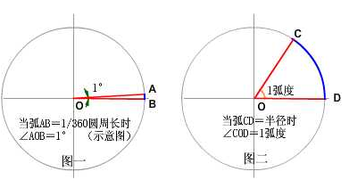
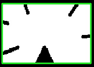
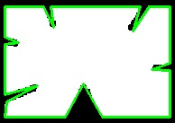
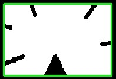
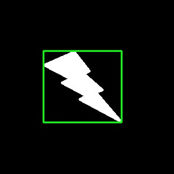
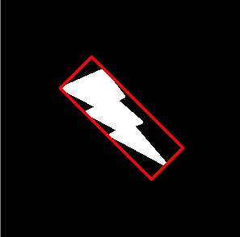

# DLH-101液晶显示屏相关问题难题资料记录文档

## 角度弧度


$$
1度＝π/180 弧度 ( ≈0.017453弧度 ) 
$$

## opencv图像处理9-轮廓2(Contours)轮廓特征(矩/轮廓面积周长/凸包/矩形/圆/椭圆边界

### 矩(moments)

可以计算如对象的质心, 面积等. 

opencv提供`cv.momnets()`函数获得图像矩信息, 结果以字典方式返回.

```python
import cv2 
import numpy as np
from matplotlib import pyplot as plt

img = cv2.imread('test.jpg',0)

ret,thresh = cv2.threshold(img,127,255,0)
im2,contours,hierarchy = cv2.findContours(thresh, 1, 2)
cnt = contours[0]
M = cv2.moments(cnt)
print M

```

结果

```python
{'mu02': 0.027777777781011537, 'mu03': -0.003703698515892029, 'm11': 106518.20833333333, 'nu02': 0.11111111112404615, 'm12': 45873849.483333334, 'mu21': 0.0018518413223027608, 'mu20': 0.027777777795563452, 'nu20': 0.11111111118225381, 'm30': 60521298.7, 'nu21': 0.010475596453453962, 'mu11': -0.013888888875953853, 'mu12': 0.0018518531772624414, 'nu11': -0.05555555550381541, 'nu12': 0.010475663515233009, 'm02': 92736.91666666666, 'm03': 39938722.7, 'm00': 0.5, 'm01': 215.33333333333331, 'mu30': -0.0037037134170532227, 'nu30': -0.020951366982159467, 'nu03': -0.020951282688462445, 'm10': 247.33333333333331, 'm20': 122347.58333333333, 'm21': 52691012.15}

```

上面的信息可获得面积和质心信息

质心公式如下:
$$
C_x = M_{10}/M_{00}\\
C_y=M_{01}/M_{00}
$$

### 轮廓面积

opencv提供` cv.contourArea()` 函数获得轮廓面积。当然也可以利用图像的矩来获取，公式M[‘m00’]，0阶矩。

```python
# -*- coding: cp936 -*-
import cv2 
import numpy as np
from matplotlib import pyplot as plt

img = cv2.imread('test.jpg',0)

ret,thresh = cv2.threshold(img,127,255,0)
im2,contours,hierarchy = cv2.findContours(thresh, 1, 2)
cnt = contours[0]
M = cv2.moments(cnt)
area = cv2.contourArea(cnt)

print area
print M['m00']
```

2种方法结果一致

```python
0.5
0.5
```

### 轮廓周长

也称弧长。opencv提供`cv.arcLength() `函数来获取周长。
它的第二个参数如果设置为true表示对象形状是闭合的，反之表示只是一条曲线。

```python
import cv2 
import numpy as np
from matplotlib import pyplot as plt

img = cv2.imread('test.jpg',0)

ret,thresh = cv2.threshold(img,127,255,0)
im2,contours,hierarchy = cv2.findContours(thresh, 1, 2)
cnt = contours[0]
perimeter = cv2.arcLength(cnt,True)

print perimeter
```

结果

```python
7.41421353817
```

### 轮廓近似(Contour Approximation)

根据我们设定的精度，可以将轮廓近似为顶点数更加少的轮廓形状。这是利用Douglas-Peucker算法来实现的。

假设我们要在图像中发现一个矩形，但是由于图像中的问题，我们得不到一个完美的矩形。现在可以利用opencv中的cv.approxPolyDP()函数来获得近似的矩形轮廓。它的第二个参数epsilon表示从原始轮廓到近似轮廓的最大距离，它是一个准确度参数。一个好的epsilon可以得到准确的轮廓近似结果。

例，观察以下图像的轮廓近似
首先观察epsilon=10%情况

```python
import cv2 
import numpy as np
from matplotlib import pyplot as plt

img = cv2.imread('1.jpg',0)

ret,thresh = cv2.threshold(img,127,255,0)
im2,contours,hierarchy = cv2.findContours(thresh, 1, 2)
cnt = contours[0]

cv2.imshow('img2',img)
cv2.waitKey(0)

epsilon = 0.1*cv2.arcLength(cnt,True)
approx = cv2.approxPolyDP(cnt,epsilon,True)
print(approx)

color= cv2.cvtColor(im2, cv2.COLOR_GRAY2BGR)
result = cv2.drawContours(color, [approx], -1, (0,255,0), 2)

cv2.imshow('result',result)
cv2.waitKey(0)
```



找到的轮廓点

```python
[[[ 10  13]]

 [[ 10 136]]

 [[193 136]]

 [[193  13]]]
```

- 注意，利用drawContours()函数画轮廓时候，必须使用[approx]。这是因为approxPolyDP()的输出是numpy array，而drawContours()的参数contours是一个list，并用numpy中的ndarray表示，两者之间有区别，需要转换。
  如果不转换，那结果只是打印了approx中包含的顶点，而不是顶点之间的连接线。
  可以打印类型测试一下

  ```python
  print type(approx)
  print type([approx])
  print([approx])
  ```

  结果如下

  ```python
  <type 'numpy.ndarray'>
  <type 'list'>
  [array([[[ 10,  13]],
  
         [[ 10, 136]],
  
         [[193, 136]],
  
         [[193,  13]]])]
  ```

再观察epsilon=1%情况

```python
epsilon = 0.01*cv2.arcLength(cnt,True)
```



结果此时近似轮廓不再是一个矩形。因为精度更加高，获得的顶点也会更多。

### 凸包(Convex Hull)

凸包与轮廓近似相似，但并不相同（有些情况可能得到相同结果）。opencv提供`cv.convexHull() `函数检查是否有凸性缺陷并纠正它。通常来说，凸性曲线总是凸出来的，或者至少是平的。如果是凹进去，那就称为凸性缺陷（convexity defects）。


如上图，观察手部。红色线就是手的凸包。双箭头指明了凸性缺陷，也就是手与轮廓的最大偏差。
函数说明如下

```python
hull = cv.convexHull(points[, hull[, clockwise[, returnPoints]]])
```

参数

- points ： 我们传入的轮廓
- hull ：输出，通常我们不需要
- clockwise ： 方向标志。如果设置为true，输出的凸包是顺时针。反之，是逆时针。
- returnPoints ： 默认为true。返回凸包上点的坐标。如果设置为false，会返回凸包点对应的轮廓的点。

例, 获得凸包

```python
import cv2 
import numpy as np
from matplotlib import pyplot as plt

img = cv2.imread('1.jpg',0)

ret,thresh = cv2.threshold(img,127,255,0)
im2,contours,hierarchy = cv2.findContours(thresh, 1, 2)
cnt = contours[0]
hull = cv2.convexHull(cnt)

print hull

color= cv2.cvtColor(im2, cv2.COLOR_GRAY2BGR)
result = cv2.drawContours(color, [hull], -1, (0,255,0), 2)

cv2.imshow('result',result)
cv2.waitKey(0)
```



结果如下

```python
[[[193 136]]

 [[ 10 136]]

 [[ 10  13]]

 [[193  13]]]
```

找到的点和轮廓近似也是一样的。

上面代码，如果要找到凸性缺陷，要把returnPoints设置为false。
例，获得凸性缺陷

```python
import cv2 
import numpy as np
from matplotlib import pyplot as plt

img = cv2.imread('1.jpg',0)

ret,thresh = cv2.threshold(img,127,255,0)
im2,contours,hierarchy = cv2.findContours(thresh, 1, 2)
cnt = contours[0]
hull = cv2.convexHull(cnt,returnPoints=False)

print(hull)
for h in hull:
    print(cnt[h])
```

### 矩形边界

#### 直矩形边界

直矩形边界，就是不用考虑物体的旋转，所以它的面积也就不是最小的。
opencv提供`cv.boundingRect()`.函数查找矩形边界。

```python
import cv2 
import numpy as np
from matplotlib import pyplot as plt

img = cv2.imread('5.jpg',0)

ret,thresh = cv2.threshold(img,127,255,0)
im2,contours,hierarchy = cv2.findContours(thresh, 1, 2)
cnt = contours[0]

x,y,w,h = cv2.boundingRect(cnt)
print(x,y,w,h)

img2 = cv2.imread('5.jpg')
cv2.rectangle(img2,(x,y),(x+w,y+h),(0,255,0),2)

cv2.imshow('result2', img2)
cv2.waitKey(0)
```



#### 旋转矩形边界

opencv提供cv.minAreaRect()函数。它返回的是Box2D结构，包含(x,y)是矩形的中心点，w矩形宽，h矩形高，以及旋转角度。
但是，绘制旋转矩形边界需要提供4个角的坐标，opencv提供`cv.boxPoints()`函数来获得。

```python
import cv2 
import numpy as np
from matplotlib import pyplot as plt


img = cv2.imread('5.jpg',0)

ret,thresh = cv2.threshold(img,127,255,0)
im2,contours,hierarchy = cv2.findContours(thresh, 1, 2)
cnt = contours[0]

rect = cv2.minAreaRect(cnt)
box = cv2.boxPoints(rect)
box = np.int0(box)

img2 = cv2.imread('5.jpg')
cv2.drawContours(img2,[box],0,(0,0,255),2)

cv2.imshow('result2', img2)
cv2.waitKey(0)
```




## DLH关键代码块

### 屏幕检测(旋转,定位)

```python
#检测屏幕位置
def detectScreen(image,thread=50,visual=False):
    '''
    检测屏幕位置
    :param image: 图像
    :param thread: 图像二值化阈值
    :param visual: 是否将结果打印出来
    :return:
    '''
    # 检测轮廓
    visual=True
    contours, hierarchy = getContours(image,thread)
    # if visual:
    #     image = cv2.drawContours(image, contours,-1, (0,255,0),3)
    #     show_img(image)
    bboxs=[]
    imgs = []
    epen_img_are=image.shape[0]*image.shape[1]#图像的面积
    print("E Pen shape:{},area:{}".format(image.shape,epen_img_are))
    for contour in contours:
        num_contour_points = contour.shape[0]
        cx, cy, bbox_w, bbox_h, angle = cnt_infos(contour)
        bbox_area = bbox_w*bbox_h
        rate_wh = bbox_w/(bbox_h+1.0)
        rate_hw = bbox_h/(bbox_w+1.0)
        rate = max([rate_wh,rate_hw])#获取box的比列
        # 过滤不合格的轮廓 w:268, h:129->area:[20000,40000], w/h:[1.5, 3.0]
        # if 20000<bbox_area<60000 and 1.5<rate<2.5 and num_contour_points<200:
        #todo 设定根据原图大小过滤contours
        if bbox_area>100:
            image = cv2.drawContours(image, contour, -1, (0, 0, 255), 3)
            show_img(image)
            #将图片旋转, 并获得变化矩阵
            # if rate_wh<1:
            #     angle = angle*-1
            #     bbox_w, bbox_h=bbox_h,bbox_w#交换长宽
            # rotate_img, MatRotation = dumpRotateImage(image,angle)
            #计算变化后的中心点坐标
            # roration_cx,roration_cy = np.dot(MatRotation,
            #                                  np.array([[cx], [cy], [1]]))
            # x1, y1 = int(roration_cx-bbox_w/2),int(roration_cy-bbox_h/2)
            # x2, y2 = int(roration_cx + bbox_w / 2), int(roration_cy + bbox_h / 2)
            #
            # #将结果保存
            # bboxs.append([x1,y1,x2,y2])#x,y,w,h
            # imgs.append(rotate_img)
            if visual:
                # 显示,绘制轮廓
                print("minArea box",[cx, cy, bbox_w, bbox_h, angle])
                print("minArea box area: {}, rate_wh:{}, num_contour_points:{}".format(bbox_area,rate_wh,num_contour_points))
                #绘制矩形
                # imgRet = cv2.rectangle(rotate_img,(x1,y1),(x2,y2), (0, 0, 255), 3)
                # show_img(imgRet)
    return imgs, bboxs
```

### 模板匹配

```python
import cv2 as cv
import numpy as np

def template_image():
    target = cv.imread("D://work//shunping.jpg")
    tpl = cv.imread("d://work//shunping_face.jpg")
    #cv.imshow("modul", tpl)
    #cv.imshow("yuan", target)
    methods = [cv.TM_SQDIFF_NORMED, cv.TM_CCORR_NORMED, cv.TM_CCOEFF_NORMED]
    th, tw = tpl.shape[:2]
    for md in methods:
        result = cv.matchTemplate(target, tpl, md)
        min_val, max_val, min_loc, max_loc = cv.minMaxLoc(result)
        if md == cv.TM_SQDIFF_NORMED:
            tl = min_loc
        else:
            tl = max_loc
        br = (tl[0] + tw, tl[1] + th)
        cv.rectangle(target, tl, br, [0, 0, 0])
        cv.imshow("pipei"+np.str(md), target)
template_image()
cv.waitKey(0)
cv.destroyAllWindows()
```


返回后咱们需要最值的位置，也即坐标 （x,y），然后根据模版（匹配的图片）宽高找到原图（x,y）对角线上另外一点.

### cv2 最小外接矩形

cv2.threshold() —— cv2.findContours() —— 轮廓检测

| name                                              | descirpe                                   |
| ------------------------------------------------- | ------------------------------------------ |
| cv2.threshold()                                   | 阈值处理                                   |
| cv2.boundingRect()                                | 最大外接矩阵                               |
| cv2.rectangle()                                   | 画出矩形                                   |
| cv2.minAreaRect()                                 | 找到最小外接矩形<br>（矩形具有一定的角度） |
| cv2.boxPoints()                                   | 外接矩形的坐标位置                         |
| cv2.drawContours(image, [box], 0, (0, 0, 255), 3) | 根据点画出矩形                             |


```python
import cv2
import numpy as np

image = cv2.imread('new.jpg')
img = cv2.cvtColor(image, cv2.COLOR_BGR2GRAY)
ret, thresh = cv2.threshold(img, 230, 255, cv2.THRESH_BINARY_INV)
contours, hierarchy = cv2.findContours(thresh, cv2.RETR_TREE, cv2.CHAIN_APPROX_SIMPLE)

for c in contours:
    # 找到边界坐标
    x, y, w, h = cv2.boundingRect(c)  # 计算点集最外面的矩形边界
    cv2.rectangle(image, (x, y), (x+w, y+h), (0, 255, 0), 2)

    # 找面积最小的矩形
    rect = cv2.minAreaRect(c)
    # 得到最小矩形的坐标
    box = cv2.boxPoints(rect)
    # 标准化坐标到整数
    box = np.int0(box)
    # 画出边界
    cv2.drawContours(image, [box], 0, (0, 0, 255), 3)
    # 计算最小封闭圆的中心和半径
    (x, y), radius = cv2.minEnclosingCircle(c)
    # 换成整数integer
    center = (int(x),int(y))
    radius = int(radius)
    # 画圆
    cv2.circle(image, center, radius, (0, 255, 0), 2)

cv2.drawContours(image, contours, -1, (255, 0, 0), 1)
cv2.imshow("img", image)
cv2.imwrite("img_1.jpg", image)
cv2.waitKey(0)
```

## 感知哈希算法(pHash)

平均哈希算法过于严格, 不够精确. 为获得更精确的结果, 可以旋转感知哈希算法, 它采用的DCT(离散余弦变换)来降低频率的方法

- 一般步骤

  1. 缩小图片: 32x32是一个较好的大小, 这样方便DCT计算
  2. 转化为灰度图: 把缩放后的图片转为256阶的灰度图
  3. 计算DCT: DCT把图片分离成分率的集合
  4. 计算平均值: 计算缩小DCT后的所有像素点的平均值
  5. 进一步减少DCT: 大于平均值记录为1, 反之记录为0]
  6. 得到指纹信息: 记录64个信息为, 顺序随意保持一致性
  7. 最后对比两张图片的指纹, 获得汉明距离即可

  "汉明距离(Hamming distance)" 在信息论中, 两个等长字符串之间的汉明距离是两个字符串对应位置的不同字符的个数.

  ```python
  import cv2
  import numpy as np
  from compiler.ast import flatten
  import sys
  
  def pHash(imgfile):
      """get image pHash value"""
      #加载并调整图片为32x32灰度图片
      img=cv2.imread(imgfile, 0) 
      img=cv2.resize(img,(64,64),interpolation=cv2.INTER_CUBIC)
  
          #创建二维列表
      h, w = img.shape[:2]
      vis0 = np.zeros((h,w), np.float32)
      vis0[:h,:w] = img       #填充数据
  
      #二维Dct变换
      vis1 = cv2.dct(cv2.dct(vis0))
      #cv.SaveImage('a.jpg',cv.fromarray(vis0)) #保存图片
      vis1.resize(32,32)
  
      #把二维list变成一维list
      img_list=flatten(vis1.tolist()) 
  
      #计算均值
      avg = sum(img_list)*1./len(img_list)
      avg_list = ['0' if i<avg else '1' for i in img_list]
  
      #得到哈希值
      return ''.join(['%x' % int(''.join(avg_list[x:x+4]),2) for x in range(0,32*32,4)])
  ```

- 离散余玄变换(DCT)

离散余弦变换(Discrete Cosine Transform, DCT)是图像频域变换的一种, 它类似于离散傅里叶变换. 离散余弦变换相当于一个长度大概是它两倍的离散傅里叶变换, 但是离散余弦变换只使用实数. 

变换后DCT系数能量主要集中再左上角, 其余部分系数接近于0, 因此DCT具有适用于图像压缩的特性, 用于对信号和图像进行有损压缩.

f(x,y)是空间域二维向量知元素, x,y=01,2,3,....; F(u,v)是变换系数阵列之元素. 
$$
F(u,v) = \frac{2}{N}\sum_{x=0}^{N-1}\sum_{y=0}^{N-1}f(x,y)cos\frac{(2x+1)u\pi}{2N}*cos\frac{(2y+1)v\pi}{2N}
$$

- DCT实现

  ```python
  cv2.i吗read(src,flag)
  #离散余弦变换
  cv2.dct(src)
  #反离散余弦变换
  cv2.idct(src)
  ```

  

- 傅里叶变换

  正弦波
  $$
  f(t)=Asin(wt+\varphi)+k
  $$
  A:表示振幅

  w:表示角速度, 角速度和频率是对应关系.

  \phi: 表示相位, sin和cos表示正选函数的差别

  k: 是这个正弦波的偏移,(这个波再y轴上如何上下移动)

## 卷积

- 定义

$(f*g)(n)$为$f,g$的卷积

其连续定义: 
$$
(f*g)(n)=\int f(\tau)g(n-\tau)d\tau
$$
离散定义
$$
(f*g)(n)=\sum_{\tau =-\infty}^{\infty}f(\tau)g(n-\tau)
$$
符号约定


二维离散卷积公式
$$
(f*g)(u,v)\sum_i \sum_j f(i,j)g(u-i,v-j)=\sum_i \sum_j a_{i,j}b_{u-i,v-j}
$$


首先再原始图像中取出(u,v)矩阵:
$$
\quad f=\left[\begin{array}{ccc}a_{u-1,v-1} & a_{u-1,v} & a_{u-1,v+1} \\ a_{u,v-1} & a_{u,v} & a_{u,v+1} \\a_{u+1,v-1} & a_{u+1,v} & a_{u+1,v+1}\end{array}\right]
$$
然后将图像处理矩阵翻转:

原始矩阵:


翻转后的矩阵: $\quad g^{\prime}=\left[\begin{array}{ccc}b_{1,1} & b_{1,0} & b_{1,-1} \\ b_{0,1} & b_{0,0} & b_{0,-1} \\ b_{-1,1} & b_{-1,0} & b_{-1,-1}\end{array}\right]$
(1) 先沿x轴動转, 再沿y轴翻转
$$
g=\left[\begin{array}{ccc}
b_{-1,-1} & b_{-1,0} & b_{-1,1} \\
b_{0,-1} & b_{0,0} & b_{0,1} \\
b_{1,-1} & b_{1,0} & b_{1,1}
\end{array}\right] \Rightarrow \quad\left[\begin{array}{ccc}
b_{1,-1} & b_{1,0} & b_{1,1} \\
b_{0,-1} & b_{0,0} & b_{0,1} \\
b_{-1,-1} & b_{-1,0} & b_{-1,1}
\end{array}\right] \Rightarrow\left[\begin{array}{rcc}
b_{1,1} & b_{1,0} & b_{1,-1} \\
b_{0,1} & b_{0,0} & b_{0,-1} \\
b_{-1,1} & b_{-1,0} & b_{-1,-1}
\end{array}\right]=g^{\prime}
$$
(2) 先沿y轴翻转, 再沿x轴翻转
$$
g=\left[\begin{array}{ccc}
b_{-1,-1} & b_{-1,0} & b_{-1,1} \\
b_{0,-1} & b_{0,0} & b_{0,1} \\
b_{1,-1} & b_{1,0} & b_{1,1}
\end{array}\right] \Rightarrow>\left[\begin{array}{ccc}
b_{-1,1} & b_{-1,0} & b_{-1,-1} \\
b_{0,1} & b_{0,0} & b_{0,-1} \\
b_{1,1} & b_{1,0} & b_{1,-1}
\end{array}\right] \Rightarrow\left[\begin{array}{ccc}
b_{1,1} & b_{1,0} & b_{1,-1} \\
b_{0,1} & b_{0,0} & b_{0,-1} \\
b_{-1,1} & b_{-1,0} & b_{-1,-1}
\end{array}\right]=g^{\prime}
$$
计算卷积时, 就可以用 $f$ 和 $g^{\prime}$ 的内积:
$$
\begin{aligned}
&f * g(u, v)=a_{u-1, v-1} \times b_{1,1}+a_{u-1, v} \times b_{1,0}+a_{u-1, v+1} \times b_{1,-1} \\
&+a_{u, v-1} \times b_{0,1}+a_{u, v} \times b_{0,0}+a_{u, v+1} \times b_{0,-1} \\
&+a_{u+1, v-1} \times b_{-1,1}+a_{u+1, v} \times b_{-1,0}+a_{u+1, v+1} \times b_{-1,-1}
\end{aligned}
$$
上述公式有一个特点, 做乘法的两个对应变量a,b的小标之后都是(u,v)

以上计算的是(u,v)处的卷积, 沿x轴或y轴滑动, 就可以求出图像各个位置的卷积, 其输出结果是处理以后的图像(即经过平滑, 边缘提取等各种处理的图像)

推二广之, 如果g矩阵不是3x3, 而是7x7, 那么我们就要在原始图像中取以(u,v)为中心的7x7矩阵进行计算. 由此可见, 这种卷积就是把原始图像中的相邻像素都考虑进行, 进行混合. 相邻区域的范围取决于g矩阵的维度, 维度越大, 涉及的周边像素越多. 而矩阵的设计, 决定了这种混合输出的图像跟原始图像笔, 究竟是模糊, 还是更锐利.

比如, 如下图像处理矩阵将使得图像变得更为平滑, 显得更模糊, 因为它联合周边像素进行平均处理.

$\quad g^{\prime}=\left[\begin{array}{ccc} \frac{1}{9} & \frac{1}{9} & \frac{1}{9} \\ \frac{1}{9} & \frac{1}{9} & \frac{1}{9} \\ \frac{1}{9} & \frac{1}{9} & \frac{1}{9}\end{array}\right]$

而如下图像处理矩阵将使得像素值变化明显的地方更为明显, 强化边缘, 而变化平缓的地方没有影响, 达到边缘提取的目的:

$\quad g^{\prime}=\left[\begin{array}{ccc} -1 & -1 & -1 \\ -1 & 9 & -1 \\ -1 & -1 & -1\end{array}\right]$

## 参考

- [opencv 轮廓特征](https://blog.csdn.net/weixin_42555985/article/details/97115338)
- [Contour feature](https://docs.opencv.org/3.4.1/dd/d49/tutorial_py_contour_features.html)

