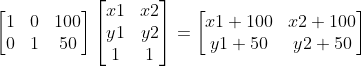

# python-opencv 图像平移旋转变换、以及图像旋转前后坐标值映射关系

图像的平移，旋转变换以及仿射与投影都需要先定义转换矩阵，然后使用cv2.warpAffine()根据变换矩阵完成转换

```python
imgRotation = cv2.warpAffine(img, mat,(widthNew,heightNew),borderValue=(255,255,255))
```

其中，参数的定义如下表：

| name                      | describe             |
| ------------------------- | -------------------- |
| img                       | 需要变换的图像       |
| mat                       | 转换矩阵             |
| (widthNew, heightNew)     | 转换后图像尺寸       |
| borderValue=(255,255,255) | 转换后空白区域填充色 |

注：　转换矩阵mat可以自己定义也可以直接使用opencv内置的函数得到想要的转换矩阵。一般直接使用opencv的内置函数比较方便。

## 一、图像平移变换

平移变换就是像素坐标x,y的加减运算，假设有两个点坐标pt1=(x1,y1),pt2=(x2,y2)

平移转换矩阵可以定义为TranslationMatrix =[[1, 0, 100],[0, 1, 50]] 

左乘转换矩阵可以得到平移变换后的坐标值，矩阵运算的过程如下，其他旋转转换矩阵运算类似。



## 二、图像旋转变换

图像旋转变换需要先确定旋转中心，旋转角度。如果使用图像某一角作为旋转中心会出现某点落在同一位置，某些位置是空白的问题。为避免这个问题，通常使用**图像的中心作为旋转中心**。

旋转矩阵可由`cv2.getRotationMatrix2D()`得到，注意`degree`是角度值，不是弧度值。

```python
cv2.getRotationMatrix2D((width//2, height//2), degree, 1)
```


 下面给出给定图像和旋转角度求旋转后图像的例子

```python
def dumpRotateImage(img,degree):
    height, width = img.shape[:2]
    heightNew = int(width * fabs(sin(radians(degree))) + height * fabs(cos(radians(degree))))
    widthNew = int(height * fabs(sin(radians(degree))) + width * fabs(cos(radians(degree))))
    matRotation = cv2.getRotationMatrix2D((width//2, height//2), degree, 1)#得到旋转矩阵
    imgRotation = cv2.warpAffine(img, matRotation,(widthNew,heightNew),borderValue=(255,255,255))

    return imgRotation
```
其中，heightNew和widthNew是旋转后图像的新尺寸。matRotation是以图像为中心，角度为degree的旋转矩阵。新尺寸的计算方法直接看图：


然后使用`cv2.warpAffine()`以该旋转矩阵旋转图像，这里需要注意必须使用原图像为旋转中心，旋转后的图像：


可以看到有部分图像像素点落在了图像区域外。为什么回落到图像外？是因为无论是对于新图像还是老图像，坐标系原点是图像左上角。所以图像旋转后会有一部分的像素值落在新图像之外。看图（阴影表示原图像，虚线区域表示旋转后的图像尺寸大小）：


为避免这个问题可以在该旋转矩阵中加入平移操作，使得原图旋转后完全落在图像图像中。平移量上图已经给出了。 

代码：

```python
def dumpRotateImage(img,degree):
    height, width = img.shape[:2]
    heightNew = int(width * fabs(sin(radians(degree))) + height * fabs(cos(radians(degree))))
    widthNew = int(height * fabs(sin(radians(degree))) + width * fabs(cos(radians(degree))))
    matRotation = cv2.getRotationMatrix2D((width//2, height//2), degree, 1)
    #加入平移操作
    matRotation[0,2] += (widthNew - width)//2
    matRotation[1,2] += (heightNew - height)//2
    imgRotation = cv2.warpAffine(img, matRotation,(widthNew,heightNew),borderValue=(255,255,255))

    return imgRotation
```

加入平移操作后旋转图像的结果：可以看到女神已经位于图像中心了


## 三、图像旋转前后的坐标映射关系

（１）原图像某点坐标P -> 旋转后图像坐标Q

假设某点坐标为P(x,y)，旋转矩阵为matRotation，旋转后图像坐Q可直接有P左乘matRotation得到

```python
Q = np.dot(MatRotation,np.array([[P[0]],[P[1]],[1]]))
```


（２）旋转后图像坐标Q -> 原图像某点坐标P

可以使用`cv2.invertAffineTransform`得到变换矩阵的逆矩阵reverseMatRotation

假设旋转后图像某点坐标值为Q(x,y)，旋转矩阵逆矩阵为reverseMatRotation，在原图像中的坐标可有Q左乘reverseMatRotation得到

```python
reverseMatRotation = cv2.invertAffineTransform(matRotation)
P = np.dot(reverseMatRotation,np.array([[Q[0]],[Q[1]],[1]]))
```


如下图四个点坐标：

 

经过下面代码计算后：

```python
import cv2
from math import *
import numpy as np

def dumpRotateImage(img,degree):
    height, width = img.shape[:2]
    heightNew = int(width * fabs(sin(radians(degree))) + height * fabs(cos(radians(degree))))
    widthNew = int(height * fabs(sin(radians(degree))) + width * fabs(cos(radians(degree))))
    matRotation = cv2.getRotationMatrix2D((width//2, height//2), degree, 1)
    #matRotation[0,2] += (widthNew - width)//2
    #matRotation[1,2] += (heightNew - height)//2
    imgRotation = cv2.warpAffine(img, matRotation,(widthNew,heightNew),borderValue=(255,255,255))

    matRotation2 = cv2.getRotationMatrix2D((widthNew//2, heightNew//2), degree, 1)
    imgRotation2 = cv2.warpAffine(img, matRotation2, (widthNew, heightNew), borderValue=(255, 255, 255))
    return imgRotation,imgRotation2, matRotation

def draw_box(img,box):
    cv2.line(img, (box[0], box[1]), (box[2], box[3]), (0, 255, 0), 3)
    cv2.line(img, (box[0], box[1]), (box[4], box[5]), (0, 255, 0), 3)
    cv2.line(img, (box[2], box[3]), (box[6], box[7]), (0, 255, 0), 3)
    cv2.line(img, (box[4], box[5]), (box[6], box[7]), (0, 255, 0), 3)
    return img

image = cv2.imread('/home/fangsh/Pictures/timg.jpeg')
imgRotation, imgRotation2, matRotation = dumpRotateImage(image, 45)
box = [200,250,250,200,230,280,280,230]

reverseMatRotation = cv2.invertAffineTransform(matRotation)
pt1 = np.dot(reverseMatRotation,np.array([[box[0]],[box[1]],[1]]))
pt2 = np.dot(reverseMatRotation,np.array([[box[2]],[box[3]],[1]]))
pt3 = np.dot(reverseMatRotation,np.array([[box[4]],[box[5]],[1]]))
pt4 = np.dot(reverseMatRotation,np.array([[box[6]],[box[7]],[1]]))

print(pt1, pt2, pt3, pt4)
box2 = [pt1[0],pt1[1],pt2[0],pt2[1],pt3[0],pt3[1],pt4[0],pt4[1]]

cv2.imwrite('/home/fangsh/drawBox.png',draw_box(imgRotation,box))
cv2.imwrite('/home/fangsh/raw.png',draw_box(image,box2))
#cv2.waitKey(0)
```


在旋转后图像中的矩阵框使用旋转矩阵逆矩阵可求得在原图像中的位子，结果如下：


## 参考

原文链接：https://blog.csdn.net/MrR1ght/article/details/89196611

