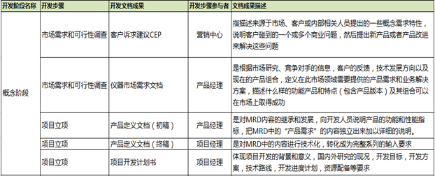
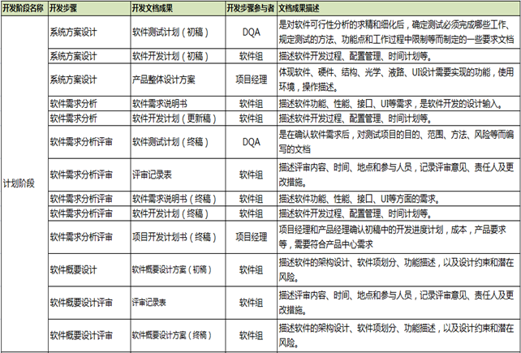
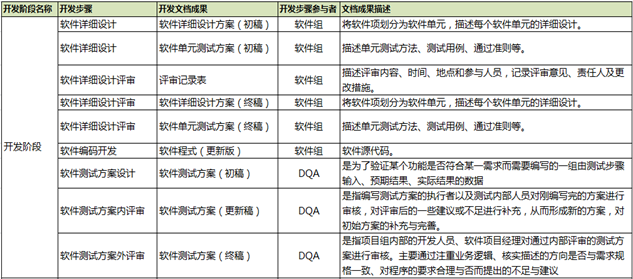
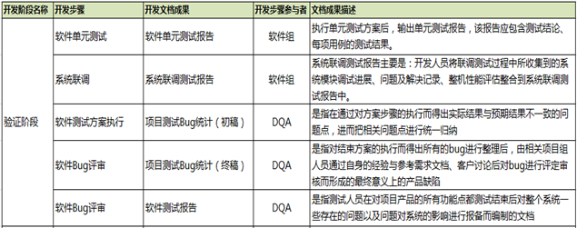
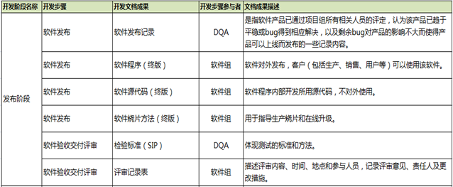
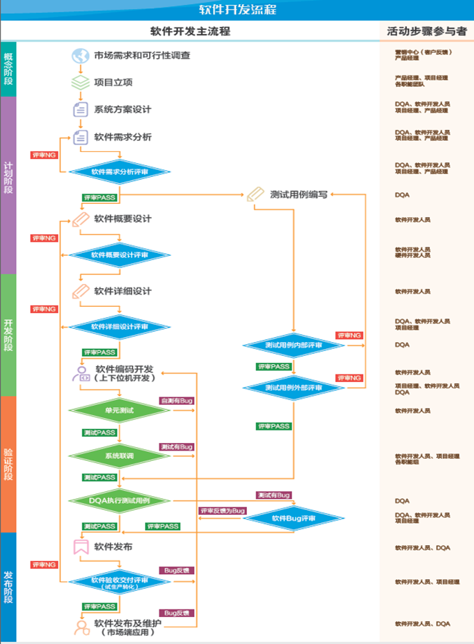

# 软件开发流程规范

## 职责

- 项目经理
  - 根据项目特点, 选定项目团队成员, 成立项目组, 安排任务分工.
  - 与产品经理, 市场人员进行沟通和协调业务需求和非业务需求方面, 进行需求调研汇总需求分析文档, 并编写系统总体设计方案
  - 主持项目团队成员一起指定软件开发计划, 包括软件需求, 设计, 编码, 测试这几个阶段的计划.
  - 负责组织项目成员汇总, 修订, 审核, 提交项目生命周期内所有评审节点的评审申请, 评审报告, 产品相关文档, 并参与公司立项会后的项目软件评审工作.
  - 负责持续跟踪, 协调, 监控项目软件开发工作及进度.
- 产品经理
  - 主导市场调查和分析, 收集和整理用户对产品的需求, 编写仪器市场需求文档, 并与项目经理一起编写参评定义文档
  - 跟踪目标市场的变化和竞争对手的动向, 及时将需求变更情况反馈给项目经理.
- DQA
  - 参与项目可行性调查评审, 软件需求分析评审, 软件设计&测试方案评审, 软件交付&验收评审会, 负责节点评审工作
  - 根据项目计划和软件需求说明书, 编写软件测试计划和软件测试方案
  - 负责对软件系统的功能, 性能, 异常进行测试并记录及保留测试工作所方向的bug, 并追踪bug改善至结案.
  - 编写测试报告和检验标准
- 软件组
  - 负责软件模块的概要设计, 详细设计方案以及输出相应开发文档及记录, 完成软件设计开发.
  - 参与项目可行性调查评审, 软件需求分析评审, 软件设计&测试方案评审, 软件交付&验收评审会,负责节点评审工作.
  - 负责依据项目需求说明进行软件需求说明书的设计编写以及软件后期维护.
  - 负责与项目经理保持沟通, 确认软件模块的项目开发计划, 开发进程, 开发资源等.
  - 负责与测试人员的交互, 处理DQA人员在系统测试过程中所发现的bug问题. 
- 定义
  - 软件需求说明书: 描述软件功能, 性能, 接口, UI等需求, 时软件开发的设计输入.
  - DAQ: 设计质量保证(Design Quality Assurance)的缩写
  - PDD: 产品定义文档(Product Define Document) 的缩写, PDD是对MRD内容的继承和发展, 向开发人员说明产品的功能和性能指标, 把MRD中的"产品需求"的内容独立出来加以详细说明.
  - MRD: 市场需求文档(market Requirements Documetn)的缩写. 市场需求文档的主要功能是描述什么样的功能和特点的参评可以在市场上取得成功. 
  - 项目测试bug统计: 是指将软件程序测试过程中发现的软件缺陷或问题汇集到一张清单表.

## 程序

软件概念阶段(可行性研究)-->计划阶段(立项 + 需求分析 + 概要设计) -->  开发阶段 (详细设计) --> 验证阶段 --> 发布阶段

- 概念阶段

- 计划阶段发

  

- 开发阶段

  

- 验证阶段

  

- 发布阶段

  

# 项目评审

## 概念阶段

| 名称                    | 内容                                                   |
| ----------------------- | ------------------------------------------------------ |
| 研发背景及目标          | 对整个项目功能, 预期用途, 市场目标做一个初步的总结描述 |
| 市场分析                | 产品规模, 参评周期, 竞品分析                           |
| 参评策略及产品构想      | 新品方案, 解决的痛点                                   |
| 产品规格与参数          |                                                        |
| 产品竞争优势分析        | 成本分析                                               |
| 盈收预测与项目资源投入  |                                                        |
| 初步风险评估            | 技术风险, 市场风险, 专利风险                           |
| 阶段性交付成果/项目成员 | 初步的项目成员工作职责分布 阶段性交付计划           |

## 计划阶段

| 名称                         | 内容                                                         |
| ---------------------------- | ------------------------------------------------------------ |
| 研发综述                     | 整体项目功能, 预期用途, 应用场景等进行描述                   |
| 开发方案                     | 整体项目开发思路 - 仪器: 技术原理, 开发具体方案, 具体产品规格 - 系统: 仪器和试剂的匹配性, 制造可行性, 难点 |
| 注册策略                     |                                                              |
| 产品竞争分析                 | 从研发角度分析我们产品技术竞争优势                           |
| 风险评估                     |                                                              |
| 成本预算, 项目资源投入       |                                                              |
| 阶段性交付成功及详细开发计划 |                                                              |

## 开发阶段

### 原理样机

| 名称             | 内容                                                         |
| ---------------- | ------------------------------------------------------------ |
| 仪器项目整体介绍 | 对整个项目功能, 预期用途, 市场目标做一个初步的总结描述. 以及研发计划和实际进度 |
| 需求实现状态     | 需求实现率. 将立项标准, 注册标准, 实际研发标准, 三者性能参数对比分析 |
| 仪器系统设计     | 各模块设计原理讲解                                           |
| 仪器设计验证     | 原理样机测试报告 单元测试, 模块集成测试,  模块系统测试 测试遗留问题分析, 对策, 以及改进计划 |
| 风险识别评估     | 技术遗留风险分析/物料风险                                    |
| 仪器成本分析     | 原理样机成功以及后期成本预估                                 |

### 功能样机

| 名称             | 内容             |
| ---------------- | ---------------- |
| 仪器项目整体介绍 |                  |
| 需求实现状态     | 三项性能参数对比 |
| 仪器系统设计     |                  |
| 仪器设计验证     |                  |
| 风险识别         |                  |

### 功能样机-2

| 名称           | 内容                                     |
| -------------- | ---------------------------------------- |
| 仪器成本法分析 | 功能样机成本以及后期成本预估             |
| 试产准备       | 试产条件 制造条件, 可制造性, 人员安排 |
| 注册及知识产权 |                                          |

## 验证阶段

### 工程样机-1

| 名称                   | 内容                                                         |
| ---------------------- | ------------------------------------------------------------ |
| 仪器项目整体介绍       |                                                              |
| 需求实现状态           | 工程样机是否已经满足所有市场需求                             |
| 仪器系统设计           | 系统整体设计简述 关键器件列表以及供应商稳定确认 物料承接情况 |
| 仪器设计验证           | 所有的测试问题是否都已经有分析及对策 工程样机是否有和试剂匹配测试  |
| 竞争优势及风险识别评估 |                                                              |

### 工程样机-2

| 名称           | 内容                             |
| -------------- | -------------------------------- |
| 仪器成本分析   | 工程样机成本以及后期量产成本预估 |
| 注册及知识产权 | 注                               |

# 新产品试产流程与管理规范

## 职责

- 项目经理
  - 项目运作的窗口, 负责项目整体计划的指定与实施
  - 主导研发收集和发布, 为试产工作提供必要输入
  - 新产品量产后宣布试产组织自动解散.
- 仪器工程部
  - 作成试产三级计划, 主导试产活动展开, 组织试产启动会议
  - 主导试产前准备工作(人, 机, 物...)
  - 试产后组织试产总结会议
- 仪器研发
  - 总体负责试产过程中技术问题的解决和跟进
  - 试产前输出立项资料, 正式图纸, BOM, 软件等
  - 根据试产情况进行相关设计变更, 并更新技术文件
- 质量中心
  - 负责编制和受控, 对试产样机进行可靠性测试, 输出样机测试报告.
  - 编制来料检验SOP和成品检验SOP.
- 采购部
  - 负责物料的报价, 货源维护, 反馈物料交期
  - 负责所需物料采购, 联络项目开发所需的外协加工
- 仪器制造
  - 试生产物料计划下达, 汇总跟进物料交期
  - 生产订单的编制和下达

