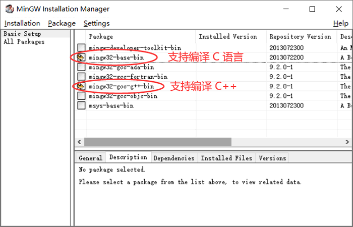

# 常用软件安装

- [Snipaste](https://www.snipaste.com/download.html#)
  - [简介](https://zhuanlan.zhihu.com/p/265804710)
  
- [everything](https://www.voidtools.com/Everything-1.4.1.1009.x64-Setup.exe)

- [pycharm](https://www.jetbrains.com/pycharm/download/download-thanks.html?platform=windows)

- [typora](https://typora.io/#windows)
  - [简介](https://sspai.com/post/54912)
  
- ## [git](https://git-scm.com/download/win)

# Git 配置

## 安装Git

- 下载[git](https://git-scm.com/download/win)
- 安装

git内置了10中编辑器`Atom,Notepad, Notepad++,Sublime,Text, Visual Studio Code, Vim`


始菜单找到`git-->Git Bash`


- 详细解释参考[Git详细安装教程](https://blog.csdn.net/mukes/article/details/115693833)

## git配置

```git
git config --global user.name "kuisu"
git config --global user.email "kuisu_dgut@163.com"
git config --list#查看配置
```


## 创建版本库

你可以简单理解成一个目录，这个目录里面的所有文件都可以被Git管理起来，每个文件的修改、删除，Git都能跟踪，以便任何时刻都可以追踪历史，或者在将来某个时刻可以“还原”。

- 初始化仓库

```git
$ mkdir newgit
$ cd newgit
$ pwd
$ git init#将此目录变成git可管理的仓库
```


- 将文件提交到仓库

编辑一个`reademe.txt`文件,并提交到仓库

```git
$ git config --global core.autocrlf false
```


```git
$ git add readme.txt
$ git commit -m "write a readme file"#提交注释
```


- [python二级考试](http://ncre.neea.edu.cn/res/Home/1808/31bbb56a542229f36d1f4a594f9147a6.rar)

- [notepad++](https://notepad-plus-plus.org/downloads/)

- [福昕阅读器](https://file.foxitreader.cn/file/Channel/reader/foxitxz_GA_NoFinishPage_FoxitInst.exe)

- [python3.7.4](https://www.python.org/downloads/release/python-374/)

- [mathpix](https://mathpix.com/)
  - [简介](https://zhuanlan.zhihu.com/p/63918634)
  
- ## [cmder](https://cmder.net/)

# cmder使用

1. 配置环境变量
2. 添加cmder在快捷菜单

```cmd
cmder /REGISTER ALL
```

3. 设置中文编码

`右击cmder窗口-->setting-->Start-up-->environment`然后加入

```
set LANG=zh_CN.UFT8
```

4. cmder删除(管理员身份)

```cmd
Cmder.exe /UNREGISTER ALL
```

- [参考](https://blog.csdn.net/sdujava2011/article/details/84344876)

# MinGW安装

- 下载[MinGW](https://osdn.net/projects/mingw/downloads/68260/mingw-get-setup.exe/)

- 安装
  - 关键图



- 选择完成后,在菜单栏中选择`Installation-->Apply Changes`
- 配置MinGW的环境变量
- 在cmd中测试

```cmd
gcc -v
```

- 实例

  存储为`demo.c`

  ```c++
  #include <stdio.h>
  #include <stdlib.h>
  int main(){
      printf("Hello, World!");
      system("pause");
      return 0;
  }
  ```

  在命令窗口中执行如下命令

  ```cmd
  gcc demo.c -o demo.exe
  ```

  在当前盘生成一个demo.exe可执行文件,双击则执行.

  

  ## 参考

- [MinGW下载和安装教程](http://c.biancheng.net/view/8077.html)

# VS code

- 下载[Visual Studio Code](https://code.visualstudio.com/)
- 安装VS code, 并添加到环境变量
