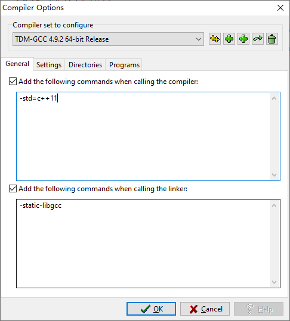

# 软件安装

- [Snipaste](https://dl.snipaste.com/win-x64-beta)

- [Typora](https://typora.io/#windows)
- [Notepad++](https://github.com/notepad-plus-plus/notepad-plus-plus/releases/download/v7.9.5/npp.7.9.5.Installer.x64.exe)
- [福昕pdf阅读器](https://file.foxitreader.cn/file/Channel/reader/foxitxz_GA_NoFinishPage_FoxitInst.exe)
- [everything](https://www.voidtools.com/Everything-1.4.1.1009.x64-Setup.exe)

## 安装pytorch存在的问题

### 问题

```python
Microsoft Visual C++ Redistributable is not installed, this may lead to the DLL load failure.
It can be downloaded at https://aka.ms/vs/16/release/vc_redist.x64.exe

---------------------------------------------------------------------------
OSError   Traceback (most recent call last)
<ipython-input-1-eb42ca6e4af3> in <module>
----> 1 import torch

"D:\Program Files\Python37\lib\site-packages\torch\__init__.py", line 127, in <module>
    125                 err = ctypes.WinError(ctypes.get_last_error())
    126                 err.strerror += ' Error loading "{}" or one of its dependencies.'.format(dll)
--> 127                 raise err
    128 
    129     kernel32.SetErrorMode(prev_error_mode)

OSError: [WinError 126] 找不到指定的模块。 Error loading "E:\Softwares\anaconda3\envs\RL36\lib\site-packages\torch\lib\asmjit.dll" or one of its dependencies.
```

### 解决方案

- 下载[VC_redist](https://aka.ms/vs/16/release/vc_redist.x64.exe)

## 参考

-[import torch 报错：OSError: [WinError 126] 找不到指定的模块](https://blog.csdn.net/m0_37864815/article/details/108964763)


# 程序化安装离线库

```python
import os
#将离线库下载到当前文件夹中
libs = ["future-0.16.0.tar.gz", "pefile-2018.8.8.tar.gz",\
        "jieba-0.39.zip", "PyInstaller-3.3.1.tar.gz"]
try:
    for lib in libs:
        os.system("pip install "+lib)
    print("安装成功！")        
except:
    print("安装失败，请重试")
```

# C++

## 再Dev-cpp中使用c++11 中的函数

C++11常用的函数stoi, to_sting, unoredered_map, unoredered_set, auto. 

`工具-->编译选项-->编译器-->编译器时加入这个命令-->std=c++11`




# Git

# Python

## 安装pydensecrf

做图像分割时需要用到条件随机场CRF，由于机器环境为py3.7，直接搜索问题没有查找到合适的解决方案，自己整理一份吧。

在该链接https://www.lfd.uci.edu/~gohlke/pythonlibs/#pydensecrf中下载对应版本的.whl


最后在Anaconda prompt中运行pip install D:xx\xxxx.whl就安装完成了。


## jupyter

> 解决启动jupyter lab/notebook时，报错“ValueError: signal only works in main thread”问题

问题描述: 

```python
RuntimeError: This event loop is already running
...
 
ValueError: signal only works in main thread
ERROR:tornado.general:Uncaught exception in zmqstream callback
...
 
```

- 问题原因

造成此问题的原因主要是由于安装了模块“**google-colab**”后造成的模块冲突。安装时会将tornado、ipykernel、ipython等模块降级，导致jupyter启动出现问题。

- 解决方案

将tornado、ipykernel、ipython模块更新到最新版本。其中，更新ipykernel时，会直接更新ipython模块。因此，执行以下命令即可。

```cmd
pip install tornado --upgrade
pip install ipykernel --upgrade
```

