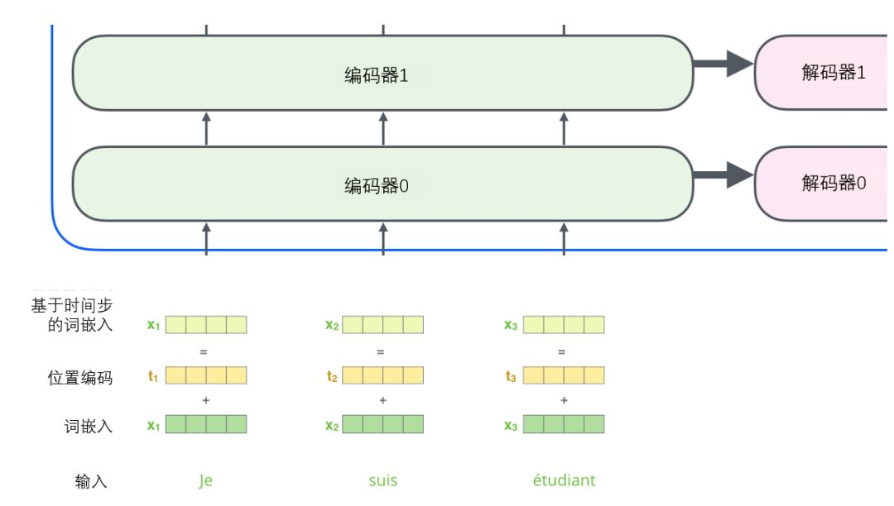

# transformer

## 宏观视角

首先将这个模型看成是一个黑箱操作. 在机器翻译中, 就是输入一种预研, 输出另一种预研


那么拆开这个黑箱, 我们可以看到它是由编码组件, 解码组件和他们之间的连接组成


编码组件部分由一堆编码器(encoder)构成. 解码组件部分也是由相同数量(与编码器对应)的解码器(decoder)组成的.


所有的编码器在结构上都是相同的, 但他们没有共享参数. 每个解码器都可以分解成两个子层.


从编码器输入的句子首先会经过一个子注意力(self-attention)层, 这层帮助编码器在对每个单词编码时关注输入句子的其它单词. 我们将在稍后的文章中更深入地研究自注意力.

自注意力层的输出会传递到前馈(feed-forward)神经网络中. 每个位置的单词对应的前馈神经网络都完全一样(注: 另一种解读就是一层窗口为一个单词的一维卷积神经网络)

解码器中也有编码器的自注意力层(self-attention)和前馈(feed-forward)层. 除此之外, 这两个层之间还有一个注意力层, 用来关注输入句子的相关部分(和seq2seq模型的注意力作用相似)


## 将张量引入图景

现已经了解模型的主要部分, 接下来看一下各种向量或张量是怎样在模型的不同部分中, 将输入转化为输出的. 想大部分NLP应用一样, 首先将每个输入单词通过词嵌入算法转换为词向量.


每个单词都被嵌入为512维的向量, 我们用这些简单的方框来表示这些向量.

词嵌入过程中只发生在最底层的编码器中. 所有的编码器都有一个相同的特点, 即它们接收一个向量列表, 列表中的每个向量大小维512维. 在底层(最开始)编码器中它就是词向量, 但是在其它编码器中, 它就是下一层编码器的输出(也是一个向量列表). 向量列表大小是我们可以设置的超参数--一般是我们训练集中最长句子的长度.

将输入序列进行词嵌入之后, 每个单词都会流经编码器中的两个子层.


接下来看看Transformer的一个核心特性, 在这里输入序列中每个位置的单词都有自己独特的路径流入编码器. 在自注意力层中, 这些路径之间存在依赖关系. 而前馈(feed-forward)层没有这些依赖关系. 因此在前馈(feed-forward)层时可以并行执行各种路径.

接下来通过一个更短句子为例, 看看编码器的每个子层中发生了什么.

## 编码

如上述以提到, 一个编码器接收向量列表作为输入, 接着将向量列表中的向量传递到自注意力层进行处理, 然后传递到前馈神经网络中, 将输出结果传递到下一个编码器中.

输入序列的每个单词都经过自编码过程. 然后, 他们各自通过前向传播神经网络--完全相同的网络, 而每个向量都分别通过它.

## 从宏观视角看自注意力机制

例如, 下列句子时想要翻译的输入句子

> The animal didn't cross the street because it was too tired

这个"it"在这个句子是指什么了?它指的是street还是这个animal了?这对于人类来说是一个简单的问题, 但是对于算法则不是.

当模型处理这个单词"it"的时候, 自注意力机制会允许"it"与"animal"建立联系.

随着模型处理输入序列的每个单词, 自注意力会关注整个输入序列的所有单词, 帮助模型对本单词更好地进行编码. 如果熟悉RNN(循环神经网络), 回忆一下它是如何维持隐藏层的. RNN会将它已经处理过的前面的所有单词/向量的表示与它正在处理的当前单词/向量结合起来. 而自注意力机制会将所有相关单词的理解融入到我们正在处理的单词中.

当我们在编码器中编码"it"这个单词的时候, 注意力机制的部分会去关注"The Animal", 将它的表示的一部分编入"it"的编码中. 可以通过检查`Tensor2Tensor notebook`, 在里面可以下载一个transformer模型, 并用交互式可视化的方式来检验.

## 从微观视角看注意力机制

首先我们了解一下如何使用向量来计算子注意力, 然后来看看它实现怎样用矩阵来实现.

计算自注意力的第一步就是从每个编码器的输入向量(每个单词的词向量)中生成三个向量. 也就是说对于每个单词, 我们创造一个查询向量, 一个键向量和一个值向量. 这三个向量是通过词嵌入与三个权重矩阵后相乘创建的. 

可以发现这些新向量在维度上比词嵌入向量更低. 他们的维度是64, 而词嵌入和编码器的输入/输出向量的维度是512. 但实际上不强求维度更小, 这只是一种基于架构上的选择, 它们可以使多头注意力(multiheaded attention)的大部分计算保持不变.


X1与$W^Q$权重矩阵相乘得到q1, 就是与这个单词相关的查询向量. 最终使得输入序列的每个单词的创建一个查询向量, 一个键向量和一个值向量.

**什么是查询向量, 键向量和值向量**

它们都是有助于计算和理解注意力机制的抽象概念. 计算自注意力的第二步是计算得分. 假设我们在这个例子中的第一个次"Thinking"计算自注意力向量, 我们需要拿输出句子的每个单词对"Thinking"打分. 这些分数决定了在编码单词"Thinking"的过程中有多重视句子的其它部分. 

这些分数是通过打分单词(所有输入句子的单词)的键向量与"Thinking"的查询向量点积来计算的. 所以如果我们是处理位置最靠前的词的注意力的话, 第一个分数是q1和k1的点积, 第二个分数是q1和k2的点积.


第三步和第四步是将分数除以8(8是论文中使用的键向量的维数64的平方根, 这会让梯度更稳定. 这里也可以使用其它值, 8只是默认值), 然后通过softmax传递结果. softmax的作用是使所有单词的分数归一化, 得到的分数都是正值且和为1.


这个softmax分数决定了每个单词对编码当下位置("Thinking")的贡献. 显然, 已经在这个位置上的单词将获得最高的softmax分数, 但有时关注另一个与当前单词相关的单词也会有帮助.

第5步是对加权值向量求和(注: 子注意力的另一种解释就是在编码某个单词时, 将所有单词的表示(值向量)进行加权求和, 而权重是通过该词的表示(键向量)与被编码词表示(查询向量)的点积并通过softmax得到. 然后将得到自注意力层在该位置上的输出(在我们的例子中是对于第一个单词).


这样自注意力的计算就完成了. 得到的向量就可以传给前馈神经网络. 然而实际中, 这些计算是以矩阵形式完成的, 以便算得更快. 

在实际中, 这些计算是以矩阵形式完成的, 以便算得更快. 接下来看看如何使用矩阵实现.

## 通过矩阵运算实现自注意力机制

第一步是计算查询矩阵, 键矩阵和值矩阵. 为此, 我们将输入句子的词嵌入装进矩阵X中, 将其乘以我们训练的权重矩阵$(W^Q, Q^K, Q^V)$


X矩阵中的每一行对应于输入句子中的一个单词. 我们再次看到词嵌入向量(512, 或图中的4个格子)和$(q,k,v)$向量(64, 或图中的3个格子)的大小差异.

最后, 由于我们处理的矩阵, 我们可以将步骤2到步骤6合并为一个公式来计算自注意力层的输出. 


## 多头注意力机制

通过增加一种叫做"多头"注意力("multi-head" attention)的机制, 论文进一步完善了自注意力层, 并在两方面提高了注意力层的性能.

1. 它扩展了模型专注于不同位置的能力. 在上面例子中, 虽然每个编码都在z1中有或多或少的体现, 但是它可能被实际的单词本身所支配. 如果我们翻译句子, 如"The animal didn't cross the street because it was too tired", 我们会想知道"it"指的是哪个词, 这是模型的"多头"注意力机制会起到作用.
2. 它给出了注意力层的多个"表示子空间"(representation subspaces). 接下来我们看到, 对于"多头"注意力机制, 我们有多个查询/键/值权重矩阵集(Transformer使用8个注意力头, 因此我们对于每个编码器/解码器有8个矩阵集合). 这些集合中的每一个都是随机初始化的, 在训练之后, 每个集合都被用来将输入词嵌入(或来自较低编码器/解码器的向量)投影到不同的表示子空间中.


在"多头"注意力机制下, 我们为每个头保持独立的查询/键/值权重矩阵, 从而产生不同的查询/键/值矩阵. 和之前一样, 我们拿X乘以$W^Q, W^K,W^V$矩阵来产生查询/键/值向量

如果我们做与上述相同得自注意力计算, 只需要8次不同得权重矩阵运算, 我们就会得到8个不同的Z矩阵.


这给我们带来了一点挑战. 前馈层不需要8个矩阵, 它只需要一个矩阵(由一个单词的表示向量组成). 所以我们需要一种方法把这8个矩阵压缩成一个矩阵. 那该怎么做? 其实可以直接把这些矩阵拼接在一起, 然后用一个附加的权重矩阵$(W^Q)$与它们相乘.


这几乎是多头注意力的全部. 这确实有好多矩阵, 我们试者把它们集中在一个图片中, 这样可以一眼看清.


既然我们以及摸到了注意力机制的这么多"头", 那么让我们重温之间的例子, 看看我们在例句中编码"It"一词时, 不同的注意力"头"集中在哪里:


当我们编码"it"一词时, 一个注意力头集中在"animal"上, 而另一个则集中在"tired"上, 从某种意义上说, 模型对"it"一词的表达在某种程度上是"animal"和"tired"的代表.

## 使用位置编码表示序列的顺序

到目前为止, 我们对模型的描述缺少了一种理解输入单词顺序的方法. 为了解决这个问题, Transformer为每个输入的词嵌入添加了一个向量. 这些向量遵循模型学习到的特定模式, 这有助于确定每个单词的位置, 或序列中不同单词之间的距离. 这里的直觉是, 将位置向量添加到词嵌入中使得它们在接下来运算中, 能够更好地表达词与词之间的距离.



为了让模型理解单词的顺序, 添加了位置编码向量, 这些向量的值遵循特定的模式. 如果我们假设词嵌入的维数为4, 则实际的位置编码如下:


尺寸为4的迷你嵌入位置编码实例, 这个模式会是什么样子了?

在下图中, 每一行对应一个词向量的位置编码, 所以第一行对应着输入序列的第一个词. 每行包含512个值, 每个值介于1和-1之间. 我们已经对它们进行了颜色编码, 所以图案是可见的. 


20字(行)的位置编码实例, 词嵌入大小为512(列). 可以看到它从中间分裂成两半. 这是因为左半部分的值由一个函数(使用正正弦)生成, 而右半部分由另一个函数(使用余弦)生成. 然后将他们拼接在一起而得到每一个位置编码向量.

原始论文里描述了位置编码的公式. 可以在`get_timing_signal_1d()`中看到生成位置编码的代码. 这不是唯一可能的位置编码方法. 然而, 它的优点是能够扩展到位置的序列长度(例如, 当我们训练出的模型需要翻译远比训练集里的句子更长的句子时)

## 残差模块

在继续进行下去之前, 我们需要提到一个编码器架构中的细节: 在每个编码器中的每个子层(子注意力, 前馈网络)的周围都有一个残差连接, 并且都跟随着一个"层-归一化"步骤.


如果我们要可视化与self-attention相关的向量和layer-norm操作, 它看起来像这样:


这也适用于解码器的子层. 如果我们想一个由2个堆叠编码器和解码器组成的Transformer, 它看起来像这样:


## 解码组件

既然我们已经谈到了大部分编码器的概念, 那么我们基本上也就知道解码器是如何工作的了. 但最好还是看看解码器的细节.

编码器通过处理输入序列开启工作. 顶端编码器的输出之后会变转化为一个包含向量K(键向量)和V(值向量)的注意力向量集. 这些向量将被每个解码器用于自身的"编码-解码注意力层", 而这些层可以帮助解码器关注输入序列哪些位置合适:


> 完成编码阶段后, 我们开始解码阶段. 解码阶段的每一步都从输出序列(本列中的英文翻译句子)中输出一个元素.

一下步骤重复该过程, 知道出现特殊到达符号表示变压器解码器已完成其输出. 每一步的输出在下一个时间步被前馈送到底部的解码器, 解码器就像编码器一样冒泡它们的解码结果. 就像我们对编码器输入所作的那样, 我们将位置编码嵌入并添加到这些解码器输入中, 以指示每个单词的位置.


解码器中的自注意力层的操作方式与编码器的方式略有不同: 在解码器中, 自注意力层只允许关注输出序列中较早的位置. 这是通过`-inf`在self-attention计算中的softmax步骤之前屏蔽未来位置来完成的.

"Encoder-Decoder Attention"层的工作方式与多头注意力相似, 不同之处在于它从下方的层创建其查询矩阵, 并从编码器堆栈的输出中获取Keys和Values矩阵.

## 最终的线性和Softmax层

伽玛琪堆栈输出一个浮点向量. 我们如何把它变成一个词?这是最后一个线性层的工作, 后面是一个softmax层. 线性层是一个简单的全连接网络, 它将解码器堆栈产生的向量投影到一个更大的向量中, 成为logits向量. 假设我们的模型知道从训练数据集中学习到10000个独特的英语单词(我们模型的"输出词汇"). 这将使logits向量有10000个单元格宽--每个单元对应一个唯一单词的分数. 这就是我们如何解释模型的输出, 然后是线性层. 

然后, softmax层将这些分数转化为概率(全部为正, 全部加起来为1.0). 选择概率最高的单元格, 并生成与其相关联的单词作为该时间步的输出. 


> 该图从底部开始, 生成的向量作为解码器堆栈的输出. 然后它变成一个输出字

## 反向传播

现在我们通过一个训练有素的Transformer介绍了整个前向传递过程, 看看训练模型的直觉会很有用. 在训练期间, 未经训练的模型将通过完全相同的前向传递. 但是由于我们是在一个带有标签的训练数据集上训练它, 我们可以将它的输出与实际正确的输出进行比较.

为了形象化, 假设我们的输出词汇表包含六个单词("a", "am", "i", "thanks", "students" 和 "<eos>").


> 我们模型的输出词汇表是在我们开始训练之前的预处理阶段创建的.

一旦我们定义了我们的输出词汇表, 我们就可以使用一个相同宽度的向量来表示我们词汇表中的每个单词. 这也称为one-hot编码. 因此, 例如, 我们可以使用以下向量表示单词"am":


> 示例: 输出词汇表的one-hot编码

## 损失函数

假设我们正在训练我们的模型, 我们通过一个简单例子来训练它--将"meric" 翻译成 "thanks"

这意味着, 我们希望输出一个概率分布, 表示"thanks"这个词. 但由于这个模型还没有经过训练, 所以现在还不太能发生.


> 由于模型的参数(权重)都是随机初始化的, 因此(未经训练的)模型会为每个单元格/单词生成具有任意值的概率分布. 我们可以将其与实际输出进行比较, 然后使用反向传播调整所有模型的权重, 以使输出更接近所需的输出.

如何比较两个概率分布? 我们只是从另一个中减去一个, 使用交叉熵损失.

但需注意, 这是一个过于简单的示例. 更实际的是, 我们会使用比一个词更长的句子. 例如--输入: "je suis etudiant", 预期输出: "I am a student". 这真正意味着, 我们希望我们的模型能够连续输出概率分布, 其中:

- 每个概率分布都由一个宽度为vocab_size的向量表示 (我们示例为6, 但更实际的是一个数字, 例如3000, 或5000)
- 第一个概率分布在与单词"i"相关的单元格中具有最高概率
- 第二个概率分布在与单词"am"相关的单元格中具有最高概率
- 依次类推, 知道第5个输出分布指示`<end of sentence>`符号, 它也有一个来自10000个元素词汇表的单元格与之关联.


> 我们将在训练示例中针对一个样本句子训练模型的目标概率分布

在足够大的数据集上训练模型足够长的时间后, 我们希望生成的概率分布如下所示.


> 希望在训练后, 模型会输出我们期望的正确翻译. 当然, 如果这个短语是训练数据集的一部分, 这并没有真正的迹象.

现在, 因为模型依次产生一个输出, 我们可以假设模型正在从该概率分布中选择概率最高的单词并丢弃其余的单词. 这是一种方法(称为贪婪解码). 另一种方法是保留前两个单词(如"I", "a"), 然后再下一步中运行模型两次: 假设第一个输出位置是单词"I", 另一次假设第一个输出位置是单词"a", 并且考虑到位置#1和#2, 无论哪个版本产生的错误更少. 我们对#2和#3等位置重复此操作. 这种方法称为"beam search", 在我们的示例中, beam_size为2


## Convolutional block attention module (CBAM)

CBAM是一个简单但有效的注意力模块. 它是一个轻量级模块, 可以即插即用到CNN架构中, 并且可以用端到端方式进行训练. 给定一个特征映射, CBAM将沿着通道和空间两个独立维度依次推断出注意力映射, 然后将注意力映射与输入特征映射相乘, 以执行自适应特征细化.


CBAM模块的结构如图5所示. 通过本文的实验, 在不同的分类和检测数据集上将CBAM集成到不同的模型中, 模型的性能得到了很大的提高, 证明了该模块的有效性.


## Multi-Head Attention


所谓Multi-Head Attention其实是把QKV的计算并行化

1. 原始attention计算d_model维的向量, 而Multi-Head Attention则是将d_model维向量先经过一个Linear layer
2. 再分解维h个Head计算attention
3. 最终将这些attention向量连在一起后再经过一层Linear Layer输出

**nn.MultiheadAttention**用法

```python
self_attn = nn.MultiheadAttention(d_model, nhead, dropout=dropout)
```

d_model: 是每个单词本来的词向量长度

nhead: 是MultiheadAttentioin的head的数量.

**进行forward操作**

```python
attn_output, attn_output_weights = multihead_attn(query, key, value)
```

## TransformerLayer

```python
class TransformerLayer(nn.Module):
    # transformer layer https://arxiv.org/abs/2010.11929
    def __init__(self, c, num_heads):
        super().__init__()
        self.q = nn.Linear(c,c,bias=False)
        self.k = nn.Linear(c,c,bias=False)
        self.v = nn.Linear(c,c,bias=False)
        self.ma = nn.MultiheadAttention(embed_dim=c,num_heads=num_heads)
        self.fc1 = nn.Linear(c,c,bias=False)
        self.fc2 = nn.Linear(c,c,bias=False)
    
    def forward(self,x):
        x = self.ma(self.q(x),self.k(x),self.v(x))[0]+x
        x = self.fc2(self.fc1(x))+x
        return x
```


**TransformerBlock(nn.Module)**

```python
class TransformerBlock(nn.Module):
    # vision transformer
    def __init__(self,c1,c2,num_heads, num_layers):
        super().__init__()
        self.conv = None
        if c1 != c2:
            self.conv = Conv(c1,c2)
        self.linear = nn.Linear(c2,c2)#learnable position embedding
        self.tr = nn.Sequential(*(TransformerLayer(c2,num_heads) for _ in range(num_layers)))
        self.c2 = c2
        
    def forward(self,x):
        if self.conv is not None:
            x = self.conv(x)
        b, _, w, h = x.shape
        p = x.flatten(2).permute(2,0,1)
        return self.tr(p+self.linear(p)).permute(1,2,0).reshape(b,self.c2,w,h)
```

## ViT (Vision Transformer)

### ViT特性


如图所示

- 图A表示的是遮挡, 在这么严重的遮挡情况下, 不管是卷积网络, 还是人眼也很难观察出图中所示的是一只鸟
- 图标表示数据分布上有所偏移, 这里对图片做了以此纹理去除的操作, 所以图片看起来比较魔幻
- 图c表示再鸟头的位置加了一个对抗性的pathc
- 图d表示将图片打散了之后做的排列组合.

这些情况下, 卷积网络很难判断到底是什么物体, 但是对于所有的这些例子Vision Transformer都能处理的很好.

### An Image is Worth 16x16 words:

- 一张图片等价于很多16x16大小的单词, 每个小块称为一个patch, 每个patch又是16x16像素
- 为什么是16x16的单词? 将图片看成是很多的patch, 假如把图片分割成很多方格的形式, 每一个方格的大小都是16x16, 那么这张图片就相当于是很多的16x16的patch组成的整体.

ViT文章指出, 一个纯的Vision Transformer直接作用于一系列图像块的时候, 也是可以再图像分类任务上表现得非常好, 尤其是当在大规模得数据上面做预训练然后迁移到中小型数据集上面使用得时候, Vision Transformer能够获得更好得效果.

### 把Transformer用到视觉问题上的难处

首先要解决如何把一个2D的图片变成一个1D的序列. 最直观的方式就是把每个像素点当成元素, 将图片拉直放进transformer里, 看起来比较简单, 但是实现起来复杂度较高.

一般的视觉中训练分类任务的时候图片的输入大小大概是224x224, 如果将图片中的每一个像素点都直接当成元素来看待的话, 他的序列长度就是224x224=50176个像素点, 也就是序列的长度, 这大小相当于BERT序列长度的100倍(BERT的序列长度是512).

所以很多工作就是在研究如何将自注意力用到机器视觉中: 一些工作是说把卷积神经网络和自注意力混到一起用; 另外一些工作就是整个卷积神经网络换掉, 全部用自注意力. 这些方法其实都是在干一个事情: 因为序列长度太长, 所以导致没有办法将transformer用到视觉中, 所以就想办法降低序列长度.

### ViT总览


1. 首先给定一张图, 先将这张图打成了很多的patch, 这里是将图打成了九宫格.
2. 然后在将这些patch变成了一个序列, 每个patch通过线性投射层(相当于一个全连接层)的操作得到一个特征(就是文章提到的patch embedding)
3. 自注意力是所有元素之间两两做交互, 所以本身并不存在顺序的问题, 但是对于图片来说, 图片本身是一个整体, 这个九宫格是有自己的顺序, 如果顺序颠倒了就不是原来的图片了. 所以类似于NLP, 给patch embedding加上了一个position embedding, 等价于加上了一个位置编码.
4. 在加上这个位置编码信息之后, 整体的token就即包含了图片块原本有的图像信息, 又包含了这个图片块的所在位置信息
5. 在得到了token之后, 接下来就跟NLP中完全一样了, 直接将它们输入进一个Transformer encoder, 然后Transformer encoder就会得到很多输出.
6. 这么多输出, 应该拿哪个输出去做分类? 这里借鉴了BERT BERT中有一个extra learnable embedding, 它是一个特殊字符CLS (分类字符), 所以这里也添加了一个特殊的字符, 用*代替,而且他也是position embedding, 它的位置信息永远是0.
7. 因为所有的oken都在跟其它token做交互信息, 所以class embedding 能够从别的序列后面的embedding中学到有用的信息, 从而只需要根据class embedding的输出做最后的判断就可以了.
8. MLP head其实就是一个通用的分类头
9. 最后用交叉熵函数进行模型的训练(模型中的Transformer encoder)是一个标准的Transformer, 具体的结构如下图中右部分所示:


### ViT具体模型的前向过程

1. 假如说有一个224x224x3的图片, 如果使用16x16的patch size'大小, 就会得到196个图像块, 每个图像块的维度就是16x16x3=768, 到此就把原先224x224x3的图片变成了196个patch, 每个patch的维度是768
2. 接下来就要将这些patch输入一个线性投射层, 这个线性投射层其实就是一个全连接层(文章中使用E表示), 这个全连接层的维度是768x768, 第二个768就是文章中的D, D是可以变的, 如果transformer变得更大了, D也可以相应的变得更大, 第一个768是从前面图像的patch算来的(16x16x3), 它是不变的.
3. 经过了线性投射就得到了patch embedding (X x E), 它是一个196x768的矩阵(X是196x768, E是768x768), 意思就是现在有196个token, 每个token向量的维度是768
4. 到目前为止就已经成功地将一个vision的问题变成一个NLP的问题, 输入就是一系列的1d的token, 而不再是一张2d的图片
5. 处理图片本身带来的token以外, 这里面加了一个额外的cls token, 它是一个特殊的字符, 只有一个token, 它的维度是768, 这样可以方便和后面图像的信息直接进行拼接. 所以最后整体进入Transformer的序列的长度是197x768(196+1: 196个图像块对应的token和一个特殊字符cls token)
6. 最后还要加上图像块的位置编码信息, 这里是将图片打成了九宫格, 所以位置编码信息是1到9, 但是这只是一个序号, 并不是真正使用的位置编码, 具体的做法是通过一个表(表中的每一行就代表了这些1到9的序号, 每一行就是一个向量, 向量的维度是769, 这个向量也是可以学的)得到位置信息, 然后将这些位置信息加到所有的token中(注意, 这里是加, 而不是拼接, 序号1到9也只是示意一下, 实际上应该是1到196), 所以加上位置编码信息之后, 这个序列还是197x768
7. 到此就做完了整个图片的预处理, 包括加上特殊的字符cls的位置编码信息, 也就是transformer输入的embedded patches就是197x768的tensor
8. 这个tensor先过一个layer norm, 出来之后还是197x768
9. 然后再过一层MLP, 这里会把维度先对应地放大, 一般是放大4倍, 所以就是197x3072
10. 然后再缩小投射回去, 再变成197x768, 就输出了