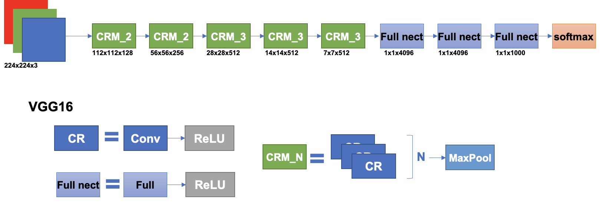
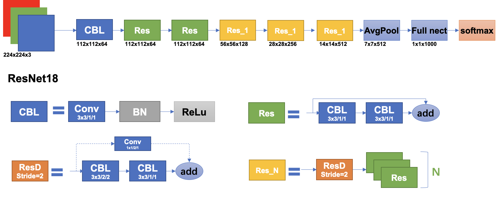
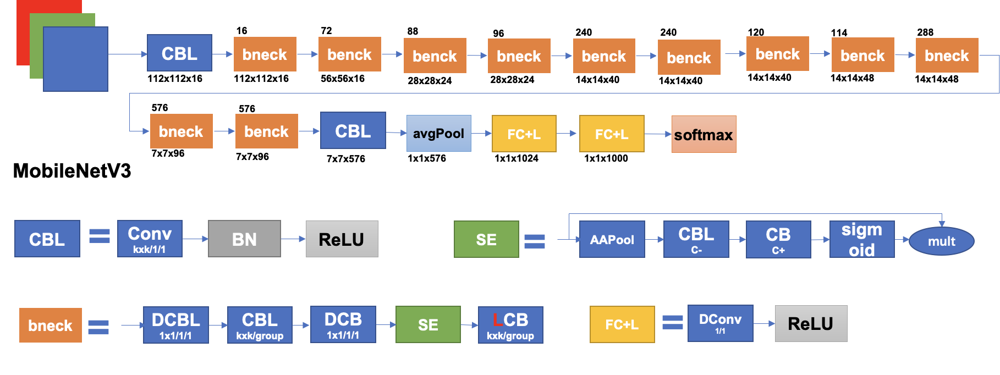

# 骨干网络结构及对应源码解析(pytorch版)

## VGG16



```python
import torch
from torch import nn

class CBL(nn.Module):
    def __init__(self,c1,c2,k,s=1,p=1):
        super().__init__()
        self.conv1 = nn.Conv2d(c1,c2,k,s,p)
        self.act = nn.ReLU(inplace=True)
        self.bn = nn.BatchNorm2d(c2)

    def forward(self,x):
        return self.act(self.bn(self.conv1(x)))

class CRM_N(nn.Module):
    def __init__(self,c1,c2,k,s=1,p=1,n=1):
        super().__init__()
        self.CR1 = CBL(c1, c2, k, s, p)
        self.CRN = nn.Sequential(*(CBL(c2, c2, k, s, p) for _ in range(n - 1)))
        self.pool = nn.MaxPool2d(2,stride=2)

    def forward(self,x):
        x = self.CR1(x)
        x = self.pool(self.CRN(x))
        return x

class VGG16(nn.Module):
    def __init__(self,in_channel,n_class,k=3,s=1):
        super().__init__()
        self.layer1 = CRM_N(in_channel,128,k,s,n=2)
        self.layer2 = CRM_N(128,256,k,s,n=2)
        self.layer3 = CRM_N(256,512,k,s,n=3)
        self.layer4 = CRM_N(512,512,k,s,n=3)
        self.layer5 = CRM_N(512,512,k,s,n=3)
        self.fc1 = nn.Linear(512*7*7,4096)
        self.fc2 = nn.Linear(4096,4096)
        self.fc3 = nn.Linear(4096,n_class)
        self.softmax = nn.Softmax(dim=1)
        self.act = nn.ReLU()

    def forward(self,x):
        x = self.layer1(x)
        x = self.layer2(x)
        x = self.layer3(x)
        x = self.layer4(x)
        x = self.layer5(x)
        x = torch.flatten(x,start_dim=1)
        x = self.act(self.fc1(x))
        x = self.act(self.fc2(x))
        x = self.act(self.fc3(x))
        x = self.softmax(x)
        return x


if __name__ == '__main__':
    x = torch.rand(size=(8,3,224,224))
    model = VGG16(3,1000)
    pred = model(x)
    print(pred.shape)
```


## ResNet18



```python
import torch
from torch import nn

class CBL(nn.Module):
    def __init__(self,c1,c2,k,s=1,p=1):
        super(CBL,self).__init__()
        self.conv1 = nn.Conv2d(c1,c2,k,s,p)
        self.act = nn.ReLU(inplace=True)
        self.bn = nn.BatchNorm2d(c2)

    def forward(self,x):
        return self.act(self.bn(self.conv1(x)))

class Res(nn.Module):
    def __init__(self,c1,c2,k,s,p):
        super(Res, self).__init__()
        self.conv1 = CBL(c1,c2,k,s,p)

    def forward(self,x):
        out = self.conv1(x)
        out = self.conv1(out)+x
        return out

class ResD(nn.Module):
    def __init__(self,c1,c2,k):
        super(ResD, self).__init__()
        self.conv1 = nn.Conv2d(c1,c2,k,2,1)
        self.conv2 = nn.Conv2d(c2,c2,k,1,1)
        self.down = nn.Conv2d(c1,c2,kernel_size=1,stride=2)

    def forward(self,x):
        out = self.conv1(x)
        out = self.conv2(out)
        out = out+self.down(x)
        return out

class ResN(nn.Module):
    def __init__(self,c1,c2,k,n):
        super(ResN, self).__init__()
        self.res1 = ResD(c1,c2,k)
        self.res2 = nn.Sequential(*(Res(c2,c2,k,1,1) for _ in range(n)))

    def forward(self,x):
        out = self.res1(x)
        out = self.res2(out)
        return out

class ResNet18(nn.Module):
    def __init__(self, in_channel, n_class):
        super(ResNet18, self).__init__()
        self.conv1 = CBL(in_channel,64,3,2)
        self.layer1 = Res(64,64,3,1,1)
        self.layer2 = Res(64,64,3,1,1)
        self.layer3 = ResN(64,128,3,1)
        self.layer4 = ResN(128,256,3,1)
        self.layer5 = ResN(256,512,3,1)
        self.avgpool = nn.AvgPool2d(kernel_size=2,stride=2)
        self.fc = nn.Linear(7 * 7 * 512, n_class)
        self.softmax = nn.Softmax(dim=1)

    def forward(self,x):
        x = self.conv1(x)
        x = self.layer1(x)
        x = self.layer2(x)
        x = self.layer3(x)
        x = self.layer4(x)
        x = self.layer5(x)
        x = self.avgpool(x)
        x = torch.flatten(x,start_dim=1)
        x = self.fc(x)
        x = self.softmax(x)
        return x

if __name__ == "__main__":
    x = torch.rand(size=(8, 3, 224, 224))
    model = ResNet18(3, 1000)
    pred = model(x)
    print(pred.shape)
```


## MobileNetV3



```python

import torch
from torch import nn

class CBL(nn.Module):
    def __init__(self,c1,c2,k,s=1,p=1):
        super(CBL, self).__init__()
        self.conv1 = nn.Conv2d(c1,c2,k,s,p)
        self.act = nn.ReLU(inplace=True)
        self.bn = nn.BatchNorm2d(c2)

    def forward(self,x):
        return self.act(self.bn(self.conv1(x)))

class SE(nn.Module):
    def __init__(self,in_size,reduction=4):
        super(SE, self).__init__()
        self.se = nn.Sequential(
            nn.AdaptiveAvgPool2d(1),
            nn.Conv2d(in_size, in_size // reduction, kernel_size=1, stride=1, padding=0),
            nn.BatchNorm2d(in_size // reduction),
            nn.ReLU(inplace=True),
            nn.Conv2d(in_size // reduction, in_size, kernel_size=1, stride=1, padding=0),
            nn.BatchNorm2d(in_size),
            nn.Sigmoid())

    def forward(self, x):
        return x * self.se(x)

class Bneck(nn.Module):
    def __init__(self,c1,c2,k,s,exp,se=False):
        super(Bneck, self).__init__()
        p = (k-1)//2
        self.use_res_connect = s == 1 and c1 == c2
        self.conv = nn.Sequential(
            # pw
            nn.Conv2d(c1, exp, 1, 1, 0),
            nn.BatchNorm2d(exp),
            nn.ReLU(inplace=True),
            # dw
            nn.Conv2d(exp, exp, k, s, p, groups=exp),
            nn.BatchNorm2d(exp),
            SE(exp),
            nn.ReLU(inplace=True),
            # pw
            nn.Conv2d(exp, c2, 1, 1, 0),
            nn.BatchNorm2d(c2),
        )

    def forward(self,x):
        if self.use_res_connect:
            return x + self.conv(x)
        else:
            return self.conv(x)

class MobileNetV3(nn.Module):
    def __init__(self,inchannel,n_class):
        super(MobileNetV3, self).__init__()
        self.conv1 = CBL(inchannel, 16, 3, 2)
        self.bneck1 = Bneck(16,16,3,2,16,True)
        self.bneck2 = Bneck(16,24,3,2,72,False)
        self.bneck3 = Bneck(24,24,5,1,88,False)
        self.bneck4 = Bneck(24,40,5,2,96,True)
        self.bneck5 = Bneck(40,40,5,1,240,True)
        self.bneck6 = Bneck(40,40,5,1,240,True)
        self.bneck7 = Bneck(40,48,5,1,120,True)
        self.bneck8 = Bneck(48,48,5,1,144,True)
        self.bneck9 = Bneck(48,96,5,2,288,True)
        self.bneck10 = Bneck(96,96,5,1,576,True)
        self.bneck11= Bneck(96,96,5,1,576,True)
        self.conv2 = CBL(96, 576, 1, 1)
        self.pool = nn.AdaptiveAvgPool2d(1)
        self.fc1 = nn.Conv2d(576,1024,1)
        self.fc2 = nn.Conv2d(1024,n_class,1)
        self.softmax = nn.Softmax(dim=1)

    def forward(self,x):
        x = self.conv1(x)
        x = self.bneck1(x)
        x = self.bneck2(x)
        x = self.bneck3(x)
        x = self.bneck4(x)
        x = self.bneck5(x)
        x = self.bneck6(x)
        x = self.bneck7(x)
        x = self.bneck8(x)
        x = self.bneck9(x)
        x = self.bneck10(x)
        x = self.bneck11(x)
        x = self.conv2(x)
        x = self.pool(x)
        x = self.fc1(x)
        x = self.fc2(x)
        x = torch.flatten(x,start_dim=1)
        x = self.softmax(x)
        return x

if __name__ == "__main__":
    x = torch.rand(size=(8, 3, 224, 224))
    model = MobileNetV3(3, 1000)
    pred = model(x)
    print(pred.shape)
```

