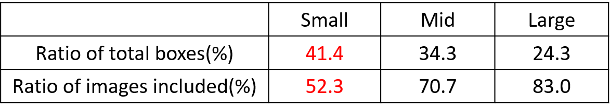
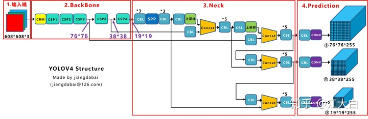

# YOLOV算法详解

## YOLOV3网络结构


YOLOV3中主要包含三个基本组件

- **CBL**: YOLOV3网络结构中的最小组件, 由 **Conv+BN+leaky_relu** 三者组成
- **Res unit**: 借鉴 **ResNet**网络中的残差结构, 让网络构建的更深
- **ResX**: 由一个 **CBL**层和 **X**个残差组件构成, 是YOLOV3中的大组件. 每个 **Res**模块前面的CBL都起到下采样的作用, 因此经过5次 **Res**模块后, 得到的特征图是 `608->304->152->76->38->19`

其他基础操作:

- **Concat**: 张量拼接, 会扩充2个张量的维度, 如26x26x256和26x26x512两个张量拼接, 结果是26x26x768. Concat和cfg文件中的route功能一样
- **add**: 张量相加, 张量直接相加, 不会扩充维度, 如104x104x128和104x104x128相加, 结果还是104x104x128. add和cfg文件中的shortcut功能一样.

**Backbone**中卷积层的数量

每个 **ResX**中包含`1+2*X`个卷积层, 因此整个主干网络Backbone中包含`1+(1+2*1)+(1+2*2)+(1+2*8)+(1+2*4)=52`, 再加上一个FC全连接层, 既可以组成一个 **DarkNet53**分类网络. 

## 需求讲解

YOLOV4在YOLOv3算法的基础上增加了很多使用技巧, 使得它的速度与精读都得到了极大的提升.

## YOLOV4算法简介

YOLOV4是一种单阶段目标检测算法, 该算法在YOLOV3的基础上添加了一些新得改进思路, 使得其速度与精读得到了极大得性能提升. 主要得改进思路如下:

- 输入端: 在模型训练阶段, 采用Mosaic数据增强, cmBN, SAT自对抗训练
- BackBone基准网络: 融合其他检测算法中的一些新思路: 如CSPDarknet53, mish激活函数, Dropblock.
- Neck中间层: 目标检测网络在BackBone与最后的Head输出层之间往往会插入一些层, YoloV4中添加SPP模块, FPN+PAN结构
- Head输出层: 输出层的锚框机制与YOLOv3相同, 主要改进的是训练时的损失函数CIOU_Loss, 以及预测框筛选的DIOU_nms

## 算法详解

### YOLOV4网络架构


该图暂时了YOLOV4目标检测算法的整体框图, 对于一个目标检测算法而言, 通常可以将其分为4个通用的模块, 具体包括: 输入端, 基准网络, Nekc网络, Head输出端.

- **输入端**: 表输入图片/ 该网络的输入图像大小为608*608, 该阶段通常包含一个图像预处理阶段, 即将输入图像缩放到网络的输入大小, 并进行归一化等操作. 在网络训练阶段, YOLOV4使用**Mosaic数据增强**操作提升了模型的训练速度和网络的精度; 利用**cmBN以及SAT自对抗训练**来提升网咯的泛化性能
- **Backbone主干网络**: 机制网络通常时一些性能优异的分类特征提取网络, 该模块用来提取一些通用的特征表示. YOLOv4中使用了**CSDarknet53**作为基准网络; 利用**Mish激活函数**代替原始的RELU激活函数, 并在该模块中增加了**Dropblock**块来进一步提升模型的泛化能力.
- **Neck网络**: Neck网络通常位于基准网络和头网络的中间位置, 利用它可以进一步提升特征的多样性及鲁棒性. YOLOv4利用**SPP模块**来融合不同尺度大小的特征图; 利用自顶向下的FPN特征金字塔于自底向上的**FPN+PAN**特征金字塔来提升网络的特征提取能力
- Head输出端: 用于完成目标检测结果的输出. 针对不同的检测算法, 输出端的分支个数不尽相同, 通常包含一个分类分支和一个回归分支. YOLOv4利用**CIOU_Loss**来代替Smooth L1 Loss函数, 并利用**DIOU_nms**来代替传统的NMS操作 ,从而进一步提升算法的检测精度.

### YOLOV4实现细节详解

#### YOLO v4基础组件

- **CBM** 是YOLOV4网络结构中的最小组件, 由**Conv+BN+Mish**激活函数组成, 如上图模块1所示
- **CBL**: 由**Conv+BN+Leaky_relu**激活函数组成, 如图上模块2所示
- **Res unit**: 借鉴ResNet网络中的残差结构, 用来构建深层网络, CBM是残差模块中的子模块, 如上图模块4所示
- **CSPX**: 借鉴CSPnet网络, 由**卷积层和x 个Res unint模块concate** 组成, 如上图模块4所示
- **SPP**: 采用**1x1, 5x5, 9x9和13x13的最大池化**方式, 进行多尺度特征融合, 如上图模块5所示

### CSPDark53创新

**CSPDarknet53**是在YOLOV3主干网络DarkNet53的基础上, 借鉴2019年的 **CSPNet**经验, 产生的 **BackBone**结构, 其中包括5个**CSP**模块.


 每个 **CSP**模块前面的卷积核的大小都是3x3, stride=2, 因此可以起到下采样的作用.

**CSPNet**全称是Cross Stage Paritial Network, 主要从网络结构设计的角度解决推理中从计算量很大的问题.

CSPNet的作者认为推理计算量过高是由于网络优化中的 **梯度信息重复**导致的. 因此采用CSP模块先将基础层的特征映射划分为两部分, 然后通过跨阶段层次结构将它们合并, 在减少了计算量的同时可以保证准确率.

因此YOLOV4在主干网络采用CSPDarkNet53有以下优点:

- 增强CNN的学习能力, 使得在轻量化的同时保持准确性
- 降低计算瓶颈
- 降低内存成本

#### 输入端细节详解

- Mosaic数据增强: YOLOv4 中在训练模型阶段使用Mosaic数据增强方法, 该算法在CutMix数据增强方法的基础上改进而来. CutMix仅仅利用两张图片进行拼接, 而Mosaic数据增强方法则采用4张图片, 并且**随机缩放**, **随机裁剪**和**随机排布**的方式进行拼接, 具体如下图所示. 这种增强方法可以将几张图片组合成一张, 这样不仅可以丰富数据集的同时极大的提升网络的训练速度, 而且可以降低模型得内存需求.

  

首先看小, 中, 大目标的定义


小目标的定义是目标框的长宽`0x0~32x32`之间的物体



但在整个的数据集中, 小, 中, 大的目标的占比并不均衡. 如上表所示, coco数据集中小目标占比占41.4%, 数量比中目标和大目标都要多.

但在所有的训练数据集中, 只有52.3%的图片有小目标, 而中目标和大目标的分布相对来说更加均匀些.

针对这种状况, YOLOV4的作者采用了 **Mosaic**数据增强的方式

- **丰富数据集**: 随机使用4张图片, 随机缩放, 再随机分布进行拼接, 大大丰富数据集, 特别是随机缩放增加了很多小目标, 让网络的鲁棒性更好.
- **减少GPU**: 可能有人会说, 随机缩放, 普通的数据集增强也可以做, 但作者考虑到很多人可能只有一个GPU, 因此Mosaic增强训练时, 可以直接计算4张图片的数据, 使得Mini-batch大小并不需要很大, 一个GPU就可以达到较好的效果.

#### 基准网络细节详解

- CSPDarknet53: 它是在YOLOv3 主干网络Darknet53的基础上, 借鉴2019年发表的CSPNet算法经验, 所形成的一种BackBone结构, 其中包含了5个CSP模块. 每个CSP模块的实现细节如下图所示, **CSP模块可以先将基础层的特征映射划分为两部分, 然后通过跨阶段层次结构将他们合并起来, 这样不仅减少计算量, 而且可以保证模型的准确率. 其优点包括: 1. 增强CNN网络的学习能力, 轻量化模型的同时保存模型的精度. 3. 降低整个模型的计算瓶颈; 3. 降低算法的内存成本**

- Mish激活函数: 该函数2019年提出, 是在Leaky_relu算法的基础上改进而来. 当x>0时, Leaky_relu于Mish激活函数基本相同; 当x<0时, Mish函数基本为0, 而Leaky_relu函数为$\lambda x$, YOLOV4的Backbone中均使用了Mish激活函数, 而后面的Neck网络中则使用leaky_relu激活函数. 总而言之, Mish函数更加平滑一些, 可以进一步提升模型的精度.

  

- **Dropblock**: 一种解决模型过拟合的正则方法, 其作用基本于Dropout相同. Dropout主要思路时随机的使用网络中的一些神经元失活, 从而形成一个新的网络. 如下图所示, 左边表示原始输入图像, 经过dropout操作之后的结果, 使得图像中的一些位置随机失活. 

**Dropblock的作者认为**: 由于卷积层通常是三层结构, 即卷积+激活+池化层, 池化层本身就是相对邻单元起作用, 而卷积层对于这种随机丢弃并不敏感. 除此之外, 即使是随机丢弃, 卷积层任然可以从相邻的激活单元学习到相同的信息. 因此, 在全连接层上效果很好的dropout, 在卷积层上效果并不好. 最右边经过Dropblock操作之后的结果, 我们可以发现该操作直接对整个局部区域进行失活(连续的几个位置)


所以在右图Dropblock的研究者则干脆整个局部区域进行删减丢弃. 这种方式是借鉴2017年的**cutout数据增强**的方式, cutout是将输入图像的部分区域清零, 而Dropblock则是Cutout应用到每个一个特征图. 而且并不是用固定的归零比率, 而在训练时以一个小的比率开始, 随着训练过程, **线性的增加这个比率**


**Dropblock主要具有以下的优点: **

**1. 实验效果表明Dropblock的效果优于Cutout; **

**2. Cutout只能应用到输出层, 而Dropblock则是将Cutout应用到网络中的每一个特征图上面; **

**3. Dropout可以定制各种组合, 在训练的不同阶段可以灵活的修改删减的概率, 不管是从空间层面还是从时间层面来讲, Dropblock更优些**

#### Neck网络细节

为了获得更鲁棒的特征表示, 通常会在基准网络的输出层之间插入一些层, YOLOv4 的主要添加了SPP模块于FPN+PAN 两种方式

- **SPP模块**: 通过融合不同大小的最大池化层来获得鲁棒的特征表示, YOLOv4中的`k={1x1,5x5,9x9,13x13}`包含这四种形式. 这里的最大池化层采用padding操作, 移动步长为1, 比如输入特征图的大小为13x13, 使用的池化核大小为5x5, padding=2, 因此池化后的特征图大小仍然是13x13.

  YOLOV4论文表明: **1. 语单词的使用kxk最大池化的方式相比, 采用SPP模块的方式能够更有效的增大主干特征的接收范围, 显著的分离了最重要的上下文特征; 2. 在COCO目标检测任务中, 当输入图片的大小为608x608时, 只需要额外花费0.5%的计算代价就可以将AP50 提升2.7%, 因此YOLOv4算法中也采用了SPP模块**

  

#### **FPN+PAN**: 

先看YOLOV3的Neck的FPN结构


可以看到经过几次下采样, 三个紫色箭头指向的地方, 输出分别是 **76x76, 38x38, 19x19**. 以及最后的 **prediction** 中用于预测的三个特征图 **19x19x255, 38x38x255, 76x76x255**.

我们将Neck部分用立体图画出来, 更直观的看两部分之间是如何通过 **FPN结构**融合的.


如图所示, FPN是自顶向下的, 将高层的特征信息通过上采样的方式进行传递融合, 得到进行预测的特征图.

**YOLO V4**的结构

而YOLOV4中Neck这部分除了使用FPN外, 还在此基础上使用了PAN结构



和YOLOV3的FPN层不同, YOLOV4在FPN层的后面还添加了一个自底向下的特征金字塔.

其中包含一个 **FPN+PAN** 结构

这样结合操作, FPN层自顶向下传递**强语义特征**, 而特征金字塔自自底向上传达 **强定位特征**, 两辆联手, 从不同的主干层对不同的检测层进行参数聚合, 这样的操作确实很皮


这里需要注意以下几点:

**注意一**:

YOLOV3的FPN层输出的三个大小不一的特征图1, 2, 3直接进行预测

但YOLOV4的FPN层, 只使用最后的一个76x76特征图, 而经过两次PAN结构, 输出预测的特征图2, 3.

这里的不同也体现在cfg文件中, 比如YOLOV3 cfg最后的三个YOLO层

第一个YOLO层是最小的特征图 **19x19**, mask = **6, 7, 8**, 对应最大的anchor box.

第二个YOLO层是中等的特征图 **38x38**, mask = **3,4,5**, 对应中等的anchor box

第三个YOLO层是最大的特征图 **76x76**, mask = **0,1,2**, 对应最小的anchor box

而YOLOV4 cfg则 **恰恰相反**

第一个YOLO层是最大的特征图 **76x76**, mask = **0,1,2**, 对应最小的anchor box

第二个YOLO层是中等的特征图 **38x38**, mask = **3,4,5**,对应中等的anchor box

第三个YOLO层是最小的特征图 **19x19**, mask = **6,7,8**, 对应最大的anchor box

**注意点二**

原本的PANet网络的 **PAN结构**中, 两个特征图结合是采用 **shortcut** 操作, 而YOLOV4中则采用 **Concat (route)**操作, 特征图融合后的尺寸发生了变化.


#### Head网络细节详解

- **CIOU_loss**: 目标检测任务的损失函数一般由分类损失函数和回归损失函数两部分构成, 回归损失函数的发展过程主要包括: 最原始的Smoth L1 Loss函数, 2016年提出的IoU Loss, 2019年提出的GI哦U Loss, 2020年提出的DIoU Loss和最新的CIoU Loss函数

  1). **IoU_Loss**: 即(预测框与GT框之间的交集)/(预测框与GT框之间的并集). 这种损失会存在一些问题, 具体的问题如下图所示, 1). 状态1所示, 当预测框和GT框不相交时, 即IoU=0, 此时无法反映两个框之间的距离, 此时该损失函数不可导, 即IoU_Loss无法优化两个框不相交的情况. 2). 如状态2与状态3所示, 当两个预测框大小不相同时, 那么这两个IoU也相同, IoU_Loss无法区分两者相交这种情况.

  

- **GIoU_Loss**: 为解决以上两个问题, GIOU损失应运而生. GIoU_Loss中增加了相交尺度的衡量方式, 缓解了单纯IoU_Loss时存在的一些问题.

  

  但这种方法并不能完全解决这种问题, 仍然存在这其他的问题, 具体的问题如下所示, 状态1, 2, 3都是预测框内部且预测框大小一致的情况, 这时预测框和GT的差集都相同, 因此这三种状态的GIoU值也都是相同的, 这时GIOU退化成了IOU, 无法区分相对位置关系.

  

- **DIOU_Loss**: DIOU为了解决如何最小化预测框和GT框之间的归一化距离这个问题, GIOU_loss考虑了预测框与GT框重叠面积和中心点距离, 当GT框包裹预测框的时候, 直接度量2个框的距离, 因此DIOU_Loss收敛速度更快一些.

  

  如下图所示, 当GT框包裹预测框时, 此时预测框的中心点的位置都是一样的, 因此按照DIOU_Loss计算公式, 三者的值都是相同的, 为了解决这个问题, CIOU_Loss应运而生.

  

- **CIOU_Loss** 在DIOU_Loss基础上, 增加了一个影响因子, 将预测框和GT框的长宽比也考虑进来. 具体方式如下, 即CIOU_Loss将GT框的重叠面积, 中心点距离和长宽比全都考虑进来
  $$
  CIOU\_Loss = 1-CIOU = 1-(IOU-\frac{Distance_2^2}{Distance_C^2}-\frac{v^2}{(1-IOU)+v})\\
  v=\frac{4}{\pi^2}(arctan \frac{w^{gt}}{h^{gt}}-arctan \frac{w^{p}}{h^{p}})^2
  $$
  总而言之, IOU_Loss主要考虑了检测框和GT框之间的重叠面积, GIOU_Loss在IOU的基础上, 解决框不重合时出现的问题, DIOU_Loss在IOU和GIOU的基础上, 同时考虑了边界框中心点距离信息, CIOU_Loss在DIOU基础上, 又考虑了边界框宽高比和尺度信息.

- **DIOU_NMS**: 对于重叠的摩托车检测任务而言, 传统的NMS操作会遗漏掉一些中间的摩托车; 由于DIOU_NMS考虑到边界框中心点的位置信息, 因而得到了更加准确的检测结果, 适合处理密集场景下的目标检测问题.

  

## 代码实现

## YOLOV5

### autoanchors


**bpr (best possible recall)**: is defined as the ratio of the number of ground-truth boxes a detector can recall at the most divided by all ground-truth boxes. A ground-truth box is considered being recalled if the box is assigned to at least one sample (i.e., a location is FCOS or an anchor box in anchor-based detectors) during training.


### Loss

$\operatorname{Loss}(o b j)=$ GIoUloss
$$
\begin{aligned}
Loss(obj)=
&GIoULoss\\
&+\sum_{i=0}^{S \times S} \sum_{j=0}^{B} \mathbf{1}_{i j}^{o b j}\left[C_{i} \log \left(C_{i}\right)\right. 
\left.+\left(1-C_{i}\right) \log \left(1-C_{i}\right)\right] \\
&-\sum_{i=0}^{S \times S} \sum_{j=0}^{B} \mathbf{1}_{i j}^{n o o b j}\left[C_{i} \log \left(C_{i}\right)\right. 
\left.+\left(1-C_{i}\right) \log \left(1-C_{i}\right)\right] \\
&+\sum_{i=0}^{S \times S} \sum_{j=0}^{B} \mathbf{1}_{i j}^{obj} \sum_{c \in \text { classes }}\left[p_{i}(c) \log \left(p_{i}(c)\right)\right. 
\left.+\left(1-p_{i}(c)\right) \log \left(1-p_{i}(c)\right)\right]
\end{aligned}
$$

### detect

**参数**

| name           | defalut           | help                                        |
| -------------- | ----------------- | ------------------------------------------- |
| weights        | ROOT/yolo5s.pt    | model path（s)                              |
| source         | ROOT/data/images  | file/dir/URL/glob, 0 for webcam             |
| data           | ROOT/coco128.yaml | (optional) dataset.yaml path                |
| imgsz          | [640]             | inference size h, 2                         |
| conf-thres     | 0.25              | confidence threshold                        |
| iou-thres      | 0.45              | NMS IoU threshold                           |
| max-det        | 1000              | maximum detections per image                |
| device         | ""                | cuda device, i.e. 0 or 1,2,3,4 or cpu       |
| view-img       | store_true        | show results                                |
| save-txt       | store_true        | save result to \*.txt                       |
| save-conf      | store_true        | save confidences in --save-txt labels       |
| save-crop      | store_true        | save cropped prediction boxes               |
| nosave         | store_true        | do not save images/videos                   |
| classes        |                   | filter by class: --class 0 or --class 0 2 3 |
| agnostic-nms   | store_true        | class-agnostic NMS                          |
| visualize      | store_true        | augmented inference                         |
| update         | store_true        | update all models                           |
| name           | exp               | save results to project/name                |
| exist-ok       | store_true        | existing project/name ok, do not increment  |
| line-thickness | 3                 | bounding box thickness (pixels)             |
| hide-labels    | False             | hide labels                                 |
| hide-conf      | False             | hide confidences                            |
| half           | store_true        | USE FP16 half-precision inference           |
| dnn            | store_ture        | use OpenCV for ONNX inference               |

### Datasets

yolov5的数据加载部分由create_dataloader函数实现(位于`utils/datasets.py`), 其中关于数据增强何加载的部分主要由`LoadImagesAndLabel, InfiniteDataLoader`负责, 并基于`torch_distributed_zero_first(rank)`进行不同进程之间的数据同步

- 数据同步

  在YOLOV5的模型训练中涉及了很多进程并行计算, 其中, 主进程实现数据的预读取并缓存, 然后其它子进程则从缓存中读取数据并进行一些列运算. 为了完成数据的正常同步, yolov5中基于`torch.distributed.barrier()`函数实现了上下文管理器`torch_distributed_zero_first`

  ```python
  @contextmanager
  def torch_distributed_zero_first(local_rank: int):
      """
      Decorator to make all processes in distributed training wait for each local_master to do something.
      """
      if local_rank not in [-1, 0]:
          torch.distributed.barrier()
      yield
      if local_rank == 0:
          torch.distributed.barrier()
  ```

  `torch_distributed_zero_first`使用方式

  ```python
  with torch_distributed_zero_first(rank):
       dataset = LoadImagesAndLabels(......)
  ```

  `rank`表示当前的进程号, 主进程由编号0表示, 子进程由编号1,2,3,..等表示. 上述代码的运行逻辑

  1. 进入`torch_distributed_zero_first(rank)`上下文作用域
  2. 判断当前进程号`local_rank`是否为-1或0, 如果不是说明为子进程, 运行`torch.distributed.barrier()`等待主进程的数据处理完毕, 如果是, 则当前为主进程, 不需要等待;
  3. `yield`后, 运行with作用域范围内的代码
  4. 作用域范围内代码运行完成后, 进行`yield`的后续操作, 判断当前进程号是否为0(即是否为主进程), 如果是, 则运行`torch.distributed.barrier()`可以解开其它子进程的阻塞

- 数据增强

  数据增强相关方法在`LoadImagesAndLabels`类中实现

  - Rectangular Training

    通常YOLO系列网络的输入都是预处理后的方形图像数据, 如608x608. 当原始图像为矩形时, 会将其填充为方形,但填充的灰色区域其实就是冗余信息, 不论在训练阶段还是推理阶段,这些冗余信息都会增加耗时.

    

    未来减少图像的冗余数据, 输入图像由方形改为矩形: 将长边resize为固定尺寸(如608), 短边同样比例resize, 然后把短边的尺寸尽量少地填充为32的倍数

    

    这种方法在推理阶段被称为矩形推理(rectangular inference). 推理阶段直接对图像进行resize和pad进行, 但时在训练阶段输入的是一个批次的图像集合, 需要保持批次内的图像尺寸一致, 因此处理逻辑相对复杂些.

    ```python
            if self.rect:
                # Sort by aspect ratio
                # 首先根据高宽比排序，就可以保证每个batch内的图像高宽比相近。
                s = self.shapes  # wh
                ar = s[:, 1] / s[:, 0]  # aspect ratio    高/宽
                irect = ar.argsort()
                self.img_files = [self.img_files[i] for i in irect]
                self.label_files = [self.label_files[i] for i in irect]
                self.labels = [self.labels[i] for i in irect]
                self.shapes = s[irect]  # wh
                ar = ar[irect]
    
                # Set training image shapes
                shapes = [[1, 1]] * nb    # hw
                for i in range(nb):
                    ari = ar[bi == i]
                    mini, maxi = ari.min(), ari.max()
                    if maxi < 1:    # 高宽比最大值都小于1，则说明batch内的图全都是高小于宽
                        shapes[i] = [maxi, 1]   # 设置宽为固定比例1，高的比例为maxi
                    elif mini > 1:   # 高宽比最小值都大于1，说明batch内的图都是高>宽
                        shapes[i] = [1, 1 / mini]    # 设置高为固定比例1，宽的比例为1 / mini
    ```

    关键:

    1. 从ar中对应取出每个batch的高宽比列表ari, 取其中的最大值, 最小值.
    2. 如果当前batch的高宽比最大值小于1, 则将shapes内该batch对应的值设为[maxi, 1], 而如果最大值<1且最值>1, 则设置为[1, 1/min)

- `get_hash(path)`

  Return a single hash value of a list of paths (files or dirs)

- `exif_size(img)`:

  Return exif-corrected PIL size

- `exif_transpose(image)`

  Transpose a PIL image accordingly if it has an EXIF orientation tag

- `create_dataloader(path, imgsz, batch_size, stride, single_cls=False, hyp=None,augment=False, cache=False, pad=0.0,rect=False, rank=-1, workers=8, image_weights=False, quad=False,prefix="",shuffle=False)`

- `LoadImageAndLabels(path, imgsz, batch_size, augment,hyp,rect,cache_images,single_cls,stride, pad, image_weights,prefix)`

  Yolov5 train_loader/val_loader, loads images and labels for training and validatioin

  cache: np保存的文件, 包含label.txt的路径以及其对应的框信息, 图像的原始大小.)

  - `include_class`: filter labels to include only these class (ootional)

- `img2label_paths(img_path)`

  Define label path as a function of image path

  cache: 

  

  result=["found","missing","empty","corrupt","total"]

  path=[box, image_size, segments]

- `cache_labels(self,path=Path("./labels.cache"),prefix="")`

  cache dataset labels, check images and read shapes

### Loss计算

yolov5的loss设计和前yolo系列差别比较大的地方就是正样本anchor区域计算, 核心在于如何得到所需的target.

在yolov3中, 其正样本区域也就是anchor匹配策略比较粗暴: 保证每个gt bbox一定有一个唯一的anchor进行对应, 匹配规则就是IOU最大, 并且某个gt一定不可能在三个预测层的某几层上同时进行匹配. 不考虑一个gt bbox对应多个anchor的场合, 也不考虑anchor是否设定合理. 不考虑一个gt bbox对应多个anchor的场合的设定会导致整体收敛比较慢.

在诸多论文研究中表明, 例如FCOS, 和ATSS: 增加高质量正样本anchor可以显著加速收敛. 

yolov5也采用了增加正样本anchor数目的做法来加速收敛, 这其实也是YOLOV5在实践中收敛速度非常块的原因. 其核心匹配规则为:

- 对于任何一个输出层, 抛弃了基于max iou匹配的规则, 而是直接采用shape规则匹配, 也就是bbox和当前的anchor计算宽高比, 如果宽高比例大于设定阈值, 则说明该bbox和anchor匹配度不够, 将该bbox过滤暂时丢掉, 在该层预测中认为是背景:
- 对于剩下的bbox, 计算器落在哪个网格内, 同时利用四舍五入规则, 找出最近的两个网格, 这将三个网格都认为负责预测该bbox的, 可以初略估计正样本数目比前yolo系列, 至少增加了三倍.


​	如山图所示, 绿点表示该bbox中心, 现在需要额外考虑其2哥最近的领域网格也作为该bbox的正样本anchor. 从这里可以发现, bbox的xy回归分支的取值范围不再是0~1, 而是0.5~1.5(0.5是网格中心偏移, 为什么是这个范围), 因为跨网格预测了.

结合代码`compute_loss`函数

**`build_targets`**函数用于选择计算loss函数所需要的target, 其大概流程为:

- 将targets重复三遍(3=层anchor数目), 也就是将每个gt bbox复制变成独立的3份, 方便和每个位置的3哥anchor单独匹配.

  

- 对于每个输出层单独匹配. 首先将targets变成anchor尺度, 方便计算; 然后将target的`wh` shape和anchor的`wh`计算比例, 如果比例过大, 则说明匹配度不高, 将该bbox过滤, 在当前从层为是bg.

  

- 计算最近的2个领域网格

  

- 对每个bbox找出对应的正样本anchor, 其中包括, b表示当前bbox属于batch内部的第几张图, a表示当前bbox和当前的第几个anchor匹配上, $g_i/g_j$​ 是对应的负责预测该bbox的网格坐标, gxy是不考虑offset或者说yolov3里面设定该bbox的负责预测网格, `gwh` 是对应的归一化 `bbox wh`, c是该bbox类别

  

  从上述可以发现: 在任何一预测层, 将每个bbox复制成跟anchor个数一样多的数目, 然后将bbox和anchor一一对应计算, 去除不匹配的bbox, 然后对原始中心点网格坐标扩展两个邻域像素, 增加正样本anchor. 有个细节需要注意, 前面shape过滤时, 是不考虑bbox的坐标的. 也就是说, bbox的wh是和所有anchor匹配的, 会导致找到的领域也相当于进行了shape过滤规则, 故对于任何一个输出层, 如果该bbox保留, 那么至少有三个anchor进行匹配, 并且保留的3个anchor shape是一样大的. 即保留的anchor在不考虑越界的情况下是3或6或者9.

### EMA

全名为: exponential moving average 目的是保持模型参数在一种动态平均的状态.
$$
v=\frac{1}{n} \sum_{i=1}^n \theta_i \\
v_t = \beta*v_{t-1}+(1-\beta)*\theta_t 
$$
在深度学习的优化过程中, $\theta_t$是t时刻的模型权重, $v_t$​是t时刻的影子权重(shadow weights). 在梯度下降过程中, 会一直维护着这个影子权重, 但是这个影子权重并不会参与训练. 基本的假设是, 模型权重在最后的n步内, 会在实际的最优点处抖动, 所以我们取最后n步的平均, 能使得模型更加鲁棒.

### val()

| name           | value        | description                                    |
| -------------- | ------------ | ---------------------------------------------- |
| data           | pat          |                                                |
| `weight`       | None         | model.pt (paths)                               |
| `batch_size`   | 32           | batch size                                     |
| `imgsz`        | 640          | inference size (pixels)                        |
| `conf_thres`   | 0.00`        | confidence threshold                           |
| `iou_thres`    | 0.6          | NMS IoU threshold                              |
| `task`         | 'val'        | train, val, test, speed, or study              |
| `device`       |              | cuda device, i.e 0 or 1,2,3 or cpu             |
| `worker`       | 8            | max dataloader workers (per RANK in DDP mode)  |
| `single_cls`   | False        | treat as single-class dataset                  |
| `augment`      | False        | augment inference                              |
| `verbose`      | False        | verbose outptu                                 |
| `save_txt`     | False        | save results to \*.txt                         |
| `save_hybrid`  | False        | save label+prediction hybrid results to \*.txt |
| `save_conf`    | False        | save confidences in --save-txt label           |
| `save_json`    | False        | save a COCO-JSON results file                  |
| `project`      | ROOT/run/val | save to project/name                           |
| `name`         | exp          | save to project/name                           |
| exist_ok       | False        | existing project/name ok, do not increment     |
| `half`         | True         | use FP16 half-precision inference              |
| `dnn`          | False        | use OpenCV DNN for ONNX inference              |
| `model`        | None         |                                                |
| `dataloader`   | None         |                                                |
| `save_dir`     | Path("")     |                                                |
| `callbacks`    | Callbacks()  |                                                |
| `compute_loss` | None         |                                                |

### model()

- `class_weights`: 每个类别的权重
- `hyp`: 模型训练的相关超参数
- `model`: 构建的模型
- `names`: 类别名称
- `nc`: 类别数
- `save`: 输出的模型层位置
- `training`: 是否进行训练
- `yaml`: 与训练有关系的变量;(nc, depth_multiple, widt_multiple, anchors]

## _apply(self,fn)

apply to(), cpu(), cuda(), half() to model tensors that are not parameters or registered buffers

## Train Custom Data

### Befor you start

Clone repo and install `requirements.txt` in a python >=3.7.0 environment, including PyTorch>=1.7 Models and datasets download automatically from the latest YOLOv5

```bash
git git clone https://github.com/ultralytics/yolov5  # clone
cd yolov5
pip install -r requirements.txt  # install
```

### Train On Custom Data


Creating a custom model to detect your objects is an iterative process of collecting and organizing images, labeling your objects of interest, training a model, deploying it into the wild to make predictions, and then using that deployed model to collect examples of edge cases to repeat and improve.

#### **Create dataset**

YOLOv5 models must be trained on labelled data in order to learn classes of objects in that data. 

**1.1 Create dataset.yaml**

`COCO128` is an example small tutorial dataset composed of the first 128 images in `COCO` train2017. These same 128 images are used for both training and validation to verify our training pipline in capable of overfitting . `data/coco128.yaml`, shown below, is the dataset config file that define 

1) the dataset root directory `path` and relative paths to `train/ val / test` image dirctories (or \*.txt files with image path)
2) the number of classes `nc` 
3) a list of class `name`

```yaml
# Train/val/test sets as 1) dir: path/to/imgs, 2) file: path/to/imgs.txt, or 3) list: [path/to/imgs1, path/to/imgs2, ..]
path: ../datasets/coco128  # dataset root dir
train: images/train2017  # train images (relative to 'path') 128 images
val: images/train2017  # val images (relative to 'path') 128 images
test:  # test images (optional)

# Classes
nc: 80  # number of classes
names: [ 'person', 'bicycle', 'car', 'motorcycle', 'airplane', 'bus', 'train', 'truck', 'boat', 'traffic light',
         'fire hydrant', 'stop sign', 'parking meter', 'bench', 'bird', 'cat', 'dog', 'horse', 'sheep', 'cow',
         'elephant', 'bear', 'zebra', 'giraffe', 'backpack', 'umbrella', 'handbag', 'tie', 'suitcase', 'frisbee',
         'skis', 'snowboard', 'sports ball', 'kite', 'baseball bat', 'baseball glove', 'skateboard', 'surfboard',
         'tennis racket', 'bottle', 'wine glass', 'cup', 'fork', 'knife', 'spoon', 'bowl', 'banana', 'apple',
         'sandwich', 'orange', 'broccoli', 'carrot', 'hot dog', 'pizza', 'donut', 'cake', 'chair', 'couch',
         'potted plant', 'bed', 'dining table', 'toilet', 'tv', 'laptop', 'mouse', 'remote', 'keyboard', 'cell phone',
         'microwave', 'oven', 'toaster', 'sink', 'refrigerator', 'book', 'clock', 'vase', 'scissors', 'teddy bear',
         'hair drier', 'toothbrush' ]  # class names
```

**1.2 Create labels**

After using a tool like labelImg to label your images, export your labels to **YOLO format**, with one `\*.txt` file per image (if no objects in images, no `\*.txt` file is required.) The `\*.txt` file specifications are:

- One row per object

- Each row is `class x_center y_center width height` format

- Box coordinates must be in **normalized xywh** format (from 0 - 1). If your boxes are in pixels, divide `x_center` and `width` by image width, and `y_center` and `height` by image height.

- class number are zero-indexed start from 0

  

  The label file corresponding to the above image contains 2 persons (class 0) and a tie (class 27)

  

**1.3 Organized Directories**

Organize your train and val images and labels according to the example below. YOLOv5 assumes `/coco128` is inside a `/datasets` directory **next to** the `/yolov5` directory. 

**YOLOv5 locates labels automatically for each image** by replacing the last instance of `/imagess` in each image path with `/labels/`. For example:

```python
../datasets/coco128/images/im0.jpg  # image
../datasets/coco128/labels/im0.txt  # label
```


## 总结分析


## 参考资料

