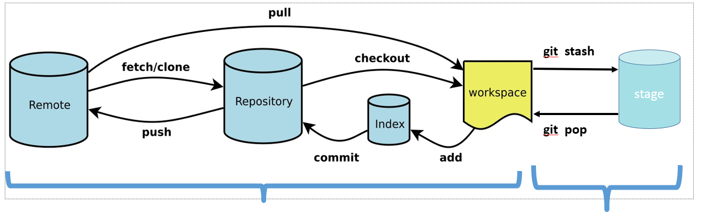

# Git学习

## 实例汇总

**分支管理汇总**



```sh
#配置
git config --global user.name "kuisu"
git config --global user.email "kuisu_dgut@163.com"
git config --list#查看配置

# 分支查看
git branch -l #查看本地分支, -r 远程分支remote, -a 所有分支

#分支创建
git branch NEW_BRANCH #这里隐含了是基于当前分支所创建
git branch NEW_BRANCH source_branch
git branch NEW_BRANCH origin/source_branch #源于远端分支, 创建本地分支
git checkout -b new_branch #创建本地分支

# 分支推送远端
git push remote_repositories local_branch:remote_branch
# git push origin develop:develop 将本地develop分支推送到远程的develop

#分支删除
git branch -d branch_name #删除本地分支
git push origin --delete dev #删除远程分支

#分支切换
git chenckout destination_branch #在checkout之前, 原来的工作空间和所在的分支必须是已经commit的.
git checkout -b dev #基于当前分支, 创建一个dev分支, 并切换到deve分支上

# 直接合并: 将source_branch --> destination_branch 的合并
git checkout destination_branch
git merge source_branch #如果遇到冲突, 解决冲突后再提交

# 挑选合并
git checkout master
git cherry-pick 321fsd #将commmitId为321fsd的提交

# 回退代码
git log --pretty=online
HEAD^
HEAD^^
# 依次类推, 当然也可以HEAD~5, 表示HEAD前5个
git reset --hard commitId #其中commitId即为你想要回到的地方
git checkout commitId filename #回退filename 文件到commitId的提交状态

# 回退工作区未跟踪的文件
git clean -f #删除untracked files
git clean -fd #删除untracked files, 连通目录一起删除

# 取消已跟踪
git rm --chached filename

# 取消已提交
git 
```

## 安装Git

- 下载[git](https://git-scm.com/download/win)
- 安装

git内置了10中编辑器`Atom,Notepad, Notepad++,Sublime,Text, Visual Studio Code, Vim`


始菜单找到`git-->Git Bash`


- 详细解释参考[Git详细安装教程](https://blog.csdn.net/mukes/article/details/115693833)

## git配置

```git
git config --global user.name "kuisu"
git config --global user.email "kuisu_dgut@163.com"
git config --list#查看配置
```


**Git SSH免登录配置**

```sh
ssh-keygen#生成密钥
```

`~/.ssh/id_rsa.pub`复制到git网站的个人profile->ssh key中


## 创建版本库

你可以简单理解成一个目录，这个目录里面的所有文件都可以被Git管理起来，每个文件的修改、删除，Git都能跟踪，以便任何时刻都可以追踪历史，或者在将来某个时刻可以“还原”。

- 初始化仓库

```git
$ mkdir newgit
$ cd newgit
$ pwd
$ git init#将此目录变成git可管理的仓库
```


- 将文件提交到仓库

```git
$ git config --global core.autocrlf false
```


```git
# 编辑一个`reademe.txt`文件,并提交到仓库
$ git add readme.txt
$ git commit -m "write a readme file"#提交注释
```


## git忽略文件

在工程中, 并不是所有文件都需要保存到版本库中, 列如"target"目录及目录下的文件就可以忽略. 在git工作区的根目录下创建一个特殊的.gitignore文件, 然后将要忽略的文件名填进去, Git就会自动忽略这些文件或目录

### git忽略规则

在.gitingore文件中, 每一行指定一个忽略规则, Git检查忽略规则的时候有多个来源, 它的优先级如下

> 从命令行中读取可用的忽略规则
>
> 当前目录定义的规则
>
> 父级目录定义的规则
>
> $GIT_DIR/info/exclude文件中定义的规则
>
> core.excludesfile中定义的全局规则

### Git忽略规则匹配语法

在.gitignore文件中, 每一行的忽略规则语法如下

> 1. 空格不匹配任意文件, 可作为分隔符, 可用反斜杠转义
> 2. 开头文件标识注释, 可以使用反斜杠进行转义
> 3. ! 开头的模式标识否定, 该文件将会再次被包含, 如果排除了该文件的符集目录, 则使用!也不会再次生效

**配置语法**

```sh
"/"开头表示目录 #target/*: 表示忽略target下面的全部内容
"*"通配多个字符 #/bin/*: 忽略bin目录下的所有文件
"?"通配单个字符 
"[]"包含单个字符的匹配
"!"表示不忽略匹配到的文件 #! *.zip忽略以外的文件
```

### 忽略以前提交的文件

在工作副本中的文件可以被追踪, 也可以未被追踪. 要忽略先前提交的文件, 需要取消暂存,并从索引中删除该文件, 然后再`.gitignore`中为该文件添加规则

`git rm --cached filename`, --cached 选项告诉git不要从工作树中删除文件,而只是从索引中删除它

要递归删除目录, 需使用`-r`

`git rm -r -n directory`

### 常用匹配示例

```python
# Ignore the node_modules directory
node_modules/
*.pth

# Ignore Logs
logs
*.log

# Ignore the build directory
/dist

# The file containing environment variables 
.env

# Ignore IDE specific files
.idea/
.vscode/
*.sw*
```


### .gitignore不生效

.gitignore只能忽略那些原来没有被track的文件, 如果某些文件已经被纳入版本管理中, 则修改.gitignore是无效的

解决方案是先把本地缓存删除, 然后再提交:

```git
git rm -r --cached .
git add .
git commit -m "updata .gitignore"
```

## 删除本地仓库

> ls -a
>
> rem -rf .git

即删除仓库文件夹下隐藏的.git文件即可

## Git提交到github

### git fetch

1.   如果没有显式的指定远程分支, 则远程分支的master将作为默认的FETCH_HEAD
2.   如果指定了远程分支, 就将这个远程分支作为FETCH_HEAD.

```sh
git fetech origin branch1
```

这个操作是`git pull origin branch1`的第一步, 并不会在本地创建新的`branch1`. 另外, 这个命令可以用来测试远程主机的远程分支branch1是否存在, 如果存在, 返回0, 如果不存在, 返回128, 抛出异常.

```sh
git fetch origin branch1:branch2
```

首先执行上面的fetch操作, 使用远程`branch1`分支在本地创建`branch2`(但不会切换到该分支), 如果本地不存在`branch2`分支, 则会自动创建一个新的branch2分支, 如果本地存在`branch2`分支, 并且是`fast forward`, 则回自动合并两个分支, 否则, 会组织以上操作.

fetech更新到本地创库的两种方式

```sh
# 方法1
git fetch origin master #从远程的origin仓库的master分支下载代码到本地的origin master
git log -p master.. origin/master #比较本地仓库和远程参考的区别
git merge origin/master #远程下载下来的代码合并到本地仓库

# 方法2
git fetech origin master:temp #从远程的origin仓库的master分支下载到本地并新建一个分支temp
git diff temp #比较master分支和temp分支的不同
git merge temp #合并temp分支到master
git branch -d temp #删除temp分支
```


```cmd
git fetch origin +pu:pu maint:tmp
```

此更新通过从远程存储库的分支`pu`和`maint`提取分支本地存储库上的`pu`和`tmp`

**将某个远程主机的更新**

```cmd
git fetch <远程主机名> #更新单个分支
git fetch #更新所有分支
```

### 绑定用户

`git config --global user.name "kuisu_dgut"`

`git config --global user.email "kuisu_dgut@163.com"`

ps: 有了--global参数, 标识这台机器上所有的git仓库都会使用这个配置.

### 为github账户设置ssh key

`ssh-keygen -t rsa -C "kuisu_dgut@163.com"`


生成成功后, 再`C:\Users\XX\.ssh`文件中, 打开id_rsa.pub, 得到ssh key公钥

| 得到ssh key公钥                                              | 账户配置ssh key                                              |
| ------------------------------------------------------------ | ------------------------------------------------------------ |
|  | 个人-->settings<br /> |

### 上传本地代码

```sh
git remote add origin git@github.com:kuisu/DLH_SSD300.git#关联仓库
git push -u origin master#第一次推送带上参数-u, 以后的推送不需要-u参数
git pull origin master --allow-unrelated-histories#即允许不相干的历史
```


## Git分支


假设有一个工作目录, 里面包含了三个将要被暂存和提交的文件. 暂存操作会为每一个文件计算一个校验和, 然后将当前版本的文件快照保存到Git仓库中, 最终将校验和加入到暂存区等待提交

```git
git add README test.rb LICENSE
git commit -m "The ninital commit of my project"
```

当使用`git commit`进行操作时, git会线计算每一个子目录的校验和, 然后再git仓库中, 这些校验和保存为树对象. 随后, Git便会创建一个提交对象, 它除了包含上面提到的那些信息外, 还包含指向这个数对象(项目更目录)的指针. 这样, git就可以再需要的时候重现此次保存的快照

现在, git仓库中有5各对象: 三个blob对象(保存着文件快照), 一个树对象(记录着目录结构和blob对象索引)以及一个提交对象(包含着指向前述对象的指针和所有提交信息)


>   首次提交对象及其树结构

做些修改后再次提交, 那么这次产生的提交对象会包含上一个指向上次提交对象(父对象)的指针.


>   提交对象及其父对象

Git的分支, 其本质上仅仅是指向提交对象的可变指针. Git的默认分支名字是`master`. 在多次提交操作之后, 其实已经有一个指向那个提交对象的`master`分支. `master`分支会在每次提交时自动向前移动.


>   分支及其提交历史

**分支创建**
Git创建分支很简单, 它只是创建了一个可以移动的新指针. 比如, 创建一个testing分支, 需要使用`git branch`:

```git
git branch testing
```

这会在当前所在的提交对象上创建一个指针.


>   两个指向相同提交历史的分支

那么, Git又是如何知道当前在哪一个分支上, 其是通过一个名为`HEAD`的特殊指针. 在Git中, 它是一个指针, 指向当前所在的本地分支. 在本例中, 仍然`master`分支, 因为`git branch`命令仅仅创建一个新分支, 并不会自动切换到新分支中.


>   HEAD指向当前所在分支

可简单使用`git log` 命令查看各个分支当前所指的对象. 提供这一功能参数是`decorate`

```git
git log --online --decorate
f30ab (HEAD -> master, testing) add feature #32 - ability to add new formats to the central interface
34ac2 Fixed bug #1328 - stack overflow under certain conditions
98ca9 The initial commit of my project
```

正如所见,, 当前master和testing分支均指向校验和以`f30ab`开头的提交对象.

**分支切换**
要切换到一个已存在的分支, 需要使用`git checkout`, 现在切换到新建的`testing`分支去

```git
git checkout testing
```

这样`HEAD`就指向`testing`分支了.


>   HEAD指向当前所在分支

那么, 这样的实现方式会给我们带来什么好处? 现在不妨再提交一次:

```shell
vim test.rb
git commmit -a -m "made a change"
```


>   HEAD分支随着提交操作自动前移,

如图所示, `testing`分支向前移动了, 但是`master`分支却没有, 它仍然指向运行`git checkout`时所指的对象. 当我们切换回`master`分支时

```shell
git checkout master
```


>   检出时HEAD随之移动

这条命令做了两件事. 一是使HEAD指向`master`分支, 二是将工作目录恢复成`master`分支所指向的快照内容.也就是说, 现在做修改的话, 项目将始于一个较旧的版本. 本质上来讲, 这就是忽略`testing`分支所做的修改, 以便于向另一个方向进行开发.

Note: 分支切换会改变工作目录中的文件. 如果Git不能干净利落地完成这个任务, 它将禁止切换分支.

我们尝试稍微修改并做提交

```shell
vim test.rn
git commit -a -m "made other changes"
```

现在, 这项目的提交历史已经产生了分叉. 因为刚才创建了一个新分支, 并且切换过去进行了一些工作, 随后又切换会master分支进行另外工作. 上述两次改动针对的是不同分支: 可以在不同分支间不断来回切换和工作, 并在时机成熟时将它合并起来. 而这些工作, 需要的命令只有`brach, checkout,commit`


>   项目分叉历史

可以简单地使用`git log`查看分支历史, 运行`git log --oneline --decorate --graph -all`, 它会输出你的提交历史, 各个分支的指向以及项目的分支分叉情况.

```shell
$ git log --oneline --decorate --graph --all
* c2b9e (HEAD, master) made other changes
| * 87ab2 (testing) made a change
|/
* f30ab add feature #32 - ability to add new formats to the
* 34ac2 fixed bug #1328 - stack overflow under certain conditions
* 98ca9 initial commit of my project
```

Note: 创建新分支的同时切换过去. 通常我们会在创建一个新分支后立即切换过去, 这可以用`git checkout -b <new_branch_name>`

### 分支的新建与合并

**新建分支**
首先, 我们假设正在你的项目上工作, 并且`master`分支上已经有了一些提交


>   一个简单提交历史

现在, 你已经解决了公式使用的问题追踪系统中的#53 问题. 想要新建一个分支并同时切换到那个分支上, 可以运行一个带有`-b`参数的`git checkout`命令:

```shell
git checkout -b iss53
Switched to a new branch "iss53"
```

它是下面两条命令的简写

```shell
git branch iss53
git checkout iss53
```


现在有一个紧急问题等待解决. 有了git, 不必把这个紧急问题和`iss53`的修改混在一起, 也不需要还原#53问题的修改,, 然后再添加关于这个紧急问题的修改. 只需切焕回`master`分支

但在之前, 要留意工作目录和暂存区那些还没有被提交的修改, 他可能会和你即将检出的分支产生冲突, 从而组织git分支切换到该分支. 最好的方法是在切换分之前, 保持一个干净的状态. 有些方法可以绕过这个问题(即,暂存(stashing)和修补提交(commit amending)), 现在, 假设已经把你的修改全部提交, 这时可以切换回`master`分支

```shell
git checkout master
Swithced to branch master
```

这个时候, 工作目录和在开始#53问题之前一摸一样. 

接下来, 要修复这个紧急问题, 需创建一个`hotfix`分支, 在该分支上工作直到问题解决

```shell
$ git checkout -b hotfix
Switched to a new branch 'hotfix'
$ vim index.html
$ git commit -a -m 'fixed the broken email address'
[hotfix 1fb7853] fixed the broken email address
 1 file changed, 2 insertions(+)
```


>   基于`master`分支的紧急问题分支`hotfix branch`

你可以运行你的测试, 确保你的修改是正确的, 然后将`hotfix`分支合并回你的`master`分支来部署到线上. 可以使用`git merge`命令来达到上述目的

```shell
git checkout master#切换回master分支
git merge hotfix#将hotfix分支合并到master分支上
Updating f42c576..3a0874c
Fast-forward
 index.html | 2 ++
 1 file changed, 2 insertions(+)
```

在合并时, 应注意“快进 (fast-forward)”. 由于想要合并的分支`hotfix`所指向的提交`C4`是你所在的`C2`的直接后续, 因此Git回直接将指针向前移动. 换句话说, 当你试图合并两个分支时, 如果顺着一个分支走下去, 能够达到另一个分支, 那么Git在合并两者时, 只会简单的将指针向前推进(指针向右移), 因为这种情况下的合并操作并没有需要解决的分歧, 这就较“快进 (fast forward)”

现在, 最新的修改已经在`master`分支所指向的提交快照中, 可以发布该修复


>   `master`被快进到`hotfix`

关于这个紧急问题的解决方案发布后, 准备回到被打断的工作中. 然而应该先删除`hotfix`分支, 因为已经不再需要它了, `master`分支已经指向同一个位置, 可以使用带`-d`选项的`git branch`命令带删除分支

```shell
git branch -d hotfix
Deleted branch hotfix
```

现在可以切换回正在工作的分支继续工作.

```shell
git checkout iss53
Switched to branch "iss53"
$ vim index.html
$ git commit -a -m 'finished the new footer [issue 53]'
[iss53 ad82d7a] finished the new footer [issue 53]
1 file changed, 1 insertion(+)
```


>   . 继续在`iss53`分支上的工作

你在`hotfix`分支上所作的工作并没有包含`iss53`分支中, 如果你需要拉取`hotfix`所在的修改, 你可以使用`git merge master`命令将`master`分支合并入`iss53`, 或者可以等到`iss53`分支完成其使命, 再将其合并回`master`分支.

**分支合并**
假设已经修正了# 53问题, 并且打算将工作合并入`master`分支. 为此, 你需要合并`iss53`分支到`master`分支. 这和之前你合并`hotfix`分支所做的工作差不多. 你只需要检出到你想合并入的分支, 然后运行`git merge`命令

```shell
git checkout master
Switched to branch 'master'
git merge iss53
Merge made by the 'recursive' strategy
index.html |    1 +
1 file changed, 1 insertion(+)
```

这和你之前合并`hotfix`分支的时候看起来有点不一样. 在这种情况下, 你的开发历史从一个更早的地方开始分叉开来(diverged). 因为, `master`分支所在提交并不是`iss53`分支所在提交的直接祖先, Git不得不做一些额外的工作. Git不得不做一些额外的工作. 出现这种情况时, Git会使用两个分支的末端所指的快照(C4, C5)以及这两个分支的公共祖先(C2), 做一个简单的三方合并.


>   一次典型合并中所用到的三个快照

和之前将分支指针向前推进所不同的是, Git将此次三方合并的结果做了一个新的快照并且自动创建一个新的提交指向它. 这个被称作一次合并提交, 它的特别之处在于他有不止一个父提交.


>   一个合并提交

既然你的修改已经合并进来了, 就不再需要iss53分支, 现在可以在任务追踪系统中关闭此项任务, 并删除这个分支

```shell
git branch -d iss53
```

### 分支管理

`git branch`命令不只是可以创建与删除分支, 如果不加任何参数运行它, 会得到当前所有分支的一个列表

```shell
git branch
  iss53
* master
  testing
```

注意`master`分支前的`*`字符: 它代表现在检出的一个分支. 这意味着如果提交时, `master`分支将会随着新的工作向前移动. 如果需要查看每一个分支的最后一次提交, 可以运行`git branch -v`

```shell
$ git branch -v
  iss53   93b412c fix javascript issue
* master  7a98805 Merge branch 'iss53'
  testing 782fd34 add scott to the author list in the readmes
```

## 遇到冲突时的分支合并

如果在两个不同的分支中, 对同一个文件的同一个部分进行了不同的修改, Git就没法干净的合并他们. 如果对#53问题的修改和有关`hotfix`分支的修改都涉及到同一个文件的同一处, 在合并他们的时候就会产生合并冲突

```git
git merge iss53
Auto-merging index.html
CONFLICT (content): Merge conflict in index.html
Automatic merge failed; fix conflicts and then commit the result.
```

此时Git做了合并, 但是没有自动创建一个新的合并提交. Git会暂停下来, 等待你去解决合并产生的冲突. 你可以在合并冲突后的任意时刻使用`git status` 命令来查看那些因包含合并冲突而处于合并(umerged)状态的问题. 

```git
$ git status
On branch master
You have unmerged paths.
  (fix conflicts and run "git commit")

Unmerged paths:
  (use "git add <file>..." to mark resolution)

    both modified:      index.html

no changes added to commit (use "git add" and/or "git commit -a")
```

任何因包含合并冲突而有待解决的文件, 都会以未合并状态标识出来. Git会在又冲突的文件中加入标准的冲突解决标记, 这样可以打开这些包含冲突的文件然后手动解决冲突. 出现冲突的文件包含一些特殊区段, 看起来像这个样子.

```sh
<<<<<<< HEAD:index.html
<div id="footer">contact : email.support@github.com</div>
=======
<div id="footer">
 please contact us at support@github.com
</div>
>>>>>>> iss53:index.html
```

这表示`HEAD`所指的版本(也就是`master`分支所在的位置, 因为在运行merge命令的时候已经检出到了这个分支)在这个区段的上半部分(`===========`上半部分), 而`iss53`分支所指示的版本的下半部分. 为了解决冲突, 必须选择使用`==========`分割的两部分中的一个, 或者你也可以咨询合并这些内容. 你如, 可以通过把这段内容换成下面的样子来解决冲突

```sh
<div id="footer">
please contact us at email.support@github.com
</div>
```

上述的冲突解决方案仅保留了其中一个分支的修改, 并且`<<<<<<<<<<`,`=============`,`>>>>>>>>>>>>`这些行被完全删除了. 在你解决了所有文件里得冲突之后, 对每个文件使用`git add` 命令来将其标记为冲突已解决. 一旦暂存这些原本有冲突得文件, git就会将他们标记为冲突已解决.

如果你想使用图形化工具来解决冲突, 你可以运行`git mergetool`, 该命令会为你启动一个合适的可视化工具, 并带领你一步一步解决这些冲突.

**删除分支** 

```sh
// 删除本地分支
git branch -d localBranchName

// 删除远程分支
git push origin --delete remoteBranchName
```

## 修改gitignore

```shell
git rm -r --cached .  #清除缓存
git add . #重新trace file
git commit -m "update .gitignore" #提交和注释
git push origin master #可选，如果需要同步到remote上的话
```

### 参考

- [忽略git中的文件和目录](https://www.myfreax.com/gitignore-ignoring-files-in-git/)
- [git-分支-分支的新建与合并](https://git-scm.com/book/zh/v2/Git-%E5%88%86%E6%94%AF-%E5%88%86%E6%94%AF%E7%9A%84%E6%96%B0%E5%BB%BA%E4%B8%8E%E5%90%88%E5%B9%B6)


