## Qt main()

作为程序的入口, 可以通过修改main的头文件, 来确定从那个ui开始

```c++
#include "form1_h.h"//确定ui的头文件
#include <QApplication>

int main(int argc, char *argv[])
{
    QApplication a(argc, argv);
    Form1 w;//Form1为头文件的类
    w.show();

    return a.exec();
}

```

Form1.h

```c++
#ifndef FORM1_H_H
#define FORM1_H_H

#include <QWidget>

namespace Ui {
class Form1;//定义form的类
}

class Form1 : public QWidget//隶属于QWidget
{
    Q_OBJECT

public:
    explicit Form1(QWidget *parent = nullptr);
    ~Form1();

private:
    Ui::Form1 *ui;//指定Form1的指针
};

#endif // FORM1_H_H

```

## Qt tabWidget or stackedWidget

实例

mainwindow.h

```c++
#ifndef MAINWINDOW_H
#define MAINWINDOW_H

#include <QMainWindow>
#include "formcomm.h"
#include "formscripts.h"


namespace Ui {
class MainWindow;
}

class MainWindow : public QMainWindow
{
    Q_OBJECT

public:
    explicit MainWindow(QWidget *parent = 0);
    ~MainWindow();

private slots:
    void on_pushButton_clicked();

    void on_pushButton_2_clicked();

private:
    Ui::MainWindow *ui;
    FormComm *FormComm_Page;//创建窗口页面指针
    FormScripts *FormScripts_Page;
};

#endif // MAINWINDOW_H

```

`#ifndef <>; #define <>`: 这个标识很关键, 比如有多个C文件, 其中都include同一个头文件, 而编译时, 这两个C文件要一同编译成一个可运行文件, 这样会导致大量的声明冲突; 但把头文件的内容都放在`#ifndef`和`#endif`中, 不管你的头文件会不会多个文件引用, 都要加上这个格式.

`<标识>`在理论上来说可以是自由命名, 但每个头文件的这个"标识"都应该是唯一的. 标识的命名规则一般是头文件名全大写, 前后加下划线, 并把文件中的`.`也编程下划线. 如`stdio.h`,->

````
#ifndef _STDIO_H_
#define _STDIO_H_

...

#endif
````

在`#ifndef`中定义变量出现的问题(一般不定义在#ifndef中)

```c++
#ifndef AAA
#define AAA
...
int i;
...;
#endif
```

里面有一个变量定义, 在vc中链接时就出现了i重复定义的错误.

结论:

1. 当你第一个

mainwindow.cpp

```c++
#include "mainwindow.h"
#include "ui_mainwindow.h"
#include <QDebug>


MainWindow::MainWindow(QWidget *parent) :
    QMainWindow(parent),
    ui(new Ui::MainWindow)
{
    ui->setupUi(this);

    FormComm_Page = new FormComm(this);//实例化窗口页面
    FormScripts_Page = new FormScripts(this);
    
    //堆叠方式进行多页面组合 1.添加Widget; 2.显示指定页面
    ui->stackedWidget->addWidget(FormComm_Page);
    ui->stackedWidget->addWidget(FormScripts_Page);
    ui->stackedWidget->setCurrentWidget(FormComm_Page);
    
    //标签页方式进行多页面组合 1.添加widget及对应的name
    ui->tabWidget->clear();
    ui->tabWidget->addTab(FormComm_Page,"df");
    ui->tabWidget->addTab(FormScripts_Page,"script");
}

MainWindow::~MainWindow()
{
    delete ui;
}

void MainWindow::on_pushButton_clicked()
{
    qDebug()<<"button1";
    ui->stackedWidget->setCurrentWidget(FormComm_Page);
    ui->tabWidget->setCurrentWidget(FormComm_Page);
}

void MainWindow::on_pushButton_2_clicked()
{
    qDebug()<<"button2";
    ui->stackedWidget->setCurrentWidget(FormScripts_Page);
    ui->tabWidget->setCurrentWidget(FormScripts_Page);

}
```


## Qt connect: lambda表达式

在Qt5之前, 我们需要使用下面的语句来连接singal和slot

```c++
connect(sender, SIGNAL(valueChanged(QString,QString)),
       receiver, SLOT(updateValue(QString)));
```

新语法, 使用函数指针

```c++
conncet(sender, &Sender::valueChanged,
       receiver,&Receiver::updateValue);
```

## Qt main()添加动作

```python
#include "mainwindow.h"
#include <QMenuBar>//菜单栏
#include <QMenu>//菜单
#include <QAction>//动作
#include <QDebug>

MainWindow::MainWindow(QWidget *parent)
    : QMainWindow(parent)
{
    // 1. 添加菜单栏
    QMenuBar *mBar = menuBar();//返回主窗口的菜单栏。如果菜单栏不存在，此函数将创建并返回一个空菜单栏。

    // 2. 菜单栏上添加一个 "文件" 的菜单
    QMenu *pFile = mBar->addMenu("文件");

    // 3. 在文件的菜单上添加添加菜单项
    QAction *pNew = mBar->addAction("新建");//添加 "新建" 菜单项动作->直接添加动作

    // 4. 新建菜单选项的触发动作信号和槽 使用Lambda表达式的匿名槽函数
    connect(pNew,&QAction::triggered,// "新建" 按下后的动作打印信息
            [=] ()
            {
                qDebug()<<"新建按下";
            }
            );


    pFile->addSeparator();//添加分割线
    //添加 "打开" 菜单项
    QAction *pOpen = pFile->addAction("打开");
    connect(pOpen,&QAction::triggered,
            [=] ()
            {
                qDebug()<<"打开按下";
            }
            );
}

MainWindow::~MainWindow()
{

}
```


## Qt find

Qt用fand函数, 要用`std::find`

```c++
vector<string>::iterator it = std::find(PID.begin(), PID.end(), inputValue);
```

## QDate TimeEdit

QDate TimeEdit是一个允许用户编辑日期时间的控件, 可以使用键盘上的上下箭头按钮来增加或减少日期的使劲啊. QDate TimeEdit通过setDisplayFormat()函数来设置日期时间格式

### QDate TimeEdit类中常用方法

| 方法             | 描述                                       |
| ---------------- | ------------------------------------------ |
| setDisplayFormat | 设置日期的时间格式<br>yyyy-MM--dd-HH-mm-ss |
| setMinimuDate()  | 设置控件的最小日期                         |
| setMaximuDate()  | 设置控件的最大日期                         |
| time()           | 返回编辑的时间                             |
| date()           | 返回编辑的日期                             |

### QDateTimeEdit类中常用的信号

| 信号            | 含义                        |
| --------------- | --------------------------- |
| dateChanged     | 当日期改变时发射此信号      |
| dateTimeChanged | 当日期时间改变时发射此信号  |
| timeChanged     | 当时间发生改变时,发射此信号 |

- 实例一

  ```python
  import sys
  from PyQt5.QtGui import *
  from PyQt5.QtWidgets import *
  from PyQt5.QtCore import QDate, QDateTime, QTime
  
  class DateTimeEditDemo(QWidget):
      def __init__(self):
          super(DateTimeEditDemo,self).__init__()
          self.initUI()
          
      def initUI(self):
          #设置窗口的标题与初始大小
          self.setWindowTitle("QDateTimeEdit例子")
          self.resize(300,90)
          
          #垂直布局 
          vlayout = QVBosLayout()
          
          #实例化编辑时间日期的控件
          #默认下,不指定日期的时间,系统会设置一个和相同的日期时间格式,时间默认2000年
          dateTimeEdit = QDateTimeEdit(self)
          #指定当前日期时间为控件的日期时间
          dateTimeEdit2 = QDateTimeEdit(QDateTime.currentDateTime(),self)
          #指定当前地日期为控件的日期,注意没有指定时间
          dateEdit = QDateTimeEdit(QDate.currentDate(),self)
          #指定当前地日期为控件的时间,注意没有指定日期
          timeEdit = QDateTimeEdit(QTime.currentTime(),self)
          
          #设置日期时间格式,可以选择/. : - 等符号自定义数据连接符
          dateTimeEdit.setDisplayFormat("yyyy-MM-dd HH:mm:ss")
          
          #布局控件添加,设置主窗口的布局
          vlayout.addWidget(dateTimeEdit)
          vlayout.addWidget(dateTimeEdit2)
          vlayout.addWidget(dateEdit)
          vlayout.addWidget(timeEdit)
          self.setLayout(vlayout)
  if __name__ == "__main__":
      app = QApplication(sys.argv)
      demo = DateTimeEditDemo()
      demo.show()
      sys.exit(app.exec_())
  ```

  

- 实例2

  ```python
  import sys
  from PyQt5.QtCore import QDate,QDateTime,QTime
  from PyQt5.QtWidgets import *
  from PyQt5.QtGui import *
  
  class DateTimeEditDemo(QWidget):
      def __init__(self):
          super(DateTimeEditDemo, self).__init__()
          self.initUI()
      def initUI(self):
          #设置标题与初始大小
          self.setWindowTitle('QDateTimeEdit 例子')
          self.resize(300,90)
  
          #垂直布局
          layout=QVBoxLayout()
  		
          #创建日期时间控件,并把当前日期时间赋值. 并修改显示格式
          self.dateEdit = QDateTimeEdit(QDateTime.currentDateTime(),self)
          self.dateEdit.setDisplayFormat("yy-MM-dd HH:mm:ss")
          #设置日期最大值与最小值,在当前日期的基础上, 后一年与前一年
          self.dataEdit.setMinimumDate(QDate.currentDate().addDays(-365))
          self.dataEdit.setMaximumDate(QDate.currentDate().addDays(365))
          
          #设置日历控件允许弹出
          self.dateEdit.setCalendarPopup(True)
          
          #当日期改变时,触发槽函数
          self.dateEdit.dateChange.connect(self.onDateChanged)
          
          #创建按钮,并绑定一个自定义槽函数
          self.btn = QPushButton("获得日期和时间")
          self.btn.clicked.connect(self.onButtonClick)
          
          ##布局控件的加载与设置
          layout.addWidget(self.dateEdit)
          layout.addWidget(self.btn)
          self.setLayout(layout)
  if __name__ == '__main__':
      app=QApplication(sys.argv)
      demo=DateTimeEditDemo()
      demo.show()
      sys.exit(app.exec_())
  ```

  


### 设置时间范围


默认情况下,最大日期时QDate类可以处理的最后一天

参考: https://blog.csdn.net/Explorer_day/article/details/80376636


## QString格式化

- 格式化arg前面自动补0

```c++
int seconds = m_calc.elapsed() / 1000;
int hour = int(seconds / 3600);
int min = int((seconds - hour * 3600) / 60);
int sec = seconds % 60;
 
//QString格式化arg前面自动补0
QString str = QString("%1:%2:%3").arg(hour, 2, 10, QLatin1Char('0')).arg(min, 2, 10, QLatin1Char('0')).arg(sec, 2, 10, QLatin1Char('0'));
QStringList list;
list << tr("%1").arg(hour) << tr("%1").arg(min) << tr("%1").arg(sec);
 
int val = 16;
//0f
QString str = QString("%1").arg(val & 0xFF, 2, 16, QLatin1Char('0'));
 
//0016
QString str = QString("%1").arg(val, 4, 10, QLatin1Char('0'));
//4代表宽度，10表示10进制，空位补零
```

- 数字转QString, 并保留小数点位数

```c++
//整数转QString
int num1=123;
QString str1 = QString::number(num1);
qDebug()<<"str1:"<<str1<<endl;
 
//小数转QString,保留两位小数
double num2 = 123.456789;
QString str2=QString::number(num2,'f',2);
qDebug()<<"str2:"<<str2<<endl;
```

- 数字转QString, 使用asprint

```python
ui->comboBox_pulse->addItem(QString::asprintf("%d", PULSE_LOW));
ui->lineEdit_x->setText(QString::asprintf("%.3f", m_stuMotionPos.X));
```


```c++
Format Meaning
e      format as [-]9.9e[+|-]999
E      format as [-]9.9E[+|-]999
f      format as [-]9.9
g      use e or f format, whichever is the most concise
G      use E or f format, whichever is the most concise
```


## Qt打包程序提示“应用程序无法正常启动(0xc000007b)”/未找到Qt5Core.dll的正确解决方案


在环境变量中,添加当前qt编译所需要的dll的路径


## QtCreator中构建, qmake, yunx,清理等区别

qt中默认执行项目的流程: `qmake->编译->运行`

### qmake

- `qmake`: 根据之前项目指南创建的项目文件.pro, 并且允许qmake [qmake xx.pro]

- 生成调试[build_xxx_debug]或者发布[build-xxx_-Release]目录(这个时影子构建产生目录), 里面包含qmake后生成的makeFile, 但此时还未生成.exe

- 简单来说: 对项目qmake操作会重新生成或者更新构建目录中的MakeFile (Makefile文件定义了编译器编译生成exe文件的规则)

  

### 构建

- 构建: 编译项目, 普通构建时增量编译, 只编译有变动部分, 同时生成.exe文件, 还有许多.o目标文件

- 重新构建: 把所有部分都重新编译

- 构建和重新构建时, 如果没有Makefile, 会根据.pro文件生成MakeFile后再编译, 最后生成.exe, 还有许多.o目标文件

  

  

### 运行

- 运行: 直接运行生产好的.exe文件, 如果有改动则根据已有的makefile进行重新编译, 执行, 否则就直接运行已有的.exe文件

  

### 清除

- 清理项目: 只留下.exe文件, 其余文件被删除.


## Qt qmake

### 介绍

Qmake提供了用于管理应用程序, 库, 其他组件的构建过程的面向工程系统. Qmake扩展每个工程文件的信息, 生成也给执行编译和链接过程的必须命令的makefile

工程文件.pro描述了工程信息, 工程文件信息会被qmake用于生成包含构建过程中所需的所有命令的makefile. 工程文件通常包含一些列头文件和源文件, 通用配置信息以及执行程序的细节, 如程序的链接库, 搜索路径. 

- 构建工程

  对于简单的工程, 只需要在工程的顶层目录运行qmake. 默认情况下, qmake会生成一个构建工程的makeflie, 此时可以运行平台相关的make工具构建工程

- 预编译头文件

  大型工程中, 可利用预编译头文件的优势加速构建过程

### Qamek工程文件

#### 工程文件基本元素

- 变量

  工程文件中, 变量用于保存字符串列表. 简单工程中, 变量会告诉qmake使用的配置选项, 提供在构建过程中使用的文件名和路径.

  qmake会在工程文件中查找某些变量, 如HEADERS和SOURCES变量会告诉qmake相关的头文件和源文件(工程文件所在的目录)

  变量可用于存储临时的列表值, 覆写存在的列表或者扩展新的值,下列代码显示如何复制列表值给变量:

  `HEADERS = mainwindow.h paintwidget.h`

  注: 第一种赋值方法只包含同一行指定的值, 第二种赋值方法会使用`\`字符分隔列表值得项

  ```makefile
  SOURCES = main.cpp mainwindow.cpp\
  		paintwidget.cpp
  CONFIG+=qt
  ```

  CONFIG是一个qmake生成MakeFile文件时的特殊变量

  | name      | descirpt                                                   |
  | --------- | ---------------------------------------------------------- |
  | CONFIG    | 通用工程配置选项                                           |
  | DESTDIR   | 可执行文件或库文件的输出目录                               |
  | FORMS     | 有uic处理的UI文件列表                                      |
  | HEADERS   | 构建工程使用的头文件列表                                   |
  | QT        | Qt相关配置选项                                             |
  | RESOURCES | 包含到最终工程的资源文件列表                               |
  | SOURCES   | 用于构建工程的源文件列表                                   |
  | TEMPLATE  | 构建工程的模板, 决定构建过程输出一个应用, 一个库或者是插件 |

  变量的内容可以通过变量名称前加`$$`来访问, 用于将一个变量的内容赋值给另一个变量

  `TEMP_SOURCES=$$SOURCES`

  `$$`可被扩展用于操作字符串和值列表的内置函数中

  通常, 变量用于包含空格分隔符的值列表, 但有时需要指定包含空格的值, 必须使用双引号包含

  `DEST="Program Files"`

  引号内的文本在值列表内作为单个值对待,. 类似的方法可以用于处理包含空格的路径尤其是windows定义的`INCLUDEPATH, LIBS`

  ```makefile
  win32:INCLUDEPATH += "C:/mylibs/extra headers"
  unix:INCLUDEPATH += "/home/user/extra headers"
  ```

- 注释

  可以在工程文件中增加注释, 注释需要`#`开头

  ```makefile
  # Comments usually start at the beginning of a line, but they
  # can also follow other content on the same line.
  ```

  为了在变量赋值中包括`#`, 必须使用内置变量`LITERAL_HASH`

- 内置函数和控制流

  qmake提供了多个内置函数用于处理变量内容. 简单工程中, 最常使用的函数是使用一个文件名作为参数的include函数. 其给定的内容会被包含在include函数调用的位置. include函数最常用于包含其他工程文件.pro

  `include(other.pro)`

  通过代码块作用域可实现条件控制

  ```makefile
  win32 {
  	SOURCES += paintwidget_win.cpp
  }
  ```

  只有条件位true时, 括号内的赋值才会有效. 左括号必须与条件在同一行. 使用for函数通过遍历值可以构建一个简单的循环. 下列代码会在目录存在的情况下增加目录到`SUBDIRS`变量

  ```makefile
  EXTRAS = handlers tests docsfor (dir,EXTRAS){
  		exists($$dir) {
  		SUBDIRS += $$dir
  		}
  }
  ```

  对变量进行更复杂的操作可以通过内置函数`find, unique,count`. 内置函数可以提供对字符串, 路径的操作, 支持用户输入, 并调用其它外部工具

#### 工程模板

TEMPLATE变量用于定义构建的工程的类型. 如果工程文件中没有声明TEMPLATE变量, qmake会默认构建一个应用程序, 并生成一个MakeFile文件

| name      | descirpt                                                     |
| --------- | ------------------------------------------------------------ |
| app       | 创建一个构建应用程序的MakeFile                               |
| lib       | 创建一个构建库的makeFile                                     |
| subdirs   | 创建一个包含使用SUBDIRS变量指定子目录的规则的MakeFile, 每个子目录必须包含自己的工程文件 |
| vcapp     | 创建一个构建应用程序的Visual studio平台的工程文件            |
| vclip     | 创建一个构建库的Visual Studio平台的工程文件                  |
| vcsubdirs | 创建一个子目录构建工程的Visual Studio平台的解决方案文件      |
|           |                                                              |

当使用subdirs模板时, qmake会生成一个MakeFIle检查每个子目录, 处理查到的任何工程文件, 并在新生成的MakeFile上运行平台的make工具, SUBDIRS变量用于包含要处理的子目录列表


## QT 下载安装

- [VS_2015_x86_dvd_6847368]
- [QT-win-x86-5.9.0](https://mirrors.tuna.tsinghua.edu.cn/qt/archive/qt/5.9/5.9.0/)

注: Qt5.8.0以后, windows平台下的Qt没有了独立的64位安装包, 其都以组件的形式被集成到同一个exe里.


这里虽然现实的是x86(32位), 但后续安装64位的编译器, 既可编译64位程序.

在选择组件时, 需要注意: 可安装的组件列表, 有不同类型编译器,不同位数的组件库. 

Qt安装组件及其说明

| 组件             | 说明                                                         |
| ---------------- | ------------------------------------------------------------ |
| MinGW5.3.0 32bit | 编译器模块.是Minimalist GNU for Windows的缩写, MinGW 是windows平台上使用的GNU工具集导入库的集合. |
| UWP ***          | 是Windows10中Universal Windows platform简称, 有不同编译器类型的UWP,属于MSVC编译器生成的Qt库. 如果步是开发UWP应用程序, 就不需要,直接忽略. |
| MSVC ***         | 该组件需要计算机已经安装相应版本的Visual Studio.             |
| Android **       | 针对安卓应用开发的Qt.                                        |
| Source           | Qt的源代码包                                                 |
| Qt ***           | Qt的附加模块, 附加括号里的TP是Technology Preview, 技术预览模块的以书,还处在功能测试阶段.附加括号中的Deprecated是指抛弃的旧模块.<br>部分组件说明<br>- Qt Charts是二位图表模块,用于绘制柱状图,饼图等<br>- Qt Data Visualization是三维数据图表模块,如散点的三维空间分布<br>-Qt Script(Deprecated)是脚本模块 |

Qt Tools开发组件

| 组件                 | 说明                                                         |
| -------------------- | ------------------------------------------------------------ |
| Qt Creator           | 这是集成开发环境,所有的项目和代码都在Qt Creator里面新建和编辑 |
| CDB Debugger support | 用于和CDB调试工具对接,默认安装,一般用于VC编译的Qt            |
| MinGW **             | 开源的编译器套件                                             |
| Strawberry Perl      | 用于编译Qt源代码的perl开发环境.                              |

Qt 安装后各程序说明

| 程序           | 说明                                                         |
| -------------- | ------------------------------------------------------------ |
| Qt Creator     | Qt的集成开发环境,用于创建和管理Qt项目                        |
| Assistant      | 用来查看帮助文档                                             |
| Designer Qt    | 图形界面可视化编辑工具,在Qt Creator中编辑或创建界面文件时,就可以自动打开 |
| Linguist       | 多国预研翻译支持工具                                         |
| Qt for Desktop | Qt命令行工具,用来配置Qt开发环境                              |

##　安装流程

- VS-2015 安装(默认)

出现`安装包丢失会损坏`问题,安装[两个证书](https://pan.baidu.com/s/1Mh_Bc4VBdJRVuzIx0GRYEw), 验证码:ipzx.

## Qt库的编译

### Qt开发环境的配置

1. 安装VS2015, 默认安装到`C:\Program Files\Microsoft Visual Studio x.x`下
2. 获取并安装Qt软件包.`qt-sdk-win-opensource-x.x.exe`
   - Qtx.x 的库文件存放再`.\lib`下, 头文件存放在`.\include`下, 可执行程序以及动态链接库(扩展名位DLL)存放在`.\bin`下.
3. 配置VS的环境变量.
4. 生成共VS x.x编译器使用的配置文件.在命令行窗口中,将当前目录切换到`d:\qt\vc`运行

```cmd
configure-plagform win32-msvc2008
```

5. 运行nmake进行编译.

6. 指定Qt库的头文件位置以及库文件

   将目录`c:\qt\5.9.8\msvc2015`映射为盘符`q:\`, 则所有Qt库的头文件都存放再`q:\include`目录下. Qt库包含多个子模块, 每个子模块的头文件存放再一个单独的子目录下. 

   Qt使用相对路径, 比如使用`#include<QtGui>`而不是使用`#include<q:\include\QtGUI>`

## Qt Creator简介

### 主界面

Qt Creator是Qt集成开发环境, 可以在这里编写, 编译, 运行程序

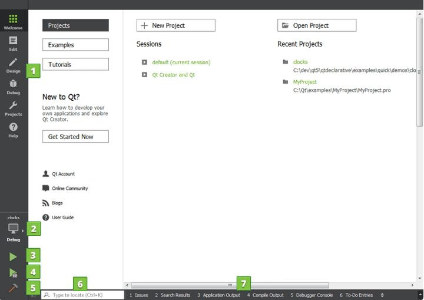

> 1. Creator的所有工作模式, 可以通过Ctrl+(1-6)进行模式切换
> 2. 可以选择将程序编译成调式版或发布版
> 3. 编译并运行程序
> 4. 编译并以调试模式运行程序
> 5. 编译程序
> 6. 定位器: 可以用于查找整个工程, 文件, 类, 函数, 文档或文件系统
> 7. 各种模式对应的输出窗口

### 编辑界面

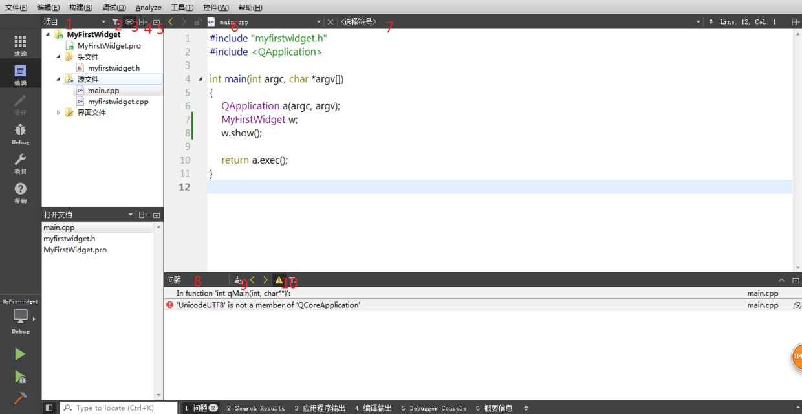

> 1. 可以选择显示模式
> 2. 可以打开或关闭简化树和隐藏生成的文件
> 3. 与编辑器同步
> 4. 分栏: 可以将1的多种模式分栏显示.
> 5. 隐藏分栏
> 6. 打开的文件列表
> 7. 可快速切换到当前文件的函数或变量出. 
> 8. 编译器文件时, 显示的错误或警告
> 9. 清空
> 10. 关闭编译警告

- 常用快捷键

1. Ctrl+B: 编译项目
2. Ctrl+R: 编译并运行项目
3. 将鼠标出在某个类上面,然后按Ctrl, 这时鼠标会变成小手, 点击鼠标, 会跳到类的声明出.
4. F2: 移动到定义出
5. F4: 在头文件和源文件之前切换
6. Ctrl+/:注释当前鼠标所在行, 如果鼠标选择了多行, 则注释多行
7. Ctrl+i: 选中文本块, 可格式化代码块
8. Ctrl+Shift+U: 查找当前变量所有被应用的地方
9. 将鼠标移动到某变量上, 邮件选择Refactor(重构), 这个可以帮组你重命名所有应用到的变量, 函数

- 设计师界面

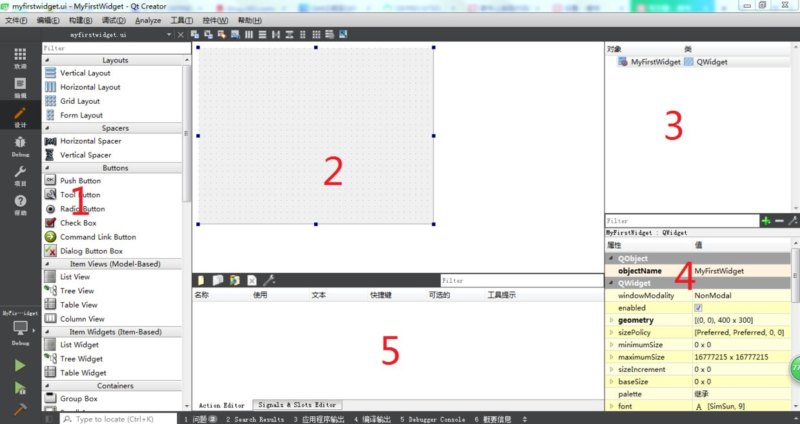

双击xxx.ui, 直接进入设计师界面

>1. 控件选择窗口
>2. 编辑主窗口, 可以将左侧的控件直接拖入到次窗口中进行设计
>3. 凡是拖入到2中的控件, 均会在次窗口以父子关系显示
>4. 属性编辑窗口, 选中某个控件, 则其相应的属性就会显示在此窗口中, 并且可根据需求作相应更改
>5. 动作和信号槽窗口, 可以编辑动作和连接信号槽.

- 项目设置窗口

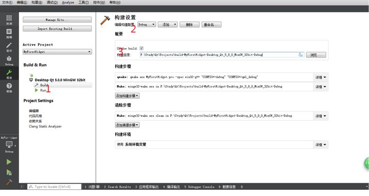

> 1. 编译时设置和运行设置
> 2. 构建模式: 常用为debug和release
> 3. 影子构建: 将生成的编译文件和发布文件放到单独的一个文件夹中, 从而和源代码分开.

### 运行第一个程序

- `Qt creator-->文件-->新建文件或项目-->Application-->Qt widgets-->Application`

- 输入项目名称和项目路径
- 输入类名`MyFirstWidget`, 基类选择`QWidget`
- 点击下一步, 完成.

按`ctrl+R`运行一下程序, 看是否可以编译并运行.

#### 项目文件简介

在工程文件夹中, 会生成`build-MyFirstWidget-Desktop-Qt_5_9_8_MinGW_32bit-Debug`和`MyFirstWidget`文件

- 第一个文件

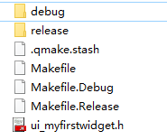

1. debug和release文件夹: 打卡debug文件下, 双击MyFirstWidget.exe, 可以看到窗口. 而在release文件夹, 里面为空. 这是因为debug存放调试版本的可执行程序, release存放发布版本.
2. Makefile, Makefile.Debug, Makefile.Release: 描述代码的编译规则, 这是Qt自动生成更新的.
3. ui_myfirstwidget.h:与ui文件对应的头文件, 并且格式都为ui_xxx.h, 这是Qt自动生成更新的.

- 第二个文件

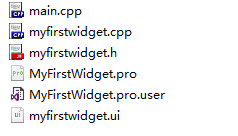

1. main.cpp: 主函数源文件
2. myfirstwidget.h和myfirstwidget.cpp: 窗口类的头文件和源文件
3. myfirstwidget.ui: 设计师界面类文件
4. MyFirstWidget.pro.user: 用于记录打开工程的路径, 所用的编译器, 构建的编译器, 构建的工具链, 生成目录,打开工程的qt-creator版本等. 
5. MyFirstWidget.pro: Qt工程文件, 这个文件非常重要.

#### Qt.pro文件介绍


```python
#-------------------------------------------------
#
# Project created by QtCreator 2021-08-10T13:52:00
#
#-------------------------------------------------

QT       += core gui#需要引用工程的模块,core表示核心模块, gui表示界面模块

greaterThan(QT_MAJOR_VERSION, 4): QT += widgets#Qt5为兼容Qt4而专门设计, 若版本大于4, 则将widgets模块加入到Qt变量中.

TARGET = MyFirstWidget
TEMPLATE = app#工程所使用的模板. app表示一个窗口应用程序. 如果是lib则表明是一个动态库模板

# The following define makes your compiler emit warnings if you use
# any feature of Qt which has been marked as deprecated (the exact warnings
# depend on your compiler). Please consult the documentation of the
# deprecated API in order to know how to port your code away from it.
DEFINES += QT_DEPRECATED_WARNINGS#定义编译选项, 当前表示当Qt的某些功能被标记为过时的, 那么编译器会发出警告.

# You can also make your code fail to compile if you use deprecated APIs.
# In order to do so, uncomment the following line.
# You can also select to disable deprecated APIs only up to a certain version of Qt.
#DEFINES += QT_DISABLE_DEPRECATED_BEFORE=0x060000    # disables all the APIs deprecated before Qt 6.0.0

CONFIG += c++11

SOURCES += \
        main.cpp \
        myfirstwidget.cpp#源文件

HEADERS += \
        myfirstwidget.h#头文件

FORMS += \
        myfirstwidget.ui#设计师界面

# Default rules for deployment.
qnx: target.path = /tmp/$${TARGET}/bin
else: unix:!android: target.path = /opt/$${TARGET}/bin
!isEmpty(target.path): INSTALLS += target

```

- pro文件解析:

注释: 使用#号, 作单行注释

`\`:可以分行书写, 但任为一行

- Qt+=coregui: 需要引用工程的模块, core表示核心模块, gui表示界面模块.
- greaterThan(QT_MAJOR_VERSION, 4): QT += widgets: 这是
- QT

> `QT+=core gui`

​	指定工程中使用的Qt的模块, 默认情况下使用Qt的core和gui模块

- TARGET

  指定所生成.exe或.dll文件的名字; 下面的例子会生成`FiberMgr.exe`

  > TARGET=FiberMgr
  >
  > TEMPLATE=app

- DEFINES

  qmake添加该字段指定的全局宏定义. VS中也有类似的全局宏定义, 在.dll工程中经常用到, 来指定的是dllexport, 还是dllimport

  > DEFINES+=FUNDLL_LIBRARY

  在头文件中使用上述宏定义

  ```c++
  #if defined(FUNDLL_LIBRARY)
  #  define FUNDLLSHARED_EXPORT __declspec(dllexport)
  #else
  #  define FUNDLLSHARED_EXPORT __declspec(dllimport)
  #endif
  ```

- SOURCES

  工程中使用的所有源文件的名字(不包含路径)

  ```C++
  SOURCES +=\
      main.cpp\
      dialog.cpp
  ```

- HEADERS

  工程中使用的所有头文件的名字(不包含路径)

  ```c++
  HEADERS +=\
      dialog.h
  ```

- FORMS

  列出工程中使用的UI文件(xml格式), 这些文件会在编译之前被uic (User Interface Compile)处理. 构建UI文件时所需要的依赖性, 头文件, 源文件都会被自动添加到工程中.

  UIC会把.ui(xml)文件转换成C++的.h文件(通常叫Ui_dialog.h). 其实是在.h文件里定义一个类, 里面包含UI文件中的所有元素/对象.

  ```C++
  FORMS = mydialog.ui\
      mywidget.ui\
      myconfig.ui
  ```

- INCLUDEPATH

  列出工程中#include项所需要搜索的路径, 即头文件的路径

  多个路径用空格隔开.

  如果路径本身包含空格, 则需要用双引号引起来.

  ```C++
  INCLUDEPATH=
      C:/Users/92021021/Desktop/CG-QR.png \
  ```

- DEPENDPATH

  列出所依赖项所在的路径. 当处理include文件时, 会使用该项.

  ```c++
  INCLUDEPATH+=$$pwd/../mydll
  DEPENDPATH+=$$PWD/../mydll
  ```

- PWD

  表示当前.pro文件所在的路径

  ```c++
  INCLUDEPATH +=$$PWD/../mydll
  ```

- OUT_PWD

  表示输出的"Makefile"所在的路径(通常在编译后生成的.exe文件的上层目录里面)

  ```c++
  LIBS+= -L$$OUT_PWD/.../funDll/-lfunDll
  ```

- LIBS

  指定工程里需要链接的库文件(.lib或.dll)

  通常用Unix风格, 大写的L表示"路径", 小写的l表示"库文件名字".

  ```c++
  unix:LIBS += -L/usr/local/lib -math
  win32:LIBS += c:/mylibs/math.lib
  ```

- 总结

  > Qt程序的编译过程: 
  >
  > 1. 创建`.pro`文件
  > 2. 由`.pro`文件生成`Makefile`文件
  > 3. `Makefile`中保存编译和链接器的参数选项, 还表述了所有源文件之间的关系(源文件需要的特定的包含文件,可执行头文件要求包含的目标文件模块及库等)
  > 4. 创建程序`make`, 读取`Makefile` 文件, 然后激活编译器, 汇编器, 资源编译器和链接器等以便产生最后的输出, 最后输出生成通常时可执行文件.

### MyFirstWidget代码讲解

- main.cpp

```c++
#include "myfirstwidget.h"	//头文件
#include <QApplication>	//包含QApplication类

int main(int argc, char *argv[])
{
    QApplication a(argc, argv);	//创建一个QApplication实例
    MyFirstWidget w;	//创建MyFirstWidget实例,
    w.show();	//并显示

    return a.exec();	//进入Qt的主循环时间. 当调用exit()时, 才会退出循环, 退出main()函数
}
```

QApplication 初始化过程

> 1. 使用用户的桌面设置, 初始化应用程序,例如窗口的调色板, 字体等.
> 2. 执行事件处理.
> 3. 也可根据命令行参数, 设置自己的内部状态.
> 4. 制定窗口样式, 颜色调配.
> 5. 设置剪切板, 管理鼠标事件.

- myfirstwidget.h

```c++
#ifndef MYFIRSTWIDGET_H
#define MYFIRSTWIDGET_H

#include <QWidget>

namespace Ui {
class MyFirstWidget;
}

class MyFirstWidget : public QWidget	//公有继承QWidget, 这样就可以调用QWidget提供的方法. QWidget是所有Qt窗口空间的基类, 一般情况自定义窗口控件都应该继承QWidget或其子类.
{
    Q_OBJECT	//Q_OBJECT宏, 必须在类的私有声明中声明这个宏, 这样就可以使用Qt的信号槽机制, 元对象系统,对象树等Qt特有的功能.

public:
    explicit MyFirstWidget(QWidget *parent = nullptr);	//构造函数, 其中parent参数,可指定父窗口.
    ~MyFirstWidget();

private:
    Ui::MyFirstWidget *ui;	//ui界面对象指针, 凡是需要ui界面中的控件对象指针, 都可以通过这个指针来进行访问.
};

#endif // MYFIRSTWIDGET_H

```

- myfirstwidget.cpp

```C++
#include "myfirstwidget.h"
#include "ui_myfirstwidget.h"

MyFirstWidget::MyFirstWidget(QWidget *parent) :
    QWidget(parent),	//如果有参数parent不为空, 则MyFirstWidget会称为该指针所指窗口的子窗口
    ui(new Ui::MyFirstWidget)//创建界面对象, 并将指针赋值给ui, 创建的对象会在结构函数中释放
{
    ui->setupUi(this);//设置ui界面
}

MyFirstWidget::~MyFirstWidget()
{
    delete ui;
}
```

- myfirstwidget.ui

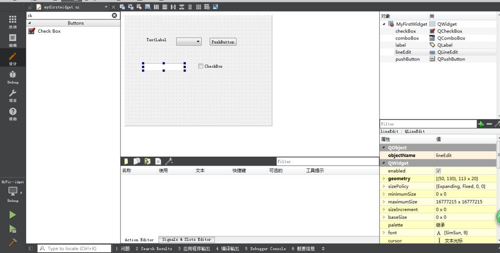

打开设计师界面, 初始为一个空窗口, 现在可以尝试从左侧控件列表树中拖拽控件到中间的设计窗口, 可以在filter过滤器中输入关键字.

鼠标点击QLineEdit控件, 在属性编辑器中查找属性text, 修改text的值为"Hello Qt",此时QLineEdit控件显示Hello Qt字样. 

进一步查找objectName, 此时对应显示值为lineEdit.

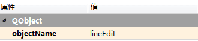

在打开mysirstwidget.cpp文件, 在构造函数中输入`ui->`, 此时会弹出一个ui所拥有的对象列表, 选择lineEdit对象, Qt会将对象的名称用作对象的变量名, 还可以通过调用findChild函数模板查找对应属性名的对象. 调用setText方法如下


## 窗口和控件

### 窗口定义

窗口: MyFirstWidget

控件: 当一个窗口嵌入到其他窗口中,则它本身的标题栏会隐藏, 这些窗口就叫做控件.(如: TextLabel, Combo Box...)

父窗口, 子窗口

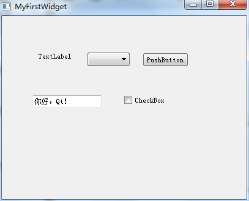

- 三种顶层窗口:

QWidget: 最基础的窗口, 所有窗口及控件都继承QWidget

QDialog: 对话窗口

QMainWindow: 主窗口, 一般主窗口会包括标题栏, 菜单栏, 工具栏, 中心部件, 停靠窗口.

### 验证父子窗口

新建项目ParentChildWidget, 类名ParentChildWidget, 基类选择QWidget

- mian.cpp包含QPushButton

```c++
#include "parentchildwidget.h"
#include <QApplication>
#include <QPushButton>

int main(int argc, char *argv[])
{
    QApplication a(argc, argv);
    ParentChildWidget w;
    w.show();

    QPushButton buttonWindow;
    buttonWindow.setText("我是窗口");
    buttonWindow.show();
    buttonWindow.resize(200, 100);

    return a.exec();
}
```

在parentchildwidget.cpp中, 包含QPushButton, 在构造函数中添加

```c++
#include <QPushButton>
#include "parentchildwidget.h"
#include "ui_parentchildwidget.h"

ParentChildWidget::ParentChildWidget(QWidget *parent) :
    QWidget(parent),
    ui(new Ui::ParentChildWidget)
{
    ui->setupUi(this);

    QPushButton* buttonChild = new QPushButton(this);
    buttonChild->setText("我是控件");
}

ParentChildWidget::~ParentChildWidget()
{
    delete ui;
}
```

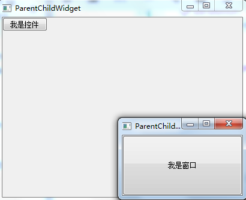

- 父子窗口特性

修改main函数

```c++
#include "parentchildwidget.h"
#include <QApplication>
#include <QPushButton>

int main(int argc, char *argv[])
{
    QApplication a(argc, argv);
    ParentChildWidget w;
    w.show();
    return a.exec();
}
```

修改parentchildwidget.cpp构造函数

```C++
ParentChildWidget::ParentChildWidget(QWidget *parent) :
    QWidget(parent),
    ui(new Ui::ParentChildWidget)
{
    ui->setupUi(this);

    for (int i = 1; i <= 3; ++i)
    {
        QPushButton* buttonChild = new QPushButton(this);
        buttonChild->setText(QString("我是控件%1").arg(i));
        buttonChild->resize(100*i, 100);
        connect(buttonChild, SIGNAL(clicked()), buttonChild, SLOT(close()));
    }
}
```

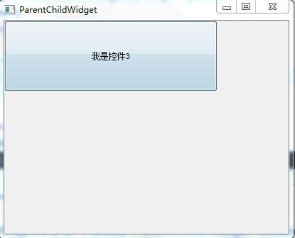

后创建的控件会覆盖在先创建的控件上.

## QWidget

QWidget是所有GUI控件的基类.

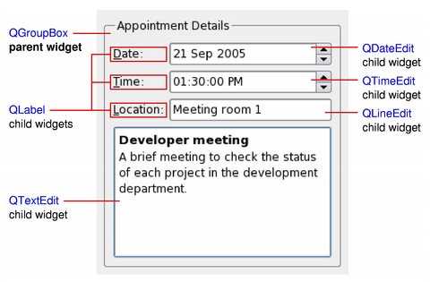

### QWidget的几何属性

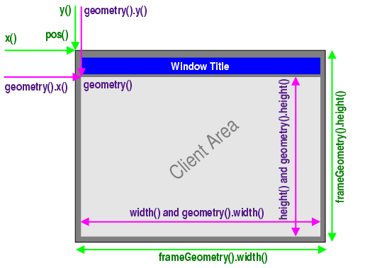

> frameGeometry, frameSize, x, y, pos: 框架的几何区域和大小,框架指窗口的最外层.
>
> geometry, width, height, size, rect: 内部绘图区域的几何框架

```c++
#include "widgetproperty.h"
#include "ui_widgetproperty.h"

WidgetProperty::WidgetProperty(QWidget *parent) :
    QDialog(parent),
    ui(new Ui::WidgetProperty)
{
    ui->setupUi(this);
    setGeometry(0,0,400,300);
}

WidgetProperty::~WidgetProperty()
{
    delete ui;
}
```

运行代码, 窗口的绘图区域左上角和屏幕的左上角刚好吻合, 而标题栏都跑到屏幕外面.

### 窗口标识

windowFlags属性.

通过调用setWindowFlags(Qt::WindowStaysOnTopHint)来设置窗口类型和窗口标识

在WindgetProperty构造函数后继续添加代码

```c++
move(100,100);
setWindowFlags(Qt::CustomizeWindowHint|Qt::WindowStayOnTopHint);
```

运行程序时,窗口的标题栏已经被隐藏掉了, 并且点击其他外部窗口时, 本窗口仍然在屏幕最上面.

- 常用窗口类型:

>Qt::Widget//默认窗口
>
>Qt::Dialog//对话窗口
>
>Qt::SplashScreen//启动窗口

- 常用窗口标识

> Qt::SplashScreen	//在还没有展示出主界面前的启动画面
>
> Qt::FramelessWindowHint	//隐藏标题栏, 并且去掉窗口的边框, 窗口不能移动和缩放
>
> Qt::CustomizeWindowHint	//隐藏标题栏, 不会去掉窗口的边框, 窗口不能移动, 但可以缩放.
>
> Qt::WindowStaysOnTopHint	//使窗口始终处于最顶部, 类似于播放器中的总在最前

### 其他属性

> 1. acceptDrops: 接受放下事件
> 2. autoFillBackground: 如果将这个属性设置为true, Qt将在调用paintEvent之前填充背景,可使用调色板来进行填充
> 3. enable: 窗口是否可用.
> 4. focus: 是否获得焦点
> 5. modal: 是否为模态窗口
> 6. mouseTracking: 是否追踪鼠标
> 7. palette: 调色板
> 8. toolTip: 鼠标悬停时的提示信息
> 9. toolTipDuration: 鼠标悬停时显示提示信息持续时间
> 10. visible: 是否可见
> 11. windowTitle: 窗口标题

## 信号与槽

当要求鼠标点击某个按钮时, 对应的窗口就需要关闭, 那么这个按钮就会发出一个关闭信号, 而窗口接收到这个信号后执行关闭窗口. 那么, 这个信号就是按钮被点击, 而槽就是窗口执行关闭函数.

可将信号和槽理解成`命令-执行`, 即信号就是命令, 槽就是执行命令.

- 信号

  当一个对象的内部状态发生改变时, 如果其它对象对它的状态需要有所反应, 这时就应该让这个类发出状态改变的信号.

  声明信号使用`signals`关键字

  发送信号使用`emit`关键字

  > 注意
  >
  > 1. 所有的信号声明都是公共的, 所以Qt规定不能再`signals`前面加public, private, protected.
  > 2. 所有的信号都没有返回值, 所以返回值都用`void`
  > 3. 所有的信号都不需要定义
  > 4. 必须直接或间接继承自QOBject类, 并且开头私有声明包含Q_OBJECT
  > 5. 当一个信号发出,会立即执行其槽函数, 等待槽函数执行完毕后, 才会执行后面的代码.
  > 6. 发出信号使用emit关键字
  > 7. 信号参数的个数不得少于槽参数的个数

- 连接信号与槽

  使用connect函数连接信号和槽

  原型1

  ```c++
  static QMetaObject::Connection connect(
  	const QObject *sender,	//信号发送对象指针
      const char *signal,	//信号函数字符串,使用SIGNAL()
      const QObject *receiver,	//槽函数对象指针
      const char *member,	//槽函数字符串,使用SLOT()
      Qt::ConnectionType=Qt::AutoConnection	//连接类型,
  );
  
  //example
  connect(pushButton, SIGNAL(clicked()),dialog,SLOT(close()));
  //connect(信号发送对象指针,信号函数字符串,c)
  ```

  原型2

  ```c++
  static QMetaObject::Connection connect(
  	const QObject *sender,	//信号发送对象
      const QMetaMethod &signal,	//信号函数地址
      const QObject *receiver,	//槽函数对象指针
      const QMetaMethod &method,	//槽函数地址
      Qt::ConnectionType type=Qt::AutoConnection	//连接类型
  );
  
  //example
  connect(pushButton, QPushButton::clicked, dialog, QDialog::close);
  ```

### 信号槽示例

`新建项目-->SignalsAndSlotsWidget-->类名同:SignalsAndSlotsWidget-->基类:QWidget`

总结信号槽自动关联规则如下"

> 1. 使用`QObject::setObjectName()`方法为对象设置名称.
> 2. 调用`QMetaObject::connectSlotsByName()`启用自动关联
> 3. 用下划线`_`将`on`, `对象名`,`信号名`连接后命名的函数, 即`on\_对象名\_信号名(参数)`

这样就可以实现信号槽的自动连接了.

- 在ui中编辑信号槽

- 通过对象名管理信号槽

- QsignalMapper

  这个类可以连接多个按钮, 匹配发送信号对象的整数,字符串, 窗口指针, 继承与QObject的对象参数重新发送他们


## Qt其他知识点

### comboBox控件的基本用法

一般用到控件comboBox的基本用法是获取当前的值

1. currentIndex(): 获取当前comBox的索引, 是int类型的值.
2. currentText(): 获取当前comBox的文本, 是QString类型.

信号与槽函数构建

```c++
void MainWindow::on_comboBox_currentIndexChanged(const QString &arg1)
{
    if(ui->comboBox->currentText()=="Chinese")
    {
        qDebug()<<"优秀";
    }
    else if (ui->comboBox->currentText()=="English")
    {
        qDebug()<<"good";
    }
}
```

- 构造函数中进行绑定

```c++
connect(ui->comboBox,SIGNAL(currentTextChanged(QString)),this, SLOT(SetValue(QString)));
```

- 槽函数

```c++
void MainWindow::SetValue(QString)
{
    if (ui->comboBox->currentText()=="Chinese")
    {
        qDebug()<<"111";
    }
    else if (ui->comboBox->currentText()=="English")
    {
        qDebug()<<"222";
    }
}
```

- 当comobox里面的值发生了改变之后, 子哦对那个识别并打印出来里面的值

  ```c++
  void on_comboBox_currentIndexChange(const QString &arg1);
  ```

- 在.cpp文件中

  ```c++
  void MainWindow::on_comboBox_currentIndexChanged(const QString &arg1)
  {
      QString str = ui->comboBox->currentText();
      qDebug()<<"str:"<<str;
  }
  ```

  

### label

- 简便方式

  ```python
  QLabel *label = new QLabel();
  QImage *img = new QImage;
  img->load("F:\\image\img.png");
  ui->label->setPixmap(QPixmap::fromImage(*img));
  ```

  

- 将图片显示到label上面.

```c++
    QPixmap *pixmap = new QPixmap("F:\\timg.jfif");//定义图片读取对象
    pixmap->scaled(ui->label->size(), Qt::KeepAspectRatio, Qt::SmoothTransformation);
    ui->label->setScaledContents(true);
    ui->label->setPixmap(*pixmap);
```

上述加载的图像, 都是图片适应label的大小.

### 解码二维码QZXing

1. 配置qzxing

```c++
//1. 将QZXing文件复制到当前项目工程文件
//2. 在当前*.pro文件中添加一下代码
QT       += core gui

greaterThan(QT_MAJOR_VERSION, 4): QT += widgets

#DEFINES += QT_MESSAGELOGCONTEXT
include(./QZXing2.ing4/QZXing.pri)//主要是这一行

TARGET = QR_code_qzxing_2
TEMPLATE = app
```

​		2. 导入库

```c++
#include <QZXing.h>
#include <QDeBug>
#include <QImage>

int main(){
    QZXing decoder;//声明二维码解码器
    decoder.setDecoder(QZXing::DecoderFormat_QR_CODE | QZXing:DecoderFormat_CODE_128)//限定识别范围, 可以提高识别率, 另外, 有些二位图片为png, 有透明色, 也会导致识别失败, 把透明色换成白色即可.
        
    QImage imageToDecode("./img.jpg");//声明QImage对象, 并初始化待解码的图片
    QString strCode = decoder.decodeImage(imageToDecode);//对QImage对象的图片进行二维码解码;
    
    qDebug()<<"decode result: "<<strCode; 
}
```

### QFileDialog

```c++
#include <QFileDialog>
file = QFileDialog::getOpenFileName(
	QWidget * parent=0,//this
    const QString & caption = QString(),//提示
    const QString & dir = QString(),//默认路径
    const QString & filter = QString(),//文件后缀过滤器
    QString * selectedFilter = 0;
    Options options=0
);//定义文件路径读取对话框
QFileInfo fileInfo;//定义获取路径信息的路线
QString file, fileName, fileSuffix, filePath;
file = QFileDialog::getOpenFileName();

fileInfo = QFileInfo(file);
//文件名
fileName = fileInfo.fileName();
//文件后缀
fileSuffix = fileInfo.suffix();
//绝对路径
filePath = fileInfo.absolutePath();

1. parent: 指定父类组件, 一般默认未NULL
2. 指定对话框的标题
3. 指定默认打开的文件目录, "./img"
4. 文件后缀名过滤器, 例:"QImage(*.png *.jpg)", 即只选择后缀名未jpg, png的图片文件
5. 默认过滤器.
6. 对话框的一些参数设定, 比如只显示文件夹等, 他的取值是enum QFileDialog::Option,

d8*/
```

​	实例

```c++
QString file_name = QFileDialog::getOpenFileName(this,tr("打开文件"),NULL,tr("二维码文件(*.png *.jpg *.bmp)"));
```

### qrencode

##### 1. 简介

官网: https://fukuchi.org/works/qrencode/

Libqrencode 是一个快速紧凑的库, 用于在QR码符号中的编码数据. 可接受一个字符串或数据块列表, 然后再QR Code符号中编码为**位图数组**. 

##### 2. 使用

官网下载源码包[qrencode-4.2.0](), 解压-->创建一个Qt Widgets Application 工程

1. 将源码中的config.h.in文件修改成config.h;

2. 将qrencode源码中的(*.h *.c)加入到工程中(右键添加现有文件);

3. 在工程的pro文件中添加宏定义`DEFINES +=HAVE_CONFIG_H`;

4. 在config.h中重新定义 MAJOR_VERSION, MICRO_VERSION, MINOR_VERSION, VERSION定义为下图

   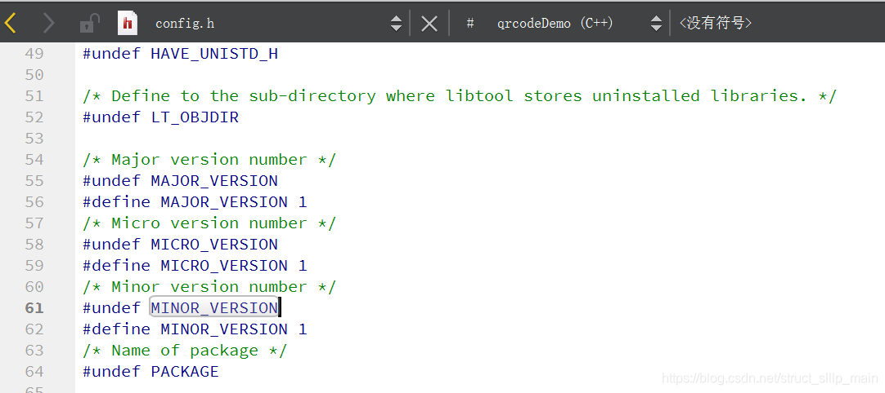

   修改完成后, 可以使用qrencode库来生成二维码, 在*.cpp中引入qrencode.h头文件, 在构造函数中调用二维码生成函数即可.

   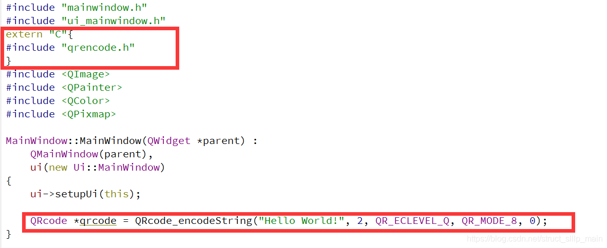

### QT-QPainter

#### 介绍

> 1. 可以在QPaintDevice类上绘制各种图形
> 2. QPaintDevice类表示QPainter的绘图设备(画布)
> 3. QpaintDevice子类有Qimage, QOpenGLPaintDevice, QWidget等
> 4. QpaintDevice子类有QImage上进行绘制图形
> 5. QPainter只能在类对象的paintEvent()函数中绘制图形

### QPixmap

#### 前言

> Qpixmap类用于绘图设备的图像显示, 它可以作为一个QPainterDevice对象, 也可以加载到一个控件中, 通常是标签或者按钮, 用于在标签或按钮上显示图形
>
> QPixmap可以读取的图像文件类型有BMP, GIF, JPG等

#### 方法

| 方法          | 描述                                 |
| ------------- | ------------------------------------ |
| copy()        | 从QRect对象复制到QPixmap对象         |
| fromImage()   | 将**QImage**对象转化为QPixmap对象    |
| grabWidget()  | 从给定的一个窗口小控件创建一个像素图 |
| grabWindow()  | 在窗口创建数据的像素图               |
| load()        | 加载图像文件作为QPixmap对象          |
| save()        | 将QPixmap对象保存为文件              |
| **toImage()** | 将QPixmap对象转换为Qimage对象        |

### Qt-QMessageBox

### 详细说明

QMessageBox提供一个模态对话框, 用于通知用户或询问用户一个问题并接收反馈.

#### 1. 基于属性的API 

先构造QMessageBox的一个实例, 设置所需的属性, 并调用exec()来显示消息. 最简单的配置是仅设置message text属性

```c++
QMessageBox msgBox;	//声明QMessageBox的实例对象
msgBox.setText("str");
msgBox.exec();//用户需单击OK来取消消息框.
```

用户必须单击OK按钮来取消消息框. 在消息框被取消之前, GUI的其余部分将被阻塞.

## QT windeployqt

在Qt的安装包下会有两个目录包含以上文件, `C:\Qt\Qt5.9.8\Tools\QtCreator\bin`和`C:\Qt\Qt5.9.8\5.9.8\mingw53_32\bin`, 最好使用后者目录下的文件. 切记不要将两个目录下的文件混合使用, 会报错无法定位程序输入点于动态链接库Qt5Core.dll

Qt官方开发环境使用的动态链接库方式, 在发布生成的exe程序时, 需要复制一大堆dll. 如果自己去复制dll, 会出现丢三落四, 导致exe在别的电脑无法正常运行.

执行windeployqt.exe: `win->Qt5.9.9-->MinG5.9(32-bit)-->Qt5.9 for Desktop (MinGW 4.9 32 bit)` 可以打开Qt命令行, 从这里就可以执行windeployqt工具

继承开发环境QtCreator目前生成图像界面程序exe大致可分为两类:

1. Qt Widegets Application

   > - 首先用QtCreator创建一个Qt Widgets Application项目, 直接默认的QMainWindow程序, 项目名:hellomv;
   >- 然后以Release方式编译生成exe程序:
   > - 生成的程序运行正常之后, 找到项目的生成目录:`xxx\build-hellomw-Desktop_Qt_5_9_MinGW_32bit-Releas`, 在子文件夹`release`中找到`hellomw.exe`
   >- 将这个exe复制到一个新的单独的文件夹里面用于发布,(D:\hellomw)
   > - 使用windeployqt工具命令: `windeployqt hellomw.exe`
   >- 然后可以在`D:\hellomw`文件夹里看到windeployqt工具自动复制的插件文件夹和dll, qm文件. 这时候得到的就完整的exe程序集合, 以来关系都解决好了.
   > - 
   
2. Qt Quick Application

   > - 用QtCreator创建Qt Quick Application项目
   > - ......(上述一致)
   > - 使用windeployqt工具命令: `windeployqt helloqml.exe --qmldir c:\Qt\Qt5.9.8\5.9.8\mingw594\qml`

注: 若不使用编译器Qt所对应cmd, 可能会导致`qwindows.dll`生成不同.

## QFileInfo

1. 准确判断文件是否存在

   用QFileInfo::isFile()方法

2. 准确判断文件夹是否存在

   用QFileInfo::isDir()方法

   用QDir::exists()方法

3. 不确定字符串是文件还是文件夹路径

   用QFileInfo::exists()方法

   用QFile::exists()方法

4. 实例

   ```c++
   //判断文件是否存在
   //QDir
   QString dir_str = "E:/kuisu/Qt/readme.txt";
   QDir dir;
   qDebug()<<dir_str<<dir.exists(dir_str);
   
   //QFileInfo
   QFileInfo file(dir_str);
   if(file.exists(dir_str))
       qDebug()<<"存在";
   else {
       qDebug()<<"不存在";
   }
   ```

## Qt程序添加图标

| 执行文件图标                                              | 标题栏图片                                                 | 任务栏图标                                                |
| --------------------------------------------------------- | ---------------------------------------------------------- | --------------------------------------------------------- |
|  |  |  |

### 修改标题栏图标

任务栏和标题栏的图标都是一起改的

`右键qrc添加新文件-->Qt-->Qt Resource File`

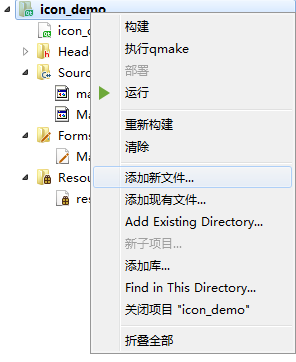

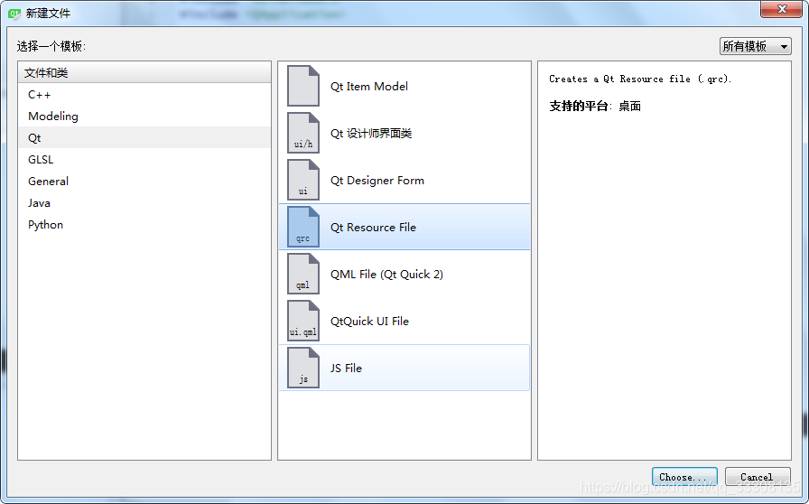

新建完成后, 列表出现, 然后点击`res.qrc`, 点击`添加-->添加前缀-->输入/img`


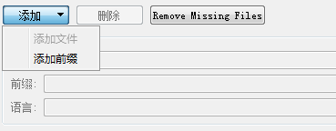

然后再添加-->添加文件-->log.png

列表就会自动添加


再`MainWindow.cpp`添加代码

```c++
MainWindow::MainWindow(QWidget *parent) :
    QMainWindow(parent),
    ui(new Ui::MainWindow)
{
    ui->setupUi(this);
    this->setWindowIcon(QIcon(":/img/origin.png"));
}
```

### 修改可执行程序图标

程序图标必须要使用`.ico`文件, 直接改后缀是没有用的, 先下载图片文件, [在线生成](https://converticon.com/)一个ico图标

在项目代码文件中, 新建一个logo.txt文件,并输入

```
IDI_ICON1 ICON DISCARDABLE "logo.ico"
```

然后重命名`logo.rc`文件

在`.pro`文件里添加:

```
RC_FILE += logo.rc
```

再重新编译就好了.


## QFile 文件操作

### 文件打开方式

一个文件使用`open()`打开, 使用`close()`关闭, `flush()`刷新

| 函数                 | 解释                                                         |
| -------------------- | ------------------------------------------------------------ |
| QIODevice::NotOpen   | 设备不打开                                                   |
| QIODevice::ReadOnly  | 设备以只读的方式打开                                         |
| QIODevice::WriteOnly | 以只写方式打开                                               |
| QIODevice::ReadWrite | 以读写方式打开, 写入文件会覆盖之前的内容                     |
| QIODevice::Append    | 设备已追加模式打开(此模式下,不能读文件)                      |
| QIODevice::Truncate  | 设备再打开之前会被截断                                       |
| QIODevice::Text      | 读取时, 行尾终止符被转换为"\n". 写入时, 行尾终止符将转为本地编码 |

```c++
QFile file("/home/cheng/TestPro/D_FileOperation/File/test.txt");
    if(file.open( QIODevice::ReadWrite | QIODevice::Append ) )// QIODevice::Text |
    {
        QByteArray arr;
        arr =  file.read(6);
        qDebug() << arr;
        file.write("hello qfile!\n");
    }
```

"hello qfile! \n"会被追加到文件里, arr输出为空.

QByteArray类

QByteArray类提供了一个字节数.

- 写文件

  ```c++
  qint64 QIODevice::write ( const char * data, qint64 maxSize )　　//将最多maxSize字节的数据从数据写入设备。 返回实际写入的字节数，如果发生错误，则返回-1。
  qint64 QIODevice::write ( const char * data )　　//将数据从零字节的8位字符串写入设备。 返回实际写入的字节数，如果发生错误，则返回-1。 
  qint64 QIODevice::write ( const QByteArray & byteArray )　　//将byteArray的内容写入设备。 返回实际写入的字节数，如果发生错误，则返回-1。
  ```

  ```c++
  QFile file("/home/File/test.txt");
      if(file.open( QIODevice::WriteOnly ))
      {
          const char* data = "hello qfile!\n";
          QByteArray arr(data);//存储二进制byte数组
          file.write(data);
          file.write(arr);
          file.write(data,5);
      }
  ```

  结果为

  > hello qfile!
  > hello qfile!
  > hello

- 读文件--read()

  ```c++
  qint64 QIODevice::read ( char * data, qint64 maxSize )//从设备读取最多maxSize字节为数据，并返回读取的字节数。 如果发生错误，例如尝试从以WriteOnly模式打开的设备读取时，此函数返回-1。当没有更多数据可供读取时，返回0。在关闭的套接字上读取或在进程死亡后读取也会返回-1
  QByteArray QIODevice::read ( qint64 maxSize )　　//从设备读取最多maxSize字节，并返回读取为QByteArray的数据。此功能无法报告错误; 返回一个空的QByteArray（）可能意味着当前没有数据可用于读取，或者发生了错误。
  ```

  ```c++
  QFile file("/home/File/test.txt");
      if (file.open(QFile::ReadOnly))
      {
  　　　　　//QByteArray arr = file.read(1024);
           //qDebug() << arr;
           char buf[1024];
           qint64 lineLength = file.read(buf, sizeof(buf));
           if (lineLength != -1)
           {
               QString str(buf);//将字符数组转换为QString
               qDebug() << str;
           }
       }
  ```

  打印结果

  > "hello qfile!
  > hello qfile!
  > hello"

### QByteArray

QByteArray是存储二进制byte数组

与QString的区别

> 1. QByteArray中存储的全是byte.
> 2. QString中存储的全是16 bit Unicode码.
> 3. QString是在Qt API中从头到尾都用的
> 4. QByteArray则用于以下两种情况：①存储原始二进制数据；②内存保护很严格的时候（也就是说，不能乱用空间以免冗余）

构造QByteArray

```c++
QByteArray ba("Hello");
//ba.size()=5
```

访问: 用类似与array[i]的语法形式.

空白字符消除: 

	- 若需消除空白字符("\n", "\t"), 使用`trimmed()`.
	- 想移除两端的空白字符并且把文中的多个连续空白字符替换成单个空白字符，可以用simplified()方法。

查找字符: indexOf()与lastIndexOf()方法：前者是从指定位置开始正向查找，后者则是从指定位置逆向查找。找到时返回字符或子串的索引位置，否则返回-1。

```c++
QByteArray ba("We must be <b>bold</b>, very <b>bold</b>");
int j = 0;
while ((j = ba.indexOf("<b>", j)) != -1) {
    cout << "Found <b> tag at index position " << j << Qt::endl;
    ++j;
}
```

## QMutex

QMutex类提供了一种保护一个变量和一段代码的方法

`mutex.lock()`: 锁住互斥量(mutex). 如果互斥量是解锁的, 那么当前线程立即占用并锁定它. 否则, 当前线程就会被阻塞, 直到掌握这个互斥量的线程对它解锁位置.

`mutex.unlock()`: 解锁.

`mutex.tryLock()`:尝试解锁, 如果该互斥量已近锁住, 他就立即返回

## Qt调试详细日志文件输出

qInstallMessageHandler

### 函数说明

`QtMessagehandler qInstallMessageHandler(QtMessageHandler handler)`

此函数再使用Qt消息处理程序之前已定义. 返回一个指向前一个消息处理过程.

该函数用于打印`qDebug, qWarning, qCritical, qFatal`的错误. Qt库(调试模块)包含成千的警告信息.Qt构建再release模式下还包含一些除了`QT_no_WARNING_OUTPUT, QT_NO_DEBUG_OUTPUT`之外的警告已经设置再遍历. 

缺省的消息处理程序像标准输出打印消息, 如果这是一个致命的消息, 应用程序立即终止.

只有一个消息处理程序可以被定义, 因为这通常是再应用程序的基础上完成控制调试输出的.

### 调试级别

> qDebug: 调试信息
>
> qWarning: 警告信息
>
> qCritical: 严重错误
>
> qFatal: 致命错误

### 实例


```c++
#include "widget.h"
#include <QApplication>

#include <QFile>
#include <QTextStream>
#include <QDebug>
#include <QDateTime>
#include <QMutex>
#include <QString>

void outputMessage(QtMsgType type, const QMessageLogContext &context, const QString &msg)
{
    // 加锁
    static QMutex mutex;
    mutex.lock();
	QString text;
	
	//判断消息类型
    switch(type)
    {
    case QtDebugMsg:
        text = QString("Debug:");
        break;

    case QtWarningMsg:
        text = QString("Warning:");
        break;

    case QtCriticalMsg:
        text = QString("Critical:");
        break;

    case QtFatalMsg:
        text = QString("Fatal:");
    }

    // 设置输出信息格式
    QString context_info = QString("File:(%1) Line:%2)")
        .arg(QString(context.file))
        .arg(context.line);
    QString current_date_time = QDateTime::currentDateTime().toString("yyyy-MM-dd hh:mm:ss ddd");
    QString current_date = QString("(%1)")
        .arg(current_date_time);
    QString message = QString("%1 %2 %3 %4")
        .arg(text)
        .arg(context_info)
        .arg(msg)
        .arg(current_date);

    // 输出信息至文件中（读写、追加形式）
    QFile file("log.txt");
    file.open(QIODevice::WriteOnly | QIODevice::Append);
    QTextStream text_stream(&file);
    text_stream << message << "\r\n";
    file.flush();
    file.close();

    // 解锁
    mutex.unlock();
}

int main(int argc, char *argv[])
{
    QApplication app(argc, argv);
    //注册MessageHandler
    qInstallMessageHandler(outputMessage);

    Widget w;
    w.debtest();
    w.show();
    //打印日志到文件中
    qDebug("This is a debug message");
    qWarning("This is a warning message");
    qCritical("This is a critical message");
    qFatal("This is a fatal message");

    return app.exec();
}
```
结果:

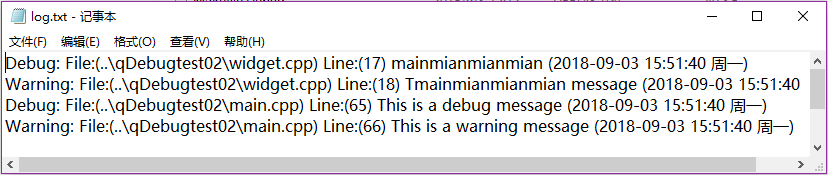

## 传入值参数与引用参数的区别

### 传值与传引用

- 传值

  将实参的值赋值给行参.

  那么对行参的修改, 不会影响实参的值

- 传地址

  是传值的一种特殊方式, 只是它传递的时地址

  那么传地址以后, 实参和行参都指向同一个对象

- 串引用

  真正的以地址的方式传递参数, 传递以后, 行参和实参都是同一个对象, 只是他们名字不同而已.

  对行参的修改将影响实参的值.

### 函数调用的角度分析

- 传值

  函数参数压栈的是参数的副本

  任何的修改是在副本上作用, 没有作用在原来的变量上.

- 传指针

  压栈的是指针变量的副本

  当你对指针解指针操作时, 其值是指向原来的那个变量, 所以对原来变量的操作.

- 传引用

  压栈的是应用的副本

  由于引用是指向某个变量的,对引用的操作其实就是对他指向的变量的操作(作用和传指针一样)

### 函数参数传递机制的基本理论

调用其他函数的函数位主调函数, 被调用的函数位被调函数.

- 传递值(pass by value)

  被调函数的形式参数作为被调函数的局部变量处理, 即在堆栈中开辟了内存控件以存放由主调函数放进来的实参的值, 从而称为了实参的一个副本. 传递的特点是被调函数对形式参数的任何操作都是作为局部变量进行, 不会影响主调函数的实参变量的值.

- 引用传递(pas by reference)

  被调函数的形式参数虽然也作为局部变量在堆栈中开辟了内存空间, 但是这时存放的是由主调函数放进来的实参变量的地址. 被调函数对形参的任何操作都被处理成间接寻址, 即通过堆栈中存放的地址访问主调函数的实参变量.

## QT错误

### 程序数据库管理器不匹配,请检查完整


解决方法: 

到D:\VisualStudio2015\VC\bin目录下面拷贝mspdbsrv.exe、mspdb140.dll、mspdbcore.dll、mspdbst.dll到D:\VisualStudio2015\Common7\IDE下面，**或者**到D:\VisualStudio2015\Common7\IDE目录下面拷贝mspdbsrv.exe、mspdb140.dll、mspdbcore.dll、mspdbst.dll到D:\VisualStudio2015\VC\bin下面，**总之就是让这两个文件夹中同时含以上四个文件（如下图）**。重Qt启即可。

以上确实在VisualStudio2015安装目录中进行操作, 这确实时qt运行时发生的的错误


## Python使用

### 问题记录

#### qt const char* 和QString互转

- const char *  =======> QString

  ```C++
  const char * c = "hello , world !";
  QString str1(c);
  QString str2 = QString(c);
  QString str3 = QString(QLatin1String(c));
  QString str4 = QString::fromLocal8Bit(c);
  ```

- QString =============> const char *

  ```c++
  //方法1
  QString str1= "Hello , world !";
  QByteArray ba = str1.toLocal8Bit();
  const char *c1 = ba.data();
  const char *c2 = ba.constData();
  const char *c3 = str1.toLocal8Bit().constData()
   
  //方法2
  QString str1= "Hello , world !";
  const char *c= str1.toStdString().c_str();
   
   
  //方法3，使用strcpy或者memcpy，这里只用memcpy写示例
  char test[64] ={0};
  QString str1= "Hello , world !";;
  memcpy(test, str1.toLatin1().data(), strlen(str1.toLatin1().data()));
  //如果是中文应该尝试用以下方法：
  memcpy(test, str1.toLocal8Bit().data(), strlen(str1.toLocal8Bit().data()));  //gb2312
  memcpy(test, str1.toUtf8().data(), strlen(str1.toUtf8().data()));   //utf-8
  ```

  

#### 外部路径存在空格的解决方案

用`$$quote()`将路径括起来.

#### C++ 调用python Py_Initialize出错

方法总结: 需要Qt的位数和python的位数一致

#### expected unqualified-id before ';' token

后经过尝试发现#include <Python.h>要放在#include <QMainWindow>的前面，头文件的顺序不正确也会报错。

#### Qt '::hypot' has not been declared

原因: `#include <Python.h>`在`#include <cmath>`之前, 导致hypot被某段代码重命名了.

解决: 在`Python.h前引入cmath`

### 实例

head

```c++
#include <cmath>//防止Python.h中重名
#include <Python.h>//保证在QApplication之前, 防止重名
#include <iostream>
#include "widget.h"
#include <QApplication>

int main(int argc, char *argv[])
{
    QApplication a(argc, argv);
    using namespace std;

    char strName[10] = "kuisu";
    int number = 100;
    int returnValue;

    qDebug()<<"start run python";
    Py_Initialize();
    if(!Py_IsInitialized())
    {
        return -1;
    }
    PyObject* pModule = PyImport_ImportModule("runPy");
    if(!pModule)
    {
        cout<<"open failure"<<endl;
        return -1;
    }
    PyObject* pFunhello = PyObject_GetAttrString(pModule,"name");
    if(!pFunhello)
    {
        cout<<"get function hello failed"<<endl;
        return -1;
    }
    PyObject_CallFunction(pFunhello,"i", number);//"s":传递字符串, "i":传递整型
    Py_Finalize();


    Widget w;
    w.show();

    return a.exec();
}

```

外部文件

```c++
#python37 compiler
INCLUDEPATH += $$quote(D:\Program Files\Python37\include)
LIBS += -L$$quote(D:\Program Files\Python37\libs) -lpython37


DISTFILES += \
    helloPy.py \
    helloPy.py \
    ../build-use_python-Desktop_Qt_5_9_8_MinGW_32bit-Release/debug/helloPy1.py \
    ../build-use_python-Desktop_Qt_5_9_8_MinGW_32bit-Release/release/helloPy.py

```


注意: 添加py文件时, 需要把文件添加到项目工程`.exe`的同目录下, 这样才能够实时修改py文件, 进行同步调用.


### C1083: 无法打开包括文件: "Python.h": No such file or directory


当在debug模式下时, 如法进行调用python的动态库

切换为release模式, 便可以正常使用.

## 参考

- [Qt安装](https://zhuanlan.zhihu.com/p/28224035)
- [窗口和控件](https://zhuanlan.zhihu.com/p/28274107)
- [Qt Windeployqt](https://www.cnblogs.com/klcf0220/p/10333349.html)
- [qInstallMessagehandler](https://www.cnblogs.com/ybqjymy/p/14692418.html)
