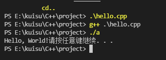

# VS code

- 下载[Visual Studio Code](https://code.visualstudio.com/)
- 安装VS code, 并添加到环境变量

## 完全卸载

如果之前安装有VSCode, 简单卸载, 其配置相关信息,包括打开的文件夹,安装过的扩展任在.完全卸载需要卸载之后再删除一下两个文件

- `C:|users\$用户名\.vscode`
- `C:\Users\$用户名\AppData\Roaming\Code`

## 配置C++环境

### 1. 创建一个文件夹,用来存放代码

建议不同的编程预研采用不同的文件夹, 因为VSCode打开文件夹(工作目录)后,如果进行一定的配置之后,会在该文件夹下产生一个`.vscode`的文件夹,存放一些`.json`的配置文件, 这些配置文件时对工作目录中的代码产生作用的.在需要相同开发环境的时候,不用每次都去传教文件并配置相关配置,直接拷贝.vscode文件即可.

### 2. 安装MinGW编译器

- 下载[MinGW](https://osdn.net/projects/mingw/downloads/68260/mingw-get-setup.exe/)
- 安装
- 添加环境变量
- cmd环境中测试`gcc -v`

### 3. 安装C/C++扩展

在VSCode打开之前建立的文件`File-->Open Floder`.并在该文件下新建`hello.cpp`


- 搜索安装C/C++扩展并安装
- 重启hello.cpp

## 配置C/C++环境

### 1. 配置编译器

- 配置编译路径

按快捷键`Ctrl+Shift+P`调出命令面板, 输出`C/C++`, 选择`Edit Configurations(UI)`进入配置两个选项.

1. 编译路径:`D:\Program Files (x86)\MinGW\bin\g++.exe`
2. IntelliSense模式:`gcc-x64`

配置完成后, 当前文件夹中加入`.vscode`文件夹,里面有一个`c_cpp_prpperties.json`,说明配置成功.可以通过Ctrl+`快捷键打开内置终端并进行编译.

```c++
{
    "configurations": [
        {
            "name": "Win32",
            "includePath": [
                "${workspaceFolder}/**"
            ],
            "defines": [
                "_DEBUG",
                "UNICODE",
                "_UNICODE"
            ],
            //此处是编译器路径，以后可直接在此修改
            "compilerPath": "D:/mingw-w64/x86_64-8.1.0-win32-seh-rt_v6-rev0/mingw64/bin/g++.exe",
            "cStandard": "c11",
            "cppStandard": "c++17",
            "intelliSenseMode": "gcc-x64"
        }
    ],
    "version": 4
}
```



### 2. 配置构建任务

- 创建`tasks.json`文件告诉VSCode如何构建(编译)程序.

该任务调用g++编译器基于源代码创建可执行文件. 

1. 按快捷键`Ctrl+Shift+P`调出命令面板, 输入`task`
2. 选择`Task: Configure Default Build Task`
3. 再选择`C/C++: g++.exe build active file`

此时出现一个名为tasks.json配置文件

```c++
{
	"version": "2.0.0",
	"tasks": [
		{
			"type": "cppbuild",
			"label": "C/C++: g++.exe build active file",//任务的名字
			"command": "D:\\Program Files (x86)\\MinGW\\bin\\g++.exe",
			"args": [//编译时候的参数
				"-g",//添加gdb调试选项
				"${file}",//当前文件名
				"-o",//指定生成可执行文件名称
				"${fileDirname}\\${fileBasenameNoExtension}.exe"
			],
			"options": {
				"cwd": "${fileDirname}"
			},
			"problemMatcher": [
				"$gcc"
			],
			"group": {
				"kind": "build",
				"isDefault": true//表示快捷键Ctrl+Shift+B可运行该任务
			},
			"detail": "compiler: "D:\\Program Files (x86)\\MinGW\\bin\\g++.exe\""
		}
	]
}
```


### 3. 配置调试设置

主要为了在`.vscode`文件中产生一个launch.json文件, 用来配置调试相关信息.

点击`Debug-->Start Debugging`

#### 安装gdb.exe

- 输入`mingw-get`

  如果感触MinGW Installation Manager窗口, 说明安装正常(然后关闭窗口, 否则接下来会报错)

- cmd中输入`mingw-get install gcc`

- 安装`g++,gdb`

```cmd
mingw-get install g++
mingw-get install gdb
```


## 参考

- [MinGW与gdb调试,MinGW中没有gdb.exe解决办法](https://www.cnblogs.com/fps2tao/p/14427099.html)

