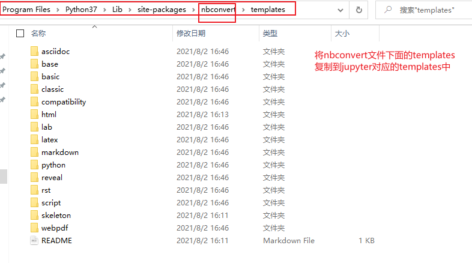
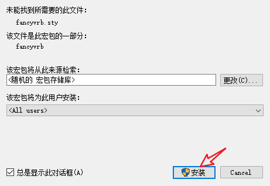

# jupyter配置

## 流程

- 下载[python3.7.4](https://www.python.org/ftp/python/3.7.4/python-3.7.4-amd64.exe)
- 安装[pandoc](https://github.com/jgm/pandoc/releases/tag/2.14.1)
- 安装[MiKTeX](https://miktex.org/download/ctan/systems/win32/miktex/setup/windows-x64/basic-miktex-21.6-x64.exe)
- 安装nbconvert(pip install nbconvert)
- 处理nbconvert库
  - 从D:\Program Files\Python37\\***share***\jupyter\nbconvert\templates将templates文件复制到下面的路径
  - 
  - 

## 参考

-[Jupyter Notebook导出PDF时报错“nbconvert failed: xelatex not found on PATH……”的解决办法](https://blog.csdn.net/grandesucesso/article/details/107831868)