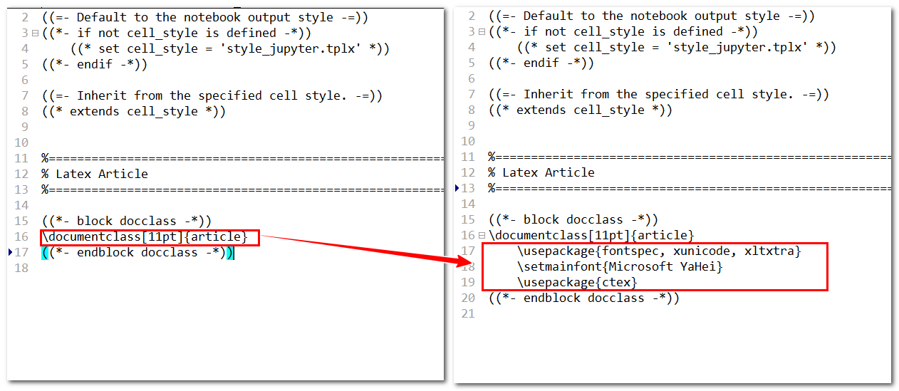
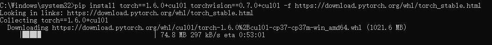
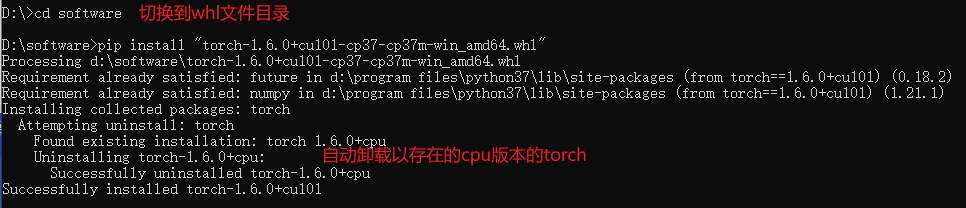
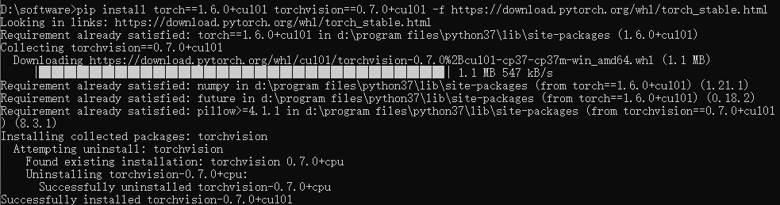
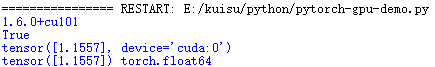

# python环境相关配置

- 下载[python3.7.4](https://www.python.org/downloads/release/python-374/)

- 测试安装结果

```cmd
pip --version #参考安装的版本
pip --list #参考已经安装的库
```


## # jupyter notebook

- 安装命令

```cmd
python -m pip install --upgrade pip
pip install jupyter
```

- 配置jupyter

```
jupyter notebook --generate-config
```

并在指定路径下修改jupyter的默认启动文件目录`c.NotebookApp.notebook_dir=""`

### 使jupyter可以download pdf

- 下载[pandoc](https://pandoc.org/installing.html#windows)
- 下载[MikTeX](https://miktex.org/download)

之后系统会弹出界面,允许其安装一些工具包,一直点**安装**就行.

### 使jupyter到出pdf显示中文

- 安装`nbconvert`

```pip
pip install nbconvert==5.6.1
```

- 替换`templates`文件

将python的`D:\Program Files\Python37\Lib\site-packages\nbconvert`文件夹中的`templates`文件复制到`D:\Program Files\Python37\share\jupyter\nbconvert`

- 修改`article.tplx`

```tex
\usepackage{fontspec, xunicode, xltxtra}
\setmainfont{Microsoft YaHei}
\usepackage{ctex}
```



- example

```
jupyter nbconvert --to pdf mynotebook.ipynb
```

## pytorch安装

- 安装`torch 1.6.0`和`torchvision 0.7.0`

```cmd
pip install #torch==1.6.0+cpu torchvision==0.7.0+cpu -f https://download.pytorch.org/whl/torch_stable.html
```

- 安装`tensorboard`

```pip
pip install Tensorboard
pip install TensorboardX
```

- 模型可视化

```cmd
tensorboard --logdir=''
```

## python库批量安装

- 构建需要安装的库的`requirements.txt`

```vim
#requirements.txt
nbconvert==5.6.1
matplotlib
opencv-python
matplotlib
pandas
numpy
pillow
sklearn
tensorboard
tensorboardX
```

```cmd
pip install -r requirements.txt
```

## 更换torch为gpu版本

不用担心cpu版本和gpu版本是否可以共存, 因为在安装gpu版本时, 系统会自动删除cpu版本


- Wheel 安装

  ```cmd
  pip install torch==1.6.0+cu101 torchvision==0.7.0+cu101 -f https://download.pytorch.org/whl/torch_stable.html
  
  pip install torch==1.6.0+cu101 torchvision==0.7.0+cu101 -f https://download.pytorch.org/whl/torch_stable.html
  ```

  

- 离线安装

  到官网下载wheel文件离线下载:`https://download.pytorch.org/whl/torch_stable.html`

  `ctrl+f`查找`torch-1.6.0%2Bcu101-cp37-cp37m-win_amd64.whl`

  

  再安装torchvision

  

- 测试

  ```python
  import torch
  
  print(torch.__version__)
  print(torch.cuda.is_available())
  
  x=torch.randn(1)
  if torch.cuda.is_avaliabel():
      device=torch.device('cuda')
      y=torch.ones_like(x,device=device)
      x=x.to(device)
      z=x+y
      print(z)
      print(z.to("cpu"),torch.double)
  ```

  

## pycocotools安装

与[COCO](http://cocodataset.org/)图像数据集有关, 用于目标检测, 分割, 人的关键点检测, 素材分割和标题生成.

- 下载, 解压缩并将图像放入:coco/images/
- 下载并将注释放在:coco/annotations/

```cmd
pip install pycocotools==2.0.0
```


## 参考

- [解决nbconvert failed](https://blog.csdn.net/dream_an/article/details/51799067#t5)

- [jupyter 到处pdf不显示中文](https://blog.csdn.net/qq_40211493/article/details/112381582?utm_medium=distribute.pc_relevant.none-task-blog-2%7Edefault%7EBlogCommendFromMachineLearnPai2%7Edefault-12.readhide&depth_1-utm_source=distribute.pc_relevant.none-task-blog-2%7Edefault%7EBlogCommendFromMachineLearnPai2%7Edefault-12.readhide)

