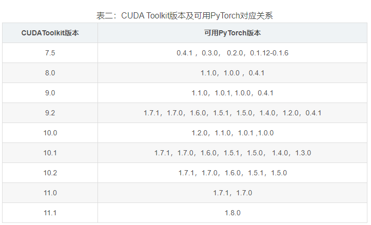
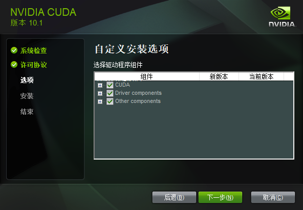
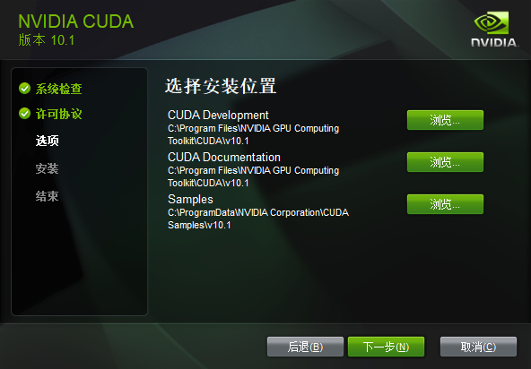
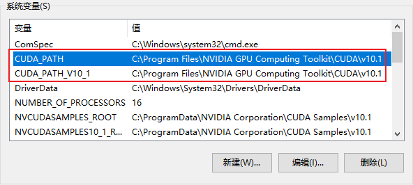
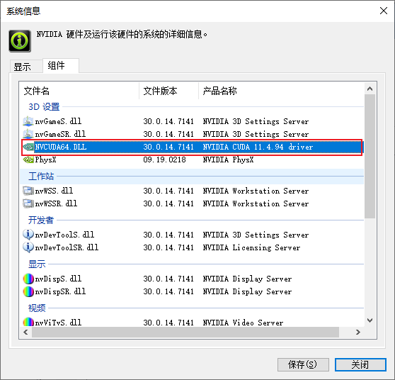
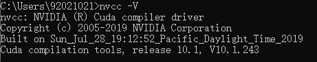
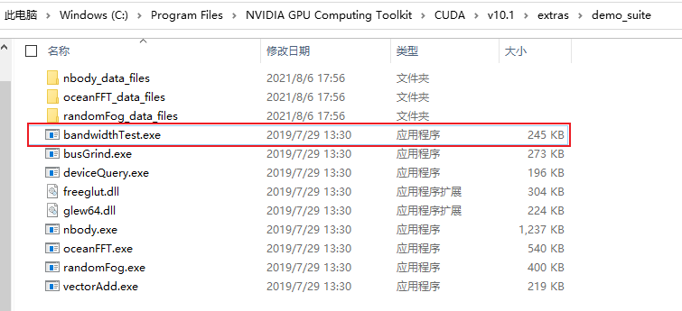
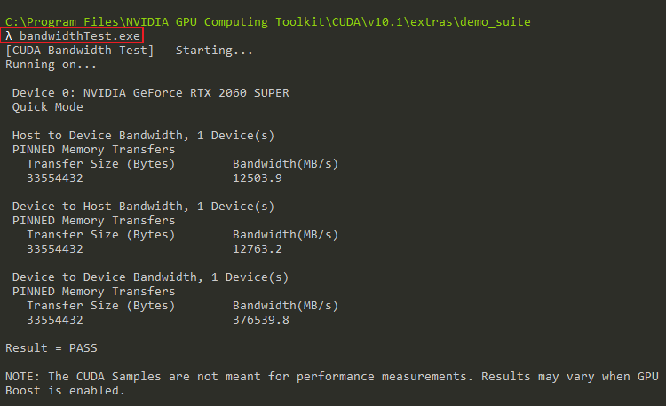

# 显卡驱动安装

- cuDNN支持矩阵

cuDNN 7.6.4-7.6.5: refer to the following table to view the list of supported NVIDIA hardware, CUDA, and CUDA driver version for cuDNN versions 7.6.4 and v7.6.5

| Supported NVIDIA Hardware (Compute Capability)               | [CUDA Version](https://developer.nvidia.com/cuda-toolkit-archive) | CUDA Driver Version |
| ------------------------------------------------------------ | ------------------------------------------------------------ | ------------------- |
| Turing (7.5) Volta (7.x) Xavier (7.2) Pascal (6.x) Maxwell (5.x) Kepler (3.x) | CUDA 10.2                                                    | r440                |
| Turing (7.5) Volta (7.x) Xavier (7.2) Pascal (6.x) Maxwell (5.x) Kepler (3.x) | CUDA 10.1.243                                                | r418.39             |
| Turing (7.5) Volta (7.x) Xavier (7.2) Pascal (6.x) Maxwell (5.x) Kepler (3.x) | CUDA 10.0.x                                                  | r410.48             |
| Volta (7.x) Xavier (7.2) Pascal (6.x) Maxwell (5.x) Kepler (3.x) | CUDA 9.2.148                                                 | r396.26             |
|                                                              | CUDA 9.1.85 (Not Supported)                                  |                     |
| Volta (7.x) Xavier (7.2) Pascal (6.x) Maxwell (5.x) Kepler (3.x) | CUDA 9.0.176                                                 | r384.111            |
|                                                              | CUDA 8.0.61 (Not Supported)                                  |                     |

- 下载[NVIDIA](https://www.nvidia.cn/geforce/drivers/), 选择自动驱动更新, 下载并安装.

- [CUDA](https://developer.download.nvidia.cn/compute/cuda/10.1/Prod/local_installers/cuda_10.1.243_426.00_win10.exe)下载安装

版本选择为:1.7.cuDNN7.6.4-

- ### [CUDNN](https://developer.nvidia.com/rdp/cudnn-archive#a-collapse805-101)下载安装

- 准备

  - 注册NVIDIA
  - 转至:[NVIDIA cuDNN主页](https://developer.nvidia.com/cudnn)
  - 点击下载
  - 完成简短的调查并点击提交
  - 接受条款和条件, 显示cuDNN的可用下载版本列表
  - 选择要安装的cuDNN版本[cuDNN 8.0.5 for CUDA 10.1](https://developer.nvidia.com/rdp/cudnn-archive#a-collapse805-101)
  - 将cuDNN解压到CUDN目录

- 安装Windows上安装[cuDNN 8.0.5 for CUDA 10.1](https://developer.nvidia.com/rdp/cudnn-archive#a-collapse805-101)

  - 准备

    - CUDA目录:`C:\Program Files\NVIDIA GPU tookkit\CUDA\v10.1`
    - cuDNN目录路径为`<installPath>`

  - 安装

    - Navigate to `<installPath>` directory containing cuDNN

    - Unzip the cuDNN pakcage: `cudnn-x.x-windows-x64-v8.x.x.x.zip`

    - copy the following files into the CUDA Toolkit directory

      a. Copy `<installPath>\duda\bin\cudnn*.dll` to `C:\Program Files\NVIDIA GPU Computing Toolkit\CUDA\v x.x\bin`

      b. Copy `<installPath>\cuda\include\cudnn*.h` to `C:|Program Files\NVIDIA GPU Computing Toolkit\CUDA\vx.x\include`

      c. Copy`<installPath>\cuda\lib\x64\cudnn*.lib` to `C:\Program Files\NVIDIA GPU COmputing Toolkit\CUDA\vx.x\lib\x64` 

  - Set following environment variable to point to where cuDNN is located.

    `win+R-->control sysdm.cpl-->高级-->环境变量`

    `Variable Name: CUDA_PATH`

    `Variable Value:C:\Program Files\NVIDIA GPU Computing Toolkit\CUDA\vx.x`

    

  - Include `cudnn.lib` in you visual studio project

    a. open the Visual Studio project and right-click on the project name.

    b. Click `Linker-->Input-->Additional Dependencies`

    c. Add `cudnn.lib` and click `OK`

## 参考本机的CUDA驱动适配版本

`打开英伟达控制面板-->帮助-->系统信息-->组件`

表示本机支持的CUDA11.4 版本, 表示不支持更高版本的cudnn.

- 参考CUDN的安装

  `cmd-->nvcc -V`

  

- 查看安装结果

  

  `cmd-->bandwidthT.exe`

  

## 参考

- [CUDA和CUDNN的安装](https://blog.csdn.net/u010618587/article/details/82940528?utm_medium=distribute.pc_relevant.none-task-blog-2%7Edefault%7EBlogCommendFromMachineLearnPai2%7Edefault-3.pc_relevant_baidujshouduan&depth_1-utm_source=distribute.pc_relevant.none-task-blog-2%7Edefault%7EBlogCommendFromMachineLearnPai2%7Edefault-3.pc_relevant_baidujshouduan)
- [Pytorch, CUDA Toolkit及显卡驱动版本对应关系](https://blog.csdn.net/weixin_42069606/article/details/105198845)
- [NVIDIA CUDNN DOCUMENTATION](https://docs.nvidia.com/deeplearning/cudnn/install-guide/index.html#download-windows)
- [Windows10 安装CUDA+粗DNN+pytorch](https://www.cnblogs.com/guan-zl/p/12986253.html)

