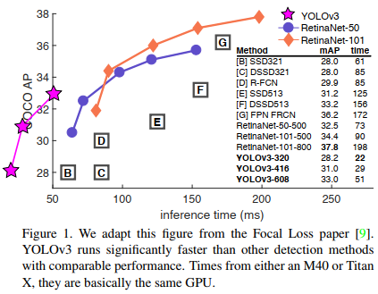
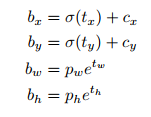

# YOLOV3: An Incremental Improvement

## Abstract

We present some updates to YOLO! We made a bunch of little design changes to make it better. We also trained this new network that's pretty swell. It's a little bigger than last time but more accurate. It's still fast though, don't worry. At 320x320 YOLOv3 runs in 22 ms at 28.2 mAP, as accurate as SSD but three times faster. When we look at the old the old .5 IOU mAP detection metric YOLOv3 is quite good. It achieves 57.9 AP50 in 51 ms on a Titan X, compared to 57.5 AP50 in 198 ms by RetinaNet, similar performance but 3.8x faster. As always, all the code is online at https://pjreddie.com/yolo\

## Introduction
 Sometimes you just kinda phone it in for a year, you know? I didn't do a whole lot of research this year. Spent a lot of time on Twitter. Played around with GANs a little. I had a little momentum left over from last year; I managed to make some improvements to YOLO. But, honestly, nothing like super interesting, just a bunch of small changes that make it better. I also helped out with other people's research a little.
 
Actually, that's what brings us here today. We have a camera-ready deadline and we need to cite some of the random updates I make to YOLO but we don't have a source. So get ready for a tech report!

The great thing about tech reports is that they don't need intors, y'all know why we're here. So the end of this introduction will signpost for the rest of the paper. First we'll tell you what the ideal is with YOLO v3. Then we'll tell you how we do. We'll also tell you about some things we tried that didn't work. Finally we'll contemplate what this all means.

## The Deal

So here's the deal with YOLOv3: We mostly took good ideas from other people. We also trained a new classifier network that's better than the other ones. We'll just take you through the whole system from scratch so you can understand it all.

## 2.1 Bounding Box Prediction

Following YOLO9000 our system predicts bounding boxes using dimension cluster as anchor boxes. The network predicts 4 coordinates for each bounding box, tx,ty,tw,th. If the cell is offset from the top left corner of the image by (cx,cy) and the bounding box prior has width and height pw,ph, then the predictions correspond to 

During training we use sum of squared error loss. If the ground truth for some coordinate prediction is t*  our gradient is the ground truth value (computed from the ground truth box) minus our prediction: t*-t*. This ground truth value can be computed by inverting the equations above.

YOLOv3 predicts an objectness score for each bounding box using logistic regression. This should be 1 if the bounding box prior overlaps a ground truth object by more than any other bounding box prior. If the bounding box prior is not the best but does overlap a ground truth object by more than some threshold we ignore the prediction, following. We use the threshold 0.5. Unlike our system only assigns one bounding box prior for each ground truth object. If a bounding box prior is not assigned to a ground truth object it incurs no loss for coordinate or class predictions, only objectness.