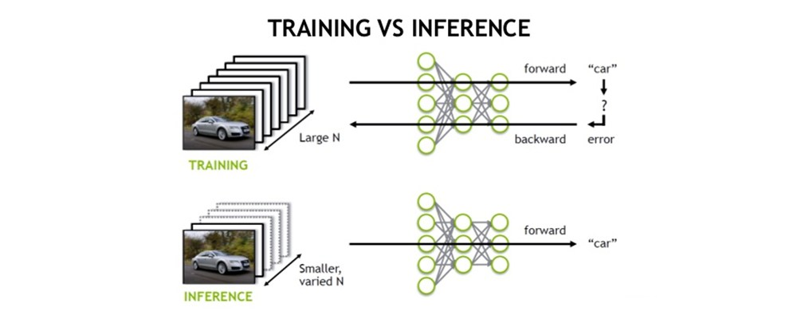
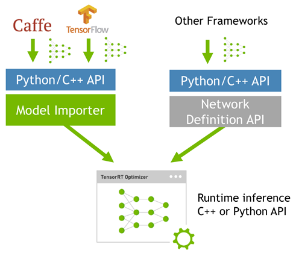
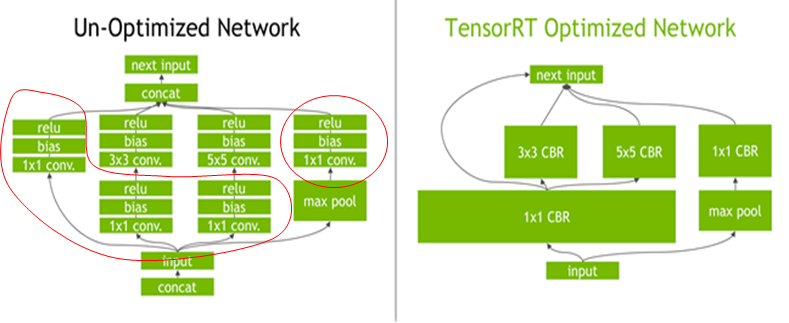
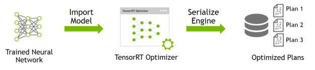
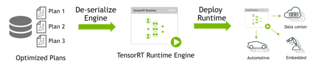
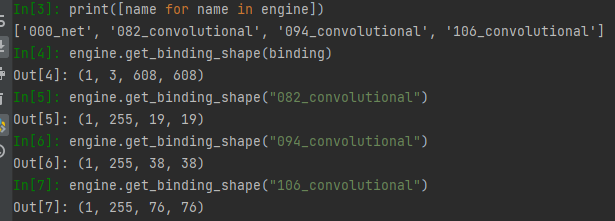

# TensorRT Documentation

## 1. Overview

The core of NVDIA TensorRT is a c++ library that facilitates high-performance inference on NVIDIA graphichs processing units. TensorRT takes a trained net network, which consists of a network definition and a set of trained parameters, and produces a highly optimized runtime engine that performs inference for that network.

TensorRT provides API's via C++ and Python that help to express deep learning models via the Network Definition API or load a pre-defined model via the parsers that allow TensorRT to optimize and run them on an NVIDIA GPU. TensorRT applies graph optimizations, layer fusion, among other optimizations, while also finding the fastest implementation of that model leveraging a diverse collection of highly optimized kernels. TensorRT also supplies a runtime that you can use to execute this network on all of NVIDIA's GPU's from the NVIDIA Kepler generation onwards.

TensorRT also includes optional high speed mixed precision capabilities introduced in the NViDIA Tegra x1, and extended with the NVIDIA Pascal , Volta, Turing, Ampere Architectures.

## 2. Getting started

Ensure you are familiar with the following installation requirements and notes.

- Python support for windows included in the zip package is considered a preview release and not ready for production use.
- If you are using the TensorRT Python API and PyCUDA isn't already installed on your system, see [installing PyCUDA](https://docs.nvidia.com/deeplearning/tensorrt/install-guide/index.html#installing-pycuda). If you encounter any issues with PyCUDA usage, you may need to recompile it yourself. For more information, refer to [installing PyCUDA on Linux](https://wiki.tiker.net/PyCuda/Installation/Linux)
- Ensure you are familiar with the [NVIDIA TensorRT Release Notes](http://docs.nvidia.com/deeplearning/sdk/tensorrt-release-notes/index.html)
- Verify that you have the NVIDIA CUDA toolkit installed; version [10.2](https://docs.nvidia.com/cuda/archive/10.2/index.html), [11.0 upgdate 1](https://docs.nvidia.com/cuda/cuda-toolkit-release-notes/index.html#cuda-whats-new-11Upd1), [11.1 update 1](https://developer.nvidia.com/cuda-toolkit-archive), [11.2 update 2](https://developer.nvidia.com/cuda-toolkit-archive),.. [11.5](https://developer.nvidia.com/cuda-toolkit-archive) are supported
- The TensorFlow to TensorRT model  export requires [TensorFlow 1.15.5](https://github.com/tensorflow/tensorflow/releases/tag/v1.15.5). Some Python samples require [TensorFlow 2.5.1](https://github.com/tensorflow/tensorflow/releases/tag/v2.5.1), such as `efficiented` and `efficientnet`
- The PyTorch examples have been tested with [PyTorch 1.9.0](https://github.com/pytorch/pytorch/releases/tag/v1.9.0), but may work with older version.
- The TensorRT ONNX parser has been tested with [ONNX 1.9.0](https://github.com/onnx/onnx/releases/tag/v1.9.0), and supports opset 14
- if the target system has both TensorRT and one or more training frameworks installed on it, the simplest strategy is to use **the same version of cuDNN** for the training frameworks as the one that TensorRT ships with. If this is not possible, or for some reason strongly undesirable, be careful to properly manage the side-by-side installation of cuDNN on the single system. In some cases, depending on the training framework being used, this may not be possible without patching the training framework source.
- The installation instructions below assume you want the full TensorRT; both the C++ and Python APIs. In some environments and use cases, you may not want to install the Python functionality. If that is the case, simply don't install the Debian or RPM packages labeled Python or the `whl` files. None of the C++ PAI functionality depends on Python. You would need to install the UFF `whl` file if you want to export UFF file from tensorFlow models.

## 3. Downloading TensorRT

1. Go to:  https://developer.nvidia.com/tensorrt.
2. click **Download Now**
3. Select the version of TensorRT that you are interested in
4. Select the check-box to agree to the license terms
5. Click the package you want to install. Your download begins.

## 4. Installing TensorRT

we can choose between the following installation options when installing TensorRT; Debian or RPM packages, a `pip` wheel file, a tar file, or a zip file.

**About this task**

The Debian and RPM installations automatically install any dependencies, however, it:

- requires `sudo` or root privileges to install
- provides no flexibility as to which location TensorRT is installed into
- requires that the CUDA toolkit and cuDNN have also been installed using Debian or RPM packages.
- does not allow more than one minor version of TensorRT to be installed at the same time.

The tar file provides more flexibility, such as installing multiple version of TensorRT at the same time. However, you need to ensure that you have the necessary dependencies already installed and you must manage `LD_LIBRARY_PATH` yourself. For more information, see [Tar file installation](https://docs.nvidia.com/deeplearning/tensorrt/install-guide/index.html#installing-tar)

**TensorRT version**: TensorRT is a product made up of separately versioned components. The version of the product conveys important information about the significance of new features while the library version conveys information about the compatibility of incompatibility of the PAI

Table 1. Versioning of TensorRT components(+1.0 when signigicant new capabilities are added; +0.1 when capabilities have been improved)

| Product or Component                                         | Previously Released Version | Current version |
| ------------------------------------------------------------ | --------------------------- | --------------- |
| TensorRT product                                             | 8.2.1                       | 8.2.2           |
| `nvinfer` libraries, headers, samples, and documentation     | 8.2.1                       | 8.2.2           |
| UFF[`uff-converter-tf` Debian and RPM package | `uff-*.whl` file] | 8.2.1 \| 0.6.8              | 8.2.2 \| 0.6.9  |
| `graphsurgeon` [`graphsurgeon-tf` Debian and RPM packages | `graphsurgeon-*.whl` file] | 8.2.1 \| 0.4.4              | 8.2.2 \| 0.4.5  |
| `onnx-graphsurgeon` [`onnx-graphsurgeon` Debian and RPM packages | `onnx_graphsurgeon*.whl` file] | 8.2.1 \| 0.3.10             | 8.2.2 \| 0.3.12 |
| `libnvinfer` Python packages <br />`python3-libnvinfer, python3-libnvinfer-dev`<br />`tensorrt.whol` | 8.2.1 \| 8.2.1              | 8.2.2 \| 8.2.2  |

### 4.1 Debian installation

This section contains instructions for a developer installation. This installation method is for new users or users who want the complete developer installation, including samples and documentation for both the C++ and Python APIs.

**about this task**

For advanced users who are already familiar with TensorRT and want to get their application running quickly, are using an NVIDIA CUDA container with cuDNN included, or want to setup automation, follow the network repo installation instructions (see [Using the NVIDIA CUDA Network Repo For Debian installation](https://docs.nvidia.com/deeplearning/tensorrt/install-guide/index.html#maclearn-net-repo-install))

**Procedure**

1. [Download](https://docs.nvidia.com/deeplearning/tensorrt/install-guide/index.html#downloading) The TensorRT local repo file that matches the Ubuntu version and cpu architecture that you are using.

2. Install TensorRT from the Debian local repo package. Replace `ubuntuxx04, cudax.x, trt8.x.x.x`, and `yyyymmdd` with your specific OS version, CUDA version, TensorRT version and package data.

   ```sh
   os="ubuntuxx04"
   tag="cudax.x-trt8.x.x.x-yyyymmdd"
   sudo dpkg -i nv-tensorrt-repo-${os}-${tag}_1-1_amd64.deb
   sudo apt-key add /var/nv-tensorrt-repo-${os}-${tag}/7fa2af80.pub
   
   sudo apt-get update
   sudo apt-get install tensorrt
   ```

   if using python 3.x:

   ```sh
   python3 -m pip install numpy
   sudo apt-get  install python3-libnvinfer-dev
   ```

   The following additional packages will be installed:

   ```sh
   python3-libnvinfer
   ```

   if you plan to use TensorRT with TensorFlow:

   ```sh
   python3 -m pip install protobuf
   sudo apt-get install uff-converter-tf
   ```

   the `graphsurgeon-tf` package will also be installed with the above command.

   if you would like to run the samples that require ONNX `graphsurgeon` or use the Python module for your own project, run:

   ```sh
   python3 -m pip install numpy onnx
   sudo apt-get install onnx-graphsurgeon
   ```

3. Verify the installatioin

   ```sh
   dpkg -l | grep TensorRT
   ```

   you should see something similar to the following:

   ```sh
   ii  graphsurgeon-tf	8.2.2-1+cuda11.4	amd64	GraphSurgeon for TensorRT package
   ii  libnvinfer-bin		8.2.2-1+cuda11.4	amd64	TensorRT binaries
   ii  libnvinfer-dev		8.2.2-1+cuda11.4	amd64	TensorRT development libraries and headers
   ii  libnvinfer-doc		8.2.2-1+cuda11.4	all	TensorRT documentation
   ii  libnvinfer-plugin-dev	8.2.2-1+cuda11.4	amd64	TensorRT plugin libraries
   ii  libnvinfer-plugin8	8.2.2-1+cuda11.4	amd64	TensorRT plugin libraries
   ii  libnvinfer-samples	8.2.2-1+cuda11.4	all	TensorRT samples
   ii  libnvinfer8		8.2.2-1+cuda11.4	amd64	TensorRT runtime libraries
   ii  libnvonnxparsers-dev		8.2.2-1+cuda11.4	amd64	TensorRT ONNX libraries
   ii  libnvonnxparsers8	8.2.2-1+cuda11.4	amd64	TensorRT ONNX libraries
   ii  libnvparsers-dev	8.2.2-1+cuda11.4	amd64	TensorRT parsers libraries
   ii  libnvparsers8	8.2.2-1+cuda11.4	amd64	TensorRT parsers libraries
   ii  python3-libnvinfer	8.2.2-1+cuda11.4	amd64	Python 3 bindings for TensorRT
   ii  python3-libnvinfer-dev	8.2.2-1+cuda11.4	amd64	Python 3 development package for TensorRT
   ii  tensorrt		8.2.2.x-1+cuda11.4 	amd64	Meta package of TensorRT
   ii  uff-converter-tf	8.2.2-1+cuda11.4	amd64	UFF converter for TensorRT package
   ii  onnx-graphsurgeon   8.2.2-1+cuda11.4  amd64 ONNX GraphSurgeon for TensorRT package
   ```

### 4.3 pip wheel file installation

This section contains instructions for installing TensorRT from a standalone `pip` [whell file](https://pip.pypa.io/en/stable/reference/pip_wheel/)

**About this task**

While the TensorRT packages also contain pip wheel files, those wheel files require the rest of the `.deb` or `.rpm` packages to be installed and will not work alone. the standalone `pip`-installable TensorRT wheel files differ in that they are fully self-contained and installable without any prior TensorRT installation or use of `.deb or .rpm` files.

The `pip`-installable `nvidia-tensorrt` Python wheel files only support Python versions 3.6 to 3.9 and CUDA 11.x at this time and will not work with other python or CUDA version. Only the Linux operating system and x86_64 CPU architecture is currently supported. These wheel files are expected to work on Centos 7 or newer and Ubuntu 18.04 or newer.

Note: if you do not have root access, you are running outside a Python virtual environment, or for any other reason you would prefer a user installation, then append `--user` to any of the `pip` commands provided.

**Before you begin**

You must first install the `nvidia-pyindex` package, which is required in order to set up your `pip` installation to fetch additional python modules from the NVIDIA NGCC PyPI repo.

If your `pip` and `setuptools` Python modules are outdated, then use the following command to upgrade these Python modules. If these Python modules are outdated then the commands which follow later in this section may fail.

```sh
python3 -m pip install --upgrade setuptools pip
```

You should now be able to install the `nvidia-pyindex`

```sh
python3 -m pip install nvidia-pyindex
```

If your project is using a `requirements.txt` file, then you can add the following line to your `requirements.txt` files as an alternative to installing the `nvidia-pyindex` packages.

```sh
--extra-index-url https:pypi.ngc.nvidia.com
```

**Procedure**

1. install the TensorRT python wheel

   ```sh
   python3 -m pip install --upgrade nvidia-tensorrt
   ```

   The above `pip` command will pull in all the required CUDA libraries and cuDNN in python wheel format because they are dependencies of the TensorRT python wheel. Also, it will upgrade `nvidia-tensorrt` to the latest version if you had a previous version installed.

   If you receive an error message in the form of a Python exception similar to the error message below, then either the `nvidia-pyindex` packages was not set up properly, or you might be using a Python version other than 3.6 to 3.9

   > ~~~sh
   > ##################################################################
   > The package you are trying to install is only a placeholder project on PyPI.org repository.
   > This package is hosted on NVIDIA Python Package Index.
   > 
   > This package can be installed as:
   > ```
   > $ pip install nvidia-pyindex
   > $ pip install nvidia-tensorrt
   > ```
   > ##################################################################
   > ~~~

   Linux install successful

   

   

2. To verify that your installation is working, use the following Python commands to:

   - import the `tensorrt` Python module
   - Confirm that the correct version of TensorRT has been installed
   - Create a `Builder` object to verify that your CUDA install is working

   ```python
   import tensorrt
   print(tensorrt.__version__)
   assert tensorrt.Builder(tensorrt.Logger())
   ```

   If the final Python command fails with an error message similar to the error message below, then you may not have the NVIDIA driver installed or the NVIDIA driver may not be working properly. If you are running inside a container, then try starting from one of the `nvidia/cuda:x.y-base-<os>` container.

   > ```sh
   > [TensorRT] ERROR: CUDA initialization failure with error 100. Please check your CUDA installation: ...
   > ```

   if the Python commands above worked, then you should now be able to run any of the TensorRT Python samples to further confirm that your TensorRT installation is working. 

### 4.3 Tar File installation

**Procedure**

1. install the following dependencies, if not already present:

   - [CUDA 10.2](https://docs.nvidia.com/cuda/archive/10.2/index.html), [11.0 update 1](https://docs.nvidia.com/cuda/cuda-toolkit-release-notes/index.html#cuda-whats-new-11Upd1), [11.1 update 1](https://developer.nvidia.com/cuda-toolkit-archive), [11.2 update 2](https://developer.nvidia.com/cuda-toolkit-archive), [11.3 update 1](https://developer.nvidia.com/cuda-toolkit-archive), [11.4 update 3](https://developer.nvidia.com/cuda-toolkit-archive) or [11.5](https://developer.nvidia.com/cuda-toolkit-archive)
   - [cuDNN 8.2.1](https://docs.nvidia.com/deeplearning/cudnn/release-notes/rel_8.html#rel-821)
   - Python 3 (Optional)

2. [Download](https://docs.nvidia.com/deeplearning/tensorrt/install-guide/index.html#downloading) the TensorRT tar file that matches the cpu architecture and CUDA version you are usign.

3. Choose where you want to install TensorRT. This tar file will install everything into a subdirectory called `TensorRT-8.x.x.x`

4. Unpackage the tar file

   ```sh
   version="8.x.x.x"#TensorRT versioni
   arch=$(uname -m)
   cuda="cuda-x.x"#CUDA version 10.2 or 11.4
   cudnn="cudnn8.x"#cuDNN version 8.2
   tar xzvf TensorRT-${version}.Linux.${arch}-gnu.${cuda}.${cudnn}.tar.gz
   ```

   This directory will have sub-directories like `lib,include, data,etc...`

   ```sh
   ls TensorRT-${version}
   bin  data  doc  graphsurgeon  include  lib  onnx_graphsurgeon  python  samples  targets  TensorRT-Release-Notes.pdf  uff
   ```

5. Add the absolute path to the TensorRT `lib` directory to the environment variable

   `LD_LIBRARY_PATH`

   ```sh
   export LD_LIBRARY_PATH=$LD_LIBRARY_PATH:<TensorRT-${version}/lib>
   ```

6. install the Python TensorRT wheel file.

   ```sh
   cd TensorRT-${version}/python
   python3 -m pip install tensorrt-*-cp3x-none-linux_x86_64.whl
   ```

7. Install the Python UFF wheel file. This is only required if you plan to use tensorRT with TensorFlow

   ```sh
   cd TensorRT-${version}/uff
   python3 -m pip install uff-0.6.9-py2.py3-none-any.whl
   ```

   check the installation with:

   ```sh
   which convert-to-uff
   ```

8. Install the python `graphsurgeon` wheel file.

   ```sh
   cd TensorRT-${version}/graphsurgeon
   
   python3 -m pip install graphsurgeon-0.4.5-py2.py3-none-any.whl
   ```

9. Install the Python onnx-graphsurgeon wheel file.

   ```
   cd TensorRT-${version}/onnx_graphsurgeon
   	
   python3 -m pip install onnx_graphsurgeon-0.3.12-py2.py3-none-any.whl
   ```

10. Verify the installation:

    1. Ensure that the installed files are located in the correct directories. For example, run the `tree -d` command to check whether all supported installed files are in place in the `lib, include, data, etc...` directories.
    2. build and run one of the shipped samples, for example, `sampleMNIST` in the installed directory. you should be able to compile and execute the sample without additional settings. for more information, refer to [sampleMNIST](https://github.com/NVIDIA/TensorRT/tree/main/samples/opensource/sampleMNIST)
    3. The Python samples are in the `samples/python` directory

### 4.4 Zip file installation

This section contains instructions for installing TensorRT from a zip package on Windows 10.

**Before you begin**

Ensure that you have the following dependencies installed.

- [CUDA 10.2](https://docs.nvidia.com/cuda/archive/10.2/index.html), [11.0 update 1](https://docs.nvidia.com/cuda/cuda-toolkit-release-notes/index.html#cuda-whats-new-11Upd1), [11.1 update 1](https://developer.nvidia.com/cuda-toolkit-archive), [11.2 update 2](https://developer.nvidia.com/cuda-toolkit-archive), [11.3 update 1](https://developer.nvidia.com/cuda-toolkit-archive), [11.4 update 3](https://developer.nvidia.com/cuda-toolkit-archive) or [11.5](https://developer.nvidia.com/cuda-toolkit-archive)
- [cuDNN 8.2.1](https://docs.nvidia.com/deeplearning/cudnn/release-notes/rel_8.html#rel-821)

**Procedure**

1. [Download](https://docs.nvidia.com/deeplearning/tensorrt/install-guide/index.html#downloading) the TensorRT zip file that matches the windows version you are using.

2. Choose where you want to install TensorRT. the zip file install everything into a subdirectory called `TensorRT-8.x.x.x`. This new subdirectory will be referred to as `<installpath> in the steps below.`

3. Unzip the `TensorRT-8.x.x.x.Windows.x86_64.cuda-x.x.cudnn8.x.zip` file to the location that you chose. Where

   - 8.x.x.x is your TensorRT version
   - cuda-x.x is CUDA version 10.2 or 11.4
   - cudnn8.x is cuDNN version 8.2

4. Add the TensorRT library files to your system `PATH`. There are two ways to accomplish this task:

   1. Leave the DLL files where they are unzipped and add `<installpath>/lib` to your system `PATH`. You can add a new path to your system `PATH` using the step below.
      - Press the **Windows** key and search for **"environment variables"** which should present you with the option **Edit the system environment variables** and click it
      - Click **Environment Variables ...** at the bottom of the window.
      - Under **System variables,** select **Path** and click **Edit...**
      - Click either **New or Browse** to add a new item that contains `<installpath>/lib`
      - Continue to click **OK** until all the newly opened windows are closed.
      - If your cuDNN libraries were not copied to the CUDA installation directory and instead left where they were unzipped, then repeat the above steps for the cuDNN `bin` directory
   2. Copy the DLL files from `<installpath>/lib` to your CUDA installation directory, for example, `C:\Programe Files\NVIDIA GPU Computing Toolkit\CUDA\VX.Y\bin`, where `vX.Y` is your CUDA version. The CUDA installer should have already added the CUDA path to your system `PATH`

5. Install one of the TensorRT Python wheel file from `<installpath>/python`:

   ```sh
   python.exe -m pip install tensorrt-*-cp3x-none-win_amd64.whl
   ```

6. To verify that your installation is working you should open a Visual Studio Solution file from one of the samples, such as [sampleMNIST](https://github.com/NVIDIA/TensorRT/tree/main/samples/opensource/sampleMNIST), and confirm that your are able to build and run the sample. if you want to use TensorRT in your own project, ensure that the following is present in your Visual Studio Solution project properties:

   1. `<installpath>/lib` has been added to your `PATH` variable and is present under **VC++ Directories > Executable Directories**

   2. `<installpath>/include` is present under **C/C++ > General > AdditionalDirectories.**

   3. `nvinfer.lib` and any other `LIB` files that your project requires are present under **Linker > Input > Additional Dependencies**.

      Note: In order to build included samples, you should have visual studio 2017 installed. The community edition is sufficient to build the TensorRT samples.

7. If you are using TensorFlow or PyTorch, install the uff, graphsurgeon, and onnx_graphsurgeon wheel packages. You must prepare the Python environment before installing uff, graphsurgeon or onnx_graphsurgeon.

   If using Python 3.x:

   ```
   python3 -m pip install <installpath>\graphsurgeon\graphsurgeon-0.4.5-py2.py3-none-any.whl
   python3 -m pip install <installpath>\uff\uff-0.6.9-py2.py3-none-any.whl
   python3 -m pip install <installpath>\onnx_graphsurgeon\onnx_graphsurgeon-0.3.12-py2.py3-n
   ```

## TensorRT简介

TensorRT是一个高性能的深度学习推理(inference)优化器, 可以为深度学习应用提供低延迟, 高吞吐率的部署推理. TensorRT可用于对超大规模数据中心, 嵌入式平台或自动驾驶平台进行推理加速. TensorRT现在已能支持TensorFlow, Caffe, Mxnet, Pytorch等深度学习框架, 将TensorRT和NVIDIA的GPU结合起来, 能在几乎所有的框架中进行快速和高效的部署推理.

TensorRT是一个C++库, 从TensorRT 3开始提供C++ API和Python PAI, 主要用来针对NVIDIA GPU高性能推理(inference)加速. 限制最新版本为8.0

关于推理(inference):




由以上两张图可以很清楚的看出, 训练(training)和推理(inference)的区别

- 训练(training)包含了前向传播和后向传播两个阶段, 针对的是训练集. 训练时通过误差反向传播来不断修改网络权值(weights)
- 推理(inference)只包含前向传播一个阶段, 针对的是除了训练集之外的新数据集. 可以是测试, 但不完全是,更多的是整个数据集之外. 其实就是针对新数据进行预测,预测时, 速度是一个很重要的因素.

一般的深度学习项目, 训练时为了加速, 会使用多GPU分布式训练. 但在部署推理时, 为了降低成本, 往往使用单个GPU机器甚至嵌入式平台进行部署, 部署端也要有与训练时相同的深度学习环境, 如caffe, tensorflow

由于训练的网络模型可能会很大(如inception, resnet等), 参数很多, 而且部署端的机器性能存在差异, 就会导致推理速度变慢, 延迟高. 这对于那些高实时性的应用场景是致命的, 如自动驾驶, 目标追踪等.

所以为了提高部署推理的速度, 出现了很多轻量级网络, 如squeezenet, mobilenet, shufflenet等. 基本做法都是基于现有的经典模型提出一种新的模型结构, 然后哦那个这些改造过的模型重新训练, 再重新部署.

而TensorRT则是对训练好的模型进行优化. tensorRT就只是推理优化器. 当网络训练完之后, 可以将训练模型文件直接丢进TensorRT中, 而不再需要依赖深度学习框架(caffe, TensorRT)




可以认为TensorRT是一个只有前向传播的深度学习框架. 这个框架可以将Caffe Pytorch的网络解析, 然后与TensorRT中对应的层进行映射, 把其他框架的模型同一转换到TensorRT中, 然后再TensorRT中可以针对NVIDIA自家GPU实施优化策略, 并进行部署加速.

目前TensorRT8.0几乎支持所有常用的学习框架, 对于caffe和TensorFlow来说, TensorRT可以直接解析他们的网络模型; 对于caffe2, pytorch等, 则首先要将模型转为ONNX的通用深度学习模型, 然后对ONNX模型做解析. 而tensorflow和MATLAB已将TensorRT集成到框架中去了.

上面图中还有一个Network Definition API, 这个是为了给那些使用自定义的深度学习框架训练模型的人提供的TensorRT接口. 如yolo作者使用的darknet要转tensorrt就得用这个API.

ONNX/TensorFlow/Custom deep-learning frame模型的工作方式


现在TensorRT支持的层有:

- Activation: ReLU, tanh sigmoid
- Concatenation: Link together multiple tensors across the channel dimension
- Convolution: 3D, 2D
- Deconvolution
- Fully-connected: with or without bias
- ElementWise: sum, product or max of two tensors
- pooling: max and average
- padding
- flatten
- LRN: cross-channel only
- RNN: RNN, GRU, LSTM
- Scale: Affine transformation and/or exponentiation by constant values
- shuffle: Reshuffling of tensors, reshape or transpose data
- squeeze: Remove dimensions of size 1 from the shape of a tensor
- **Plugin**: integrate custom layer implementations that TensorRT does not natively support.

TensorRT中有一个Plugin层, 这个层提供了API可以由用户自定义tensorRT不支持的层. 如下图


**优化方式**


TensorRT优化方式有以下几种方式, 最主要的是前面两种

- 层间融合或张量融合(Layer & Tensor Fusion)

  如下图左侧是GoogleNet-Inception模块的计算图. 这个结构中有很多层, 再部署模型推理时, 这每一层的运算操作都是由GPU完成的, 但实际上是GPU通过启动不同的CUDA (Compute unified device architecture) 核心来完成计算, CUDA核心计算张量的速度是很快的, 但是往往大量的时间是浪费再CUDA核心的启动和对每一层输入/输出张量的读写操作上面, 这造成了内存的带宽和GPU资源的浪费. 

  TensorRT通过对层间的横向或纵向合并(合并的结构称为CBR, 意指convolution, bias, ReLU layers are fused to form a single layer), 使得层的数量大大减少. 横向合并可以把卷积, 偏置, 激活层合并成一个CBR结构, 只占一个CUDA核心. 纵向合并可以结构相同, 但是权值不同的层合并成一个更宽的层, 也只占用一个CUDA核心. 合并之后的计算图的层次更少, 占用CUDA核心数更少, 因此整个模型结构会更小, 更快, 更高效.

  

- 数据精度校准(weight & Activation precision calibration)

  大部分深度学习框架在训练神经网络时, 网络中的张量(tensor)都是32位浮点数的精度(Full 23-bit precision, FP32), 一旦网络训练完成, 在部署推理的过程中由于不需要反向传播, 完全可以适当降低数据精度, 比如降维FP16或Int8精度. 更低的数据精度将会使得内存占用和延迟更低, 模型体积更小.

  如下表为不同精度的动态范围:

  | Precision | Dynamic Range                          |
  | :-------- | :------------------------------------- |
  | FP32      | −3.4×1038 +3.4×1038−3.4×1038 +3.4×1038 |
  | FP16      | −65504 +65504−65504 +65504             |
  | INT8      | −128 +127                              |

INT8只有256各不同的数值, 使用INT8来表示FP32精度的数值, 肯定会丢失信息, 造成性能下降. 不过TensorRT会提供完全自动化的校准(Calibration)过程, 会以最好的匹配性能将FP32精度的数据降低为INT8精度, 最小化性能损失.

- Kernel Auto-Tuning

  网络模型在推理时, 是调用GPU的CUDA核进行计算.RT可以针对不同的算法, 不同的网络模型, 不同的GPU平台, 进行CUDA核的调整, 以保证当前模型在特定平台上以最优性能计算.

- DyNamic Tensor Memory

  在每个tensor的使用期间, TensorRT会为其指定显存, 避免显存存在重复申请, 减少内存占用和提高重复使用效率.

- Multi-stream execution

  Scalable design to process multiple input streams in parallel, 这个应该就是GPU底层的优化.

## TensorRT使用

在使用tensorRT的过程中需要提供以下文件(以caffe为例)

1. A network architecture file (deploy.prototxt), 模型文件
2. Trained weights (net.caffemodel), 权值文件
3. A label file to provide a name for each output class. 标签文件

前两个是为了解析模型时使用, 最后一个是推理输出时数字映射为有意思的文字标签

TensorRT的使用包括两个阶段, build and deplyment

- build: import and optimize trained models to generate inference engines

  

build阶段主要完成模型转换(从caffe,tensorflow转到tensorRT), 在模型转换时会完成前述优化过程中的中间层融合, 精度校准. 这一步的输出是一个针对特定GPU平台和网络模型的优化过程的TensorRT模型, 这个TensorRT模型可以序列化存储到磁盘和内存中. 存储到磁盘中的文件称之为plan file

下面是一个简单的build过程

```c++
//build a builder
IBuilder* builder = createInferBuilder(gLogger);

//parse the caffe model to populate the network, then set the output
INetworkDefinition* network = builder->createNetwork();

//tensorRT提供一个高级API: CafferPareser, 用于解析Caffe模型
//parser.parser函数接受的参数就是上面提到的文件,和network对象, 
//这一步之后network对象里面的参数才被填充,才具有实际的意义
CafferParser parser;
auto blob_name_to_tensor = parser.parser('deploy.prototxt',
                                        trained_file.c_str(),
                                        *network,
                                        DataType::kFLOAT);

//specify which tensors are outpus
network->markOutput(*blob_name_to_tensor->find('prob'));
//build the engine
builder->setMaxBatchSize(1);
builder->setMaxWorksspaceSize(1<<30);
//调用buildCudaEngine时,才会进行前述的层间融合或精度校准优化方式
ICudaEngine* engine=builder->buildCudaEngine(*network);
```

上面的过程使用了一个高级别的API: `CaffeParser`, 直接读取caffe的模型文件, 就可以解析, 也就是填充network对象, 解析的过程也可以直接使用一些低级别的C++ API

```c++
ITensor* in = network->addInput("input",DataType::kFloat,Dims3{...});
IPoolingLayer* pool=network->addPooling(in,PoolingType:kMAX,...);
```

解析caffe模型之后, 必须要指定输出tensor, 设置batchsize, 和设置工作空间. 设置batchsize就跟使用caffe测试是一样的. 设置空间是进行前述层间融合和张量融合的必要措施. 层间融合和张量融合的过程是调用`builder->buildCudaEngine`时才进行的.

- **deploy: Generate runtime inference for inference**

  

  deploy阶段主要完成推理过程, kernel Auto-tuning 和 Dynamic tensor memory应该是在这里完成的. 将上面一个步骤的plan文件首先反序列, 并创建一个runtime engine, 然后就可以输入数据, 然后输出分类向量或检测结果

  TensorRT的好处就是不需要安装其他深度学习框架, 就可以实现部署和推理.

  以下是一个简单的deploy代码, 这里没有包含反序列化过程和测试时的batch流获取

  ```c++
  //the execution context is responsible for launching the kernel
  IExecutionContext *context = engine->createExecutionContext();
  //In order to bind the buffers, we need to know the names of the
  //input and output tensors
  int inputIndex = engine->getBindingIndex(INPUT_LAYER_NAME);
  int outputIndex = engine->getBindingIndex(OUTPUT_LAYER_NAME);
  
  //Allocate GPU memory for input / output data
  void* buffers = malloc(engine->getNbBings()*sizeof(void*));
  cudaMalloc(&buffers[inputIndex],batchSize*size_of_single_input);
  cudaMalloc(&buffers[outputIndex],batchSzie*size_of_single_output);
  
  //Use CUDA streams to manage the concurrency of copying and executing
  cudaStream_t stream;
  cudaStreamCreate(&stream);
  //从内存到显存, input时读入内存中的数据,buffers[inputIndex]是显存上的存储区域,用于存放输入的数据
  cudaMemcpyAsync(buffers[inputIndex],input,
                 batchSize*size_of_single_input,
                 cudaMemcpyHostToDevice,stream);
  //Launch an instance of the GIE compute kernel
  context.enqueue(batchSize,buffers,stream,nullptr);
  //从显存到内存,buffers[outputIndex]是显存中的存储区,存放模型输出;output是内存中的数据
  cudaMemcpyAsync(output,buffers[outputIndex],
                 batchSize*size_of_single_output,
                 cudaMemcpyDeviceToHost,stream);
  //it is possible to have multiple instances of the code above
  //in flight on the GPU in different streams. The host can then
  //sync on a given stream and use the results
  cudaStreamSynchronize(stream);
  ```

- engine

  引擎, 不能跨平台和TensorRT版本移植. 若要存储, 需要将引擎转化为一种格式, 即序列化, 若要推理, 需要反序列引擎. 引擎用于保存网络定义和模型参数.

  

  `host_mem = cuda.pagelocked_empty(size, dtype)`: 根据size和type创建page-locked的内存缓冲区

  `device_mem=cuda.mem_alloc(host_mem.nbytes)`: 创建设备存储区. 其中`host_mem.nbytes`就是计算出来int值, 比如在我跑TensorRT的yolov3中, 推断过程中batchsize等于1, 输入为16086083, 对应的float类型为32位, 占4个byte, 所以最后占用byte数为1608608*4 = 4435968 byte.

- inputs, outptus

  inputs, outputs是有一个HostDeviceMem类型组成的list, 比如inputs[0]就在之前的步骤被赋值为预处理后的image, 而outputs在没有执行推断之间, 则是值为0, output为三个HostDeviceMem对象

-  stream

  stream为在allocate_buffers中由`cuda.Stream()`生成的stream, 但这个不是TensorRT的东西, 而是由于pycuda, 是cuda使用过程中不可缺少的一员.

- cuda.memcpy_htod_async()

  这个方法将主机内存的数据复制到设备内存中. `dstDevice, srcHost`分别是目标基地址和源基地址.

  `ByteCount`指定要复制的字节数

  所以, `cuda.memcpy_htod_async`方法是把input中的数据从主机内存复制到设备内存(递给GPU), 而inputs中的元素恰好是函数可以接受的HostDeviceMem类型

- context.execute_async

  利用GPU执行推断的步骤, 这里应该是异步

- cuda.memcpy_dtoh_async

  推断, 和上面的`memcpy_htod_async`相同, 也有个类似的方法cumemcpyDtoH, 即把计算完的数据从device(GPU)拷回host memory中.

- stream.synchronize()

  和同步有关.
  
- context

  上下文, 创建一些空间来存储中间值. 一个engine可以创建多个context, 分别执行多个推理任务

  ```c++
  IExecutionContext *context = engine->createExecutionContext();
  ```

- runtime

  用于反序列化引擎

  ```c++
  IRuntime* runtime = createInferRuntime(gLogger);
  ICudaEngine* engine = runtime->deserializeCudaEngine(modelData, modelSize, nullptr)
  ```

- builder

  构建器, 搜索cuda内核目录以获得最快的可用实现, 必须使用和运行时的GPU相同的GPU来构建引擎. 构建引擎时, TensorRT会复制权重.

  ```c++
  IBuilder* builder = createInferBuilder(gLogger);
  INetworkDefinition* network = builder->createNetwork();
  ```

  

### TensorRT API

### Builder

**NetworkDefinitionCreationFlag**

List of immutable network properties expressed ant network creation time.

`int(NetworkDefinitionCreationFlag.EXPLICIT_BATCH)` to `create_network()`

**Builder**

> class tensorrt.Builder(self: tensorrt.tensorrt.Builder, logger:tensorrt.tensorrt.ILogger)-None

Builds an `ICudaEngine` from a `INetworkDefinition`

| name                       | description                                                  |
| -------------------------- | ------------------------------------------------------------ |
| `max_batch_size`-`int`     | The maximum batch size which can be used at execution time, and also the batch size for which the `ICudaEngine` will be optimized |
| `platform_has_tf32`-`bool` | Wheter the platform has tf32 support                         |
| `max_DLA_batch_size`-`int` | The maximum batch size DLA can support. For any tensor the total volume of index dimensions combined(dimensions other than CHW) with the requested batch size should not execeed the value returned by this function. |
| `num_DLA_cores`-`int`      | The number of DLA engines available to this builder          |
| `logger`-`ILogger`         | The logger provided when creating the refitter               |

> `build_engine(self:tensorrt.tensorrt.Builder, network:tensorrt.tensorrt.INetworkDefinition, config:tensorrt.IBuilderConfig)->tensorrt.tensorrt.ICudaEngine`

Builds an engine for the given `INetworkDefinition` and `IBuilderConfig`. 

This enables the builder to build multiple engines based on the same network definition, but with different builder configuration

Parameters: 

- `network`: The TensorRT `INetworkDefinition`
- `config`: The TensorRT `IBuilderConfig`
- Returns: A new `ICudaEngine`

> `build_serialized_network(self:tensorrt.tensorrt.Builder, network:tensorrt.tensorrt.INetworkDefinition, config:tensorrt.tensorrt.IBuilderConfig)->tensorrt.tensorrt.IHostMemory`

Builds and serializes a network for the given `INetworkDefinition` and `IBuilderConfig`

This function allows building and serialization of a network without creating an engine

Parameters:

- `network`: Network definition
- `config`: Builder configuration\
- Returns: A pointer to a `IHostMemory` object that contains a serialized network

> `create_optimization_profile(self: tensorrt.Builder)->tensorrt.tensorrt.IOptimizationProfile`

create a new optimization profile

If the network has any dynamic input tensors, the appropriate calls to `IOptimizationProfile.set_shape()` must be made. Likewise, if there are any shape input tensors, the appropriate call to `IOptimizationProfile.set_shape_input()` are required.

> `create_network(self:tensorrt.tensorrt.Builder,flag:int=0)->tensorrt.tensorrt.INetworkDefinition`

- `falgs`: `INetworkDefinitionCreationFlag`  combined using bitwise OR. Default value is 0. This mimics the behavior of create_network() 0 in tensorRT5.1
- Returns: An empty TensorRT `INetworkDefinition`

> `create_builder_config(self:tensorrt.tensorrt.Builder)->tensorrt.tensorrt.IBuilderConfig`

Create a builder configuration object


### ICudaEngine

> class tensorrt.ICudaEngine

An `ICudaEngine` for executing inference on a build network

The engine can be indexed with `[]`. When indexed in this way with an integer, it will return the corresponding binding name. When indexed with a string, it will return the corresponding binding index.

Parameters:

- `num_bindings`: `int` The number of binding indices.
- `max_batch_size`: `int` The maximum batch size which can be used for inference. For an engine build from an `INetworkDefinition` without an implicit batch dimension, this will always be `1` .
- `has_implicit_batch_dimension`: `bool` Whether the engine was build with an implicit batch dimension. This is an engine-wide property. Either all tensor in the engine have an implicit batch dimension or none of them do. This is and only if the `INetworkDefinition` from which this engine was build was created with the `NetworkDefinitionCreationFlag.EXPLICIT_BATCH` flag.

> `create_execution_context(self:tensorrt.tensorrt.ICudaEngine)->tensorrt.tensorrt.IExecutionContext`

​	create an `IExecutionContext`

​	Returns: The newly created `IExecutionContext`


## Reference

- [NVIDIA TensorRT Documentation](https://docs.nvidia.com/deeplearning/tensorrt/install-guide/index.html#installing-pycuda)
- [TensorRT介绍-使用-安装](https://arleyzhang.github.io/articles/7f4b25ce/)