# TensorRT Quick Start Guide

## Abstract

This NVIDIA TensorRT 8.2.2 Quick start Guide is a starting point for developers who want to try out tensorRT SDK; specifically, this document demonstrates how to quickly construct an application to run inference on a TensorRT engine

## Introduction

NVIDIA is an SDK for optimizing trained deep learning models to enable high-performance inference. TensorRT contains a deep learning inference optimizer for trained deep learning models, and a runtime for execution.

After you have trained your deep learning model in a framework of your choice, TensorRT enables you to run it with higher throughput and lower latency.

Figure1. typical deep learning development cycle using TensorRT


This guide convers the basic intallion, conversion, and runtime options available in TensorRT, and when they are best applied.

## installing TensorRT

There are a number of installation methods for TensorRT. This chapter convers the most common options using:

- a container
- a Debian file, 
- a standalone `pip` wheel file

### 2.1 Container installation

This section contains an introduction to the customized virtual machine images (VMI) that NVIDIA publishes and maintains on a regular basis. NVIDIA NGCC certified public cloud platform users can access specific setup instructions on how to borwse the [NGC website](http://ngc.nvidia.com/) and identify an available NGCC container and tag to run on their VMI

One each of the major cloud providers, NVIDIA publishes customized GPU-optimized virtual machine images (VMI) with regular updates to OS and drivers. These VMIs are optimized for performance on the latest generations of  NVIDIA GPUs. Using these VMIs to deploy NGChosted containers, models and resources on cloud-hosted virtual machine instances with A100, V100 or T4 GPUs ensures optimum performance for deep learning, machine learning, and HPC workloads.

### 2.2 Debian installion

This section contains instructions for a developer installion. This installion method is for new users or users who want the complete developer installation, including samples and documentation for bot the C++ and Python APIs

Note:

1. the following commands are examples for `amd64`, however, the commands are identical for `arm64`
2. When installing Python packages using this method, you will need to install dependencies manually with `pip`

**Procedure**

1. [Download](https://docs.nvidia.com/deeplearning/tensorrt/install-guide/index.html#downloading) the TensorRT local repo file that matches the Ubuntu version and cpu architecture that you are using.

2. install TensorRT from the Debian local repo package. Replace `ubuntuxx04,cudax.x,trt8.x.x.x, yyymmdd` with your specific OS version, CUDA version, TensorRT version and package date.

   ```sh
   os="ubuntuxx04"
   tag="cudax.x-trt8.x.x.x-yyymmdd"
   sudo dpkg -i nv-tensorrt-repo-${tag}_1-1_amd64.deb
   sudo apt-key add /var/nv-tensorrt-repo-${os}-${tag}/7fa2af80.pub
   
   sudo apt-get update
   sudo apt-get install tensorrt
   ```

   if using Python3.x

   ```sh
   python3 -m pip install numpy
   sudo apt-get install python3-libnvinfer-dev
   ```

   The following additional packages will be installed:

   ```sh
   python3 -m pip install protobuf
   sudo apt-get install uff-converter-tf
   ```

   The `graphsurgeon-tf` package will also be installed with the above command.

   if you would like to run the samples that require ONNX `graphsurgeon` or use the Python module for your own project, run:

   ```sh
   python3 -m pip install numpy onnx
   sudo apt-get install onnx-graphsurgeon
   ```

3. Verify the installation

   ```sh
   dpkg -l | grep TensorRT
   ```

   you should see something similar to the following

   ```sh
   ii  graphsurgeon-tf	8.2.2-1+cuda11.4	amd64	GraphSurgeon for TensorRT package
   ii  libnvinfer-bin		8.2.2-1+cuda11.4	amd64	TensorRT binaries
   ii  libnvinfer-dev		8.2.2-1+cuda11.4	amd64	TensorRT development libraries and headers
   ii  libnvinfer-doc		8.2.2-1+cuda11.4	all	TensorRT documentation
   ii  libnvinfer-plugin-dev	8.2.2-1+cuda11.4	amd64	TensorRT plugin libraries
   ii  libnvinfer-plugin8	8.2.2-1+cuda11.4	amd64	TensorRT plugin libraries
   ii  libnvinfer-samples	8.2.2-1+cuda11.4	all	TensorRT samples
   ii  libnvinfer8		8.2.2-1+cuda11.4	amd64	TensorRT runtime libraries
   ii  libnvonnxparsers-dev		8.2.2-1+cuda11.4	amd64	TensorRT ONNX libraries
   ii  libnvonnxparsers8	8.2.2-1+cuda11.4	amd64	TensorRT ONNX libraries
   ii  libnvparsers-dev	8.2.2-1+cuda11.4	amd64	TensorRT parsers libraries
   ii  libnvparsers8	8.2.2-1+cuda11.4	amd64	TensorRT parsers libraries
   ii  python3-libnvinfer	8.2.2-1+cuda11.4	amd64	Python 3 bindings for TensorRT
   ii  python3-libnvinfer-dev	8.2.2-1+cuda11.4	amd64	Python 3 development package for TensorRT
   ii  tensorrt		8.2.2.x-1+cuda11.4 	amd64	Meta package of TensorRT
   ii  uff-converter-tf	8.2.2-1+cuda11.4	amd64	UFF converter for TensorRT package
   ii  onnx-graphsurgeon   8.2.2-1+cuda11.4  amd64 ONNX GraphSurgeon for TensorRT package
   ```

### 2.3 pip wheel file installation

This section contains instructions for installing TensorRT from a standalone `pip` [whell file](https://pip.pypa.io/en/stable/reference/pip_wheel/)

**About this task**

While the TensorRT packages also contain pip wheel files, those wheel files require the rest of the `.deb` or `.rpm` packages to be installed and will not work alone. the standalone `pip`-installable TensorRT wheel files differ in that they are fully self-contained and installable without any prior TensorRT installation or use of `.deb or .rpm` files.

The `pip`-installable `nvidia-tensorrt` Python wheel files only support Python versions 3.6 to 3.9 and CUDA 11.x at this time and will not work with other python or CUDA version. Only the Linux operating system and x86_64 CPU architecture is currently supported. These wheel files are expected to work on Centos 7 or newer and Ubuntu 18.04 or newer.

Note: if you do not have root access, you are running outside a Python virtual environment, or for any other reason you would prefer a user installation, then append `--user` to any of the `pip` commands provided.

**Before you begin**

You must first install the `nvidia-pyindex` package, which is required in order to set up your `pip` installation to fetch additional python modules from the NVIDIA NGCC PyPI repo.

If your `pip` and `setuptools` Python modules are outdated, then use the following command to upgrade these Python modules. If these Python modules are outdated then the commands which follow later in this section may fail.

```sh
python3 -m pip install --upgrade setuptools pip
```

You should now be able to install the `nvidia-pyindex`

```sh
python3 -m pip install nvidia-pyindex
```

If your project is using a `requirements.txt` file, then you can add the following line to your `requirements.txt` files as an alternative to installing the `nvidia-pyindex` packages.

```sh
--extra-index-url https:pypi.ngc.nvidia.com
```

**Procedure**

1. install the TensorRT python wheel

   ```sh
   python3 -m pip install --upgrade nvidia-tensorrt
   ```

   The above `pip` command will pull in all the required CUDA libraries and cuDNN in python wheel format because they are dependencies of the TensorRT python wheel. Also, it will upgrade `nvidia-tensorrt` to the latest version if you had a previous version installed.

   If you receive an error message in the form of a Python exception similar to the error message below, then either the `nvidia-pyindex` packages was not set up properly, or you might be using a Python version other than 3.6 to 3.9

   > ~~~sh
   > ##################################################################
   > The package you are trying to install is only a placeholder project on PyPI.org repository.
   > This package is hosted on NVIDIA Python Package Index.
   > 
   > This package can be installed as:
   > ```
   > $ pip install nvidia-pyindex
   > $ pip install nvidia-tensorrt
   > ```
   > ##################################################################
   > ~~~

   Linux install successful

   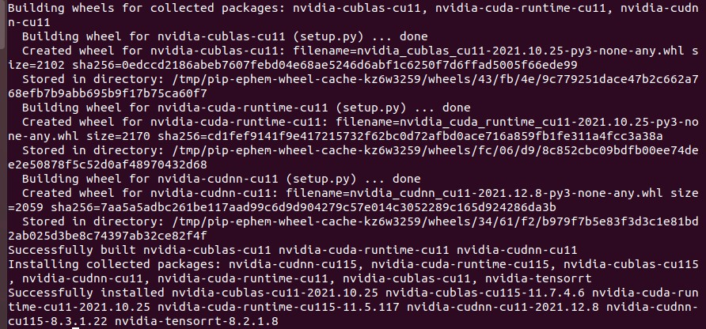

   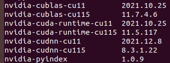

2. To verify that your installation is working, use the following Python commands to:

   - import the `tensorrt` Python module
   - Confirm that the correct version of TensorRT has been installed
   - Create a `Builder` object to verify that your CUDA install is working

   ```python
   import tensorrt
   print(tensorrt.__version__)
   assert tensorrt.Builder(tensorrt.Logger())
   ```

   If the final Python command fails with an error message similar to the error message below, then you may not have the NVIDIA driver installed or the NVIDIA driver may not be working properly. If you are running inside a container, then try starting from one of the `nvidia/cuda:x.y-base-<os>` container.

   > ```sh
   > [TensorRT] ERROR: CUDA initialization failure with error 100. Please check your CUDA installation: ...
   > ```

   if the Python commands above worked, then you should now be able to run any of the TensorRT Python samples to further confirm that your TensorRT installation is working. 

## The TensorRT Ecosystem

TensorRT is a large and flexible project. It can handle a variety of conversion and deployment workflows, and which workflow is best for you will depend on your specific use case and problem setting.

TensorRT provides several options for deployment, but all workflows involve the conversion of your model to an optimized representation, which TensorRT refers to as an engine. Building a TensorRT workflow for your model involves picking the right deployment option, and the right combination of parameters for engine creation.

### 3.1 Basic TensorRT workflow

TensorRT users must follow five basic steps to convert and deploy their model:

Figure 2. the five basic steps to convert and deploy your model

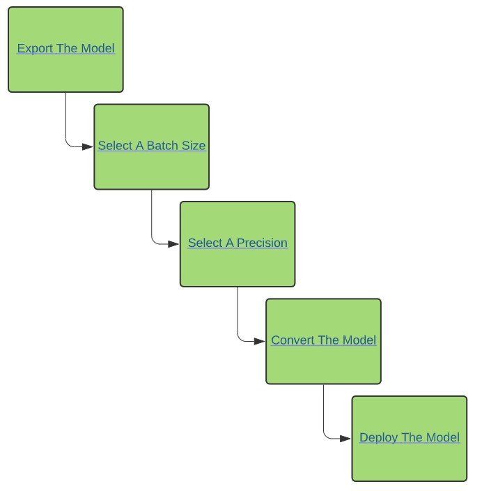

It is easiest to understand these steps in the context of a complete, end-to-end workflow: in [Example Deployment using ONNX](https://docs.nvidia.com/deeplearning/tensorrt/quick-start-guide/index.html#ex-deploy-onnx), we will convert a simple framework-agnostic deployment workflow to convert and deploy a trained ResNet-50 model to TensorRT using ONNX conversion and TensorRT's standalone runtime.

### 3.2 Conversion and Deployment Options

The TensorRT ecosystem breaks down into two parts:

1. The various paths users can follow to convert their models to optimized TensorRT engines.
2. The various runtimes users can target with TensorRT when deploying their optimized TensorRT engines

Figure 3. Main options available for conversion and deployment.


#### 3.2.1 Conversion

There are three main options for converting a model with TensorRT

- using TF-TRT
- automatic ONNX conversion from `.onnx` files
- manually constructing a network using the TensorRT API (either in C++ or Python)

A more performant option for automatic model conversion and depolyment is to convert using ONNX. ONNX is a framework agnostic option that works with models in TensorFlow, PyTorch, and more. TensorRT supports automatic conversion from ONNX files using either the TensorRT API, or `trtexec` - the latter being what we will use in this guide. ONNX conversion is all-or-nothing, meaning all operations in your model must be supported by TensorRT (or you must provide custom plugins for unsupoorted operations). The end result of ONNX conversion is a singular TensorRT engine that allows less overhead than using TF-TRT


#### 3.2.2 Deployment

There are three options for deploying a model with TensorRT

- deploying within TensorFlow
- using the standalone TensorRT runtime API
- using NVIDIA Triton Inference server

your choice for deployment will determine the steps required to convert the model. When using TF-TRT, the most common option for deployment is to simply deploy within TensorFlow. TF-TRT conversion results in a TensorFlow graph with TensorRT operations inserted into it. This means you can run TF-TRT models like you would any other tensorFlow model using Python.

### 3.3 Selecting the Correct workflow

Two of the most important factors in selecting how to convert and deploy your model are:

1. your choice of framework
2. your preferred TensorRT runtime to tartge.

The following flowchart convers the different workflows convered in this guide. This flowchart will help you select a path based on these two factors.

Figure 4. Flowchart for getting started with TensorRT

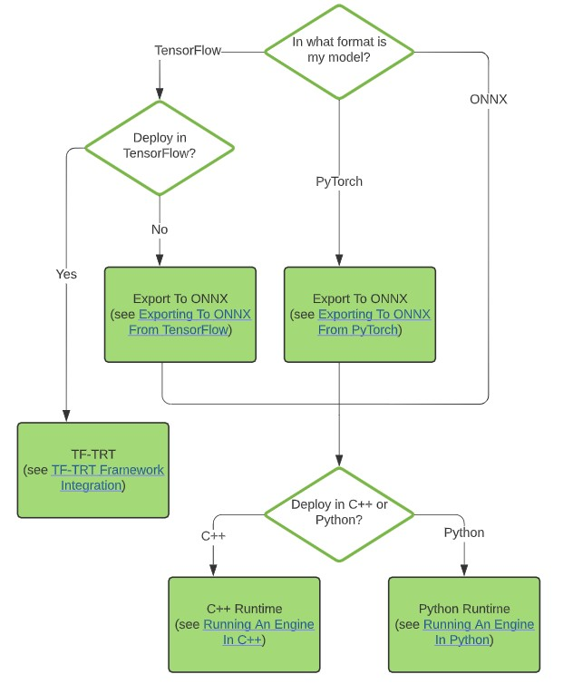

## 4. Example Deployment Using ONNX

ONNX conversion is generally the most performant way of automatically converting an ONNX model to a TensorRT engine. In this section, we will walk through the five basic steps of TensorRT conversion in the context of deploying a pretrained ONNX model.

For this example, we'll convert a pretrained ResNet-50 model from the ONNX model zoo via the ONNX format; a framework-agnostic model format that can be exported from most major frameworks, including TensorFlow and Pytorch. 

Figure 5. Deployment process using ONNX

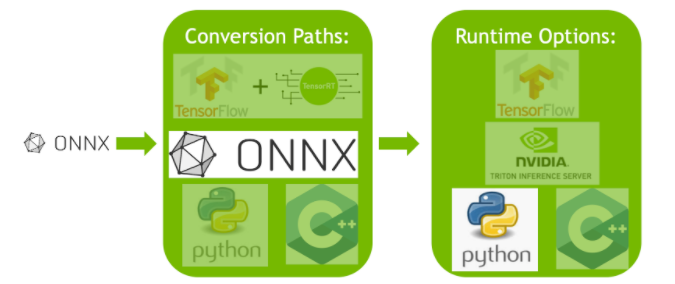

After you understand the basic steps of the TensorRT workflow, you can dive into the more in-depth Jupyter notebook (refer to the following topics) for using TensorRT via TF-TRT or ONNX. You can follow along in the introductory Jupyter notebook [here](https://github.com/NVIDIA/TensorRT/tree/main/quickstart/IntroNotebooks/0.%20Running%20This%20Guide.ipynb), which convers these workflow steps in more detail, using the TensorFlow framework

### 4.1 Export The Model

the two main automatic paths for TensorRT conversion require different model formats to successfully convert a model:

1. TF-TRT uses TensorFlow SaveModels.
2. The ONNX path requires that models are saved in ONNX

In this example, we are using ONNX, so we need an ONNX model. We are going to use ResNet-50; a basic backbone vision model that can be used for a variety of purposes. We will perform classification using a pretrained ResNet-50 ONNX model included with the [ONNX model zoo](https://github.com/onnx/models)

Download a pretrained ResNet-50 model from the ONNX model zoo using `wget and untar it`

```sh
wget https://s3.amazonaws.com/download.onnx/models/opset_8/resnet50.tar.gz
tar xzf resnet50.gz
```

This will unpack a pretrained ResNet-50 `'.onnx'` file to the path `resnet50/model.onnx`

### 4.2 Select A Batch size

Batch size can have a large effect on the optimizations TensorRT performs on our models. Generally speaking, at inference, we pick a small batch size when we want to prioritize latency and a larger batch size when we want to prioritize throughput. Larger batches take longer to process but reduce the average time spent on each sample.

TensorRT is capabale of handing the batch size dynamically if you dont know until runtime what batch size you will need. That said, a fixed batch size allows TensorRT to make additional optimization. For this example workflow, we use a fixed batch size of 64. For more information on handling dynamic input size

We set the batch size during the original export process to ONNX. This is demonstrated in the [Exporting to ONNX From PyTorch](https://docs.nvidia.com/deeplearning/tensorrt/quick-start-guide/index.html#export-from-pytorch) sections. the sample `model.onnx` file downloaded from the ONNX model zoo has its batch size set to 64 already. we will want to remember this when we deploy our model.

```python
BATCH_SIZE = 64
```

### 4.3 Select A precision

Inference typically requires less numeric precision than training. with some care, lower precision can give you faster computation and lower memory consumption without sacrificing any meaningful accuracy. TensorRT supports TF32, FP32, FP16 and INT8 precision. 

FP32 is the default training precision of most frameworks, so we will start by using FP32 for inference here.

```python
import numpy as np
PRECISION=np.float32
```

We set the precision that our TensorRT engine should use at runtime, which we will do in the next section.

### 4.4 Convert the model

the ONNX conversion path is one of the most universal and performant path for automatic TensorRT conversion. It works for TensorFlow, Pytorch, and many other framework

There are several tools to help you convert models from ONNX to a TensorRT engine. One common approach is to use `trtexec`- a command line tool included with TensorRT that can, among other things, convert ONNX models to TensorRT engines and profile them.

We can run this conversion as follows:

```sh
trtexec --onnx=resnet50/model.onnx --saveEngine=resent_engine.trt
```

This will convert our `resnet50/model.onnx` to a TensorRT engine named `resnet_engine.trt`

### 4.5 Deploy the model

After we have our TensorRT engine created successfully, we need to decide how to run it with TensorRT

there are two types of tensorRT runtimes: a standalone runtime which has c++ and Python bindings, and a native integration into TensorFlow. In this section, we will use a  simplified warpper (`ONNXClassifierWrapper`) which calls the standalone runtime. We will generate a batch of randomized "dummy" data and use our `ONNXClassifierWrapper` to run inference on that batch. For more information on TensorRT runtimes, refer to the [Understanding TensorRT Runtimes](https://github.com/NVIDIA/TensorRT/tree/main/quickstart/IntroNotebooks/5.%20Understanding%20TensorRT%20Runtimes.ipynb) jupyter notebook

1. set up the `ONNXClassifierWrapper` (using the precision we determined in before)

   ```python
   from onnx_helper import ONNXClassifierWrapper
   N_CLASSES = 100 # Our ResNet-50 is trained on a 100 class ImageNet task
   trt_model = ONNXClassifierWrapper("resnet_engine.trt",[BATCH_SIZE,N_CLASSES],target_dytpe=PRECISION)
   ```

2. Generate a dummy batch

   ```python
   BATCH_SIZE=32
   dummy_input_batch=np.zeros(Batch_size,224,224,3)
   ```

3. Feed a batch of data into our engine and get our predictions

   ```python
   predictions = trt_model.predict(dummy_input_batch)
   ```

Note that the wrapper does not load and initialize the engine until running the first batch, so this batch will generally take a while. 

## 5. Using The TensorRT Runtime API

One of the most performant and customizable options for both model conversion and deployment is to use the TensorRT API, which has both c++ and Python binding.

TensorRT includes a standalone runtime with c++ and Python bindings, which is generally more performant and more customizable than using the TF-TRT integration and running in the TensorFlow.  The C++ API has lower overhead. but the Python API works well with Python Python data loaders and libraries like Numpy and Scipy, and is easier to use for prototyping, debugging and testing.

The following tutorial illustrates semantic segmentation of images using the TensorRT C++ and Python API. A fully-convolutional model with ResNet-101 backbone is used for this task . The model accepts images of arbitrary sizes and produces per-pixel predictions.

The tutorial consists of the following steps:

1. setup - launch the test container, and generate the TensorRT engine from a Pytorch model exported to ONNX and converted using `trtexec`
2. C++ runtime API - run inference using engine and TensorRT's C++ API
3. Python runtime API - run inference using engine and TensorRT's Python API

### 5.1 Setting up the Test Container and Building the TensorRT Engine

#### Procedure

1. Download the source code for this quick start tutorial from the [TensorRT Open Source Software repository](http://github.com/NVIDIA/TensorRT)

2. Convert a [pre-trained FCN-ResNet-101](https://pytorch.org/hub/pytorch_vision_fcn_resnet101/) model from `torch.hub` to ONNX.

   Here we use the export script that's included with the tutorial to generate an ONNX model and save it to `fcn-resnet101.onnx`. For details on ONNX conversion refer to [ONNX Conversion And Deployment](https://docs.nvidia.com/deeplearning/tensorrt/quick-start-guide/index.html#onnx-export). The script also generates a [test images](https://pytorch.org/assets/images/deeplab1.png) of size 1282x1026 and saves it to `input.ppm`

   Figure 6. Test images, size 1282x1026

   

   a. Launch the NVIDIA PyTorch container for running the export script

   ```sh
   docker run --rm --it --gpus all -p 8888:8888 -v 'pwd':/workspace -w /workspace/SemanticSegmentation nvcr.io/nvidia/pytorch:20.12-py3 bash
   ```

   b. Run the export script to convert the pretrained model to ONNX

   ```sh
   python export.py
   ```

   Note: FCN-ResNet-101 has one input of dimension `[batch, 3, height,width]` and one output of dimension `[batch,21,height,weight]` containing unnormalized probabilities corresponding to predictions for 21 class labels. When exporting the model to ONNX, we append an `argmax` layer at the output to produce per-pixel class labels of highest probability

3. Build a TensorRT engine from ONNX using `trtexec` tool.

   `trtexec` can generate a TensorRT engine from an ONNX model which can then be deployed using the TensorRT runtime API.

    It leverages the [TesnsorRT ONNX parser](https://github.com/onnx/onnx-tensorrt) to load the onnx model into a TensorRT network graph, and the TensorRT Builder API to generate an optimized engine. Building an engine can be time-consuming, and is usually performed offline.

   ```python
   trtexec --onnx=fcn-resnet101.onnx --fp16 --workspace=64 --minShape=input:1x3x256x256 --optShape=input:1x3x1026x1282 --maxShape=input:1x3x1440x2560 --buildOnly --saveEngine=fcn-resnet101.engine
   ```

   Successful execution should result in an engine file being generated and see something similar to `Successful` in the command output

   `trtexec` can build TensorRT engines with the following build configuration options:

   - `--fp16` enables FP16 precision precision for layer that suport it, in addition to FP32. For more information, refer to the [Working With Mixed Precision](https://docs.nvidia.com/deeplearning/tensorrt/developer-guide/index.html#mixed_precision) section in the NVIDIA TensorRT Developer Guide.
   - `--int8`: enables INT8 precision for layers that support it, in addition to FP32.
   - `--best`: enables all supported precisions to achieve the best performance for every layer.
   - `--workspace`: controls the maximum amount of persistent scratch memory available (in MB) for algorithms considered by the builder. This should be set as high as possible for a given platform based on availability. at runtime TensorRT will allocate only what is required, not exceeding the max.
   - `--minShapes` and `--maxShape` specify the range of dimensions for each network input and  `--optShapes` specifies the dimensions that the auto-tuner should use for optimization. 
   - `--buildOnly`: requests that inference performance measurements be skipped.
   - `--saveEngine`: specifies the file into which the serialized engine must be saved.
   - `--safe`: enables building safety certified engines. This switch is used for prototyping automotive safety restricted flows in the TensorRT safe runtime.
   - `--tacticSources`: can be used to add or remove tactics from the default tactic sources(cuDNN, cuBLAS, cuBLASLt)
   - `--minTiming` and `--avgTiming`: respectively set the minimum and average number of iterations used in tactic selection
   - `--noBuilderCache`: disables the layer timing cache in the TensorRT builder. The timing cache helps to reduce the time taken in the builder phase by caching the layer profiling information and should work for most cases
   - `--timingCacheFile`: can be used to save or load the serialized global timing caches.

4. Optionally, validate the generated engine for random-valued  input using `trtexec`

   ```sh
   trtexec --shapes=input:1x3x1026x1282 -loadEngine=fcn-resnet101.engine
   ```

   Where `--shapes` sets input sizes for the dynamic shaped inputs to be used for inference.

   if successful, you should see something similar to the following

   ```sh
   &&&& PASSED TensorRT.trtexec #trtexec --shapes=input:1x3x1026x1282 -loadEngine=fcn-resnet101.engine
   ```

### 5.2 Running An Engine In Python

1. install the required Python packages

   ```sh
   pip install pycuda
   ```

2. Launch jupyter and use the provided token to login using a browser http://<host-ip-address>:8888

   ```sh
   jupyter notebook --port=8888 --no-browser --ip=0.0.0.0 --allow-root
   ```

3. Open the [tutorial-runtime.ipynb](https://github.com/NVIDIA/TensorRT/blob/main/quickstart/SemanticSegmentation/tutorial-runtime.ipynb) notebook and follow its steps

## 6. Upgrading TensorRT

Upgrading TensorRT to the latest version is only supported when the currently installed TensorRT version is equal to or newer than the last two public GA releases. For example, TensorRT 8.2.x supportes upgrading from TensorRT 7.2.x and 8.0.x. if you want to upgrade from an unsupported version, then you should upgrade incrementally until you reach the latest version of TensorRT. if you have an EA version of TensorRT installed, you should first upgrade to the corresponding GA version.

## upgrading from TensorRT7.2.x to TensorRT 8.2.x

These upgrade instructions are for ubuntu and windows users only. When upgrading from TensorRT 7.2.x to TensorRT 8.2.x, ensure you are familiar with the following

**Using a tar file**

if you are upgrading using the tar file installation method, then install TensorRT into a new location. Tar file installations can support multiple use cases including having a full installation of TensorRT 7.2.x and documentation side-by-side with a full installation of TensorRT 8.2.x. If the intention is to have the new version of TensorRT replace the old version, then the old version should be removed once the new version is verified

if installing a tar file on a system where the previously installed version was from a Debian package, note that the tar file installation will not remove the previously installed packages. Unless a side-by-side installation is desired, it would be best to remove the previously installed `libvinfer 8, libninfer 8, libnvinfer-dev, libnvinfer-samples`, and other related packages to avoid confusion.

**using a zip file**

if you are upgrading using the zip file installation method, then install TensorRT into a new location. Zip file installations can support multiple use cases including having a full installation of TensorRT 7.2.x with headers and documentation side-by-side with a full installation of TensorRT 8.2.x. If the intention is to have the new version of TensorRT replace the old version, then the old version should be removed once the new version is verified

After unzipping the new version of TensorRT you will need to either update the `PATH` environment variable to point to the new install location or copy the DLL files to the location where you previously installed the TensorRT libraries. 


## Windows install tensorrt

1. download [TensorRT-8.2.1.8.Windows10.x86_64.cuda-10.2.cudnn8.2](https://developer.nvidia.com/compute/machine-learning/tensorrt/secure/8.2.1/zip/tensorrt-8.2.1.8.windows10.x86_64.cuda-10.2.cudnn8.2.zip)

2. 下载完成后，解压, 进行相关配置。

   1. 将` TensorRT-8.2.1.8\include`中`头文件` copy 到`C:\Program Files\NVIDIA GPU Computing Toolkit\CUDA\v10.1\include`
   2. 将`TensorRT-8.2.1.8\lib` 中所有`lib`文件 copy 到`C:\Program Files\NVIDIA GPU Computing Toolkit\CUDA\v10.1\lib\x64`
   3. 将`TensorRT-8.2.1.8\lib` 中所有`dll`文件copy 到`C:\Program Files\NVIDIA GPU Computing Toolkit\CUDA\v10.1\bin`

3. 安装`uff`和`graphsurgeon`: if your are using TensorFlow or PyTorch, install the `uff, graphsurgeon, onnx_graphsurgeon` wheel packages. You must prepare the Python environment before installing `uff, graphsurgeon, onnx_graphsurgeon`

   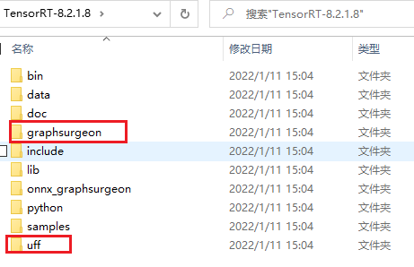

   ```sh
   pip install graphsurgeon-0.4.5-py2.py3-none-any.whl
   pip install uff-0.6.9-py2.py3-none-any.whl
   ```

4. pip安装TensorRT

   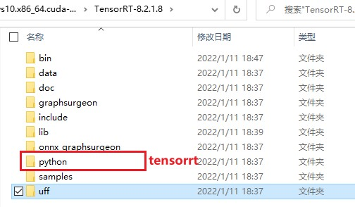

   ```sh
   pip install tensorrt-8.2.1.8-cp37-none-win_amd64.whl
   ```

5. python测试

   ```python
   import tensorrt
   print(tensorrt.__version__)
   assert tensorrt.Builder(tensorrt.Logger())
   ```

6. To verify that your installation is working you should open a visual studio solution from one of the samples, such as `sampleMNIST`, and confirm that you are able to build and run the sample. If you want to use TensorRT in your own project, ensure that the following is present in your visual studio solution project properties:

7. 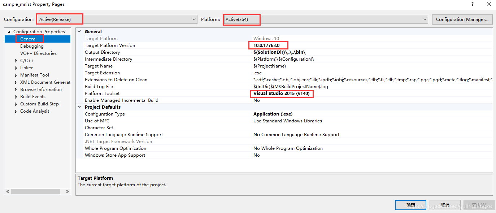

   1. `<installpath>/lib` has been added to your `PATH` variable and present under **VC++ Directories > Executable Directories**

      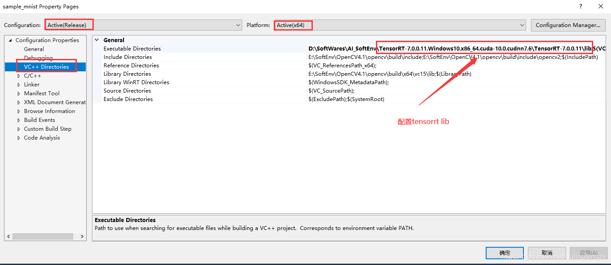

   2. `<installpath>/include` is present under **C/C++ > General > AdditionalDirectories.**

      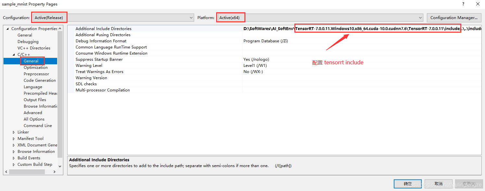

   3. `nvinfer.lib` and any other `LIB` files that your project requires are present under **Linker > Input > Additional Dependencies**

      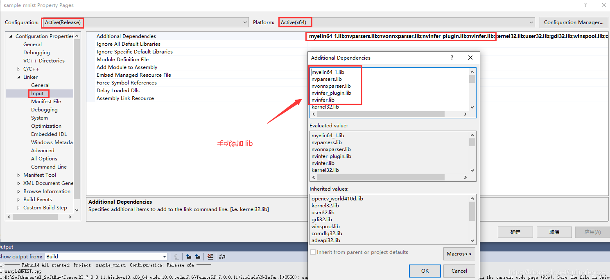

      **Note:** In order to build the included samples, your should have 'visual studio 2017' installed. The community edition is sufficient to build the TensorRT samples.

   4. result

      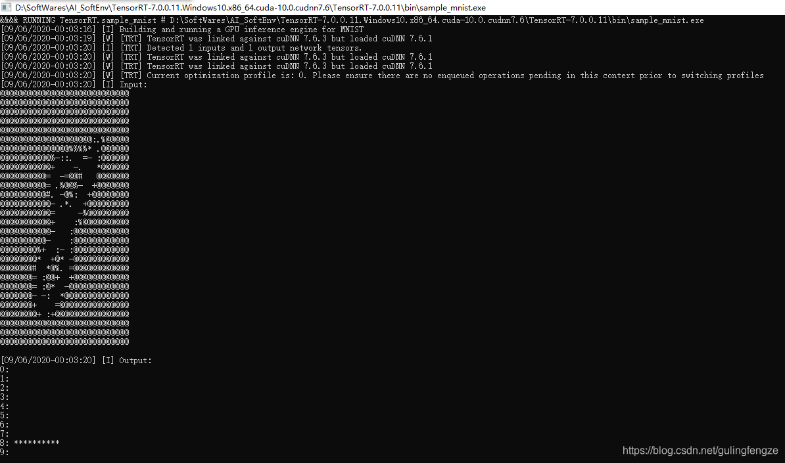

## Question

1. [Visual Studio Platform 2015 Toolset ='v141' cannot be found](https://stackoverflow.com/questions/43312676/visual-studio-platform-2015-toolset-v141-cannot-be-found)

> I had such an issue. The solution is: open menu "Project"->Properties->Configuration Properites->General - and choose platform toolset v140.