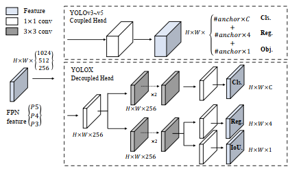
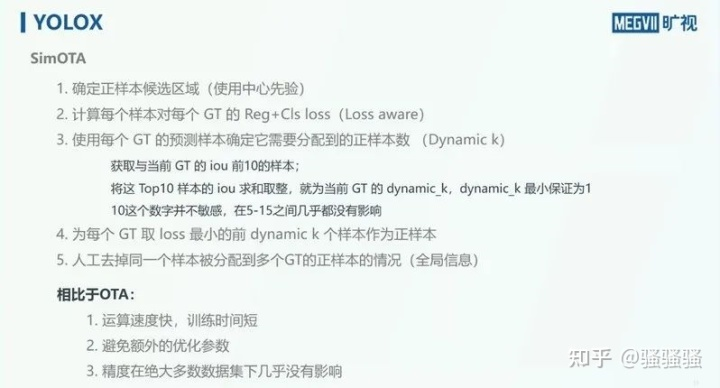

# YOLOX

We switch the YOLO detector to an anchor-free manner and condu ct other advanced detection techniques, i.e., a decoupled head and the leading label assignment strategy SimOTA.

YOLOV5 holds the best trade-off performance with 48.2% AP on COCO at 13.7 ms.

**Implementation details**

1. They use stochastic gradient descent (SGD) for training.
2. They use a learning rate of lrxBatchSize/64 (linear scaling), with a initial lr=0.01 and consine lr schedule.
3. The weight decay is 0.0005 and the SGD momentum is 0.9
4. The input size is evenly drawn from 448 to 832 with 32 strides.
5. They use BCE Loss for training cls and obj branch, and IoU Loss for training reg branch.
6. They use BCE Loss for training cls and obj branch, and IoU Loss for training reg branch.

**Decoupled head**

In the object detection, the conflict between classification and regression task is a well-known problem.

1) Replacing YOLO's head with a decoupled one greatly improves the converging speed.
2) The decoupled head is essential to the end-to-end version of YOLO. The end-to-end property decreases by 4.2% AP with the coupled head, while the decreasing reduces to 0.8% AP for a decoupled head.
3) yolox contains a 1x1 conv layer to reduce the channel dimension, followed by two parallel branches with two 3x3 conv layers respectively.

> Illustration of the different between YOLOV3 head and the proposed decoupled head. For each level of FPN feature, we first adopt a 1x1 conv layer to reduce the feature channel to 256 and then add two parallel branches with two 3x3 conv layers each for classification and regression tasks respectively. IoU branch is added on the regression branch.

**Anchor-free**

Both YOLOV4 and V5 follow the original anchor-based pipeline of YOLOV3. However, the anchor mechanism has many konwn problems. First, to achieve optimal detection performance, one needs to conduct clustering analysis to determine a set of optimal anchors before training. Those clustered anchors are domain-specific and less generalized. Second, anchor mechanism increases the complexity of detection heads, as well as the number of predictions for each image.

Anchor-free detectors have developed rapidly in the past two year. These works have shown that the performance of anchor-free detectors can be on par with anchor-based detectors. Anchor-free machanism significantly reduces the number of design parameters which need heuristic tuning and many tricks involved (e.g. Anchor Clustering , Grid Sensitive) for good performance, making the detector, especially its training and decoding phase, considerably simple.

Swithing YOLO to an anchor-free manner is quite simple. We reduce the predictions for each location from 3 to 1 and make them directly predict four values.

**Multi positive**

To be consistent with the assigning rule of YOLOv3, the above anchor-free version selects only One positive sample (the center location) for each object mean while ignores other high quality prediction. However, optimizing those high quality predictions may also bring beneficial gradients,  which may alleviates the extreme imbalance of positive/negative sampling during training. We simply assigns the center 3x3 area as positives, also named "center sampling" in FCOS. 

**SimOTA**

Based on our own study OTA, we conclude four key insights for an advanced label assignment: 1) loss/quality aware. 2) center prior. 3) dynamic number of positive anchors for each ground-truth (abbreviated as dynamic top-k) 4). global view.

SimOTA not only reduces the training time but also avoids additional solver hyperparameters in SinkhornKnopp algorithm.

**Modified CSPNet in YOLOv5** To give a fair comparison, we adopt the exact YOLOv5's backbone including modified CSPNet, SiLU activation, and the PAN head. 

## Benchmark

#### Standard Models.

| Model                                                        | size | mAPval 0.5:0.95 | mAPtest 0.5:0.95 | Speed V100 (ms) | Params (M) | FLOPs (G) | weights                                                      |
| ------------------------------------------------------------ | ---- | --------------- | ---------------- | --------------- | ---------- | --------- | ------------------------------------------------------------ |
| [YOLOX-s](https://github.com/Megvii-BaseDetection/YOLOX/blob/main/exps/default/yolox_s.py) | 640  | 40.5            | 40.5             | 9.8             | 9.0        | 26.8      | [github](https://github.com/Megvii-BaseDetection/YOLOX/releases/download/0.1.1rc0/yolox_s.pth) |
| [YOLOX-m](https://github.com/Megvii-BaseDetection/YOLOX/blob/main/exps/default/yolox_m.py) | 640  | 46.9            | 47.2             | 12.3            | 25.3       | 73.8      | [github](https://github.com/Megvii-BaseDetection/YOLOX/releases/download/0.1.1rc0/yolox_m.pth) |
| [YOLOX-l](https://github.com/Megvii-BaseDetection/YOLOX/blob/main/exps/default/yolox_l.py) | 640  | 49.7            | 50.1             | 14.5            | 54.2       | 155.6     | [github](https://github.com/Megvii-BaseDetection/YOLOX/releases/download/0.1.1rc0/yolox_l.pth) |
| [YOLOX-x](https://github.com/Megvii-BaseDetection/YOLOX/blob/main/exps/default/yolox_x.py) | 640  | 51.1            | **51.5**         | 17.3            | 99.1       | 281.9     | [github](https://github.com/Megvii-BaseDetection/YOLOX/releases/download/0.1.1rc0/yolox_x.pth) |
| [YOLOX-Darknet53](https://github.com/Megvii-BaseDetection/YOLOX/blob/main/exps/default/yolov3.py) | 640  | 47.7            | 48.0             | 11.1            | 63.7       | 185.3     | [gith](https://github.com/Megvii-BaseDetection/YOLOX/releases/download/0.1.1rc0/yolox_darknet.pth) |

#### Light Models.

| Model                                                        | size | mAPval 0.5:0.95 | Params (M) | FLOPs (G) | weights                                                      |
| ------------------------------------------------------------ | ---- | --------------- | ---------- | --------- | ------------------------------------------------------------ |
| [YOLOX-Nano](https://github.com/Megvii-BaseDetection/YOLOX/blob/main/exps/default/nano.py) | 416  | 25.8            | 0.91       | 1.08      | [github](https://github.com/Megvii-BaseDetection/YOLOX/releases/download/0.1.1rc0/yolox_nano.pth) |
| [YOLOX-Tiny](https://github.com/Megvii-BaseDetection/YOLOX/blob/main/exps/default/yolox_tiny.py) | 416  | 32.8            | 5.06       | 6.45      | [github](https://github.com/Megvii-BaseDetection/YOLOX/releases/download/0.1.1rc0/yolox_tiny.pth) |