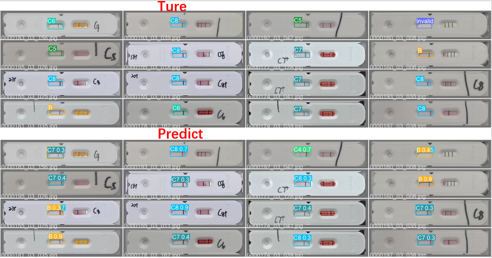
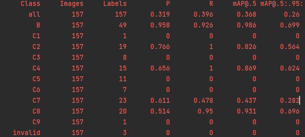

# YOLOV5_baseline

## 评估指标

输入: 万孚新冠抗原检测试剂卡图像

要求: 每张输入图像上, 仅输出一个置信度得分最大的检测结果, 且该置信度大于基础得分.

- 混淆矩阵
- Recall(所有测试集中, 各类别的召回率)
- anti_postitive_ratio

**实例**

label=[C,B,C,B,B]

pred=[B,B,C,C,B]

| P\T  | B    | C    |
| ---- | ---- | ---- |
| B    | 2    | 1    |
| C    | 1    | 1    |

$$
Recall_B=\frac{2}{3}\\
Recall_C=\frac{1}{2}
$$

$$
precision_B=\frac{2}{3}\\
precision_C=\frac{1}{2}
$$

